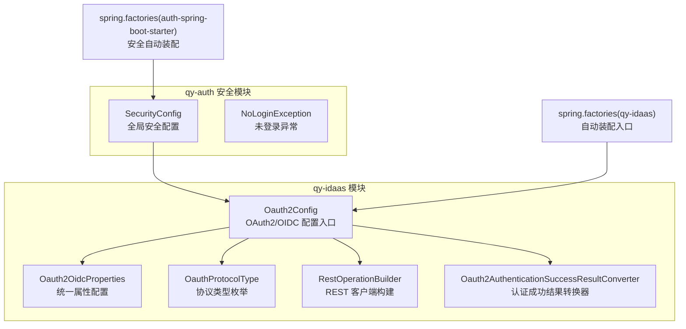
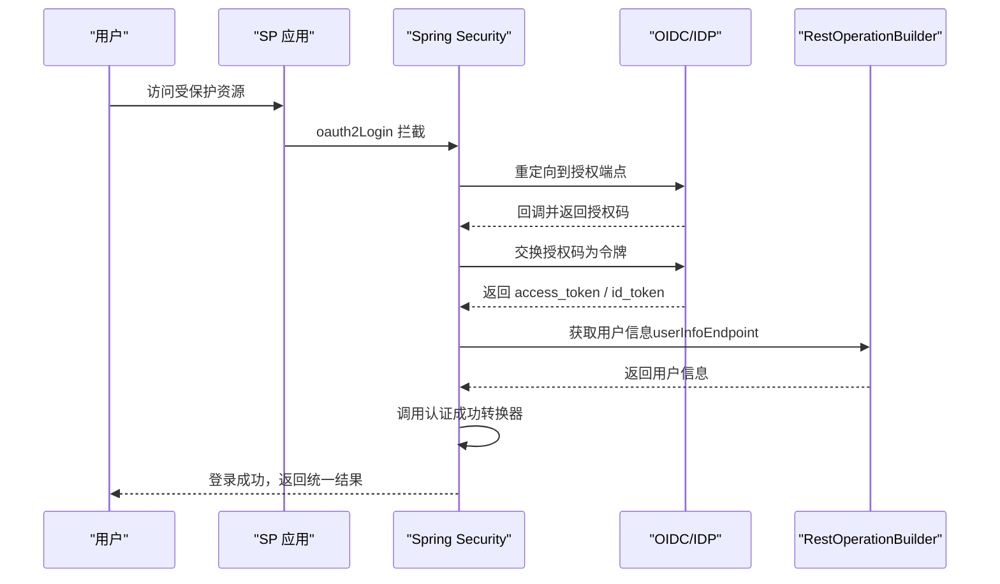
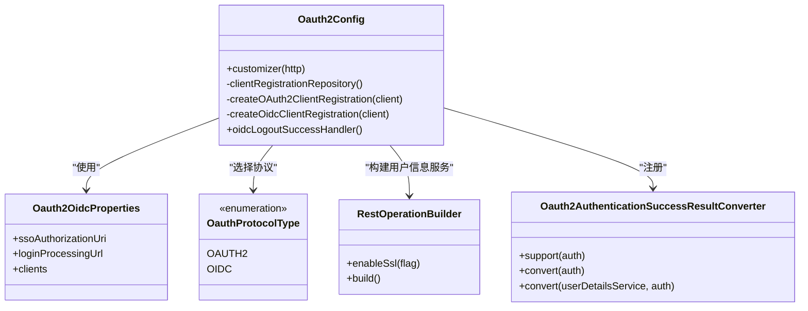
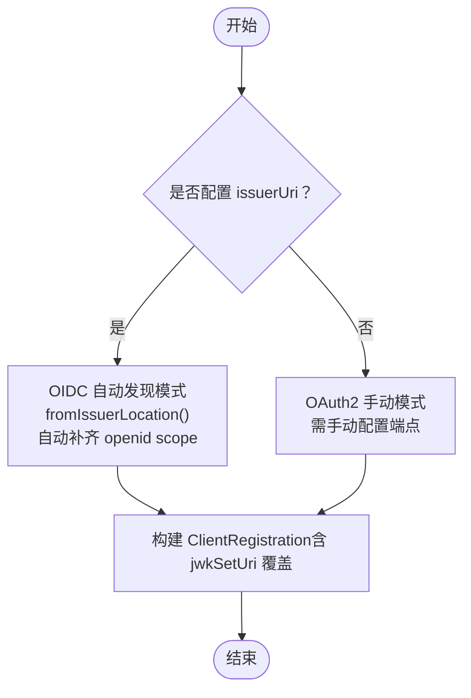
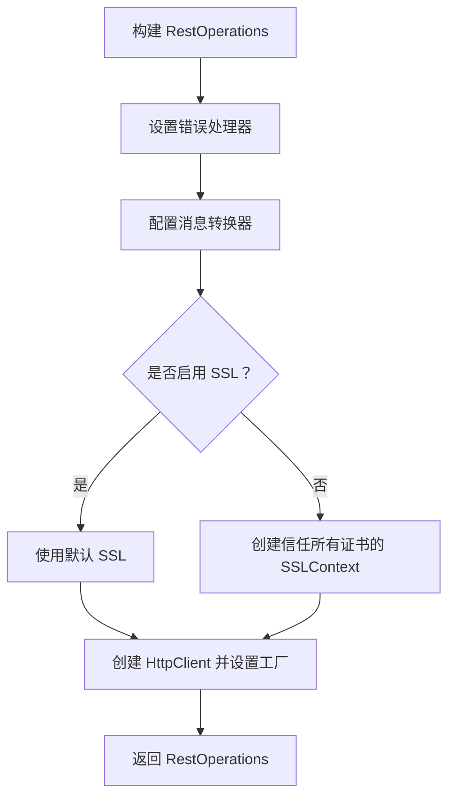
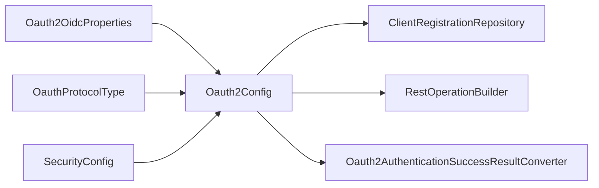

# OAuth2 支持

<cite>
**本文引用的文件**
- [Oauth2Config.java](file://qy-idaas/idaas-authentications/src/main/java/com/kewen/framework/idaas/oauth2/Oauth2Config.java)
- [Oauth2OidcProperties.java](file://qy-idaas/idaas-authentications/src/main/java/com/kewen/framework/idaas/oauth2/Oauth2OidcProperties.java)
- [OauthProtocolType.java](file://qy-idaas/idaas-authentications/src/main/java/com/kewen/framework/idaas/oauth2/OauthProtocolType.java)
- [RestOperationBuilder.java](file://qy-idaas/idaas-authentications/src/main/java/com/kewen/framework/idaas/oauth2/RestOperationBuilder.java)
- [Oauth2AuthenticationSuccessResultConverter.java](file://qy-idaas/idaas-authentications/src/main/java/com/kewen/framework/idaas/oauth2/result/Oauth2AuthenticationSuccessResultConverter.java)
- [SecurityConfig.java](file://qy-auth/auth-spring-boot-starter/src/main/java/com/kewen/framework/auth/security/config/SecurityConfig.java)
- [NoLoginException.java](file://qy-auth/auth-spring-boot-starter/src/main/java/com/kewen/framework/auth/security/exception/NoLoginException.java)
- [oidc接入踩坑记录.md](file://docs/过程文件/oidc接入踩坑记录.md)
- [README.md](file://qy-idaas/README.md)
- [spring.factories（qy-idaas）](file://qy-idaas/idaas-authentications/src/main/resources/META-INF/spring.factories)
- [spring.factories（auth-spring-boot-starter）](file://qy-auth/auth-spring-boot-starter/src/main/resources/META-INF/spring.factories)
</cite>

## 目录
1. [简介](#简介)
2. [项目结构](#项目结构)
3. [核心组件](#核心组件)
4. [架构总览](#架构总览)
5. [组件详细分析](#组件详细分析)
6. [依赖关系分析](#依赖关系分析)
7. [性能与安全考量](#性能与安全考量)
8. [故障排查指南](#故障排查指南)
9. [结论](#结论)
10. [附录](#附录)

## 简介
本技术文档围绕 OAuth2 认证协议支持模块，系统讲解以下主题：
- OAuth2Config 配置类的设计与客户端注册、授权类型、重定向 URI 的配置要点
- Oauth2OidcProperties 属性配置，包括 OpenID Connect 扩展能力与自动发现机制
- OauthProtocolType 枚举的使用与 OAuth2/OIDC 的区别
- RestOperationBuilder 的 REST 操作构建机制与 SSL 配置
- Oauth2AuthenticationSuccessResultConverter 的认证成功结果转换器实现
- 完整的配置示例与使用方法（客户端凭证模式、授权码模式等）
- 安全考虑、令牌管理与错误处理机制

## 项目结构
OAuth2 支持模块位于 qy-idaas/idaas-authentications 下，配合 qy-auth 的安全配置共同工作。关键文件如下：
- OAuth2 配置与属性：Oauth2Config、Oauth2OidcProperties、OauthProtocolType
- REST 客户端构建：RestOperationBuilder
- 成功结果转换器：Oauth2AuthenticationSuccessResultConverter
- 自动装配入口：spring.factories（qy-idaas 与 auth-spring-boot-starter）

图表来源
- [Oauth2Config.java:46-225](file://qy-idaas/idaas-authentications/src/main/java/com/kewen/framework/idaas/oauth2/Oauth2Config.java#L46-L225)
- [Oauth2OidcProperties.java:24-251](file://qy-idaas/idaas-authentications/src/main/java/com/kewen/framework/idaas/oauth2/Oauth2OidcProperties.java#L24-L251)
- [OauthProtocolType.java:7-10](file://qy-idaas/idaas-authentications/src/main/java/com/kewen/framework/idaas/oauth2/OauthProtocolType.java#L7-L10)
- [RestOperationBuilder.java:30-93](file://qy-idaas/idaas-authentications/src/main/java/com/kewen/framework/idaas/oauth2/RestOperationBuilder.java#L30-L93)
- [Oauth2AuthenticationSuccessResultConverter.java:16-44](file://qy-idaas/idaas-authentications/src/main/java/com/kewen/framework/idaas/oauth2/result/Oauth2AuthenticationSuccessResultConverter.java#L16-L44)
- [SecurityConfig.java:34-134](file://qy-auth/auth-spring-boot-starter/src/main/java/com/kewen/framework/auth/security/config/SecurityConfig.java#L34-L134)
- [spring.factories（qy-idaas）:1-3](file://qy-idaas/idaas-authentications/src/main/resources/META-INF/spring.factories#L1-L3)
- [spring.factories（auth-spring-boot-starter）:1-6](file://qy-auth/auth-spring-boot-starter/src/main/resources/META-INF/spring.factories#L1-L6)

章节来源
- [Oauth2Config.java:46-225](file://qy-idaas/idaas-authentications/src/main/java/com/kewen/framework/idaas/oauth2/Oauth2Config.java#L46-L225)
- [Oauth2OidcProperties.java:24-251](file://qy-idaas/idaas-authentications/src/main/java/com/kewen/framework/idaas/oauth2/Oauth2OidcProperties.java#L24-L251)
- [OauthProtocolType.java:7-10](file://qy-idaas/idaas-authentications/src/main/java/com/kewen/framework/idaas/oauth2/OauthProtocolType.java#L7-L10)
- [RestOperationBuilder.java:30-93](file://qy-idaas/idaas-authentications/src/main/java/com/kewen/framework/idaas/oauth2/RestOperationBuilder.java#L30-L93)
- [Oauth2AuthenticationSuccessResultConverter.java:16-44](file://qy-idaas/idaas-authentications/src/main/java/com/kewen/framework/idaas/oauth2/result/Oauth2AuthenticationSuccessResultConverter.java#L16-L44)
- [SecurityConfig.java:34-134](file://qy-auth/auth-spring-boot-starter/src/main/java/com/kewen/framework/auth/security/config/SecurityConfig.java#L34-L134)
- [spring.factories（qy-idaas）:1-3](file://qy-idaas/idaas-authentications/src/main/resources/META-INF/spring.factories#L1-L3)
- [spring.factories（auth-spring-boot-starter）:1-6](file://qy-auth/auth-spring-boot-starter/src/main/resources/META-INF/spring.factories#L1-L6)

## 核心组件
- OAuth2/OIDC 配置入口：Oauth2Config，实现 HttpSecurityCustomizer，注入 oauth2Login 配置，支持多客户端注册与 OIDC 自动发现。
- 统一属性配置：Oauth2OidcProperties，集中管理授权端点、令牌端点、用户信息端点、重定向模板、作用域、JWK 等。
- 协议类型：OauthProtocolType，区分 OAuth2 与 OIDC。
- REST 客户端：RestOperationBuilder，封装 Apache HttpClient，支持 SSL 跳过与错误处理。
- 成功结果转换器：Oauth2AuthenticationSuccessResultConverter，将 OAuth2User 转换为统一 JsonSuccessResult。

章节来源
- [Oauth2Config.java:46-225](file://qy-idaas/idaas-authentications/src/main/java/com/kewen/framework/idaas/oauth2/Oauth2Config.java#L46-L225)
- [Oauth2OidcProperties.java:24-251](file://qy-idaas/idaas-authentications/src/main/java/com/kewen/framework/idaas/oauth2/Oauth2OidcProperties.java#L24-L251)
- [OauthProtocolType.java:7-10](file://qy-idaas/idaas-authentications/src/main/java/com/kewen/framework/idaas/oauth2/OauthProtocolType.java#L7-L10)
- [RestOperationBuilder.java:30-93](file://qy-idaas/idaas-authentications/src/main/java/com/kewen/framework/idaas/oauth2/RestOperationBuilder.java#L30-L93)
- [Oauth2AuthenticationSuccessResultConverter.java:16-44](file://qy-idaas/idaas-authentications/src/main/java/com/kewen/framework/idaas/oauth2/result/Oauth2AuthenticationSuccessResultConverter.java#L16-L44)

## 架构总览
OAuth2 支持模块通过 Spring Security 的 oauth2Login 与 OIDC 的 OidcUserService 协同工作，结合自定义 REST 客户端与结果转换器，完成从授权请求、令牌交换、用户信息获取到登录成功的全流程。

图表来源
- [Oauth2Config.java:90-125](file://qy-idaas/idaas-authentications/src/main/java/com/kewen/framework/idaas/oauth2/Oauth2Config.java#L90-L125)
- [RestOperationBuilder.java:41-73](file://qy-idaas/idaas-authentications/src/main/java/com/kewen/framework/idaas/oauth2/RestOperationBuilder.java#L41-L73)
- [Oauth2AuthenticationSuccessResultConverter.java:16-44](file://qy-idaas/idaas-authentications/src/main/java/com/kewen/framework/idaas/oauth2/result/Oauth2AuthenticationSuccessResultConverter.java#L16-L44)

## 组件详细分析

### OAuth2Config：OAuth2/OIDC 配置入口
- 功能要点
  - 实现 HttpSecurityCustomizer，注入 oauth2Login 配置
  - 支持多客户端注册（InMemoryClientRegistrationRepository）
  - 支持 OIDC 自动发现（fromIssuerLocation），自动补齐 openid scope
  - 自定义 OAuth2UserService 以支持跳过 SSL 校验
  - 提供 OIDC 客户端发起登出处理器（OidcClientInitiatedLogoutSuccessHandler）

- 关键配置点
  - 授权端点 baseUri、回调处理端点、令牌交换客户端、用户信息服务
  - 多客户端注册与协议类型选择（OAuth2/OIDC）
  - OIDC 自动发现与 JWK 配置覆盖

图表来源
- [Oauth2Config.java:46-225](file://qy-idaas/idaas-authentications/src/main/java/com/kewen/framework/idaas/oauth2/Oauth2Config.java#L46-L225)
- [Oauth2OidcProperties.java:24-251](file://qy-idaas/idaas-authentications/src/main/java/com/kewen/framework/idaas/oauth2/Oauth2OidcProperties.java#L24-L251)
- [OauthProtocolType.java:7-10](file://qy-idaas/idaas-authentications/src/main/java/com/kewen/framework/idaas/oauth2/OauthProtocolType.java#L7-L10)
- [RestOperationBuilder.java:30-93](file://qy-idaas/idaas-authentications/src/main/java/com/kewen/framework/idaas/oauth2/RestOperationBuilder.java#L30-L93)
- [Oauth2AuthenticationSuccessResultConverter.java:16-44](file://qy-idaas/idaas-authentications/src/main/java/com/kewen/framework/idaas/oauth2/result/Oauth2AuthenticationSuccessResultConverter.java#L16-L44)

章节来源
- [Oauth2Config.java:46-225](file://qy-idaas/idaas-authentications/src/main/java/com/kewen/framework/idaas/oauth2/Oauth2Config.java#L46-L225)

### Oauth2OidcProperties：统一属性配置
- 设计原则
  - OAuth2 与 OIDC 共享同一套属性模型，通过 protocolType 区分
  - 支持两种模式：手动端点配置（OAuth2 手动模式）与 OIDC 自动发现
  - OIDC 模式下自动补齐 openid scope，并支持 jwkSetUri 覆盖

- 关键配置项
  - 全局端点：ssoAuthorizationUri、loginProcessingUrl
  - 客户端列表：clients，每项包含 registrationId、clientId、clientSecret、clientAuthenticationMethod、authorizationGrantType、redirectUriTemplate、scopes、issuerUri、authorizationUri、tokenUri、userInfoUri、userInfoAuthenticationMethod、userNameAttributeName、jwkSetUri、configurationMetadata、clientName、ignoreSsl
  - 协议类型：protocolType（OAUTH2/OIDC）

图表来源
- [Oauth2OidcProperties.java:24-251](file://qy-idaas/idaas-authentications/src/main/java/com/kewen/framework/idaas/oauth2/Oauth2OidcProperties.java#L24-L251)
- [Oauth2Config.java:126-205](file://qy-idaas/idaas-authentications/src/main/java/com/kewen/framework/idaas/oauth2/Oauth2Config.java#L126-L205)

章节来源
- [Oauth2OidcProperties.java:24-251](file://qy-idaas/idaas-authentications/src/main/java/com/kewen/framework/idaas/oauth2/Oauth2OidcProperties.java#L24-L251)

### OauthProtocolType：协议类型枚举
- 用途：在客户端注册时区分 OAuth2 与 OIDC，驱动不同的 ClientRegistration 构建逻辑
- 适用场景：OAuth2 手动模式（需配置授权/令牌/用户信息端点）与 OIDC 自动发现模式（通过 issuerUri 自动发现）

章节来源
- [OauthProtocolType.java:7-10](file://qy-idaas/idaas-authentications/src/main/java/com/kewen/framework/idaas/oauth2/OauthProtocolType.java#L7-L10)

### RestOperationBuilder：REST 操作构建机制
- 设计目标：为 OAuth2/OIDC 用户信息服务提供可配置的 HTTP 客户端，支持跳过 SSL 校验（仅测试环境）
- 关键特性
  - 设置错误处理器（OAuth2ErrorResponseErrorHandler）
  - 配置消息转换器（String、MappingJackson2）
  - 启用重定向跟随（LaxRedirectStrategy）
  - 可选的 SSL 上下文（信任所有证书、忽略主机名校验）

图表来源
- [RestOperationBuilder.java:30-93](file://qy-idaas/idaas-authentications/src/main/java/com/kewen/framework/idaas/oauth2/RestOperationBuilder.java#L30-L93)

章节来源
- [RestOperationBuilder.java:30-93](file://qy-idaas/idaas-authentications/src/main/java/com/kewen/framework/idaas/oauth2/RestOperationBuilder.java#L30-L93)

### Oauth2AuthenticationSuccessResultConverter：认证成功结果转换器
- 作用：将 OAuth2User 转换为统一的 JsonSuccessResult，包含 name、昵称、用户名、手机号、邮箱、头像、性别、认证对象等属性
- 适用性：仅对 OAuth2User 类型的认证生效；同时支持通过 UserDetailsService 转换为 SecurityUser

章节来源
- [Oauth2AuthenticationSuccessResultConverter.java:16-44](file://qy-idaas/idaas-authentications/src/main/java/com/kewen/framework/idaas/oauth2/result/Oauth2AuthenticationSuccessResultConverter.java#L16-L44)

### 自动装配与安全配置
- 自动装配
  - qy-idaas 的 spring.factories 将 Oauth2Config 与 SamlConfig 自动装配
  - auth-spring-boot-starter 的 spring.factories 将 SecurityConfig 等安全配置自动装配
- 安全配置
  - SecurityConfig 组织全局安全策略，注入 HttpSecurityCustomizer（包括 Oauth2Config）
  - 提供未登录异常类型（NoLoginException）

章节来源
- [spring.factories（qy-idaas）:1-3](file://qy-idaas/idaas-authentications/src/main/resources/META-INF/spring.factories#L1-L3)
- [spring.factories（auth-spring-boot-starter）:1-6](file://qy-auth/auth-spring-boot-starter/src/main/resources/META-INF/spring.factories#L1-L6)
- [SecurityConfig.java:34-134](file://qy-auth/auth-spring-boot-starter/src/main/java/com/kewen/framework/auth/security/config/SecurityConfig.java#L34-L134)
- [NoLoginException.java:1-15](file://qy-auth/auth-spring-boot-starter/src/main/java/com/kewen/framework/auth/security/exception/NoLoginException.java#L1-L15)

## 依赖关系分析
- Oauth2Config 依赖 Oauth2OidcProperties 与 OauthProtocolType，动态构建 ClientRegistration
- Oauth2Config 通过 RestOperationBuilder 注入 OAuth2UserService/OidcUserService 的 HTTP 客户端
- Oauth2Config 注册 Oauth2AuthenticationSuccessResultConverter 以统一认证成功响应
- SecurityConfig 通过 HttpSecurityCustomizer 机制加载 Oauth2Config，形成完整的安全过滤链

图表来源
- [Oauth2Config.java:46-225](file://qy-idaas/idaas-authentications/src/main/java/com/kewen/framework/idaas/oauth2/Oauth2Config.java#L46-L225)
- [Oauth2OidcProperties.java:24-251](file://qy-idaas/idaas-authentications/src/main/java/com/kewen/framework/idaas/oauth2/Oauth2OidcProperties.java#L24-L251)
- [OauthProtocolType.java:7-10](file://qy-idaas/idaas-authentications/src/main/java/com/kewen/framework/idaas/oauth2/OauthProtocolType.java#L7-L10)
- [RestOperationBuilder.java:30-93](file://qy-idaas/idaas-authentications/src/main/java/com/kewen/framework/idaas/oauth2/RestOperationBuilder.java#L30-L93)
- [Oauth2AuthenticationSuccessResultConverter.java:16-44](file://qy-idaas/idaas-authentications/src/main/java/com/kewen/framework/idaas/oauth2/result/Oauth2AuthenticationSuccessResultConverter.java#L16-L44)
- [SecurityConfig.java:34-134](file://qy-auth/auth-spring-boot-starter/src/main/java/com/kewen/framework/auth/security/config/SecurityConfig.java#L34-L134)

章节来源
- [Oauth2Config.java:46-225](file://qy-idaas/idaas-authentications/src/main/java/com/kewen/framework/idaas/oauth2/Oauth2Config.java#L46-L225)
- [SecurityConfig.java:34-134](file://qy-auth/auth-spring-boot-starter/src/main/java/com/kewen/framework/auth/security/config/SecurityConfig.java#L34-L134)

## 性能与安全考量
- 性能
  - 使用 InMemoryClientRegistrationRepository 适合小规模多客户端场景；大规模或多实例部署建议持久化存储
  - RestOperationBuilder 默认启用重定向跟随，避免因跳转导致的额外往返
- 安全
  - ignoreSsl 仅用于测试/开发环境，生产环境务必保持默认
  - OIDC 模式下建议使用自动发现并确保 jwkSetUri 可用；对于非标准 Provider，可通过 jwk-set-uri 覆盖
  - OIDC 的 nonce 校验不可随意关闭，除非明确理解风险

章节来源
- [Oauth2OidcProperties.java:24-251](file://qy-idaas/idaas-authentications/src/main/java/com/kewen/framework/idaas/oauth2/Oauth2OidcProperties.java#L24-L251)
- [RestOperationBuilder.java:30-93](file://qy-idaas/idaas-authentications/src/main/java/com/kewen/framework/idaas/oauth2/RestOperationBuilder.java#L30-L93)
- [oidc接入踩坑记录.md:1-452](file://docs/过程文件/oidc接入踩坑记录.md#L1-L452)

## 故障排查指南
- OIDC 自动发现失败
  - 确认 issuer-uri 为 IDP 基础地址，而非完整 Discovery URL
  - 使用 curl 验证 Discovery 文档与 JWKS 端点
  - 对于非标准 Provider，通过 jwk-set-uri 覆盖自动发现
- invalid_nonce
  - 确认 ID Token 包含 nonce 声明，且与授权请求保存的 nonce 一致
  - 检查 Session 是否丢失（Cookie/JSESSIONID）
- SSL 证书问题
  - 仅在测试环境使用 ignoreSsl
  - 检查证书链与主机名验证
- 回调地址不匹配
  - 确保 redirect-uri-template 与 IDP 配置一致

章节来源
- [oidc接入踩坑记录.md:95-217](file://docs/过程文件/oidc接入踩坑记录.md#L95-L217)
- [Oauth2OidcProperties.java:24-251](file://qy-idaas/idaas-authentications/src/main/java/com/kewen/framework/idaas/oauth2/Oauth2OidcProperties.java#L24-L251)

## 结论
OAuth2 支持模块通过统一的属性模型与灵活的协议选择，实现了 OAuth2 与 OIDC 的一体化接入。RestOperationBuilder 提供了可控的 HTTP 客户端能力，Oauth2AuthenticationSuccessResultConverter 统一了认证成功后的响应格式。结合自动装配与安全配置，开发者可以快速完成多 IDP 的 OAuth2/OIDC 集成。

## 附录

### 配置示例与使用方法
- OAuth2 授权码模式（手动端点）
  - 配置 authorization-uri、token-uri、user-info-uri、user-name-attribute-name、scopes 等
  - 使用 registrationId 作为 URL 路径参数发起认证
- OIDC 自动发现模式
  - 配置 issuer-uri，系统自动发现端点并补齐 openid scope
  - 对非标准 Provider，通过 jwk-set-uri 覆盖 JWKS 端点
- 多客户端配置
  - clients 列表支持多个 IDP，每个配置独立的 registrationId 与端点

章节来源
- [README.md:31-184](file://qy-idaas/README.md#L31-L184)
- [Oauth2OidcProperties.java:24-251](file://qy-idaas/idaas-authentications/src/main/java/com/kewen/framework/idaas/oauth2/Oauth2OidcProperties.java#L24-L251)
- [Oauth2Config.java:126-205](file://qy-idaas/idaas-authentications/src/main/java/com/kewen/framework/idaas/oauth2/Oauth2Config.java#L126-L205)