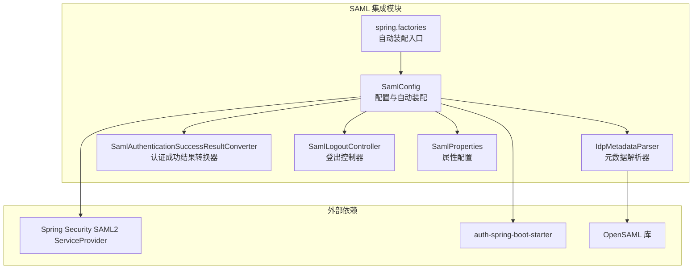
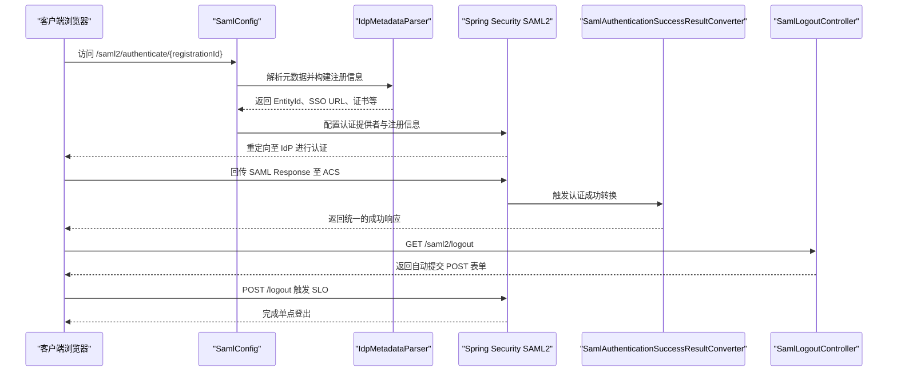
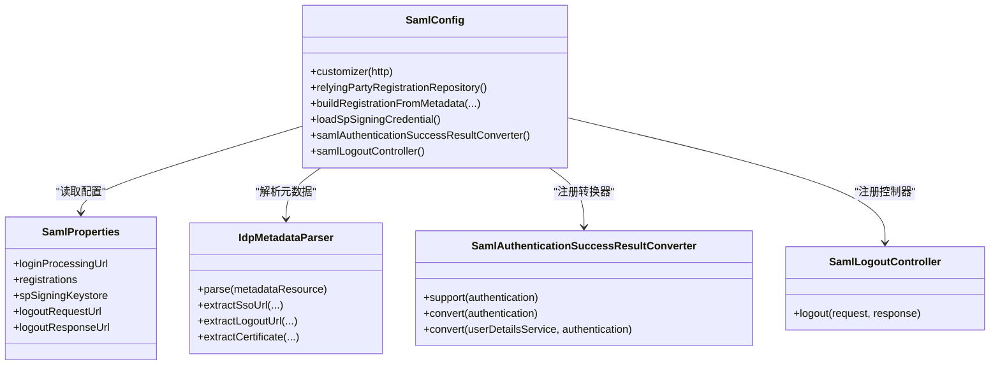
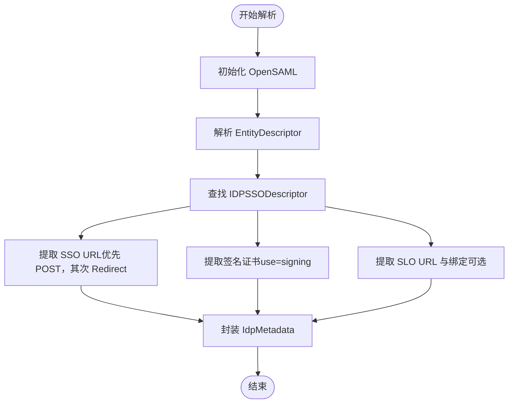
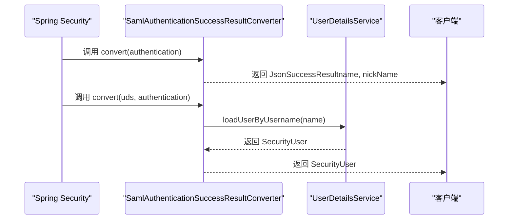
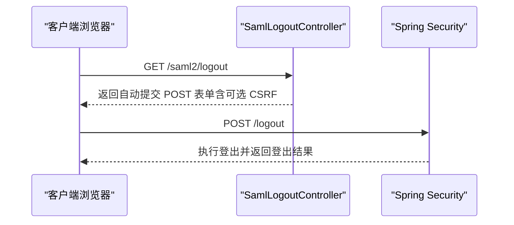
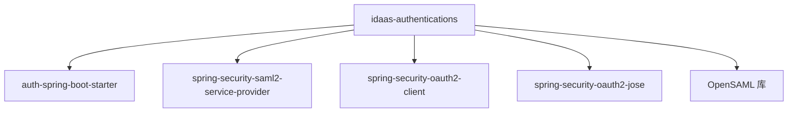

# SAML 集成

<cite>
**本文引用的文件列表**
- [SamlConfig.java](file://qy-idaas/idaas-authentications/src/main/java/com/kewen/framework/idaas/saml/SamlConfig.java)
- [IdpMetadataParser.java](file://qy-idaas/idaas-authentications/src/main/java/com/kewen/framework/idaas/saml/IdpMetadataParser.java)
- [SamlAuthenticationSuccessResultConverter.java](file://qy-idaas/idaas-authentications/src/main/java/com/kewen/framework/idaas/saml/SamlAuthenticationSuccessResultConverter.java)
- [SamlLogoutController.java](file://qy-idaas/idaas-authentications/src/main/java/com/kewen/framework/idaas/saml/SamlLogoutController.java)
- [SamlProperties.java](file://qy-idaas/idaas-authentications/src/main/java/com/kewen/framework/idaas/saml/properties/SamlProperties.java)
- [spring.factories](file://qy-idaas/idaas-authentications/src/main/resources/META-INF/spring.factories)
- [application.yml（示例）](file://sample/idaas-sp-boot-sample/src/main/resources/application.yml)
- [kewen-local-metadata.xml（示例）](file://sample/idaas-sp-boot-sample/src/main/resources/saml/metadata/kewen-local-metadata.xml)
- [pom.xml（idaas-authentications）](file://qy-idaas/idaas-authentications/pom.xml)
</cite>

## 目录
1. [简介](#简介)
2. [项目结构](#项目结构)
3. [核心组件](#核心组件)
4. [架构总览](#架构总览)
5. [详细组件分析](#详细组件分析)
6. [依赖关系分析](#依赖关系分析)
7. [性能考虑](#性能考虑)
8. [故障排除指南](#故障排除指南)
9. [结论](#结论)
10. [附录](#附录)

## 简介
本技术文档围绕 SAML 认证协议集成模块进行系统性说明，重点覆盖以下方面：
- SamlConfig 配置类的实现原理，包括 SAML 断言消费者服务（ACS）配置、身份提供商（IdP）元数据配置以及签名验证设置。
- IdpMetadataParser 元数据解析器的工作机制，包括 SAML 元数据 XML 解析、断言签名验证证书提取、实体 ID（EntityId）与绑定协议提取。
- SamlAuthenticationSuccessResultConverter 认证成功结果转换器的设计，解释 SAML 断言解析、用户信息提取与认证结果格式化过程。
- SamlLogoutController 登出控制器的实现，包括 SAML 单点登出（SLO）流程、会话清理与重定向处理。
- SamlProperties 属性配置类的各项配置选项，涵盖断言消费者 URL、身份提供商 URL、加密算法设置与多注册实例管理。
- 提供完整的 SAML 协议集成配置示例与使用方法，包括元数据文件配置、证书与密钥库管理、断言验证策略。
- 解释 SAML 协议的安全机制、性能优化与常见故障排除方法。

## 项目结构
该模块位于 qy-idaas/idaas-authentications 子模块中，采用“按功能域分层”的组织方式：
- 配置与自动装配：SamlConfig、spring.factories
- SAML 协议与安全：SamlAuthenticationSuccessResultConverter、SamlLogoutController
- 元数据解析：IdpMetadataParser
- 属性配置：SamlProperties
- 示例与依赖：示例 application.yml、示例元数据文件、模块 pom.xml

图表来源
- [SamlConfig.java:42-196](file://qy-idaas/idaas-authentications/src/main/java/com/kewen/framework/idaas/saml/SamlConfig.java#L42-L196)
- [IdpMetadataParser.java:36-216](file://qy-idaas/idaas-authentications/src/main/java/com/kewen/framework/idaas/saml/IdpMetadataParser.java#L36-L216)
- [SamlAuthenticationSuccessResultConverter.java:16-37](file://qy-idaas/idaas-authentications/src/main/java/com/kewen/framework/idaas/saml/SamlAuthenticationSuccessResultConverter.java#L16-L37)
- [SamlLogoutController.java:22-49](file://qy-idaas/idaas-authentications/src/main/java/com/kewen/framework/idaas/saml/SamlLogoutController.java#L22-L49)
- [SamlProperties.java:22-129](file://qy-idaas/idaas-authentications/src/main/java/com/kewen/framework/idaas/saml/properties/SamlProperties.java#L22-L129)
- [spring.factories:1-3](file://qy-idaas/idaas-authentications/src/main/resources/META-INF/spring.factories#L1-L3)

章节来源
- [SamlConfig.java:42-196](file://qy-idaas/idaas-authentications/src/main/java/com/kewen/framework/idaas/saml/SamlConfig.java#L42-L196)
- [spring.factories:1-3](file://qy-idaas/idaas-authentications/src/main/resources/META-INF/spring.factories#L1-L3)

## 核心组件
本节概述四个关键组件及其职责：
- SamlConfig：负责将 SAML2 登录与登出配置注入到 Spring Security，并根据元数据或手动配置构建 RelyingPartyRegistration。
- IdpMetadataParser：独立解析 IdP 元数据 XML，提取 EntityId、SSO URL、签名证书与可选的 SLO 信息。
- SamlAuthenticationSuccessResultConverter：针对 SAML 认证成功的转换器，将 SAML 主体信息映射为统一的成功响应模型。
- SamlLogoutController：提供 GET /saml2/logout 接口，返回自动提交表单以触发 POST /logout，从而进入 SAML SLO 流程。

章节来源
- [SamlConfig.java:42-196](file://qy-idaas/idaas-authentications/src/main/java/com/kewen/framework/idaas/saml/SamlConfig.java#L42-L196)
- [IdpMetadataParser.java:36-216](file://qy-idaas/idaas-authentications/src/main/java/com/kewen/framework/idaas/saml/IdpMetadataParser.java#L36-L216)
- [SamlAuthenticationSuccessResultConverter.java:16-37](file://qy-idaas/idaas-authentications/src/main/java/com/kewen/framework/idaas/saml/SamlAuthenticationSuccessResultConverter.java#L16-L37)
- [SamlLogoutController.java:22-49](file://qy-idaas/idaas-authentications/src/main/java/com/kewen/framework/idaas/saml/SamlLogoutController.java#L22-L49)

## 架构总览
SAML 集成的整体工作流如下：
- 应用启动时，spring.factories 自动装配 SamlConfig。
- SamlConfig 读取 SamlProperties，调用 IdpMetadataParser 解析元数据，构建 RelyingPartyRegistration。
- Spring Security 使用 OpenSamlAuthenticationProvider 处理 SAML 认证，成功后由 SamlAuthenticationSuccessResultConverter 转换结果。
- 登出时，SamlLogoutController 返回自动提交表单，触发 POST /logout，进入 SAML SLO 流程。

图表来源
- [SamlConfig.java:62-88](file://qy-idaas/idaas-authentications/src/main/java/com/kewen/framework/idaas/saml/SamlConfig.java#L62-L88)
- [IdpMetadataParser.java:48-70](file://qy-idaas/idaas-authentications/src/main/java/com/kewen/framework/idaas/saml/IdpMetadataParser.java#L48-L70)
- [SamlAuthenticationSuccessResultConverter.java:17-29](file://qy-idaas/idaas-authentications/src/main/java/com/kewen/framework/idaas/saml/SamlAuthenticationSuccessResultConverter.java#L17-L29)
- [SamlLogoutController.java:28-49](file://qy-idaas/idaas-authentications/src/main/java/com/kewen/framework/idaas/saml/SamlLogoutController.java#L28-L49)

## 详细组件分析

### SamlConfig 配置类
SamlConfig 实现 HttpSecurityCustomizer，将 SAML2 登录与登出配置注入到 Spring Security。其关键点包括：
- 使用 OpenSamlAuthenticationProvider 作为认证提供者。
- 通过 relyingPartyRegistrationRepository 构建 RelyingPartyRegistration，支持从元数据自动解析或手动配置。
- 配置断言消费者服务（ACS）URL、单点登出（SLO）请求与响应 URL。
- 可选地加载 SP 签名凭证（私钥+证书）用于对 AuthnRequest 与 LogoutRequest 签名。
- 注册 SamlAuthenticationSuccessResultConverter 与 SamlLogoutController。

图表来源
- [SamlConfig.java:42-196](file://qy-idaas/idaas-authentications/src/main/java/com/kewen/framework/idaas/saml/SamlConfig.java#L42-L196)
- [SamlProperties.java:22-129](file://qy-idaas/idaas-authentications/src/main/java/com/kewen/framework/idaas/saml/properties/SamlProperties.java#L22-L129)
- [IdpMetadataParser.java:36-216](file://qy-idaas/idaas-authentications/src/main/java/com/kewen/framework/idaas/saml/IdpMetadataParser.java#L36-L216)
- [SamlAuthenticationSuccessResultConverter.java:16-37](file://qy-idaas/idaas-authentications/src/main/java/com/kewen/framework/idaas/saml/SamlAuthenticationSuccessResultConverter.java#L16-L37)
- [SamlLogoutController.java:22-49](file://qy-idaas/idaas-authentications/src/main/java/com/kewen/framework/idaas/saml/SamlLogoutController.java#L22-L49)

章节来源
- [SamlConfig.java:62-196](file://qy-idaas/idaas-authentications/src/main/java/com/kewen/framework/idaas/saml/SamlConfig.java#L62-L196)

### IdpMetadataParser 元数据解析器
IdpMetadataParser 负责从 IdP 的 metadata.xml 中解析关键信息：
- 提取 EntityId（身份提供商实体标识）。
- 选择 SSO URL，优先 HTTP-POST 绑定，其次 HTTP-Redirect 绑定。
- 提取用于断言签名验证的 X509 证书（默认使用 use=signing 的 KeyDescriptor）。
- 可选提取 SingleLogoutService URL 与绑定类型（若存在）。
- 返回 IdpMetadata 对象，供 SamlConfig 构建 assertingPartyDetails 与 verificationX509Credentials。

图表来源
- [IdpMetadataParser.java:48-164](file://qy-idaas/idaas-authentications/src/main/java/com/kewen/framework/idaas/saml/IdpMetadataParser.java#L48-L164)

章节来源
- [IdpMetadataParser.java:48-164](file://qy-idaas/idaas-authentications/src/main/java/com/kewen/framework/idaas/saml/IdpMetadataParser.java#L48-L164)

### SamlAuthenticationSuccessResultConverter 认证成功结果转换器
该转换器用于将 Spring Security 的 SAML 认证结果转换为统一的成功响应模型：
- support 方法判断认证主体是否为 Saml2AuthenticatedPrincipal。
- convert 方法将 principal 的名称与注册 ID 映射到 JsonSuccessResult。
- convert(UserDetailsService, authentication) 将 principal 的用户名交由 UserDetailsService 加载为 SecurityUser。

图表来源
- [SamlAuthenticationSuccessResultConverter.java:17-36](file://qy-idaas/idaas-authentications/src/main/java/com/kewen/framework/idaas/saml/SamlAuthenticationSuccessResultConverter.java#L17-L36)

章节来源
- [SamlAuthenticationSuccessResultConverter.java:16-37](file://qy-idaas/idaas-authentications/src/main/java/com/kewen/framework/idaas/saml/SamlAuthenticationSuccessResultConverter.java#L16-L37)

### SamlLogoutController 登出控制器
SamlLogoutController 提供 GET /saml2/logout 接口，返回自动提交的 POST 表单页面，使浏览器在加载后自动 POST 到 /logout，从而触发 Spring Security 的登出流程与 SAML SLO：
- 若启用 CSRF，控制器会从请求中获取 CsrfToken 并写入隐藏字段。
- 输出 HTML 表单并自动提交，确保兼容 Spring Security 默认仅接受 POST 的 /logout。

图表来源
- [SamlLogoutController.java:28-49](file://qy-idaas/idaas-authentications/src/main/java/com/kewen/framework/idaas/saml/SamlLogoutController.java#L28-L49)

章节来源
- [SamlLogoutController.java:22-49](file://qy-idaas/idaas-authentications/src/main/java/com/kewen/framework/idaas/saml/SamlLogoutController.java#L22-L49)

### SamlProperties 属性配置类
SamlProperties 提供 SAML 配置的集中管理，关键项包括：
- loginProcessingUrl：断言消费者服务 URL 模板，默认为 “/login/saml2/sso/{registrationId}”。
- registrations：多注册实例列表，每个实例包含：
  - metadataResource：IdP 元数据资源路径，默认 classpath:saml/idp-metadata.xml。
  - registrationId：注册 ID，用于标识当前 SAML 配置。
  - spEntityId：SP 实体 ID，默认值为 “kewen-saml”，需与 IdP 配置一致。
- spSigningKeystore：SP 签名密钥库配置，用于对 AuthnRequest 与 LogoutRequest 签名，包含 keystoreResource、keystorePassword、keyAlias、keyPassword。
- logoutRequestUrl、logoutResponseUrl：SAML SLO 请求与响应 URL，默认均为 “/logout/saml2/slo”。

章节来源
- [SamlProperties.java:22-129](file://qy-idaas/idaas-authentications/src/main/java/com/kewen/framework/idaas/saml/properties/SamlProperties.java#L22-L129)

## 依赖关系分析
模块依赖关系如下：
- 依赖 auth-spring-boot-starter，以复用统一的认证与安全基础设施。
- 依赖 spring-security-saml2-service-provider，提供 SAML2 ServiceProvider 的核心能力。
- 依赖 spring-security-oauth2-client 与 spring-security-oauth2-jose，用于兼容 OAuth/OIDC 场景（本模块亦提供）。
- OpenSAML 库用于解析元数据 XML 与证书处理。

图表来源
- [pom.xml（idaas-authentications）:20-51](file://qy-idaas/idaas-authentications/pom.xml#L20-L51)

章节来源
- [pom.xml（idaas-authentications）:20-51](file://qy-idaas/idaas-authentications/pom.xml#L20-L51)

## 性能考虑
- 元数据解析：IdpMetadataParser 在首次使用时初始化 OpenSAML，建议将元数据文件放置在 classpath 或本地磁盘以减少 IO 延迟；避免频繁重新解析同一元数据。
- 认证提供者：OpenSamlAuthenticationProvider 为认证提供者，建议结合合理的会话与缓存策略，避免重复认证。
- SLO 流程：SamlLogoutController 通过自动提交表单触发 POST /logout，减少额外网络往返；确保 IdP 的 SLO URL 与绑定类型正确，避免重定向失败。
- 密钥库加载：SP 签名凭证从 JKS 密钥库加载，建议将密钥库置于安全位置并设置合理密码；避免在每次请求中重复加载。

[本节为通用性能建议，不直接分析具体文件]

## 故障排除指南
- 元数据解析失败
  - 现象：抛出“解析 IdP metadata.xml 失败”异常。
  - 排查：确认 metadataResource 路径正确、文件可读；检查根元素是否为 EntityDescriptor；确认 IDPSSODescriptor 存在且包含 SingleSignOnService。
  - 参考：[IdpMetadataParser.java:48-70](file://qy-idaas/idaas-authentications/src/main/java/com/kewen/framework/idaas/saml/IdpMetadataParser.java#L48-L70)
- 未找到签名证书
  - 现象：抛出“未找到签名证书”异常。
  - 排查：确认 KeyDescriptor.use=signing 的 KeyInfo 下存在 X509Data 与 X509Certificate。
  - 参考：[IdpMetadataParser.java:132-150](file://qy-idaas/idaas-authentications/src/main/java/com/kewen/framework/idaas/saml/IdpMetadataParser.java#L132-L150)
- SSO URL 未找到
  - 现象：抛出“未找到 SingleSignOnService”异常。
  - 排查：确认元数据中至少存在一种绑定类型的 SingleSignOnService（优先 HTTP-POST，其次 HTTP-Redirect）。
  - 参考：[IdpMetadataParser.java:96-113](file://qy-idaas/idaas-authentications/src/main/java/com/kewen/framework/idaas/saml/IdpMetadataParser.java#L96-L113)
- SLO 绑定或 URL 为空导致校验失败
  - 现象：SAML SLO 校验失败或空指针异常。
  - 排查：确保 SamlConfig 在构建 RelyingPartyRegistration 时设置了 singleLogoutServiceLocation 与 singleLogoutServiceResponseLocation；若元数据中无 SLO，应显式配置。
  - 参考：[SamlConfig.java:136-154](file://qy-idaas/idaas-authentications/src/main/java/com/kewen/framework/idaas/saml/SamlConfig.java#L136-L154)
- 登出 GET 接口无效
  - 现象：/saml2/logout 无法触发 POST /logout。
  - 排查：确认 SamlLogoutController 已注册；若启用 CSRF，确保表单包含 CSRF 参数。
  - 参考：[SamlLogoutController.java:28-49](file://qy-idaas/idaas-authentications/src/main/java/com/kewen/framework/idaas/saml/SamlLogoutController.java#L28-L49)
- SP 签名凭证加载失败
  - 现象：抛出“加载 SP 签名密钥库失败”异常。
  - 排查：确认 keystoreResource 可读、keystorePassword 与 keyAlias/keyPassword 正确；检查密钥库类型为 JKS。
  - 参考：[SamlConfig.java:170-189](file://qy-idaas/idaas-authentications/src/main/java/com/kewen/framework/idaas/saml/SamlConfig.java#L170-L189)

章节来源
- [IdpMetadataParser.java:48-150](file://qy-idaas/idaas-authentications/src/main/java/com/kewen/framework/idaas/saml/IdpMetadataParser.java#L48-L150)
- [SamlConfig.java:136-189](file://qy-idaas/idaas-authentications/src/main/java/com/kewen/framework/idaas/saml/SamlConfig.java#L136-L189)
- [SamlLogoutController.java:28-49](file://qy-idaas/idaas-authentications/src/main/java/com/kewen/framework/idaas/saml/SamlLogoutController.java#L28-L49)

## 结论
SAML 集成模块通过 SamlConfig、IdpMetadataParser、SamlAuthenticationSuccessResultConverter 与 SamlLogoutController 协同工作，实现了从元数据解析、认证处理到登出流程的完整闭环。SamlProperties 提供了灵活的配置选项，支持多注册实例与 SP 签名凭证管理。结合示例配置与故障排除指南，开发者可快速完成 SAML 协议的集成与运维。

[本节为总结性内容，不直接分析具体文件]

## 附录

### 配置示例与使用方法
- application.yml 示例
  - 包含 SP 签名密钥库配置与多注册实例（registrationId、spEntityId、metadataResource）。
  - 参考：[application.yml（示例）:62-88](file://sample/idaas-sp-boot-sample/src/main/resources/application.yml#L62-L88)
- 元数据文件示例
  - kewen-local-metadata.xml 展示了基本的 EntityDescriptor、KeyDescriptor、NameIDFormat 与 SingleSignOnService。
  - 参考：[kewen-local-metadata.xml（示例）:1-19](file://sample/idaas-sp-boot-sample/src/main/resources/saml/metadata/kewen-local-metadata.xml#L1-L19)
- 自动装配入口
  - spring.factories 指定 SamlConfig 为自动装配类。
  - 参考：[spring.factories:1-3](file://qy-idaas/idaas-authentications/src/main/resources/META-INF/spring.factories#L1-L3)

章节来源
- [application.yml（示例）:62-88](file://sample/idaas-sp-boot-sample/src/main/resources/application.yml#L62-L88)
- [kewen-local-metadata.xml（示例）:1-19](file://sample/idaas-sp-boot-sample/src/main/resources/saml/metadata/kewen-local-metadata.xml#L1-L19)
- [spring.factories:1-3](file://qy-idaas/idaas-authentications/src/main/resources/META-INF/spring.factories#L1-L3)