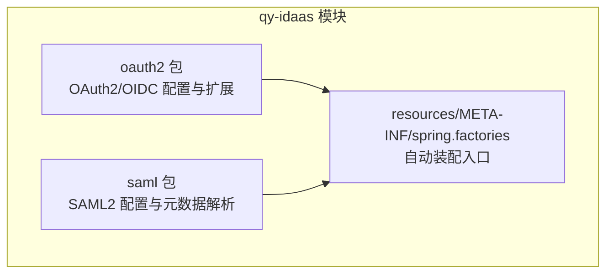
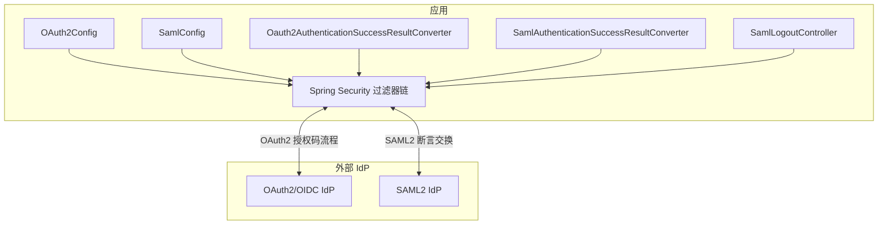
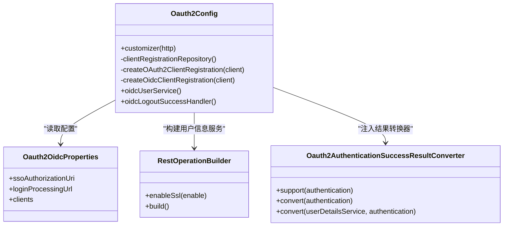
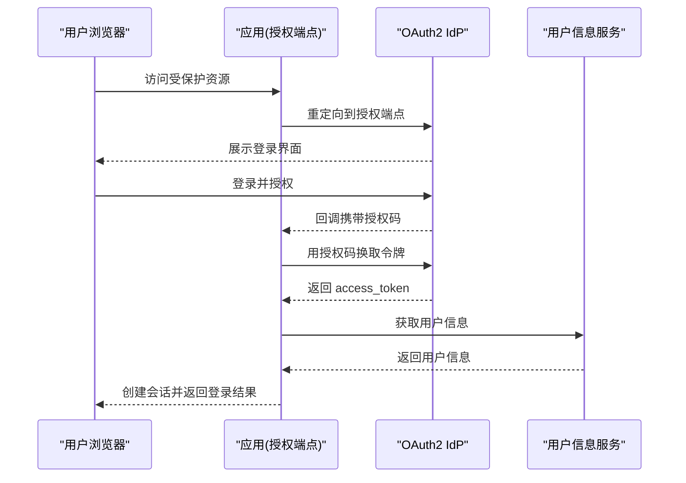
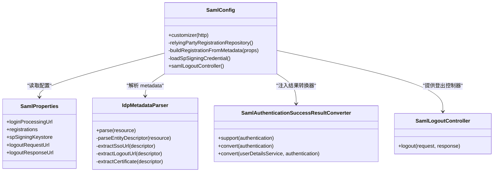
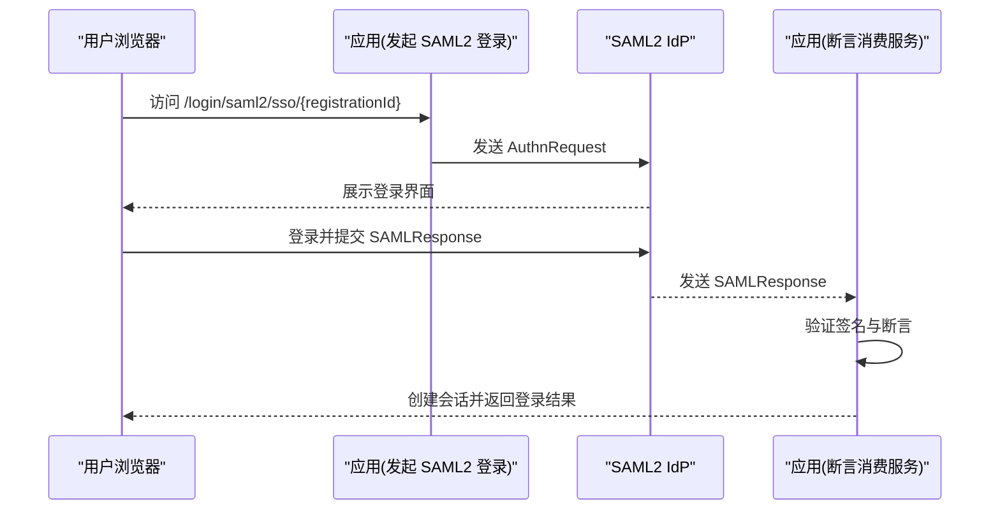
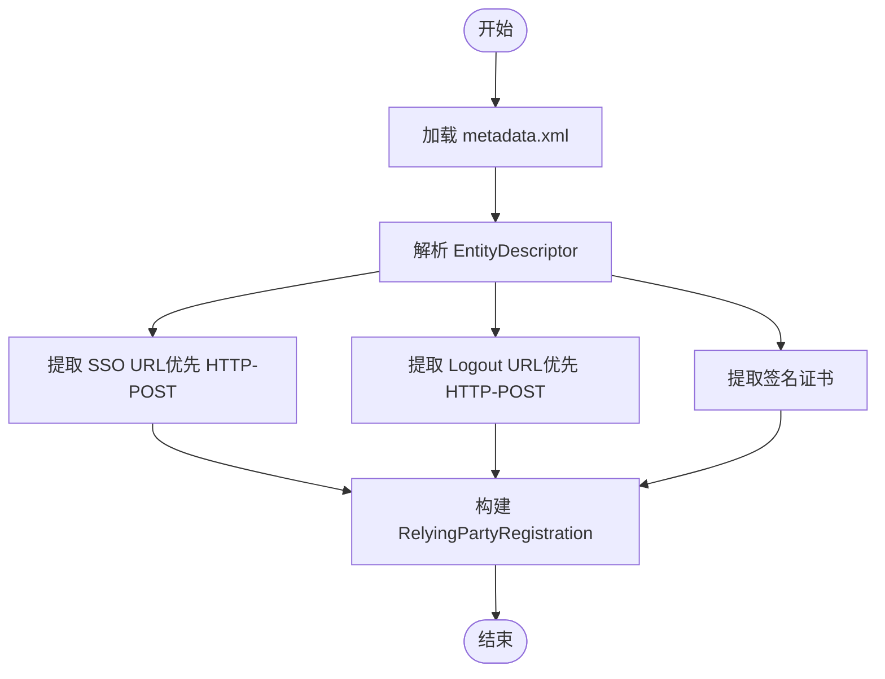
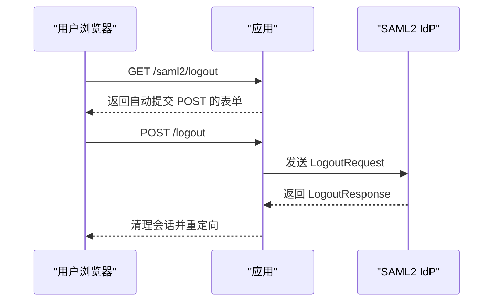
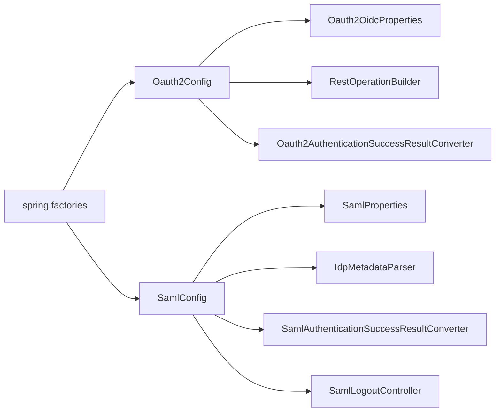

# 协议集成 (qy-idaas)

<cite>
**本文引用的文件**
- [README.md](file://qy-idaas/README.md)
- [Oauth2Config.java](file://qy-idaas/idaas-authentications/src/main/java/com/kewen/framework/idaas/oauth2/Oauth2Config.java)
- [Oauth2OidcProperties.java](file://qy-idaas/idaas-authentications/src/main/java/com/kewen/framework/idaas/oauth2/Oauth2OidcProperties.java)
- [OauthProtocolType.java](file://qy-idaas/idaas-authentications/src/main/java/com/kewen/framework/idaas/oauth2/OauthProtocolType.java)
- [RestOperationBuilder.java](file://qy-idaas/idaas-authentications/src/main/java/com/kewen/framework/idaas/oauth2/RestOperationBuilder.java)
- [Oauth2AuthenticationSuccessResultConverter.java](file://qy-idaas/idaas-authentications/src/main/java/com/kewen/framework/idaas/oauth2/result/Oauth2AuthenticationSuccessResultConverter.java)
- [SamlConfig.java](file://qy-idaas/idaas-authentications/src/main/java/com/kewen/framework/idaas/saml/SamlConfig.java)
- [SamlProperties.java](file://qy-idaas/idaas-authentications/src/main/java/com/kewen/framework/idaas/saml/properties/SamlProperties.java)
- [IdpMetadataParser.java](file://qy-idaas/idaas-authentications/src/main/java/com/kewen/framework/idaas/saml/IdpMetadataParser.java)
- [SamlAuthenticationSuccessResultConverter.java](file://qy-idaas/idaas-authentications/src/main/java/com/kewen/framework/idaas/saml/SamlAuthenticationSuccessResultConverter.java)
- [SamlLogoutController.java](file://qy-idaas/idaas-authentications/src/main/java/com/kewen/framework/idaas/saml/SamlLogoutController.java)
- [application.yml](file://sample/idaas-sp-boot-sample/src/main/resources/application.yml)
- [idaas-idp4-dev-metadata.xml](file://sample/idaas-sp-boot-sample/src/main/resources/saml/metadata/idaas-idp4-dev-metadata.xml)
- [spring.factories](file://qy-idaas/idaas-authentications/src/main/resources/META-INF/spring.factories)
</cite>

## 目录
1. [简介](#简介)
2. [项目结构](#项目结构)
3. [核心组件](#核心组件)
4. [架构总览](#架构总览)
5. [详细组件分析](#详细组件分析)
6. [依赖关系分析](#依赖关系分析)
7. [性能考量](#性能考量)
8. [故障排除指南](#故障排除指南)
9. [结论](#结论)
10. [附录](#附录)

## 简介
本文件面向开发者，系统性阐述 qy-idaas 协议集成模块对 OAuth2 与 SAML 2.0 的实现与使用。文档涵盖：
- OAuth2 配置类、认证流程与结果转换器设计
- SAML 配置、元数据解析与登录控制器实现
- 协议选择标准与适用场景
- 配置示例与 API 使用方法
- 安全考虑、性能优化与故障排除

## 项目结构
qy-idaas 模块位于 qy-idaas/idaas-authentications 下，采用按协议分包的组织方式：
- oauth2：OAuth2/OIDC 配置与扩展
- saml：SAML2 配置、元数据解析与登录控制器
- resources/META-INF/spring.factories：自动装配入口

图表来源
- [spring.factories:1-3](file://qy-idaas/idaas-authentications/src/main/resources/META-INF/spring.factories#L1-L3)

章节来源
- [spring.factories:1-3](file://qy-idaas/idaas-authentications/src/main/resources/META-INF/spring.factories#L1-L3)

## 核心组件
- OAuth2 配置与扩展
  - Oauth2Config：实现 HttpSecurityCustomizer，注入 OAuth2 登录、令牌交换、用户信息服务与登出处理器
  - Oauth2OidcProperties：统一配置 OAuth2/OIDC 客户端注册与端点
  - RestOperationBuilder：自定义 RestOperations，支持忽略 SSL 校验（仅测试）
  - Oauth2AuthenticationSuccessResultConverter：OAuth2 成功登录结果转换器
- SAML2 配置与扩展
  - SamlConfig：实现 HttpSecurityCustomizer，注入 SAML2 登录、登出与凭据
  - SamlProperties：SAML2 属性配置（注册、SP 签名密钥库、登出端点）
  - IdpMetadataParser：解析 IdP metadata.xml，提取 EntityID、SSO/Logout URL 与签名证书
  - SamlAuthenticationSuccessResultConverter：SAML2 成功登录结果转换器
  - SamlLogoutController：提供 GET /saml2/logout，自动提交 POST 触发 SAML2 SLO

章节来源
- [Oauth2Config.java:46-225](file://qy-idaas/idaas-authentications/src/main/java/com/kewen/framework/idaas/oauth2/Oauth2Config.java#L46-L225)
- [Oauth2OidcProperties.java:24-251](file://qy-idaas/idaas-authentications/src/main/java/com/kewen/framework/idaas/oauth2/Oauth2OidcProperties.java#L24-L251)
- [RestOperationBuilder.java:30-93](file://qy-idaas/idaas-authentications/src/main/java/com/kewen/framework/idaas/oauth2/RestOperationBuilder.java#L30-L93)
- [Oauth2AuthenticationSuccessResultConverter.java:16-44](file://qy-idaas/idaas-authentications/src/main/java/com/kewen/framework/idaas/oauth2/result/Oauth2AuthenticationSuccessResultConverter.java#L16-L44)
- [SamlConfig.java:42-197](file://qy-idaas/idaas-authentications/src/main/java/com/kewen/framework/idaas/saml/SamlConfig.java#L42-L197)
- [SamlProperties.java:22-130](file://qy-idaas/idaas-authentications/src/main/java/com/kewen/framework/idaas/saml/properties/SamlProperties.java#L22-L130)
- [IdpMetadataParser.java:36-217](file://qy-idaas/idaas-authentications/src/main/java/com/kewen/framework/idaas/saml/IdpMetadataParser.java#L36-L217)
- [SamlAuthenticationSuccessResultConverter.java:16-38](file://qy-idaas/idaas-authentications/src/main/java/com/kewen/framework/idaas/saml/SamlAuthenticationSuccessResultConverter.java#L16-L38)
- [SamlLogoutController.java:22-51](file://qy-idaas/idaas-authentications/src/main/java/com/kewen/framework/idaas/saml/SamlLogoutController.java#L22-L51)

## 架构总览
qy-idaas 通过 Spring Security 的 OAuth2/SAML2 支持，结合自定义配置类与结果转换器，将外部 IdP 的认证流程无缝集成到应用中。

图表来源
- [Oauth2Config.java:90-125](file://qy-idaas/idaas-authentications/src/main/java/com/kewen/framework/idaas/oauth2/Oauth2Config.java#L90-L125)
- [SamlConfig.java:62-88](file://qy-idaas/idaas-authentications/src/main/java/com/kewen/framework/idaas/saml/SamlConfig.java#L62-L88)

## 详细组件分析

### OAuth2 组件分析
- 配置类 Oauth2Config
  - 注入 OAuth2 登录端点、令牌交换客户端、用户信息服务与登出处理器
  - 支持多客户端注册（OAuth2/OIDC），自动构建 ClientRegistrationRepository
  - 支持 OIDC 自动发现（issuer-uri），自动补齐端点与 JWKS
  - 支持忽略 SSL 校验（仅测试环境）

图表来源
- [Oauth2Config.java:46-225](file://qy-idaas/idaas-authentications/src/main/java/com/kewen/framework/idaas/oauth2/Oauth2Config.java#L46-L225)
- [Oauth2OidcProperties.java:24-251](file://qy-idaas/idaas-authentications/src/main/java/com/kewen/framework/idaas/oauth2/Oauth2OidcProperties.java#L24-L251)
- [RestOperationBuilder.java:30-93](file://qy-idaas/idaas-authentications/src/main/java/com/kewen/framework/idaas/oauth2/RestOperationBuilder.java#L30-L93)
- [Oauth2AuthenticationSuccessResultConverter.java:16-44](file://qy-idaas/idaas-authentications/src/main/java/com/kewen/framework/idaas/oauth2/result/Oauth2AuthenticationSuccessResultConverter.java#L16-L44)

- OAuth2 认证流程（授权码模式）

图表来源
- [README.md:101-138](file://qy-idaas/README.md#L101-L138)
- [Oauth2Config.java:90-125](file://qy-idaas/idaas-authentications/src/main/java/com/kewen/framework/idaas/oauth2/Oauth2Config.java#L90-L125)

- OIDC 自动发现与登出
  - 通过 issuer-uri 自动发现端点与 JWKS
  - OIDC RP-Initiated Logout：使用 OidcClientInitiatedLogoutSuccessHandler 处理登出重定向

章节来源
- [Oauth2Config.java:166-225](file://qy-idaas/idaas-authentications/src/main/java/com/kewen/framework/idaas/oauth2/Oauth2Config.java#L166-L225)
- [Oauth2OidcProperties.java:131-147](file://qy-idaas/idaas-authentications/src/main/java/com/kewen/framework/idaas/oauth2/Oauth2OidcProperties.java#L131-L147)

### SAML2 组件分析
- 配置类 SamlConfig
  - 注入 SAML2 登录与登出处理器，使用 OpenSamlAuthenticationProvider
  - 从 metadata.xml 自动解析 IdP 元数据，构建 RelyingPartyRegistration
  - 支持 SP 签名（AuthnRequest/LogoutRequest），加载 JKS 密钥库
  - 提供 SamlLogoutController，GET /saml2/logout 自动提交 POST 触发 SLO

图表来源
- [SamlConfig.java:42-197](file://qy-idaas/idaas-authentications/src/main/java/com/kewen/framework/idaas/saml/SamlConfig.java#L42-L197)
- [SamlProperties.java:22-130](file://qy-idaas/idaas-authentications/src/main/java/com/kewen/framework/idaas/saml/properties/SamlProperties.java#L22-L130)
- [IdpMetadataParser.java:36-217](file://qy-idaas/idaas-authentications/src/main/java/com/kewen/framework/idaas/saml/IdpMetadataParser.java#L36-L217)
- [SamlAuthenticationSuccessResultConverter.java:16-38](file://qy-idaas/idaas-authentications/src/main/java/com/kewen/framework/idaas/saml/SamlAuthenticationSuccessResultConverter.java#L16-L38)
- [SamlLogoutController.java:22-51](file://qy-idaas/idaas-authentications/src/main/java/com/kewen/framework/idaas/saml/SamlLogoutController.java#L22-L51)

- SAML2 认证流程（SP 发起）

图表来源
- [README.md:242-298](file://qy-idaas/README.md#L242-L298)
- [SamlConfig.java:62-88](file://qy-idaas/idaas-authentications/src/main/java/com/kewen/framework/idaas/saml/SamlConfig.java#L62-L88)

- SAML2 元数据解析流程

图表来源
- [IdpMetadataParser.java:48-91](file://qy-idaas/idaas-authentications/src/main/java/com/kewen/framework/idaas/saml/IdpMetadataParser.java#L48-L91)
- [IdpMetadataParser.java:96-150](file://qy-idaas/idaas-authentications/src/main/java/com/kewen/framework/idaas/saml/IdpMetadataParser.java#L96-L150)

- SAML2 登出流程

图表来源
- [SamlLogoutController.java:28-50](file://qy-idaas/idaas-authentications/src/main/java/com/kewen/framework/idaas/saml/SamlLogoutController.java#L28-L50)
- [SamlConfig.java:78-84](file://qy-idaas/idaas-authentications/src/main/java/com/kewen/framework/idaas/saml/SamlConfig.java#L78-L84)

## 依赖关系分析
- 自动装配入口
  - spring.factories 中声明自动装配 OAuth2 与 SAML2 配置类
- 组件耦合
  - OAuth2：Oauth2Config 依赖 Oauth2OidcProperties、RestOperationBuilder、结果转换器
  - SAML2：SamlConfig 依赖 SamlProperties、IdpMetadataParser、结果转换器与登出控制器
- 外部依赖
  - Spring Security OAuth2/SAML2、OpenSAML、Apache HttpClient

图表来源
- [spring.factories:1-3](file://qy-idaas/idaas-authentications/src/main/resources/META-INF/spring.factories#L1-L3)
- [Oauth2Config.java:46-225](file://qy-idaas/idaas-authentications/src/main/java/com/kewen/framework/idaas/oauth2/Oauth2Config.java#L46-L225)
- [SamlConfig.java:42-197](file://qy-idaas/idaas-authentications/src/main/java/com/kewen/framework/idaas/saml/SamlConfig.java#L42-L197)

章节来源
- [spring.factories:1-3](file://qy-idaas/idaas-authentications/src/main/resources/META-INF/spring.factories#L1-L3)

## 性能考量
- HTTP 客户端与重定向
  - OAuth2 用户信息服务使用 RestTemplate 并启用重定向跟随，避免因 IdP 非标准跳转导致失败
  - SAML2 使用 OpenSAML 验证断言，证书解析与绑定选择（优先 HTTP-POST）提升交互效率
- SSL 校验
  - OAuth2 支持忽略 SSL 校验（仅测试），生产环境务必关闭以保证安全
- 登录端点与回调
  - OAuth2：授权端点与回调端点路径可配置，建议与 IdP 侧一致，减少往返
  - SAML2：断言消费服务与登出端点路径可配置，SP 签名可选，平衡安全与兼容性

[本节为通用性能建议，不直接分析具体文件]

## 故障排除指南
- OAuth2 常见问题
  - 未认证访问：检查 OAuth2 客户端配置与回调地址是否与 IdP 一致
  - SSL 证书验证失败：测试环境可临时开启 ignore-ssl，生产环境禁止
  - 回调地址自定义：修改 redirect-uri-template，并在 IdP 侧同步配置
  - 支持的授权类型：当前仅支持 authorization_code
- SAML2 常见问题
  - SAML Response 验证失败：检查 SP Entity ID 与 IdP Audience 一致、证书未过期、时间同步
  - 调试 SAML：开启 Spring Security 与 SAML2 日志级别
  - SAML 加密：当前支持签名，暂不支持断言加密
  - Metadata 更新：更新后需重启应用生效
- 通用问题
  - 自定义登录页面：创建控制器处理登录请求
  - 排除接口免认证：使用注解或配置 permit-url
  - Session 存储：默认内存，可配置 Redis

章节来源
- [README.md:422-580](file://qy-idaas/README.md#L422-L580)

## 结论
qy-idaas 通过标准化的配置类与扩展点，将 OAuth2/OIDC 与 SAML2 的复杂认证流程抽象为可配置、可扩展的模块。开发者可根据业务场景选择合适协议：
- OAuth2/OIDC：适合 Web 应用的授权码流程，支持自动发现与 JWKS 验证
- SAML2：适合企业级 SSO，支持 metadata 自动解析与 SP 签名

建议在生产环境严格遵循安全最佳实践，合理配置端点与证书，并通过示例工程快速落地。

[本节为总结性内容，不直接分析具体文件]

## 附录

### 协议选择标准与适用场景
- OAuth2/OIDC
  - 适用：Web 应用、第三方登录、移动端授权
  - 优势：授权码模式安全、自动发现简化集成
- SAML2
  - 适用：企业 SSO、跨域单点登录
  - 优势：断言交换机制成熟、支持签名与登出

章节来源
- [README.md:13-29](file://qy-idaas/README.md#L13-L29)

### 配置示例与 API 使用方法
- OAuth2 配置示例
  - 参考示例工程 application.yml 中 oauth2 配置段，包含 OIDC 与 OAuth2 两种模式
- SAML2 配置示例
  - 参考示例工程 application.yml 中 saml 配置段，包含多 IdP 注册与 SP 签名密钥库
  - 示例 metadata 文件：idaas-idp4-dev-metadata.xml
- API 使用方法
  - OAuth2：访问 /oauth2/authorize/{registrationId} 发起认证；回调端点 /login/oauth2/code/{registrationId}
  - SAML2：访问 /login/saml2/sso/{registrationId} 发起认证；登出端点 /logout/saml2/slo；GET /saml2/logout 触发登出

章节来源
- [application.yml:89-128](file://sample/idaas-sp-boot-sample/src/main/resources/application.yml#L89-L128)
- [idaas-idp4-dev-metadata.xml:1-23](file://sample/idaas-sp-boot-sample/src/main/resources/saml/metadata/idaas-idp4-dev-metadata.xml#L1-L23)
- [README.md:172-184](file://qy-idaas/README.md#L172-L184)
- [README.md:370-388](file://qy-idaas/README.md#L370-L388)