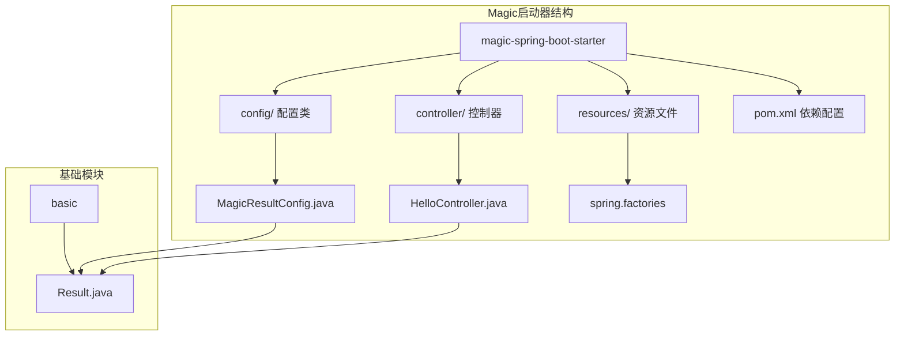
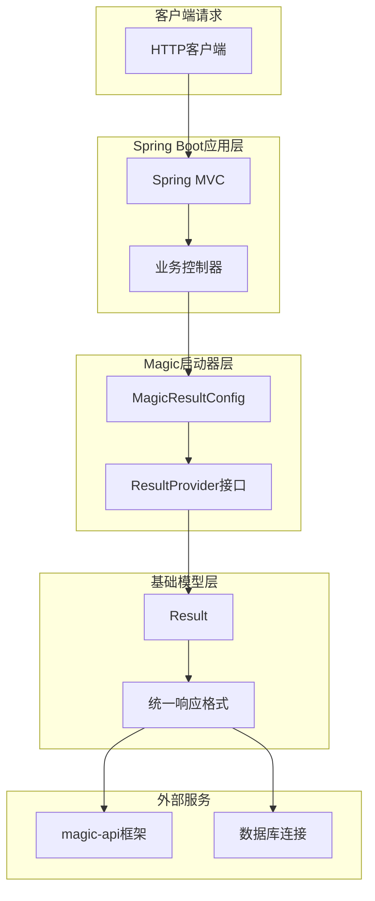
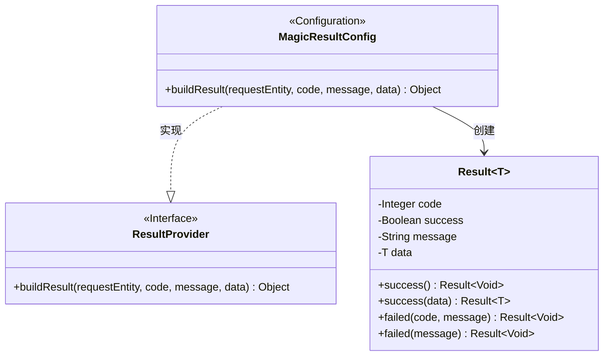
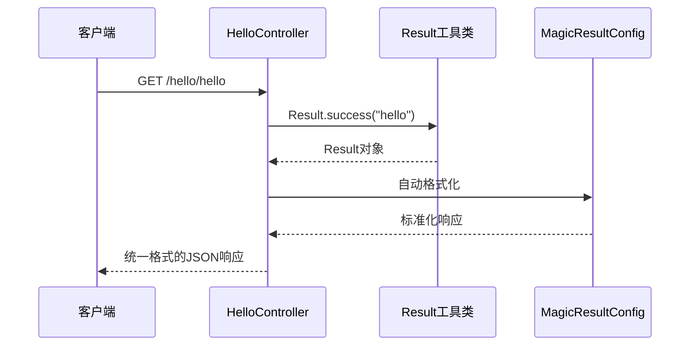
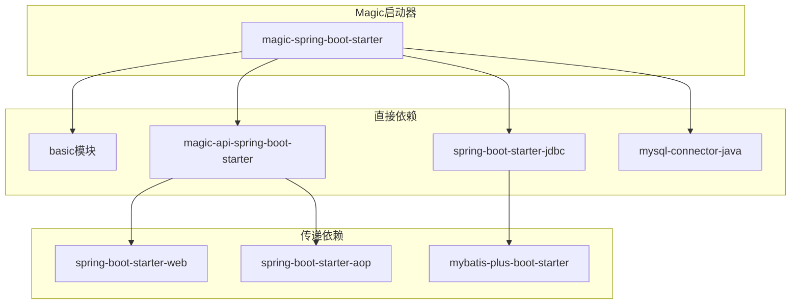

# Magic启动器（magic-spring-boot-starter）技术文档

<cite>
**本文档引用的文件**
- [MagicResultConfig.java](file://boot/magic-spring-boot-starter/src/main/java/com/kewen/framework/boot/magic/config/MagicResultConfig.java)
- [HelloController.java](file://boot/magic-spring-boot-starter/src/main/java/com/kewen/framework/boot/magic/controller/HelloController.java)
- [SampleMagicApiApp.java](file://boot/magic-spring-boot-starter/src/main/java/com/kewen/framework/boot/magic/SampleMagicApiApp.java)
- [pom.xml](file://boot/magic-spring-boot-starter/pom.xml)
- [Result.java](file://basic/src/main/java/com/kewen/framework/basic/model/Result.java)
</cite>

## 目录
1. [简介](#简介)
2. [项目结构](#项目结构)
3. [核心组件](#核心组件)
4. [架构概览](#架构概览)
5. [详细组件分析](#详细组件分析)
6. [依赖分析](#依赖分析)
7. [性能考虑](#性能考虑)
8. [故障排除指南](#故障排除指南)
9. [结论](#结论)
10. [附录：快速使用指南](#附录快速使用指南)

## 简介

Magic启动器是一个基于Spring Boot的轻量级启动器，专门用于提供统一的API结果格式化能力。该启动器通过集成magic-api框架，为开发者提供了一套标准化的响应格式处理方案。

Magic启动器的核心设计理念是：
- **统一性**：提供一致的API响应格式
- **简洁性**：最小化的配置和使用复杂度
- **可扩展性**：支持自定义响应格式和状态码处理
- **易用性**：开箱即用的starter配置

## 项目结构

Magic启动器采用标准的Spring Boot项目结构，主要包含以下核心目录：



**图表来源**
- [MagicResultConfig.java:1-24](file://boot/magic-spring-boot-starter/src/main/java/com/kewen/framework/boot/magic/config/MagicResultConfig.java#L1-L24)
- [HelloController.java:1-27](file://boot/magic-spring-boot-starter/src/main/java/com/kewen/framework/boot/magic/controller/HelloController.java#L1-L27)

**章节来源**
- [pom.xml:1-44](file://boot/magic-spring-boot-starter/pom.xml#L1-L44)

## 核心组件

Magic启动器包含三个核心组件，每个组件都承担着特定的功能职责：

### 1. MagicResultConfig - 统一响应格式配置

MagicResultConfig是启动器的核心配置类，实现了magic-api框架的ResultProvider接口。它负责将所有API请求的响应统一格式化为标准的结果对象。

### 2. HelloController - 示例控制器

HelloController展示了如何在实际应用中使用统一的响应格式。它提供了两个示例接口，演示了success方法的使用方式。

### 3. SampleMagicApiApp - 应用入口

SampleMagicApiApp是一个简单的Spring Boot应用程序入口点，用于演示启动器的基本使用。

**章节来源**
- [MagicResultConfig.java:1-24](file://boot/magic-spring-boot-starter/src/main/java/com/kewen/framework/boot/magic/config/MagicResultConfig.java#L1-L24)
- [HelloController.java:1-27](file://boot/magic-spring-boot-starter/src/main/java/com/kewen/framework/boot/magic/controller/HelloController.java#L1-L27)
- [SampleMagicApiApp.java:1-11](file://boot/magic-spring-boot-starter/src/main/java/com/kewen/framework/boot/magic/SampleMagicApiApp.java#L1-L11)

## 架构概览

Magic启动器的整体架构设计体现了分层解耦的设计原则：



**图表来源**
- [MagicResultConfig.java:14-22](file://boot/magic-spring-boot-starter/src/main/java/com/kewen/framework/boot/magic/config/MagicResultConfig.java#L14-L22)
- [Result.java:12-17](file://basic/src/main/java/com/kewen/framework/basic/model/Result.java#L12-L17)

## 详细组件分析

### MagicResultConfig配置类深度解析

MagicResultConfig类是整个启动器的核心，它实现了magic-api框架的ResultProvider接口，提供了统一的响应格式化能力。

#### 类结构分析



**图表来源**
- [MagicResultConfig.java:14-22](file://boot/magic-spring-boot-starter/src/main/java/com/kewen/framework/boot/magic/config/MagicResultConfig.java#L14-L22)
- [Result.java:12-48](file://basic/src/main/java/com/kewen/framework/basic/model/Result.java#L12-L48)

#### 关键实现特性

1. **统一响应格式**：将所有API响应转换为标准的Result对象格式
2. **状态码映射**：支持自定义状态码和消息的映射处理
3. **泛型支持**：通过泛型T确保数据类型的类型安全
4. **Spring集成**：作为@Configuration类自动注册到Spring容器中

**章节来源**
- [MagicResultConfig.java:1-24](file://boot/magic-spring-boot-starter/src/main/java/com/kewen/framework/boot/magic/config/MagicResultConfig.java#L1-L24)

### HelloController示例控制器分析

HelloController展示了如何在实际开发中使用统一的响应格式化功能。

#### 接口设计模式



**图表来源**
- [HelloController.java:15-18](file://boot/magic-spring-boot-starter/src/main/java/com/kewen/framework/boot/magic/controller/HelloController.java#L15-L18)
- [Result.java:26-32](file://basic/src/main/java/com/kewen/framework/basic/model/Result.java#L26-L32)

#### 接口实现特点

1. **简化开发流程**：开发者只需调用Result.success()即可获得标准化响应
2. **自动格式化**：MagicResultConfig自动处理响应格式的统一化
3. **类型安全**：通过泛型确保返回数据的类型正确性
4. **易于测试**：标准化的响应格式便于单元测试和集成测试

**章节来源**
- [HelloController.java:1-27](file://boot/magic-spring-boot-starter/src/main/java/com/kewen/framework/boot/magic/controller/HelloController.java#L1-L27)

### SampleMagicApiApp应用示例

SampleMagicApiApp提供了一个完整的应用启动示例，展示了如何集成和使用Magic启动器。

#### 应用启动流程

```mermaid
flowchart TD
A[启动SampleMagicApiApp] --> B[加载Spring Boot配置]
B --> C[扫描@Component注解]
C --> D[注册MagicResultConfig]
D --> E[初始化magic-api框架]
E --> F[启动HTTP服务器]
F --> G[监听端口8080]
G --> H[等待API请求]
```

**图表来源**
- [SampleMagicApiApp.java:6-10](file://boot/magic-spring-boot-starter/src/main/java/com/kewen/framework/boot/magic/SampleMagicApiApp.java#L6-L10)

**章节来源**
- [SampleMagicApiApp.java:1-11](file://boot/magic-spring-boot-starter/src/main/java/com/kewen/framework/boot/magic/SampleMagicApiApp.java#L1-L11)

## 依赖分析

Magic启动器的依赖关系相对简单，主要依赖于基础模块和magic-api框架。



**图表来源**
- [pom.xml:20-41](file://boot/magic-spring-boot-starter/pom.xml#L20-L41)

### 核心依赖说明

1. **基础模块依赖**：依赖basic模块提供的Result统一响应格式
2. **magic-api集成**：集成magic-api框架提供动态API能力
3. **数据库支持**：提供JDBC和MySQL连接支持
4. **Spring Boot生态**：充分利用Spring Boot的自动配置特性

**章节来源**
- [pom.xml:1-44](file://boot/magic-spring-boot-starter/pom.xml#L1-L44)

## 性能考虑

Magic启动器在设计时充分考虑了性能优化：

### 1. 内存优化
- 使用轻量级的Result对象结构
- 避免不必要的对象创建和复制
- 合理利用Java的泛型机制减少装箱拆箱操作

### 2. 响应时间优化
- 统一的响应格式处理减少了重复代码
- Spring Boot自动配置减少了启动时间
- 集成magic-api提供高效的API执行环境

### 3. 资源管理
- 合理的连接池配置
- 及时的资源释放和垃圾回收
- 最小化的内存占用

## 故障排除指南

### 常见问题及解决方案

#### 1. 启动失败问题
**症状**：应用无法正常启动
**可能原因**：
- 依赖包版本冲突
- 数据库连接配置错误
- 端口被占用

**解决方法**：
- 检查pom.xml中的依赖版本
- 验证数据库连接配置
- 修改application.yml中的端口号

#### 2. API响应格式异常
**症状**：API响应不是预期的统一格式
**可能原因**：
- MagicResultConfig未正确注册
- 自定义了其他响应格式化逻辑
- magic-api配置冲突

**解决方法**：
- 确认MagicResultConfig类的@Component注解
- 检查是否有其他ResultProvider实现
- 验证magic-api的配置文件

#### 3. 控制器返回值格式不正确
**症状**：控制器返回的Result对象没有被正确格式化
**可能原因**：
- 控制器方法返回类型不正确
- 缺少必要的导入语句
- Spring Boot自动配置未生效

**解决方法**：
- 确保控制器方法返回Result类型
- 添加正确的import语句
- 检查@SpringBootApplication注解

**章节来源**
- [MagicResultConfig.java:1-24](file://boot/magic-spring-boot-starter/src/main/java/com/kewen/framework/boot/magic/config/MagicResultConfig.java#L1-L24)
- [HelloController.java:1-27](file://boot/magic-spring-boot-starter/src/main/java/com/kewen/framework/boot/magic/controller/HelloController.java#L1-L27)

## 结论

Magic启动器通过提供统一的API结果格式化能力，显著简化了Spring Boot应用的开发流程。其核心优势包括：

1. **开发效率提升**：统一的响应格式减少了重复代码
2. **维护成本降低**：标准化的API接口便于维护和升级
3. **学习成本低**：简单的配置和使用方式
4. **扩展性强**：基于Spring Boot和magic-api的生态系统

对于需要快速构建标准化API服务的项目，Magic启动器是一个理想的选择。它不仅提供了开箱即用的功能，还保持了足够的灵活性以满足各种定制需求。

## 附录：快速使用指南

### 1. 项目集成步骤

#### 步骤1：添加Maven依赖
在项目的pom.xml中添加以下依赖：

```xml
<dependency>
    <groupId>com.kewen.framework.boot</groupId>
    <artifactId>magic-spring-boot-starter</artifactId>
    <version>1.0-SNAPSHOT</version>
</dependency>
```

#### 步骤2：配置数据库连接
在application.yml中配置数据库连接信息：

```yaml
spring:
  datasource:
    url: jdbc:mysql://localhost:3306/your_database
    username: your_username
    password: your_password
    driver-class-name: com.mysql.cj.jdbc.Driver
```

### 2. 创建第一个API控制器

```java
@RestController
public class UserController {
    
    @GetMapping("/users")
    public Result<List<User>> getUsers() {
        List<User> users = userService.getAllUsers();
        return Result.success(users);
    }
    
    @GetMapping("/users/{id}")
    public Result<User> getUserById(@PathVariable Long id) {
        User user = userService.getUserById(id);
        return Result.success(user);
    }
}
```

### 3. 运行应用程序

#### 方式一：命令行运行
```bash
mvn spring-boot:run
```

#### 方式二：Java主函数运行
```java
public static void main(String[] args) {
    SpringApplication.run(SampleMagicApiApp.class, args);
}
```

### 4. 验证API响应

启动应用后，访问以下URL验证API响应：

```
GET http://localhost:8080/hello/hello
GET http://localhost:8080/magic/user/all
```

预期响应格式：
```json
{
    "code": 200,
    "success": true,
    "message": "成功",
    "data": "hello"
}
```

### 5. 自定义配置选项

如果需要自定义响应格式，可以创建自己的ResultProvider实现：

```java
@Configuration
public class CustomResultConfig implements ResultProvider {
    
    @Override
    public Object buildResult(RequestEntity requestEntity, int code, String message, Object data) {
        // 自定义响应格式逻辑
        return customResult;
    }
}
```

通过以上步骤，开发者可以快速集成和使用Magic启动器，享受统一API响应格式带来的便利。