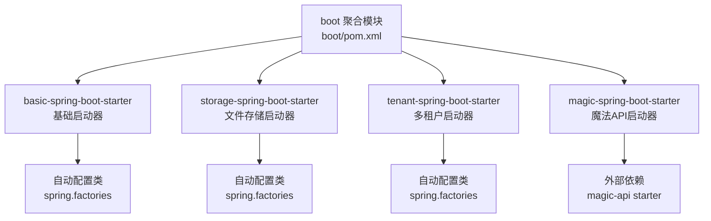
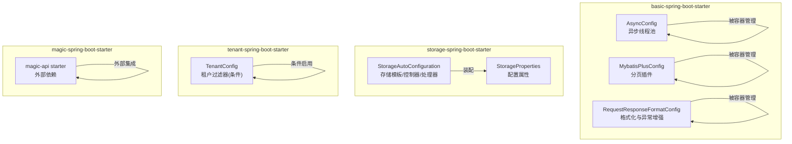
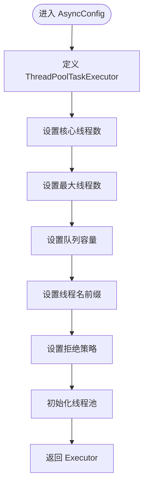
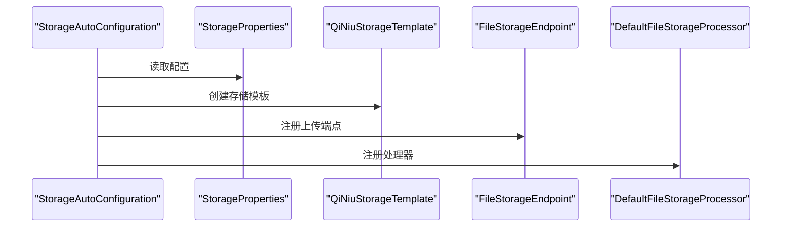
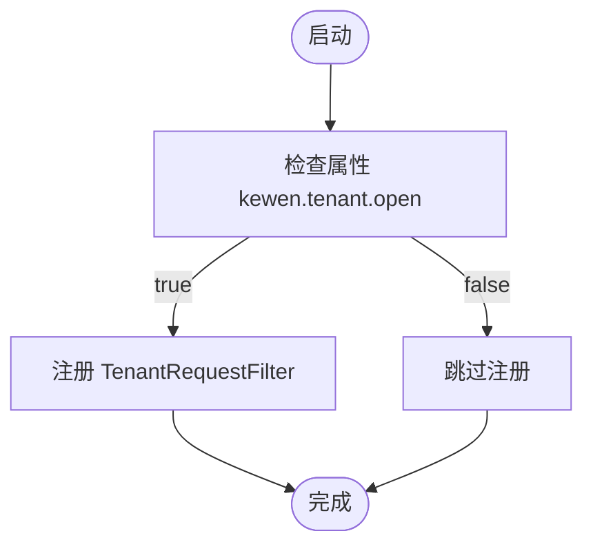
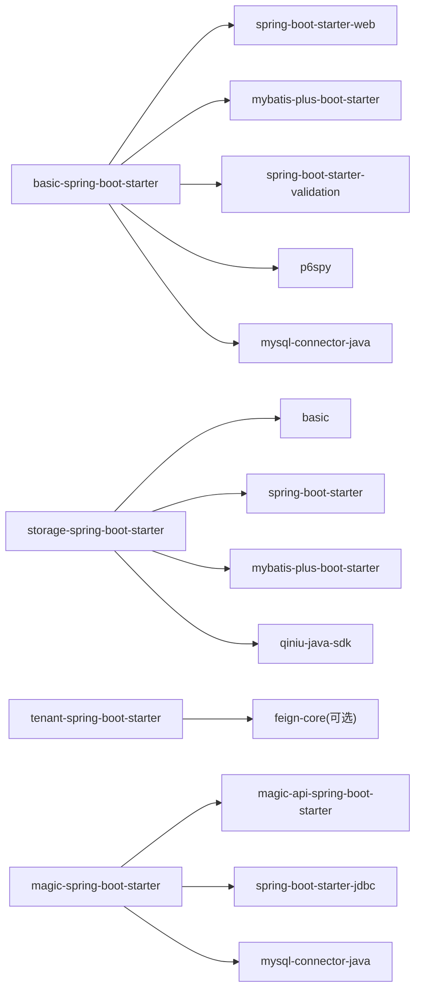

# 启动器模块（boot）

<cite>
**本文引用的文件**
- [boot/pom.xml](file://boot/pom.xml)
- [basic-spring-boot-starter/pom.xml](file://boot/basic-spring-boot-starter/pom.xml)
- [storage-spring-boot-starter/pom.xml](file://boot/storage-spring-boot-starter/pom.xml)
- [tenant-spring-boot-starter/pom.xml](file://boot/tenant-spring-boot-starter/pom.xml)
- [magic-spring-boot-starter/pom.xml](file://boot/magic-spring-boot-starter/pom.xml)
- [basic-spring-boot-starter/src/main/resources/META-INF/spring.factories](file://boot/basic-spring-boot-starter/src/main/resources/META-INF/spring.factories)
- [storage-spring-boot-starter/src/main/resources/META-INF/spring.factories](file://boot/storage-spring-boot-starter/src/main/resources/META-INF/spring.factories)
- [tenant-spring-boot-starter/src/main/resources/META-INF/spring.factories](file://boot/tenant-spring-boot-starter/src/main/resources/META-INF/spring.factories)
- [basic-spring-boot-starter/src/main/resources/META-INF/additional-spring-configuration-metadata.json](file://boot/basic-spring-boot-starter/src/main/resources/META-INF/additional-spring-configuration-metadata.json)
- [tenant-spring-boot-starter/src/main/resources/META-INF/additional-spring-configuration-metadata.json](file://boot/tenant-spring-boot-starter/src/main/resources/META-INF/additional-spring-configuration-metadata.json)
- [basic-spring-boot-starter/src/main/java/com/kewen/framework/boot/basic/config/AsyncConfig.java](file://boot/basic-spring-boot-starter/src/main/java/com/kewen/framework/boot/basic/config/AsyncConfig.java)
- [basic-spring-boot-starter/src/main/java/com/kewen/framework/boot/basic/config/MybatisPlusConfig.java](file://boot/basic-spring-boot-starter/src/main/java/com/kewen/framework/boot/basic/config/MybatisPlusConfig.java)
- [basic-spring-boot-starter/src/main/java/com/kewen/framework/boot/basic/config/RequestResponseFormatConfig.java](file://boot/basic-spring-boot-starter/src/main/java/com/kewen/framework/boot/basic/config/RequestResponseFormatConfig.java)
- [storage-spring-boot-starter/src/main/java/com/kewen/framework/storage/boot/StorageAutoConfiguration.java](file://boot/storage-spring-boot-starter/src/main/java/com/kewen/framework/storage/boot/StorageAutoConfiguration.java)
- [tenant-spring-boot-starter/src/main/java/com/kewen/framework/tenant/config/TenantConfig.java](file://boot/tenant-spring-boot-starter/src/main/java/com/kewen/framework/tenant/config/TenantConfig.java)
</cite>

## 目录
1. [简介](#简介)
2. [项目结构](#项目结构)
3. [核心组件](#核心组件)
4. [架构总览](#架构总览)
5. [详细组件分析](#详细组件分析)
6. [依赖分析](#依赖分析)
7. [性能考虑](#性能考虑)
8. [故障排除指南](#故障排除指南)
9. [结论](#结论)
10. [附录](#附录)

## 简介
本文件面向“启动器模块（boot）”，系统性阐述四个 Spring Boot Starter 的工作原理与自动配置机制，覆盖以下内容：
- basic-spring-boot-starter：基础能力封装（异步线程池、MyBatis-Plus 分页、请求响应格式化、早期过滤器、消息与持久化支持等）
- storage-spring-boot-starter：文件存储集成（基于七牛云的存储模板、上传回调、前端响应增强、Mapper 扫描与服务装配）
- tenant-spring-boot-starter：多租户支持（条件启用的租户过滤器、可选 Feign 头注入）
- magic-spring-boot-starter：API 格式化与脚本化接口（基于 magic-api 的 Spring Boot Starter）

文档同时提供各启动器的自动配置类、属性配置、使用场景、配置示例路径与最佳实践，并给出故障排除与性能优化建议。

## 项目结构
boot 模块采用聚合工程组织，包含四个子模块：basic、storage、tenant、magic。每个子模块均通过 spring.factories 声明自动配置类，实现“开箱即用”。

图表来源
- [boot/pom.xml:16-21](file://boot/pom.xml#L16-L21)
- [basic-spring-boot-starter/pom.xml:1-62](file://boot/basic-spring-boot-starter/pom.xml#L1-L62)
- [storage-spring-boot-starter/pom.xml:1-46](file://boot/storage-spring-boot-starter/pom.xml#L1-L46)
- [tenant-spring-boot-starter/pom.xml:1-42](file://boot/tenant-spring-boot-starter/pom.xml#L1-L42)
- [magic-spring-boot-starter/pom.xml:1-44](file://boot/magic-spring-boot-starter/pom.xml#L1-L44)

章节来源
- [boot/pom.xml:16-21](file://boot/pom.xml#L16-L21)

## 核心组件
- 自动配置入口：各启动器通过 spring.factories 声明 EnableAutoConfiguration，Spring Boot 在启动时扫描并加载对应配置类。
- 属性元数据：additional-spring-configuration-metadata.json 提供 IDE 智能提示与默认值，便于配置校验与使用。
- 组件装配：自动配置类负责注册 Bean（线程池、拦截器、过滤器、存储模板、控制器等），并按需启用。

章节来源
- [basic-spring-boot-starter/src/main/resources/META-INF/spring.factories:1-7](file://boot/basic-spring-boot-starter/src/main/resources/META-INF/spring.factories#L1-L7)
- [storage-spring-boot-starter/src/main/resources/META-INF/spring.factories:1-2](file://boot/storage-spring-boot-starter/src/main/resources/META-INF/spring.factories#L1-L2)
- [tenant-spring-boot-starter/src/main/resources/META-INF/spring.factories:1-3](file://boot/tenant-spring-boot-starter/src/main/resources/META-INF/spring.factories#L1-L3)
- [basic-spring-boot-starter/src/main/resources/META-INF/additional-spring-configuration-metadata.json:1-16](file://boot/basic-spring-boot-starter/src/main/resources/META-INF/additional-spring-configuration-metadata.json#L1-L16)
- [tenant-spring-boot-starter/src/main/resources/META-INF/additional-spring-configuration-metadata.json:1-10](file://boot/tenant-spring-boot-starter/src/main/resources/META-INF/additional-spring-configuration-metadata.json#L1-L10)

## 架构总览
下图展示四个启动器在 Spring Boot 启动过程中的装配关系与关键 Bean：

图表来源
- [basic-spring-boot-starter/src/main/java/com/kewen/framework/boot/basic/config/AsyncConfig.java:19-59](file://boot/basic-spring-boot-starter/src/main/java/com/kewen/framework/boot/basic/config/AsyncConfig.java#L19-L59)
- [basic-spring-boot-starter/src/main/java/com/kewen/framework/boot/basic/config/MybatisPlusConfig.java:9-23](file://boot/basic-spring-boot-starter/src/main/java/com/kewen/framework/boot/basic/config/MybatisPlusConfig.java#L9-L23)
- [basic-spring-boot-starter/src/main/java/com/kewen/framework/boot/basic/config/RequestResponseFormatConfig.java:28-110](file://boot/basic-spring-boot-starter/src/main/java/com/kewen/framework/boot/basic/config/RequestResponseFormatConfig.java#L28-L110)
- [storage-spring-boot-starter/src/main/java/com/kewen/framework/storage/boot/StorageAutoConfiguration.java:23-70](file://boot/storage-spring-boot-starter/src/main/java/com/kewen/framework/storage/boot/StorageAutoConfiguration.java#L23-L70)
- [tenant-spring-boot-starter/src/main/java/com/kewen/framework/tenant/config/TenantConfig.java:14-22](file://boot/tenant-spring-boot-starter/src/main/java/com/kewen/framework/tenant/config/TenantConfig.java#L14-L22)

## 详细组件分析

### basic-spring-boot-starter（基础启动器）
- 自动配置类
  - 异步线程池：定义全局异步执行器与异常处理器，避免 Spring 默认策略导致的线程池选择歧义。
  - MyBatis-Plus 分页插件：注册分页拦截器，支持 MySQL。
  - 请求/响应格式化与异常增强：统一 Jackson 序列化规则、日期时间转换器、异常统一处理与响应体追踪增强。
- 属性配置
  - kewen.request.persistent.database：控制请求日志是否持久化到数据库。
  - kewen.request.message.fang-tang：控制请求 IP 是否发送至方糖消息通道。
- 使用场景
  - 快速搭建 Web 工程，统一异常与响应格式，启用异步任务与分页能力。
- 配置示例与最佳实践
  - 在 application.yml 中设置上述属性以启用相应功能。
  - 如需自定义线程池参数，可在 AsyncConfig 中调整核心/最大线程数、队列容量与拒绝策略。
  - 分页插件已内置，无需额外配置；如使用多数据源，遵循 MyBatis-Plus 插件顺序要求。
- 代码级流程（异步线程池）

图表来源
- [basic-spring-boot-starter/src/main/java/com/kewen/framework/boot/basic/config/AsyncConfig.java:31-49](file://boot/basic-spring-boot-starter/src/main/java/com/kewen/framework/boot/basic/config/AsyncConfig.java#L31-L49)

章节来源
- [basic-spring-boot-starter/src/main/resources/META-INF/spring.factories:1-7](file://boot/basic-spring-boot-starter/src/main/resources/META-INF/spring.factories#L1-L7)
- [basic-spring-boot-starter/src/main/resources/META-INF/additional-spring-configuration-metadata.json:1-16](file://boot/basic-spring-boot-starter/src/main/resources/META-INF/additional-spring-configuration-metadata.json#L1-L16)
- [basic-spring-boot-starter/src/main/java/com/kewen/framework/boot/basic/config/AsyncConfig.java:19-59](file://boot/basic-spring-boot-starter/src/main/java/com/kewen/framework/boot/basic/config/AsyncConfig.java#L19-L59)
- [basic-spring-boot-starter/src/main/java/com/kewen/framework/boot/basic/config/MybatisPlusConfig.java:9-23](file://boot/basic-spring-boot-starter/src/main/java/com/kewen/framework/boot/basic/config/MybatisPlusConfig.java#L9-L23)
- [basic-spring-boot-starter/src/main/java/com/kewen/framework/boot/basic/config/RequestResponseFormatConfig.java:28-110](file://boot/basic-spring-boot-starter/src/main/java/com/kewen/framework/boot/basic/config/RequestResponseFormatConfig.java#L28-L110)

### storage-spring-boot-starter（文件存储启动器）
- 自动配置类
  - StorageAutoConfiguration：启用配置属性、Mapper 扫描、组件扫描，装配存储模板、上传回调端点、响应增强与默认文件处理器。
- 属性配置（StorageProperties）
  - 访问凭据、存储桶、根路径、是否公开、下载域名、上传回调地址等。
- 使用场景
  - 快速集成对象存储（七牛云），提供上传、断点续传、回调通知与前端响应增强。
- 配置示例与最佳实践
  - 在 application.yml 中填写存储相关参数；若使用回调，确保回调地址可达且安全。
  - 可替换为其他存储实现，仅需替换 StorageTemplate Bean 即可。
- 代码级流程（存储模板装配）

图表来源
- [storage-spring-boot-starter/src/main/java/com/kewen/framework/storage/boot/StorageAutoConfiguration.java:23-70](file://boot/storage-spring-boot-starter/src/main/java/com/kewen/framework/storage/boot/StorageAutoConfiguration.java#L23-L70)

章节来源
- [storage-spring-boot-starter/src/main/resources/META-INF/spring.factories:1-2](file://boot/storage-spring-boot-starter/src/main/resources/META-INF/spring.factories#L1-L2)
- [storage-spring-boot-starter/src/main/java/com/kewen/framework/storage/boot/StorageAutoConfiguration.java:23-70](file://boot/storage-spring-boot-starter/src/main/java/com/kewen/framework/storage/boot/StorageAutoConfiguration.java#L23-L70)

### tenant-spring-boot-starter（多租户启动器）
- 自动配置类
  - TenantConfig：基于属性开关条件启用租户过滤器；同时声明 Feign 头拦截器（当 Feign 存在时生效）。
- 属性配置
  - kewen.tenant.open：是否开启租户能力。
- 使用场景
  - 需要按租户隔离数据或请求头透传的微服务或多租户应用。
- 配置示例与最佳实践
  - 在 application.yml 中设置开关；如跨服务调用，确保 Feign 客户端正确注入租户头。
- 条件启用流程

图表来源
- [tenant-spring-boot-starter/src/main/java/com/kewen/framework/tenant/config/TenantConfig.java:14-22](file://boot/tenant-spring-boot-starter/src/main/java/com/kewen/framework/tenant/config/TenantConfig.java#L14-L22)

章节来源
- [tenant-spring-boot-starter/src/main/resources/META-INF/spring.factories:1-3](file://boot/tenant-spring-boot-starter/src/main/resources/META-INF/spring.factories#L1-L3)
- [tenant-spring-boot-starter/src/main/resources/META-INF/additional-spring-configuration-metadata.json:1-10](file://boot/tenant-spring-boot-starter/src/main/resources/META-INF/additional-spring-configuration-metadata.json#L1-L10)
- [tenant-spring-boot-starter/src/main/java/com/kewen/framework/tenant/config/TenantConfig.java:14-22](file://boot/tenant-spring-boot-starter/src/main/java/com/kewen/framework/tenant/config/TenantConfig.java#L14-L22)

### magic-spring-boot-starter（魔法API启动器）
- 依赖与集成
  - 引入 magic-api Spring Boot Starter，提供动态 API 与脚本化接口能力。
  - 内置 JDBC 与 MySQL 依赖，便于快速访问数据源。
- 使用场景
  - 需要快速暴露动态接口、脚本化处理业务逻辑或简化临时接口开发。
- 配置示例与最佳实践
  - 在 application.yml 中配置数据源与 magic-api 相关参数；结合业务需求编写脚本接口。
  - 注意生产环境的安全与性能问题，限制脚本权限与执行时间。

章节来源
- [magic-spring-boot-starter/pom.xml:20-42](file://boot/magic-spring-boot-starter/pom.xml#L20-L42)

## 依赖分析
- basic-spring-boot-starter
  - 依赖 basic、basic-support、spring-boot-starter-web、mybatis-plus-boot-starter、validation、p6spy、mysql 驱动。
  - 作用：提供 Web、ORM、校验、日志监控与数据库连接能力。
- storage-spring-boot-starter
  - 依赖 basic、spring-boot-starter、mybatis-plus-boot-starter、七牛 Java SDK。
  - 作用：提供文件存储能力与相关控制器、服务与 Mapper。
- tenant-spring-boot-starter
  - 依赖 basic、spring-boot-starter-web；Feign 为可选依赖（用于开启租户头注入）。
  - 作用：提供租户过滤与可选的 Feign 头透传。
- magic-spring-boot-starter
  - 依赖 basic、magic-api Spring Boot Starter、spring-boot-starter-jdbc、MySQL 驱动。
  - 作用：提供脚本化 API 能力与数据访问。

图表来源
- [basic-spring-boot-starter/pom.xml:20-61](file://boot/basic-spring-boot-starter/pom.xml#L20-L61)
- [storage-spring-boot-starter/pom.xml:20-45](file://boot/storage-spring-boot-starter/pom.xml#L20-L45)
- [tenant-spring-boot-starter/pom.xml:20-40](file://boot/tenant-spring-boot-starter/pom.xml#L20-L40)
- [magic-spring-boot-starter/pom.xml:20-42](file://boot/magic-spring-boot-starter/pom.xml#L20-L42)

章节来源
- [basic-spring-boot-starter/pom.xml:20-61](file://boot/basic-spring-boot-starter/pom.xml#L20-L61)
- [storage-spring-boot-starter/pom.xml:20-45](file://boot/storage-spring-boot-starter/pom.xml#L20-L45)
- [tenant-spring-boot-starter/pom.xml:20-40](file://boot/tenant-spring-boot-starter/pom.xml#L20-L40)
- [magic-spring-boot-starter/pom.xml:20-42](file://boot/magic-spring-boot-starter/pom.xml#L20-L42)

## 性能考虑
- 异步线程池
  - 合理设置核心/最大线程数与队列容量，避免频繁拒绝任务或内存占用过高。
  - 拒绝策略建议根据业务特性选择丢弃或调用线程执行，减少任务丢失。
- MyBatis-Plus 分页
  - 对大表查询务必使用分页；避免一次性加载全量数据。
  - 多数据源场景谨慎配置 DbType，防止插件失效。
- 文件存储
  - 上传回调与响应增强可能带来额外开销，建议在高并发场景评估回调链路与序列化成本。
- 多租户
  - 条件启用租户过滤器，避免无租户场景下的无效拦截。
- magic-api
  - 生产环境应限制脚本执行范围与超时，避免资源滥用。

## 故障排除指南
- 启动失败或找不到线程池
  - 现象：@Async 报错或未使用预期线程池。
  - 排查：确认 AsyncConfig 已被加载；检查是否存在多个 Executor 导致选择歧义。
  - 参考
    - [basic-spring-boot-starter/src/main/java/com/kewen/framework/boot/basic/config/AsyncConfig.java:19-59](file://boot/basic-spring-boot-starter/src/main/java/com/kewen/framework/boot/basic/config/AsyncConfig.java#L19-L59)
- 分页不生效
  - 现象：查询未分页或抛出插件顺序错误。
  - 排查：确保分页插件最后添加；多数据源场景可不指定 DbType。
  - 参考
    - [basic-spring-boot-starter/src/main/java/com/kewen/framework/boot/basic/config/MybatisPlusConfig.java:9-23](file://boot/basic-spring-boot-starter/src/main/java/com/kewen/framework/boot/basic/config/MybatisPlusConfig.java#L9-L23)
- 请求响应格式异常
  - 现象：日期字段格式不一致或 Long 精度丢失。
  - 排查：核对 Jackson 序列化规则与日期转换器；必要时调整 ObjectMapper 配置。
  - 参考
    - [basic-spring-boot-starter/src/main/java/com/kewen/framework/boot/basic/config/RequestResponseFormatConfig.java:28-110](file://boot/basic-spring-boot-starter/src/main/java/com/kewen/framework/boot/basic/config/RequestResponseFormatConfig.java#L28-L110)
- 文件上传回调失败
  - 现象：上传成功但回调未触发或失败。
  - 排查：确认回调地址可访问、签名与域名配置正确；查看回调端点日志。
  - 参考
    - [storage-spring-boot-starter/src/main/java/com/kewen/framework/storage/boot/StorageAutoConfiguration.java:23-70](file://boot/storage-spring-boot-starter/src/main/java/com/kewen/framework/storage/boot/StorageAutoConfiguration.java#L23-L70)
- 租户开关无效
  - 现象：设置 kewen.tenant.open=true 后租户过滤器未生效。
  - 排查：确认属性键值正确；若使用 Feign，确保依赖存在。
  - 参考
    - [tenant-spring-boot-starter/src/main/resources/META-INF/additional-spring-configuration-metadata.json:1-10](file://boot/tenant-spring-boot-starter/src/main/resources/META-INF/additional-spring-configuration-metadata.json#L1-L10)
    - [tenant-spring-boot-starter/src/main/java/com/kewen/framework/tenant/config/TenantConfig.java:14-22](file://boot/tenant-spring-boot-starter/src/main/java/com/kewen/framework/tenant/config/TenantConfig.java#L14-L22)

## 结论
boot 启动器模块通过自动配置与属性元数据，为不同业务场景提供了即插即用的能力：
- basic：统一 Web、ORM、异步与格式化能力；
- storage：快速对接对象存储并提供上传与回调；
- tenant：按需启用租户隔离与 Feign 头透传；
- magic：借助 magic-api 快速构建动态接口。

建议在实际项目中结合业务特性合理启用与定制，关注线程池、分页、回调与脚本安全等关键点，以获得稳定与高性能的运行效果。

## 附录
- 配置示例路径（不展示具体配置内容）
  - basic-spring-boot-starter 属性示例路径：[basic-spring-boot-starter/src/main/resources/META-INF/additional-spring-configuration-metadata.json:1-16](file://boot/basic-spring-boot-starter/src/main/resources/META-INF/additional-spring-configuration-metadata.json#L1-L16)
  - tenant-spring-boot-starter 属性示例路径：[tenant-spring-boot-starter/src/main/resources/META-INF/additional-spring-configuration-metadata.json:1-10](file://boot/tenant-spring-boot-starter/src/main/resources/META-INF/additional-spring-configuration-metadata.json#L1-L10)
- 自动配置类清单
  - basic：AsyncConfig、MybatisPlusConfig、RequestResponseFormatConfig
  - storage：StorageAutoConfiguration
  - tenant：TenantConfig
- 依赖清单
  - basic：spring-boot-starter-web、mybatis-plus-boot-starter、validation、p6spy、mysql
  - storage：spring-boot-starter、mybatis-plus-boot-starter、qiniu-java-sdk
  - tenant：spring-boot-starter-web、feign-core(可选)
  - magic：magic-api-spring-boot-starter、spring-boot-starter-jdbc、mysql