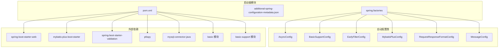
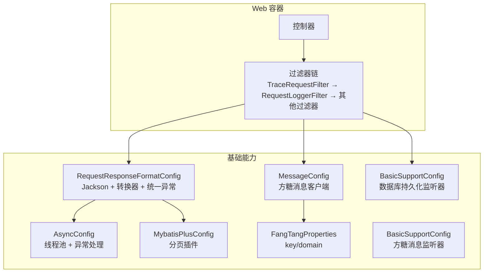
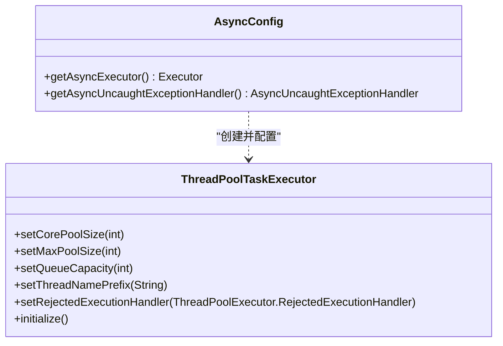
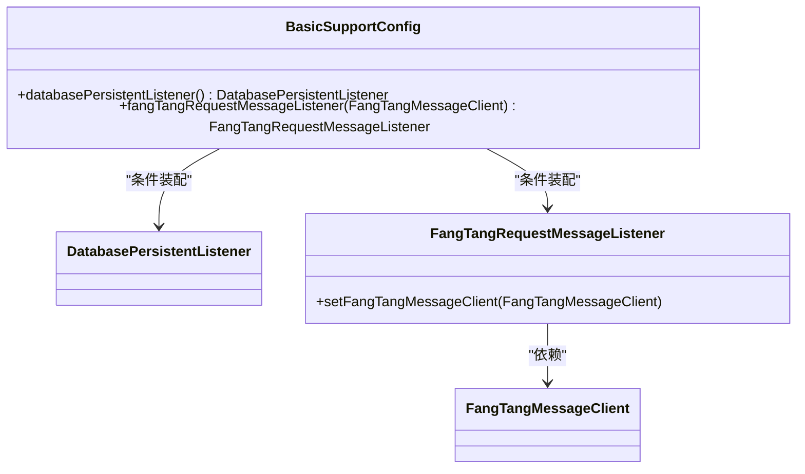
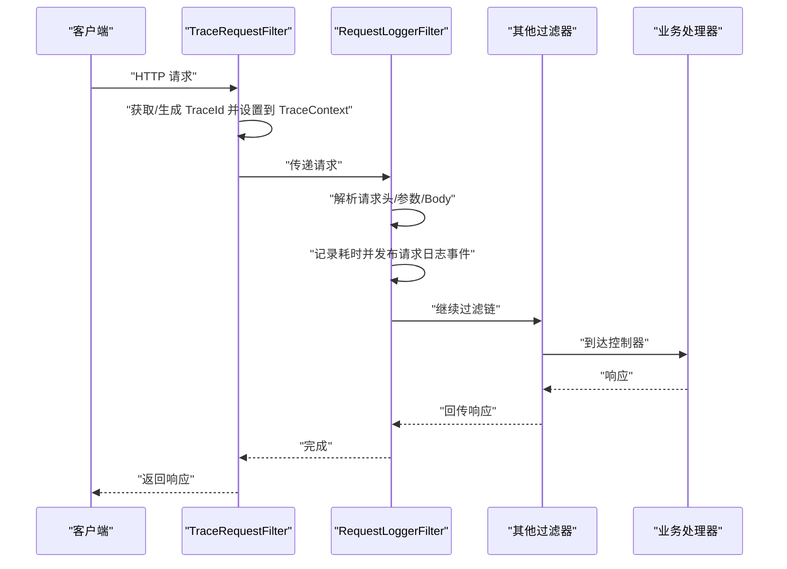
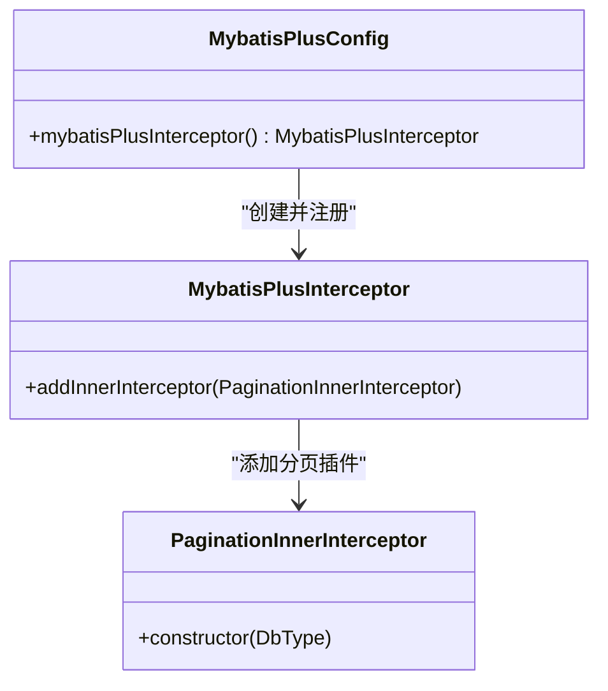
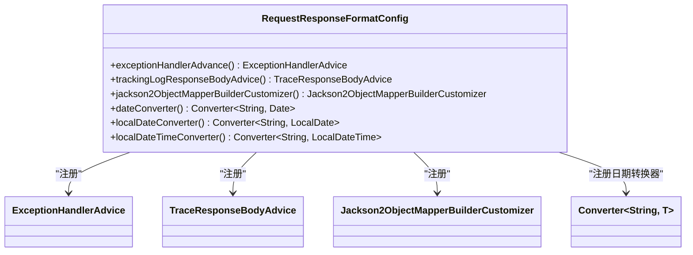
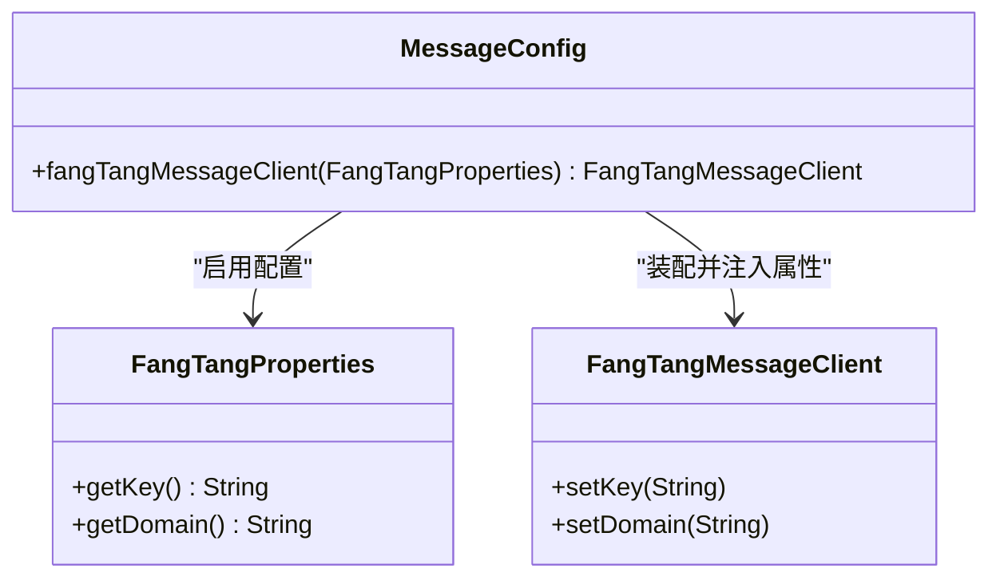
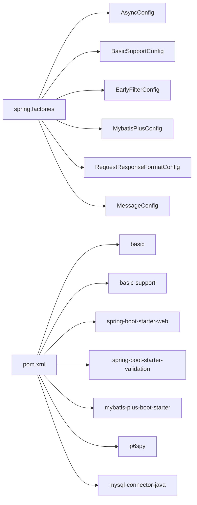

# 基础启动器（basic-spring-boot-starter）技术文档

<cite>
**本文档引用的文件**
- [BasicSupportConfig.java](file://boot/basic-spring-boot-starter/src/main/java/com/kewen/framework/boot/basic/config/BasicSupportConfig.java)
- [AsyncConfig.java](file://boot/basic-spring-boot-starter/src/main/java/com/kewen/framework/boot/basic/config/AsyncConfig.java)
- [EarlyFilterConfig.java](file://boot/basic-spring-boot-starter/src/main/java/com/kewen/framework/boot/basic/config/EarlyFilterConfig.java)
- [MybatisPlusConfig.java](file://boot/basic-spring-boot-starter/src/main/java/com/kewen/framework/boot/basic/config/MybatisPlusConfig.java)
- [RequestResponseFormatConfig.java](file://boot/basic-spring-boot-starter/src/main/java/com/kewen/framework/boot/basic/config/RequestResponseFormatConfig.java)
- [MessageConfig.java](file://boot/basic-spring-boot-starter/src/main/java/com/kewen/framework/boot/basic/config/MessageConfig.java)
- [FangTangProperties.java](file://boot/basic-spring-boot-starter/src/main/java/com/kewen/framework/boot/basic/properties/FangTangProperties.java)
- [spring.factories](file://boot/basic-spring-boot-starter/src/main/resources/META-INF/spring.factories)
- [additional-spring-configuration-metadata.json](file://boot/basic-spring-boot-starter/src/main/resources/META-INF/additional-spring-configuration-metadata.json)
- [pom.xml](file://boot/basic-spring-boot-starter/pom.xml)
- [EarlyRequestFilter.java](file://basic/src/main/java/com/kewen/framework/basic/filter/EarlyRequestFilter.java)
- [RequestLoggerFilter.java](file://basic/src/main/java/com/kewen/framework/basic/logger/RequestLoggerFilter.java)
- [TraceRequestFilter.java](file://basic/src/main/java/com/kewen/framework/basic/logger/TraceRequestFilter.java)
- [TraceIdProcessor.java](file://basic/src/main/java/com/kewen/framework/basic/logger/trace/TraceIdProcessor.java)
- [HeaderTraceIdProcessor.java](file://basic/src/main/java/com/kewen/framework/basic/logger/trace/HeaderTraceIdProcessor.java)
- [application.yml](file://sample/basic-boot-sample/src/main/resources/application.yml)
</cite>

## 目录
1. [简介](#简介)
2. [项目结构](#项目结构)
3. [核心组件](#核心组件)
4. [架构总览](#架构总览)
5. [详细组件分析](#详细组件分析)
6. [依赖分析](#依赖分析)
7. [性能考虑](#性能考虑)
8. [故障排查指南](#故障排查指南)
9. [结论](#结论)
10. [附录](#附录)

## 简介
本文件面向基础启动器（basic-spring-boot-starter），系统性阐述其自动配置原理与实现机制，重点解析以下核心配置类的功能与作用：
- BasicSupportConfig：基础能力装配与条件化启用
- AsyncConfig：异步线程池配置与异常处理
- EarlyFilterConfig：早期过滤器链路装配
- MybatisPlusConfig：MyBatis Plus 分页插件装配
- RequestResponseFormatConfig：请求响应格式化与全局异常处理
- MessageConfig：方糖消息客户端装配
- FangTangProperties：方糖消息配置属性

同时，文档将给出 FangTangProperties 的完整配置项说明、环境配置示例、最佳实践、性能优化建议以及常见问题解决方案。

## 项目结构
基础启动器位于 boot/basic-spring-boot-starter 模块，采用“starter”标准结构，通过 spring.factories 自动装配多个配置类，并在 additional-spring-configuration-metadata.json 中声明可选配置项，配合 Maven 依赖引入基础模块 basic 与 basic-support。

图表来源
- [spring.factories:1-7](file://boot/basic-spring-boot-starter/src/main/resources/META-INF/spring.factories#L1-L7)
- [pom.xml:20-61](file://boot/basic-spring-boot-starter/pom.xml#L20-L61)

章节来源
- [spring.factories:1-7](file://boot/basic-spring-boot-starter/src/main/resources/META-INF/spring.factories#L1-L7)
- [pom.xml:1-62](file://boot/basic-spring-boot-starter/pom.xml#L1-L62)

## 核心组件
本节概述各核心配置类职责与关键行为：

- AsyncConfig：启用异步执行并提供自定义线程池，设置核心/最大线程数、队列容量、拒绝策略与线程命名前缀；提供异步异常处理器。
- BasicSupportConfig：基于条件属性启用数据库请求日志持久化监听器与方糖消息监听器；扫描基础支持包与 Mapper。
- EarlyFilterConfig：装配 TraceRequestFilter（链路追踪）、RequestLoggerFilter（请求日志）与 EarlyRequestFilterProxy（早期过滤器代理）。
- MybatisPlusConfig：注册 MyBatis Plus 分页插件，支持 MySQL 数据库类型。
- RequestResponseFormatConfig：注册全局 Jackson 序列化/反序列化定制、日期时间转换器、异常统一处理与响应体追踪增强。
- MessageConfig：启用 FangTangProperties 并装配 FangTangMessageClient。
- FangTangProperties：方糖消息客户端的 key 与 domain 配置项。

章节来源
- [AsyncConfig.java:1-60](file://boot/basic-spring-boot-starter/src/main/java/com/kewen/framework/boot/basic/config/AsyncConfig.java#L1-L60)
- [BasicSupportConfig.java:1-45](file://boot/basic-spring-boot-starter/src/main/java/com/kewen/framework/boot/basic/config/BasicSupportConfig.java#L1-L45)
- [EarlyFilterConfig.java:1-48](file://boot/basic-spring-boot-starter/src/main/java/com/kewen/framework/boot/basic/config/EarlyFilterConfig.java#L1-L48)
- [MybatisPlusConfig.java:1-24](file://boot/basic-spring-boot-starter/src/main/java/com/kewen/framework/boot/basic/config/MybatisPlusConfig.java#L1-L24)
- [RequestResponseFormatConfig.java:1-111](file://boot/basic-spring-boot-starter/src/main/java/com/kewen/framework/boot/basic/config/RequestResponseFormatConfig.java#L1-L111)
- [MessageConfig.java:1-35](file://boot/basic-spring-boot-starter/src/main/java/com/kewen/framework/boot/basic/config/MessageConfig.java#L1-L35)
- [FangTangProperties.java:1-40](file://boot/basic-spring-boot-starter/src/main/java/com/kewen/framework/boot/basic/properties/FangTangProperties.java#L1-L40)

## 架构总览
基础启动器通过 Spring Boot 自动装配机制加载多个配置类，形成“过滤器链 + 持久化 + 消息通知 + ORM + 异步 + 格式化”的一体化基础设施。

图表来源
- [spring.factories:1-7](file://boot/basic-spring-boot-starter/src/main/resources/META-INF/spring.factories#L1-L7)
- [AsyncConfig.java:19-59](file://boot/basic-spring-boot-starter/src/main/java/com/kewen/framework/boot/basic/config/AsyncConfig.java#L19-L59)
- [MybatisPlusConfig.java:9-23](file://boot/basic-spring-boot-starter/src/main/java/com/kewen/framework/boot/basic/config/MybatisPlusConfig.java#L9-L23)
- [RequestResponseFormatConfig.java:28-111](file://boot/basic-spring-boot-starter/src/main/java/com/kewen/framework/boot/basic/config/RequestResponseFormatConfig.java#L28-L111)
- [MessageConfig.java:15-34](file://boot/basic-spring-boot-starter/src/main/java/com/kewen/framework/boot/basic/config/MessageConfig.java#L15-L34)
- [FangTangProperties.java:12-39](file://boot/basic-spring-boot-starter/src/main/java/com/kewen/framework/boot/basic/properties/FangTangProperties.java#L12-L39)
- [BasicSupportConfig.java:18-44](file://boot/basic-spring-boot-starter/src/main/java/com/kewen/framework/boot/basic/config/BasicSupportConfig.java#L18-L44)

## 详细组件分析

### AsyncConfig（异步线程池）
- 功能要点
  - 启用 @EnableAsync，实现 AsyncConfigurer 提供自定义 Executor
  - 核心线程数：CPU 核数 × 2 + 1
  - 最大线程数：CPU 核数 × 5
  - 队列容量：CPU 核数 × 2
  - 拒绝策略：CallerRunsPolicy（主线程执行）
  - 线程命名前缀：this-excutor-
  - 初始化：显式 initialize()
  - 异常处理：打印类名、方法名、异常类型与消息
- 性能影响
  - IO 密集场景下，合理的核心/最大线程比可避免频繁创建销毁线程
  - CallerRunsPolicy 可降低突发峰值对系统的影响，但会增加调用线程负担
- 使用建议
  - 对高并发异步任务建议结合业务特征调整线程池参数
  - 如需多线程池隔离，可在实现类中暴露多个 Bean 并在 @Async 指定

图表来源
- [AsyncConfig.java:19-59](file://boot/basic-spring-boot-starter/src/main/java/com/kewen/framework/boot/basic/config/AsyncConfig.java#L19-L59)

章节来源
- [AsyncConfig.java:1-60](file://boot/basic-spring-boot-starter/src/main/java/com/kewen/framework/boot/basic/config/AsyncConfig.java#L1-L60)

### BasicSupportConfig（基础支持装配）
- 功能要点
  - 组件扫描：com.kewen.framework.basic.support
  - Mapper 扫描：com.kewen.framework.basic.support.**.mapper
  - 条件化 Bean：
    - 数据库持久化监听器：kewen.request.persistent.database=true
    - 方糖消息监听器：kewen.request.message.fang-tang=true
- 依赖关系
  - 依赖 basic-support 模块中的监听器与 Mapper
- 使用建议
  - 开启数据库持久化需确保对应表结构存在
  - 开启方糖消息需正确配置 FangTangProperties

图表来源
- [BasicSupportConfig.java:18-44](file://boot/basic-spring-boot-starter/src/main/java/com/kewen/framework/boot/basic/config/BasicSupportConfig.java#L18-L44)

章节来源
- [BasicSupportConfig.java:1-45](file://boot/basic-spring-boot-starter/src/main/java/com/kewen/framework/boot/basic/config/BasicSupportConfig.java#L1-L45)
- [additional-spring-configuration-metadata.json:1-16](file://boot/basic-spring-boot-starter/src/main/resources/META-INF/additional-spring-configuration-metadata.json#L1-L16)

### EarlyFilterConfig（早期过滤器装配）
- 功能要点
  - TraceRequestFilter：注入 TraceIdProcessor，设置/清理 TraceContext
  - RequestLoggerFilter：记录请求头、参数、Body、耗时并发布请求日志事件
  - EarlyRequestFilterProxy：聚合多个 EarlyRequestFilter 实现
- 顺序控制
  - TraceRequestFilter：@Order(1)
  - RequestLoggerFilter：@Order(3)
- 依赖关系
  - 依赖 basic 模块中的过滤器与 TraceIdProcessor 接口实现

图表来源
- [EarlyFilterConfig.java:20-47](file://boot/basic-spring-boot-starter/src/main/java/com/kewen/framework/boot/basic/config/EarlyFilterConfig.java#L20-L47)
- [TraceRequestFilter.java:24-51](file://basic/src/main/java/com/kewen/framework/basic/logger/TraceRequestFilter.java#L24-L51)
- [RequestLoggerFilter.java:30-74](file://basic/src/main/java/com/kewen/framework/basic/logger/RequestLoggerFilter.java#L30-L74)
- [EarlyRequestFilter.java:14-23](file://basic/src/main/java/com/kewen/framework/basic/filter/EarlyRequestFilter.java#L14-L23)

章节来源
- [EarlyFilterConfig.java:1-48](file://boot/basic-spring-boot-starter/src/main/java/com/kewen/framework/boot/basic/config/EarlyFilterConfig.java#L1-L48)
- [TraceRequestFilter.java:1-52](file://basic/src/main/java/com/kewen/framework/basic/logger/TraceRequestFilter.java#L1-L52)
- [RequestLoggerFilter.java:1-125](file://basic/src/main/java/com/kewen/framework/basic/logger/RequestLoggerFilter.java#L1-L125)
- [EarlyRequestFilter.java:1-24](file://basic/src/main/java/com/kewen/framework/basic/filter/EarlyRequestFilter.java#L1-L24)

### MybatisPlusConfig（MyBatis Plus 分页插件）
- 功能要点
  - 注册 MyBatis Plus 拦截器
  - 添加分页内核插件，MySQL 类型
- 使用建议
  - 多数据源场景可不指定 DbType，按需配置

图表来源
- [MybatisPlusConfig.java:9-23](file://boot/basic-spring-boot-starter/src/main/java/com/kewen/framework/boot/basic/config/MybatisPlusConfig.java#L9-L23)

章节来源
- [MybatisPlusConfig.java:1-24](file://boot/basic-spring-boot-starter/src/main/java/com/kewen/framework/boot/basic/config/MybatisPlusConfig.java#L1-L24)

### RequestResponseFormatConfig（请求响应格式化）
- 功能要点
  - 注册统一异常处理增强：ExceptionHandlerAdvice
  - 注册响应体追踪增强：TraceResponseBodyAdvice
  - Jackson 全局定制：日期/时间序列化/反序列化、日期格式
  - 参数转换器：Date、LocalDate、LocalDateTime
- 性能影响
  - Jackson 定制减少反射开销，提升序列化效率
  - 转换器避免 MVC 参数绑定异常
- 使用建议
  - 前端处理 Long 精度时，可考虑服务端以字符串形式输出

图表来源
- [RequestResponseFormatConfig.java:28-111](file://boot/basic-spring-boot-starter/src/main/java/com/kewen/framework/boot/basic/config/RequestResponseFormatConfig.java#L28-L111)

章节来源
- [RequestResponseFormatConfig.java:1-111](file://boot/basic-spring-boot-starter/src/main/java/com/kewen/framework/boot/basic/config/RequestResponseFormatConfig.java#L1-L111)

### MessageConfig（方糖消息装配）
- 功能要点
  - 启用 FangTangProperties
  - 装配 FangTangMessageClient，并注入 key 与 domain
- 使用建议
  - 与 BasicSupportConfig 的方糖消息监听器配合使用

图表来源
- [MessageConfig.java:15-34](file://boot/basic-spring-boot-starter/src/main/java/com/kewen/framework/boot/basic/config/MessageConfig.java#L15-L34)
- [FangTangProperties.java:12-39](file://boot/basic-spring-boot-starter/src/main/java/com/kewen/framework/boot/basic/properties/FangTangProperties.java#L12-L39)

章节来源
- [MessageConfig.java:1-35](file://boot/basic-spring-boot-starter/src/main/java/com/kewen/framework/boot/basic/config/MessageConfig.java#L1-L35)
- [FangTangProperties.java:1-40](file://boot/basic-spring-boot-starter/src/main/java/com/kewen/framework/boot/basic/properties/FangTangProperties.java#L1-L40)

### FangTangProperties（方糖消息配置）
- 配置项
  - kewen.message.fang-tang.key：方糖密钥，默认值见属性类
  - kewen.message.fang-tang.domain：方糖域名，默认值见属性类
- 用途
  - 作为 MessageConfig 装配 FangTangMessageClient 的输入
- 最佳实践
  - 生产环境建议通过外部配置覆盖默认值
  - 密钥应妥善保管，避免泄露

章节来源
- [FangTangProperties.java:1-40](file://boot/basic-spring-boot-starter/src/main/java/com/kewen/framework/boot/basic/properties/FangTangProperties.java#L1-L40)
- [MessageConfig.java:15-34](file://boot/basic-spring-boot-starter/src/main/java/com/kewen/framework/boot/basic/config/MessageConfig.java#L15-L34)

## 依赖分析
- 自动装配入口
  - spring.factories 声明 EnableAutoConfiguration，加载多个配置类
- 配置元数据
  - additional-spring-configuration-metadata.json 声明可选配置项及其默认值与描述
- Maven 依赖
  - 基础模块：basic、basic-support
  - Web 与校验：spring-boot-starter-web、spring-boot-starter-validation
  - ORM：mybatis-plus-boot-starter
  - SQL 辅助：p6spy、mysql-connector-java

图表来源
- [spring.factories:1-7](file://boot/basic-spring-boot-starter/src/main/resources/META-INF/spring.factories#L1-L7)
- [pom.xml:20-61](file://boot/basic-spring-boot-starter/pom.xml#L20-L61)

章节来源
- [spring.factories:1-7](file://boot/basic-spring-boot-starter/src/main/resources/META-INF/spring.factories#L1-L7)
- [additional-spring-configuration-metadata.json:1-16](file://boot/basic-spring-boot-starter/src/main/resources/META-INF/additional-spring-configuration-metadata.json#L1-L16)
- [pom.xml:1-62](file://boot/basic-spring-boot-starter/pom.xml#L1-L62)

## 性能考虑
- 线程池参数
  - 核心/最大线程数与队列容量应结合 CPU 核心数与业务负载动态调整
  - CallerRunsPolicy 在高负载下可保护系统，但会增加主线程压力
- 过滤器链
  - 早期过滤器顺序合理，避免重复解析请求体与头部
  - 日志记录建议在开发/测试环境开启，生产环境谨慎评估日志量
- ORM 插件
  - 分页插件仅在需要分页时生效，避免误用导致性能下降
- Jackson 定制
  - 固定日期格式与序列化策略可减少反射与格式化开销
- 数据库连接
  - HikariCP 参数需根据实例规格与并发需求调优，避免连接池抖动

## 故障排查指南
- 异步任务未生效或报错
  - 检查是否正确启用 @EnableAsync 且仅有一个 Executor Bean
  - 若存在多个线程池，需在 @Async 指定具体线程池名称
- 线程池拒绝策略导致主线程阻塞
  - CallerRunsPolicy 会在高负载下让调用线程执行任务，检查业务是否可接受
- 请求日志未落库或未发消息
  - 确认相应开关已开启：kewen.request.persistent.database 与 kewen.request.message.fang-tang
  - 确认 basic-support 模块依赖与 Mapper 扫描路径正确
- 方糖消息未发送
  - 检查 FangTangProperties 的 key 与 domain 是否正确配置
- 过滤器顺序异常
  - 确认 TraceRequestFilter 与 RequestLoggerFilter 的 @Order 顺序符合预期
- 日期参数绑定失败
  - 检查请求日期格式是否与转换器匹配（yyyy-MM-dd 或 yyyy-MM-dd HH:mm:ss）

章节来源
- [AsyncConfig.java:19-59](file://boot/basic-spring-boot-starter/src/main/java/com/kewen/framework/boot/basic/config/AsyncConfig.java#L19-L59)
- [BasicSupportConfig.java:18-44](file://boot/basic-spring-boot-starter/src/main/java/com/kewen/framework/boot/basic/config/BasicSupportConfig.java#L18-L44)
- [MessageConfig.java:15-34](file://boot/basic-spring-boot-starter/src/main/java/com/kewen/framework/boot/basic/config/MessageConfig.java#L15-L34)
- [FangTangProperties.java:12-39](file://boot/basic-spring-boot-starter/src/main/java/com/kewen/framework/boot/basic/properties/FangTangProperties.java#L12-L39)
- [EarlyFilterConfig.java:20-47](file://boot/basic-spring-boot-starter/src/main/java/com/kewen/framework/boot/basic/config/EarlyFilterConfig.java#L20-L47)
- [RequestResponseFormatConfig.java:75-111](file://boot/basic-spring-boot-starter/src/main/java/com/kewen/framework/boot/basic/config/RequestResponseFormatConfig.java#L75-L111)

## 结论
基础启动器通过自动装配将“过滤器链、ORM 分页、异步线程池、请求响应格式化、消息通知与数据库持久化”整合为一套即插即用的基础能力，开发者可通过少量配置即可启用所需功能。建议在生产环境结合实际负载调优线程池与连接池参数，并合理开启日志与消息功能，以获得稳定与高性能的服务体验。

## 附录

### 配置项与示例
- 基础开关
  - kewen.request.persistent.database：是否开启请求日志持久化到数据库
  - kewen.request.message.fang-tang：是否开启请求消息方糖渠道通知
- 方糖消息
  - kewen.message.fang-tang.key：方糖密钥
  - kewen.message.fang-tang.domain：方糖域名
- 示例配置（来自样例工程）
  - 数据源与 P6Spy 驱动
  - HikariCP 连接池参数
  - 基础开关与方糖消息开关

章节来源
- [additional-spring-configuration-metadata.json:1-16](file://boot/basic-spring-boot-starter/src/main/resources/META-INF/additional-spring-configuration-metadata.json#L1-L16)
- [FangTangProperties.java:12-39](file://boot/basic-spring-boot-starter/src/main/java/com/kewen/framework/boot/basic/properties/FangTangProperties.java#L12-L39)
- [application.yml:1-30](file://sample/basic-boot-sample/src/main/resources/application.yml#L1-L30)