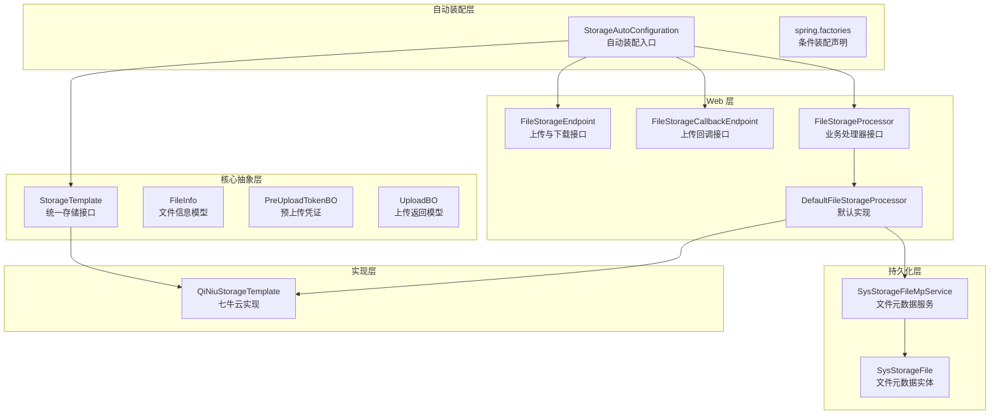
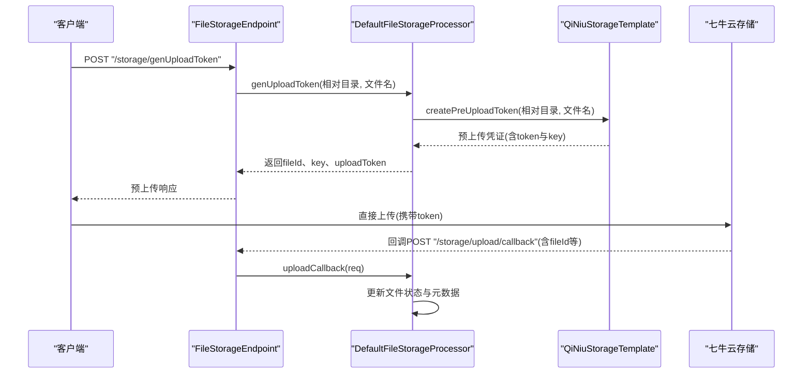
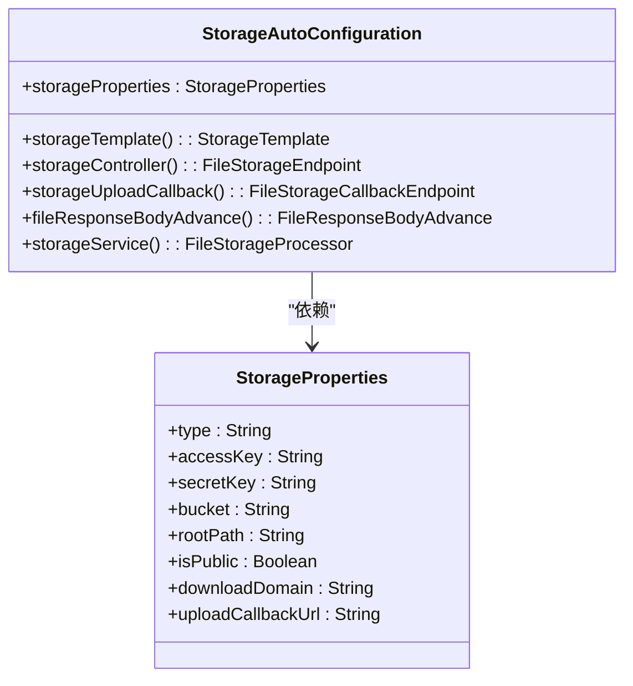
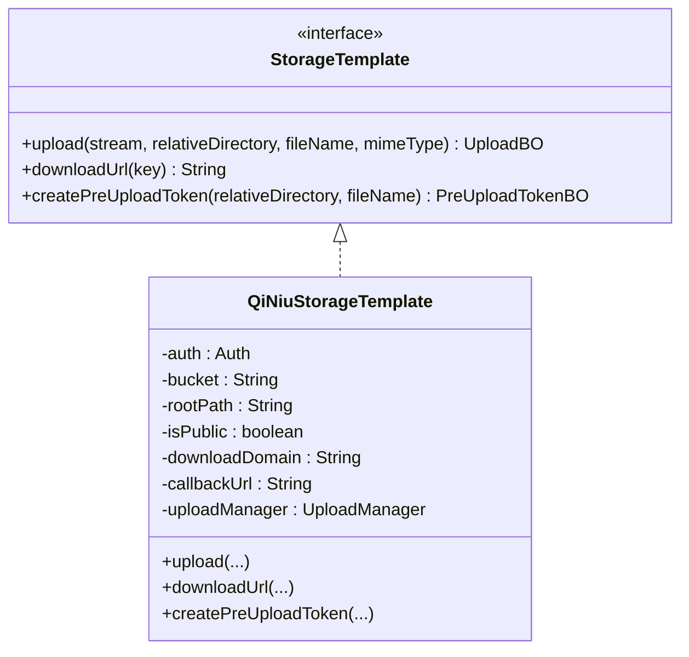
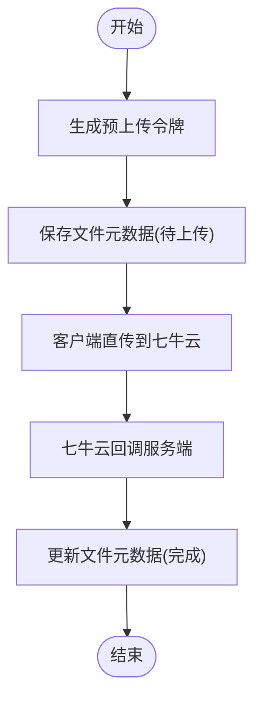
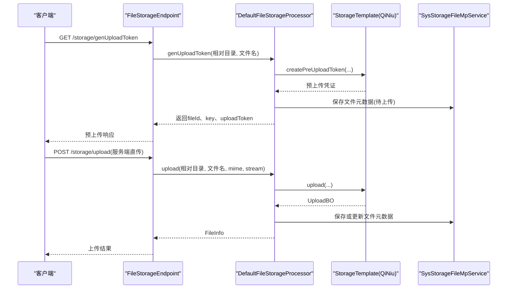
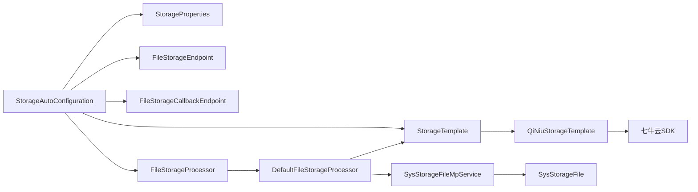

# 存储启动器 (storage-spring-boot-starter) 技术文档

<cite>
**本文档引用的文件**
- [StorageAutoConfiguration.java](file://boot/storage-spring-boot-starter/src/main/java/com/kewen/framework/storage/boot/StorageAutoConfiguration.java)
- [StorageProperties.java](file://boot/storage-spring-boot-starter/src/main/java/com/kewen/framework/storage/boot/StorageProperties.java)
- [StorageTemplate.java](file://boot/storage-spring-boot-starter/src/main/java/com/kewen/framework/storage/core/StorageTemplate.java)
- [QiNiuStorageTemplate.java](file://boot/storage-spring-boot-starter/src/main/java/com/kewen/framework/storage/core/qiniu/QiNiuStorageTemplate.java)
- [PreUploadTokenBO.java](file://boot/storage-spring-boot-starter/src/main/java/com/kewen/framework/storage/core/model/PreUploadTokenBO.java)
- [UploadBO.java](file://boot/storage-spring-boot-starter/src/main/java/com/kewen/framework/storage/core/model/UploadBO.java)
- [FileInfo.java](file://boot/storage-spring-boot-starter/src/main/java/com/kewen/framework/storage/core/model/FileInfo.java)
- [FileStorageEndpoint.java](file://boot/storage-spring-boot-starter/src/main/java/com/kewen/framework/storage/web/FileStorageEndpoint.java)
- [FileStorageCallbackEndpoint.java](file://boot/storage-spring-boot-starter/src/main/java/com/kewen/framework/storage/web/FileStorageCallbackEndpoint.java)
- [FileStorageProcessor.java](file://boot/storage-spring-boot-starter/src/main/java/com/kewen/framework/storage/web/FileStorageProcessor.java)
- [DefaultFileStorageProcessor.java](file://boot/storage-spring-boot-starter/src/main/java/com/kewen/framework/storage/web/impl/DefaultFileStorageProcessor.java)
- [PreUploadTokenReq.java](file://boot/storage-spring-boot-starter/src/main/java/com/kewen/framework/storage/web/model/PreUploadTokenReq.java)
- [PreUploadTokenResp.java](file://boot/storage-spring-boot-starter/src/main/java/com/kewen/framework/storage/web/model/PreUploadTokenResp.java)
- [SysStorageFileMpService.java](file://boot/storage-spring-boot-starter/src/main/java/com/kewen/framework/storage/web/mp/service/SysStorageFileMpService.java)
- [SysStorageFile.java](file://boot/storage-spring-boot-starter/src/main/java/com/kewen/framework/storage/web/mp/entity/SysStorageFile.java)
- [spring.factories](file://boot/storage-spring-boot-starter/src/main/resources/META-INF/spring.factories)
- [application.yml](file://sample/storage-boot-sample/src/main/resources/application.yml)
</cite>

## 目录
1. [简介](#简介)
2. [项目结构](#项目结构)
3. [核心组件](#核心组件)
4. [架构总览](#架构总览)
5. [详细组件分析](#详细组件分析)
6. [依赖关系分析](#依赖关系分析)
7. [性能考虑](#性能考虑)
8. [故障排除指南](#故障排除指南)
9. [结论](#结论)
10. [附录](#附录)

## 简介
本技术文档面向存储启动器（storage-spring-boot-starter），系统性阐述其自动配置机制与核心工作原理，重点覆盖以下方面：
- 自动配置类 StorageAutoConfiguration 的装配逻辑与组件注入
- 配置项 StorageProperties 的字段含义与七牛云相关参数
- 接口设计 StorageTemplate 与七牛云实现 QiNiuStorageTemplate 的职责划分
- 文件上传完整流程：预上传令牌生成、客户端直传、服务端回调处理
- REST API 接口清单与使用示例
- 错误处理策略与性能优化建议

## 项目结构
存储启动器采用模块化分层组织：
- boot/storage-spring-boot-starter：Spring Boot 自动装配与对外接口
- core：核心抽象与数据模型
- web：HTTP 控制器与处理器
- web/mp：MyBatis-Plus 实体与服务（文件元数据持久化）

**图表来源**
- [StorageAutoConfiguration.java:23-70](file://boot/storage-spring-boot-starter/src/main/java/com/kewen/framework/storage/boot/StorageAutoConfiguration.java#L23-L70)
- [StorageTemplate.java:14-23](file://boot/storage-spring-boot-starter/src/main/java/com/kewen/framework/storage/core/StorageTemplate.java#L14-L23)
- [QiNiuStorageTemplate.java:23-68](file://boot/storage-spring-boot-starter/src/main/java/com/kewen/framework/storage/core/qiniu/QiNiuStorageTemplate.java#L23-L68)
- [FileStorageEndpoint.java:25-87](file://boot/storage-spring-boot-starter/src/main/java/com/kewen/framework/storage/web/FileStorageEndpoint.java#L25-L87)
- [FileStorageCallbackEndpoint.java:19-65](file://boot/storage-spring-boot-starter/src/main/java/com/kewen/framework/storage/web/FileStorageCallbackEndpoint.java#L19-L65)
- [FileStorageProcessor.java:15-54](file://boot/storage-spring-boot-starter/src/main/java/com/kewen/framework/storage/web/FileStorageProcessor.java#L15-L54)
- [DefaultFileStorageProcessor.java:24-122](file://boot/storage-spring-boot-starter/src/main/java/com/kewen/framework/storage/web/impl/DefaultFileStorageProcessor.java#L24-L122)
- [SysStorageFile.java](file://boot/storage-spring-boot-starter/src/main/java/com/kewen/framework/storage/web/mp/entity/SysStorageFile.java)
- [SysStorageFileMpService.java](file://boot/storage-spring-boot-starter/src/main/java/com/kewen/framework/storage/web/mp/service/SysStorageFileMpService.java)

**章节来源**
- [StorageAutoConfiguration.java:23-70](file://boot/storage-spring-boot-starter/src/main/java/com/kewen/framework/storage/boot/StorageAutoConfiguration.java#L23-L70)
- [spring.factories:1-2](file://boot/storage-spring-boot-starter/src/main/resources/META-INF/spring.factories#L1-L2)

## 核心组件
- 自动配置类：负责加载配置、注册 Bean、扫描 Mapper 与组件
- 配置属性类：封装七牛云相关参数
- 存储接口与实现：统一上传、下载、预上传令牌生成能力
- Web 控制器与处理器：提供 REST API 与业务编排
- 数据模型：文件信息、上传返回、预上传凭证
- 持久化服务：文件元数据的保存与更新

**章节来源**
- [StorageAutoConfiguration.java:23-70](file://boot/storage-spring-boot-starter/src/main/java/com/kewen/framework/storage/boot/StorageAutoConfiguration.java#L23-L70)
- [StorageProperties.java:14-44](file://boot/storage-spring-boot-starter/src/main/java/com/kewen/framework/storage/boot/StorageProperties.java#L14-L44)
- [StorageTemplate.java:14-23](file://boot/storage-spring-boot-starter/src/main/java/com/kewen/framework/storage/core/StorageTemplate.java#L14-L23)
- [QiNiuStorageTemplate.java:23-149](file://boot/storage-spring-boot-starter/src/main/java/com/kewen/framework/storage/core/qiniu/QiNiuStorageTemplate.java#L23-L149)
- [FileStorageEndpoint.java:25-87](file://boot/storage-spring-boot-starter/src/main/java/com/kewen/framework/storage/web/FileStorageEndpoint.java#L25-L87)
- [FileStorageProcessor.java:15-54](file://boot/storage-spring-boot-starter/src/main/java/com/kewen/framework/storage/web/FileStorageProcessor.java#L15-L54)
- [DefaultFileStorageProcessor.java:24-122](file://boot/storage-spring-boot-starter/src/main/java/com/kewen/framework/storage/web/impl/DefaultFileStorageProcessor.java#L24-L122)
- [FileInfo.java:10-24](file://boot/storage-spring-boot-starter/src/main/java/com/kewen/framework/storage/core/model/FileInfo.java#L10-L24)
- [PreUploadTokenBO.java:14-17](file://boot/storage-spring-boot-starter/src/main/java/com/kewen/framework/storage/core/model/PreUploadTokenBO.java#L14-L17)
- [UploadBO.java:11-16](file://boot/storage-spring-boot-starter/src/main/java/com/kewen/framework/storage/core/model/UploadBO.java#L11-L16)

## 架构总览
存储启动器通过 Spring Boot 自动装配机制，将七牛云 SDK 与内部业务处理器整合为统一的文件存储能力。核心交互链路如下：

**图表来源**
- [FileStorageEndpoint.java:40-47](file://boot/storage-spring-boot-starter/src/main/java/com/kewen/framework/storage/web/FileStorageEndpoint.java#L40-L47)
- [DefaultFileStorageProcessor.java:34-53](file://boot/storage-spring-boot-starter/src/main/java/com/kewen/framework/storage/web/impl/DefaultFileStorageProcessor.java#L34-L53)
- [QiNiuStorageTemplate.java:124-149](file://boot/storage-spring-boot-starter/src/main/java/com/kewen/framework/storage/core/qiniu/QiNiuStorageTemplate.java#L124-L149)
- [FileStorageCallbackEndpoint.java:33-42](file://boot/storage-spring-boot-starter/src/main/java/com/kewen/framework/storage/web/FileStorageCallbackEndpoint.java#L33-L42)

## 详细组件分析

### 自动配置与装配（StorageAutoConfiguration）
- 职责
  - 启用配置绑定：加载 StorageProperties
  - 注册 Bean：StorageTemplate、FileStorageEndpoint、FileStorageCallbackEndpoint、FileResponseBodyAdvance、FileStorageProcessor
  - 扫描组件：Mapper 与 MP 服务包
- 关键点
  - 使用七牛云 Region.region2()（华南机房）
  - 通过 StorageProperties 注入 accessKey、secretKey、bucket、rootPath、isPublic、downloadDomain、uploadCallbackUrl
  - 默认实现为 DefaultFileStorageProcessor

**图表来源**
- [StorageAutoConfiguration.java:23-70](file://boot/storage-spring-boot-starter/src/main/java/com/kewen/framework/storage/boot/StorageAutoConfiguration.java#L23-L70)
- [StorageProperties.java:14-44](file://boot/storage-spring-boot-starter/src/main/java/com/kewen/framework/storage/boot/StorageProperties.java#L14-L44)

**章节来源**
- [StorageAutoConfiguration.java:23-70](file://boot/storage-spring-boot-starter/src/main/java/com/kewen/framework/storage/boot/StorageAutoConfiguration.java#L23-L70)
- [StorageProperties.java:14-44](file://boot/storage-spring-boot-starter/src/main/java/com/kewen/framework/storage/boot/StorageProperties.java#L14-L44)

### 配置项详解（StorageProperties）
- 字段说明
  - type：存储类型（示例为 qiniu）
  - accessKey / secretKey：七牛云访问凭据
  - bucket：存储空间名称
  - rootPath：文件根目录前缀
  - isPublic：是否公开空间
  - downloadDomain：下载域名
  - uploadCallbackUrl：上传回调地址
- 示例配置
  - 参考样例 application.yml 中的 kewen.storage.* 配置项

**章节来源**
- [StorageProperties.java:14-44](file://boot/storage-spring-boot-starter/src/main/java/com/kewen/framework/storage/boot/StorageProperties.java#L14-L44)
- [application.yml:9-17](file://sample/storage-boot-sample/src/main/resources/application.yml#L9-L17)

### 接口设计（StorageTemplate 与 QiNiuStorageTemplate）
- StorageTemplate
  - upload：服务端直传，返回 UploadBO
  - downloadUrl：生成下载链接（公开/私有空间区分）
  - createPreUploadToken：生成预上传令牌（含回调策略）
- QiNiuStorageTemplate
  - 基于七牛云 SDK v2 分片上传
  - 通过 Auth.create 与 UploadManager.put 完成上传
  - 预上传策略包含回调地址、回调体、持久化通知等

**图表来源**
- [StorageTemplate.java:14-23](file://boot/storage-spring-boot-starter/src/main/java/com/kewen/framework/storage/core/StorageTemplate.java#L14-L23)
- [QiNiuStorageTemplate.java:23-149](file://boot/storage-spring-boot-starter/src/main/java/com/kewen/framework/storage/core/qiniu/QiNiuStorageTemplate.java#L23-L149)

**章节来源**
- [StorageTemplate.java:14-23](file://boot/storage-spring-boot-starter/src/main/java/com/kewen/framework/storage/core/StorageTemplate.java#L14-L23)
- [QiNiuStorageTemplate.java:23-149](file://boot/storage-spring-boot-starter/src/main/java/com/kewen/framework/storage/core/qiniu/QiNiuStorageTemplate.java#L23-L149)

### 文件上传流程（客户端直传 + 回调）
- 预上传阶段
  - 客户端请求 /storage/genUploadToken 获取 uploadToken 与 key
  - 服务端生成预上传令牌并持久化文件元数据（待上传状态）
- 上传阶段
  - 客户端携带 token 直接向七牛云上传
  - 上传完成后，七牛云回调 /storage/upload/callback 或 /storage/upload/callbackAsync
- 回调阶段
  - 服务端接收回调，更新文件元数据（状态、大小、mime-type 等）

**图表来源**
- [DefaultFileStorageProcessor.java:34-67](file://boot/storage-spring-boot-starter/src/main/java/com/kewen/framework/storage/web/impl/DefaultFileStorageProcessor.java#L34-L67)
- [QiNiuStorageTemplate.java:124-149](file://boot/storage-spring-boot-starter/src/main/java/com/kewen/framework/storage/core/qiniu/QiNiuStorageTemplate.java#L124-L149)
- [FileStorageCallbackEndpoint.java:33-42](file://boot/storage-spring-boot-starter/src/main/java/com/kewen/framework/storage/web/FileStorageCallbackEndpoint.java#L33-L42)

**章节来源**
- [FileStorageEndpoint.java:40-47](file://boot/storage-spring-boot-starter/src/main/java/com/kewen/framework/storage/web/FileStorageEndpoint.java#L40-L47)
- [DefaultFileStorageProcessor.java:34-67](file://boot/storage-spring-boot-starter/src/main/java/com/kewen/framework/storage/web/impl/DefaultFileStorageProcessor.java#L34-L67)
- [FileStorageCallbackEndpoint.java:33-42](file://boot/storage-spring-boot-starter/src/main/java/com/kewen/framework/storage/web/FileStorageCallbackEndpoint.java#L33-L42)

### Web 层与处理器（FileStorageEndpoint、FileStorageProcessor、DefaultFileStorageProcessor）
- FileStorageEndpoint
  - /storage/genUploadToken：生成预上传令牌
  - /storage/upload：服务端直传
  - /storage/getDownloadUrl、/storage/listDownloadUrl：获取下载信息
- FileStorageProcessor
  - 统一编排：生成 token、上传、回调、下载信息查询
- DefaultFileStorageProcessor
  - 与 StorageTemplate、SysStorageFileMpService 协作
  - 处理文件状态流转与元数据持久化

**图表来源**
- [FileStorageEndpoint.java:40-84](file://boot/storage-spring-boot-starter/src/main/java/com/kewen/framework/storage/web/FileStorageEndpoint.java#L40-L84)
- [DefaultFileStorageProcessor.java:34-98](file://boot/storage-spring-boot-starter/src/main/java/com/kewen/framework/storage/web/impl/DefaultFileStorageProcessor.java#L34-L98)
- [StorageTemplate.java:14-23](file://boot/storage-spring-boot-starter/src/main/java/com/kewen/framework/storage/core/StorageTemplate.java#L14-L23)

**章节来源**
- [FileStorageEndpoint.java:25-87](file://boot/storage-spring-boot-starter/src/main/java/com/kewen/framework/storage/web/FileStorageEndpoint.java#L25-L87)
- [FileStorageProcessor.java:15-54](file://boot/storage-spring-boot-starter/src/main/java/com/kewen/framework/storage/web/FileStorageProcessor.java#L15-L54)
- [DefaultFileStorageProcessor.java:24-122](file://boot/storage-spring-boot-starter/src/main/java/com/kewen/framework/storage/web/impl/DefaultFileStorageProcessor.java#L24-L122)

### 数据模型
- FileInfo：封装文件下载信息（fileId、fileName、url、size）
- PreUploadTokenBO：封装预上传凭证（key、uploadToken）
- UploadBO：封装上传返回（key、hash、size）

**章节来源**
- [FileInfo.java:10-24](file://boot/storage-spring-boot-starter/src/main/java/com/kewen/framework/storage/core/model/FileInfo.java#L10-L24)
- [PreUploadTokenBO.java:14-17](file://boot/storage-spring-boot-starter/src/main/java/com/kewen/framework/storage/core/model/PreUploadTokenBO.java#L14-L17)
- [UploadBO.java:11-16](file://boot/storage-spring-boot-starter/src/main/java/com/kewen/framework/storage/core/model/UploadBO.java#L11-L16)

## 依赖关系分析
- 组件耦合
  - StorageAutoConfiguration 依赖 StorageProperties 与 StorageTemplate
  - DefaultFileStorageProcessor 依赖 StorageTemplate 与 SysStorageFileMpService
  - Web 控制器依赖 FileStorageProcessor
- 外部依赖
  - 七牛云 SDK（Auth、UploadManager、Region 等）
  - MyBatis-Plus（Mapper 与 Service）
- 自动装配
  - spring.factories 声明 EnableAutoConfiguration=com.kewen.framework.storage.boot.StorageAutoConfiguration

**图表来源**
- [StorageAutoConfiguration.java:23-70](file://boot/storage-spring-boot-starter/src/main/java/com/kewen/framework/storage/boot/StorageAutoConfiguration.java#L23-L70)
- [DefaultFileStorageProcessor.java:24-122](file://boot/storage-spring-boot-starter/src/main/java/com/kewen/framework/storage/web/impl/DefaultFileStorageProcessor.java#L24-L122)
- [QiNiuStorageTemplate.java:23-149](file://boot/storage-spring-boot-starter/src/main/java/com/kewen/framework/storage/core/qiniu/QiNiuStorageTemplate.java#L23-L149)
- [spring.factories:1-2](file://boot/storage-spring-boot-starter/src/main/resources/META-INF/spring.factories#L1-L2)

**章节来源**
- [spring.factories:1-2](file://boot/storage-spring-boot-starter/src/main/resources/META-INF/spring.factories#L1-L2)

## 性能考虑
- 分片上传：QiNiuStorageTemplate 已启用 v2 分片上传，提升大文件稳定性与速度
- 私有空间签名：downloadUrl 在私有空间下按需生成带有效期的签名链接，避免暴露源站
- 回调异步：提供 /storage/upload/callbackAsync 接口用于异步通知，降低主流程阻塞风险
- 并发与连接池：建议结合业务流量评估七牛云 SDK 的并发与连接池配置
- 缓存策略：对频繁访问的下载链接可结合 CDN 与浏览器缓存策略优化

## 故障排除指南
- 预上传失败
  - 检查 StorageProperties 中 accessKey、secretKey、bucket、downloadDomain、uploadCallbackUrl 是否正确
  - 确认回调地址可达且支持 HTTPS（根据实际部署情况）
- 上传回调异常
  - 回调参数缺失：确保回调体包含 fileId、key、hash、bucket、size、mimeType 等字段
  - 文件不存在：回调时若找不到对应 fileId，会抛出异常；请检查预上传阶段是否成功保存元数据
- 下载链接无效
  - 公开空间：downloadDomain 必须正确
  - 私有空间：确认 isPublic=false 且签名未过期
- 服务端直传失败
  - 检查 UploadBO 返回的 key 与回调 key 是否一致
  - 确认 mimeType 与实际文件类型匹配

**章节来源**
- [DefaultFileStorageProcessor.java:56-67](file://boot/storage-spring-boot-starter/src/main/java/com/kewen/framework/storage/web/impl/DefaultFileStorageProcessor.java#L56-L67)
- [QiNiuStorageTemplate.java:70-94](file://boot/storage-spring-boot-starter/src/main/java/com/kewen/framework/storage/core/qiniu/QiNiuStorageTemplate.java#L70-L94)

## 结论
存储启动器以自动配置为核心，将七牛云存储能力与业务处理器解耦，提供统一的文件上传、下载与回调处理能力。通过预上传令牌与回调机制，既保证了上传效率，又确保了元数据一致性与安全性。建议在生产环境中完善监控与告警，并结合业务场景优化 CDN 与缓存策略。

## 附录

### REST API 接口文档
- 获取预上传令牌
  - 方法：POST
  - 路径：/storage/genUploadToken
  - 请求体：PreUploadTokenReq（fileName）
  - 响应体：PreUploadTokenResp（fileId、key、uploadToken）
- 服务端直传
  - 方法：POST
  - 路径：/storage/upload
  - 参数：relativeDirectory（相对目录）、file（multipart 文件）
  - 响应体：FileInfo（fileId、fileName、url、size）
- 获取单个下载信息
  - 方法：GET
  - 路径：/storage/getDownloadUrl
  - 参数：fileId（Long）
  - 响应体：FileInfo
- 获取多个下载信息
  - 方法：GET
  - 路径：/storage/listDownloadUrl
  - 参数：fileIds（List<Long>）
  - 响应体：List<FileInfo>
- 上传回调（同步）
  - 方法：POST
  - 路径：/storage/upload/callback
  - 请求体：UploadCallbackReq（由七牛云回调）
  - 响应体：Result
- 上传回调（异步）
  - 方法：POST
  - 路径：/storage/upload/callbackAsync
  - 请求体：Map<String,Object>（由七牛云回调）
  - 响应体：Result

**章节来源**
- [FileStorageEndpoint.java:40-84](file://boot/storage-spring-boot-starter/src/main/java/com/kewen/framework/storage/web/FileStorageEndpoint.java#L40-L84)
- [FileStorageCallbackEndpoint.java:33-63](file://boot/storage-spring-boot-starter/src/main/java/com/kewen/framework/storage/web/FileStorageCallbackEndpoint.java#L33-L63)

### 使用示例（基于样例配置）
- 配置示例
  - 参考 application.yml 中 kewen.storage.* 字段
- 前端直传流程
  - 调用 /storage/genUploadToken 获取 uploadToken 与 key
  - 使用七牛云 JS SDK 或表单直传到七牛云
  - 七牛云回调 /storage/upload/callback
- 后端直传流程
  - 调用 /storage/upload 上传文件
  - 服务端直传后返回 FileInfo

**章节来源**
- [application.yml:9-17](file://sample/storage-boot-sample/src/main/resources/application.yml#L9-L17)
- [FileStorageEndpoint.java:56-73](file://boot/storage-spring-boot-starter/src/main/java/com/kewen/framework/storage/web/FileStorageEndpoint.java#L56-L73)
- [DefaultFileStorageProcessor.java:82-98](file://boot/storage-spring-boot-starter/src/main/java/com/kewen/framework/storage/web/impl/DefaultFileStorageProcessor.java#L82-L98)