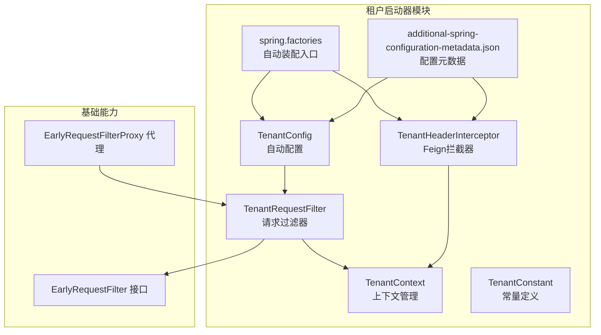
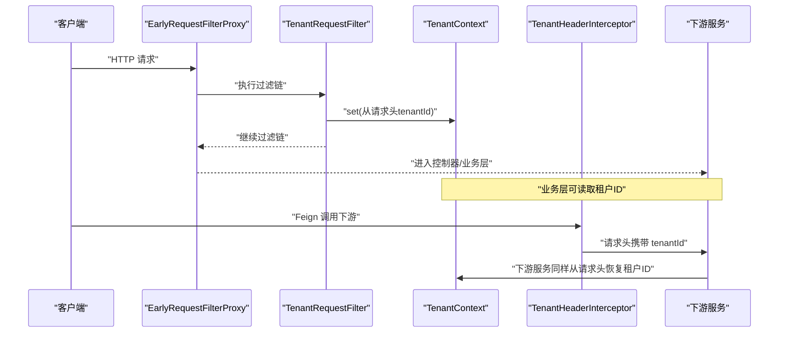
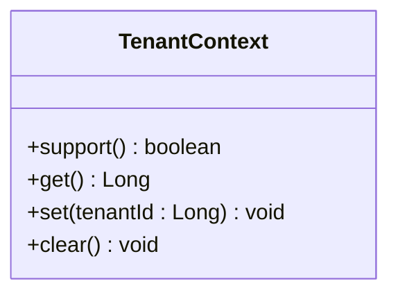
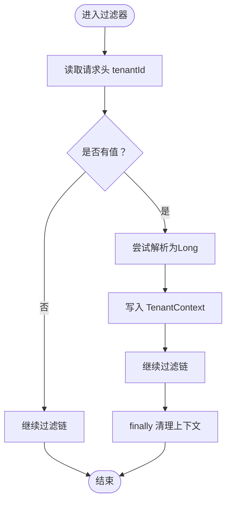
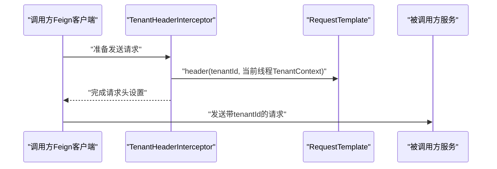
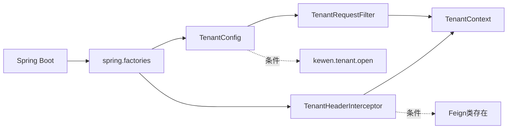

# 租户启动器（tenant-spring-boot-starter）技术文档

<cite>
**本文引用的文件**
- [TenantConfig.java](file://boot/tenant-spring-boot-starter/src/main/java/com/kewen/framework/tenant/config/TenantConfig.java)
- [TenantContext.java](file://boot/tenant-spring-boot-starter/src/main/java/com/kewen/framework/tenant/TenantContext.java)
- [TenantRequestFilter.java](file://boot/tenant-spring-boot-starter/src/main/java/com/kewen/framework/tenant/TenantRequestFilter.java)
- [TenantHeaderInterceptor.java](file://boot/tenant-spring-boot-starter/src/main/java/com/kewen/framework/tenant/feign/TenantHeaderInterceptor.java)
- [TenantConstant.java](file://boot/tenant-spring-boot-starter/src/main/java/com/kewen/framework/tenant/TenantConstant.java)
- [spring.factories](file://boot/tenant-spring-boot-starter/src/main/resources/META-INF/spring.factories)
- [additional-spring-configuration-metadata.json](file://boot/tenant-spring-boot-starter/src/main/resources/META-INF/additional-spring-configuration-metadata.json)
- [pom.xml](file://boot/tenant-spring-boot-starter/pom.xml)
- [EarlyRequestFilter.java](file://basic/src/main/java/com/kewen/framework/basic/filter/EarlyRequestFilter.java)
- [EarlyRequestFilterProxy.java](file://basic/src/main/java/com/kewen/framework/basic/filter/EarlyRequestFilterProxy.java)
- [TenantSampleApp.java](file://sample/tenant-boot-sample/src/main/java/com/kewen/framework/sample/tenant/TenantSampleApp.java)
- [application.yml](file://sample/tenant-boot-sample/src/main/resources/application.yml)
- [TenantController.java](file://sample/tenant-boot-sample/src/main/java/com/kewen/framework/sample/tenant/controller/TenantController.java)
</cite>

## 目录
1. [简介](#简介)
2. [项目结构](#项目结构)
3. [核心组件](#核心组件)
4. [架构总览](#架构总览)
5. [详细组件分析](#详细组件分析)
6. [依赖分析](#依赖分析)
7. [性能考虑](#性能考虑)
8. [故障排查指南](#故障排查指南)
9. [结论](#结论)
10. [附录](#附录)

## 简介
本技术文档围绕租户启动器（tenant-spring-boot-starter）展开，系统阐述多租户架构的设计理念与实现原理，重点解析以下关键点：
- TenantConfig 自动配置类的功能与配置项
- TenantContext 租户上下文管理机制（含 ThreadLocal 使用、租户ID获取与传递）
- TenantRequestFilter 请求过滤器的工作原理（从请求头提取租户信息并注入上下文）
- TenantHeaderInterceptor 在 Feign 客户端中的作用（确保微服务间租户信息透传）
- 配置示例与使用场景（单体应用与微服务架构）
- 最佳实践、性能考量与常见问题解决方案

## 项目结构
租户启动器位于 boot/tenant-spring-boot-starter 模块，主要由以下部分组成：
- 自动配置与条件装配：TenantConfig、spring.factories、配置元数据
- 核心运行时组件：TenantContext、TenantRequestFilter、TenantHeaderInterceptor、TenantConstant
- 示例应用：tenant-boot-sample（演示如何启用与验证）

图表来源
- [TenantConfig.java:1-23](file://boot/tenant-spring-boot-starter/src/main/java/com/kewen/framework/tenant/config/TenantConfig.java#L1-L23)
- [TenantRequestFilter.java:1-38](file://boot/tenant-spring-boot-starter/src/main/java/com/kewen/framework/tenant/TenantRequestFilter.java#L1-L38)
- [TenantContext.java:1-40](file://boot/tenant-spring-boot-starter/src/main/java/com/kewen/framework/tenant/TenantContext.java#L1-L40)
- [TenantHeaderInterceptor.java:1-32](file://boot/tenant-spring-boot-starter/src/main/java/com/kewen/framework/tenant/feign/TenantHeaderInterceptor.java#L1-L32)
- [TenantConstant.java:1-12](file://boot/tenant-spring-boot-starter/src/main/java/com/kewen/framework/tenant/TenantConstant.java#L1-L12)
- [spring.factories:1-3](file://boot/tenant-spring-boot-starter/src/main/resources/META-INF/spring.factories#L1-L3)
- [additional-spring-configuration-metadata.json:1-10](file://boot/tenant-spring-boot-starter/src/main/resources/META-INF/additional-spring-configuration-metadata.json#L1-L10)
- [EarlyRequestFilter.java:1-24](file://basic/src/main/java/com/kewen/framework/basic/filter/EarlyRequestFilter.java#L1-L24)
- [EarlyRequestFilterProxy.java:1-81](file://basic/src/main/java/com/kewen/framework/basic/filter/EarlyRequestFilterProxy.java#L1-L81)

章节来源
- [pom.xml:1-42](file://boot/tenant-spring-boot-starter/pom.xml#L1-L42)

## 核心组件
- TenantConfig：基于属性开关 kewen.tenant.open 的自动配置，注册 TenantRequestFilter；仅当 Feign 存在时启用 TenantHeaderInterceptor。
- TenantContext：线程本地存储的租户上下文，提供 set/get/support/clear 方法，支持父子线程继承。
- TenantRequestFilter：实现 EarlyRequestFilter，从请求头读取租户ID并写入 TenantContext，保证请求生命周期内可用，并在 finally 中清理。
- TenantHeaderInterceptor：实现 Feign RequestInterceptor，在出站请求中将当前租户ID写入请求头，保障微服务间透传。
- TenantConstant：统一的租户头键名常量（tenantId）。

章节来源
- [TenantConfig.java:1-23](file://boot/tenant-spring-boot-starter/src/main/java/com/kewen/framework/tenant/config/TenantConfig.java#L1-L23)
- [TenantContext.java:1-40](file://boot/tenant-spring-boot-starter/src/main/java/com/kewen/framework/tenant/TenantContext.java#L1-L40)
- [TenantRequestFilter.java:1-38](file://boot/tenant-spring-boot-starter/src/main/java/com/kewen/framework/tenant/TenantRequestFilter.java#L1-L38)
- [TenantHeaderInterceptor.java:1-32](file://boot/tenant-spring-boot-starter/src/main/java/com/kewen/framework/tenant/feign/TenantHeaderInterceptor.java#L1-L32)
- [TenantConstant.java:1-12](file://boot/tenant-spring-boot-starter/src/main/java/com/kewen/framework/tenant/TenantConstant.java#L1-L12)

## 架构总览
租户启动器通过自动配置与条件注解，将请求过滤与 Feign 拦截器无缝集成到 Spring Boot 应用中。其核心流程如下：
- 启动阶段：spring.factories 注册自动配置与 Feign 拦截器
- 运行阶段：EarlyRequestFilterProxy 负责调度 EarlyRequestFilter（TenantRequestFilter），在请求进入时从请求头提取租户ID并写入 TenantContext；在请求结束时清理上下文
- 微服务调用：TenantHeaderInterceptor 将当前租户ID写入 Feign 出站请求头，下游服务通过相同的过滤器链恢复上下文

图表来源
- [EarlyRequestFilterProxy.java:1-81](file://basic/src/main/java/com/kewen/framework/basic/filter/EarlyRequestFilterProxy.java#L1-L81)
- [TenantRequestFilter.java:1-38](file://boot/tenant-spring-boot-starter/src/main/java/com/kewen/framework/tenant/TenantRequestFilter.java#L1-L38)
- [TenantContext.java:1-40](file://boot/tenant-spring-boot-starter/src/main/java/com/kewen/framework/tenant/TenantContext.java#L1-L40)
- [TenantHeaderInterceptor.java:1-32](file://boot/tenant-spring-boot-starter/src/main/java/com/kewen/framework/tenant/feign/TenantHeaderInterceptor.java#L1-L32)

## 详细组件分析

### TenantConfig 自动配置类
- 功能概述
  - 条件启用：仅当配置项 kewen.tenant.open 为 true 时生效
  - 注册过滤器：向容器注册 TenantRequestFilter 实例
  - Feign 支持：仅当存在 Feign 类时，注册 TenantHeaderInterceptor
- 设计要点
  - 使用 @ConditionalOnProperty 控制开关，避免对未启用租户功能的应用产生影响
  - 通过 @ConditionalOnClass 判断 Feign 是否存在，按需启用拦截器
- 配置项
  - kewen.tenant.open：布尔类型，默认 false，控制租户功能是否启用

章节来源
- [TenantConfig.java:1-23](file://boot/tenant-spring-boot-starter/src/main/java/com/kewen/framework/tenant/config/TenantConfig.java#L1-L23)
- [spring.factories:1-3](file://boot/tenant-spring-boot-starter/src/main/resources/META-INF/spring.factories#L1-L3)
- [additional-spring-configuration-metadata.json:1-10](file://boot/tenant-spring-boot-starter/src/main/resources/META-INF/additional-spring-configuration-metadata.json#L1-L10)

### TenantContext 租户上下文管理
- 数据结构
  - 使用 InheritableThreadLocal<Long> 存储当前线程的租户ID
- 核心方法
  - support()：判断当前线程是否存在租户上下文
  - get()：获取当前租户ID
  - set(Long)：设置当前租户ID
  - clear()：清理当前线程的租户上下文
- 设计优势
  - 线程隔离，避免并发污染
  - InheritableThreadLocal 支持子线程继承父线程上下文，便于异步任务传递租户信息

图表来源
- [TenantContext.java:1-40](file://boot/tenant-spring-boot-starter/src/main/java/com/kewen/framework/tenant/TenantContext.java#L1-L40)

章节来源
- [TenantContext.java:1-40](file://boot/tenant-spring-boot-starter/src/main/java/com/kewen/framework/tenant/TenantContext.java#L1-L40)

### TenantRequestFilter 请求过滤器
- 触发时机
  - 实现 EarlyRequestFilter 接口，并通过 EarlyRequestFilterProxy 组织在 Spring Security 之前执行
- 处理逻辑
  - 从请求头读取租户ID（键名来自 TenantConstant.TENANT_ID）
  - 若存在且非空，则转换为 Long 并写入 TenantContext
  - 无论是否成功设置，均继续执行后续过滤链
  - 在 finally 中清理 TenantContext，防止线程复用导致的数据泄漏
- 顺序控制
  - 使用 @Order(2) 确保在过滤链中的合适位置执行

图表来源
- [TenantRequestFilter.java:1-38](file://boot/tenant-spring-boot-starter/src/main/java/com/kewen/framework/tenant/TenantRequestFilter.java#L1-L38)
- [TenantConstant.java:1-12](file://boot/tenant-spring-boot-starter/src/main/java/com/kewen/framework/tenant/TenantConstant.java#L1-L12)
- [EarlyRequestFilter.java:1-24](file://basic/src/main/java/com/kewen/framework/basic/filter/EarlyRequestFilter.java#L1-L24)
- [EarlyRequestFilterProxy.java:1-81](file://basic/src/main/java/com/kewen/framework/basic/filter/EarlyRequestFilterProxy.java#L1-L81)

章节来源
- [TenantRequestFilter.java:1-38](file://boot/tenant-spring-boot-starter/src/main/java/com/kewen/framework/tenant/TenantRequestFilter.java#L1-L38)
- [EarlyRequestFilter.java:1-24](file://basic/src/main/java/com/kewen/framework/basic/filter/EarlyRequestFilter.java#L1-L24)
- [EarlyRequestFilterProxy.java:1-81](file://basic/src/main/java/com/kewen/framework/basic/filter/EarlyRequestFilterProxy.java#L1-L81)

### TenantHeaderInterceptor Feign 拦截器
- 触发条件
  - 当 Feign 存在且 kewen.tenant.open 为 true 时启用
- 工作原理
  - 在每次 Feign 出站请求前，从 TenantContext 读取租户ID
  - 若存在租户ID，则将其作为请求头写入 RequestTemplate
- 作用范围
  - 保障微服务间调用时租户上下文的透明传递

图表来源
- [TenantHeaderInterceptor.java:1-32](file://boot/tenant-spring-boot-starter/src/main/java/com/kewen/framework/tenant/feign/TenantHeaderInterceptor.java#L1-L32)
- [TenantContext.java:1-40](file://boot/tenant-spring-boot-starter/src/main/java/com/kewen/framework/tenant/TenantContext.java#L1-L40)

章节来源
- [TenantHeaderInterceptor.java:1-32](file://boot/tenant-spring-boot-starter/src/main/java/com/kewen/framework/tenant/feign/TenantHeaderInterceptor.java#L1-L32)

### TenantConstant 常量定义
- 定义租户头键名：tenantId
- 作用：统一请求头键名，避免硬编码

章节来源
- [TenantConstant.java:1-12](file://boot/tenant-spring-boot-starter/src/main/java/com/kewen/framework/tenant/TenantConstant.java#L1-L12)

## 依赖分析
- 自动装配入口
  - spring.factories 中注册 TenantConfig 与 TenantHeaderInterceptor，使自动配置生效
- 条件依赖
  - TenantConfig 依赖 kewen.tenant.open 属性
  - TenantHeaderInterceptor 依赖 Feign 类的存在
- 运行时依赖
  - TenantRequestFilter 依赖 EarlyRequestFilter/EarlyRequestFilterProxy 提供的早期过滤链
  - TenantContext 依赖线程本地存储机制

图表来源
- [spring.factories:1-3](file://boot/tenant-spring-boot-starter/src/main/resources/META-INF/spring.factories#L1-L3)
- [TenantConfig.java:1-23](file://boot/tenant-spring-boot-starter/src/main/java/com/kewen/framework/tenant/config/TenantConfig.java#L1-L23)
- [TenantHeaderInterceptor.java:1-32](file://boot/tenant-spring-boot-starter/src/main/java/com/kewen/framework/tenant/feign/TenantHeaderInterceptor.java#L1-L32)

章节来源
- [spring.factories:1-3](file://boot/tenant-spring-boot-starter/src/main/resources/META-INF/spring.factories#L1-L3)
- [additional-spring-configuration-metadata.json:1-10](file://boot/tenant-spring-boot-starter/src/main/resources/META-INF/additional-spring-configuration-metadata.json#L1-L10)
- [pom.xml:1-42](file://boot/tenant-spring-boot-starter/pom.xml#L1-L42)

## 性能考虑
- 线程本地存储开销
  - TenantContext 使用 ThreadLocal，访问成本低；但需注意在异步/线程池场景下正确传递上下文
- 过滤器链顺序
  - EarlyRequestFilterProxy 将自定义过滤器置于 Spring Security 之前，减少不必要的安全检查开销
- 解析与转换
  - 请求头解析为 Long 的开销极小，建议在网关层统一校验格式，避免重复解析
- 异步任务与上下文传递
  - 对于 ForkJoinPool/线程池等场景，建议使用封装的执行器或手动复制租户ID，避免丢失

## 故障排查指南
- 问题：租户ID始终为空
  - 检查请求头是否包含 tenantId 键值对
  - 确认 kewen.tenant.open 是否为 true
  - 核对 EarlyRequestFilterProxy 是否正确注册并生效
- 问题：微服务间租户未透传
  - 确认 Feign 是否存在，TenantHeaderInterceptor 是否被注册
  - 检查下游服务是否正确从请求头恢复租户ID
- 问题：线程复用导致数据泄漏
  - 确保过滤器 finally 分支已清理 TenantContext
  - 在异步任务中显式传递或复制租户ID
- 问题：多租户与安全框架冲突
  - EarlyRequestFilterProxy 的顺序需早于 Spring Security，避免安全拦截器提前阻断

章节来源
- [TenantRequestFilter.java:1-38](file://boot/tenant-spring-boot-starter/src/main/java/com/kewen/framework/tenant/TenantRequestFilter.java#L1-L38)
- [TenantHeaderInterceptor.java:1-32](file://boot/tenant-spring-boot-starter/src/main/java/com/kewen/framework/tenant/feign/TenantHeaderInterceptor.java#L1-L32)
- [EarlyRequestFilterProxy.java:1-81](file://basic/src/main/java/com/kewen/framework/basic/filter/EarlyRequestFilterProxy.java#L1-L81)

## 结论
租户启动器通过简洁的自动配置与明确的职责边界，实现了从请求入口到微服务调用的完整租户上下文传递链路。TenantContext 提供轻量级的线程本地存储，TenantRequestFilter 负责上下文注入与清理，TenantHeaderInterceptor 保障跨服务透传。结合 EarlyRequestFilterProxy 的早期过滤链设计，整体方案具备良好的可扩展性与可维护性。

## 附录

### 配置示例与使用场景
- 单体应用
  - 在 application.yml 中设置 kewen.tenant.open: true
  - 在控制器中通过 TenantContext.get() 获取当前租户ID
- 微服务架构
  - 在网关或上游服务设置 tenantId 请求头
  - 下游服务通过 TenantRequestFilter 自动恢复上下文
  - Feign 客户端通过 TenantHeaderInterceptor 自动透传租户ID

章节来源
- [application.yml:1-13](file://sample/tenant-boot-sample/src/main/resources/application.yml#L1-L13)
- [TenantSampleApp.java:1-11](file://sample/tenant-boot-sample/src/main/java/com/kewen/framework/sample/tenant/TenantSampleApp.java#L1-L11)
- [TenantController.java:1-22](file://sample/tenant-boot-sample/src/main/java/com/kewen/framework/sample/tenant/controller/TenantController.java#L1-L22)