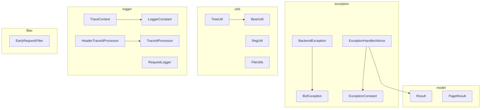
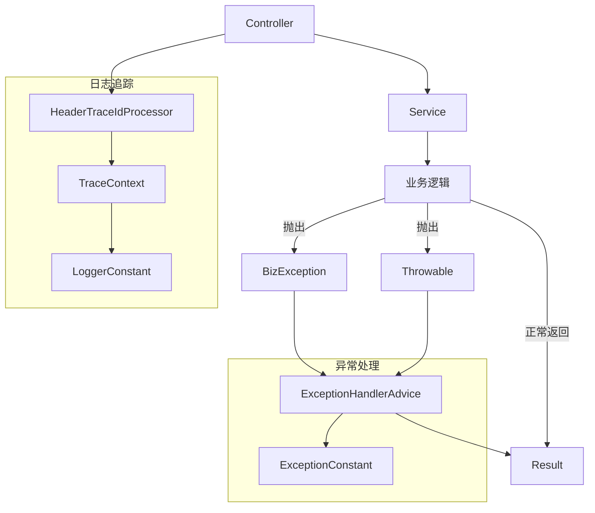
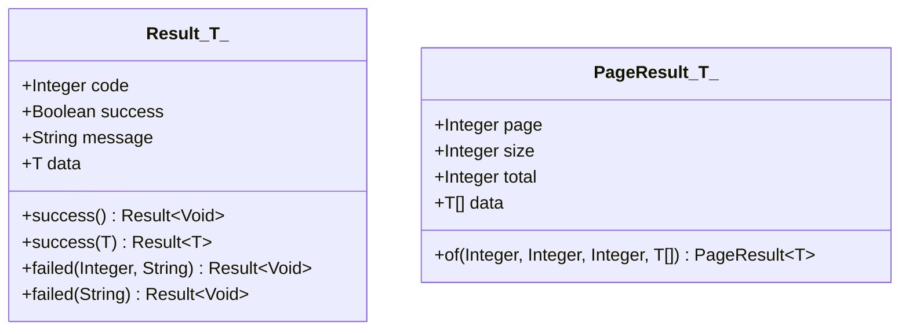
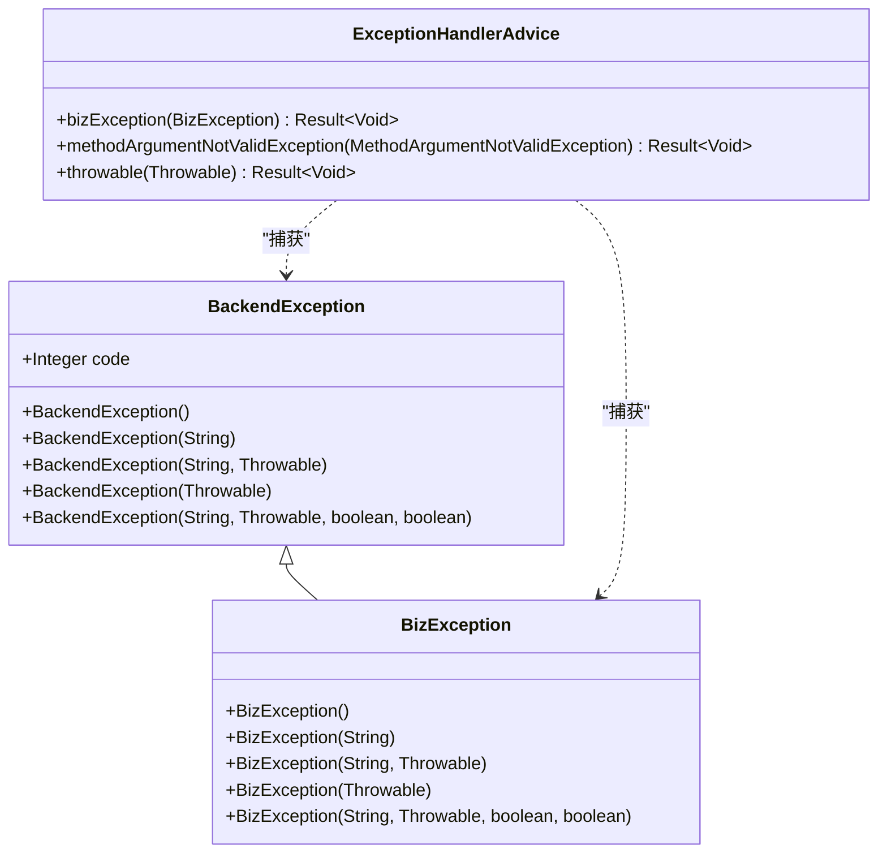
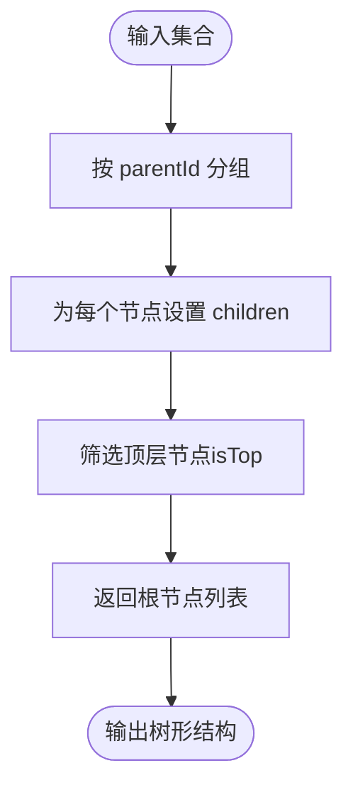
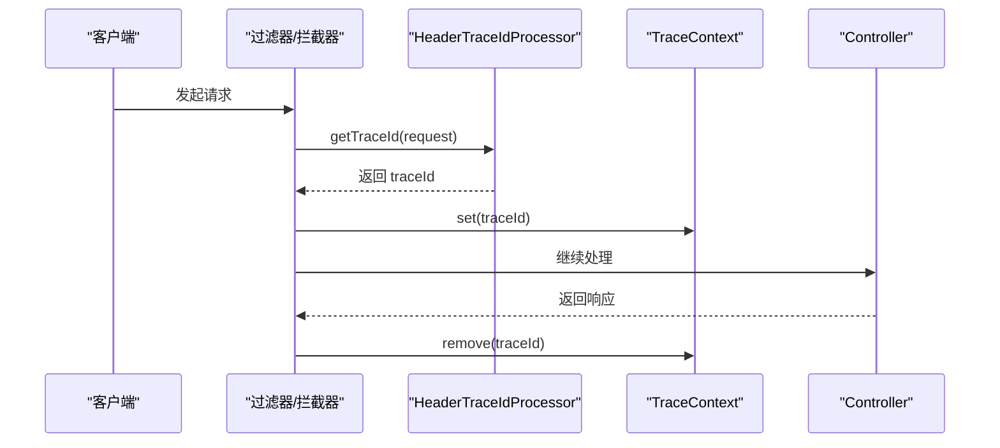
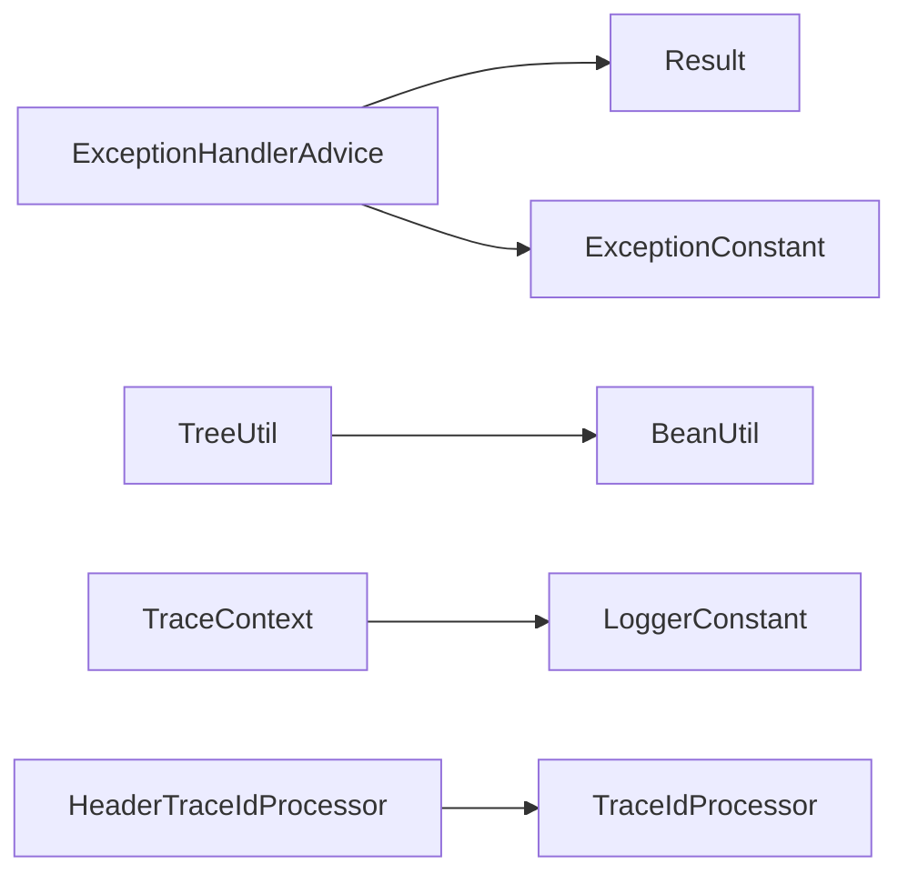

# 基础模块 (basic)

<cite>
**本文引用的文件**
- [Result.java](file://basic/src/main/java/com/kewen/framework/basic/model/Result.java)
- [PageResult.java](file://basic/src/main/java/com/kewen/framework/basic/model/PageResult.java)
- [BackendException.java](file://basic/src/main/java/com/kewen/framework/basic/exception/BackendException.java)
- [BizException.java](file://basic/src/main/java/com/kewen/framework/basic/exception/BizException.java)
- [ExceptionHandlerAdvice.java](file://basic/src/main/java/com/kewen/framework/basic/exception/ExceptionHandlerAdvice.java)
- [ExceptionConstant.java](file://basic/src/main/java/com/kewen/framework/basic/exception/ExceptionConstant.java)
- [BeanUtil.java](file://basic/src/main/java/com/kewen/framework/basic/utils/BeanUtil.java)
- [TreeUtil.java](file://basic/src/main/java/com/kewen/framework/basic/utils/TreeUtil.java)
- [RegUtil.java](file://basic/src/main/java/com/kewen/framework/basic/utils/RegUtil.java)
- [FileUtils.java](file://basic/src/main/java/com/kewen/framework/basic/utils/FileUtils.java)
- [LoggerConstant.java](file://basic/src/main/java/com/kewen/framework/basic/logger/LoggerConstant.java)
- [TraceContext.java](file://basic/src/main/java/com/kewen/framework/basic/logger/trace/TraceContext.java)
- [HeaderTraceIdProcessor.java](file://basic/src/main/java/com/kewen/framework/basic/logger/trace/HeaderTraceIdProcessor.java)
- [TraceIdProcessor.java](file://basic/src/main/java/com/kewen/framework/basic/logger/trace/TraceIdProcessor.java)
- [RequestLogger.java](file://basic/src/main/java/com/kewen/framework/basic/logger/request/RequestLogger.java)
- [EarlyRequestFilter.java](file://basic/src/main/java/com/kewen/framework/basic/filter/EarlyRequestFilter.java)
</cite>

## 目录
1. [简介](#简介)
2. [项目结构](#项目结构)
3. [核心组件](#核心组件)
4. [架构总览](#架构总览)
5. [详细组件分析](#详细组件分析)
6. [依赖分析](#依赖分析)
7. [性能考虑](#性能考虑)
8. [故障排查指南](#故障排查指南)
9. [结论](#结论)
10. [附录](#附录)

## 简介
本文件面向基础模块（basic）的技术文档，聚焦以下能力域：
- 统一响应格式：Result 与 PageResult 的设计与使用
- 异常处理体系：异常类层次、全局异常处理机制
- 工具类库：BeanUtil、TreeUtil、RegUtil、FileUtils 等
- 日志追踪：TraceId 生成、传播与请求日志记录

目标是帮助开发者快速理解并正确使用这些基础能力，提升开发效率与系统可观测性。

## 项目结构
basic 模块按职责分层组织，核心目录如下：
- model：统一响应模型与分页模型
- exception：异常类与全局异常处理
- utils：常用工具类
- logger：日志与追踪相关
- filter：早期请求过滤器接口

图表来源
- [Result.java:11-48](file://basic/src/main/java/com/kewen/framework/basic/model/Result.java#L11-L48)
- [PageResult.java:14-31](file://basic/src/main/java/com/kewen/framework/basic/model/PageResult.java#L14-L31)
- [BackendException.java:8-30](file://basic/src/main/java/com/kewen/framework/basic/exception/BackendException.java#L8-L30)
- [BizException.java:8-27](file://basic/src/main/java/com/kewen/framework/basic/exception/BizException.java#L8-L27)
- [ExceptionHandlerAdvice.java:20-78](file://basic/src/main/java/com/kewen/framework/basic/exception/ExceptionHandlerAdvice.java#L20-L78)
- [ExceptionConstant.java](file://basic/src/main/java/com/kewen/framework/basic/exception/ExceptionConstant.java)
- [BeanUtil.java:22-103](file://basic/src/main/java/com/kewen/framework/basic/utils/BeanUtil.java#L22-L103)
- [TreeUtil.java:14-241](file://basic/src/main/java/com/kewen/framework/basic/utils/TreeUtil.java#L14-L241)
- [RegUtil.java:15-106](file://basic/src/main/java/com/kewen/framework/basic/utils/RegUtil.java#L15-L106)
- [FileUtils.java:21-76](file://basic/src/main/java/com/kewen/framework/basic/utils/FileUtils.java#L21-L76)
- [LoggerConstant.java:8-10](file://basic/src/main/java/com/kewen/framework/basic/logger/LoggerConstant.java#L8-L10)
- [TraceContext.java:11-22](file://basic/src/main/java/com/kewen/framework/basic/logger/trace/TraceContext.java#L11-L22)
- [TraceIdProcessor.java:11-18](file://basic/src/main/java/com/kewen/framework/basic/logger/trace/TraceIdProcessor.java#L11-L18)
- [HeaderTraceIdProcessor.java:15-27](file://basic/src/main/java/com/kewen/framework/basic/logger/trace/HeaderTraceIdProcessor.java#L15-L27)
- [RequestLogger.java:13-26](file://basic/src/main/java/com/kewen/framework/basic/logger/request/RequestLogger.java#L13-L26)
- [EarlyRequestFilter.java:14-23](file://basic/src/main/java/com/kewen/framework/basic/filter/EarlyRequestFilter.java#L14-L23)

章节来源
- [Result.java:11-48](file://basic/src/main/java/com/kewen/framework/basic/model/Result.java#L11-L48)
- [PageResult.java:14-31](file://basic/src/main/java/com/kewen/framework/basic/model/PageResult.java#L14-L31)
- [BackendException.java:8-30](file://basic/src/main/java/com/kewen/framework/basic/exception/BackendException.java#L8-L30)
- [BizException.java:8-27](file://basic/src/main/java/com/kewen/framework/basic/exception/BizException.java#L8-L27)
- [ExceptionHandlerAdvice.java:20-78](file://basic/src/main/java/com/kewen/framework/basic/exception/ExceptionHandlerAdvice.java#L20-L78)
- [BeanUtil.java:22-103](file://basic/src/main/java/com/kewen/framework/basic/utils/BeanUtil.java#L22-L103)
- [TreeUtil.java:14-241](file://basic/src/main/java/com/kewen/framework/basic/utils/TreeUtil.java#L14-L241)
- [RegUtil.java:15-106](file://basic/src/main/java/com/kewen/framework/basic/utils/RegUtil.java#L15-L106)
- [FileUtils.java:21-76](file://basic/src/main/java/com/kewen/framework/basic/utils/FileUtils.java#L21-L76)
- [LoggerConstant.java:8-10](file://basic/src/main/java/com/kewen/framework/basic/logger/LoggerConstant.java#L8-L10)
- [TraceContext.java:11-22](file://basic/src/main/java/com/kewen/framework/basic/logger/trace/TraceContext.java#L11-L22)
- [TraceIdProcessor.java:11-18](file://basic/src/main/java/com/kewen/framework/basic/logger/trace/TraceIdProcessor.java#L11-L18)
- [HeaderTraceIdProcessor.java:15-27](file://basic/src/main/java/com/kewen/framework/basic/logger/trace/HeaderTraceIdProcessor.java#L15-L27)
- [RequestLogger.java:13-26](file://basic/src/main/java/com/kewen/framework/basic/logger/request/RequestLogger.java#L13-L26)
- [EarlyRequestFilter.java:14-23](file://basic/src/main/java/com/kewen/framework/basic/filter/EarlyRequestFilter.java#L14-L23)

## 核心组件
本节对统一响应、异常处理、工具类与日志追踪进行深入解析。

- 统一响应格式
  - Result<T>：通用响应载体，包含状态码、成功标记、消息与数据体；提供静态工厂方法以快速构造成功或失败响应。
  - PageResult<T>：分页响应载体，包含页码、大小、总数与数据列表；提供静态工厂方法以快速构建分页结果。
- 异常处理体系
  - BackendException：基础运行时异常，提供多构造器以便携带消息、原因与栈信息。
  - BizException：业务异常，继承自 BackendException，用于标识业务层面的错误。
  - ExceptionHandlerAdvice：全局异常处理切面，针对业务异常、参数校验异常与未知异常进行统一处理，返回 Result<Void>。
  - ExceptionConstant：异常常量定义，便于统一管理错误码与提示语。
- 工具类库
  - BeanUtil：基于 FastJSON 的高性能对象转换与克隆工具，支持集合转换、JSON 序列化与属性拷贝。
  - TreeUtil：树形结构工具，支持树转换、反向展开、子树提取、子树 ID 收集、按条件裁剪与树结构克隆转换。
  - RegUtil：正则工具，内置常见规则常量与 Markdown 图片提取能力。
  - FileUtils：文件系统工具，支持递归创建目录并设置权限，失败时抛出业务异常。
- 日志追踪
  - LoggerConstant：追踪键名常量（traceId）。
  - TraceContext：基于 MDC 的 TraceId 上下文存取。
  - TraceIdProcessor：TraceId 生成策略接口。
  - HeaderTraceIdProcessor：从请求头读取或生成 TraceId 的实现。
  - RequestLogger：请求日志载体，记录 URL、方法、参数、Body、IP、Headers 与执行耗时。

章节来源
- [Result.java:11-48](file://basic/src/main/java/com/kewen/framework/basic/model/Result.java#L11-L48)
- [PageResult.java:14-31](file://basic/src/main/java/com/kewen/framework/basic/model/PageResult.java#L14-L31)
- [BackendException.java:8-30](file://basic/src/main/java/com/kewen/framework/basic/exception/BackendException.java#L8-L30)
- [BizException.java:8-27](file://basic/src/main/java/com/kewen/framework/basic/exception/BizException.java#L8-L27)
- [ExceptionHandlerAdvice.java:20-78](file://basic/src/main/java/com/kewen/framework/basic/exception/ExceptionHandlerAdvice.java#L20-L78)
- [ExceptionConstant.java](file://basic/src/main/java/com/kewen/framework/basic/exception/ExceptionConstant.java)
- [BeanUtil.java:22-103](file://basic/src/main/java/com/kewen/framework/basic/utils/BeanUtil.java#L22-L103)
- [TreeUtil.java:14-241](file://basic/src/main/java/com/kewen/framework/basic/utils/TreeUtil.java#L14-L241)
- [RegUtil.java:15-106](file://basic/src/main/java/com/kewen/framework/basic/utils/RegUtil.java#L15-L106)
- [FileUtils.java:21-76](file://basic/src/main/java/com/kewen/framework/basic/utils/FileUtils.java#L21-L76)
- [LoggerConstant.java:8-10](file://basic/src/main/java/com/kewen/framework/basic/logger/LoggerConstant.java#L8-L10)
- [TraceContext.java:11-22](file://basic/src/main/java/com/kewen/framework/basic/logger/trace/TraceContext.java#L11-L22)
- [TraceIdProcessor.java:11-18](file://basic/src/main/java/com/kewen/framework/basic/logger/trace/TraceIdProcessor.java#L11-L18)
- [HeaderTraceIdProcessor.java:15-27](file://basic/src/main/java/com/kewen/framework/basic/logger/trace/HeaderTraceIdProcessor.java#L15-L27)
- [RequestLogger.java:13-26](file://basic/src/main/java/com/kewen/framework/basic/logger/request/RequestLogger.java#L13-L26)

## 架构总览
下图展示基础模块在 Web 层的典型交互：控制器返回 Result，异常由全局 Advice 统一捕获并转为 Result，日志追踪通过 TraceId 实现跨服务链路串联。

图表来源
- [ExceptionHandlerAdvice.java:20-78](file://basic/src/main/java/com/kewen/framework/basic/exception/ExceptionHandlerAdvice.java#L20-L78)
- [BackendException.java:8-30](file://basic/src/main/java/com/kewen/framework/basic/exception/BackendException.java#L8-L30)
- [BizException.java:8-27](file://basic/src/main/java/com/kewen/framework/basic/exception/BizException.java#L8-L27)
- [LoggerConstant.java:8-10](file://basic/src/main/java/com/kewen/framework/basic/logger/LoggerConstant.java#L8-L10)
- [TraceContext.java:11-22](file://basic/src/main/java/com/kewen/framework/basic/logger/trace/TraceContext.java#L11-L22)
- [HeaderTraceIdProcessor.java:15-27](file://basic/src/main/java/com/kewen/framework/basic/logger/trace/HeaderTraceIdProcessor.java#L15-L27)

## 详细组件分析

### 统一响应模型：Result 与 PageResult
- 设计理念
  - Result<T>：以“状态码 + 成功标记 + 消息 + 数据”四要素统一后端返回，支持 Void 与泛型数据两种形态。
  - PageResult<T>：封装分页查询的页码、大小、总数与数据列表，提供静态工厂方法简化构建。
- 使用建议
  - 成功场景优先使用 Result.success(data) 返回具体数据；仅需状态确认时使用 Result.success()。
  - 失败场景使用 Result.failed(code, message) 或 Result.failed(message)，便于前端统一处理。
  - 分页场景使用 PageResult.of(page, size, total, data) 快速构建分页响应。
- 复杂度与性能
  - Result/PageResult 为纯数据载体，无复杂算法，序列化开销低，适合高频调用。

图表来源
- [Result.java:11-48](file://basic/src/main/java/com/kewen/framework/basic/model/Result.java#L11-L48)
- [PageResult.java:14-31](file://basic/src/main/java/com/kewen/framework/basic/model/PageResult.java#L14-L31)

章节来源
- [Result.java:11-48](file://basic/src/main/java/com/kewen/framework/basic/model/Result.java#L11-L48)
- [PageResult.java:14-31](file://basic/src/main/java/com/kewen/framework/basic/model/PageResult.java#L14-L31)

### 异常处理体系：异常类与全局处理
- 异常类层次
  - BackendException：基础运行时异常，提供多构造器，便于携带错误信息与原因。
  - BizException：业务异常，继承 BackendException，用于标识业务错误。
- 全局异常处理机制
  - ExceptionHandlerAdvice：通过@RestControllerAdvice 全局拦截异常，分别处理：
    - 业务异常 BizException：记录错误日志，返回 Result.failed(code, message)。
    - 参数校验异常 MethodArgumentNotValidException：拼接字段错误信息，返回参数校验失败结果。
    - 未知异常 Throwable：记录错误日志，返回通用失败结果。
  - ExceptionConstant：集中管理错误码与提示语，保证前后端一致。

图表来源
- [BackendException.java:8-30](file://basic/src/main/java/com/kewen/framework/basic/exception/BackendException.java#L8-L30)
- [BizException.java:8-27](file://basic/src/main/java/com/kewen/framework/basic/exception/BizException.java#L8-L27)
- [ExceptionHandlerAdvice.java:20-78](file://basic/src/main/java/com/kewen/framework/basic/exception/ExceptionHandlerAdvice.java#L20-L78)

章节来源
- [BackendException.java:8-30](file://basic/src/main/java/com/kewen/framework/basic/exception/BackendException.java#L8-L30)
- [BizException.java:8-27](file://basic/src/main/java/com/kewen/framework/basic/exception/BizException.java#L8-L27)
- [ExceptionHandlerAdvice.java:20-78](file://basic/src/main/java/com/kewen/framework/basic/exception/ExceptionHandlerAdvice.java#L20-L78)
- [ExceptionConstant.java](file://basic/src/main/java/com/kewen/framework/basic/exception/ExceptionConstant.java)

### 工具类库：BeanUtil、TreeUtil、RegUtil、FileUtils
- BeanUtil
  - toBean(source, clazz)：基于 FastJSON 的高性能对象转换。
  - toList(list, clazz[, consumer])：集合转换与消费。
  - clone/cloneList：深度克隆对象与集合。
  - setFinalField：反射修改 final 字段（谨慎使用）。
- TreeUtil
  - transfer：将线性集合转换为树形结构。
  - unTransfer：将树形结构反向展开为列表。
  - fetchSubTree/fetchSubIds：子树提取与子树 ID 收集。
  - removeIfUnmatch：按条件裁剪树（叶子优先）。
  - convertList：树结构克隆转换。
- RegUtil
  - 内置常用正则常量（邮箱、手机号、身份证、IP、URL、QQ、邮编、中文、英文、数字、浮点等）。
  - extractMarkdownImages：从 Markdown 文本中提取图片链接。
- FileUtils
  - createDirForLoop：递归创建目录并设置权限（777），失败抛出业务异常。

图表来源
- [TreeUtil.java:28-60](file://basic/src/main/java/com/kewen/framework/basic/utils/TreeUtil.java#L28-L60)

章节来源
- [BeanUtil.java:22-103](file://basic/src/main/java/com/kewen/framework/basic/utils/BeanUtil.java#L22-L103)
- [TreeUtil.java:14-241](file://basic/src/main/java/com/kewen/framework/basic/utils/TreeUtil.java#L14-L241)
- [RegUtil.java:15-106](file://basic/src/main/java/com/kewen/framework/basic/utils/RegUtil.java#L15-L106)
- [FileUtils.java:21-76](file://basic/src/main/java/com/kewen/framework/basic/utils/FileUtils.java#L21-L76)

### 日志追踪：TraceId 生成、传播与请求日志记录
- TraceId 生成与传播
  - LoggerConstant：定义 traceId 键名。
  - TraceContext：基于 MDC 的上下文存取（get/set/remove）。
  - TraceIdProcessor：TraceId 生成策略接口。
  - HeaderTraceIdProcessor：从请求头读取 traceId，缺失时生成 UUID 并去除横杠。
- 请求日志记录
  - RequestLogger：记录请求 URL、方法、参数、Body、IP、Headers 与执行耗时，便于问题定位与审计。

图表来源
- [HeaderTraceIdProcessor.java:15-27](file://basic/src/main/java/com/kewen/framework/basic/logger/trace/HeaderTraceIdProcessor.java#L15-L27)
- [TraceContext.java:11-22](file://basic/src/main/java/com/kewen/framework/basic/logger/trace/TraceContext.java#L11-L22)
- [LoggerConstant.java:8-10](file://basic/src/main/java/com/kewen/framework/basic/logger/LoggerConstant.java#L8-L10)

章节来源
- [LoggerConstant.java:8-10](file://basic/src/main/java/com/kewen/framework/basic/logger/LoggerConstant.java#L8-L10)
- [TraceContext.java:11-22](file://basic/src/main/java/com/kewen/framework/basic/logger/trace/TraceContext.java#L11-L22)
- [TraceIdProcessor.java:11-18](file://basic/src/main/java/com/kewen/framework/basic/logger/trace/TraceIdProcessor.java#L11-L18)
- [HeaderTraceIdProcessor.java:15-27](file://basic/src/main/java/com/kewen/framework/basic/logger/trace/HeaderTraceIdProcessor.java#L15-L27)
- [RequestLogger.java:13-26](file://basic/src/main/java/com/kewen/framework/basic/logger/request/RequestLogger.java#L13-L26)
- [EarlyRequestFilter.java:14-23](file://basic/src/main/java/com/kewen/framework/basic/filter/EarlyRequestFilter.java#L14-L23)

## 依赖分析
- 组件内聚与耦合
  - Result/PageResult 与异常处理无直接依赖，通过返回值与异常类型解耦。
  - ExceptionHandlerAdvice 依赖 Result 与 ExceptionConstant，形成统一错误输出。
  - TreeUtil 依赖 BeanUtil 实现树结构深度克隆转换。
  - TraceContext 依赖 LoggerConstant，HeaderTraceIdProcessor 依赖 TraceIdProcessor 接口。
- 外部依赖
  - Spring Web（@RestControllerAdvice、MVC 参数校验）、FastJSON（BeanUtil 转换）、SLF4J（日志）。

图表来源
- [ExceptionHandlerAdvice.java:20-78](file://basic/src/main/java/com/kewen/framework/basic/exception/ExceptionHandlerAdvice.java#L20-L78)
- [Result.java:11-48](file://basic/src/main/java/com/kewen/framework/basic/model/Result.java#L11-L48)
- [ExceptionConstant.java](file://basic/src/main/java/com/kewen/framework/basic/exception/ExceptionConstant.java)
- [TreeUtil.java:174-184](file://basic/src/main/java/com/kewen/framework/basic/utils/TreeUtil.java#L174-L184)
- [BeanUtil.java:31-34](file://basic/src/main/java/com/kewen/framework/basic/utils/BeanUtil.java#L31-L34)
- [TraceContext.java:11-22](file://basic/src/main/java/com/kewen/framework/basic/logger/trace/TraceContext.java#L11-L22)
- [LoggerConstant.java:8-10](file://basic/src/main/java/com/kewen/framework/basic/logger/LoggerConstant.java#L8-L10)
- [HeaderTraceIdProcessor.java:15-27](file://basic/src/main/java/com/kewen/framework/basic/logger/trace/HeaderTraceIdProcessor.java#L15-L27)
- [TraceIdProcessor.java:11-18](file://basic/src/main/java/com/kewen/framework/basic/logger/trace/TraceIdProcessor.java#L11-L18)

章节来源
- [ExceptionHandlerAdvice.java:20-78](file://basic/src/main/java/com/kewen/framework/basic/exception/ExceptionHandlerAdvice.java#L20-L78)
- [TreeUtil.java:174-184](file://basic/src/main/java/com/kewen/framework/basic/utils/TreeUtil.java#L174-L184)
- [BeanUtil.java:31-34](file://basic/src/main/java/com/kewen/framework/basic/utils/BeanUtil.java#L31-L34)
- [TraceContext.java:11-22](file://basic/src/main/java/com/kewen/framework/basic/logger/trace/TraceContext.java#L11-L22)
- [HeaderTraceIdProcessor.java:15-27](file://basic/src/main/java/com/kewen/framework/basic/logger/trace/HeaderTraceIdProcessor.java#L15-L27)
- [TraceIdProcessor.java:11-18](file://basic/src/main/java/com/kewen/framework/basic/logger/trace/TraceIdProcessor.java#L11-L18)
- [LoggerConstant.java:8-10](file://basic/src/main/java/com/kewen/framework/basic/logger/LoggerConstant.java#L8-L10)

## 性能考虑
- 结果序列化
  - Result/PageResult 字段简单，序列化成本低；建议在高并发接口中保持数据最小化。
- 异常处理
  - 全局异常处理避免在业务层重复 try-catch，减少分支与样板代码，提高吞吐。
- 对象转换
  - BeanUtil 基于 FastJSON，转换性能优于传统反射方案；批量转换可配合 Consumer 进行二次处理。
- 树形处理
  - TreeUtil 使用分组与递归，时间复杂度近似 O(n)，注意大数据量时的内存占用与栈深限制。
- 日志追踪
  - MDC 存取为 O(1)，TraceId 生成采用 UUID 去横杠，字符串长度可控；建议在网关或入口处统一分配，避免重复生成。

## 故障排查指南
- 统一响应未生效
  - 检查是否在控制器中直接返回业务对象而非 Result；确保全局异常处理已启用。
- 参数校验失败未返回预期消息
  - 确认请求体绑定与字段注解（如 @Valid）使用正确；检查 MethodArgumentNotValidException 是否被拦截。
- 业务异常未被捕获
  - 确认异常类型为 BizException 或其子类；非受检异常将按 Throwable 处理。
- TraceId 丢失
  - 检查过滤器顺序与 TraceId 生成策略；确保在请求开始时 set，在结束时 remove。
- 文件创建失败
  - 查看 FileUtils 抛出的业务异常信息，确认父目录权限与磁盘空间。

章节来源
- [ExceptionHandlerAdvice.java:20-78](file://basic/src/main/java/com/kewen/framework/basic/exception/ExceptionHandlerAdvice.java#L20-L78)
- [FileUtils.java:60-74](file://basic/src/main/java/com/kewen/framework/basic/utils/FileUtils.java#L60-L74)
- [TraceContext.java:11-22](file://basic/src/main/java/com/kewen/framework/basic/logger/trace/TraceContext.java#L11-L22)
- [HeaderTraceIdProcessor.java:15-27](file://basic/src/main/java/com/kewen/framework/basic/logger/trace/HeaderTraceIdProcessor.java#L15-L27)

## 结论
basic 模块通过统一响应、异常处理、实用工具与日志追踪，为上层应用提供了稳定的基础能力。遵循本文档的最佳实践，可在保证一致性的同时提升开发效率与系统可观测性。

## 附录
- 最佳实践清单
  - 控制器一律返回 Result 或 PageResult，避免直接返回业务对象。
  - 业务异常统一抛出 BizException，便于全局拦截与前端统一处理。
  - 大数据量树形转换时，先分页或限流，避免 OOM。
  - 日志追踪在入口处生成/注入 TraceId，在出口处清理，确保生命周期完整。
  - 使用 BeanUtil 进行对象转换时，注意字段命名与类型兼容性。