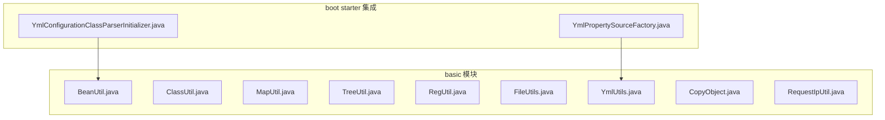
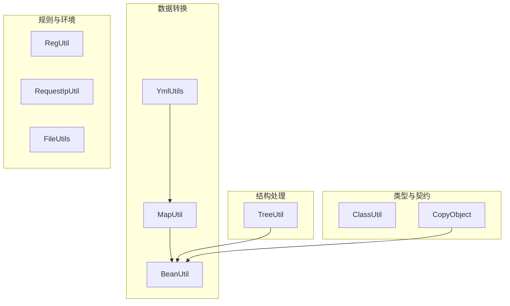
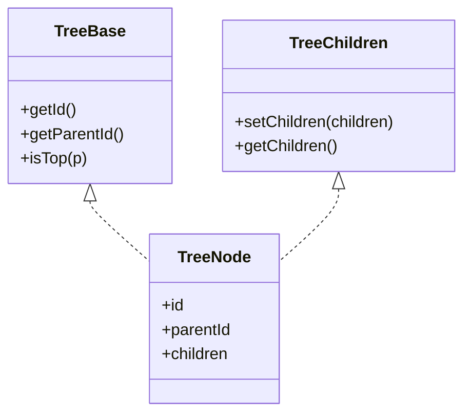
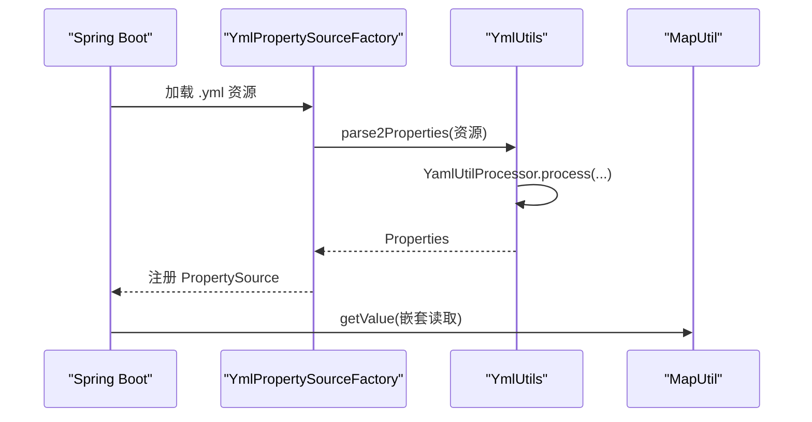
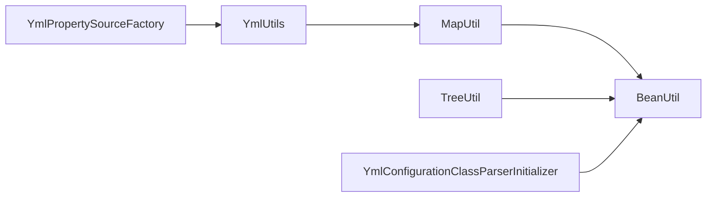

# 工具类库

<cite>
**本文档引用的文件**
- [BeanUtil.java](file://basic/src/main/java/com/kewen/framework/basic/utils/BeanUtil.java)
- [ClassUtil.java](file://basic/src/main/java/com/kewen/framework/basic/utils/ClassUtil.java)
- [MapUtil.java](file://basic/src/main/java/com/kewen/framework/basic/utils/MapUtil.java)
- [TreeUtil.java](file://basic/src/main/java/com/kewen/framework/basic/utils/TreeUtil.java)
- [RegUtil.java](file://basic/src/main/java/com/kewen/framework/basic/utils/RegUtil.java)
- [FileUtils.java](file://basic/src/main/java/com/kewen/framework/basic/utils/FileUtils.java)
- [YmlUtils.java](file://basic/src/main/java/com/kewen/framework/basic/utils/YmlUtils.java)
- [CopyObject.java](file://basic/src/main/java/com/kewen/framework/basic/utils/CopyObject.java)
- [RequestIpUtil.java](file://basic/src/main/java/com/kewen/framework/basic/utils/RequestIpUtil.java)
- [TreeUtilTest.java](file://qy-auth/auth-rbac/src/test/java/com/kewen/framework/auth/rabc/utils/TreeUtilTest.java)
- [YmlPropertySourceFactory.java](file://boot/basic-spring-boot-starter/src/main/java/com/kewen/framework/boot/basic/context/YmlPropertySourceFactory.java)
- [YmlConfigurationClassParserInitializer.java](file://boot/basic-spring-boot-starter/src/main/java/com/kewen/framework/boot/basic/context/YmlConfigurationClassParserInitializer.java)
</cite>

## 目录
1. [简介](#简介)
2. [项目结构](#项目结构)
3. [核心组件](#核心组件)
4. [架构总览](#架构总览)
5. [详细组件分析](#详细组件分析)
6. [依赖分析](#依赖分析)
7. [性能考虑](#性能考虑)
8. [故障排查指南](#故障排查指南)
9. [结论](#结论)
10. [附录](#附录)

## 简介
本参考文档系统性介绍工具类库中的常用工具类，涵盖对象操作、类与泛型、集合与映射、树形结构、正则表达式、文件与配置、对象复制、请求IP获取等能力。文档逐项给出方法签名、参数说明、返回值描述、典型使用场景、性能与注意事项，并辅以流程图与类图帮助理解。

## 项目结构
工具类库位于 basic 模块的 utils 包下，另有少量集成在 boot starter 中用于 Spring Boot 环境的配置加载与初始化。

图表来源
- [BeanUtil.java:1-104](file://basic/src/main/java/com/kewen/framework/basic/utils/BeanUtil.java#L1-L104)
- [ClassUtil.java:1-97](file://basic/src/main/java/com/kewen/framework/basic/utils/ClassUtil.java#L1-L97)
- [MapUtil.java:1-113](file://basic/src/main/java/com/kewen/framework/basic/utils/MapUtil.java#L1-L113)
- [TreeUtil.java:1-241](file://basic/src/main/java/com/kewen/framework/basic/utils/TreeUtil.java#L1-L241)
- [RegUtil.java:1-107](file://basic/src/main/java/com/kewen/framework/basic/utils/RegUtil.java#L1-L107)
- [FileUtils.java:1-77](file://basic/src/main/java/com/kewen/framework/basic/utils/FileUtils.java#L1-L77)
- [YmlUtils.java:1-138](file://basic/src/main/java/com/kewen/framework/basic/utils/YmlUtils.java#L1-L138)
- [CopyObject.java:1-15](file://basic/src/main/java/com/kewen/framework/basic/utils/CopyObject.java#L1-L15)
- [RequestIpUtil.java:1-40](file://basic/src/main/java/com/kewen/framework/basic/utils/RequestIpUtil.java#L1-L40)
- [YmlPropertySourceFactory.java:1-34](file://boot/basic-spring-boot-starter/src/main/java/com/kewen/framework/boot/basic/context/YmlPropertySourceFactory.java#L1-L34)
- [YmlConfigurationClassParserInitializer.java:31-46](file://boot/basic-spring-boot-starter/src/main/java/com/kewen/framework/boot/basic/context/YmlConfigurationClassParserInitializer.java#L31-L46)

章节来源
- [BeanUtil.java:1-104](file://basic/src/main/java/com/kewen/framework/basic/utils/BeanUtil.java#L1-L104)
- [ClassUtil.java:1-97](file://basic/src/main/java/com/kewen/framework/basic/utils/ClassUtil.java#L1-L97)
- [MapUtil.java:1-113](file://basic/src/main/java/com/kewen/framework/basic/utils/MapUtil.java#L1-L113)
- [TreeUtil.java:1-241](file://basic/src/main/java/com/kewen/framework/basic/utils/TreeUtil.java#L1-L241)
- [RegUtil.java:1-107](file://basic/src/main/java/com/kewen/framework/basic/utils/RegUtil.java#L1-L107)
- [FileUtils.java:1-77](file://basic/src/main/java/com/kewen/framework/basic/utils/FileUtils.java#L1-L77)
- [YmlUtils.java:1-138](file://basic/src/main/java/com/kewen/framework/basic/utils/YmlUtils.java#L1-L138)
- [CopyObject.java:1-15](file://basic/src/main/java/com/kewen/framework/basic/utils/CopyObject.java#L1-L15)
- [RequestIpUtil.java:1-40](file://basic/src/main/java/com/kewen/framework/basic/utils/RequestIpUtil.java#L1-L40)
- [YmlPropertySourceFactory.java:1-34](file://boot/basic-spring-boot-starter/src/main/java/com/kewen/framework/boot/basic/context/YmlPropertySourceFactory.java#L1-L34)
- [YmlConfigurationClassParserInitializer.java:31-46](file://boot/basic-spring-boot-starter/src/main/java/com/kewen/framework/boot/basic/context/YmlConfigurationClassParserInitializer.java#L31-L46)

## 核心组件
- BeanUtil：对象与集合的快速转换、深拷贝、Bean 属性复制、常量字段覆写辅助。
- ClassUtil：解析类实现接口与继承链上的实际泛型类型。
- MapUtil：基于 SpEL 的 Map 值读取/写入、Builder 快速构建 Map。
- TreeUtil：树形结构组装/拆解、子树提取、ID 收集、按条件删除、树节点类型契约。
- RegUtil：常用正则常量与 Markdown 图片提取。
- FileUtils：递归创建目录并设置权限。
- YmlUtils：YAML 解析为 Map/Properties，支持多资源合并。
- CopyObject：面向接口的属性复制约定。
- RequestIpUtil：多代理头兼容的客户端 IP 获取。

章节来源
- [BeanUtil.java:22-104](file://basic/src/main/java/com/kewen/framework/basic/utils/BeanUtil.java#L22-L104)
- [ClassUtil.java:11-97](file://basic/src/main/java/com/kewen/framework/basic/utils/ClassUtil.java#L11-L97)
- [MapUtil.java:15-113](file://basic/src/main/java/com/kewen/framework/basic/utils/MapUtil.java#L15-L113)
- [TreeUtil.java:14-241](file://basic/src/main/java/com/kewen/framework/basic/utils/TreeUtil.java#L14-L241)
- [RegUtil.java:15-107](file://basic/src/main/java/com/kewen/framework/basic/utils/RegUtil.java#L15-L107)
- [FileUtils.java:21-77](file://basic/src/main/java/com/kewen/framework/basic/utils/FileUtils.java#L21-L77)
- [YmlUtils.java:25-138](file://basic/src/main/java/com/kewen/framework/basic/utils/YmlUtils.java#L25-L138)
- [CopyObject.java:8-15](file://basic/src/main/java/com/kewen/framework/basic/utils/CopyObject.java#L8-L15)
- [RequestIpUtil.java:11-40](file://basic/src/main/java/com/kewen/framework/basic/utils/RequestIpUtil.java#L11-L40)

## 架构总览
工具类之间存在清晰的分层与协作关系：
- 数据转换层：BeanUtil、MapUtil、YmlUtils
- 结构处理层：TreeUtil
- 规则与环境层：RegUtil、RequestIpUtil、FileUtils
- 类型与契约层：ClassUtil、CopyObject

图表来源
- [BeanUtil.java:22-104](file://basic/src/main/java/com/kewen/framework/basic/utils/BeanUtil.java#L22-L104)
- [MapUtil.java:15-113](file://basic/src/main/java/com/kewen/framework/basic/utils/MapUtil.java#L15-L113)
- [YmlUtils.java:25-138](file://basic/src/main/java/com/kewen/framework/basic/utils/YmlUtils.java#L25-L138)
- [TreeUtil.java:14-241](file://basic/src/main/java/com/kewen/framework/basic/utils/TreeUtil.java#L14-L241)
- [RegUtil.java:15-107](file://basic/src/main/java/com/kewen/framework/basic/utils/RegUtil.java#L15-L107)
- [RequestIpUtil.java:11-40](file://basic/src/main/java/com/kewen/framework/basic/utils/RequestIpUtil.java#L11-L40)
- [FileUtils.java:21-77](file://basic/src/main/java/com/kewen/framework/basic/utils/FileUtils.java#L21-L77)
- [ClassUtil.java:11-97](file://basic/src/main/java/com/kewen/framework/basic/utils/ClassUtil.java#L11-L97)
- [CopyObject.java:8-15](file://basic/src/main/java/com/kewen/framework/basic/utils/CopyObject.java#L8-L15)

## 详细组件分析

### BeanUtil 对象操作工具
- 设计理念
  - 基于 FastJSON 的序列化/反序列化进行对象转换，避免字段类型匹配开销，提升性能。
  - 提供集合批量转换与消费回调，便于链式处理。
  - 提供 Bean 属性复制与深拷贝能力，支持自定义消费者对转换结果进行二次处理。
  - 提供“覆写 final 字段”的极端手段（不建议常规使用）。
- 方法与签名
  - toBean(source, clazz): 将任意对象转为目标类型
  - toList(list, itemClazz): 将集合转为指定元素类型的列表
  - toList(list, itemClazz, consumer): 转换后对每个元素执行消费
  - parseObject(json, typeReference): 解析复杂泛型对象
  - toJsonString(obj): 序列化为 JSON 字符串
  - copy(source, target): 复制属性（浅拷贝）
  - clone(source): 深拷贝（基于 toBean）
  - cloneList(collection): 批量深拷贝
  - setFinalField(obj, fieldName, value): 覆写 final 字段（反射修改）
- 使用场景
  - DTO/VO 转换、集合元素类型统一、跨模块对象传递、单元测试数据构造。
- 注意事项
  - 转换依赖 FastJSON，需确保字段命名与类型兼容。
  - 深拷贝基于 JSON，非引用拷贝；复杂对象需保证可序列化。
  - 不要在生产代码中频繁覆写 final 字段，除非确有必要且充分评估风险。

章节来源
- [BeanUtil.java:22-104](file://basic/src/main/java/com/kewen/framework/basic/utils/BeanUtil.java#L22-L104)

### ClassUtil 类操作工具
- 设计理念
  - 解析类实现接口或继承父类上的泛型实参，支持按“目标超类”过滤匹配。
  - 提供两个入口：parseInterfaceActualT（接口泛型）、parseSuperActualT（父类泛型）。
- 方法与签名
  - parseActualT(source, target): 已废弃，推荐使用 parseInterfaceActualT
  - parseInterfaceActualT(source, tSuperClass): 解析实现接口的泛型实参
  - parseSuperActualT(source, tSuperClass): 解析父类泛型实参
- 使用场景
  - 泛型擦除后的类型恢复、框架扩展点的类型推断、序列化/反序列化器选择。
- 注意事项
  - 仅当泛型参数为具体类时有效；若为通配符或复合泛型，需结合业务逻辑进一步处理。

章节来源
- [ClassUtil.java:11-97](file://basic/src/main/java/com/kewen/framework/basic/utils/ClassUtil.java#L11-L97)

### MapUtil 集合操作工具
- 设计理念
  - 基于 SpEL 动态访问/设置嵌套 Map 的值，支持“a.b.c”形式的路径读取与写入。
  - 提供 Builder 快速构建键值对，减少样板代码。
- 方法与签名
  - getValue(map, name, clazz): 读取嵌套值并转换为目标类型
  - setValue(map, name, value): 写入嵌套值
  - builder(keyClass, valueClass)/builder(): 构建 Map
- 使用场景
  - 配置读取、动态表单映射、嵌套结构的灵活访问。
- 注意事项
  - 读取字符串时若期望非 String 类型会抛出类型转换异常。
  - 写入必须为嵌套 Map 结构，否则 SpEL 表达式会失败。

章节来源
- [MapUtil.java:15-113](file://basic/src/main/java/com/kewen/framework/basic/utils/MapUtil.java#L15-L113)

### TreeUtil 树形结构工具
- 设计理念
  - 通过 TreeBase 与 TreeChildren 接口定义树节点契约，支持多态树结构处理。
  - 提供组装/拆解、子树提取、ID 收集、按条件删除等常用操作。
- 方法与签名
  - transfer(source, topParentId): 组装树根
  - unTransfer(tree): 将树展开为列表
  - fetchSubTree(trees, id): 在多棵树中查找子树
  - fetchSubIds(tree): 获取子树 ID 列表
  - removeIfUnmatch(collections/predicate): 按条件删除不满足的叶子
  - convertList(collection, clazz): 深度克隆转换树集合
- 使用场景
  - 权限树、组织架构、菜单树、分类树等层级结构。
- 注意事项
  - 删除策略为“叶子优先”，保留仍有子节点的中间节点。
  - isTop 支持多种顶层判定策略（空、0、与传入 topParentId 相等）。

图表来源
- [TreeUtil.java:192-239](file://basic/src/main/java/com/kewen/framework/basic/utils/TreeUtil.java#L192-L239)

章节来源
- [TreeUtil.java:14-241](file://basic/src/main/java/com/kewen/framework/basic/utils/TreeUtil.java#L14-L241)
- [TreeUtilTest.java:15-100](file://qy-auth/auth-rbac/src/test/java/com/kewen/framework/auth/rabc/utils/TreeUtilTest.java#L15-L100)

### RegUtil 正则表达式工具
- 设计理念
  - 提供常用正则常量（邮箱、手机号、身份证、IP、URL、数字、字母、中文等）。
  - 提供 Markdown 图片提取能力，输出结构化信息。
- 方法与签名
  - 常量：EMAIL、PHONE、ID_CARD、IP_ADDR、URL、QQ、MOBILE、ZIP_CODE、CHINESE、ENGLISH、NUMBER、INTEGER、FLOAT、DOUBLE、SPECIAL_CHAR 等
  - isMatch(regex, str): 判断是否匹配
  - extractMarkdownImages(markdown): 提取图片信息列表
- 使用场景
  - 输入校验、内容提取、格式验证。
- 注意事项
  - 正则覆盖范围广但不绝对严谨，建议结合业务场景做二次校验。

章节来源
- [RegUtil.java:15-107](file://basic/src/main/java/com/kewen/framework/basic/utils/RegUtil.java#L15-L107)

### FileUtils 文件操作工具
- 设计理念
  - 递归创建目录并设置权限（777），失败时抛出业务异常。
- 方法与签名
  - createDirForLoop(file): 递归创建目录并设置权限
  - createDirForLoop(file, permissions): 指定权限创建
- 使用场景
  - 日志目录、缓存目录、上传目录的初始化。
- 注意事项
  - 仅在 Unix/Linux 环境下生效；Windows 下 Posix 权限无效。

章节来源
- [FileUtils.java:21-77](file://basic/src/main/java/com/kewen/framework/basic/utils/FileUtils.java#L21-L77)

### YmlUtils 配置文件工具
- 设计理念
  - 将 YAML 解析为 Map 与 Properties，支持多资源合并与路径加载。
  - 与 Spring Boot 集成，通过自定义 PropertySourceFactory 实现 .yml/.yaml 的原生加载。
- 方法与签名
  - parse(filePath, name, clazz): 读取 YAML 中的嵌套值
  - parse2Properties(paths/resources): 解析为 Properties
  - YamlUtilProcessor.process(...): 内部处理器，生成 Properties 与 Map
- 使用场景
  - 多环境配置读取、启动阶段配置注入、运行时配置热更新基础。
- 注意事项
  - 路径支持 classpath: 前缀；资源不存在时行为由底层实现决定。

图表来源
- [YmlPropertySourceFactory.java:17-34](file://boot/basic-spring-boot-starter/src/main/java/com/kewen/framework/boot/basic/context/YmlPropertySourceFactory.java#L17-L34)
- [YmlUtils.java:25-138](file://basic/src/main/java/com/kewen/framework/basic/utils/YmlUtils.java#L25-L138)
- [MapUtil.java:15-113](file://basic/src/main/java/com/kewen/framework/basic/utils/MapUtil.java#L15-L113)

章节来源
- [YmlUtils.java:25-138](file://basic/src/main/java/com/kewen/framework/basic/utils/YmlUtils.java#L25-L138)
- [YmlPropertySourceFactory.java:17-34](file://boot/basic-spring-boot-starter/src/main/java/com/kewen/framework/boot/basic/context/YmlPropertySourceFactory.java#L17-L34)
- [YmlConfigurationClassParserInitializer.java:31-46](file://boot/basic-spring-boot-starter/src/main/java/com/kewen/framework/boot/basic/context/YmlConfigurationClassParserInitializer.java#L31-L46)

### CopyObject 对象复制工具
- 设计理念
  - 通过接口约定 copyProperties，内部委托 BeanUtil 完成属性复制。
- 方法与签名
  - copyProperties(p): 将传入对象的属性复制到当前对象
- 使用场景
  - DTO/VO 与实体之间的属性复制，简化样板代码。
- 注意事项
  - 依赖 BeanUtil 的属性复制机制，字段名与类型需一致或可转换。

章节来源
- [CopyObject.java:8-15](file://basic/src/main/java/com/kewen/framework/basic/utils/CopyObject.java#L8-L15)
- [BeanUtil.java:65-67](file://basic/src/main/java/com/kewen/framework/basic/utils/BeanUtil.java#L65-L67)

### RequestIpUtil 请求IP获取工具
- 设计理念
  - 兼容多代理头（如 X-Forwarded-For、X-Real-IP、Proxy-Client-IP 等），最后回退到 remoteAddr。
- 方法与签名
  - getIp(request): 从 HttpServletRequest 中提取真实客户端 IP
- 使用场景
  - 日志记录、风控、审计、统计。
- 注意事项
  - 代理头可伪造，生产环境建议配合网关/安全策略与白名单。

章节来源
- [RequestIpUtil.java:11-40](file://basic/src/main/java/com/kewen/framework/basic/utils/RequestIpUtil.java#L11-L40)

## 依赖分析
- 内聚性
  - 各工具类职责单一，内聚度高，便于独立维护与替换。
- 耦合性
  - MapUtil 依赖 BeanUtil；YmlUtils 依赖 MapUtil；TreeUtil 依赖 BeanUtil；Boot starter 依赖 YmlUtils 与 BeanUtil。
- 循环依赖
  - 未发现循环依赖，调用方向清晰。

图表来源
- [MapUtil.java:15-113](file://basic/src/main/java/com/kewen/framework/basic/utils/MapUtil.java#L15-L113)
- [BeanUtil.java:22-104](file://basic/src/main/java/com/kewen/framework/basic/utils/BeanUtil.java#L22-L104)
- [YmlUtils.java:25-138](file://basic/src/main/java/com/kewen/framework/basic/utils/YmlUtils.java#L25-L138)
- [TreeUtil.java:14-241](file://basic/src/main/java/com/kewen/framework/basic/utils/TreeUtil.java#L14-L241)
- [YmlPropertySourceFactory.java:17-34](file://boot/basic-spring-boot-starter/src/main/java/com/kewen/framework/boot/basic/context/YmlPropertySourceFactory.java#L17-L34)
- [YmlConfigurationClassParserInitializer.java:31-46](file://boot/basic-spring-boot-starter/src/main/java/com/kewen/framework/boot/basic/context/YmlConfigurationClassParserInitializer.java#L31-L46)

章节来源
- [MapUtil.java:15-113](file://basic/src/main/java/com/kewen/framework/basic/utils/MapUtil.java#L15-L113)
- [BeanUtil.java:22-104](file://basic/src/main/java/com/kewen/framework/basic/utils/BeanUtil.java#L22-L104)
- [YmlUtils.java:25-138](file://basic/src/main/java/com/kewen/framework/basic/utils/YmlUtils.java#L25-L138)
- [TreeUtil.java:14-241](file://basic/src/main/java/com/kewen/framework/basic/utils/TreeUtil.java#L14-L241)
- [YmlPropertySourceFactory.java:17-34](file://boot/basic-spring-boot-starter/src/main/java/com/kewen/framework/boot/basic/context/YmlPropertySourceFactory.java#L17-L34)
- [YmlConfigurationClassParserInitializer.java:31-46](file://boot/basic-spring-boot-starter/src/main/java/com/kewen/framework/boot/basic/context/YmlConfigurationClassParserInitializer.java#L31-L46)

## 性能考虑
- BeanUtil
  - 基于 JSON 的转换避免了字段类型匹配，整体优于传统反射拷贝；集合转换使用批量序列化/反序列化，注意内存占用。
- MapUtil
  - SpEL 表达式解析具备一定开销，建议在高频路径中缓存解析结果或减少嵌套层级。
- TreeUtil
  - 组装阶段使用分组与流式处理，时间复杂度近似 O(n)；removeIfUnmatch 采用后序遍历，注意大数据量时的栈空间。
- RegUtil
  - 正则编译与匹配成本可控，建议复用 Pattern/Matcher 或预编译常量。
- YmlUtils
  - 多资源合并与 Map/Properties 构造为一次性开销；建议在应用启动阶段完成，运行时避免重复解析。
- FileUtils
  - 递归创建目录为 IO 密集操作，注意磁盘权限与并发创建冲突。
- RequestIpUtil
  - 头部遍历为线性扫描，开销极低；建议配合网关限流与白名单策略。

## 故障排查指南
- MapUtil.getValue 抛出类型转换异常
  - 现象：读取字符串却期望非 String 类型。
  - 处理：确认目标类型与实际值类型一致，或先读取为 String 再手动转换。
- TreeUtil 组装后出现循环引用或栈溢出
  - 现象：数据中存在父子互指。
  - 处理：在入库前校验父子 ID 关系，避免循环；必要时引入访问标记。
- YmlUtils 解析失败或找不到资源
  - 现象：classpath: 前缀未正确识别或文件不存在。
  - 处理：确认资源路径与前缀，检查文件是否存在；使用 ResourceUtils 校验。
- RequestIpUtil 返回代理头而非真实 IP
  - 现象：多级代理导致头部污染。
  - 处理：在网关/反向代理层清理不可信头部，仅信任可信代理；必要时仅使用 remoteAddr 并结合白名单。

章节来源
- [MapUtil.java:39-50](file://basic/src/main/java/com/kewen/framework/basic/utils/MapUtil.java#L39-L50)
- [TreeUtil.java:41-50](file://basic/src/main/java/com/kewen/framework/basic/utils/TreeUtil.java#L41-L50)
- [YmlUtils.java:41-53](file://basic/src/main/java/com/kewen/framework/basic/utils/YmlUtils.java#L41-L53)
- [RequestIpUtil.java:13-38](file://basic/src/main/java/com/kewen/framework/basic/utils/RequestIpUtil.java#L13-L38)

## 结论
该工具类库围绕对象转换、结构处理、配置解析、规则校验与环境适配提供了高内聚、低耦合的能力集合。通过合理的使用边界与性能优化策略，可在大多数业务场景中显著降低样板代码与提升开发效率。建议在团队内形成规范化的使用约定与测试覆盖，确保稳定性与可维护性。

## 附录
- 常见使用陷阱与解决方案
  - 深拷贝依赖 JSON 序列化：确保对象可序列化，避免不可序列化字段。
  - SpEL 路径必须为嵌套 Map：否则 setValue 会失败。
  - 代理头可伪造：生产环境务必在网关层治理。
  - 多资源合并顺序：YamlUtilProcessor 会按资源顺序合并，注意覆盖关系。
  - 权限设置平台差异：FileUtils 的 Posix 权限仅在类 Unix 系统有效。