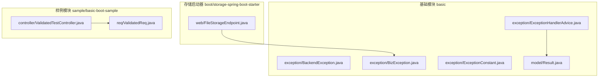
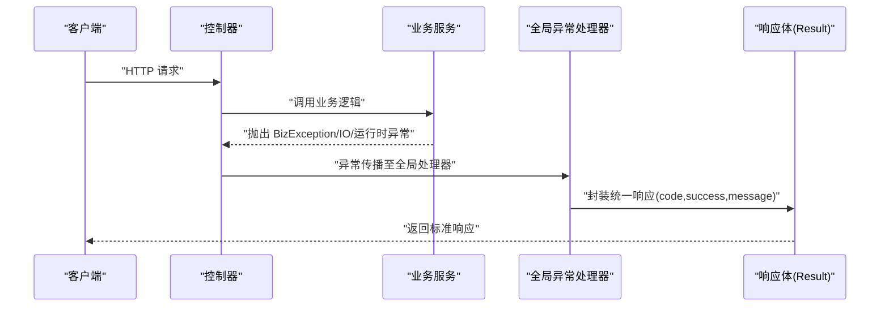
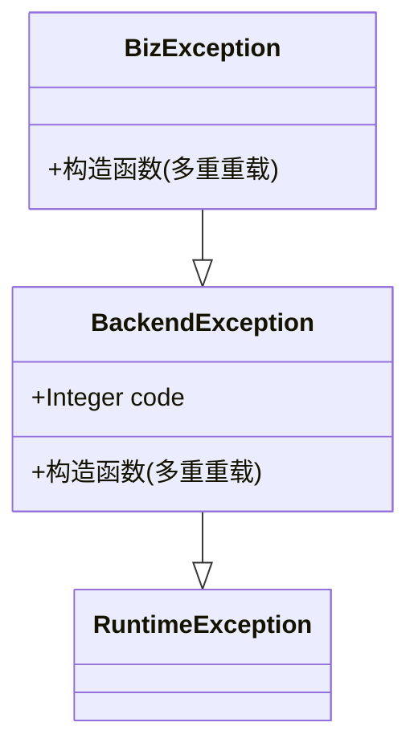
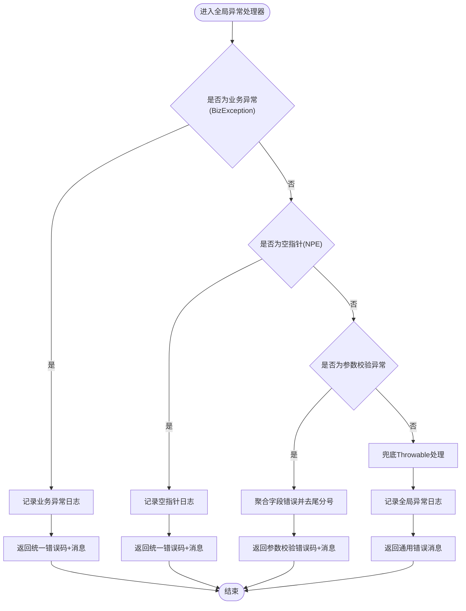
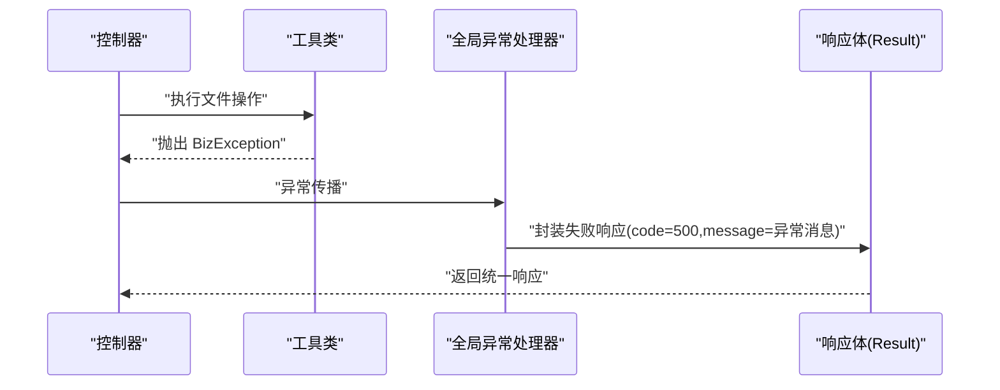
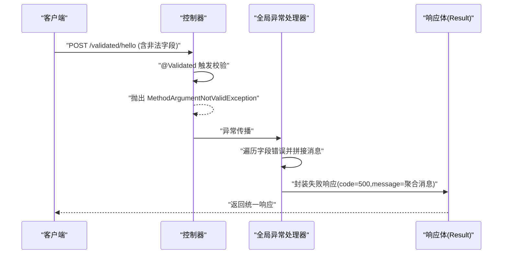
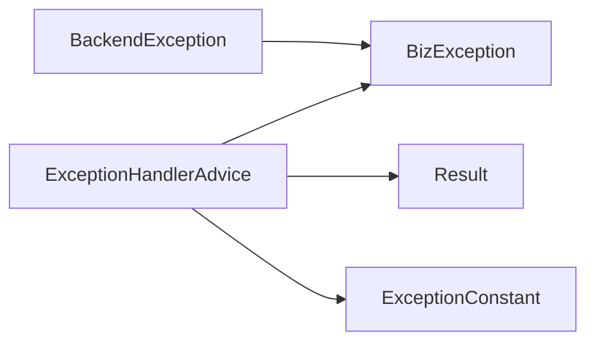

# 异常处理体系

<cite>
**本文引用的文件**
- [BackendException.java](file://basic/src/main/java/com/kewen/framework/basic/exception/BackendException.java)
- [BizException.java](file://basic/src/main/java/com/kewen/framework/basic/exception/BizException.java)
- [ExceptionConstant.java](file://basic/src/main/java/com/kewen/framework/basic/exception/ExceptionConstant.java)
- [ExceptionHandlerAdvice.java](file://basic/src/main/java/com/kewen/framework/basic/exception/ExceptionHandlerAdvice.java)
- [Result.java](file://basic/src/main/java/com/kewen/framework/basic/model/Result.java)
- [FileUtils.java](file://basic/src/main/java/com/kewen/framework/basic/utils/FileUtils.java)
- [FileStorageEndpoint.java](file://boot/storage-spring-boot-starter/src/main/java/com/kewen/framework/storage/web/FileStorageEndpoint.java)
- [ValidatedReq.java](file://sample/basic-boot-sample/src/main/java/com/kewen/framework/sample/basic/req/ValidatedReq.java)
- [ValidatedTestController.java](file://sample/basic-boot-sample/src/main/java/com/kewen/framework/sample/basic/controller/ValidatedTestController.java)
</cite>

## 目录
1. [简介](#简介)
2. [项目结构](#项目结构)
3. [核心组件](#核心组件)
4. [架构总览](#架构总览)
5. [详细组件分析](#详细组件分析)
6. [依赖关系分析](#依赖关系分析)
7. [性能考量](#性能考量)
8. [故障排查指南](#故障排查指南)
9. [结论](#结论)
10. [附录](#附录)

## 简介
本文件系统性梳理了框架中的异常处理体系，涵盖异常类层次结构（后端异常与业务异常）、错误码常量定义、全局异常处理器的工作机制，以及最佳实践与常见场景的解决方案。通过统一的异常模型与响应格式，确保前后端交互的一致性与可维护性。

## 项目结构
异常处理相关的核心代码位于基础模块 basic 的 exception 包中，并配合基础返回体 Result 提供统一的响应封装；同时在样例模块中提供了参数校验与业务异常的实际使用示例。

图表来源
- [BackendException.java:1-31](file://basic/src/main/java/com/kewen/framework/basic/exception/BackendException.java#L1-L31)
- [BizException.java:1-28](file://basic/src/main/java/com/kewen/framework/basic/exception/BizException.java#L1-L28)
- [ExceptionConstant.java:1-14](file://basic/src/main/java/com/kewen/framework/basic/exception/ExceptionConstant.java#L1-L14)
- [ExceptionHandlerAdvice.java:1-79](file://basic/src/main/java/com/kewen/framework/basic/exception/ExceptionHandlerAdvice.java#L1-L79)
- [Result.java:1-49](file://basic/src/main/java/com/kewen/framework/basic/model/Result.java#L1-L49)
- [FileStorageEndpoint.java:1-88](file://boot/storage-spring-boot-starter/src/main/java/com/kewen/framework/storage/web/FileStorageEndpoint.java#L1-L88)
- [ValidatedTestController.java:1-22](file://sample/basic-boot-sample/src/main/java/com/kewen/framework/sample/basic/controller/ValidatedTestController.java#L1-L22)
- [ValidatedReq.java:1-32](file://sample/basic-boot-sample/src/main/java/com/kewen/framework/sample/basic/req/ValidatedReq.java#L1-L32)

章节来源
- [ExceptionHandlerAdvice.java:1-79](file://basic/src/main/java/com/kewen/framework/basic/exception/ExceptionHandlerAdvice.java#L1-L79)
- [Result.java:1-49](file://basic/src/main/java/com/kewen/framework/basic/model/Result.java#L1-L49)

## 核心组件
- 后端异常 BackendException：所有后端异常的基类，提供统一的构造方法与默认错误码。
- 业务异常 BizException：继承自后端异常，用于表达业务层面的错误，便于前端识别与提示。
- 错误码常量 ExceptionConstant：集中定义错误码，保证全局一致性。
- 全局异常处理器 ExceptionHandlerAdvice：基于 Spring MVC 的@RestControllerAdvice，统一捕获异常并格式化响应。
- 统一响应体 Result：封装 code、success、message、data 字段，提供 success/failed 静态工厂方法。

章节来源
- [BackendException.java:1-31](file://basic/src/main/java/com/kewen/framework/basic/exception/BackendException.java#L1-L31)
- [BizException.java:1-28](file://basic/src/main/java/com/kewen/framework/basic/exception/BizException.java#L1-L28)
- [ExceptionConstant.java:1-14](file://basic/src/main/java/com/kewen/framework/basic/exception/ExceptionConstant.java#L1-L14)
- [ExceptionHandlerAdvice.java:1-79](file://basic/src/main/java/com/kewen/framework/basic/exception/ExceptionHandlerAdvice.java#L1-L79)
- [Result.java:1-49](file://basic/src/main/java/com/kewen/framework/basic/model/Result.java#L1-L49)

## 架构总览
异常处理的整体流程如下：
- 业务层抛出 BizException 或其他受检/非受检异常。
- 全局异常处理器 ExceptionHandlerAdvice 按优先级捕获异常：
  - 特定异常（如 BizException、空指针）映射到统一错误码与消息；
  - 参数校验异常 MethodArgumentNotValidException 聚合字段错误；
  - 未匹配的异常作为全局异常统一处理。
- 使用 Result 将响应体标准化输出。

图表来源
- [ExceptionHandlerAdvice.java:20-79](file://basic/src/main/java/com/kewen/framework/basic/exception/ExceptionHandlerAdvice.java#L20-L79)
- [Result.java:11-49](file://basic/src/main/java/com/kewen/framework/basic/model/Result.java#L11-L49)

## 详细组件分析

### 异常类层次结构
- BackendException：作为所有后端异常的根类，提供多种构造函数以支持不同场景的消息与原因传递，默认错误码为 500。
- BizException：面向业务语义的异常，继承 BackendException，便于在全局处理器中进行差异化处理与日志记录。

图表来源
- [BackendException.java:8-30](file://basic/src/main/java/com/kewen/framework/basic/exception/BackendException.java#L8-L30)
- [BizException.java:8-27](file://basic/src/main/java/com/kewen/framework/basic/exception/BizException.java#L8-L27)

章节来源
- [BackendException.java:1-31](file://basic/src/main/java/com/kewen/framework/basic/exception/BackendException.java#L1-L31)
- [BizException.java:1-28](file://basic/src/main/java/com/kewen/framework/basic/exception/BizException.java#L1-L28)

### 错误码常量定义与命名规范
- 定义位置：ExceptionConstant 接口集中声明错误码常量。
- 当前常量：
  - BIZ_FAILED：业务失败错误码
  - PARAM_VALID_FAILED：参数校验失败错误码
- 命名规范建议：
  - 使用语义化英文标识，如 BIZ_FAILED、PARAM_VALID_FAILED；
  - 采用全大写与下划线组合，避免缩写导致歧义；
  - 分类规则：按异常类型或业务域划分，便于扩展与维护。
- 注意：当前常量值均为 500，建议后续根据业务域细化为更细粒度的错误码。

章节来源
- [ExceptionConstant.java:10-13](file://basic/src/main/java/com/kewen/framework/basic/exception/ExceptionConstant.java#L10-L13)

### 全局异常处理器实现原理
- 注解与职责：
  - @RestControllerAdvice：对控制器层进行增强，拦截异常并统一处理。
  - @ExceptionHandler：针对特定异常类型进行捕获与响应。
- 处理策略：
  - 业务异常 BizException：记录错误日志，返回统一错误码与异常消息。
  - 空指针异常 NullPointerException：同上，便于快速定位问题。
  - 参数校验异常 MethodArgumentNotValidException：聚合所有字段错误，拼接为统一消息返回。
  - 全局异常 Throwable：兜底处理，记录日志并返回通用错误消息。
- 日志记录：统一使用 SLF4J 记录异常堆栈，便于问题追踪与审计。

图表来源
- [ExceptionHandlerAdvice.java:29-76](file://basic/src/main/java/com/kewen/framework/basic/exception/ExceptionHandlerAdvice.java#L29-L76)

章节来源
- [ExceptionHandlerAdvice.java:1-79](file://basic/src/main/java/com/kewen/framework/basic/exception/ExceptionHandlerAdvice.java#L1-L79)

### 统一响应体 Result
- 字段：
  - code：状态码
  - success：布尔型成功标记
  - message：描述信息
  - data：泛型数据体
- 工厂方法：
  - success()：成功响应，code 默认 200
  - success(data)：带数据的成功响应
  - failed(code,message)：失败响应，指定错误码与消息
  - failed(message)：失败响应，错误码默认 500

章节来源
- [Result.java:11-49](file://basic/src/main/java/com/kewen/framework/basic/model/Result.java#L11-L49)

### 实际使用示例与场景

#### 业务异常抛出与处理
- 存储模块上传异常：当 IO 异常发生时，抛出 BizException 并由全局处理器统一处理。
- 文件工具类：在创建目录失败时抛出 BizException，确保业务错误被标准化处理。

图表来源
- [FileStorageEndpoint.java:60-73](file://boot/storage-spring-boot-starter/src/main/java/com/kewen/framework/storage/web/FileStorageEndpoint.java#L60-L73)
- [FileUtils.java:60-74](file://basic/src/main/java/com/kewen/framework/basic/utils/FileUtils.java#L60-L74)
- [ExceptionHandlerAdvice.java:29-38](file://basic/src/main/java/com/kewen/framework/basic/exception/ExceptionHandlerAdvice.java#L29-L38)
- [Result.java:34-47](file://basic/src/main/java/com/kewen/framework/basic/model/Result.java#L34-L47)

章节来源
- [FileStorageEndpoint.java:60-73](file://boot/storage-spring-boot-starter/src/main/java/com/kewen/framework/storage/web/FileStorageEndpoint.java#L60-L73)
- [FileUtils.java:60-74](file://basic/src/main/java/com/kewen/framework/basic/utils/FileUtils.java#L60-L74)

#### 参数校验异常处理
- 控制器方法使用 @Validated 对请求体进行参数校验；
- 当校验失败时，Spring 抛出 MethodArgumentNotValidException；
- 全局处理器聚合字段错误，形成统一消息返回。

图表来源
- [ValidatedTestController.java:18-21](file://sample/basic-boot-sample/src/main/java/com/kewen/framework/sample/basic/controller/ValidatedTestController.java#L18-L21)
- [ValidatedReq.java:18-31](file://sample/basic-boot-sample/src/main/java/com/kewen/framework/sample/basic/req/ValidatedReq.java#L18-L31)
- [ExceptionHandlerAdvice.java:46-64](file://basic/src/main/java/com/kewen/framework/basic/exception/ExceptionHandlerAdvice.java#L46-L64)
- [Result.java:34-47](file://basic/src/main/java/com/kewen/framework/basic/model/Result.java#L34-L47)

章节来源
- [ValidatedTestController.java:1-22](file://sample/basic-boot-sample/src/main/java/com/kewen/framework/sample/basic/controller/ValidatedTestController.java#L1-L22)
- [ValidatedReq.java:1-32](file://sample/basic-boot-sample/src/main/java/com/kewen/framework/sample/basic/req/ValidatedReq.java#L1-L32)
- [ExceptionHandlerAdvice.java:46-64](file://basic/src/main/java/com/kewen/framework/basic/exception/ExceptionHandlerAdvice.java#L46-L64)

## 依赖关系分析
- 异常类之间存在继承关系，BizException 直接继承 BackendException，便于统一处理。
- 全局异常处理器依赖 Spring MVC 的注解驱动与 Result 统一响应体。
- 错误码常量接口提供集中管理，但当前值均为 500，建议后续按业务域细化。

图表来源
- [BackendException.java:8-30](file://basic/src/main/java/com/kewen/framework/basic/exception/BackendException.java#L8-L30)
- [BizException.java:8-27](file://basic/src/main/java/com/kewen/framework/basic/exception/BizException.java#L8-L27)
- [ExceptionHandlerAdvice.java:20-79](file://basic/src/main/java/com/kewen/framework/basic/exception/ExceptionHandlerAdvice.java#L20-L79)
- [Result.java:11-49](file://basic/src/main/java/com/kewen/framework/basic/model/Result.java#L11-L49)
- [ExceptionConstant.java:10-13](file://basic/src/main/java/com/kewen/framework/basic/exception/ExceptionConstant.java#L10-L13)

章节来源
- [ExceptionHandlerAdvice.java:1-79](file://basic/src/main/java/com/kewen/framework/basic/exception/ExceptionHandlerAdvice.java#L1-L79)
- [Result.java:1-49](file://basic/src/main/java/com/kewen/framework/basic/model/Result.java#L1-L49)
- [ExceptionConstant.java:1-14](file://basic/src/main/java/com/kewen/framework/basic/exception/ExceptionConstant.java#L1-L14)

## 性能考量
- 异常处理路径应尽量避免重复计算与字符串拼接开销，可在聚合字段错误时优化字符串构建策略。
- 全局异常处理器的日志记录应控制级别与上下文，避免在高频异常场景产生过多日志压力。
- 对于业务异常，建议在抛出前进行必要的参数预检查，减少无效异常传播。

## 故障排查指南
- 业务异常未被正确捕获：确认控制器或服务层是否抛出了 BizException，且未被内部吞掉。
- 参数校验异常未聚合：检查控制器方法是否使用了 @Validated 与 @RequestBody，确保校验注解配置正确。
- 全局异常兜底：若出现未预期的异常，确认 Throwable 处理分支是否正常记录日志并返回统一响应。
- 错误码不一致：检查 ExceptionConstant 中的常量值是否与业务需求匹配，必要时按域细化错误码。

章节来源
- [ExceptionHandlerAdvice.java:29-76](file://basic/src/main/java/com/kewen/framework/basic/exception/ExceptionHandlerAdvice.java#L29-L76)
- [ExceptionConstant.java:10-13](file://basic/src/main/java/com/kewen/framework/basic/exception/ExceptionConstant.java#L10-L13)

## 结论
该异常处理体系通过清晰的异常层次、统一的错误码与响应体，以及基于 Spring MVC 的全局异常处理器，实现了前后端一致的错误呈现与日志记录。建议后续完善错误码的域内细分与异常分类，进一步提升可维护性与可观测性。

## 附录

### 最佳实践清单
- 抛出合适的异常类型：业务错误使用 BizException，IO/运行时错误使用 BackendException 或其子类。
- 在业务逻辑中处理异常：优先在服务层捕获并转换为 BizException，保持控制器简洁。
- 自定义异常信息：在抛出异常时提供明确、可读的消息，便于前端展示与用户理解。
- 参数校验：在控制器层使用 @Validated 与 JSR-303 注解，确保输入合法性。
- 错误码管理：将错误码集中定义并在全局处理器中统一使用，避免硬编码。

### 常见异常处理场景
- 文件上传失败：捕获 IO 异常并抛出 BizException，由全局处理器统一返回。
- 参数校验失败：使用 @Validated 对请求体进行校验，聚合字段错误并返回统一消息。
- 空指针异常：在开发阶段快速暴露问题，便于定位与修复。