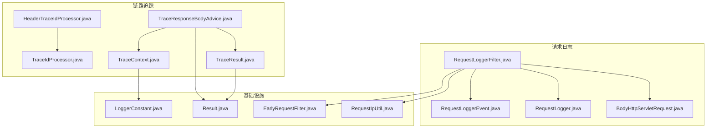
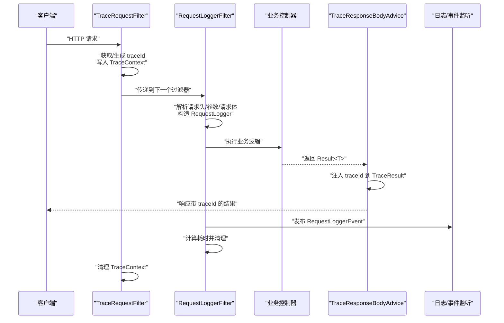
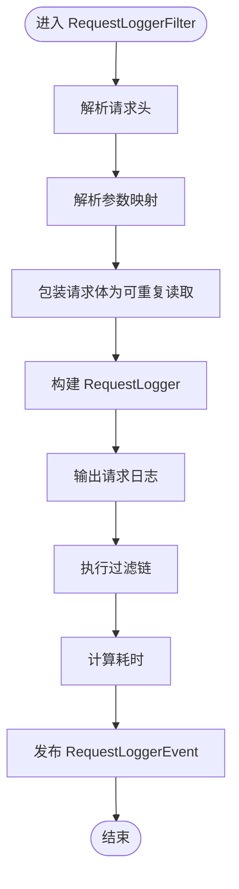
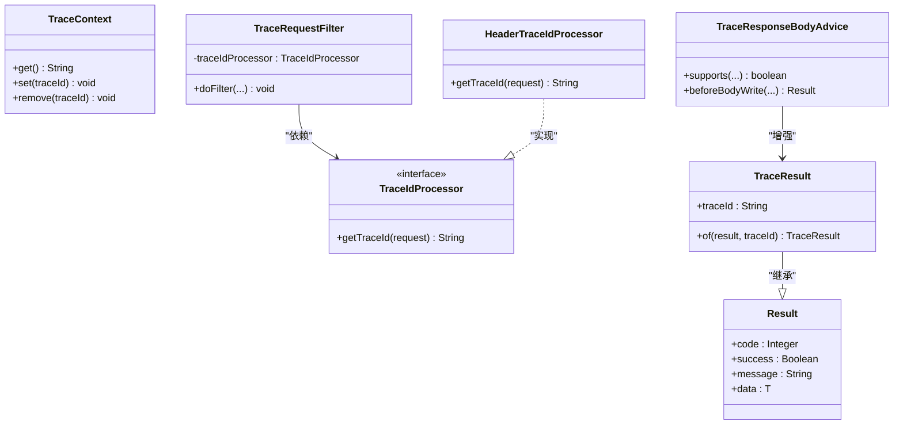
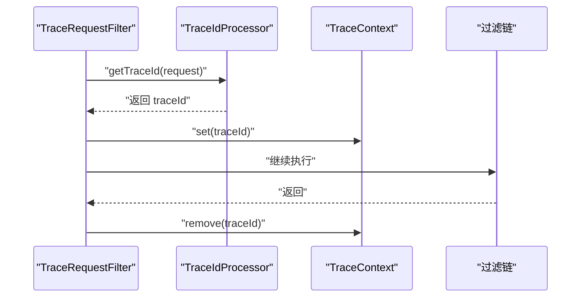
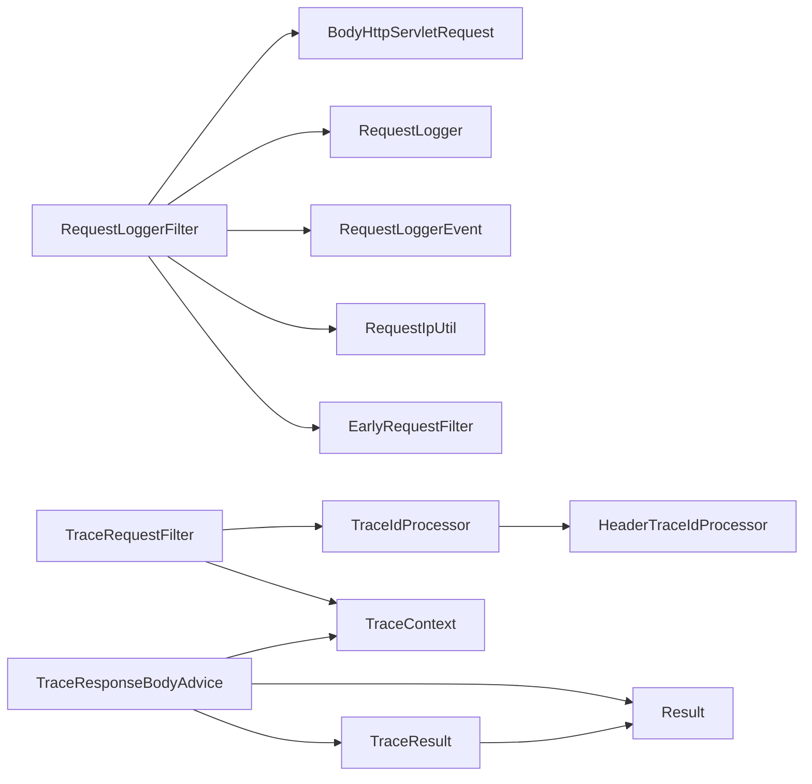

# 日志追踪

<cite>
**本文引用的文件**
- [RequestLogger.java](file://basic/src/main/java/com/kewen/framework/basic/logger/request/RequestLogger.java)
- [BodyHttpServletRequest.java](file://basic/src/main/java/com/kewen/framework/basic/logger/request/BodyHttpServletRequest.java)
- [RequestLoggerEvent.java](file://basic/src/main/java/com/kewen/framework/basic/logger/request/RequestLoggerEvent.java)
- [RequestLoggerFilter.java](file://basic/src/main/java/com/kewen/framework/basic/logger/RequestLoggerFilter.java)
- [TraceRequestFilter.java](file://basic/src/main/java/com/kewen/framework/basic/logger/TraceRequestFilter.java)
- [TraceContext.java](file://basic/src/main/java/com/kewen/framework/basic/logger/trace/TraceContext.java)
- [TraceIdProcessor.java](file://basic/src/main/java/com/kewen/framework/basic/logger/trace/TraceIdProcessor.java)
- [HeaderTraceIdProcessor.java](file://basic/src/main/java/com/kewen/framework/basic/logger/trace/HeaderTraceIdProcessor.java)
- [TraceResponseBodyAdvice.java](file://basic/src/main/java/com/kewen/framework/basic/logger/trace/TraceResponseBodyAdvice.java)
- [TraceResult.java](file://basic/src/main/java/com/kewen/framework/basic/logger/trace/TraceResult.java)
- [LoggerConstant.java](file://basic/src/main/java/com/kewen/framework/basic/logger/LoggerConstant.java)
- [EarlyRequestFilter.java](file://basic/src/main/java/com/kewen/framework/basic/filter/EarlyRequestFilter.java)
- [RequestIpUtil.java](file://basic/src/main/java/com/kewen/framework/basic/utils/RequestIpUtil.java)
- [Result.java](file://basic/src/main/java/com/kewen/framework/basic/model/Result.java)
</cite>

## 目录
1. [简介](#简介)
2. [项目结构](#项目结构)
3. [核心组件](#核心组件)
4. [架构总览](#架构总览)
5. [详细组件分析](#详细组件分析)
6. [依赖分析](#依赖分析)
7. [性能考虑](#性能考虑)
8. [故障排查指南](#故障排查指南)
9. [结论](#结论)
10. [附录：使用示例与最佳实践](#附录使用示例与最佳实践)

## 简介
本技术文档围绕“日志追踪”能力展开，系统性阐述请求日志记录机制与链路追踪实现。内容覆盖：
- 请求日志记录：RequestLogger 的数据模型、BodyHttpServletRequest 的请求体包装、RequestLoggerEvent 的事件发布。
- 链路追踪：TraceContext 上下文管理、TraceIdProcessor 追踪 ID 处理器、HeaderTraceIdProcessor 头部追踪处理器、TraceResponseBodyAdvice 响应体增强、TraceResult 追踪结果封装。
- 过滤器工作原理：RequestLoggerFilter 与 TraceRequestFilter 的过滤逻辑与顺序控制。
- 使用示例：在微服务环境中的启用方式与集成要点。
- 性能优化与监控：吞吐与资源占用优化建议及与日志/链路系统的对接思路。

## 项目结构
日志追踪相关代码集中于 basic 模块的 logger 与 logger.request、logger.trace 子包，并辅以工具类与接口定义：
- 请求日志：RequestLogger、BodyHttpServletRequest、RequestLoggerEvent、RequestLoggerFilter
- 链路追踪：TraceContext、TraceIdProcessor、HeaderTraceIdProcessor、TraceResponseBodyAdvice、TraceResult
- 基础设施：LoggerConstant、EarlyRequestFilter、RequestIpUtil、Result

图表来源
- [RequestLoggerFilter.java:1-125](file://basic/src/main/java/com/kewen/framework/basic/logger/RequestLoggerFilter.java#L1-L125)
- [BodyHttpServletRequest.java:1-103](file://basic/src/main/java/com/kewen/framework/basic/logger/request/BodyHttpServletRequest.java#L1-L103)
- [RequestLogger.java:1-26](file://basic/src/main/java/com/kewen/framework/basic/logger/request/RequestLogger.java#L1-L26)
- [RequestLoggerEvent.java:1-24](file://basic/src/main/java/com/kewen/framework/basic/logger/request/RequestLoggerEvent.java#L1-L24)
- [TraceRequestFilter.java:1-52](file://basic/src/main/java/com/kewen/framework/basic/logger/TraceRequestFilter.java#L1-L52)
- [TraceContext.java:1-23](file://basic/src/main/java/com/kewen/framework/basic/logger/trace/TraceContext.java#L1-L23)
- [TraceIdProcessor.java:1-19](file://basic/src/main/java/com/kewen/framework/basic/logger/trace/TraceIdProcessor.java#L1-L19)
- [HeaderTraceIdProcessor.java:1-28](file://basic/src/main/java/com/kewen/framework/basic/logger/trace/HeaderTraceIdProcessor.java#L1-L28)
- [TraceResponseBodyAdvice.java:1-32](file://basic/src/main/java/com/kewen/framework/basic/logger/trace/TraceResponseBodyAdvice.java#L1-L32)
- [TraceResult.java:1-32](file://basic/src/main/java/com/kewen/framework/basic/logger/trace/TraceResult.java#L1-L32)
- [LoggerConstant.java:1-11](file://basic/src/main/java/com/kewen/framework/basic/logger/LoggerConstant.java#L1-L11)
- [EarlyRequestFilter.java:1-24](file://basic/src/main/java/com/kewen/framework/basic/filter/EarlyRequestFilter.java#L1-L24)
- [RequestIpUtil.java:1-40](file://basic/src/main/java/com/kewen/framework/basic/utils/RequestIpUtil.java#L1-L40)
- [Result.java:1-49](file://basic/src/main/java/com/kewen/framework/basic/model/Result.java#L1-L49)

章节来源
- [RequestLoggerFilter.java:1-125](file://basic/src/main/java/com/kewen/framework/basic/logger/RequestLoggerFilter.java#L1-L125)
- [TraceRequestFilter.java:1-52](file://basic/src/main/java/com/kewen/framework/basic/logger/TraceRequestFilter.java#L1-L52)
- [BodyHttpServletRequest.java:1-103](file://basic/src/main/java/com/kewen/framework/basic/logger/request/BodyHttpServletRequest.java#L1-L103)
- [RequestLogger.java:1-26](file://basic/src/main/java/com/kewen/framework/basic/logger/request/RequestLogger.java#L1-L26)
- [RequestLoggerEvent.java:1-24](file://basic/src/main/java/com/kewen/framework/basic/logger/request/RequestLoggerEvent.java#L1-L24)
- [TraceContext.java:1-23](file://basic/src/main/java/com/kewen/framework/basic/logger/trace/TraceContext.java#L1-L23)
- [TraceIdProcessor.java:1-19](file://basic/src/main/java/com/kewen/framework/basic/logger/trace/TraceIdProcessor.java#L1-L19)
- [HeaderTraceIdProcessor.java:1-28](file://basic/src/main/java/com/kewen/framework/basic/logger/trace/HeaderTraceIdProcessor.java#L1-L28)
- [TraceResponseBodyAdvice.java:1-32](file://basic/src/main/java/com/kewen/framework/basic/logger/trace/TraceResponseBodyAdvice.java#L1-L32)
- [TraceResult.java:1-32](file://basic/src/main/java/com/kewen/framework/basic/logger/trace/TraceResult.java#L1-L32)
- [LoggerConstant.java:1-11](file://basic/src/main/java/com/kewen/framework/basic/logger/LoggerConstant.java#L1-L11)
- [EarlyRequestFilter.java:1-24](file://basic/src/main/java/com/kewen/framework/basic/filter/EarlyRequestFilter.java#L1-L24)
- [RequestIpUtil.java:1-40](file://basic/src/main/java/com/kewen/framework/basic/utils/RequestIpUtil.java#L1-L40)
- [Result.java:1-49](file://basic/src/main/java/com/kewen/framework/basic/model/Result.java#L1-L49)

## 核心组件
- RequestLogger：请求日志数据载体，包含 URL、方法、参数、请求体、客户端 IP、请求头、执行耗时等字段。
- BodyHttpServletRequest：对 HttpServletRequest 的包装，支持将输入流缓存为字节数组，实现请求体的多次读取（仅对 JSON 类型生效）。
- RequestLoggerEvent：请求日志持久化事件，承载 RequestLogger 对象，供事件监听器消费。
- RequestLoggerFilter：请求级过滤器，负责解析请求头、参数、请求体，计算耗时，并发布请求日志事件。
- TraceRequestFilter：全局追踪过滤器，基于 TraceIdProcessor 获取或生成 traceId，写入 TraceContext，并在请求结束时清理。
- TraceContext：基于 MDC 的上下文管理器，提供 get/set/remove 方法。
- TraceIdProcessor：追踪 ID 生成策略接口，默认实现 HeaderTraceIdProcessor 从请求头读取 traceId，不存在则生成随机值。
- TraceResponseBodyAdvice：响应体增强切面，拦截 Result 类型响应，注入 traceId 到 TraceResult。
- TraceResult：扩展 Result 的带 traceId 结果封装。
- LoggerConstant：追踪键名常量（traceId）。
- EarlyRequestFilter：早期过滤器接口，确保在请求生命周期最早阶段执行。
- RequestIpUtil：多代理场景下的真实 IP 解析工具。
- Result：统一响应结构基类。

章节来源
- [RequestLogger.java:1-26](file://basic/src/main/java/com/kewen/framework/basic/logger/request/RequestLogger.java#L1-L26)
- [BodyHttpServletRequest.java:1-103](file://basic/src/main/java/com/kewen/framework/basic/logger/request/BodyHttpServletRequest.java#L1-L103)
- [RequestLoggerEvent.java:1-24](file://basic/src/main/java/com/kewen/framework/basic/logger/request/RequestLoggerEvent.java#L1-L24)
- [RequestLoggerFilter.java:1-125](file://basic/src/main/java/com/kewen/framework/basic/logger/RequestLoggerFilter.java#L1-L125)
- [TraceRequestFilter.java:1-52](file://basic/src/main/java/com/kewen/framework/basic/logger/TraceRequestFilter.java#L1-L52)
- [TraceContext.java:1-23](file://basic/src/main/java/com/kewen/framework/basic/logger/trace/TraceContext.java#L1-L23)
- [TraceIdProcessor.java:1-19](file://basic/src/main/java/com/kewen/framework/basic/logger/trace/TraceIdProcessor.java#L1-L19)
- [HeaderTraceIdProcessor.java:1-28](file://basic/src/main/java/com/kewen/framework/basic/logger/trace/HeaderTraceIdProcessor.java#L1-L28)
- [TraceResponseBodyAdvice.java:1-32](file://basic/src/main/java/com/kewen/framework/basic/logger/trace/TraceResponseBodyAdvice.java#L1-L32)
- [TraceResult.java:1-32](file://basic/src/main/java/com/kewen/framework/basic/logger/trace/TraceResult.java#L1-L32)
- [LoggerConstant.java:1-11](file://basic/src/main/java/com/kewen/framework/basic/logger/LoggerConstant.java#L1-L11)
- [EarlyRequestFilter.java:1-24](file://basic/src/main/java/com/kewen/framework/basic/filter/EarlyRequestFilter.java#L1-L24)
- [RequestIpUtil.java:1-40](file://basic/src/main/java/com/kewen/framework/basic/utils/RequestIpUtil.java#L1-L40)
- [Result.java:1-49](file://basic/src/main/java/com/kewen/framework/basic/model/Result.java#L1-L49)

## 架构总览
下图展示了请求在进入应用后的两条主线：日志记录与链路追踪，以及它们如何与响应增强协同工作。

图表来源
- [TraceRequestFilter.java:1-52](file://basic/src/main/java/com/kewen/framework/basic/logger/TraceRequestFilter.java#L1-L52)
- [RequestLoggerFilter.java:1-125](file://basic/src/main/java/com/kewen/framework/basic/logger/RequestLoggerFilter.java#L1-L125)
- [TraceResponseBodyAdvice.java:1-32](file://basic/src/main/java/com/kewen/framework/basic/logger/trace/TraceResponseBodyAdvice.java#L1-L32)
- [RequestLoggerEvent.java:1-24](file://basic/src/main/java/com/kewen/framework/basic/logger/request/RequestLoggerEvent.java#L1-L24)

## 详细组件分析

### 请求日志记录机制
- RequestLogger：承载单次请求的关键信息，便于后续持久化与检索。
- BodyHttpServletRequest：仅当 Content-Type 为 application/json 时，将请求体读取并缓存为字节数组，从而允许后续读取；否则透传原始输入流。
- RequestLoggerFilter：
  - 解析请求头与参数，构造 RequestLogger。
  - 包装请求对象以支持请求体二次读取。
  - 记录请求耗时并在 finally 中发布 RequestLoggerEvent。
  - 使用 RequestIpUtil 解析真实 IP。
- RequestLoggerEvent：事件载体，便于异步持久化或上报。

图表来源
- [RequestLoggerFilter.java:1-125](file://basic/src/main/java/com/kewen/framework/basic/logger/RequestLoggerFilter.java#L1-L125)
- [BodyHttpServletRequest.java:1-103](file://basic/src/main/java/com/kewen/framework/basic/logger/request/BodyHttpServletRequest.java#L1-L103)
- [RequestLogger.java:1-26](file://basic/src/main/java/com/kewen/framework/basic/logger/request/RequestLogger.java#L1-L26)
- [RequestLoggerEvent.java:1-24](file://basic/src/main/java/com/kewen/framework/basic/logger/request/RequestLoggerEvent.java#L1-L24)
- [RequestIpUtil.java:1-40](file://basic/src/main/java/com/kewen/framework/basic/utils/RequestIpUtil.java#L1-L40)

章节来源
- [RequestLoggerFilter.java:1-125](file://basic/src/main/java/com/kewen/framework/basic/logger/RequestLoggerFilter.java#L1-L125)
- [BodyHttpServletRequest.java:1-103](file://basic/src/main/java/com/kewen/framework/basic/logger/request/BodyHttpServletRequest.java#L1-L103)
- [RequestLogger.java:1-26](file://basic/src/main/java/com/kewen/framework/basic/logger/request/RequestLogger.java#L1-L26)
- [RequestLoggerEvent.java:1-24](file://basic/src/main/java/com/kewen/framework/basic/logger/request/RequestLoggerEvent.java#L1-L24)
- [RequestIpUtil.java:1-40](file://basic/src/main/java/com/kewen/framework/basic/utils/RequestIpUtil.java#L1-L40)

### 链路追踪实现
- TraceContext：基于 MDC 的线程本地上下文，提供 get/set/remove。
- TraceIdProcessor：追踪 ID 生成策略接口；默认实现 HeaderTraceIdProcessor 从请求头读取 traceId，缺失时生成随机值。
- TraceRequestFilter：优先级靠前，负责设置/清理 TraceContext。
- TraceResponseBodyAdvice：对 Result 类型响应进行增强，在 beforeBodyWrite 中将当前 traceId 注入 TraceResult。
- TraceResult：继承 Result，新增 traceId 字段，提供 of 工厂方法完成属性复制。

图表来源
- [TraceContext.java:1-23](file://basic/src/main/java/com/kewen/framework/basic/logger/trace/TraceContext.java#L1-L23)
- [TraceIdProcessor.java:1-19](file://basic/src/main/java/com/kewen/framework/basic/logger/trace/TraceIdProcessor.java#L1-L19)
- [HeaderTraceIdProcessor.java:1-28](file://basic/src/main/java/com/kewen/framework/basic/logger/trace/HeaderTraceIdProcessor.java#L1-L28)
- [TraceRequestFilter.java:1-52](file://basic/src/main/java/com/kewen/framework/basic/logger/TraceRequestFilter.java#L1-L52)
- [TraceResponseBodyAdvice.java:1-32](file://basic/src/main/java/com/kewen/framework/basic/logger/trace/TraceResponseBodyAdvice.java#L1-L32)
- [TraceResult.java:1-32](file://basic/src/main/java/com/kewen/framework/basic/logger/trace/TraceResult.java#L1-L32)
- [Result.java:1-49](file://basic/src/main/java/com/kewen/framework/basic/model/Result.java#L1-L49)

章节来源
- [TraceContext.java:1-23](file://basic/src/main/java/com/kewen/framework/basic/logger/trace/TraceContext.java#L1-L23)
- [TraceIdProcessor.java:1-19](file://basic/src/main/java/com/kewen/framework/basic/logger/trace/TraceIdProcessor.java#L1-L19)
- [HeaderTraceIdProcessor.java:1-28](file://basic/src/main/java/com/kewen/framework/basic/logger/trace/HeaderTraceIdProcessor.java#L1-L28)
- [TraceRequestFilter.java:1-52](file://basic/src/main/java/com/kewen/framework/basic/logger/TraceRequestFilter.java#L1-L52)
- [TraceResponseBodyAdvice.java:1-32](file://basic/src/main/java/com/kewen/framework/basic/logger/trace/TraceResponseBodyAdvice.java#L1-L32)
- [TraceResult.java:1-32](file://basic/src/main/java/com/kewen/framework/basic/logger/trace/TraceResult.java#L1-L32)
- [Result.java:1-49](file://basic/src/main/java/com/kewen/framework/basic/model/Result.java#L1-L49)

### 过滤器工作原理
- TraceRequestFilter：
  - 通过 ObjectProvider 获取自定义 TraceIdProcessor，若未配置则回退到 HeaderTraceIdProcessor。
  - 在 doFilter 开始设置 traceId 到 TraceContext，结束后移除，保证线程安全。
- RequestLoggerFilter：
  - 实现 EarlyRequestFilter，确保在请求生命周期最早阶段执行。
  - 负责解析请求体（仅 JSON）、参数、头信息，构造 RequestLogger 并发布事件。
  - 计算请求耗时，便于后续统计与告警。

图表来源
- [TraceRequestFilter.java:1-52](file://basic/src/main/java/com/kewen/framework/basic/logger/TraceRequestFilter.java#L1-L52)
- [HeaderTraceIdProcessor.java:1-28](file://basic/src/main/java/com/kewen/framework/basic/logger/trace/HeaderTraceIdProcessor.java#L1-L28)
- [TraceContext.java:1-23](file://basic/src/main/java/com/kewen/framework/basic/logger/trace/TraceContext.java#L1-L23)

章节来源
- [TraceRequestFilter.java:1-52](file://basic/src/main/java/com/kewen/framework/basic/logger/TraceRequestFilter.java#L1-L52)
- [EarlyRequestFilter.java:1-24](file://basic/src/main/java/com/kewen/framework/basic/filter/EarlyRequestFilter.java#L1-L24)

## 依赖分析
- 组件内聚与耦合：
  - RequestLoggerFilter 依赖 BodyHttpServletRequest、RequestLogger、RequestLoggerEvent、RequestIpUtil、EarlyRequestFilter。
  - TraceRequestFilter 依赖 TraceIdProcessor、HeaderTraceIdProcessor、TraceContext。
  - TraceResponseBodyAdvice 依赖 TraceResult、Result、TraceContext。
  - TraceResult 依赖 Result。
- 外部依赖：
  - FastJSON2 用于请求体与参数的序列化/反序列化。
  - SLF4J + MDC 用于上下文传播与日志关联。
  - Spring MVC/Servlet 用于过滤器与响应体增强。

图表来源
- [RequestLoggerFilter.java:1-125](file://basic/src/main/java/com/kewen/framework/basic/logger/RequestLoggerFilter.java#L1-L125)
- [BodyHttpServletRequest.java:1-103](file://basic/src/main/java/com/kewen/framework/basic/logger/request/BodyHttpServletRequest.java#L1-L103)
- [RequestLogger.java:1-26](file://basic/src/main/java/com/kewen/framework/basic/logger/request/RequestLogger.java#L1-L26)
- [RequestLoggerEvent.java:1-24](file://basic/src/main/java/com/kewen/framework/basic/logger/request/RequestLoggerEvent.java#L1-L24)
- [TraceRequestFilter.java:1-52](file://basic/src/main/java/com/kewen/framework/basic/logger/TraceRequestFilter.java#L1-L52)
- [TraceIdProcessor.java:1-19](file://basic/src/main/java/com/kewen/framework/basic/logger/trace/TraceIdProcessor.java#L1-L19)
- [HeaderTraceIdProcessor.java:1-28](file://basic/src/main/java/com/kewen/framework/basic/logger/trace/HeaderTraceIdProcessor.java#L1-L28)
- [TraceContext.java:1-23](file://basic/src/main/java/com/kewen/framework/basic/logger/trace/TraceContext.java#L1-L23)
- [TraceResponseBodyAdvice.java:1-32](file://basic/src/main/java/com/kewen/framework/basic/logger/trace/TraceResponseBodyAdvice.java#L1-L32)
- [TraceResult.java:1-32](file://basic/src/main/java/com/kewen/framework/basic/logger/trace/TraceResult.java#L1-L32)
- [Result.java:1-49](file://basic/src/main/java/com/kewen/framework/basic/model/Result.java#L1-L49)

章节来源
- [RequestLoggerFilter.java:1-125](file://basic/src/main/java/com/kewen/framework/basic/logger/RequestLoggerFilter.java#L1-L125)
- [TraceRequestFilter.java:1-52](file://basic/src/main/java/com/kewen/framework/basic/logger/TraceRequestFilter.java#L1-L52)
- [TraceResponseBodyAdvice.java:1-32](file://basic/src/main/java/com/kewen/framework/basic/logger/trace/TraceResponseBodyAdvice.java#L1-L32)

## 性能考虑
- 请求体读取与缓存
  - BodyHttpServletRequest 仅对 application/json 生效，避免对非 JSON 请求做额外 IO。
  - 缓存字节数组后通过自定义 ServletInputStream 重复读取，避免重复解析带来的性能损耗。
- 日志输出与事件发布
  - RequestLoggerFilter 在 finally 中发布事件，确保即使异常也能记录耗时与上下文。
  - 建议将 RequestLoggerEvent 的持久化放入异步监听器，避免阻塞主请求链路。
- 响应增强
  - TraceResponseBodyAdvice 仅对 Result 类型生效，降低对非标准响应的影响。
  - TraceResult 的 of 工厂方法避免反射拷贝，提升性能。
- 上下文管理
  - TraceContext 基于 MDC，线程局部存储，开销极低；注意在 finally 中及时清理，防止内存泄漏。
- 过滤器顺序
  - TraceRequestFilter 优先级靠前，确保 traceId 提前可用；RequestLoggerFilter 作为早期过滤器，尽早采集信息。

[本节为通用性能建议，无需特定文件来源]

## 故障排查指南
- 请求体为空
  - 现象：请求体字段为 null。
  - 排查：确认 Content-Type 是否为 application/json；非 JSON 请求不会被缓存。
  - 参考：BodyHttpServletRequest 的 canParseBody 判定逻辑。
- traceId 丢失
  - 现象：响应中缺少 traceId 或日志无法关联。
  - 排查：确认 TraceRequestFilter 是否在过滤器链中且优先级靠前；检查请求头是否携带 traceId；确认 TraceContext 是否在 finally 中被清理。
- 日志未落库
  - 现象：请求日志未持久化。
  - 排查：确认存在 RequestLoggerEvent 的监听器实现并正确注册；检查异步任务队列与数据库连接。
- IP 解析异常
  - 现象：日志中 IP 不正确。
  - 排查：确认代理链配置与请求头是否按预期传递；必要时调整代理头名称。
- 响应未注入 traceId
  - 现象：业务返回未携带 traceId。
  - 排查：确认返回类型为 Result 或其子类；确认 TraceResponseBodyAdvice 的 Order 设置合理。

章节来源
- [BodyHttpServletRequest.java:1-103](file://basic/src/main/java/com/kewen/framework/basic/logger/request/BodyHttpServletRequest.java#L1-L103)
- [TraceRequestFilter.java:1-52](file://basic/src/main/java/com/kewen/framework/basic/logger/TraceRequestFilter.java#L1-L52)
- [TraceResponseBodyAdvice.java:1-32](file://basic/src/main/java/com/kewen/framework/basic/logger/trace/TraceResponseBodyAdvice.java#L1-L32)
- [RequestLoggerFilter.java:1-125](file://basic/src/main/java/com/kewen/framework/basic/logger/RequestLoggerFilter.java#L1-L125)
- [RequestIpUtil.java:1-40](file://basic/src/main/java/com/kewen/framework/basic/utils/RequestIpUtil.java#L1-L40)

## 结论
该日志追踪体系通过“过滤器 + 上下文 + 事件 + 响应增强”的组合，实现了：
- 可观测的请求日志采集与持久化；
- 跨服务调用的 traceId 传递与统一标识；
- 对业务无侵入的响应增强与链路闭环。

在微服务环境下，建议结合配置中心与日志/链路平台，实现统一的采集、存储与查询。

[本节为总结性内容，无需特定文件来源]

## 附录：使用示例与最佳实践
- 启用方式（Spring Boot）
  - 确保过滤器与切面组件可被扫描到（如通过 Starter 或 @ComponentScan）。
  - 若需自定义 traceId 生成策略，实现 TraceIdProcessor 并注册为 Spring Bean。
- 微服务集成
  - 在网关或服务入口放置 TraceRequestFilter，确保下游服务可复用 traceId。
  - 使用 HeaderTraceIdProcessor 时，建议在网关层将上游 traceId 写入请求头。
- 监控与告警
  - 基于 RequestLogger 的执行耗时与状态码建立指标。
  - 将 traceId 与日志/链路系统打通，实现端到端追踪。
- 最佳实践
  - 控制请求体大小，避免过大的 JSON 导致内存压力。
  - 对非 JSON 请求体采用其他方式记录（如参数与头信息已足够）。
  - 异步化日志持久化，避免阻塞请求处理。
  - 定期清理 MDC，防止线程池复用导致的上下文污染。

[本节为概念性说明，无需特定文件来源]