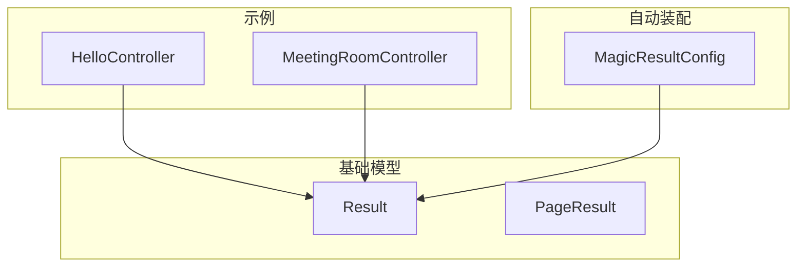
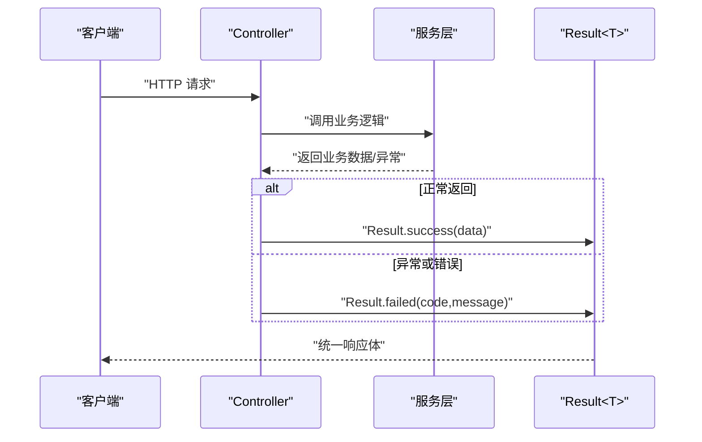
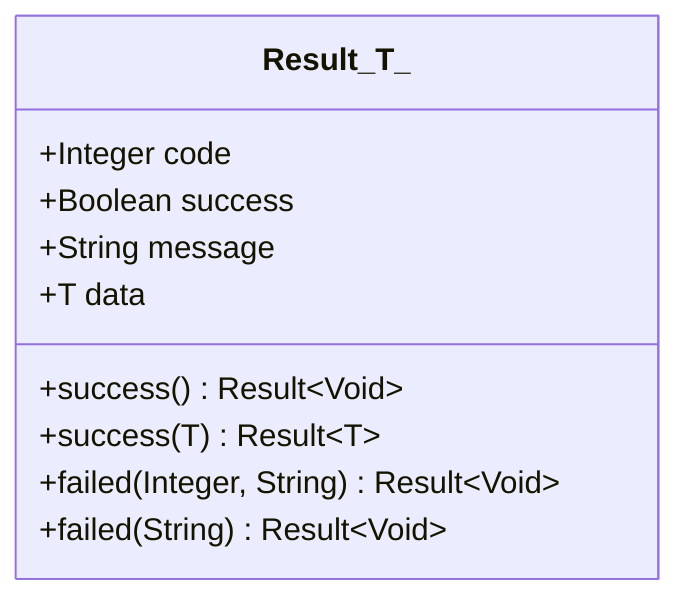
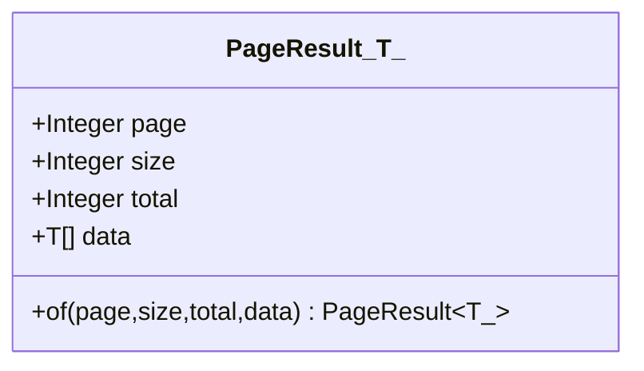
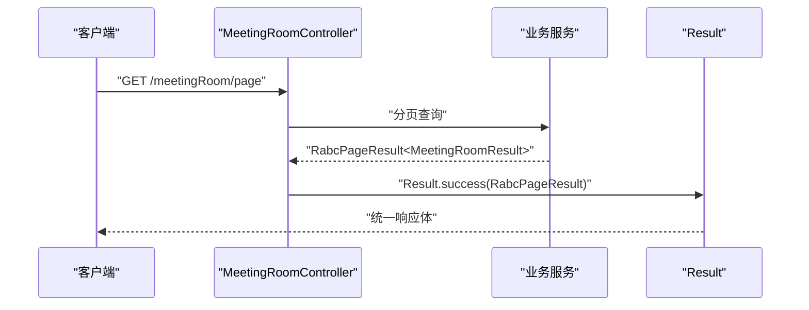
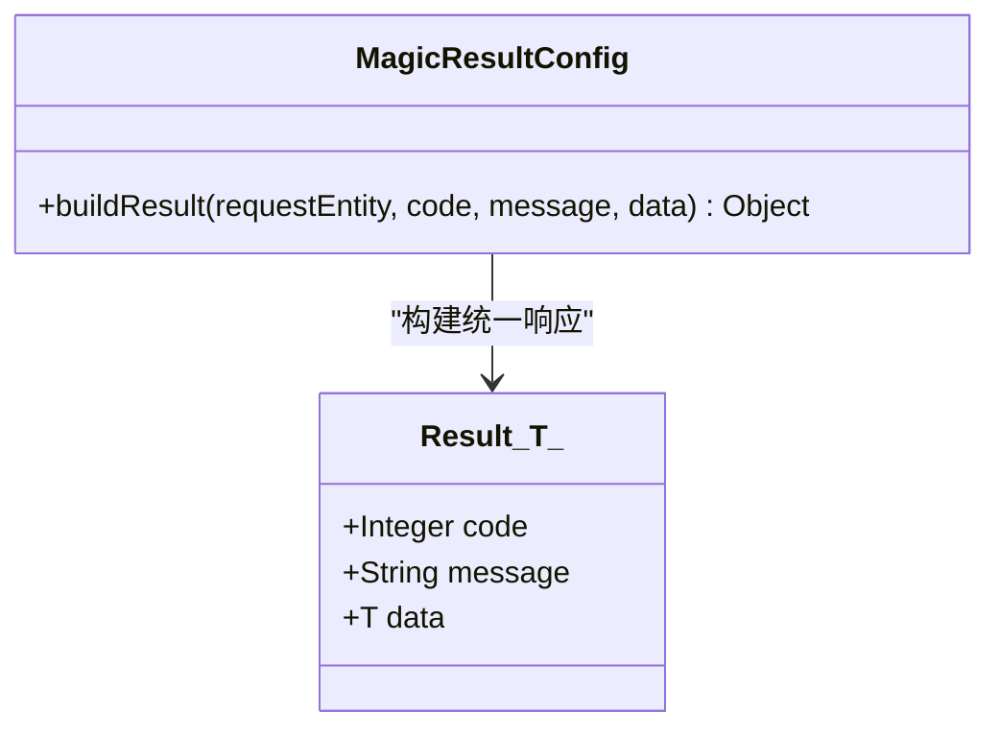
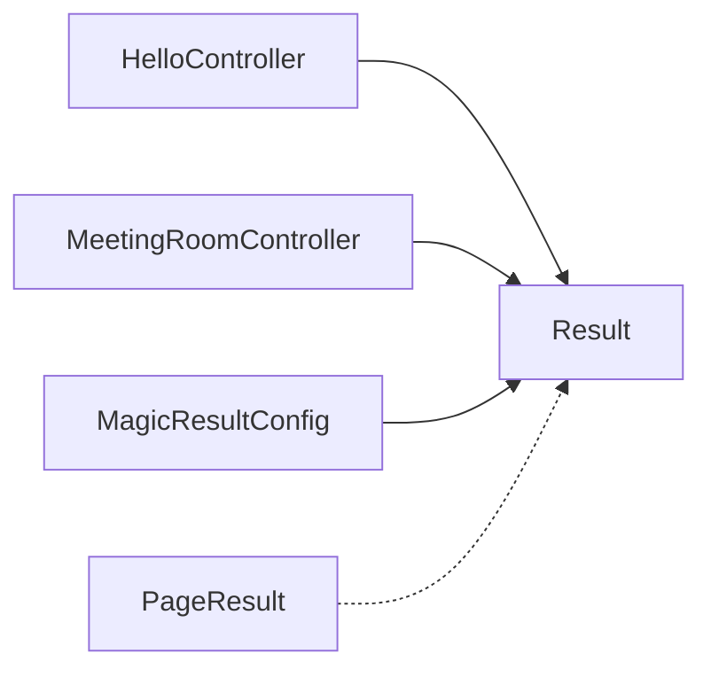

# 统一响应格式

<cite>
**本文引用的文件**
- [Result.java](file://basic/src/main/java/com/kewen/framework/basic/model/Result.java)
- [PageResult.java](file://basic/src/main/java/com/kewen/framework/basic/model/PageResult.java)
- [MagicResultConfig.java](file://boot/magic-spring-boot-starter/src/main/java/com/kewen/framework/boot/magic/config/MagicResultConfig.java)
- [HelloController.java](file://boot/magic-spring-boot-starter/src/main/java/com/kewen/framework/boot/magic/controller/HelloController.java)
- [MeetingRoomController.java](file://sample/auth-boot-sample/src/main/java/com/kewen/framework/auth/sample/controller/MeetingRoomController.java)
</cite>

## 目录
1. [简介](#简介)
2. [项目结构](#项目结构)
3. [核心组件](#核心组件)
4. [架构总览](#架构总览)
5. [组件详解](#组件详解)
6. [依赖关系分析](#依赖关系分析)
7. [性能与扩展性](#性能与扩展性)
8. [故障排查指南](#故障排查指南)
9. [结论](#结论)
10. [附录](#附录)

## 简介
本文件围绕“统一响应格式”能力进行系统化技术文档编写，重点覆盖以下内容：
- Result 类的设计理念与实现原理，包括泛型支持与静态工厂方法
- success() 与 failed() 方法的多种重载形式及适用场景
- Result 字段语义：code 状态码、success 成功标识、message 提示信息、data 数据载体
- PageResult 分页结果类的设计思路与使用场景
- 在 Controller 中返回统一格式响应的最佳实践与示例路径
- 配置层对统一响应格式的支持（如 MagicResultConfig）

## 项目结构
统一响应格式能力主要位于 basic 模块的基础模型中，配套的自动装配与示例位于 boot 与 sample 模块中：
- basic 模块提供 Result 与 PageResult 两个核心模型
- boot/magic-spring-boot-starter 展示了如何将任意返回值包装为统一格式
- sample/auth-boot-sample 展示了在真实 Controller 中直接返回 Result 的用法

**图表来源**
- [Result.java:11-48](file://basic/src/main/java/com/kewen/framework/basic/model/Result.java#L11-L48)
- [PageResult.java:14-31](file://basic/src/main/java/com/kewen/framework/basic/model/PageResult.java#L14-L31)
- [MagicResultConfig.java:14-23](file://boot/magic-spring-boot-starter/src/main/java/com/kewen/framework/boot/magic/config/MagicResultConfig.java#L14-L23)
- [HelloController.java:12-26](file://boot/magic-spring-boot-starter/src/main/java/com/kewen/framework/boot/magic/controller/HelloController.java#L12-L26)
- [MeetingRoomController.java:34-100](file://sample/auth-boot-sample/src/main/java/com/kewen/framework/auth/sample/controller/MeetingRoomController.java#L34-L100)

**章节来源**
- [Result.java:11-48](file://basic/src/main/java/com/kewen/framework/basic/model/Result.java#L11-L48)
- [PageResult.java:14-31](file://basic/src/main/java/com/kewen/framework/basic/model/PageResult.java#L14-L31)
- [MagicResultConfig.java:14-23](file://boot/magic-spring-boot-starter/src/main/java/com/kewen/framework/boot/magic/config/MagicResultConfig.java#L14-L23)
- [HelloController.java:12-26](file://boot/magic-spring-boot-starter/src/main/java/com/kewen/framework/boot/magic/controller/HelloController.java#L12-L26)
- [MeetingRoomController.java:34-100](file://sample/auth-boot-sample/src/main/java/com/kewen/framework/auth/sample/controller/MeetingRoomController.java#L34-L100)

## 核心组件
- Result<T>：统一响应载体，支持泛型承载任意数据类型；提供静态工厂方法快速构造成功或失败响应
- PageResult<T>：分页结果容器，封装 page、size、total、data 四个字段，便于前后端分页交互
- MagicResultConfig：在特定运行时（如 Magic API）将底层返回值统一包装为 Result 对象
- 示例 Controller：展示在常规 Spring MVC 控制器中直接返回 Result 的用法

**章节来源**
- [Result.java:11-48](file://basic/src/main/java/com/kewen/framework/basic/model/Result.java#L11-L48)
- [PageResult.java:14-31](file://basic/src/main/java/com/kewen/framework/basic/model/PageResult.java#L14-L31)
- [MagicResultConfig.java:14-23](file://boot/magic-spring-boot-starter/src/main/java/com/kewen/framework/boot/magic/config/MagicResultConfig.java#L14-L23)
- [HelloController.java:12-26](file://boot/magic-spring-boot-starter/src/main/java/com/kewen/framework/boot/magic/controller/HelloController.java#L12-L26)
- [MeetingRoomController.java:34-100](file://sample/auth-boot-sample/src/main/java/com/kewen/framework/auth/sample/controller/MeetingRoomController.java#L34-L100)

## 架构总览
统一响应格式在不同层面协同工作：
- 基础模型层：Result 与 PageResult 定义统一的数据结构
- 控制器层：Controller 直接返回 Result 或 Result<T>，保证接口一致性
- 自动装配层：在某些运行时（如 Magic API），通过 ResultProvider 将任意返回值包装为 Result

**图表来源**
- [HelloController.java:15-23](file://boot/magic-spring-boot-starter/src/main/java/com/kewen/framework/boot/magic/controller/HelloController.java#L15-L23)
- [MeetingRoomController.java:72-97](file://sample/auth-boot-sample/src/main/java/com/kewen/framework/auth/sample/controller/MeetingRoomController.java#L72-L97)
- [Result.java:19-47](file://basic/src/main/java/com/kewen/framework/basic/model/Result.java#L19-L47)

## 组件详解

### Result<T> 设计与实现
- 泛型设计：通过 T 表示 data 字段的类型，支持任意对象作为数据载体
- 字段语义
  - code：状态码，用于表达响应级别（如 200 成功、500 失败）
  - success：布尔标志，true 表示成功，false 表示失败
  - message：提示信息，用于描述响应语义
  - data：数据载体，承载业务返回的具体内容
- 静态工厂方法
  - success()：无参成功返回，适用于仅需表达“成功”的场景
  - success(T data)：带数据的成功返回，适用于返回业务对象或集合
  - failed(Integer code, String message)：自定义状态码与消息的失败返回
  - failed(String message)：默认状态码（如 500）的失败返回

**图表来源**
- [Result.java:11-48](file://basic/src/main/java/com/kewen/framework/basic/model/Result.java#L11-L48)

**章节来源**
- [Result.java:11-48](file://basic/src/main/java/com/kewen/framework/basic/model/Result.java#L11-L48)

### PageResult<T> 设计与使用
- 字段语义
  - page：当前页码
  - size：每页条数
  - total：总数
  - data：当前页数据列表
- 工厂方法
  - of(Integer page, Integer size, Integer total, List<T> data)：便捷构造分页结果
- 使用场景
  - 列表查询、分页查询等需要返回分页信息的接口

**图表来源**
- [PageResult.java:14-31](file://basic/src/main/java/com/kewen/framework/basic/model/PageResult.java#L14-L31)

**章节来源**
- [PageResult.java:14-31](file://basic/src/main/java/com/kewen/framework/basic/model/PageResult.java#L14-L31)

### 在控制器中返回统一响应
- 直接返回 Result：在 Controller 方法中直接返回 Result 或 Result<T>，由框架序列化为统一响应体
- 示例路径
  - [HelloController.java:15-23](file://boot/magic-spring-boot-starter/src/main/java/com/kewen/framework/boot/magic/controller/HelloController.java#L15-L23)
  - [MeetingRoomController.java:72-97](file://sample/auth-boot-sample/src/main/java/com/kewen/framework/auth/sample/controller/MeetingRoomController.java#L72-L97)

**图表来源**
- [MeetingRoomController.java:84-97](file://sample/auth-boot-sample/src/main/java/com/kewen/framework/auth/sample/controller/MeetingRoomController.java#L84-L97)
- [Result.java:26-33](file://basic/src/main/java/com/kewen/framework/basic/model/Result.java#L26-L33)

**章节来源**
- [HelloController.java:15-23](file://boot/magic-spring-boot-starter/src/main/java/com/kewen/framework/boot/magic/controller/HelloController.java#L15-L23)
- [MeetingRoomController.java:72-97](file://sample/auth-boot-sample/src/main/java/com/kewen/framework/auth/sample/controller/MeetingRoomController.java#L72-L97)

### 配置层对统一响应的支持
- MagicResultConfig 实现 ResultProvider 接口，在 Magic API 场景下将任意返回值包装为 Result 对象
- 该配置展示了如何在非 Spring MVC 的运行环境中统一输出格式

**图表来源**
- [MagicResultConfig.java:14-23](file://boot/magic-spring-boot-starter/src/main/java/com/kewen/framework/boot/magic/config/MagicResultConfig.java#L14-L23)
- [Result.java:11-17](file://basic/src/main/java/com/kewen/framework/basic/model/Result.java#L11-L17)

**章节来源**
- [MagicResultConfig.java:14-23](file://boot/magic-spring-boot-starter/src/main/java/com/kewen/framework/boot/magic/config/MagicResultConfig.java#L14-L23)

## 依赖关系分析
- Result 与 PageResult 为纯数据模型，无外部依赖，内聚性强
- 控制器依赖 Result 返回统一响应
- MagicResultConfig 依赖 Result 并实现 ResultProvider，用于特定运行时的统一包装

**图表来源**
- [HelloController.java:12-26](file://boot/magic-spring-boot-starter/src/main/java/com/kewen/framework/boot/magic/controller/HelloController.java#L12-L26)
- [MeetingRoomController.java:34-100](file://sample/auth-boot-sample/src/main/java/com/kewen/framework/auth/sample/controller/MeetingRoomController.java#L34-L100)
- [MagicResultConfig.java:14-23](file://boot/magic-spring-boot-starter/src/main/java/com/kewen/framework/boot/magic/config/MagicResultConfig.java#L14-L23)
- [Result.java:11-48](file://basic/src/main/java/com/kewen/framework/basic/model/Result.java#L11-L48)
- [PageResult.java:14-31](file://basic/src/main/java/com/kewen/framework/basic/model/PageResult.java#L14-L31)

**章节来源**
- [HelloController.java:12-26](file://boot/magic-spring-boot-starter/src/main/java/com/kewen/framework/boot/magic/controller/HelloController.java#L12-L26)
- [MeetingRoomController.java:34-100](file://sample/auth-boot-sample/src/main/java/com/kewen/framework/auth/sample/controller/MeetingRoomController.java#L34-L100)
- [MagicResultConfig.java:14-23](file://boot/magic-spring-boot-starter/src/main/java/com/kewen/framework/boot/magic/config/MagicResultConfig.java#L14-L23)
- [Result.java:11-48](file://basic/src/main/java/com/kewen/framework/basic/model/Result.java#L11-L48)
- [PageResult.java:14-31](file://basic/src/main/java/com/kewen/framework/basic/model/PageResult.java#L14-L31)

## 性能与扩展性
- 性能特性
  - Result 与 PageResult 为轻量 POJO，序列化开销低
  - 静态工厂方法避免重复构造，提升代码可读性与调用效率
- 扩展建议
  - 可在 Result 中增加 traceId、timestamp 等通用字段以增强可观测性
  - 若存在多套业务状态码体系，可在应用侧定义常量或枚举以规范 code 含义

[本节为通用建议，不涉及具体文件分析]

## 故障排查指南
- 常见问题
  - 返回空 data：确认 success(T data) 是否传入了正确的数据对象
  - 错误状态未显式设置：优先使用 failed(String message) 或 failed(Integer code, String message)
  - 分页数据缺失：检查 PageResult.of 的参数顺序与数值是否正确
- 定位方法
  - 在 Controller 层打印关键入参与返回值
  - 使用统一异常处理捕获异常并转换为 Result.failed 形式返回

[本节为通用建议，不涉及具体文件分析]

## 结论
统一响应格式通过 Result 与 PageResult 提供一致的接口契约，结合控制器直接返回与配置层自动包装，能够有效提升接口的一致性与可维护性。建议在所有对外接口中统一采用 Result 包裹返回值，并在分页场景中使用 PageResult，配合清晰的状态码与提示信息，确保前后端协作顺畅。

[本节为总结性内容，不涉及具体文件分析]

## 附录

### 字段与方法速查
- Result 字段
  - code：状态码
  - success：成功标识
  - message：提示信息
  - data：数据载体
- Result 方法
  - success()：无参成功
  - success(T data)：带数据成功
  - failed(Integer code, String message)：自定义失败
  - failed(String message)：默认失败
- PageResult 方法
  - of(page, size, total, data)：构造分页结果

**章节来源**
- [Result.java:11-48](file://basic/src/main/java/com/kewen/framework/basic/model/Result.java#L11-L48)
- [PageResult.java:14-31](file://basic/src/main/java/com/kewen/framework/basic/model/PageResult.java#L14-L31)