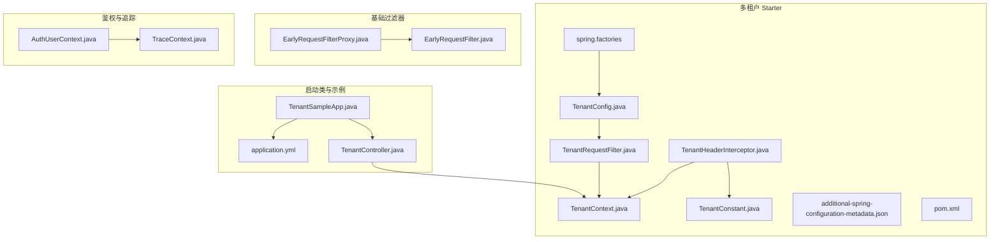
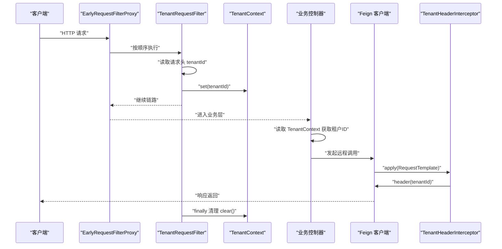
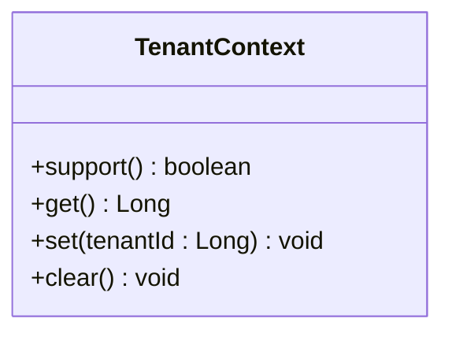
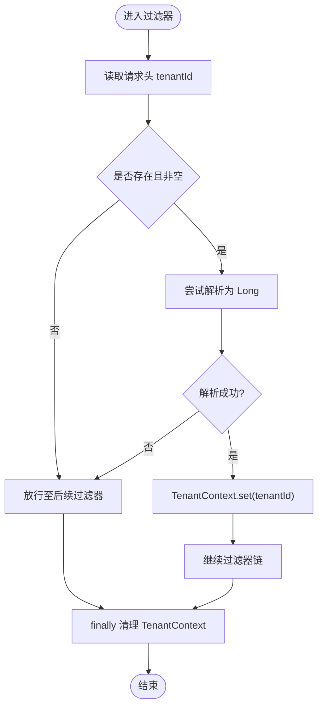
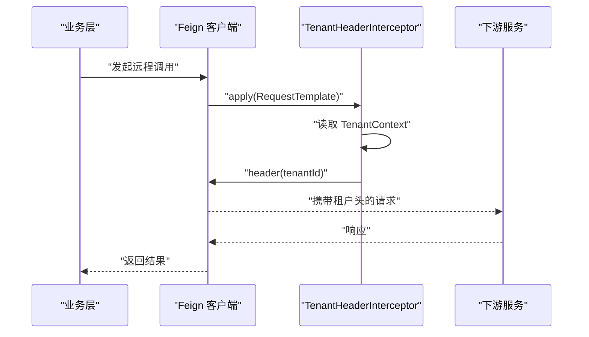
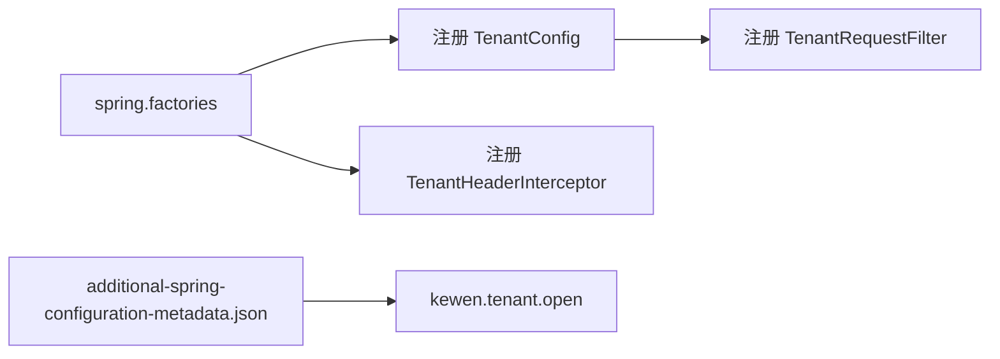
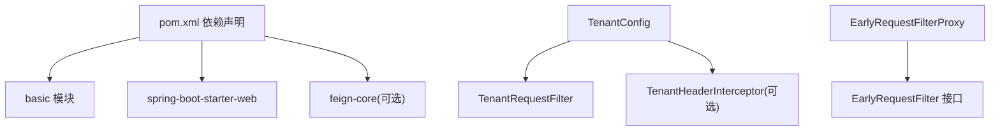

# 多租户管理

<cite>
**本文引用的文件**   
- [TenantContext.java](file://boot/tenant-spring-boot-starter/src/main/java/com/kewen/framework/tenant/TenantContext.java)
- [TenantRequestFilter.java](file://boot/tenant-spring-boot-starter/src/main/java/com/kewen/framework/tenant/TenantRequestFilter.java)
- [TenantConfig.java](file://boot/tenant-spring-boot-starter/src/main/java/com/kewen/framework/tenant/config/TenantConfig.java)
- [TenantConstant.java](file://boot/tenant-spring-boot-starter/src/main/java/com/kewen/framework/tenant/TenantConstant.java)
- [TenantHeaderInterceptor.java](file://boot/tenant-spring-boot-starter/src/main/java/com/kewen/framework/tenant/feign/TenantHeaderInterceptor.java)
- [EarlyRequestFilter.java](file://basic/src/main/java/com/kewen/framework/basic/filter/EarlyRequestFilter.java)
- [EarlyRequestFilterProxy.java](file://basic/src/main/java/com/kewen/framework/basic/filter/EarlyRequestFilterProxy.java)
- [spring.factories](file://boot/tenant-spring-boot-starter/src/main/resources/META-INF/spring.factories)
- [additional-spring-configuration-metadata.json](file://boot/tenant-spring-boot-starter/src/main/resources/META-INF/additional-spring-configuration-metadata.json)
- [pom.xml](file://boot/tenant-spring-boot-starter/pom.xml)
- [application.yml](file://sample/tenant-boot-sample/src/main/resources/application.yml)
- [TenantController.java](file://sample/tenant-boot-sample/src/main/java/com/kewen/framework/sample/tenant/controller/TenantController.java)
- [TenantSampleApp.java](file://sample/tenant-boot-sample/src/main/java/com/kewen/framework/sample/tenant/TenantSampleApp.java)
- [AuthUserContext.java](file://qy-auth/auth-core/src/main/java/com/kewen/framework/auth/core/AuthUserContext.java)
- [TraceContext.java](file://basic/src/main/java/com/kewen/framework/basic/logger/trace/TraceContext.java)
</cite>

## 目录
1. [引言](#引言)
2. [项目结构](#项目结构)
3. [核心组件](#核心组件)
4. [架构总览](#架构总览)
5. [组件详解](#组件详解)
6. [依赖关系分析](#依赖关系分析)
7. [性能与扩展性](#性能与扩展性)
8. [故障排查指南](#故障排查指南)
9. [结论](#结论)
10. [附录](#附录)

## 引言
本技术文档围绕多租户管理系统进行系统化梳理，重点阐述以下内容：
- 多租户架构的设计原理与实现方案
- TenantContext 的上下文管理与 ThreadLocal 实现机制
- 租户过滤器的工作原理与数据隔离策略
- 租户标识的传递方式与验证机制
- 多租户应用的开发指南（数据模型设计、查询优化、权限控制）
- 配置示例与最佳实践
- 性能考虑与扩展性设计

## 项目结构
多租户能力主要位于 tenant-spring-boot-starter 模块，配合基础过滤器与自动装配机制，形成“请求入口 -> 上下文注入 -> Feign 跨服务透传”的完整链路。示例工程 tenant-boot-sample 展示了如何启用与使用。

图示来源
- [TenantSampleApp.java:1-11](file://sample/tenant-boot-sample/src/main/java/com/kewen/framework/sample/tenant/TenantSampleApp.java#L1-L11)
- [application.yml:1-13](file://sample/tenant-boot-sample/src/main/resources/application.yml#L1-L13)
- [TenantController.java:1-22](file://sample/tenant-boot-sample/src/main/java/com/kewen/framework/sample/tenant/controller/TenantController.java#L1-L22)
- [TenantContext.java:1-40](file://boot/tenant-spring-boot-starter/src/main/java/com/kewen/framework/tenant/TenantContext.java#L1-L40)
- [TenantRequestFilter.java:1-38](file://boot/tenant-spring-boot-starter/src/main/java/com/kewen/framework/tenant/TenantRequestFilter.java#L1-L38)
- [TenantConstant.java:1-12](file://boot/tenant-spring-boot-starter/src/main/java/com/kewen/framework/tenant/TenantConstant.java#L1-L12)
- [TenantHeaderInterceptor.java:1-32](file://boot/tenant-spring-boot-starter/src/main/java/com/kewen/framework/tenant/feign/TenantHeaderInterceptor.java#L1-L32)
- [TenantConfig.java:1-23](file://boot/tenant-spring-boot-starter/src/main/java/com/kewen/framework/tenant/config/TenantConfig.java#L1-L23)
- [spring.factories:1-3](file://boot/tenant-spring-boot-starter/src/main/resources/META-INF/spring.factories#L1-L3)
- [additional-spring-configuration-metadata.json:1-10](file://boot/tenant-spring-boot-starter/src/main/resources/META-INF/additional-spring-configuration-metadata.json#L1-L10)
- [pom.xml:1-42](file://boot/tenant-spring-boot-starter/pom.xml#L1-L42)
- [EarlyRequestFilter.java:1-24](file://basic/src/main/java/com/kewen/framework/basic/filter/EarlyRequestFilter.java#L1-L24)
- [EarlyRequestFilterProxy.java:1-81](file://basic/src/main/java/com/kewen/framework/basic/filter/EarlyRequestFilterProxy.java#L1-L81)
- [AuthUserContext.java:1-31](file://qy-auth/auth-core/src/main/java/com/kewen/framework/auth/core/AuthUserContext.java#L1-L31)
- [TraceContext.java:1-22](file://basic/src/main/java/com/kewen/framework/basic/logger/trace/TraceContext.java#L1-L22)

章节来源
- [TenantContext.java:1-40](file://boot/tenant-spring-boot-starter/src/main/java/com/kewen/framework/tenant/TenantContext.java#L1-L40)
- [TenantRequestFilter.java:1-38](file://boot/tenant-spring-boot-starter/src/main/java/com/kewen/framework/tenant/TenantRequestFilter.java#L1-L38)
- [TenantConfig.java:1-23](file://boot/tenant-spring-boot-starter/src/main/java/com/kewen/framework/tenant/config/TenantConfig.java#L1-L23)
- [TenantConstant.java:1-12](file://boot/tenant-spring-boot-starter/src/main/java/com/kewen/framework/tenant/TenantConstant.java#L1-L12)
- [TenantHeaderInterceptor.java:1-32](file://boot/tenant-spring-boot-starter/src/main/java/com/kewen/framework/tenant/feign/TenantHeaderInterceptor.java#L1-L32)
- [EarlyRequestFilter.java:1-24](file://basic/src/main/java/com/kewen/framework/basic/filter/EarlyRequestFilter.java#L1-L24)
- [EarlyRequestFilterProxy.java:1-81](file://basic/src/main/java/com/kewen/framework/basic/filter/EarlyRequestFilterProxy.java#L1-L81)
- [spring.factories:1-3](file://boot/tenant-spring-boot-starter/src/main/resources/META-INF/spring.factories#L1-L3)
- [additional-spring-configuration-metadata.json:1-10](file://boot/tenant-spring-boot-starter/src/main/resources/META-INF/additional-spring-configuration-metadata.json#L1-L10)
- [pom.xml:1-42](file://boot/tenant-spring-boot-starter/pom.xml#L1-L42)
- [application.yml:1-13](file://sample/tenant-boot-sample/src/main/resources/application.yml#L1-L13)
- [TenantController.java:1-22](file://sample/tenant-boot-sample/src/main/java/com/kewen/framework/sample/tenant/controller/TenantController.java#L1-L22)
- [TenantSampleApp.java:1-11](file://sample/tenant-boot-sample/src/main/java/com/kewen/framework/sample/tenant/TenantSampleApp.java#L1-L11)
- [AuthUserContext.java:1-31](file://qy-auth/auth-core/src/main/java/com/kewen/framework/auth/core/AuthUserContext.java#L1-L31)
- [TraceContext.java:1-22](file://basic/src/main/java/com/kewen/framework/basic/logger/trace/TraceContext.java#L1-L22)

## 核心组件
- TenantContext：线程本地存储租户标识，提供 set/get/support/clear 等静态方法，内部使用可继承的 ThreadLocal。
- TenantRequestFilter：在请求进入时从请求头读取租户标识并写入 TenantContext；请求结束时清理上下文，确保线程安全。
- TenantHeaderInterceptor：在 Feign 客户端发起远程调用前，将当前线程中的租户标识透传到下游服务请求头。
- TenantConfig：条件化装配，当配置开关开启时注册 TenantRequestFilter。
- TenantConstant：统一租户标识头名称常量。
- EarlyRequestFilter/EarlyRequestFilterProxy：基础过滤器接口与代理，确保在 Spring Security 前执行，满足多租户前置处理需求。
- spring.factories：自动装配入口，注册配置类与拦截器。
- 配置元数据：kewen.tenant.open 控制开关，布尔型，默认关闭。

章节来源
- [TenantContext.java:1-40](file://boot/tenant-spring-boot-starter/src/main/java/com/kewen/framework/tenant/TenantContext.java#L1-L40)
- [TenantRequestFilter.java:1-38](file://boot/tenant-spring-boot-starter/src/main/java/com/kewen/framework/tenant/TenantRequestFilter.java#L1-L38)
- [TenantHeaderInterceptor.java:1-32](file://boot/tenant-spring-boot-starter/src/main/java/com/kewen/framework/tenant/feign/TenantHeaderInterceptor.java#L1-L32)
- [TenantConfig.java:1-23](file://boot/tenant-spring-boot-starter/src/main/java/com/kewen/framework/tenant/config/TenantConfig.java#L1-L23)
- [TenantConstant.java:1-12](file://boot/tenant-spring-boot-starter/src/main/java/com/kewen/framework/tenant/TenantConstant.java#L1-L12)
- [EarlyRequestFilter.java:1-24](file://basic/src/main/java/com/kewen/framework/basic/filter/EarlyRequestFilter.java#L1-L24)
- [EarlyRequestFilterProxy.java:1-81](file://basic/src/main/java/com/kewen/framework/basic/filter/EarlyRequestFilterProxy.java#L1-L81)
- [spring.factories:1-3](file://boot/tenant-spring-boot-starter/src/main/resources/META-INF/spring.factories#L1-L3)
- [additional-spring-configuration-metadata.json:1-10](file://boot/tenant-spring-boot-starter/src/main/resources/META-INF/additional-spring-configuration-metadata.json#L1-L10)

## 架构总览
多租户请求处理链路分为“请求入口 -> 上下文注入 -> 业务处理 -> Feign 透传 -> 下游服务上下文恢复”。该链路由 EarlyRequestFilterProxy 统一编排，TenantRequestFilter 在最前端解析请求头并写入 TenantContext，随后业务层可直接读取租户标识；跨服务调用时，TenantHeaderInterceptor 将租户标识附加到请求头，下游服务同样通过 TenantRequestFilter 写入其线程上下文，从而实现全链路数据隔离。

图示来源
- [EarlyRequestFilterProxy.java:1-81](file://basic/src/main/java/com/kewen/framework/basic/filter/EarlyRequestFilterProxy.java#L1-L81)
- [TenantRequestFilter.java:1-38](file://boot/tenant-spring-boot-starter/src/main/java/com/kewen/framework/tenant/TenantRequestFilter.java#L1-L38)
- [TenantContext.java:1-40](file://boot/tenant-spring-boot-starter/src/main/java/com/kewen/framework/tenant/TenantContext.java#L1-L40)
- [TenantHeaderInterceptor.java:1-32](file://boot/tenant-spring-boot-starter/src/main/java/com/kewen/framework/tenant/feign/TenantHeaderInterceptor.java#L1-L32)

## 组件详解

### TenantContext：线程上下文与数据隔离
- 设计要点
  - 使用可继承的 ThreadLocal 保存 Long 类型的租户标识，避免线程切换导致的数据丢失。
  - 提供 support()/get()/set()/clear() 方法，便于业务层统一读取与清理。
- 数据隔离策略
  - 每个请求在进入时写入租户标识，退出时清理，防止线程池复用引发的脏读。
- 复杂度与性能
  - get/set/clear 均为 O(1)，线程局部变量访问开销极低。
- 注意事项
  - 在异步任务或定时任务中需显式传递或重新设置上下文，否则可能为空。

图示来源
- [TenantContext.java:1-40](file://boot/tenant-spring-boot-starter/src/main/java/com/kewen/framework/tenant/TenantContext.java#L1-L40)

章节来源
- [TenantContext.java:1-40](file://boot/tenant-spring-boot-starter/src/main/java/com/kewen/framework/tenant/TenantContext.java#L1-L40)

### TenantRequestFilter：请求头解析与上下文注入
- 工作原理
  - 从请求头读取租户标识（常量名见 TenantConstant），若存在则转换为 Long 并写入 TenantContext，随后执行后续过滤器链；无论是否命中租户头，均在 finally 中清理上下文。
- 数据隔离策略
  - 通过 finally 保证异常或正常退出都会清理上下文，避免线程复用污染。
- 错误处理
  - 当请求头非数字字符串时，解析会失败，过滤器不会写入上下文，业务层应做空值判断。

图示来源
- [TenantRequestFilter.java:1-38](file://boot/tenant-spring-boot-starter/src/main/java/com/kewen/framework/tenant/TenantRequestFilter.java#L1-L38)
- [TenantConstant.java:1-12](file://boot/tenant-spring-boot-starter/src/main/java/com/kewen/framework/tenant/TenantConstant.java#L1-L12)

章节来源
- [TenantRequestFilter.java:1-38](file://boot/tenant-spring-boot-starter/src/main/java/com/kewen/framework/tenant/TenantRequestFilter.java#L1-L38)
- [TenantConstant.java:1-12](file://boot/tenant-spring-boot-starter/src/main/java/com/kewen/framework/tenant/TenantConstant.java#L1-L12)

### TenantHeaderInterceptor：跨服务租户头透传
- 工作原理
  - 在 Feign 发起请求前，从当前线程的 TenantContext 读取租户标识，若存在则将其作为请求头写入模板。
- 适用场景
  - 微服务架构下，确保下游服务也能感知当前请求所属租户，实现端到端的数据隔离。
- 注意事项
  - 仅在 Feign 存在时生效；当 kewen.tenant.open=false 时不装配。

图示来源
- [TenantHeaderInterceptor.java:1-32](file://boot/tenant-spring-boot-starter/src/main/java/com/kewen/framework/tenant/feign/TenantHeaderInterceptor.java#L1-L32)
- [TenantContext.java:1-40](file://boot/tenant-spring-boot-starter/src/main/java/com/kewen/framework/tenant/TenantContext.java#L1-L40)

章节来源
- [TenantHeaderInterceptor.java:1-32](file://boot/tenant-spring-boot-starter/src/main/java/com/kewen/framework/tenant/feign/TenantHeaderInterceptor.java#L1-L32)

### TenantConfig 与自动装配
- TenantConfig
  - 条件化装配 TenantRequestFilter，仅当配置开关开启时生效。
- spring.factories
  - 自动注册配置类与 Feign 拦截器，实现零样板代码启用。
- 配置元数据
  - 提供 kewen.tenant.open 的配置项与默认值，便于 IDE 与文档提示。

图示来源
- [spring.factories:1-3](file://boot/tenant-spring-boot-starter/src/main/resources/META-INF/spring.factories#L1-L3)
- [additional-spring-configuration-metadata.json:1-10](file://boot/tenant-spring-boot-starter/src/main/resources/META-INF/additional-spring-configuration-metadata.json#L1-L10)
- [TenantConfig.java:1-23](file://boot/tenant-spring-boot-starter/src/main/java/com/kewen/framework/tenant/config/TenantConfig.java#L1-L23)

章节来源
- [TenantConfig.java:1-23](file://boot/tenant-spring-boot-starter/src/main/java/com/kewen/framework/tenant/config/TenantConfig.java#L1-L23)
- [spring.factories:1-3](file://boot/tenant-spring-boot-starter/src/main/resources/META-INF/spring.factories#L1-L3)
- [additional-spring-configuration-metadata.json:1-10](file://boot/tenant-spring-boot-starter/src/main/resources/META-INF/additional-spring-configuration-metadata.json#L1-L10)

### 示例应用与配置
- 启用方式
  - 在 application.yml 中设置 kewen.tenant.open=true 即可启用多租户过滤与 Feign 透传。
- 示例控制器
  - 通过 TenantContext.get() 读取当前租户 ID，并在接口中返回，便于验证链路是否生效。
- 启动类
  - 标准 Spring Boot 启动类，扫描组件并加载自动配置。

章节来源
- [application.yml:1-13](file://sample/tenant-boot-sample/src/main/resources/application.yml#L1-L13)
- [TenantController.java:1-22](file://sample/tenant-boot-sample/src/main/java/com/kewen/framework/sample/tenant/controller/TenantController.java#L1-L22)
- [TenantSampleApp.java:1-11](file://sample/tenant-boot-sample/src/main/java/com/kewen/framework/sample/tenant/TenantSampleApp.java#L1-L11)

## 依赖关系分析
- 模块依赖
  - tenant-spring-boot-starter 依赖 basic 模块提供的 EarlyRequestFilter 接口与代理，确保在 Spring Security 前执行。
  - 可选依赖 Feign，仅在存在时启用 TenantHeaderInterceptor。
- 自动装配
  - 通过 spring.factories 注册配置类与拦截器，简化使用者接入成本。
- 配置开关
  - kewen.tenant.open 控制是否启用多租户相关组件，避免在不需要的环境中引入额外开销。

图示来源
- [pom.xml:1-42](file://boot/tenant-spring-boot-starter/pom.xml#L1-L42)
- [TenantConfig.java:1-23](file://boot/tenant-spring-boot-starter/src/main/java/com/kewen/framework/tenant/config/TenantConfig.java#L1-L23)
- [EarlyRequestFilterProxy.java:1-81](file://basic/src/main/java/com/kewen/framework/basic/filter/EarlyRequestFilterProxy.java#L1-L81)
- [EarlyRequestFilter.java:1-24](file://basic/src/main/java/com/kewen/framework/basic/filter/EarlyRequestFilter.java#L1-L24)

章节来源
- [pom.xml:1-42](file://boot/tenant-spring-boot-starter/pom.xml#L1-L42)
- [TenantConfig.java:1-23](file://boot/tenant-spring-boot-starter/src/main/java/com/kewen/framework/tenant/config/TenantConfig.java#L1-L23)
- [EarlyRequestFilterProxy.java:1-81](file://basic/src/main/java/com/kewen/framework/basic/filter/EarlyRequestFilterProxy.java#L1-L81)
- [EarlyRequestFilter.java:1-24](file://basic/src/main/java/com/kewen/framework/basic/filter/EarlyRequestFilter.java#L1-L24)

## 性能与扩展性
- 性能特性
  - TenantContext 为 O(1) 访问，线程局部变量开销极低；过滤器仅在请求头存在时进行解析与写入，无租户头时快速放行。
  - Feign 透传仅在存在租户上下文时添加头，避免无效网络开销。
- 扩展性设计
  - 支持在异步/定时任务中手动设置上下文，或通过装饰器/工具类在任务执行前后注入/清理。
  - 可结合 TraceContext（链路追踪）与 AuthUserContext（用户上下文）在同一请求生命周期内协同工作，统一由 EarlyRequestFilterProxy 编排。
- 最佳实践
  - 明确租户标识来源（如请求头、JWT、Cookie），并在网关层统一校验与落库。
  - 对于批量任务或消息消费场景，务必显式设置/清理上下文，避免线程复用导致的上下文泄漏。
  - 在数据库层面配合数据隔离策略（如每条记录带 tenant_id），并结合权限控制与审计日志。

[本节为通用指导，无需特定文件引用]

## 故障排查指南
- 症状：业务层读取不到租户 ID
  - 检查请求头是否包含正确的租户标识键（默认 tenantId）。
  - 确认 kewen.tenant.open 是否为 true，且 TenantRequestFilter 已被注册。
  - 排查 EarlyRequestFilterProxy 是否正确编排过滤器顺序。
- 症状：跨服务调用未携带租户头
  - 确认 Feign 是否存在，TenantHeaderInterceptor 是否被自动装配。
  - 检查上游业务是否已将租户 ID 写入 TenantContext。
- 症状：线程池复用导致上下文泄漏
  - 确保在 finally 或任务结束时调用 TenantContext.clear()，或在异步任务中显式设置上下文。
- 症状：并发请求间数据交叉污染
  - 检查过滤器链是否正确清理上下文；确认线程池配置与任务提交方式。

章节来源
- [TenantRequestFilter.java:1-38](file://boot/tenant-spring-boot-starter/src/main/java/com/kewen/framework/tenant/TenantRequestFilter.java#L1-L38)
- [TenantHeaderInterceptor.java:1-32](file://boot/tenant-spring-boot-starter/src/main/java/com/kewen/framework/tenant/feign/TenantHeaderInterceptor.java#L1-L32)
- [TenantConfig.java:1-23](file://boot/tenant-spring-boot-starter/src/main/java/com/kewen/framework/tenant/config/TenantConfig.java#L1-L23)
- [EarlyRequestFilterProxy.java:1-81](file://basic/src/main/java/com/kewen/framework/basic/filter/EarlyRequestFilterProxy.java#L1-L81)

## 结论
本多租户方案以“请求头 -> 线程上下文 -> Feign 透传”为核心路径，结合 EarlyRequestFilterProxy 的前置编排与条件化装配，实现了低侵入、高可用的多租户能力。通过 TenantContext 的 ThreadLocal 机制与严格的上下文清理策略，保障了请求生命周期内的数据隔离与安全性。配合权限控制与链路追踪，可在微服务架构中构建安全可靠的多租户应用。

[本节为总结，无需特定文件引用]

## 附录

### 开发指南：数据模型设计
- 建议在业务表中增加 tenant_id 字段，作为全局数据隔离维度。
- 对关键表建立复合索引 (tenant_id, ...)，提升查询效率。
- 对于字典/枚举类共享数据，可按租户维度维护独立命名空间或视图。

[本节为通用指导，无需特定文件引用]

### 查询优化与权限控制
- 查询优化
  - 利用 tenant_id 作为过滤条件，优先命中索引。
  - 对高频查询建立覆盖索引，减少回表。
- 权限控制
  - 结合 AuthUserContext 与业务数据范围注解，实现细粒度的数据权限控制。
  - 在 MyBatis 层面通过拦截器或注解自动拼接数据范围条件，避免业务重复编写。

章节来源
- [AuthUserContext.java:1-31](file://qy-auth/auth-core/src/main/java/com/kewen/framework/auth/core/AuthUserContext.java#L1-L31)

### 配置示例与最佳实践
- 启用开关
  - 在 application.yml 中设置 kewen.tenant.open=true。
- 请求头规范
  - 使用统一的租户标识头名称（默认 tenantId），在网关层统一校验与转换。
- 跨服务调用
  - 确保 Feign 客户端启用 TenantHeaderInterceptor，自动透传租户头。
- 异步任务
  - 在任务执行前后显式设置/清理 TenantContext，避免线程复用污染。

章节来源
- [application.yml:1-13](file://sample/tenant-boot-sample/src/main/resources/application.yml#L1-L13)
- [TenantHeaderInterceptor.java:1-32](file://boot/tenant-spring-boot-starter/src/main/java/com/kewen/framework/tenant/feign/TenantHeaderInterceptor.java#L1-L32)
- [TenantContext.java:1-40](file://boot/tenant-spring-boot-starter/src/main/java/com/kewen/framework/tenant/TenantContext.java#L1-L40)