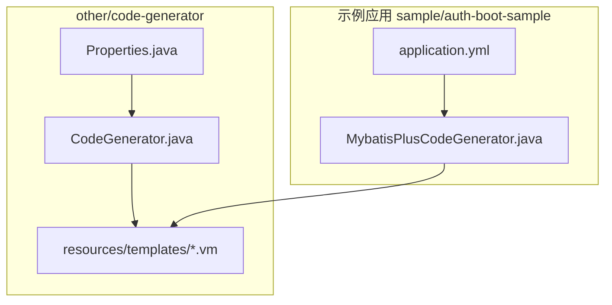
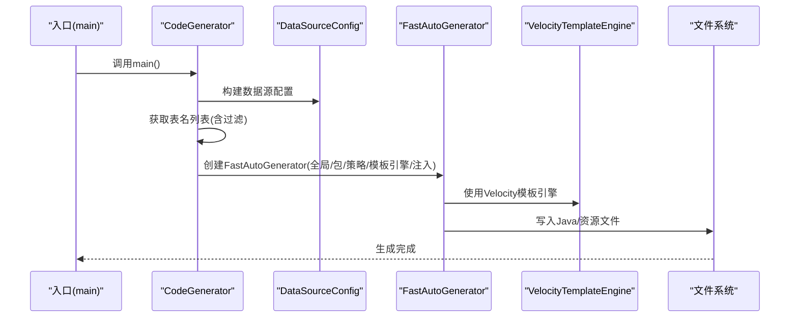
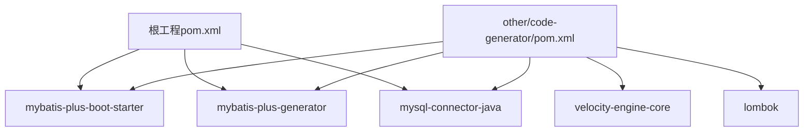

# 代码生成器使用

<cite>
**本文引用的文件**
- [CodeGenerator.java](file://other/code-generator/src/main/java/com/kewen/framework/code/generator/CodeGenerator.java)
- [Properties.java](file://other/code-generator/src/main/java/com/kewen/framework/code/generator/Properties.java)
- [entity.java.vm](file://other/code-generator/src/main/resources/templates/entity.java.vm)
- [controller.java.vm](file://other/code-generator/src/main/resources/templates/controller.java.vm)
- [mapper.java.vm](file://other/code-generator/src/main/resources/templates/mapper.java.vm)
- [mapper.xml.vm](file://other/code-generator/src/main/resources/templates/mapper.xml.vm)
- [service.java.vm](file://other/code-generator/src/main/resources/templates/service.java.vm)
- [serviceImpl.java.vm](file://other/code-generator/src/main/resources/templates/serviceImpl.java.vm)
- [pom.xml（代码生成器模块）](file://other/code-generator/pom.xml)
- [pom.xml（根工程）](file://pom.xml)
- [MybatisPlusCodeGenerator.java](file://sample/auth-boot-sample/src/main/java/com/kewen/framework/auth/sample/MybatisPlusCodeGenerator.java)
- [application.yml（示例应用）](file://sample/auth-boot-sample/src/main/resources/application.yml)
- [MeetingRoomController.java](file://sample/auth-boot-sample/src/main/java/com/kewen/framework/auth/sample/controller/MeetingRoomController.java)
- [MeetingRoom.java](file://sample/auth-boot-sample/src/main/java/com/kewen/framework/auth/sample/mp/entity/MeetingRoom.java)
- [MeetingRoomMpMapper.java](file://sample/auth-boot-sample/src/main/java/com/kewen/framework/auth/sample/mp/mapper/MeetingRoomMpMapper.java)
</cite>

## 目录
1. [简介](#简介)
2. [项目结构](#项目结构)
3. [核心组件](#核心组件)
4. [架构总览](#架构总览)
5. [详细组件分析](#详细组件分析)
6. [依赖分析](#依赖分析)
7. [性能考虑](#性能考虑)
8. [故障排查指南](#故障排查指南)
9. [结论](#结论)
10. [附录](#附录)

## 简介
本指南面向kewen-framework中的代码生成器，系统讲解其工作原理与使用方法，涵盖以下要点：
- MyBatis Plus Generator与Velocity模板引擎的集成方式
- 配置文件设置：数据库连接、包名映射、输出路径、模板注入参数
- 模板文件结构与自定义方法：controller、entity、mapper、mapper.xml、service、serviceImpl
- 完整使用示例：从数据库表结构到最终生成代码的全流程
- 二次开发与扩展：在生成代码基础上添加自定义逻辑与批量生成策略
- 常见问题与性能优化建议

## 项目结构
代码生成器位于other/code-generator模块中，核心由两部分组成：
- 代码生成入口与配置：CodeGenerator.java + Properties.java
- Velocity模板：resources/templates 下的各模板文件

图表来源
- [CodeGenerator.java:1-186](file://other/code-generator/src/main/java/com/kewen/framework/code/generator/CodeGenerator.java#L1-L186)
- [Properties.java:1-55](file://other/code-generator/src/main/java/com/kewen/framework/code/generator/Properties.java#L1-L55)
- [MybatisPlusCodeGenerator.java:1-242](file://sample/auth-boot-sample/src/main/java/com/kewen/framework/auth/sample/MybatisPlusCodeGenerator.java#L1-L242)
- [application.yml（示例应用）:1-55](file://sample/auth-boot-sample/src/main/resources/application.yml#L1-L55)

章节来源
- [CodeGenerator.java:1-186](file://other/code-generator/src/main/java/com/kewen/framework/code/generator/CodeGenerator.java#L1-L186)
- [Properties.java:1-55](file://other/code-generator/src/main/java/com/kewen/framework/code/generator/Properties.java#L1-L55)
- [MybatisPlusCodeGenerator.java:1-242](file://sample/auth-boot-sample/src/main/java/com/kewen/framework/auth/sample/MybatisPlusCodeGenerator.java#L1-L242)
- [application.yml（示例应用）:1-55](file://sample/auth-boot-sample/src/main/resources/application.yml#L1-L55)

## 核心组件
- 代码生成器入口：负责构建FastAutoGenerator、设置全局配置、包结构、策略配置、模板引擎与自定义注入参数，并执行生成。
- 配置类：集中管理数据库连接、基础包名、作者、是否启用Swagger、表前缀过滤、输出绝对路径等。
- 模板引擎：使用VelocityTemplateEngine，模板位于resources/templates目录。

关键点
- 全局配置：作者、输出目录、日期类型、是否启用Swagger
- 包结构：父包+“.mp”，分别映射controller、service、service.impl、entity；mapper XML输出至resources/mapper/mp
- 策略配置：表名包含/排除、实体Builder、Mapper Builder、Service Builder、Controller Builder
- 模板选择：实体、Mapper、Mapper XML、Service、Controller模板路径
- 注入参数：通过injectionConfig向模板注入自定义变量（如排序字段）

章节来源
- [CodeGenerator.java:37-141](file://other/code-generator/src/main/java/com/kewen/framework/code/generator/CodeGenerator.java#L37-L141)
- [Properties.java:26-54](file://other/code-generator/src/main/java/com/kewen/framework/code/generator/Properties.java#L26-L54)

## 架构总览
代码生成器的执行流程如下：

图表来源
- [CodeGenerator.java:37-141](file://other/code-generator/src/main/java/com/kewen/framework/code/generator/CodeGenerator.java#L37-L141)

## 详细组件分析

### 代码生成器入口与配置
- 入口：main()方法负责确定工程路径、构建数据源、获取表名、创建FastAutoGenerator并执行
- 表名获取：解析JDBC URL提取schema，查询information_schema.tables，支持表前缀包含/排除
- 全局配置：作者、输出目录、日期类型、是否启用Swagger
- 包配置：父包+.mp，分别映射controller、service、service.impl、entity；mapper XML输出路径
- 策略配置：开启大写命名、包含表集合、实体Builder（Lombok、链式、字段注解、驼峰命名、主键类型）、Mapper Builder（BaseResultMap/BaseColumnList、命名格式、模板）、Service Builder（接口与实现命名格式、模板）
- 控制器策略：开启REST风格、命名格式、模板
- 模板引擎：使用VelocityTemplateEngine
- 注入参数：向模板注入自定义变量（如排序字段）

章节来源
- [CodeGenerator.java:37-182](file://other/code-generator/src/main/java/com/kewen/framework/code/generator/CodeGenerator.java#L37-L182)
- [Properties.java:26-54](file://other/code-generator/src/main/java/com/kewen/framework/code/generator/Properties.java#L26-L54)

### 配置类（Properties）
- 数据库连接：url、username、password
- 工程绝对路径：absolutePath（为空则自动定位）
- 基础包名：basePackage
- Swagger开关：enableSwagger
- 表前缀过滤：containsTablePrefix（仅生成匹配前缀的表）、ignoreTablePrefix（排除匹配前缀的表）
- 作者：author
- 排序字段注入：orderByDescProperty（用于模板中按字段降序排序）

章节来源
- [Properties.java:26-54](file://other/code-generator/src/main/java/com/kewen/framework/code/generator/Properties.java#L26-L54)

### 模板文件结构与自定义
- 实体模板（entity.java.vm）：生成实体类，支持Lombok、字段注解、主键注解、乐观锁、逻辑删除、toString、常量等
- Mapper接口模板（mapper.java.vm）：生成Mapper接口，继承基类或加@Mapper注解
- Mapper XML模板（mapper.xml.vm）：生成BaseResultMap、BaseColumnList、主键与普通字段映射
- Service接口模板（service.java.vm）：生成Service接口及其实现类，继承基类
- Service实现模板（serviceImpl.java.vm）：生成Service实现类
- 控制器模板（controller.java.vm）：生成REST控制器，包含增删改查、分页、列表、统一返回包装、基于实体字段组装查询条件、按注入字段降序排序

自定义建议
- 在实体模板中增加字段注解或常量定义
- 在Mapper XML模板中定制通用SQL片段
- 在Service模板中引入框架内通用能力（如分页转换、审计字段填充）
- 在Controller模板中扩展鉴权注解、异常处理、日志埋点

章节来源
- [entity.java.vm:1-159](file://other/code-generator/src/main/resources/templates/entity.java.vm#L1-L159)
- [mapper.java.vm:1-27](file://other/code-generator/src/main/resources/templates/mapper.java.vm#L1-L27)
- [mapper.xml.vm:1-40](file://other/code-generator/src/main/resources/templates/mapper.xml.vm#L1-L40)
- [service.java.vm:1-29](file://other/code-generator/src/main/resources/templates/service.java.vm#L1-L29)
- [serviceImpl.java.vm:1-28](file://other/code-generator/src/main/resources/templates/serviceImpl.java.vm#L1-L28)
- [controller.java.vm:1-169](file://other/code-generator/src/main/resources/templates/controller.java.vm#L1-L169)

### 批量代码生成策略与最佳实践
- 表前缀过滤：通过containsTablePrefix与ignoreTablePrefix实现精准批量生成
- 输出路径规划：将实体、Mapper接口、XML、Service、Controller分别置于合理包结构，便于维护
- 模板复用：统一模板风格，减少手改成本
- 二次开发：在生成代码基础上新增方法、拦截器、切面或扩展接口实现，避免直接修改模板

章节来源
- [CodeGenerator.java:171-182](file://other/code-generator/src/main/java/com/kewen/framework/code/generator/CodeGenerator.java#L171-L182)
- [Properties.java:46-47](file://other/code-generator/src/main/java/com/kewen/framework/code/generator/Properties.java#L46-L47)

### 生成代码的二次开发方法
- 在生成的实体类上继续添加业务字段、校验注解、序列化/反序列化注解
- 在Mapper接口中扩展自定义SQL方法，或在XML中补充SQL片段
- 在Service接口与实现中增加业务逻辑、事务控制、缓存策略
- 在Controller中增加鉴权注解、参数校验、异常处理与日志记录
- 通过模板注入参数（如排序字段）在生成阶段即纳入统一规范

章节来源
- [MeetingRoom.java:1-89](file://sample/auth-boot-sample/src/main/java/com/kewen/framework/auth/sample/mp/entity/MeetingRoom.java#L1-L89)
- [MeetingRoomMpMapper.java:1-19](file://sample/auth-boot-sample/src/main/java/com/kewen/framework/auth/sample/mp/mapper/MeetingRoomMpMapper.java#L1-L19)
- [MeetingRoomController.java:1-101](file://sample/auth-boot-sample/src/main/java/com/kewen/framework/auth/sample/controller/MeetingRoomController.java#L1-L101)

### 完整使用示例（从数据库表到生成代码）
- 准备数据库表：例如meeting_room
- 配置Properties或示例中的Config（数据库连接、基础包名、表前缀过滤、作者等）
- 运行入口：调用CodeGenerator.main()或Properties.main()（若作为独立模块）
- 生成产物：实体、Mapper接口、Mapper XML、Service接口与实现、Controller
- 示例验证：参考示例应用中生成的MeetingRoom相关文件，确认包结构、命名、注解与REST风格

章节来源
- [CodeGenerator.java:37-60](file://other/code-generator/src/main/java/com/kewen/framework/code/generator/CodeGenerator.java#L37-L60)
- [MybatisPlusCodeGenerator.java:66-90](file://sample/auth-boot-sample/src/main/java/com/kewen/framework/auth/sample/MybatisPlusCodeGenerator.java#L66-L90)
- [MeetingRoom.java:1-89](file://sample/auth-boot-sample/src/main/java/com/kewen/framework/auth/sample/mp/entity/MeetingRoom.java#L1-L89)
- [MeetingRoomMpMapper.java:1-19](file://sample/auth-boot-sample/src/main/java/com/kewen/framework/auth/sample/mp/mapper/MeetingRoomMpMapper.java#L1-L19)
- [MeetingRoomController.java:1-101](file://sample/auth-boot-sample/src/main/java/com/kewen/framework/auth/sample/controller/MeetingRoomController.java#L1-L101)

## 依赖分析
- 代码生成器模块依赖MyBatis Plus Starter与Generator、Velocity引擎、MySQL驱动、Lombok
- 根工程统一管理MyBatis Plus版本与依赖，确保与生成器一致

图表来源
- [pom.xml（代码生成器模块）:14-37](file://other/code-generator/pom.xml#L14-L37)
- [pom.xml（根工程）:132-146](file://pom.xml#L132-L146)

章节来源
- [pom.xml（代码生成器模块）:14-37](file://other/code-generator/pom.xml#L14-L37)
- [pom.xml（根工程）:132-146](file://pom.xml#L132-L146)

## 性能考虑
- 表扫描与过滤：优先通过表前缀过滤减少生成范围，避免全库扫描
- 模板复杂度：尽量保持模板简洁，避免过多嵌套与重复逻辑
- 输出目录：确保输出路径存在且权限充足，避免IO阻塞
- 依赖版本：与根工程保持一致，减少冲突与重复加载

## 故障排查指南
- 无法连接数据库
  - 检查Properties中的url、username、password
  - 确认网络与防火墙允许访问
- 未查询到表
  - 检查containsTablePrefix与ignoreTablePrefix配置
  - 确认schema解析正确（URL中?之前的schema）
- 生成文件覆盖问题
  - 确认策略中已启用enableFileOverride
- Swagger未生效
  - 确认enableSwagger为true，且模板中使用了swagger相关指令
- 输出路径错误
  - 确认absolutePath或默认路径解析正确

章节来源
- [CodeGenerator.java:150-182](file://other/code-generator/src/main/java/com/kewen/framework/code/generator/CodeGenerator.java#L150-L182)
- [Properties.java:33](file://other/code-generator/src/main/java/com/kewen/framework/code/generator/Properties.java#L33)

## 结论
kewen-framework的代码生成器以MyBatis Plus Generator为核心，结合Velocity模板引擎，提供了高度可配置、可扩展的代码生成方案。通过合理的配置与模板定制，可在短时间内产出符合团队规范的完整代码骨架，并在此基础上进行二次开发与扩展。

## 附录

### 配置项一览
- 数据库连接：url、username、password
- 工程路径：absolutePath（可选）
- 基础包名：basePackage
- Swagger开关：enableSwagger
- 表前缀过滤：containsTablePrefix、ignoreTablePrefix
- 作者：author
- 排序字段注入：orderByDescProperty

章节来源
- [Properties.java:26-54](file://other/code-generator/src/main/java/com/kewen/framework/code/generator/Properties.java#L26-L54)

### 模板变量参考（摘自模板）
- 实体模板：包名、导入包、Swagger注解、Lombok注解、字段注解、主键注解、乐观锁、逻辑删除、toString、常量等
- Mapper模板：包名、接口继承、@Mapper注解
- Mapper XML模板：BaseResultMap、BaseColumnList、主键与普通字段映射
- Service模板：包名、接口与实现继承
- Controller模板：包名、REST注解、增删改查、分页、列表、统一返回、查询条件组装、按注入字段降序排序

章节来源
- [entity.java.vm:1-159](file://other/code-generator/src/main/resources/templates/entity.java.vm#L1-L159)
- [mapper.java.vm:1-27](file://other/code-generator/src/main/resources/templates/mapper.java.vm#L1-L27)
- [mapper.xml.vm:1-40](file://other/code-generator/src/main/resources/templates/mapper.xml.vm#L1-L40)
- [service.java.vm:1-29](file://other/code-generator/src/main/resources/templates/service.java.vm#L1-L29)
- [serviceImpl.java.vm:1-28](file://other/code-generator/src/main/resources/templates/serviceImpl.java.vm#L1-L28)
- [controller.java.vm:1-169](file://other/code-generator/src/main/resources/templates/controller.java.vm#L1-L169)