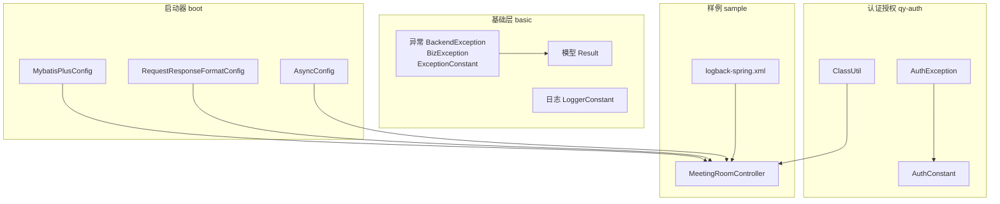
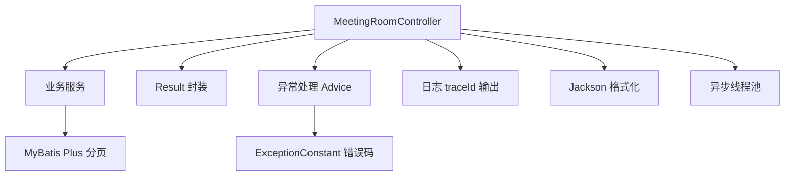
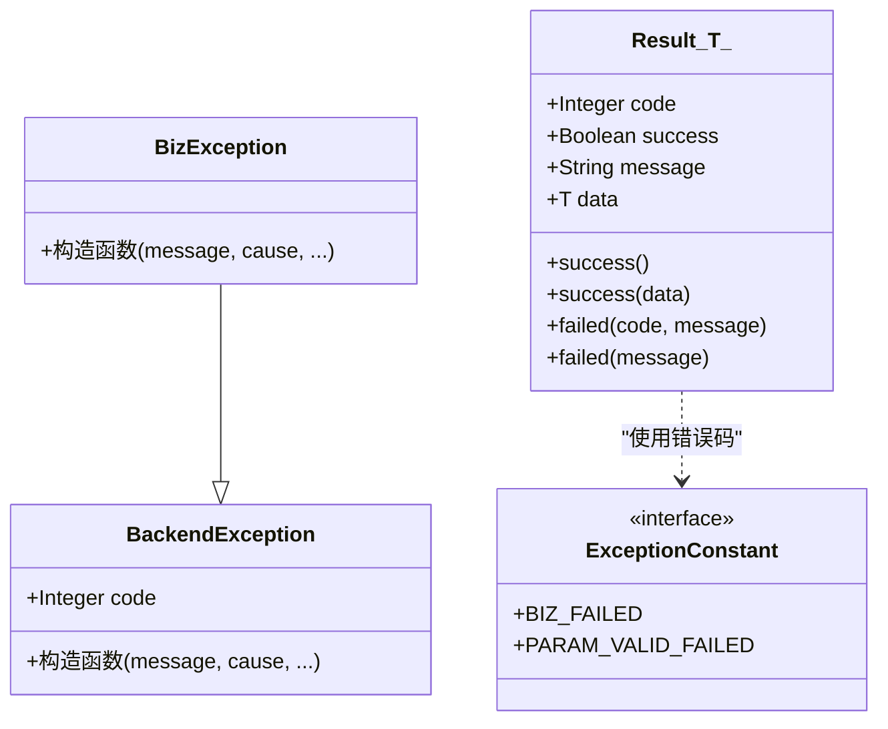
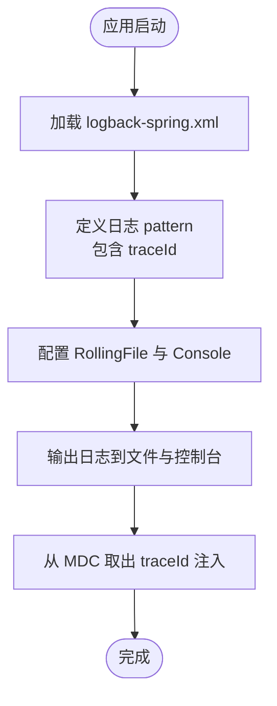
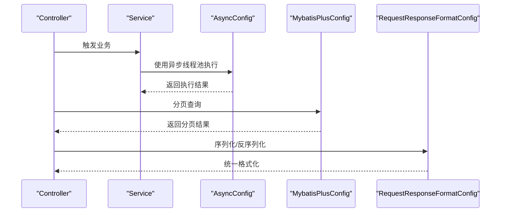
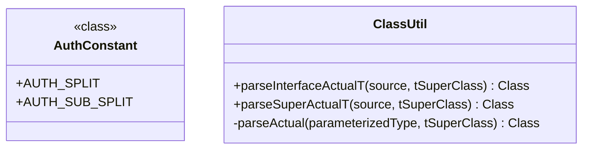
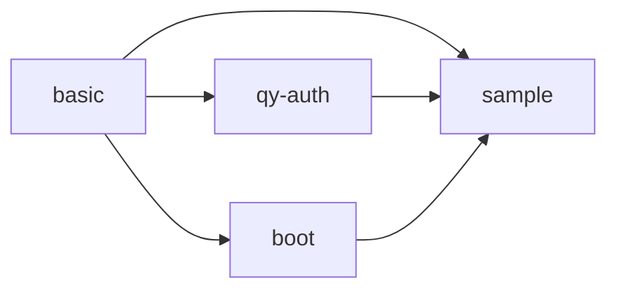

# 代码规范与约定

<cite>
**本文引用的文件**
- [basic/src/main/java/com/kewen/framework/basic/exception/BackendException.java](file://basic/src/main/java/com/kewen/framework/basic/exception/BackendException.java)
- [basic/src/main/java/com/kewen/framework/basic/exception/BizException.java](file://basic/src/main/java/com/kewen/framework/basic/exception/BizException.java)
- [basic/src/main/java/com/kewen/framework/basic/exception/ExceptionConstant.java](file://basic/src/main/java/com/kewen/framework/basic/exception/ExceptionConstant.java)
- [basic/src/main/java/com/kewen/framework/basic/logger/LoggerConstant.java](file://basic/src/main/java/com/kewen/framework/basic/logger/LoggerConstant.java)
- [basic/src/main/java/com/kewen/framework/basic/model/Result.java](file://basic/src/main/java/com/kewen/framework/basic/model/Result.java)
- [boot/basic-spring-boot-starter/src/main/java/com/kewen/framework/boot/basic/config/AsyncConfig.java](file://boot/basic-spring-boot-starter/src/main/java/com/kewen/framework/boot/basic/config/AsyncConfig.java)
- [boot/basic-spring-boot-starter/src/main/java/com/kewen/framework/boot/basic/config/MybatisPlusConfig.java](file://boot/basic-spring-boot-starter/src/main/java/com/kewen/framework/boot/basic/config/MybatisPlusConfig.java)
- [boot/basic-spring-boot-starter/src/main/java/com/kewen/framework/boot/basic/config/RequestResponseFormatConfig.java](file://boot/basic-spring-boot-starter/src/main/java/com/kewen/framework/boot/basic/config/RequestResponseFormatConfig.java)
- [qy-auth/auth-core/src/main/java/com/kewen/framework/auth/core/entity/AuthConstant.java](file://qy-auth/auth-core/src/main/java/com/kewen/framework/auth/core/entity/AuthConstant.java)
- [qy-auth/auth-core/src/main/java/com/kewen/framework/auth/core/exception/AuthException.java](file://qy-auth/auth-core/src/main/java/com/kewen/framework/auth/core/exception/AuthException.java)
- [qy-auth/auth-core/src/main/java/com/kewen/framework/auth/core/util/ClassUtil.java](file://qy-auth/auth-core/src/main/java/com/kewen/framework/auth/core/util/ClassUtil.java)
- [sample/auth-boot-sample/src/main/java/com/kewen/framework/auth/sample/controller/MeetingRoomController.java](file://sample/auth-boot-sample/src/main/java/com/kewen/framework/auth/sample/controller/MeetingRoomController.java)
- [sample/auth-boot-sample/src/main/resources/logback-spring.xml](file://sample/auth-boot-sample/src/main/resources/logback-spring.xml)
- [sample/idaas-sp-boot-sample/src/main/resources/logback-spring.xml](file://sample/idaas-sp-boot-sample/src/main/resources/logback-spring.xml)
- [sample/basic-boot-sample/src/main/resources/logback-spring.xml](file://sample/basic-boot-sample/src/main/resources/logback-spring.xml)
- [other/code-generator/src/main/resources/templates/entity.java.vm](file://other/code-generator/src/main/resources/templates/entity.java.vm)
</cite>

## 目录
1. [引言](#引言)
2. [项目结构](#项目结构)
3. [核心组件](#核心组件)
4. [架构总览](#架构总览)
5. [详细组件分析](#详细组件分析)
6. [依赖分析](#依赖分析)
7. [性能考虑](#性能考虑)
8. [故障排查指南](#故障排查指南)
9. [结论](#结论)
10. [附录](#附录)

## 引言
本规范旨在统一 kewen-framework 的 Java 编码风格与工程实践，覆盖命名约定、包结构、模块依赖、注释规范、Lombok 使用、异常与日志处理、以及代码审查与质量检查标准。规范以仓库现有实现为依据，结合最佳实践形成可落地的指导。

## 项目结构
- 包命名采用分层与功能域结合的方式：基础能力 basic、认证授权 qy-auth、启动器 boot、样例 sample、其他 other 等。
- 模块间通过 starter 自动装配与接口契约进行解耦；基础层提供通用异常、结果封装、日志追踪与工具类；认证授权模块提供权限常量、异常与工具；启动器模块提供自动配置与拦截器；样例模块演示集成与使用。

图示来源
- [basic/src/main/java/com/kewen/framework/basic/exception/BackendException.java:1-31](file://basic/src/main/java/com/kewen/framework/basic/exception/BackendException.java#L1-L31)
- [basic/src/main/java/com/kewen/framework/basic/exception/BizException.java:1-28](file://basic/src/main/java/com/kewen/framework/basic/exception/BizException.java#L1-L28)
- [basic/src/main/java/com/kewen/framework/basic/exception/ExceptionConstant.java:1-14](file://basic/src/main/java/com/kewen/framework/basic/exception/ExceptionConstant.java#L1-L14)
- [basic/src/main/java/com/kewen/framework/basic/model/Result.java:1-49](file://basic/src/main/java/com/kewen/framework/basic/model/Result.java#L1-L49)
- [basic/src/main/java/com/kewen/framework/basic/logger/LoggerConstant.java:1-11](file://basic/src/main/java/com/kewen/framework/basic/logger/LoggerConstant.java#L1-L11)
- [qy-auth/auth-core/src/main/java/com/kewen/framework/auth/core/exception/AuthException.java:1-24](file://qy-auth/auth-core/src/main/java/com/kewen/framework/auth/core/exception/AuthException.java#L1-L24)
- [qy-auth/auth-core/src/main/java/com/kewen/framework/auth/core/entity/AuthConstant.java:1-17](file://qy-auth/auth-core/src/main/java/com/kewen/framework/auth/core/entity/AuthConstant.java#L1-L17)
- [qy-auth/auth-core/src/main/java/com/kewen/framework/auth/core/util/ClassUtil.java:1-97](file://qy-auth/auth-core/src/main/java/com/kewen/framework/auth/core/util/ClassUtil.java#L1-L97)
- [boot/basic-spring-boot-starter/src/main/java/com/kewen/framework/boot/basic/config/MybatisPlusConfig.java:1-24](file://boot/basic-spring-boot-starter/src/main/java/com/kewen/framework/boot/basic/config/MybatisPlusConfig.java#L1-L24)
- [boot/basic-spring-boot-starter/src/main/java/com/kewen/framework/boot/basic/config/RequestResponseFormatConfig.java:1-111](file://boot/basic-spring-boot-starter/src/main/java/com/kewen/framework/boot/basic/config/RequestResponseFormatConfig.java#L1-L111)
- [boot/basic-spring-boot-starter/src/main/java/com/kewen/framework/boot/basic/config/AsyncConfig.java:1-60](file://boot/basic-spring-boot-starter/src/main/java/com/kewen/framework/boot/basic/config/AsyncConfig.java#L1-L60)
- [sample/auth-boot-sample/src/main/java/com/kewen/framework/auth/sample/controller/MeetingRoomController.java:1-101](file://sample/auth-boot-sample/src/main/java/com/kewen/framework/auth/sample/controller/MeetingRoomController.java#L1-L101)
- [sample/auth-boot-sample/src/main/resources/logback-spring.xml:1-36](file://sample/auth-boot-sample/src/main/resources/logback-spring.xml#L1-L36)
- [sample/idaas-sp-boot-sample/src/main/resources/logback-spring.xml:1-36](file://sample/idaas-sp-boot-sample/src/main/resources/logback-spring.xml#L1-L36)
- [sample/basic-boot-sample/src/main/resources/logback-spring.xml:1-30](file://sample/basic-boot-sample/src/main/resources/logback-spring.xml#L1-L30)

章节来源
- [basic/src/main/java/com/kewen/framework/basic/exception/BackendException.java:1-31](file://basic/src/main/java/com/kewen/framework/basic/exception/BackendException.java#L1-L31)
- [basic/src/main/java/com/kewen/framework/basic/model/Result.java:1-49](file://basic/src/main/java/com/kewen/framework/basic/model/Result.java#L1-L49)
- [boot/basic-spring-boot-starter/src/main/java/com/kewen/framework/boot/basic/config/MybatisPlusConfig.java:1-24](file://boot/basic-spring-boot-starter/src/main/java/com/kewen/framework/boot/basic/config/MybatisPlusConfig.java#L1-L24)
- [boot/basic-spring-boot-starter/src/main/java/com/kewen/framework/boot/basic/config/RequestResponseFormatConfig.java:1-111](file://boot/basic-spring-boot-starter/src/main/java/com/kewen/framework/boot/basic/config/RequestResponseFormatConfig.java#L1-L111)
- [boot/basic-spring-boot-starter/src/main/java/com/kewen/framework/boot/basic/config/AsyncConfig.java:1-60](file://boot/basic-spring-boot-starter/src/main/java/com/kewen/framework/boot/basic/config/AsyncConfig.java#L1-L60)
- [qy-auth/auth-core/src/main/java/com/kewen/framework/auth/core/exception/AuthException.java:1-24](file://qy-auth/auth-core/src/main/java/com/kewen/framework/auth/core/exception/AuthException.java#L1-L24)
- [qy-auth/auth-core/src/main/java/com/kewen/framework/auth/core/entity/AuthConstant.java:1-17](file://qy-auth/auth-core/src/main/java/com/kewen/framework/auth/core/entity/AuthConstant.java#L1-L17)
- [qy-auth/auth-core/src/main/java/com/kewen/framework/auth/core/util/ClassUtil.java:1-97](file://qy-auth/auth-core/src/main/java/com/kewen/framework/auth/core/util/ClassUtil.java#L1-L97)
- [sample/auth-boot-sample/src/main/java/com/kewen/framework/auth/sample/controller/MeetingRoomController.java:1-101](file://sample/auth-boot-sample/src/main/java/com/kewen/framework/auth/sample/controller/MeetingRoomController.java#L1-L101)

## 核心组件
- 统一结果封装：Result<T> 提供成功/失败的统一封装，包含状态码、消息与数据体，并提供静态工厂方法。
- 统一异常体系：BackendException 作为基础运行时异常，BizException 作为业务异常，两者均支持多构造函数与链式异常。
- 异常常量：ExceptionConstant 定义业务与参数校验失败的统一错误码。
- 认证常量：AuthConstant 定义权限分隔符等常量，便于权限标识与解析的一致性。
- 日志上下文：LoggerConstant 定义 traceId 键名，配合日志配置输出分布式追踪标识。

章节来源
- [basic/src/main/java/com/kewen/framework/basic/model/Result.java:1-49](file://basic/src/main/java/com/kewen/framework/basic/model/Result.java#L1-L49)
- [basic/src/main/java/com/kewen/framework/basic/exception/BackendException.java:1-31](file://basic/src/main/java/com/kewen/framework/basic/exception/BackendException.java#L1-L31)
- [basic/src/main/java/com/kewen/framework/basic/exception/BizException.java:1-28](file://basic/src/main/java/com/kewen/framework/basic/exception/BizException.java#L1-L28)
- [basic/src/main/java/com/kewen/framework/basic/exception/ExceptionConstant.java:1-14](file://basic/src/main/java/com/kewen/framework/basic/exception/ExceptionConstant.java#L1-L14)
- [qy-auth/auth-core/src/main/java/com/kewen/framework/auth/core/entity/AuthConstant.java:1-17](file://qy-auth/auth-core/src/main/java/com/kewen/framework/auth/core/entity/AuthConstant.java#L1-L17)
- [basic/src/main/java/com/kewen/framework/basic/logger/LoggerConstant.java:1-11](file://basic/src/main/java/com/kewen/framework/basic/logger/LoggerConstant.java#L1-L11)

## 架构总览
- 分层与职责
  - 基础层：提供通用异常、结果封装、日志追踪、工具类。
  - 认证授权层：提供权限常量、异常与工具，支撑 RBAC 与数据范围控制。
  - 启动器层：提供自动配置（分页、请求响应格式、异步线程池），简化接入。
  - 样例层：展示控制器、服务与配置的组合使用。
- 关键交互
  - 控制器通过 Result 统一返回。
  - 异常通过统一 Advice 处理，结合异常常量返回一致的错误结构。
  - 日志通过 logback-spring.xml 输出 traceId，便于链路追踪。

图示来源
- [sample/auth-boot-sample/src/main/java/com/kewen/framework/auth/sample/controller/MeetingRoomController.java:1-101](file://sample/auth-boot-sample/src/main/java/com/kewen/framework/auth/sample/controller/MeetingRoomController.java#L1-L101)
- [basic/src/main/java/com/kewen/framework/basic/model/Result.java:1-49](file://basic/src/main/java/com/kewen/framework/basic/model/Result.java#L1-L49)
- [basic/src/main/java/com/kewen/framework/basic/exception/ExceptionConstant.java:1-14](file://basic/src/main/java/com/kewen/framework/basic/exception/ExceptionConstant.java#L1-L14)
- [boot/basic-spring-boot-starter/src/main/java/com/kewen/framework/boot/basic/config/MybatisPlusConfig.java:1-24](file://boot/basic-spring-boot-starter/src/main/java/com/kewen/framework/boot/basic/config/MybatisPlusConfig.java#L1-L24)
- [boot/basic-spring-boot-starter/src/main/java/com/kewen/framework/boot/basic/config/RequestResponseFormatConfig.java:1-111](file://boot/basic-spring-boot-starter/src/main/java/com/kewen/framework/boot/basic/config/RequestResponseFormatConfig.java#L1-L111)
- [boot/basic-spring-boot-starter/src/main/java/com/kewen/framework/boot/basic/config/AsyncConfig.java:1-60](file://boot/basic-spring-boot-starter/src/main/java/com/kewen/framework/boot/basic/config/AsyncConfig.java#L1-L60)
- [sample/auth-boot-sample/src/main/resources/logback-spring.xml:1-36](file://sample/auth-boot-sample/src/main/resources/logback-spring.xml#L1-L36)

## 详细组件分析

### 组件一：异常与结果封装
- 设计要点
  - BackendException 与 BizException 提供一致的异常层次，便于区分系统级与业务级错误。
  - Result<T> 提供静态工厂方法，确保返回结构统一，减少重复样板代码。
  - ExceptionConstant 定义错误码常量，避免魔法数与分散定义。
- 最佳实践
  - 抛出异常时优先使用 BizException 表达业务失败；系统内部错误使用 BackendException。
  - 控制器与服务层统一通过 Result.success()/failed() 返回，避免直接返回原始对象或异常。
  - 错误码与消息应与 ExceptionConstant 对齐，便于前端与监控统一处理。

图示来源
- [basic/src/main/java/com/kewen/framework/basic/exception/BackendException.java:1-31](file://basic/src/main/java/com/kewen/framework/basic/exception/BackendException.java#L1-L31)
- [basic/src/main/java/com/kewen/framework/basic/exception/BizException.java:1-28](file://basic/src/main/java/com/kewen/framework/basic/exception/BizException.java#L1-L28)
- [basic/src/main/java/com/kewen/framework/basic/model/Result.java:1-49](file://basic/src/main/java/com/kewen/framework/basic/model/Result.java#L1-L49)
- [basic/src/main/java/com/kewen/framework/basic/exception/ExceptionConstant.java:1-14](file://basic/src/main/java/com/kewen/framework/basic/exception/ExceptionConstant.java#L1-L14)

章节来源
- [basic/src/main/java/com/kewen/framework/basic/exception/BackendException.java:1-31](file://basic/src/main/java/com/kewen/framework/basic/exception/BackendException.java#L1-L31)
- [basic/src/main/java/com/kewen/framework/basic/exception/BizException.java:1-28](file://basic/src/main/java/com/kewen/framework/basic/exception/BizException.java#L1-L28)
- [basic/src/main/java/com/kewen/framework/basic/model/Result.java:1-49](file://basic/src/main/java/com/kewen/framework/basic/model/Result.java#L1-L49)
- [basic/src/main/java/com/kewen/framework/basic/exception/ExceptionConstant.java:1-14](file://basic/src/main/java/com/kewen/framework/basic/exception/ExceptionConstant.java#L1-L14)

### 组件二：日志与追踪
- 设计要点
  - LoggerConstant 定义 traceId 键名，保证跨模块一致。
  - logback-spring.xml 配置 RollingFileAppender 与 Console 输出，统一 pattern 包含 traceId。
- 最佳实践
  - 所有业务日志输出包含 traceId，便于链路追踪。
  - 日志级别按环境配置，开发环境 INFO，生产环境可提升到 WARN 或更高。
  - 避免在日志中输出敏感信息（密码、身份证等）。

图示来源
- [basic/src/main/java/com/kewen/framework/basic/logger/LoggerConstant.java:1-11](file://basic/src/main/java/com/kewen/framework/basic/logger/LoggerConstant.java#L1-L11)
- [sample/auth-boot-sample/src/main/resources/logback-spring.xml:1-36](file://sample/auth-boot-sample/src/main/resources/logback-spring.xml#L1-L36)
- [sample/idaas-sp-boot-sample/src/main/resources/logback-spring.xml:1-36](file://sample/idaas-sp-boot-sample/src/main/resources/logback-spring.xml#L1-L36)
- [sample/basic-boot-sample/src/main/resources/logback-spring.xml:1-30](file://sample/basic-boot-sample/src/main/resources/logback-spring.xml#L1-L30)

章节来源
- [basic/src/main/java/com/kewen/framework/basic/logger/LoggerConstant.java:1-11](file://basic/src/main/java/com/kewen/framework/basic/logger/LoggerConstant.java#L1-L11)
- [sample/auth-boot-sample/src/main/resources/logback-spring.xml:1-36](file://sample/auth-boot-sample/src/main/resources/logback-spring.xml#L1-L36)
- [sample/idaas-sp-boot-sample/src/main/resources/logback-spring.xml:1-36](file://sample/idaas-sp-boot-sample/src/main/resources/logback-spring.xml#L1-L36)
- [sample/basic-boot-sample/src/main/resources/logback-spring.xml:1-30](file://sample/basic-boot-sample/src/main/resources/logback-spring.xml#L1-L30)

### 组件三：自动配置与线程池
- 设计要点
  - AsyncConfig 提供统一的线程池配置与异步异常处理器。
  - MybatisPlusConfig 提供分页插件配置。
  - RequestResponseFormatConfig 提供 Jackson 序列化与日期转换器。
- 最佳实践
  - @Async 方法统一使用配置的线程池，避免使用默认单线程。
  - 分页查询统一使用 MyBatis Plus 分页插件，避免手写 limit。
  - 日期参数解析统一使用配置的 Converter，避免手动 parse。

图示来源
- [boot/basic-spring-boot-starter/src/main/java/com/kewen/framework/boot/basic/config/AsyncConfig.java:1-60](file://boot/basic-spring-boot-starter/src/main/java/com/kewen/framework/boot/basic/config/AsyncConfig.java#L1-L60)
- [boot/basic-spring-boot-starter/src/main/java/com/kewen/framework/boot/basic/config/MybatisPlusConfig.java:1-24](file://boot/basic-spring-boot-starter/src/main/java/com/kewen/framework/boot/basic/config/MybatisPlusConfig.java#L1-L24)
- [boot/basic-spring-boot-starter/src/main/java/com/kewen/framework/boot/basic/config/RequestResponseFormatConfig.java:1-111](file://boot/basic-spring-boot-starter/src/main/java/com/kewen/framework/boot/basic/config/RequestResponseFormatConfig.java#L1-L111)

章节来源
- [boot/basic-spring-boot-starter/src/main/java/com/kewen/framework/boot/basic/config/AsyncConfig.java:1-60](file://boot/basic-spring-boot-starter/src/main/java/com/kewen/framework/boot/basic/config/AsyncConfig.java#L1-L60)
- [boot/basic-spring-boot-starter/src/main/java/com/kewen/framework/boot/basic/config/MybatisPlusConfig.java:1-24](file://boot/basic-spring-boot-starter/src/main/java/com/kewen/framework/boot/basic/config/MybatisPlusConfig.java#L1-L24)
- [boot/basic-spring-boot-starter/src/main/java/com/kewen/framework/boot/basic/config/RequestResponseFormatConfig.java:1-111](file://boot/basic-spring-boot-starter/src/main/java/com/kewen/framework/boot/basic/config/RequestResponseFormatConfig.java#L1-L111)

### 组件四：认证常量与工具
- 设计要点
  - AuthConstant 定义权限分隔符，保证权限字符串的稳定解析。
  - ClassUtil 提供泛型实际类型解析工具，支持接口与父类泛型提取。
- 最佳实践
  - 权限标识统一使用 AuthConstant 中的分隔符，避免硬编码。
  - 泛型类型解析优先使用 ClassUtil，减少反射样板代码。

图示来源
- [qy-auth/auth-core/src/main/java/com/kewen/framework/auth/core/entity/AuthConstant.java:1-17](file://qy-auth/auth-core/src/main/java/com/kewen/framework/auth/core/entity/AuthConstant.java#L1-L17)
- [qy-auth/auth-core/src/main/java/com/kewen/framework/auth/core/util/ClassUtil.java:1-97](file://qy-auth/auth-core/src/main/java/com/kewen/framework/auth/core/util/ClassUtil.java#L1-L97)

章节来源
- [qy-auth/auth-core/src/main/java/com/kewen/framework/auth/core/entity/AuthConstant.java:1-17](file://qy-auth/auth-core/src/main/java/com/kewen/framework/auth/core/entity/AuthConstant.java#L1-L17)
- [qy-auth/auth-core/src/main/java/com/kewen/framework/auth/core/util/ClassUtil.java:1-97](file://qy-auth/auth-core/src/main/java/com/kewen/framework/auth/core/util/ClassUtil.java#L1-L97)

### 组件五：样例控制器与注释规范
- 设计要点
  - MeetingRoomController 展示了注解使用（@AuthDataOperation、@AuthDataRange）、事务与日志记录。
  - 控制器注释包含作者、时间与功能描述，符合团队注释规范。
- 最佳实践
  - 类注释与方法注释保持一致性，描述职责、参数、返回与异常。
  - 常量使用全大写下划线命名，方法与变量使用驼峰命名。

章节来源
- [sample/auth-boot-sample/src/main/java/com/kewen/framework/auth/sample/controller/MeetingRoomController.java:1-101](file://sample/auth-boot-sample/src/main/java/com/kewen/framework/auth/sample/controller/MeetingRoomController.java#L1-L101)

## 依赖分析
- 模块内聚与解耦
  - 基础层对上层提供稳定的异常与结果封装，降低上层实现复杂度。
  - 启动器层通过自动配置屏蔽第三方组件差异，提升复用性。
  - 认证授权层通过常量与工具类提供统一的权限处理入口。
- 外部依赖
  - Jackson 用于请求响应格式化。
  - MyBatis Plus 用于分页与持久化。
  - Logback 用于日志输出。

图示来源
- [boot/basic-spring-boot-starter/src/main/java/com/kewen/framework/boot/basic/config/RequestResponseFormatConfig.java:1-111](file://boot/basic-spring-boot-starter/src/main/java/com/kewen/framework/boot/basic/config/RequestResponseFormatConfig.java#L1-L111)
- [boot/basic-spring-boot-starter/src/main/java/com/kewen/framework/boot/basic/config/MybatisPlusConfig.java:1-24](file://boot/basic-spring-boot-starter/src/main/java/com/kewen/framework/boot/basic/config/MybatisPlusConfig.java#L1-L24)
- [sample/auth-boot-sample/src/main/java/com/kewen/framework/auth/sample/controller/MeetingRoomController.java:1-101](file://sample/auth-boot-sample/src/main/java/com/kewen/framework/auth/sample/controller/MeetingRoomController.java#L1-L101)

章节来源
- [boot/basic-spring-boot-starter/src/main/java/com/kewen/framework/boot/basic/config/RequestResponseFormatConfig.java:1-111](file://boot/basic-spring-boot-starter/src/main/java/com/kewen/framework/boot/basic/config/RequestResponseFormatConfig.java#L1-L111)
- [boot/basic-spring-boot-starter/src/main/java/com/kewen/framework/boot/basic/config/MybatisPlusConfig.java:1-24](file://boot/basic-spring-boot-starter/src/main/java/com/kewen/framework/boot/basic/config/MybatisPlusConfig.java#L1-L24)
- [sample/auth-boot-sample/src/main/java/com/kewen/framework/auth/sample/controller/MeetingRoomController.java:1-101](file://sample/auth-boot-sample/src/main/java/com/kewen/framework/auth/sample/controller/MeetingRoomController.java#L1-L101)

## 性能考虑
- 线程池配置
  - AsyncConfig 已提供合理的线程池参数，建议根据业务并发与 CPU 核心数调整核心线程与队列容量。
- 序列化与反序列化
  - RequestResponseFormatConfig 统一日期格式，避免频繁转换带来的开销。
- 分页性能
  - MybatisPlusConfig 使用分页插件，建议结合索引与 LIMIT 优化查询性能。

## 故障排查指南
- 异常处理
  - 使用 BizException 表达业务失败，使用 BackendException 表达系统异常。
  - 错误码与消息统一来源于 ExceptionConstant，便于前端与监控识别。
- 日志追踪
  - 确认 logback-spring.xml 中 traceId 键名与 LoggerConstant 一致。
  - 在 MDC 中设置/清理 traceId，确保每条请求链路唯一。
- 线程池问题
  - 如出现任务堆积，检查队列容量与拒绝策略；必要时增加核心线程数或调整拒绝策略。

章节来源
- [basic/src/main/java/com/kewen/framework/basic/exception/ExceptionConstant.java:1-14](file://basic/src/main/java/com/kewen/framework/basic/exception/ExceptionConstant.java#L1-L14)
- [basic/src/main/java/com/kewen/framework/basic/logger/LoggerConstant.java:1-11](file://basic/src/main/java/com/kewen/framework/basic/logger/LoggerConstant.java#L1-L11)
- [boot/basic-spring-boot-starter/src/main/java/com/kewen/framework/boot/basic/config/AsyncConfig.java:1-60](file://boot/basic-spring-boot-starter/src/main/java/com/kewen/framework/boot/basic/config/AsyncConfig.java#L1-L60)

## 结论
本规范基于仓库现有实现提炼出统一的编码与工程实践，涵盖命名、注释、异常与日志、自动配置与线程池、认证常量与工具等方面。建议在后续开发中严格遵循，持续完善与演进。

## 附录

### A. Java 编码规范
- 命名约定
  - 类名：PascalCase（如 BackendException）
  - 变量与方法：camelCase（如 exceptionConstant）
  - 常量：UPPER_SNAKE_CASE（如 BIZ_FAILED）
- 缩进与格式化
  - 统一使用 4 空格缩进，大括号独占一行。
  - 方法之间保留空行，逻辑块内适当空行分隔。
- 注释规范
  - 类注释：包含作者、时间、简要描述。
  - 方法注释：描述用途、参数、返回值、异常。
  - 字段注释：简述用途与取值约束。
- Lombok 使用规范
  - @Data：仅用于纯数据载体类，避免过度封装业务逻辑。
  - @Builder：用于复杂对象构建，提供清晰的构建流程。
  - @AllArgsConstructor：仅在必要时使用，优先考虑 @NoArgsConstructor + setter。
  - 避免在实体类上滥用 Lombok，确保可读性与调试友好性。
- 异常处理规范
  - 业务失败使用 BizException，系统异常使用 BackendException。
  - 统一通过 Result 封装返回，错误码与消息来自 ExceptionConstant。
- 日志记录规范
  - 使用 LoggerConstant 中的键名输出 traceId。
  - 日志级别按环境配置，避免在生产环境输出过多 DEBUG。
- 代码审查清单
  - 是否遵循命名与注释规范
  - 是否使用统一异常与结果封装
  - 是否正确使用 Lombok 且不影响可读性
  - 是否存在魔法数与硬编码
  - 是否有必要的单元测试覆盖

章节来源
- [basic/src/main/java/com/kewen/framework/basic/exception/ExceptionConstant.java:1-14](file://basic/src/main/java/com/kewen/framework/basic/exception/ExceptionConstant.java#L1-L14)
- [basic/src/main/java/com/kewen/framework/basic/logger/LoggerConstant.java:1-11](file://basic/src/main/java/com/kewen/framework/basic/logger/LoggerConstant.java#L1-L11)
- [other/code-generator/src/main/resources/templates/entity.java.vm:54-101](file://other/code-generator/src/main/resources/templates/entity.java.vm#L54-L101)
- [other/code-generator/src/main/resources/templates/entity.java.vm:84-158](file://other/code-generator/src/main/resources/templates/entity.java.vm#L84-L158)