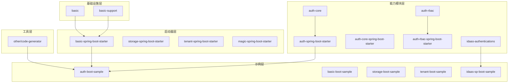
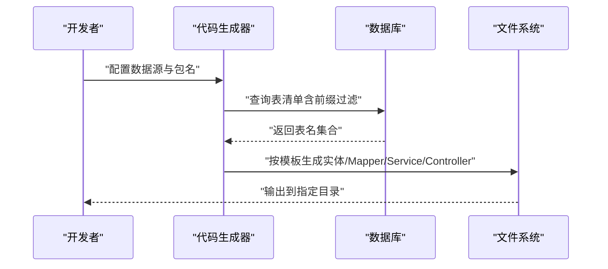
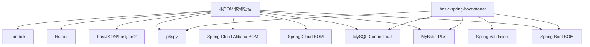

# 开发指南

<cite>
**本文引用的文件**
- [根POM（pom.xml）](file://pom.xml)
- [应用配置（application.yml）](file://application.yml)
- [基础启动器POM（boot/basic-spring-boot-starter/pom.xml）](file://boot/basic-spring-boot-starter/pom.xml)
- [认证样例POM（sample/auth-boot-sample/pom.xml）](file://sample/auth-boot-sample/pom.xml)
- [认证核心模块POM（qy-auth/auth-core/pom.xml）](file://qy-auth/auth-core/pom.xml)
- [认证样例应用配置（sample/auth-boot-sample/src/main/resources/application.yml）](file://sample/auth-boot-sample/src/main/resources/application.yml)
- [认证样例代码生成器（sample/auth-boot-sample/src/main/java/com/kewen/framework/auth/sample/MybatisPlusCodeGenerator.java）](file://sample/auth-boot-sample/src/main/java/com/kewen/framework/auth/sample/MybatisPlusCodeGenerator.java)
- [通用代码生成器（other/code-generator/src/main/java/com/kewen/framework/code/generator/CodeGenerator.java）](file://other/code-generator/src/main/java/com/kewen/framework/code/generator/CodeGenerator.java)
- [通用代码生成器配置（other/code-generator/src/main/java/com/kewen/framework/code/generator/Properties.java）](file://other/code-generator/src/main/java/com/kewen/framework/code/generator/Properties.java)
- [认证样例测试（sample/auth-boot-sample/src/test/java/controller/TestAuthAnnotationControllerTest.java）](file://sample/auth-boot-sample/src/test/java/controller/TestAuthAnnotationControllerTest.java)
- [PR模板（.gitee/PULL_REQUEST_TEMPLATE.zh-CN.md）](file://.gitee/PULL_REQUEST_TEMPLATE.zh-CN.md)
- [Issue模板（.gitee/ISSUE_TEMPLATE.zh-CN.md）](file://.gitee/ISSUE_TEMPLATE.zh-CN.md)
- [项目总说明（README.md）](file://README.md)
</cite>

## 目录
1. [简介](#简介)
2. [项目结构](#项目结构)
3. [核心组件](#核心组件)
4. [架构总览](#架构总览)
5. [详细组件分析](#详细组件分析)
6. [依赖分析](#依赖分析)
7. [性能考虑](#性能考虑)
8. [故障排查指南](#故障排查指南)
9. [结论](#结论)
10. [附录](#附录)

## 简介
本开发指南面向新加入的开发者，帮助你快速搭建开发环境、理解代码规范与模块划分、掌握构建与打包流程、使用代码生成器、编写单元与集成测试，并遵循版本与分支管理策略及贡献流程。文档基于仓库现有配置与代码进行整理，确保可操作性与一致性。

## 项目结构
kewen-framework采用多模块聚合工程组织，顶层POM统一管理版本与依赖，各子模块按功能域拆分，如基础能力、启动器、认证体系、样例等。模块间通过依赖与starter机制解耦协作。

```mermaid
graph TB
root["根POM<br/>统一版本与依赖管理"] --> basic["basic<br/>基础能力"]
root --> support["basic-support<br/>基础支撑"]
root --> boot["boot<br/>Spring Boot启动器聚合"]
root --> sample["sample<br/>示例应用聚合"]
root --> other["other<br/>工具与代码生成器"]
root --> auth["qy-auth<br/>企业级认证体系"]
root --> idaas["qy-idaas<br/>身份接入能力"]
boot --> basic_starter["basic-spring-boot-starter"]
boot --> storage_starter["storage-spring-boot-starter"]
boot --> tenant_starter["tenant-spring-boot-starter"]
boot --> magic_starter["magic-spring-boot-starter"]
sample --> auth_sample["auth-boot-sample"]
sample --> basic_sample["basic-boot-sample"]
sample --> storage_sample["storage-boot-sample"]
sample --> tenant_sample["tenant-boot-sample"]
sample --> idaas_sp_sample["idaas-sp-boot-sample"]
auth --> auth_core["auth-core"]
auth --> auth_rbac["auth-rbac"]
auth --> auth_boot_starter["auth-spring-boot-starter"]
auth --> auth_core_boot_starter["auth-core-spring-boot-starter"]
auth --> auth_rbac_boot_starter["auth-rbac-spring-boot-starter"]
idaas --> idaas_auth["idaas-authentications"]
```

图表来源
- [根POM（pom.xml）:20-28](file://pom.xml#L20-L28)
- [基础启动器POM（boot/basic-spring-boot-starter/pom.xml）:6-12](file://boot/basic-spring-boot-starter/pom.xml#L6-L12)
- [认证样例POM（sample/auth-boot-sample/pom.xml）:6-12](file://sample/auth-boot-sample/pom.xml#L6-L12)
- [认证核心模块POM（qy-auth/auth-core/pom.xml）:6-12](file://qy-auth/auth-core/pom.xml#L6-L12)

章节来源
- [根POM（pom.xml）:20-28](file://pom.xml#L20-L28)
- [项目总说明（README.md）:1-38](file://README.md#L1-L38)

## 核心组件
- 多模块聚合：通过顶层POM集中管理版本与依赖，避免重复与冲突。
- Spring Boot启动器：封装常用配置与自动装配，降低接入成本。
- 认证体系：提供权限数据抽象、RBAC模型、Web安全与会话管理等能力。
- 代码生成器：基于MyBatis-Plus Generator与Velocity模板，一键生成实体、Mapper、Service与Controller。
- 样例应用：演示如何引入starter并运行最小可用系统。

章节来源
- [根POM（pom.xml）:41-257](file://pom.xml#L41-L257)
- [认证样例POM（sample/auth-boot-sample/pom.xml）:30-74](file://sample/auth-boot-sample/pom.xml#L30-L74)
- [认证核心模块POM（qy-auth/auth-core/pom.xml）:20-100](file://qy-auth/auth-core/pom.xml#L20-L100)

## 架构总览
整体由“基础设施层（basic/basic-support）+ 启动器层（boot）+ 能力模块层（qy-auth/qy-idaas）+ 示例层（sample）+ 工具层（other）”构成。启动器层对外提供开箱即用的能力，能力模块层提供业务能力，示例层展示最佳实践，工具层提供辅助工具（如代码生成器）。

图表来源
- [根POM（pom.xml）:20-28](file://pom.xml#L20-L28)
- [基础启动器POM（boot/basic-spring-boot-starter/pom.xml）:20-61](file://boot/basic-spring-boot-starter/pom.xml#L20-L61)
- [认证样例POM（sample/auth-boot-sample/pom.xml）:30-74](file://sample/auth-boot-sample/pom.xml#L30-L74)
- [认证核心模块POM（qy-auth/auth-core/pom.xml）:20-100](file://qy-auth/auth-core/pom.xml#L20-L100)

## 详细组件分析

### 开发环境搭建
- JDK版本
  - 顶层与子模块统一使用Java 8编译与运行，确保兼容性与稳定性。
- Maven配置
  - 使用Maven 3.6+推荐版本，确保插件与依赖解析正常。
  - 顶层POM集中管理Spring Boot、Spring Cloud、Spring Cloud Alibaba与MyBatis-Plus等版本，避免版本漂移。
- IDE设置
  - 强制使用UTF-8编码，避免中文乱码。
  - 推荐启用Lombok支持，减少样板代码。
  - 为MyBatis-Plus代码生成器配置Velocity模板引擎依赖，确保生成器可用。

章节来源
- [根POM（pom.xml）:12-18](file://pom.xml#L12-L18)
- [基础启动器POM（boot/basic-spring-boot-starter/pom.xml）:14-18](file://boot/basic-spring-boot-starter/pom.xml#L14-L18)
- [认证样例POM（sample/auth-boot-sample/pom.xml）:14-18](file://sample/auth-boot-sample/pom.xml#L14-L18)

### 代码规范与编码标准
- 包与模块划分
  - 按功能域划分模块，如basic、basic-support、boot、qy-auth、qy-idaas、sample、other。
  - 启动器模块仅负责装配与配置，不包含业务逻辑。
- 命名约定
  - 实体类：下划线转驼峰，生成器已内置策略。
  - Mapper接口：统一以“实体名+MpMapper”结尾。
  - Service接口：统一以“实体名+MpService”结尾。
  - Controller：REST风格，统一以“实体名+MpController”结尾。
- 注释规范
  - 生成器支持启用Swagger注解与字段注解，便于接口文档与字段说明。
- 模块内结构
  - entity/service/mapper/controller按需生成，保持层次清晰。

章节来源
- [通用代码生成器（other/code-generator/src/main/java/com/kewen/framework/code/generator/CodeGenerator.java）:103-133](file://other/code-generator/src/main/java/com/kewen/framework/code/generator/CodeGenerator.java#L103-L133)
- [认证样例代码生成器（sample/auth-boot-sample/src/main/java/com/kewen/framework/auth/sample/MybatisPlusCodeGenerator.java）:134-163](file://sample/auth-boot-sample/src/main/java/com/kewen/framework/auth/sample/MybatisPlusCodeGenerator.java#L134-L163)

### 构建流程与打包发布
- 构建命令
  - 在根目录执行：mvn clean install -DskipTests（跳过测试）
  - 如需生成源码包：mvn clean install（默认已配置source插件）
- 打包方式
  - 示例应用使用spring-boot-maven-plugin进行repackage，生成可执行Jar包，支持classifier与layout配置。
- 版本管理
  - 顶层POM统一维护版本号，子模块通过${framework-version}引用，避免版本分散。

章节来源
- [根POM（pom.xml）:260-278](file://pom.xml#L260-L278)
- [认证样例POM（sample/auth-boot-sample/pom.xml）:76-97](file://sample/auth-boot-sample/pom.xml#L76-L97)

### 代码生成器使用指南
- 适用场景
  - 快速生成实体、Mapper、Service与Controller，减少重复劳动。
- 两种生成器
  - 通用代码生成器：位于other模块，适合跨模块复用。
  - 认证样例代码生成器：位于sample模块，演示如何读取配置与生成代码。
- 使用步骤
  1) 配置数据源与目标包名（参考通用或样例生成器的配置类）。
  2) 指定工程绝对路径与表前缀过滤规则。
  3) 运行生成器主类，选择模板（Velocity）与策略（命名、Lombok、Swagger等）。
  4) 生成完成后，根据需要调整模板或策略。
- 生成产物
  - 实体类、Mapper接口与XML、Service接口与实现、Controller REST接口。

图表来源
- [通用代码生成器（other/code-generator/src/main/java/com/kewen/framework/code/generator/CodeGenerator.java）:37-60](file://other/code-generator/src/main/java/com/kewen/framework/code/generator/CodeGenerator.java#L37-L60)
- [通用代码生成器配置（other/code-generator/src/main/java/com/kewen/framework/code/generator/Properties.java）:26-54](file://other/code-generator/src/main/java/com/kewen/framework/code/generator/Properties.java#L26-L54)
- [认证样例代码生成器（sample/auth-boot-sample/src/main/java/com/kewen/framework/auth/sample/MybatisPlusCodeGenerator.java）:66-90](file://sample/auth-boot-sample/src/main/java/com/kewen/framework/auth/sample/MybatisPlusCodeGenerator.java#L66-L90)

章节来源
- [通用代码生成器（other/code-generator/src/main/java/com/kewen/framework/code/generator/CodeGenerator.java）:37-182](file://other/code-generator/src/main/java/com/kewen/framework/code/generator/CodeGenerator.java#L37-L182)
- [通用代码生成器配置（other/code-generator/src/main/java/com/kewen/framework/code/generator/Properties.java）:15-54](file://other/code-generator/src/main/java/com/kewen/framework/code/generator/Properties.java#L15-L54)
- [认证样例代码生成器（sample/auth-boot-sample/src/main/java/com/kewen/framework/auth/sample/MybatisPlusCodeGenerator.java）:66-238](file://sample/auth-boot-sample/src/main/java/com/kewen/framework/auth/sample/MybatisPlusCodeGenerator.java#L66-L238)

### 单元测试与集成测试
- 单元测试
  - 使用JUnit与Spring Boot Test，示例中展示了基于@SpringBootTest的集成测试骨架。
- 集成测试
  - 可结合H2内存数据库或真实数据库进行端到端验证。
  - 对于认证相关测试，可使用样例中的测试类作为模板，准备初始化数据与断言。
- 测试配置
  - 示例应用提供了日志级别与数据源连接池配置，便于定位问题。

章节来源
- [认证样例测试（sample/auth-boot-sample/src/test/java/controller/TestAuthAnnotationControllerTest.java）:24-59](file://sample/auth-boot-sample/src/test/java/controller/TestAuthAnnotationControllerTest.java#L24-L59)
- [认证样例应用配置（sample/auth-boot-sample/src/main/resources/application.yml）:24-29](file://sample/auth-boot-sample/src/main/resources/application.yml#L24-L29)

### 版本管理与分支管理策略
- 版本管理
  - 采用统一版本号管理，子模块通过占位符引用，避免版本漂移。
- 分支管理
  - 建议采用Git Flow：develop（开发）、release/*（预发布）、main/master（稳定版）。
  - 重要修复可从release或main切出hotfix分支，合并回main与develop。
- 提交与评审
  - 使用PR模板提交变更，明确影响范围、测试计划与兼容性风险。

章节来源
- [根POM（pom.xml）:12-18](file://pom.xml#L12-L18)
- [PR模板（.gitee/PULL_REQUEST_TEMPLATE.zh-CN.md）:1-54](file://.gitee/PULL_REQUEST_TEMPLATE.zh-CN.md#L1-L54)

### 贡献指南与Pull Request流程
- 提交前检查
  - 本地通过单元测试与基本集成测试。
  - 代码符合命名与注释规范，模块划分合理。
- PR填写要点
  - 明确变更内容、影响范围与兼容性风险。
  - 填写测试周期、提测地址与账号信息。
  - 列出关联Issue与PR，便于追溯。
- 审查与合并
  - 至少一名维护者审查通过后合并。
  - 合并后及时同步develop与release分支。

章节来源
- [PR模板（.gitee/PULL_REQUEST_TEMPLATE.zh-CN.md）:1-54](file://.gitee/PULL_REQUEST_TEMPLATE.zh-CN.md#L1-L54)
- [Issue模板（.gitee/ISSUE_TEMPLATE.zh-CN.md）:1-14](file://.gitee/ISSUE_TEMPLATE.zh-CN.md#L1-L14)

## 依赖分析
- 顶层依赖管理
  - 统一导入Spring Boot、Spring Cloud、Spring Cloud Alibaba与MyBatis-Plus版本。
  - 提供常用第三方库版本（MySQL驱动、Lombok、Hutool、FastJSON等）。
- 启动器依赖
  - basic-spring-boot-starter聚合基础能力与MyBatis-Plus、Validation、p6spy与MySQL驱动。
- 示例应用依赖
  - 引入auth与basic启动器，以及测试与代码生成相关依赖。

图表来源
- [根POM（pom.xml）:41-257](file://pom.xml#L41-L257)
- [基础启动器POM（boot/basic-spring-boot-starter/pom.xml）:20-61](file://boot/basic-spring-boot-starter/pom.xml#L20-L61)

章节来源
- [根POM（pom.xml）:41-257](file://pom.xml#L41-L257)
- [基础启动器POM（boot/basic-spring-boot-starter/pom.xml）:20-61](file://boot/basic-spring-boot-starter/pom.xml#L20-L61)

## 性能考虑
- 数据访问层
  - 使用MyBatis-Plus提升开发效率，注意SQL性能与索引设计。
- 日志与监控
  - 启用p6spy观察SQL执行情况，结合日志级别定位性能瓶颈。
- 会话与并发
  - 合理配置Hikari连接池参数与Spring Session JDBC存储，避免连接泄漏与锁竞争。
- 生成器策略
  - 生成时启用Lombok与链式模型，减少样板代码；谨慎开启Swagger注解以避免额外开销。

## 故障排查指南
- 生成器无法连接数据库
  - 检查数据源URL、用户名与密码配置，确认网络可达与驱动版本兼容。
- 生成器未生成期望表
  - 核对表前缀过滤规则，确认包含/排除列表配置正确。
- 示例应用启动失败
  - 检查application.yml中的数据源与日志配置，确认数据库服务可用。
- 测试异常
  - 使用@SpringBootTest加载上下文，准备必要初始化数据，查看日志定位问题。

章节来源
- [通用代码生成器配置（other/code-generator/src/main/java/com/kewen/framework/code/generator/Properties.java）:26-54](file://other/code-generator/src/main/java/com/kewen/framework/code/generator/Properties.java#L26-L54)
- [认证样例应用配置（sample/auth-boot-sample/src/main/resources/application.yml）:9-29](file://sample/auth-boot-sample/src/main/resources/application.yml#L9-L29)
- [认证样例测试（sample/auth-boot-sample/src/test/java/controller/TestAuthAnnotationControllerTest.java）:24-59](file://sample/auth-boot-sample/src/test/java/controller/TestAuthAnnotationControllerTest.java#L24-L59)

## 结论
通过统一的多模块架构、完善的依赖管理与启动器机制，kewen-framework为快速开发提供了坚实基础。配合代码生成器、规范化的测试与版本/分支策略，团队可以高效迭代并保持代码质量。建议新成员优先从示例应用入手，逐步深入各模块与工具链。

## 附录
- 快速开始清单
  - 安装JDK 8、Maven、IDE并启用Lombok。
  - 克隆仓库，执行mvn clean install。
  - 运行示例应用，访问端点验证功能。
  - 使用代码生成器生成业务代码，按需调整模板与策略。
  - 编写单元/集成测试，提交PR并按模板完善信息。