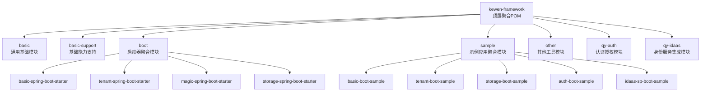
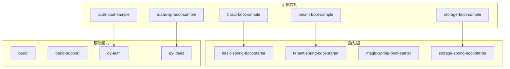
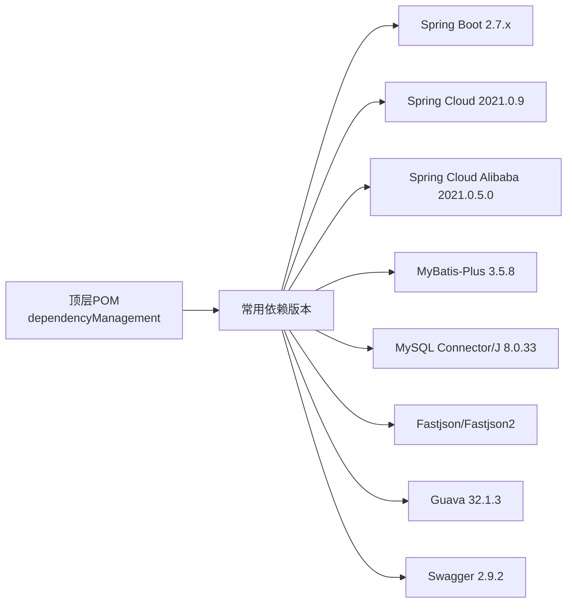

# 开发环境搭建

<cite>
**本文引用的文件**
- [pom.xml](file://pom.xml)
- [README.md](file://README.md)
- [application.yml](file://application.yml)
- [basic/pom.xml](file://basic/pom.xml)
- [boot/pom.xml](file://boot/pom.xml)
- [sample/pom.xml](file://sample/pom.xml)
- [.gitignore](file://.gitignore)
- [docs/sql/sys_request_log.sql](file://docs/sql/sys_request_log.sql)
- [docs/sql/storage.sql](file://docs/sql/storage.sql)
- [qy-auth/relation/sql/auth_full.sql](file://qy-auth/relation/sql/auth_full.sql)
- [sample/basic-boot-sample/src/main/resources/application.yml](file://sample/basic-boot-sample/src/main/resources/application.yml)
- [sample/auth-boot-sample/src/main/resources/application.yml](file://sample/auth-boot-sample/src/main/resources/application.yml)
</cite>

## 目录
1. [简介](#简介)
2. [项目结构](#项目结构)
3. [核心组件](#核心组件)
4. [架构总览](#架构总览)
5. [详细组件分析](#详细组件分析)
6. [依赖分析](#依赖分析)
7. [性能考虑](#性能考虑)
8. [故障排查指南](#故障排查指南)
9. [结论](#结论)
10. [附录](#附录)

## 简介
本指南面向首次参与 kewen-framework 的开发者，提供从零开始的开发环境搭建步骤与最佳实践，涵盖以下内容：
- JDK 8+ 的安装与配置
- Maven 3.6+ 的版本要求与配置
- IDE（IntelliJ IDEA 或 Eclipse）的推荐配置（插件、代码风格、运行配置）
- 项目依赖管理机制与 IDE 导入流程
- 数据库 MySQL 8.0+ 的安装与初始化脚本
- Git 版本控制基本使用与分支/提交规范建议
- 常见开发环境问题的解决方案与调试技巧

## 项目结构
kewen-framework 采用多模块 Maven 聚合工程组织，顶层 POM 管理版本与依赖，各功能域按模块拆分，示例应用位于 sample 模块，便于快速验证。

图表来源
- [pom.xml](file://pom.xml)
- [boot/pom.xml](file://boot/pom.xml)
- [sample/pom.xml](file://sample/pom.xml)

章节来源
- [pom.xml](file://pom.xml)
- [boot/pom.xml](file://boot/pom.xml)
- [sample/pom.xml](file://sample/pom.xml)

## 核心组件
- 多模块聚合：顶层 POM 定义模块集合与统一版本管理，确保各子模块一致性。
- 依赖管理：通过 dependencyManagement 统一声明常用依赖版本，避免子模块重复指定。
- 示例应用：sample 下包含多个可直接运行的示例，覆盖基础、租户、存储、认证等场景。
- 数据库脚本：docs/sql 与 qy-auth/relation/sql 提供系统日志、存储、认证等表结构初始化脚本。

章节来源
- [pom.xml](file://pom.xml)
- [docs/sql/sys_request_log.sql](file://docs/sql/sys_request_log.sql)
- [docs/sql/storage.sql](file://docs/sql/storage.sql)
- [qy-auth/relation/sql/auth_full.sql](file://qy-auth/relation/sql/auth_full.sql)

## 架构总览
整体由“基础模块 + 启动器 + 示例应用 + 认证授权 + 身份服务集成”构成，示例应用通过引入相应 starter 快速启用功能。

图表来源
- [boot/pom.xml](file://boot/pom.xml)
- [sample/pom.xml](file://sample/pom.xml)

## 详细组件分析

### JDK 与编译目标
- 编译源码与目标兼容性：顶层 POM 与各模块均将 maven.compiler.source/target 设为 8，确保 JDK 8+ 可用。
- 建议：本地 JDK 使用 8 或更高版本；若团队使用更高版本，需保持源码与目标一致。

章节来源
- [pom.xml](file://pom.xml)
- [basic/pom.xml](file://basic/pom.xml)
- [boot/pom.xml](file://boot/pom.xml)
- [sample/pom.xml](file://sample/pom.xml)

### Maven 3.6+ 要求与配置
- 版本要求：建议使用 Maven 3.6+，以获得更好的依赖解析与插件兼容性。
- 仓库配置：如需加速下载，可在本地 settings.xml 中配置镜像仓库。
- 顶层 POM 已集中管理依赖版本，子模块无需重复声明版本号。

章节来源
- [pom.xml](file://pom.xml)

### IDE（IntelliJ IDEA/Eclipse）推荐配置
- IntelliJ IDEA
  - 插件：Lombok、MyBatisX（如需）、Maven Helper、String Manipulation、Key Promoter X。
  - 代码风格：使用阿里巴巴 Java 开发手册风格，或统一团队约定；确保 Editor → Code Style 设置与项目一致。
  - 运行配置：在 sample 模块中选择主类（如 sample 下各模块的启动类），设置 VM Options 与 Program Arguments（如需要）。
- Eclipse
  - 插件：m2e（Maven 支持）、Buildship（Gradle 若有）、Lombok 插件。
  - 代码风格：统一使用项目风格配置，避免因格式差异导致的 diff。
  - 运行配置：新建 Run Configuration，选择 sample 模块的主类，设置 JVM 参数与工作目录。

章节来源
- [.gitignore](file://.gitignore)

### 项目导入与依赖管理
- 导入方式
  - IntelliJ IDEA：File → Open → 选择根目录下的 pom.xml → 选择 Import Maven Projects。
  - Eclipse：File → Import → Maven → Existing Maven Projects → 选择根目录。
- 依赖解析
  - 顶层 POM 通过 dependencyManagement 统一版本，子模块按 groupId/artifactId 引入即可。
  - 如需排除传递依赖，可在子模块中显式声明并使用 <exclusions>。

章节来源
- [pom.xml](file://pom.xml)

### 数据库 MySQL 8.0+ 安装与初始化
- 安装要求：MySQL 8.0+，字符集建议 utf8mb4，排序规则建议 utf8mb4_general_ci。
- 初始化脚本
  - 请求日志表：docs/sql/sys_request_log.sql
  - 存储文件表：docs/sql/storage.sql
  - 认证模板表：qy-auth/relation/sql/auth_full.sql
- 示例应用数据源配置
  - basic-boot-sample 示例中展示了数据源驱动与 HikariCP 连接池配置，可参考其 application.yml 进行本地化调整。
  - auth-boot-sample 示例中也包含安全与会话相关配置，便于联调。

章节来源
- [docs/sql/sys_request_log.sql](file://docs/sql/sys_request_log.sql)
- [docs/sql/storage.sql](file://docs/sql/storage.sql)
- [qy-auth/relation/sql/auth_full.sql](file://qy-auth/relation/sql/auth_full.sql)
- [sample/basic-boot-sample/src/main/resources/application.yml](file://sample/basic-boot-sample/src/main/resources/application.yml)
- [sample/auth-boot-sample/src/main/resources/application.yml](file://sample/auth-boot-sample/src/main/resources/application.yml)

### Git 版本控制与分支/提交规范
- 基本流程
  - 分支策略：建议采用 Git Flow，master/main 用于发布，develop 用于集成，feature/* 用于新功能开发。
  - 提交规范：建议使用约定式提交（如 feat: 新增功能；fix: 修复缺陷；docs: 文档更新；refactor: 重构；chore: 杂项）。
  - 合并与审查：Pull Request 合并前进行代码审查与 CI 校验。
- .gitignore
  - 工程已内置 Maven、IDE、日志、打包产物等忽略规则，确保推送干净。

章节来源
- [.gitignore](file://.gitignore)

### 运行与调试示例应用
- 基础示例（basic-boot-sample）
  - 端口：8080
  - 数据源：示例中使用 HikariCP 并配置了连接池参数
  - 日志：输出到 ./logs 目录
- 认证示例（auth-boot-sample）
  - 端口：8081
  - 包含安全、会话、记住我等配置项，便于联调认证链路
- 启动顺序建议：先启动依赖的基础模块（如 basic、basic-support），再启动示例应用。

章节来源
- [sample/basic-boot-sample/src/main/resources/application.yml](file://sample/basic-boot-sample/src/main/resources/application.yml)
- [sample/auth-boot-sample/src/main/resources/application.yml](file://sample/auth-boot-sample/src/main/resources/application.yml)

## 依赖分析
kewen-framework 通过顶层 POM 的 dependencyManagement 集中管理依赖版本，子模块按需引入，避免版本漂移。

图表来源
- [pom.xml](file://pom.xml)

章节来源
- [pom.xml](file://pom.xml)

## 性能考虑
- 连接池：示例中使用 HikariCP，建议根据并发与资源情况调整连接池大小与超时参数。
- SQL 观察：项目内置 p6spy 驱动（示例中已配置），可用于开发阶段观察 SQL 执行情况。
- 日志级别：开发阶段可适度提高日志级别以便定位问题，生产环境建议收敛。

## 故障排查指南
- 无法解析依赖或版本冲突
  - 确认 Maven 版本满足 3.6+，并检查本地仓库与镜像配置。
  - 使用 mvn dependency:tree 查看依赖树，定位冲突来源。
- 数据库连接失败
  - 校验 MySQL 版本与字符集，确认初始化脚本执行成功。
  - 对照示例 application.yml 中的数据源配置，核对主机、端口、用户名、密码与驱动。
- 端口占用
  - 示例应用默认端口分别为 8080、8081，如冲突请在 application.yml 中修改 server.port。
- IDE 导入异常
  - 清理 IDE 缓存后重新导入；确保 JDK 版本与 maven.compiler.source/target 一致。
- 日志与追踪
  - 示例应用已配置日志输出路径与级别，必要时开启 debug 级别辅助排查。

章节来源
- [sample/basic-boot-sample/src/main/resources/application.yml](file://sample/basic-boot-sample/src/main/resources/application.yml)
- [sample/auth-boot-sample/src/main/resources/application.yml](file://sample/auth-boot-sample/src/main/resources/application.yml)

## 结论
按照本指南完成 JDK、Maven、IDE、数据库与 Git 的配置后，即可顺利导入 kewen-framework 并运行示例应用。建议在团队内统一代码风格与提交规范，结合示例应用快速验证功能点，并通过依赖管理与模块化结构提升开发效率与可维护性。

## 附录
- 快速校验清单
  - JDK 8+ 已安装并配置 JAVA_HOME
  - Maven 3.6+ 已安装并可正常解析依赖
  - IntelliJ IDEA/Eclipse 已导入项目，Lombok 插件已启用
  - MySQL 8.0+ 已安装，执行初始化脚本
  - 示例应用可正常启动并访问
  - .gitignore 已生效，推送干净