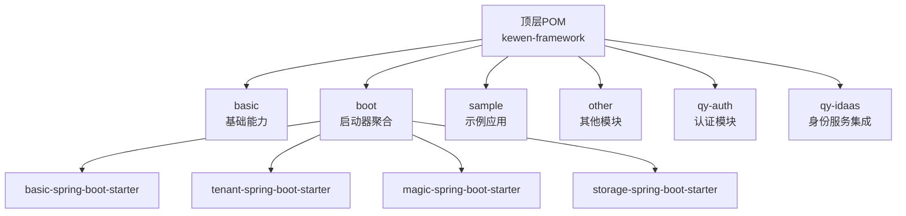
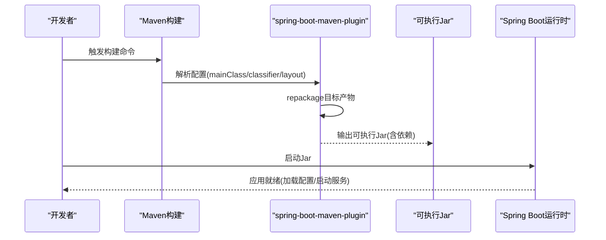
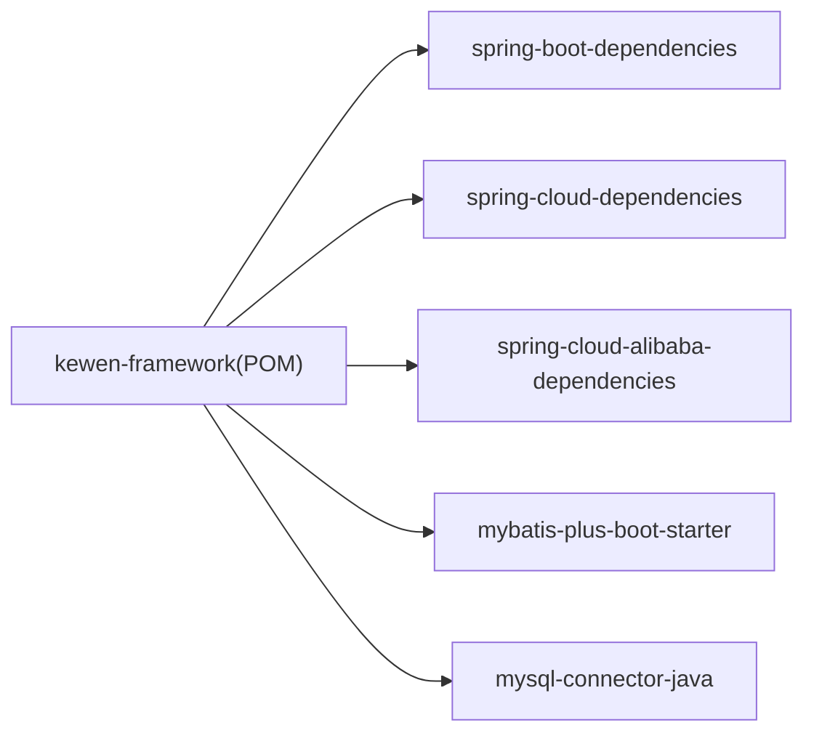

# 构建与部署

<cite>
**本文引用的文件**
- [pom.xml](file://pom.xml)
- [basic/pom.xml](file://basic/pom.xml)
- [boot/pom.xml](file://boot/pom.xml)
- [application.yml](file://application.yml)
- [sample/auth-boot-sample/pom.xml](file://sample/auth-boot-sample/pom.xml)
- [sample/auth-boot-sample/src/main/resources/application.yml](file://sample/auth-boot-sample/src/main/resources/application.yml)
- [sample/auth-boot-sample/src/main/resources/application-dev.yml](file://sample/auth-boot-sample/src/main/resources/application-dev.yml)
- [sample/idaas-sp-boot-sample/pom.xml](file://sample/idaas-sp-boot-sample/pom.xml)
- [README.md](file://README.md)
</cite>

## 目录
1. [简介](#简介)
2. [项目结构](#项目结构)
3. [核心组件](#核心组件)
4. [架构总览](#架构总览)
5. [详细组件分析](#详细组件分析)
6. [依赖分析](#依赖分析)
7. [性能考虑](#性能考虑)
8. [故障排查指南](#故障排查指南)
9. [结论](#结论)
10. [附录](#附录)

## 简介
本指南面向kewen-framework项目的构建与部署，覆盖以下主题：
- Maven构建生命周期与标准阶段（clean、compile、test、package、install）
- 打包策略：可执行jar与传统war包的差异及适用场景
- Docker容器化部署方案：Dockerfile编写与镜像构建流程
- CI/CD流水线：基于GitHub Actions或Jenkins的自动化构建与部署
- 多环境配置管理：dev、test、prod的配置差异与切换方法
- 部署脚本与自动化工具使用指南
- 监控与日志：Prometheus、Grafana、ELK Stack的集成建议
- 故障恢复与回滚策略的部署实践

## 项目结构
kewen-framework采用多模块Maven聚合工程组织，顶层POM负责版本与依赖管理，各子模块按功能域拆分，如基础能力basic、启动器boot、认证模块qy-auth、样例sample等。

图表来源
- [pom.xml:20-28](file://pom.xml#L20-L28)
- [boot/pom.xml:16-21](file://boot/pom.xml#L16-L21)

章节来源
- [pom.xml:1-279](file://pom.xml#L1-L279)
- [boot/pom.xml:1-29](file://boot/pom.xml#L1-L29)

## 核心组件
- 顶层聚合POM：统一版本与依赖管理，提供源码插件以生成sources jar。
- 启动器聚合POM：聚合多个Spring Boot Starter模块，便于按需引入。
- 示例应用模块：通过spring-boot-maven-plugin配置主类与打包布局，生成可执行jar。
- 多环境配置：示例应用提供profiles与环境特定配置文件，支持dev/test/prod切换。

章节来源
- [pom.xml:260-279](file://pom.xml#L260-L279)
- [boot/pom.xml:1-29](file://boot/pom.xml#L1-L29)
- [sample/auth-boot-sample/pom.xml:76-99](file://sample/auth-boot-sample/pom.xml#L76-L99)
- [sample/auth-boot-sample/src/main/resources/application.yml:1-55](file://sample/auth-boot-sample/src/main/resources/application.yml#L1-L55)
- [sample/auth-boot-sample/src/main/resources/application-dev.yml:1-6](file://sample/auth-boot-sample/src/main/resources/application-dev.yml#L1-L6)

## 架构总览
从构建到运行的整体流程如下：

图表来源
- [sample/auth-boot-sample/pom.xml:76-99](file://sample/auth-boot-sample/pom.xml#L76-L99)
- [sample/idaas-sp-boot-sample/pom.xml:37-57](file://sample/idaas-sp-boot-sample/pom.xml#L37-L57)

## 详细组件分析

### Maven构建生命周期与阶段
- clean：清理各模块target目录，准备干净构建环境。
- compile：编译Java源码与资源文件。
- test：执行单元测试（示例应用包含测试依赖）。
- package：打包产物（示例应用通过spring-boot-maven-plugin生成可执行jar）。
- install：安装构件至本地仓库，供其他模块引用。

章节来源
- [sample/auth-boot-sample/pom.xml:76-99](file://sample/auth-boot-sample/pom.xml#L76-L99)
- [pom.xml:260-279](file://pom.xml#L260-L279)

### 打包策略：可执行jar vs war
- 可执行jar（推荐用于Spring Boot应用）
  - 特点：内嵌web容器，单文件可直接运行；适合微服务与云原生部署。
  - 示例：示例应用通过spring-boot-maven-plugin配置layout=ZIP并repackage，生成可执行jar。
- 传统war包
  - 特点：需部署至外部Servlet容器；适用于传统企业级部署或与现有容器生态集成。
  - 说明：当前示例未配置war打包；若需war，请在对应模块添加相应插件与容器依赖。

章节来源
- [sample/auth-boot-sample/pom.xml:76-99](file://sample/auth-boot-sample/pom.xml#L76-L99)
- [sample/idaas-sp-boot-sample/pom.xml:37-57](file://sample/idaas-sp-boot-sample/pom.xml#L37-L57)

### Docker容器化部署
- Dockerfile编写要点
  - 基础镜像：选择官方OpenJDK镜像作为基础层。
  - 构建产物：将Maven package生成的可执行jar复制到镜像中。
  - 入口命令：通过java -jar启动应用；设置JAVA_OPTS与JVM参数。
  - 端口暴露：根据应用配置暴露HTTP端口。
  - 健康检查：添加HEALTHCHECK指令，结合应用健康端点。
- 镜像构建流程
  - 在项目根目录执行maven构建，生成可执行jar。
  - 使用Dockerfile构建镜像并推送至镜像仓库。
  - 通过容器编排平台（如Kubernetes）部署与扩缩容。

说明：本节为通用实践指导，未直接分析具体源文件。

### CI/CD流水线配置
- GitHub Actions
  - 触发条件：push、pull_request、release等事件。
  - 步骤建议：检出代码、设置Java环境、执行Maven构建与测试、构建Docker镜像、推送镜像、部署至目标环境。
  - 缓存策略：缓存Maven本地仓库以提升构建速度。
- Jenkins
  - Pipeline：声明式或脚本式Pipeline，串联构建、测试、打包、镜像构建与部署步骤。
  - 插件：Maven、Docker、Kubernetes等插件。
  - 参数化：支持环境选择（dev/test/prod）与发布分支控制。

说明：本节为通用实践指导，未直接分析具体源文件。

### 多环境配置管理
- 配置文件层次
  - application.yml：通用配置与默认值。
  - application-{profile}.yml：环境特定配置（如application-dev.yml）。
- 切换方式
  - JVM参数：-Dspring.profiles.active=dev
  - 环境变量：SPRING_PROFILES_ACTIVE=dev
  - 示例应用已内置profiles.active=dev，数据库连接在dev配置中定义。
- 环境差异建议
  - dev：本地开发，日志级别较高，数据源指向本地数据库。
  - test：集成测试，数据库隔离，关闭或降低日志量。
  - prod：生产环境，严格日志级别，启用健康检查与安全配置。

章节来源
- [sample/auth-boot-sample/src/main/resources/application.yml:6-7](file://sample/auth-boot-sample/src/main/resources/application.yml#L6-L7)
- [sample/auth-boot-sample/src/main/resources/application-dev.yml:1-6](file://sample/auth-boot-sample/src/main/resources/application-dev.yml#L1-L6)
- [application.yml:1-32](file://application.yml#L1-L32)

### 部署脚本与自动化工具
- Shell脚本建议
  - build-and-run.sh：执行mvn clean package，复制jar至部署目录，设置JVM参数并启动。
  - rollback.sh：保留上一个版本，一键回滚至历史版本。
- 自动化工具
  - Ansible/Terraform：基础设施即代码，管理服务器与容器编排。
  - Helm/Kustomize：管理Kubernetes资源配置与多环境差异化。

说明：本节为通用实践指导，未直接分析具体源文件。

### 监控与日志收集
- Prometheus/Grafana
  - Spring Boot Actuator：暴露指标端点，Prometheus抓取。
  - Grafana：创建仪表板，展示应用关键指标（请求量、错误率、响应时间、GC等）。
- ELK Stack
  - Logstash/Fluentd：采集容器日志与应用日志。
  - Elasticsearch：存储日志，支持检索与聚合。
  - Kibana：可视化日志，建立告警规则。

说明：本节为通用实践指导，未直接分析具体源文件。

### 故障恢复与回滚策略
- 快速回滚
  - 版本化镜像：镜像标签包含版本号与构建号，便于回滚。
  - 金丝雀发布：逐步替换实例，观察指标与日志，异常则快速回滚。
- 健康检查与自愈
  - Liveness/Readiness探针：结合Kubernetes滚动更新策略。
  - 自动扩缩容：基于CPU/内存或业务指标触发扩缩容。
- 数据备份与恢复
  - 定期备份数据库与配置中心，验证恢复流程。

说明：本节为通用实践指导，未直接分析具体源文件。

## 依赖分析
kewen-framework通过顶层POM集中管理Spring Boot、Spring Cloud、MyBatis-Plus、MySQL驱动等依赖版本，确保模块间一致性。

图表来源
- [pom.xml:41-99](file://pom.xml#L41-L99)
- [pom.xml:132-147](file://pom.xml#L132-L147)
- [pom.xml:242-247](file://pom.xml#L242-L247)

章节来源
- [pom.xml:1-279](file://pom.xml#L1-L279)

## 性能考虑
- 构建性能
  - 启用并行构建与Maven缓存，减少重复下载依赖。
  - 将大型模块拆分为独立子模块，避免全量编译。
- 运行性能
  - JVM参数调优：堆大小、GC策略、线程池大小。
  - 数据库连接池配置：合理设置最大连接数与空闲超时。
  - 日志级别：生产环境避免过高的调试日志级别。

说明：本节提供一般性建议，未直接分析具体源文件。

## 故障排查指南
- 构建失败
  - 检查Maven版本与Java版本是否匹配（项目使用Java 8）。
  - 清理本地仓库中的损坏构件，重新执行构建。
- 启动失败
  - 核对mainClass是否正确配置（示例应用已在插件中指定）。
  - 检查数据库连接配置与网络连通性。
- 配置问题
  - 确认active profile与对应配置文件存在且格式正确。
  - 使用环境变量或JVM参数覆盖默认配置。

章节来源
- [sample/auth-boot-sample/pom.xml:76-99](file://sample/auth-boot-sample/pom.xml#L76-L99)
- [sample/auth-boot-sample/src/main/resources/application-dev.yml:1-6](file://sample/auth-boot-sample/src/main/resources/application-dev.yml#L1-L6)

## 结论
kewen-framework提供了清晰的多模块结构与Spring Boot示例应用，结合本文的构建、打包、容器化、CI/CD、多环境配置与运维实践，可实现从开发到生产的全链路自动化与高可靠交付。建议在实际落地时，结合团队规范与基础设施，完善监控、日志与回滚策略。

## 附录
- 快速参考
  - 构建命令：mvn clean package -DskipTests（跳过测试）
  - 启动命令：java -jar target/*.jar --spring.profiles.active=dev
  - 查看帮助：mvn help:effective-pom

章节来源
- [README.md:1-38](file://README.md#L1-L38)