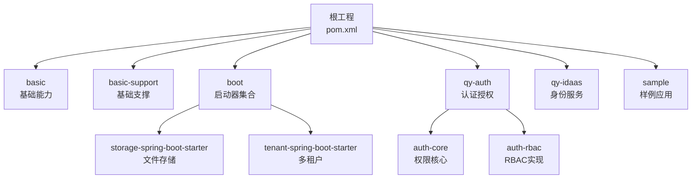
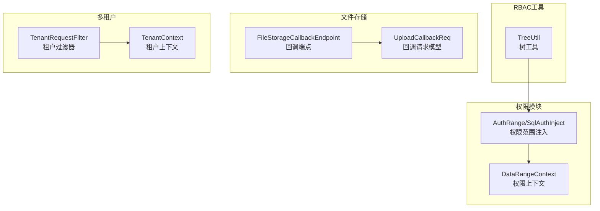
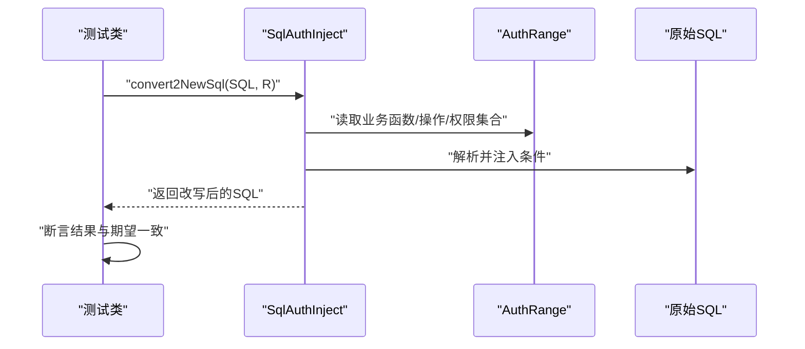
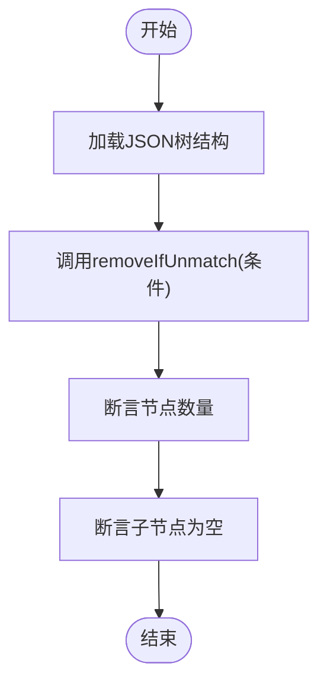
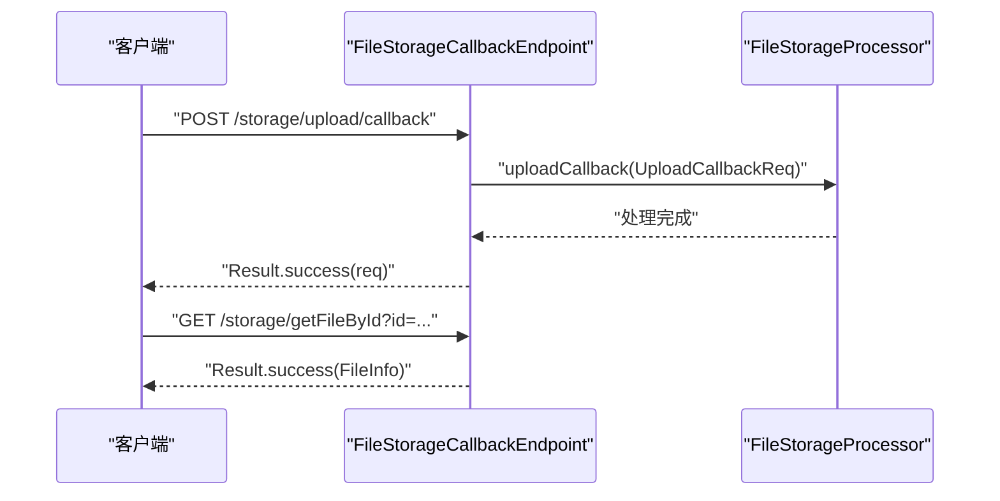
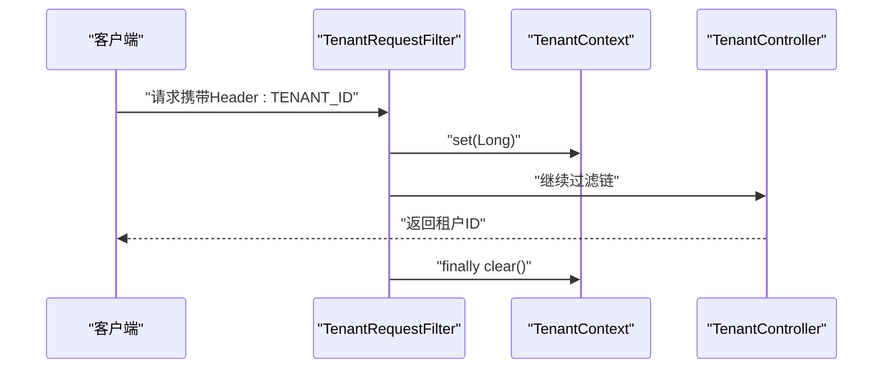
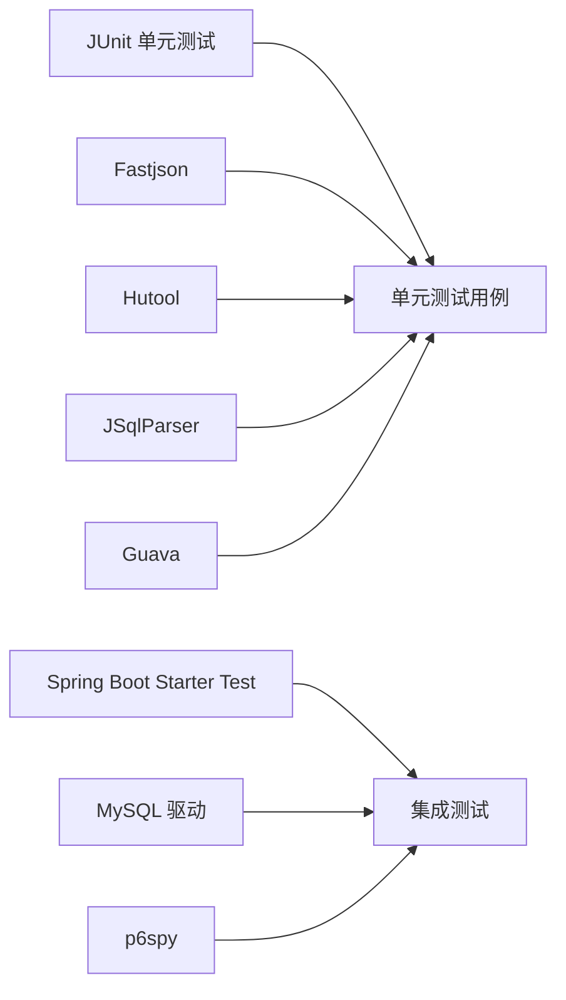

# 测试策略与实践

<cite>
**本文引用的文件**
- [pom.xml](file://pom.xml)
- [application.yml](file://application.yml)
- [docs/application.yml](file://docs/application.yml)
- [qy-auth/auth-core/src/test/java/com/kewen/framework/auth/core/data/range/MybatisAuthSqlInjectTest.java](file://qy-auth/auth-core/src/test/java/com/kewen/framework/auth/core/data/range/MybatisAuthSqlInjectTest.java)
- [qy-auth/auth-rbac/src/test/java/com/kewen/framework/auth/rabc/utils/TreeUtilTest.java](file://qy-auth/auth-rbac/src/test/java/com/kewen/framework/auth/rabc/utils/TreeUtilTest.java)
- [qy-auth/auth-rbac/src/test/java/com/kewen/framework/auth/rabc/utils/TreeUtilTest.json](file://qy-auth/auth-rbac/src/test/java/com/kewen/framework/auth/rabc/utils/TreeUtilTest.json)
- [basic-support/src/test/java/com/kewen/framework/basic/support/utils/MdKillerTest.java](file://basic-support/src/test/java/com/kewen/framework/basic/support/utils/MdKillerTest.java)
- [sample/auth-boot-sample/src/test/java/controller/TestAuthAnnotationControllerTest.java](file://sample/auth-boot-sample/src/test/java/controller/TestAuthAnnotationControllerTest.java)
- [boot/storage-spring-boot-starter/src/main/java/com/kewen/framework/storage/web/FileStorageCallbackEndpoint.java](file://boot/storage-spring-boot-starter/src/main/java/com/kewen/framework/storage/web/FileStorageCallbackEndpoint.java)
- [boot/storage-spring-boot-starter/src/main/java/com/kewen/framework/storage/web/model/UploadCallbackReq.java](file://boot/storage-spring-boot-starter/src/main/java/com/kewen/framework/storage/web/model/UploadCallbackReq.java)
- [boot/tenant-spring-boot-starter/src/main/java/com/kewen/framework/tenant/TenantContext.java](file://boot/tenant-spring-boot-starter/src/main/java/com/kewen/framework/tenant/TenantContext.java)
- [boot/tenant-spring-boot-starter/src/main/java/com/kewen/framework/tenant/TenantRequestFilter.java](file://boot/tenant-spring-boot-starter/src/main/java/com/kewen/framework/tenant/TenantRequestFilter.java)
- [boot/tenant-spring-boot-starter/src/main/resources/META-INF/additional-spring-configuration-metadata.json](file://boot/tenant-spring-boot-starter/src/main/resources/META-INF/additional-spring-configuration-metadata.json)
- [sample/tenant-boot-sample/src/main/java/com/kewen/framework/sample/tenant/controller/TenantController.java](file://sample/tenant-boot-sample/src/main/java/com/kewen/framework/sample/tenant/controller/TenantController.java)
</cite>

## 目录
1. [引言](#引言)
2. [项目结构](#项目结构)
3. [核心组件](#核心组件)
4. [架构总览](#架构总览)
5. [详细组件分析](#详细组件分析)
6. [依赖分析](#依赖分析)
7. [性能考虑](#性能考虑)
8. [故障排查指南](#故障排查指南)
9. [结论](#结论)
10. [附录](#附录)

## 引言
本指南面向kewen-framework项目的测试策略与实践，覆盖单元测试、集成测试、权限模块测试、文件存储模块测试、多租户测试、测试覆盖率与持续集成执行流程，并提供可直接参考的测试代码路径与最佳实践。目标是帮助开发者在不同模块中建立一致、可维护且高价值的测试体系。

## 项目结构
kewen-framework采用多模块Maven聚合结构，核心模块包括基础能力basic、启动器boot、认证授权qy-auth、身份服务qy-idaas、样例sample等。测试主要分布在auth-core、auth-rbac、basic-support以及sample模块中，分别对应权限范围注入、树工具、Markdown日志工具以及Spring Boot集成场景。

图示来源
- [pom.xml:1-28](file://pom.xml#L1-L28)

章节来源
- [pom.xml:1-28](file://pom.xml#L1-L28)

## 核心组件
- 权限范围注入测试：验证SQL改写与条件注入，覆盖IN/EXISTS匹配、子查询、CTE等复杂SQL场景。
- RBAC工具测试：验证树工具对层级结构的过滤与裁剪逻辑。
- Markdown请求日志工具测试：验证日志构建与输出格式。
- Spring Boot集成测试：基于@SpringBootTest加载上下文，结合MyBatis Plus进行数据库操作验证。
- 文件存储回调端点：提供上传回调与下载信息查询接口，便于端到端测试。
- 多租户上下文与过滤器：通过Header传递租户ID，验证上下文设置与清理。

章节来源
- [qy-auth/auth-core/src/test/java/com/kewen/framework/auth/core/data/range/MybatisAuthSqlInjectTest.java:1-183](file://qy-auth/auth-core/src/test/java/com/kewen/framework/auth/core/data/range/MybatisAuthSqlInjectTest.java#L1-L183)
- [qy-auth/auth-rbac/src/test/java/com/kewen/framework/auth/rabc/utils/TreeUtilTest.java:1-100](file://qy-auth/auth-rbac/src/test/java/com/kewen/framework/auth/rabc/utils/TreeUtilTest.java#L1-L100)
- [basic-support/src/test/java/com/kewen/framework/basic/support/utils/MdKillerTest.java:1-50](file://basic-support/src/test/java/com/kewen/framework/basic/support/utils/MdKillerTest.java#L1-L50)
- [sample/auth-boot-sample/src/test/java/controller/TestAuthAnnotationControllerTest.java:1-74](file://sample/auth-boot-sample/src/test/java/controller/TestAuthAnnotationControllerTest.java#L1-L74)
- [boot/storage-spring-boot-starter/src/main/java/com/kewen/framework/storage/web/FileStorageCallbackEndpoint.java:1-65](file://boot/storage-spring-boot-starter/src/main/java/com/kewen/framework/storage/web/FileStorageCallbackEndpoint.java#L1-L65)
- [boot/tenant-spring-boot-starter/src/main/java/com/kewen/framework/tenant/TenantContext.java:1-39](file://boot/tenant-spring-boot-starter/src/main/java/com/kewen/framework/tenant/TenantContext.java#L1-L39)
- [boot/tenant-spring-boot-starter/src/main/java/com/kewen/framework/tenant/TenantRequestFilter.java:1-37](file://boot/tenant-spring-boot-starter/src/main/java/com/kewen/framework/tenant/TenantRequestFilter.java#L1-L37)

## 架构总览
下图展示测试相关的关键组件及其交互关系，包括权限范围注入、RBAC工具、文件存储回调、多租户上下文与过滤器。

图示来源
- [qy-auth/auth-core/src/test/java/com/kewen/framework/auth/core/data/range/MybatisAuthSqlInjectTest.java:1-183](file://qy-auth/auth-core/src/test/java/com/kewen/framework/auth/core/data/range/MybatisAuthSqlInjectTest.java#L1-L183)
- [boot/storage-spring-boot-starter/src/main/java/com/kewen/framework/storage/web/FileStorageCallbackEndpoint.java:1-65](file://boot/storage-spring-boot-starter/src/main/java/com/kewen/framework/storage/web/FileStorageCallbackEndpoint.java#L1-L65)
- [boot/storage-spring-boot-starter/src/main/java/com/kewen/framework/storage/web/model/UploadCallbackReq.java:1-19](file://boot/storage-spring-boot-starter/src/main/java/com/kewen/framework/storage/web/model/UploadCallbackReq.java#L1-L19)
- [boot/tenant-spring-boot-starter/src/main/java/com/kewen/framework/tenant/TenantContext.java:1-39](file://boot/tenant-spring-boot-starter/src/main/java/com/kewen/framework/tenant/TenantContext.java#L1-L39)
- [boot/tenant-spring-boot-starter/src/main/java/com/kewen/framework/tenant/TenantRequestFilter.java:1-37](file://boot/tenant-spring-boot-starter/src/main/java/com/kewen/framework/tenant/TenantRequestFilter.java#L1-L37)

## 详细组件分析

### 权限范围注入测试（单元测试）
- 测试目标：验证SqlAuthInject在不同匹配方式（IN/EXISTS）下对SQL的改写与注入，覆盖子查询、JOIN、WITH AS等复杂场景。
- 设计要点：
  - 使用@Before准备AuthDataTable与SqlAuthInject实例。
  - 通过构造AuthRange与不同MatchMethod断言新SQL与期望值一致。
  - 对嵌套查询与CTE进行专项断言，确保条件正确叠加。
- 断言策略：使用Assert.assertEquals对比改写后的SQL字符串，保证注入逻辑稳定可靠。
- 覆盖场景：表名匹配、子查询内匹配、WITH AS子句、EXISTS与IN两种匹配方式。

图示来源
- [qy-auth/auth-core/src/test/java/com/kewen/framework/auth/core/data/range/MybatisAuthSqlInjectTest.java:34-97](file://qy-auth/auth-core/src/test/java/com/kewen/framework/auth/core/data/range/MybatisAuthSqlInjectTest.java#L34-L97)

章节来源
- [qy-auth/auth-core/src/test/java/com/kewen/framework/auth/core/data/range/MybatisAuthSqlInjectTest.java:1-183](file://qy-auth/auth-core/src/test/java/com/kewen/framework/auth/core/data/range/MybatisAuthSqlInjectTest.java#L1-L183)

### RBAC树工具测试（单元测试）
- 测试目标：验证TreeUtil.removeIfUnmatch按条件过滤树节点，确保叶子节点清理与保留逻辑正确。
- 设计要点：
  - 使用JSON数据构造树结构，包含多层父子关系。
  - 通过lambda表达式定义过滤条件，断言过滤后树的大小与子节点清空情况。
- 断言策略：使用assertEquals与assertTrue验证节点数量与子节点为空状态。

图示来源
- [qy-auth/auth-rbac/src/test/java/com/kewen/framework/auth/rabc/utils/TreeUtilTest.java:17-31](file://qy-auth/auth-rbac/src/test/java/com/kewen/framework/auth/rabc/utils/TreeUtilTest.java#L17-L31)
- [qy-auth/auth-rbac/src/test/java/com/kewen/framework/auth/rabc/utils/TreeUtilTest.json:1-59](file://qy-auth/auth-rbac/src/test/java/com/kewen/framework/auth/rabc/utils/TreeUtilTest.json#L1-L59)

章节来源
- [qy-auth/auth-rbac/src/test/java/com/kewen/framework/auth/rabc/utils/TreeUtilTest.java:1-100](file://qy-auth/auth-rbac/src/test/java/com/kewen/framework/auth/rabc/utils/TreeUtilTest.java#L1-L100)
- [qy-auth/auth-rbac/src/test/java/com/kewen/framework/auth/rabc/utils/TreeUtilTest.json:1-59](file://qy-auth/auth-rbac/src/test/java/com/kewen/framework/auth/rabc/utils/TreeUtilTest.json#L1-L59)

### Markdown请求日志工具测试（单元测试）
- 测试目标：验证MarkdownUtil构建器按请求日志组装Markdown文本，覆盖标题、正文、换行等格式化输出。
- 设计要点：
  - 构造RequestLogger对象，包含IP、URL、Headers、Body、Params、耗时等字段。
  - 使用MarkdownUtil.of()创建SectionBuilder，依次追加标题与内容。
  - 输出构建结果以验证格式化效果。

章节来源
- [basic-support/src/test/java/com/kewen/framework/basic/support/utils/MdKillerTest.java:1-50](file://basic-support/src/test/java/com/kewen/framework/basic/support/utils/MdKillerTest.java#L1-L50)

### Spring Boot集成测试（集成测试）
- 测试目标：通过@SpringBootTest加载应用上下文，验证数据库初始化、服务层批量保存等功能。
- 设计要点：
  - 使用@Autowired注入服务接口，加载JSON模板数据并转换为实体列表。
  - 批量保存后查询并断言结果，确保数据持久化与查询一致性。
- 注意事项：如需初始化数据库，可将@Test注解临时放开以执行初始化流程。

章节来源
- [sample/auth-boot-sample/src/test/java/controller/TestAuthAnnotationControllerTest.java:1-74](file://sample/auth-boot-sample/src/test/java/controller/TestAuthAnnotationControllerTest.java#L1-L74)

### 文件存储模块测试（集成测试）
- 测试目标：验证文件上传回调端点与下载信息查询接口，覆盖同步回调与异步回调场景。
- 设计要点：
  - 定义UploadCallbackReq模型，包含文件ID、Key、Hash、Bucket、Size、MimeType等字段。
  - 通过FileStorageCallbackEndpoint提供/upload/callback与/upload/callbackAsync接口。
  - 可扩展测试：构造回调请求体，断言处理器行为与返回结果。
- 错误场景建议：
  - 缺失必要字段（如fileId/key）。
  - 非法bucket或hash格式。
  - 异步回调未触发业务处理的幂等性校验。

图示来源
- [boot/storage-spring-boot-starter/src/main/java/com/kewen/framework/storage/web/FileStorageCallbackEndpoint.java:27-47](file://boot/storage-spring-boot-starter/src/main/java/com/kewen/framework/storage/web/FileStorageCallbackEndpoint.java#L27-L47)
- [boot/storage-spring-boot-starter/src/main/java/com/kewen/framework/storage/web/model/UploadCallbackReq.java:10-19](file://boot/storage-spring-boot-starter/src/main/java/com/kewen/framework/storage/web/model/UploadCallbackReq.java#L10-L19)

章节来源
- [boot/storage-spring-boot-starter/src/main/java/com/kewen/framework/storage/web/FileStorageCallbackEndpoint.java:1-65](file://boot/storage-spring-boot-starter/src/main/java/com/kewen/framework/storage/web/FileStorageCallbackEndpoint.java#L1-L65)
- [boot/storage-spring-boot-starter/src/main/java/com/kewen/framework/storage/web/model/UploadCallbackReq.java:1-19](file://boot/storage-spring-boot-starter/src/main/java/com/kewen/framework/storage/web/model/UploadCallbackReq.java#L1-L19)

### 多租户功能测试（集成测试）
- 测试目标：验证租户上下文设置与清理、请求过滤器从Header读取租户ID并注入上下文的能力。
- 设计要点：
  - TenantRequestFilter从请求头读取租户ID，设置到TenantContext并在过滤链结束后清理。
  - TenantContext提供support()/get()/set()/clear()方法，支持租户隔离。
  - 可通过样例控制器读取上下文并返回结果，验证上下文切换。
- 配置项：additional-spring-configuration-metadata.json声明kewen.tenant.open开关。

图示来源
- [boot/tenant-spring-boot-starter/src/main/java/com/kewen/framework/tenant/TenantRequestFilter.java:22-34](file://boot/tenant-spring-boot-starter/src/main/java/com/kewen/framework/tenant/TenantRequestFilter.java#L22-L34)
- [boot/tenant-spring-boot-starter/src/main/java/com/kewen/framework/tenant/TenantContext.java:13-37](file://boot/tenant-spring-boot-starter/src/main/java/com/kewen/framework/tenant/TenantContext.java#L13-L37)
- [sample/tenant-boot-sample/src/main/java/com/kewen/framework/sample/tenant/controller/TenantController.java:16-20](file://sample/tenant-boot-sample/src/main/java/com/kewen/framework/sample/tenant/controller/TenantController.java#L16-L20)

章节来源
- [boot/tenant-spring-boot-starter/src/main/java/com/kewen/framework/tenant/TenantContext.java:1-39](file://boot/tenant-spring-boot-starter/src/main/java/com/kewen/framework/tenant/TenantContext.java#L1-L39)
- [boot/tenant-spring-boot-starter/src/main/java/com/kewen/framework/tenant/TenantRequestFilter.java:1-37](file://boot/tenant-spring-boot-starter/src/main/java/com/kewen/framework/tenant/TenantRequestFilter.java#L1-L37)
- [boot/tenant-spring-boot-starter/src/main/resources/META-INF/additional-spring-configuration-metadata.json:1-10](file://boot/tenant-spring-boot-starter/src/main/resources/META-INF/additional-spring-configuration-metadata.json#L1-L10)
- [sample/tenant-boot-sample/src/main/java/com/kewen/framework/sample/tenant/controller/TenantController.java:1-21](file://sample/tenant-boot-sample/src/main/java/com/kewen/framework/sample/tenant/controller/TenantController.java#L1-L21)

## 依赖分析
- 测试框架与工具：
  - JUnit：单元测试基础。
  - Spring Boot Starter Test：集成测试上下文与断言。
  - Fastjson/Hutool：JSON解析与工具类。
  - JSqlParser：SQL解析与改写。
  - Guava：集合与并发工具。
  - MySQL驱动与p6spy：数据库与SQL监控。
- 配置文件：
  - application.yml：全局配置，包含权限表映射、安全会话、记住我等。
  - docs/application.yml：租户开关、消息与请求持久化配置。

图示来源
- [pom.xml:30-39](file://pom.xml#L30-L39)
- [pom.xml:109-256](file://pom.xml#L109-L256)
- [application.yml:1-32](file://application.yml#L1-L32)
- [docs/application.yml:1-21](file://docs/application.yml#L1-L21)

章节来源
- [pom.xml:109-256](file://pom.xml#L109-L256)
- [application.yml:1-32](file://application.yml#L1-L32)
- [docs/application.yml:1-21](file://docs/application.yml#L1-L21)

## 性能考虑
- 单元测试优先：针对纯逻辑与算法（如SQL改写、树工具）优先使用JUnit，避免外部依赖，提升执行速度。
- 集成测试聚焦：Spring Boot集成测试仅在必要时加载上下文，尽量使用内存数据库或Flyway/H2进行快速验证。
- SQL解析成本：JSqlParser解析复杂SQL有开销，建议在单元测试中覆盖关键路径，避免在集成测试中过度重复。
- 多租户与权限：过滤器与上下文切换为轻量操作，但应避免在高频请求中频繁创建对象，保持线程安全与清理及时。

## 故障排查指南
- 权限范围注入异常：
  - 检查AuthDataTable列映射是否与实际表一致。
  - 核对AuthRange的businessFunction与operate是否匹配。
  - 对比改写后的SQL与期望值，定位匹配方式（IN/EXISTS）差异。
- RBAC树工具异常：
  - 确认输入JSON结构与TreeUtil接口实现一致。
  - 检查removeIfUnmatch条件逻辑，确保叶子节点清理符合预期。
- 文件存储回调失败：
  - 校验回调请求体字段完整性与类型。
  - 检查回调端点路径与HTTP方法是否正确。
  - 关注异步回调的幂等性与重试机制。
- 多租户上下文问题：
  - 确认请求头是否携带正确的租户ID。
  - 检查过滤器顺序与finally块清理逻辑。
  - 通过样例控制器验证上下文读取结果。

章节来源
- [qy-auth/auth-core/src/test/java/com/kewen/framework/auth/core/data/range/MybatisAuthSqlInjectTest.java:34-97](file://qy-auth/auth-core/src/test/java/com/kewen/framework/auth/core/data/range/MybatisAuthSqlInjectTest.java#L34-L97)
- [qy-auth/auth-rbac/src/test/java/com/kewen/framework/auth/rabc/utils/TreeUtilTest.java:17-31](file://qy-auth/auth-rbac/src/test/java/com/kewen/framework/auth/rabc/utils/TreeUtilTest.java#L17-L31)
- [boot/storage-spring-boot-starter/src/main/java/com/kewen/framework/storage/web/FileStorageCallbackEndpoint.java:27-47](file://boot/storage-spring-boot-starter/src/main/java/com/kewen/framework/storage/web/FileStorageCallbackEndpoint.java#L27-L47)
- [boot/tenant-spring-boot-starter/src/main/java/com/kewen/framework/tenant/TenantRequestFilter.java:22-34](file://boot/tenant-spring-boot-starter/src/main/java/com/kewen/framework/tenant/TenantRequestFilter.java#L22-L34)

## 结论
本指南提供了kewen-framework在权限、RBAC工具、文件存储、多租户等模块的测试策略与实践路径。建议遵循“单元测试优先、集成测试聚焦”的原则，结合现有测试用例与配置文件，完善覆盖率与持续集成流程，确保系统稳定性与可维护性。

## 附录
- 测试覆盖率建议：
  - 核心算法与工具类（权限注入、树工具、Markdown工具）达到高覆盖率（>80%）。
  - 集成测试覆盖关键业务流程（RBAC菜单初始化、文件存储回调、多租户上下文切换）。
- 持续集成执行流程：
  - 在CI中先运行单元测试，再运行集成测试，最后生成覆盖率报告。
  - 针对文件存储与多租户场景，可在CI中配置最小化依赖（内存数据库、模拟存储）以缩短执行时间。