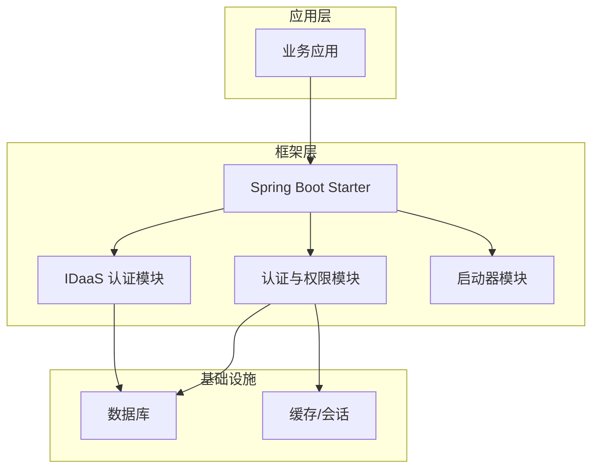
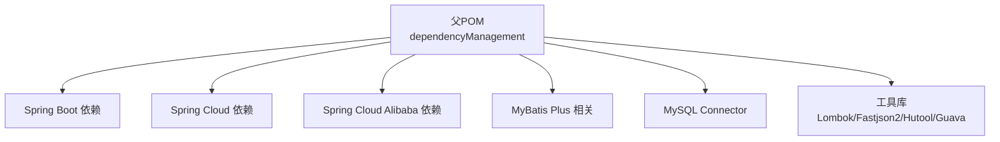

# 贡献指南

<cite>
**本文引用的文件**
- [README.md](file://README.md)
- [LICENSE](file://LICENSE)
- [pom.xml](file://pom.xml)
- [.gitee/ISSUE_TEMPLATE.zh-CN.md](file://.gitee/ISSUE_TEMPLATE.zh-CN.md)
- [.gitee/PULL_REQUEST_TEMPLATE.zh-CN.md](file://.gitee/PULL_REQUEST_TEMPLATE.zh-CN.md)
- [application.yml](file://application.yml)
- [README_Auth.md](file://README_Auth.md)
- [docs/sql/sys_request_log.sql](file://docs/sql/sys_request_log.sql)
- [qy-idaas/README.md](file://qy-idaas/README.md)
</cite>

## 目录
1. [引言](#引言)
2. [项目结构](#项目结构)
3. [核心组件](#核心组件)
4. [架构总览](#架构总览)
5. [详细组件分析](#详细组件分析)
6. [依赖分析](#依赖分析)
7. [性能考量](#性能考量)
8. [故障排查指南](#故障排查指南)
9. [结论](#结论)
10. [附录](#附录)

## 引言
本指南面向希望为 kewen-framework 贡献代码、文档与建议的新老贡献者，涵盖以下主题：
- 开源协议与贡献许可协议（CLA）要求
- Issue 提交流程与模板
- Pull Request 提交规范与审查流程
- 代码变更要求（测试、文档、兼容性）
- 社区参与方式与沟通规范
- 版本发布与里程碑计划
- 新贡献者入门与常见场景操作
- 贡献统计与致谢机制

kewen-framework 采用 MIT 许可证，允许自由使用、复制、修改、合并、出版、分发、再许可与销售软件及其文档，需在分发中保留版权与许可声明。

章节来源
- [LICENSE:1-22](file://LICENSE#L1-L22)

## 项目结构
kewen-framework 为多模块 Maven 聚合工程，包含基础能力模块、启动器模块、认证与权限模块、示例模块等。根 pom.xml 定义了模块聚合、依赖管理与构建插件。

```mermaid
graph TB
root["根工程<br/>kewen-framework"] --> basic["basic<br/>基础能力"]
root --> support["basic-support<br/>基础支撑"]
root --> boot["boot<br/>Spring Boot 启动器聚合"]
root --> sample["sample<br/>示例工程聚合"]
root --> other["other<br/>其他工具模块"]
root --> auth["qy-auth<br/>认证与权限模块"]
root --> idaas["qy-idaas<br/>IDaaS 认证模块"]
boot --> bs_boot["basic-spring-boot-starter"]
boot --> ms_boot["magic-spring-boot-starter"]
boot --> ss_boot["storage-spring-boot-starter"]
boot --> ts_boot["tenant-spring-boot-starter"]
auth --> auth_core["auth-core"]
auth --> auth_rabc["auth-rbac"]
auth --> auth_boot["auth-spring-boot-starter"]
auth --> auth_core_boot["auth-core-spring-boot-starter"]
auth --> auth_rabc_boot["auth-rbac-spring-boot-starter"]
sample --> auth_sample["auth-boot-sample"]
sample --> basic_sample["basic-boot-sample"]
sample --> idaas_sp_sample["idaas-sp-boot-sample"]
sample --> storage_sample["storage-boot-sample"]
sample --> tenant_sample["tenant-boot-sample"]
```

图表来源
- [pom.xml:20-28](file://pom.xml#L20-L28)
- [pom.xml:41-69](file://pom.xml#L41-L69)

章节来源
- [pom.xml:1-279](file://pom.xml#L1-L279)

## 核心组件
- 基础能力模块（basic）：提供通用异常、过滤器、日志追踪、模型与工具类。
- 启动器模块（boot）：封装各子模块的自动装配与配置，便于按需引入。
- 认证与权限模块（qy-auth）：基于注解的菜单与数据权限控制，集成 Spring Security。
- IDaaS 模块（qy-idaas）：提供 OAuth2/SAML 认证能力。
- 示例模块（sample）：演示如何在真实项目中集成与使用框架。

章节来源
- [README_Auth.md:147-200](file://README_Auth.md#L147-L200)
- [qy-idaas/README.md:81-99](file://qy-idaas/README.md#L81-L99)

## 架构总览
kewen-framework 采用“模块化 + 启动器”的架构，通过 Maven 依赖管理统一版本，通过 Spring Boot Starter 实现零配置或低配置接入。认证与权限模块通过注解与拦截器实现细粒度控制，并提供扩展点以适配不同业务场景。

图表来源
- [pom.xml:41-99](file://pom.xml#L41-L99)
- [application.yml:12-32](file://application.yml#L12-L32)

## 详细组件分析

### Issue 提交流程与模板
- 提交 Bug 报告时，请使用仓库提供的中文 Issue 模板，至少包含：问题背景、复现步骤、期望行为、实际行为、环境信息、日志与截图等。
- 功能请求请明确描述需求背景、预期行为、影响范围与验收条件。
- 问题分类建议：
  - Bug：功能异常、崩溃、兼容性问题
  - Enhancement：功能增强、体验优化
  - Docs：文档缺失或错误
  - Question：使用疑问或技术咨询
  - Refactor：代码重构、架构演进

章节来源
- [.gitee/ISSUE_TEMPLATE.zh-CN.md:1-14](file://.gitee/ISSUE_TEMPLATE.zh-CN.md#L1-L14)

### Pull Request 提交规范
- PR 描述
  - 明确关联的 Issue 编号
  - 变更内容：功能点、修复点、优化点、废弃项、破坏性变更说明
  - 测试关注点：接口测试、性能测试、并发测试、回归点
  - 自测结论与提测信息（环境、账号、时间）
- 分支命名
  - 建议采用：feature/xxx、fix/xxx、docs/xxx、chore/xxx
- 提交信息
  - 格式：type(scope): subject
  - 示例：feat(auth): 添加菜单权限注解支持；fix(storage): 修复上传回调空指针
- 代码审查
  - 至少一名维护者审查
  - 通过 CI 校验（编译、单元测试、覆盖率）
  - 评审通过后方可合并

章节来源
- [.gitee/PULL_REQUEST_TEMPLATE.zh-CN.md:1-54](file://.gitee/PULL_REQUEST_TEMPLATE.zh-CN.md#L1-L54)

### 代码变更要求
- 新增功能
  - 单元测试：覆盖核心逻辑与边界条件
  - 集成测试：涉及外部依赖（数据库、消息队列）时提供最小化测试
  - 文档更新：新增 API、配置项、使用示例与注意事项
- 变更与优化
  - 保持向后兼容；若必须破坏兼容，需在 PR 中明确说明并提供迁移指引
  - 优化需附带性能对比数据或基准测试结论
- 日志与追踪
  - 使用统一的日志与追踪组件，确保关键路径可追踪
- 数据库变更
  - 提供迁移脚本与回滚方案
  - 在 PR 中说明影响范围与风险点

章节来源
- [.gitee/PULL_REQUEST_TEMPLATE.zh-CN.md:14-24](file://.gitee/PULL_REQUEST_TEMPLATE.zh-CN.md#L14-L24)
- [docs/sql/sys_request_log.sql:1-19](file://docs/sql/sys_request_log.sql#L1-L19)

### 认证与权限模块贡献要点
- 注解使用与扩展
  - 菜单权限与数据权限注解的使用与扩展点
  - 自定义权限适配器与处理器
- 配置与兼容
  - Spring Security、MyBatis Plus、数据库版本兼容性
  - 示例工程与文档同步更新
- 测试与验证
  - 菜单入库、权限拦截、数据范围过滤等关键流程的测试

章节来源
- [README_Auth.md:48-61](file://README_Auth.md#L48-L61)
- [application.yml:12-32](file://application.yml#L12-L32)

### IDaaS 认证模块贡献要点
- OAuth2/SAML 配置项与兼容性
- 证书与元数据配置、回调地址与作用域
- 示例与文档同步更新

章节来源
- [qy-idaas/README.md:81-99](file://qy-idaas/README.md#L81-L99)

## 依赖分析
kewen-framework 通过 Maven 管理依赖，核心依赖包括 Spring Boot、Spring Cloud、MyBatis Plus、MySQL、Lombok、Fastjson2、Hutool、Guava 等。依赖版本集中在父 POM 的 dependencyManagement 中统一管理，子模块按需引入。

图表来源
- [pom.xml:71-99](file://pom.xml#L71-L99)
- [pom.xml:121-184](file://pom.xml#L121-L184)

章节来源
- [pom.xml:41-256](file://pom.xml#L41-L256)

## 性能考量
- 代码层面
  - 避免在热路径重复计算与频繁对象创建
  - 合理使用缓存与连接池，注意过期与清理策略
- 配置层面
  - 数据库连接数、线程池大小、超时时间等参数应结合压测结果调整
- 测试层面
  - 在 PR 中提供性能测试结论或基准对比

## 故障排查指南
- 认证与权限
  - 检查菜单入库与权限配置是否正确
  - 核对注解使用与拦截器链顺序
- IDaaS
  - 校验回调地址、证书与元数据文件
  - 关注作用域与用户属性映射
- 日志与追踪
  - 使用统一请求日志与追踪组件定位问题

章节来源
- [README_Auth.md:48-61](file://README_Auth.md#L48-L61)
- [application.yml:12-32](file://application.yml#L12-L32)
- [docs/sql/sys_request_log.sql:1-19](file://docs/sql/sys_request_log.sql#L1-L19)

## 结论
kewen-framework 以模块化与启动器为核心，提供开箱即用的认证与权限能力。贡献者应遵循统一的 Issue 与 PR 规范，确保变更具备可测试性、可维护性与可迁移性。欢迎通过 Issue、PR 与讨论参与社区建设。

## 附录

### 开源协议与 CLA 要求
- 协议：MIT 许可证
- CLA：本项目未设置强制性 CLA；贡献即表示同意以 MIT 协议开源

章节来源
- [LICENSE:1-22](file://LICENSE#L1-L22)

### 社区参与方式
- 讨论区：在 Gitee 仓库的讨论区或 Issue 中进行技术交流
- 技术交流：结合示例工程与文档进行实践与反馈
- 文档贡献：补充 README、FAQ、最佳实践与迁移指南

### 版本发布与里程碑
- 发布节奏：按功能里程碑与稳定性评估发布
- 里程碑计划：建议在 Issue 中规划功能迭代与发布计划，PR 中标注相关 Issue

### 新贡献者入门
- 环境准备：JDK 8+、Maven、IDE
- 快速起步：阅读 README 与示例工程，运行 basic-boot-sample 或 auth-boot-sample
- 贡献流程：Fork → 分支 → 提交 → PR → 审查 → 合并

### 常见贡献场景
- 新增功能：编写单元测试与集成测试，更新文档与示例
- Bug 修复：提供最小复现与测试用例
- 文档改进：修正错别字、补充配置项说明、增加最佳实践
- 性能优化：提供基准测试数据与迁移建议

### 贡献统计与致谢
- 统计方式：基于 Git 历史与 PR 贡献记录
- 致谢机制：在发布说明或 README 中列出贡献者名单与贡献摘要