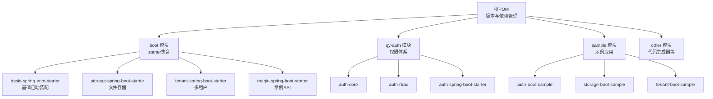
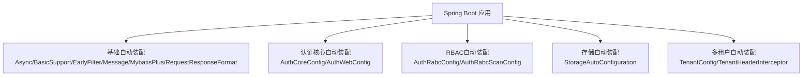
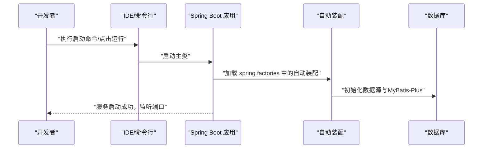
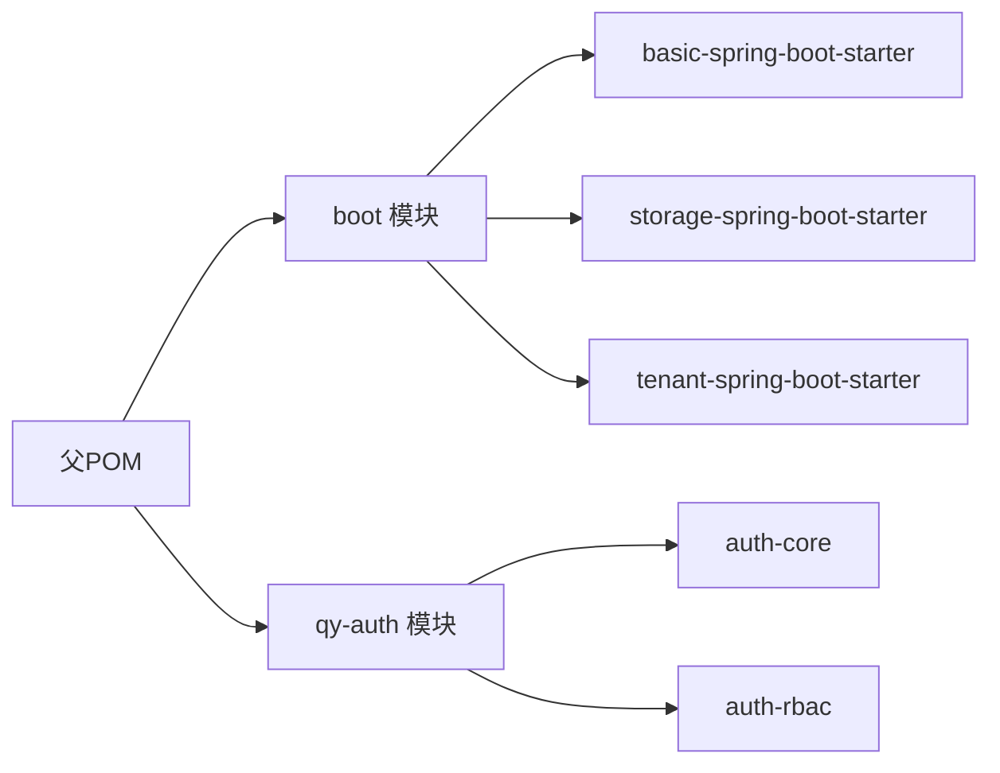

# 快速开始

<cite>
**本文引用的文件**
- [根POM（pom.xml）](file://pom.xml)
- [应用配置样例（application.yml）](file://application.yml)
- [认证示例应用入口（AuthBootSampleApp.java）](file://sample/auth-boot-sample/src/main/java/com/kewen/framework/auth/sample/AuthBootSampleApp.java)
- [认证示例配置（application.yml）](file://sample/auth-boot-sample/src/main/resources/application.yml)
- [存储示例应用入口（StorageBootSample.java）](file://sample/storage-boot-sample/src/main/java/com/kewen/framework/sample/storage/StorageBootSample.java)
- [存储示例配置（application.yml）](file://sample/storage-boot-sample/src/main/resources/application.yml)
- [多租户示例配置（application.yml）](file://sample/tenant-boot-sample/src/main/resources/application.yml)
- [基础自动装配（spring.factories）](file://boot/basic-spring-boot-starter/src/main/resources/META-INF/spring.factories)
- [存储自动装配（spring.factories）](file://boot/storage-spring-boot-starter/src/main/resources/META-INF/spring.factories)
- [多租户自动装配（spring.factories）](file://boot/tenant-spring-boot-starter/src/main/resources/META-INF/spring.factories)
- [认证核心自动装配（spring.factories）](file://qy-auth/auth-core-spring-boot-starter/src/main/resources/META-INF/spring.factories)
- [RBAC自动装配（spring.factories）](file://qy-auth/auth-rbac-spring-boot-starter/src/main/resources/META-INF/spring.factories)
- [基础模块POM（boot/pom.xml）](file://boot/pom.xml)
- [README（README.md）](file://README.md)
</cite>

## 目录
1. [简介](#简介)
2. [项目结构](#项目结构)
3. [核心组件](#核心组件)
4. [架构总览](#架构总览)
5. [详细组件分析](#详细组件分析)
6. [依赖分析](#依赖分析)
7. [性能考虑](#性能考虑)
8. [故障排除指南](#故障排除指南)
9. [结论](#结论)
10. [附录](#附录)

## 简介
本指南面向初学者与进阶开发者，帮助你在本地快速搭建基于 Spring Boot 的应用，并集成 kewen-framework 的核心能力：权限控制（认证与 RBAC）、文件存储（支持七牛云）、多租户隔离与基础支撑（日志、请求追踪、统一响应、MyBatis-Plus 等）。你将获得从环境准备到第一个可运行项目的完整路径，以及常见配置项的说明与排障建议。

## 项目结构
kewen-framework 采用 Maven 多模块结构，顶层 POM 负责版本与依赖管理，各功能域以独立模块存在，便于按需引入。核心模块包括：
- 基础能力模块：basic、basic-support
- Spring Boot 自动装配模块：boot 下的 starter
- 权限体系：qy-auth 下的 auth-core、auth-rbac、auth-spring-boot-starter
- 示例模块：sample 下的 auth-boot-sample、storage-boot-sample、tenant-boot-sample

图表来源
- [根POM（pom.xml）:20-28](file://pom.xml#L20-L28)
- [基础自动装配（spring.factories）:1-7](file://boot/basic-spring-boot-starter/src/main/resources/META-INF/spring.factories#L1-L7)
- [存储自动装配（spring.factories）:1-2](file://boot/storage-spring-boot-starter/src/main/resources/META-INF/spring.factories#L1-L2)
- [多租户自动装配（spring.factories）:1-3](file://boot/tenant-spring-boot-starter/src/main/resources/META-INF/spring.factories#L1-L3)
- [认证核心自动装配（spring.factories）:1-3](file://qy-auth/auth-core-spring-boot-starter/src/main/resources/META-INF/spring.factories#L1-L3)
- [RBAC自动装配（spring.factories）:1-3](file://qy-auth/auth-rbac-spring-boot-starter/src/main/resources/META-INF/spring.factories#L1-L3)

章节来源
- [根POM（pom.xml）:20-28](file://pom.xml#L20-L28)
- [基础自动装配（spring.factories）:1-7](file://boot/basic-spring-boot-starter/src/main/resources/META-INF/spring.factories#L1-L7)
- [存储自动装配（spring.factories）:1-2](file://boot/storage-spring-boot-starter/src/main/resources/META-INF/spring.factories#L1-L2)
- [多租户自动装配（spring.factories）:1-3](file://boot/tenant-spring-boot-starter/src/main/resources/META-INF/spring.factories#L1-L3)
- [认证核心自动装配（spring.factories）:1-3](file://qy-auth/auth-core-spring-boot-starter/src/main/resources/META-INF/spring.factories#L1-L3)
- [RBAC自动装配（spring.factories）:1-3](file://qy-auth/auth-rbac-spring-boot-starter/src/main/resources/META-INF/spring.factories#L1-L3)

## 核心组件
- 基础能力（basic、basic-support）：提供统一返回体、异常处理、请求日志、链路追踪、工具类等通用能力。
- 权限体系（auth-core、auth-rbac、auth-spring-boot-starter）：提供认证、会话、记住我、菜单与数据权限、注解式鉴权等。
- 文件存储（storage-spring-boot-starter）：封装上传、分片、回调、预签名等流程，内置七牛云实现。
- 多租户（tenant-spring-boot-starter）：通过过滤器与 Feign 拦截器注入租户上下文，实现数据隔离。
- 自动装配机制：通过 spring.factories 将各模块的 AutoConfiguration 注册到 Spring Boot 启动流程中。

章节来源
- [基础自动装配（spring.factories）:1-7](file://boot/basic-spring-boot-starter/src/main/resources/META-INF/spring.factories#L1-L7)
- [存储自动装配（spring.factories）:1-2](file://boot/storage-spring-boot-starter/src/main/resources/META-INF/spring.factories#L1-L2)
- [多租户自动装配（spring.factories）:1-3](file://boot/tenant-spring-boot-starter/src/main/resources/META-INF/spring.factories#L1-L3)
- [认证核心自动装配（spring.factories）:1-3](file://qy-auth/auth-core-spring-boot-starter/src/main/resources/META-INF/spring.factories#L1-L3)
- [RBAC自动装配（spring.factories）:1-3](file://qy-auth/auth-rbac-spring-boot-starter/src/main/resources/META-INF/spring.factories#L1-L3)

## 架构总览
下图展示了启动时各自动装配的加载顺序与职责边界，帮助你理解模块间的协作方式。

图表来源
- [基础自动装配（spring.factories）:1-7](file://boot/basic-spring-boot-starter/src/main/resources/META-INF/spring.factories#L1-L7)
- [认证核心自动装配（spring.factories）:1-3](file://qy-auth/auth-core-spring-boot-starter/src/main/resources/META-INF/spring.factories#L1-L3)
- [RBAC自动装配（spring.factories）:1-3](file://qy-auth/auth-rbac-spring-boot-starter/src/main/resources/META-INF/spring.factories#L1-L3)
- [存储自动装配（spring.factories）:1-2](file://boot/storage-spring-boot-starter/src/main/resources/META-INF/spring.factories#L1-L2)
- [多租户自动装配（spring.factories）:1-3](file://boot/tenant-spring-boot-starter/src/main/resources/META-INF/spring.factories#L1-L3)

## 详细组件分析

### 环境与依赖
- JDK 版本：顶层与 boot 模块均使用 Java 8 编译属性，建议在本地使用 JDK 8 或兼容的更高版本进行构建与运行。
- Maven：使用 Maven 3.6+，确保能正常解析 spring-boot-dependencies 与 mybatis-plus 版本。
- Spring Boot：由父 POM 统一管理，当前版本为 2.7.18。
- 数据库：示例使用 MySQL 8.0，驱动为 mysql-connector-java 8.0.33。
- 其他：Fastjson2、Hutool、Guava、Swagger 等工具库由父 POM 提供。

章节来源
- [根POM（pom.xml）:12-18](file://pom.xml#L12-L18)
- [根POM（pom.xml）:92-99](file://pom.xml#L92-L99)
- [根POM（pom.xml）:242-247](file://pom.xml#L242-L247)

### 创建你的第一个 Spring Boot 项目并集成 kewen-framework
- 步骤概览
  1) 使用 Spring Initializr 或 IDE 新建一个空的 Spring Boot 工程，选择 Java 8 与 Spring Boot 2.7.x。
  2) 在项目的 pom.xml 中引入所需的 starter（例如 basic、auth、storage、tenant），或直接继承本仓库的父 POM。
  3) 在 application.yml 中添加必要的连接信息与框架配置项。
  4) 启动应用，访问示例端点验证功能。
- 推荐做法
  - 若需要权限控制：引入 auth-spring-boot-starter 与 auth-rbac-spring-boot-starter。
  - 若需要文件存储：引入 storage-spring-boot-starter 并配置七牛云参数。
  - 若需要多租户：引入 tenant-spring-boot-starter 并开启租户开关。
  - 若需要基础能力（日志、统一响应、MyBatis-Plus 等）：引入 basic-spring-boot-starter。

章节来源
- [根POM（pom.xml）:44-69](file://pom.xml#L44-L69)
- [基础自动装配（spring.factories）:1-7](file://boot/basic-spring-boot-starter/src/main/resources/META-INF/spring.factories#L1-L7)
- [认证核心自动装配（spring.factories）:1-3](file://qy-auth/auth-core-spring-boot-starter/src/main/resources/META-INF/spring.factories#L1-L3)
- [RBAC自动装配（spring.factories）:1-3](file://qy-auth/auth-rbac-spring-boot-starter/src/main/resources/META-INF/spring.factories#L1-L3)
- [存储自动装配（spring.factories）:1-2](file://boot/storage-spring-boot-starter/src/main/resources/META-INF/spring.factories#L1-L2)
- [多租户自动装配（spring.factories）:1-3](file://boot/tenant-spring-boot-starter/src/main/resources/META-INF/spring.factories#L1-L3)

### 配置文件详解与常见项说明
- 认证与安全
  - 登录参数与地址、记住我有效期、最大会话数、当前用户接口地址等，详见示例配置。
  - 可选 SAML 登录参数（注册ID、Entity ID、元数据、证书、SSO 地址等）。
- 权限表配置
  - 支持自定义权限表名与列名映射，便于适配现有业务表。
  - 可开启菜单权限缓存以提升性能。
- 文件存储（七牛云）
  - 必填：access-key、secret-key、bucket、is-public、download-domain。
  - 可选：upload-callback-url、上传类型等。
- 多租户
  - 开启租户开关后，系统会在请求头/Feign 请求中注入租户标识，实现数据隔离。
- 基础能力
  - 日志、请求追踪、统一响应格式、MyBatis-Plus 分页插件等由基础自动装配启用。

章节来源
- [应用配置样例（application.yml）:1-32](file://application.yml#L1-L32)
- [认证示例配置（application.yml）:31-55](file://sample/auth-boot-sample/src/main/resources/application.yml#L31-L55)
- [存储示例配置（application.yml）:1-18](file://sample/storage-boot-sample/src/main/resources/application.yml#L1-L18)
- [多租户示例配置（application.yml）:1-13](file://sample/tenant-boot-sample/src/main/resources/application.yml#L1-L13)

### 如何使用权限注解
- 在控制器方法上使用权限注解（如 @PreAuthorize、@PostAuthorize 或框架提供的注解）进行方法级鉴权。
- 结合 RBAC 模块提供的菜单与数据权限，实现细粒度的访问控制。
- 示例应用中提供了注解鉴权的控制器与测试用例，可参考其调用方式与断言逻辑。

章节来源
- [认证示例应用入口（AuthBootSampleApp.java）:1-13](file://sample/auth-boot-sample/src/main/java/com/kewen/framework/auth/sample/AuthBootSampleApp.java#L1-L13)

### 如何使用文件存储
- 引入 storage-spring-boot-starter 后，系统会暴露文件上传、分片、回调等端点。
- 通过配置文件设置七牛云参数，即可完成直传与回调处理。
- 示例应用展示了如何启动并访问相关端点。

章节来源
- [存储示例应用入口（StorageBootSample.java）:1-12](file://sample/storage-boot-sample/src/main/java/com/kewen/framework/sample/storage/StorageBootSample.java#L1-L12)
- [存储示例配置（application.yml）:1-18](file://sample/storage-boot-sample/src/main/resources/application.yml#L1-L18)

### 如何使用多租户
- 引入 tenant-spring-boot-starter 并在配置中开启租户开关。
- 系统会自动注入租户上下文，可在业务层读取当前租户标识，实现数据隔离。

章节来源
- [多租户示例配置（application.yml）:1-13](file://sample/tenant-boot-sample/src/main/resources/application.yml#L1-L13)

### 示例应用启动流程

图表来源
- [认证示例应用入口（AuthBootSampleApp.java）:1-13](file://sample/auth-boot-sample/src/main/java/com/kewen/framework/auth/sample/AuthBootSampleApp.java#L1-L13)
- [基础自动装配（spring.factories）:1-7](file://boot/basic-spring-boot-starter/src/main/resources/META-INF/spring.factories#L1-L7)
- [存储自动装配（spring.factories）:1-2](file://boot/storage-spring-boot-starter/src/main/resources/META-INF/spring.factories#L1-L2)
- [多租户自动装配（spring.factories）:1-3](file://boot/tenant-spring-boot-starter/src/main/resources/META-INF/spring.factories#L1-L3)
- [认证核心自动装配（spring.factories）:1-3](file://qy-auth/auth-core-spring-boot-starter/src/main/resources/META-INF/spring.factories#L1-L3)
- [RBAC自动装配（spring.factories）:1-3](file://qy-auth/auth-rbac-spring-boot-starter/src/main/resources/META-INF/spring.factories#L1-L3)

## 依赖分析
- 版本与依赖管理
  - 通过 dependencyManagement 统一管理 Spring Boot、Spring Cloud、MyBatis-Plus、MySQL 驱动、Fastjson2、Hutool、Guava 等版本。
  - boot 模块作为 starter 聚合，便于在业务工程中按需引入。
- 模块间耦合
  - 各 starter 通过 spring.factories 与 Spring Boot 自动装配机制耦合，业务工程仅需引入所需 starter 即可启用对应能力。
  - auth 模块与 storage、tenant 模块相互独立，可按需组合。

图表来源
- [根POM（pom.xml）:41-256](file://pom.xml#L41-L256)
- [基础自动装配（spring.factories）:1-7](file://boot/basic-spring-boot-starter/src/main/resources/META-INF/spring.factories#L1-L7)
- [存储自动装配（spring.factories）:1-2](file://boot/storage-spring-boot-starter/src/main/resources/META-INF/spring.factories#L1-L2)
- [多租户自动装配（spring.factories）:1-3](file://boot/tenant-spring-boot-starter/src/main/resources/META-INF/spring.factories#L1-L3)
- [认证核心自动装配（spring.factories）:1-3](file://qy-auth/auth-core-spring-boot-starter/src/main/resources/META-INF/spring.factories#L1-L3)
- [RBAC自动装配（spring.factories）:1-3](file://qy-auth/auth-rbac-spring-boot-starter/src/main/resources/META-INF/spring.factories#L1-L3)

章节来源
- [根POM（pom.xml）:41-256](file://pom.xml#L41-L256)
- [基础自动装配（spring.factories）:1-7](file://boot/basic-spring-boot-starter/src/main/resources/META-INF/spring.factories#L1-L7)
- [存储自动装配（spring.factories）:1-2](file://boot/storage-spring-boot-starter/src/main/resources/META-INF/spring.factories#L1-L2)
- [多租户自动装配（spring.factories）:1-3](file://boot/tenant-spring-boot-starter/src/main/resources/META-INF/spring.factories#L1-L3)
- [认证核心自动装配（spring.factories）:1-3](file://qy-auth/auth-core-spring-boot-starter/src/main/resources/META-INF/spring.factories#L1-L3)
- [RBAC自动装配（spring.factories）:1-3](file://qy-auth/auth-rbac-spring-boot-starter/src/main/resources/META-INF/spring.factories#L1-L3)

## 性能考虑
- 认证与会话
  - 合理设置最大会话数与“挤下线”策略，避免资源被恶意占用。
  - 记住我有效期可根据业务场景调整，注意安全性与用户体验平衡。
- 文件存储
  - 七牛云直传可降低服务端压力；回调地址需稳定可用，避免重复上传。
  - 公有/私有空间区分与下载域名配置直接影响访问性能与成本。
- 多租户
  - 租户上下文注入为轻量操作，但需确保在查询 SQL 中正确拼接租户条件，避免全表扫描。
- 基础能力
  - MyBatis-Plus 分页插件与统一响应格式对性能影响较小，建议在高并发场景下结合缓存与索引优化。

## 故障排除指南
- 启动失败：找不到自动装配类
  - 检查是否正确引入了对应 starter，确认 spring.factories 中的自动装配类路径是否存在。
- 数据库连接失败
  - 核对 application.yml 中的数据源配置（URL、用户名、密码、驱动类），确保网络可达且账号有权限。
- 权限注解不生效
  - 确认已引入 auth-spring-boot-starter 与 auth-rbac-spring-boot-starter，并检查 @EnableGlobalMethodSecurity 或等效配置是否启用。
- 文件上传失败
  - 检查七牛云配置（AK/SK、Bucket、域名、回调地址），确认网络连通性与回调服务可用。
- 多租户数据隔离无效
  - 确认已开启租户开关并在业务查询中正确使用租户上下文，避免遗漏租户条件。
- 日志与追踪
  - 若未看到请求日志或链路ID，请检查基础自动装配是否生效，并确认日志级别与输出路径配置。

章节来源
- [基础自动装配（spring.factories）:1-7](file://boot/basic-spring-boot-starter/src/main/resources/META-INF/spring.factories#L1-L7)
- [认证核心自动装配（spring.factories）:1-3](file://qy-auth/auth-core-spring-boot-starter/src/main/resources/META-INF/spring.factories#L1-L3)
- [RBAC自动装配（spring.factories）:1-3](file://qy-auth/auth-rbac-spring-boot-starter/src/main/resources/META-INF/spring.factories#L1-L3)
- [存储自动装配（spring.factories）:1-2](file://boot/storage-spring-boot-starter/src/main/resources/META-INF/spring.factories#L1-L2)
- [多租户自动装配（spring.factories）:1-3](file://boot/tenant-spring-boot-starter/src/main/resources/META-INF/spring.factories#L1-L3)

## 结论
通过本指南，你可以在本地快速搭建一个集成了权限、文件存储与多租户能力的 Spring Boot 应用。建议先从认证示例入手，逐步引入存储与多租户模块，结合示例配置与自动装配机制，完成从零到一的功能落地。

## 附录
- 快速清单
  - 环境：JDK 8+、Maven、MySQL 8.0
  - 依赖：引入所需 starter（basic、auth、storage、tenant）
  - 配置：完善 application.yml 中的数据源、认证、存储、多租户等参数
  - 启动：运行示例应用入口类，访问端点验证功能
- 参考文件
  - [根POM（pom.xml）](file://pom.xml)
  - [应用配置样例（application.yml）](file://application.yml)
  - [认证示例配置（application.yml）](file://sample/auth-boot-sample/src/main/resources/application.yml)
  - [存储示例配置（application.yml）](file://sample/storage-boot-sample/src/main/resources/application.yml)
  - [多租户示例配置（application.yml）](file://sample/tenant-boot-sample/src/main/resources/application.yml)
  - [基础自动装配（spring.factories）](file://boot/basic-spring-boot-starter/src/main/resources/META-INF/spring.factories)
  - [存储自动装配（spring.factories）](file://boot/storage-spring-boot-starter/src/main/resources/META-INF/spring.factories)
  - [多租户自动装配（spring.factories）](file://boot/tenant-spring-boot-starter/src/main/resources/META-INF/spring.factories)
  - [认证核心自动装配（spring.factories）](file://qy-auth/auth-core-spring-boot-starter/src/main/resources/META-INF/spring.factories)
  - [RBAC自动装配（spring.factories）](file://qy-auth/auth-rbac-spring-boot-starter/src/main/resources/META-INF/spring.factories)
  - [README（README.md）](file://README.md)