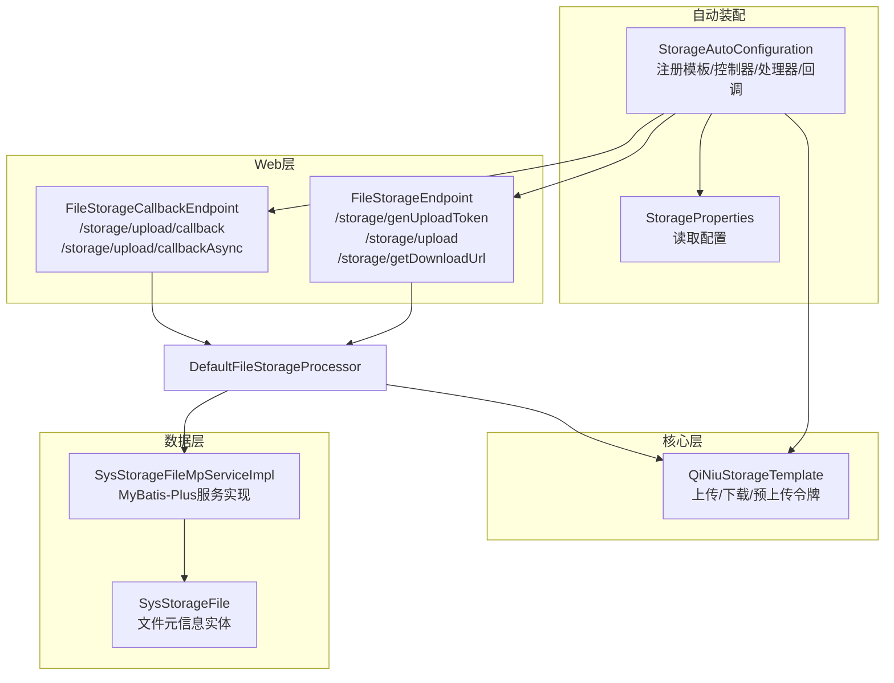
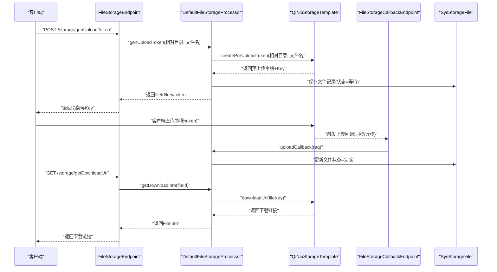
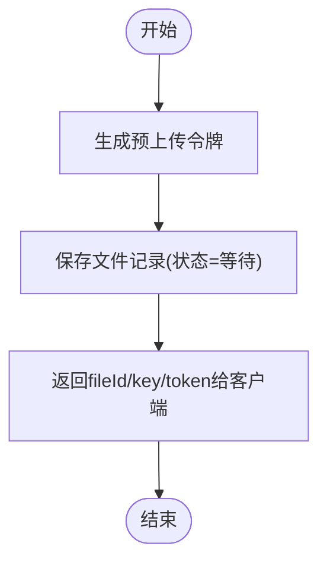
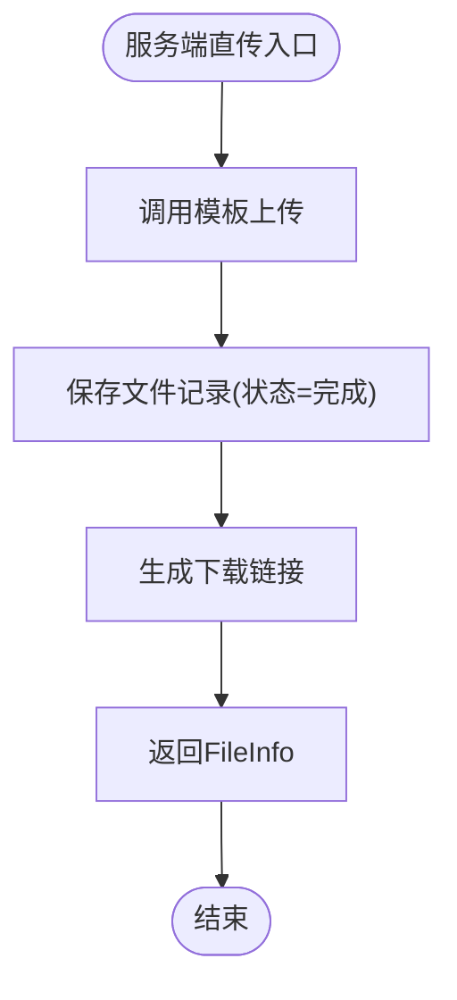
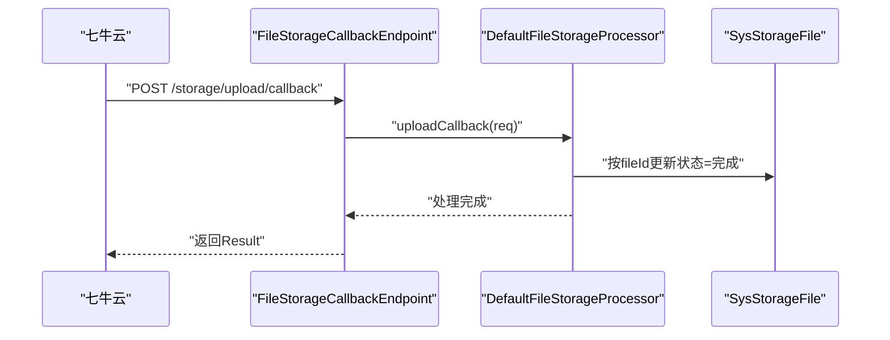
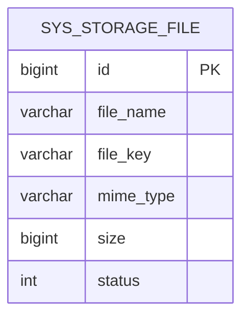
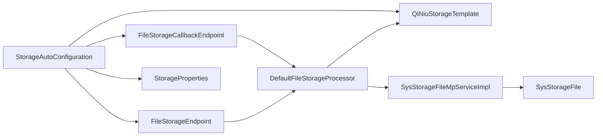

# 存储问题排查

<cite>
**本文引用的文件**
- [StorageAutoConfiguration.java](file://boot/storage-spring-boot-starter/src/main/java/com/kewen/framework/storage/boot/StorageAutoConfiguration.java)
- [StorageProperties.java](file://boot/storage-spring-boot-starter/src/main/java/com/kewen/framework/storage/boot/StorageProperties.java)
- [QiNiuStorageTemplate.java](file://boot/storage-spring-boot-starter/src/main/java/com/kewen/framework/storage/core/qiniu/QiNiuStorageTemplate.java)
- [FileStorageEndpoint.java](file://boot/storage-spring-boot-starter/src/main/java/com/kewen/framework/storage/web/FileStorageEndpoint.java)
- [FileStorageCallbackEndpoint.java](file://boot/storage-spring-boot-starter/src/main/java/com/kewen/framework/storage/web/FileStorageCallbackEndpoint.java)
- [DefaultFileStorageProcessor.java](file://boot/storage-spring-boot-starter/src/main/java/com/kewen/framework/storage/web/impl/DefaultFileStorageProcessor.java)
- [PreUploadTokenBO.java](file://boot/storage-spring-boot-starter/src/main/java/com/kewen/framework/storage/core/model/PreUploadTokenBO.java)
- [SysStorageFile.java](file://boot/storage-spring-boot-starter/src/main/java/com/kewen/framework/storage/web/mp/entity/SysStorageFile.java)
- [SysStorageFileMpServiceImpl.java](file://boot/storage-spring-boot-starter/src/main/java/com/kewen/framework/storage/web/mp/service/impl/SysStorageFileMpServiceImpl.java)
- [PreUploadTokenReq.java](file://boot/storage-spring-boot-starter/src/main/java/com/kewen/framework/storage/web/model/PreUploadTokenReq.java)
- [PreUploadTokenResp.java](file://boot/storage-spring-boot-starter/src/main/java/com/kewen/framework/storage/web/model/PreUploadTokenResp.java)
- [application.yml（示例）](file://sample/storage-boot-sample/src/main/resources/application.yml)
- [storage.sql](file://docs/sql/storage.sql)
</cite>

## 目录
1. [简介](#简介)
2. [项目结构](#项目结构)
3. [核心组件](#核心组件)
4. [架构总览](#架构总览)
5. [详细组件分析](#详细组件分析)
6. [依赖分析](#依赖分析)
7. [性能考虑](#性能考虑)
8. [故障排查指南](#故障排查指南)
9. [结论](#结论)
10. [附录](#附录)

## 简介
本指南面向kewen-framework的存储模块，聚焦于文件上传失败、回调处理异常、存储令牌获取失败、存储服务监控与日志分析，以及七牛云存储特有的问题排查（如CDN缓存、图片处理、空间管理）。文档基于代码库中的实际实现进行梳理，并提供可操作的诊断步骤与可视化流程图。

## 项目结构
存储相关模块位于 boot/storage-spring-boot-starter 中，采用“自动装配 + Web接口 + 核心模板 + MyBatis-Plus实体服务”的分层设计：
- 自动装配：注册存储模板、控制器、处理器、回调端点与MyBatis-Plus扫描路径
- Web层：提供生成上传令牌、服务端直传、下载链接查询、上传回调等REST接口
- 核心层：封装七牛云SDK，负责上传、下载链接生成、预上传令牌签发
- 数据层：持久化文件元信息，支持状态流转与批量查询

图表来源
- [StorageAutoConfiguration.java:23-70](file://boot/storage-spring-boot-starter/src/main/java/com/kewen/framework/storage/boot/StorageAutoConfiguration.java#L23-L70)
- [StorageProperties.java:12-44](file://boot/storage-spring-boot-starter/src/main/java/com/kewen/framework/storage/boot/StorageProperties.java#L12-L44)
- [QiNiuStorageTemplate.java:22-68](file://boot/storage-spring-boot-starter/src/main/java/com/kewen/framework/storage/core/qiniu/QiNiuStorageTemplate.java#L22-L68)
- [FileStorageEndpoint.java:25-87](file://boot/storage-spring-boot-starter/src/main/java/com/kewen/framework/storage/web/FileStorageEndpoint.java#L25-L87)
- [FileStorageCallbackEndpoint.java:19-65](file://boot/storage-spring-boot-starter/src/main/java/com/kewen/framework/storage/web/FileStorageCallbackEndpoint.java#L19-L65)
- [SysStorageFile.java:22-70](file://boot/storage-spring-boot-starter/src/main/java/com/kewen/framework/storage/web/mp/entity/SysStorageFile.java#L22-L70)
- [SysStorageFileMpServiceImpl.java:17-20](file://boot/storage-spring-boot-starter/src/main/java/com/kewen/framework/storage/web/mp/service/impl/SysStorageFileMpServiceImpl.java#L17-L20)

章节来源
- [StorageAutoConfiguration.java:23-70](file://boot/storage-spring-boot-starter/src/main/java/com/kewen/framework/storage/boot/StorageAutoConfiguration.java#L23-L70)
- [StorageProperties.java:12-44](file://boot/storage-spring-boot-starter/src/main/java/com/kewen/framework/storage/boot/StorageProperties.java#L12-L44)

## 核心组件
- 存储自动装配与模板
  - 自动装配注册存储模板、控制器、回调端点、处理器及Mapper扫描路径
  - 模板默认使用七牛云，构造上传管理器、鉴权对象、设置分片上传版本与下载域名策略
- 存储配置
  - 支持类型、AK/SK、存储桶、根路径、是否公开、下载域名、上传回调地址等关键参数
- 七牛云模板
  - 提供上传、下载链接生成、预上传令牌生成；上传策略包含回调地址、回调体、持久化处理通知地址等
- Web接口
  - 生成上传令牌、服务端直传、批量获取下载链接、上传回调（同步/异步）
- 处理器
  - 生成预上传令牌并落库，处理上传回调更新状态，服务端直传并返回下载信息
- 实体与服务
  - 文件元信息实体与MyBatis-Plus服务实现，支撑状态字段与批量查询

章节来源
- [StorageAutoConfiguration.java:37-69](file://boot/storage-spring-boot-starter/src/main/java/com/kewen/framework/storage/boot/StorageAutoConfiguration.java#L37-L69)
- [StorageProperties.java:12-44](file://boot/storage-spring-boot-starter/src/main/java/com/kewen/framework/storage/boot/StorageProperties.java#L12-L44)
- [QiNiuStorageTemplate.java:51-149](file://boot/storage-spring-boot-starter/src/main/java/com/kewen/framework/storage/core/qiniu/QiNiuStorageTemplate.java#L51-L149)
- [FileStorageEndpoint.java:25-87](file://boot/storage-spring-boot-starter/src/main/java/com/kewen/framework/storage/web/FileStorageEndpoint.java#L25-L87)
- [FileStorageCallbackEndpoint.java:19-65](file://boot/storage-spring-boot-starter/src/main/java/com/kewen/framework/storage/web/FileStorageCallbackEndpoint.java#L19-L65)
- [DefaultFileStorageProcessor.java:24-122](file://boot/storage-spring-boot-starter/src/main/java/com/kewen/framework/storage/web/impl/DefaultFileStorageProcessor.java#L24-L122)
- [SysStorageFile.java:22-70](file://boot/storage-spring-boot-starter/src/main/java/com/kewen/framework/storage/web/mp/entity/SysStorageFile.java#L22-L70)
- [SysStorageFileMpServiceImpl.java:17-20](file://boot/storage-spring-boot-starter/src/main/java/com/kewen/framework/storage/web/mp/service/impl/SysStorageFileMpServiceImpl.java#L17-L20)

## 架构总览
下图展示从客户端到服务端、再到七牛云的完整上传链路，以及回调处理与下载链接生成的关键节点。

图表来源
- [FileStorageEndpoint.java:40-79](file://boot/storage-spring-boot-starter/src/main/java/com/kewen/framework/storage/web/FileStorageEndpoint.java#L40-L79)
- [DefaultFileStorageProcessor.java:34-98](file://boot/storage-spring-boot-starter/src/main/java/com/kewen/framework/storage/web/impl/DefaultFileStorageProcessor.java#L34-L98)
- [QiNiuStorageTemplate.java:71-122](file://boot/storage-spring-boot-starter/src/main/java/com/kewen/framework/storage/core/qiniu/QiNiuStorageTemplate.java#L71-L122)
- [FileStorageCallbackEndpoint.java:33-63](file://boot/storage-spring-boot-starter/src/main/java/com/kewen/framework/storage/web/FileStorageCallbackEndpoint.java#L33-L63)
- [SysStorageFile.java:58-62](file://boot/storage-spring-boot-starter/src/main/java/com/kewen/framework/storage/web/mp/entity/SysStorageFile.java#L58-L62)

## 详细组件分析

### 上传令牌生成与签发
- 关键流程
  - 生成预上传令牌时，模板设置回调地址、回调体、回调体类型、持久化处理通知地址等策略
  - 处理器在返回令牌前先写入数据库，确保后续回调能定位到对应记录
- 常见问题
  - 回调地址未生效：检查配置项与模板策略是否一致
  - 令牌过期或被篡改：确认令牌有效期与客户端签名一致性
  - 文件Key冲突：检查rootPath与相对目录拼接规则

图表来源
- [QiNiuStorageTemplate.java:124-149](file://boot/storage-spring-boot-starter/src/main/java/com/kewen/framework/storage/core/qiniu/QiNiuStorageTemplate.java#L124-L149)
- [DefaultFileStorageProcessor.java:34-53](file://boot/storage-spring-boot-starter/src/main/java/com/kewen/framework/storage/web/impl/DefaultFileStorageProcessor.java#L34-L53)

章节来源
- [QiNiuStorageTemplate.java:124-149](file://boot/storage-spring-boot-starter/src/main/java/com/kewen/framework/storage/core/qiniu/QiNiuStorageTemplate.java#L124-L149)
- [DefaultFileStorageProcessor.java:34-53](file://boot/storage-spring-boot-starter/src/main/java/com/kewen/framework/storage/web/impl/DefaultFileStorageProcessor.java#L34-L53)

### 服务端直传与下载链接
- 关键流程
  - 服务端直传通过模板上传并返回UploadBO，随后持久化文件信息并生成下载链接
  - 下载链接根据是否公开空间选择直链或带有效期的私有链接
- 常见问题
  - 私有空间下载失败：确认下载域名与鉴权参数
  - 分片上传未启用：模板已设置V2版本，需确保客户端配合
  - 返回JSON解析异常：检查模板策略与响应体字段一致性

图表来源
- [QiNiuStorageTemplate.java:71-95](file://boot/storage-spring-boot-starter/src/main/java/com/kewen/framework/storage/core/qiniu/QiNiuStorageTemplate.java#L71-L95)
- [DefaultFileStorageProcessor.java:82-98](file://boot/storage-spring-boot-starter/src/main/java/com/kewen/framework/storage/web/impl/DefaultFileStorageProcessor.java#L82-L98)

章节来源
- [QiNiuStorageTemplate.java:71-95](file://boot/storage-spring-boot-starter/src/main/java/com/kewen/framework/storage/core/qiniu/QiNiuStorageTemplate.java#L71-L95)
- [DefaultFileStorageProcessor.java:82-98](file://boot/storage-spring-boot-starter/src/main/java/com/kewen/framework/storage/web/impl/DefaultFileStorageProcessor.java#L82-L98)

### 上传回调处理
- 同步回调
  - 服务端收到回调后更新文件状态为完成
- 异步回调
  - 用于持久化处理结果的通知，当前实现为接收并返回成功
- 常见问题
  - 回调地址配置错误：核对配置项与模板策略
  - 回调体字段不匹配：核对回调体类型与字段
  - 记录不存在：回调前应确保数据库已写入

图表来源
- [FileStorageCallbackEndpoint.java:33-42](file://boot/storage-spring-boot-starter/src/main/java/com/kewen/framework/storage/web/FileStorageCallbackEndpoint.java#L33-L42)
- [DefaultFileStorageProcessor.java:56-67](file://boot/storage-spring-boot-starter/src/main/java/com/kewen/framework/storage/web/impl/DefaultFileStorageProcessor.java#L56-L67)

章节来源
- [FileStorageCallbackEndpoint.java:33-42](file://boot/storage-spring-boot-starter/src/main/java/com/kewen/framework/storage/web/FileStorageCallbackEndpoint.java#L33-L42)
- [DefaultFileStorageProcessor.java:56-67](file://boot/storage-spring-boot-starter/src/main/java/com/kewen/framework/storage/web/impl/DefaultFileStorageProcessor.java#L56-L67)

### 数据模型与状态
- 文件实体包含文件名、Key、MIME类型、大小、状态等字段
- 状态枚举：0-等待上传、1-上传中、2-完成、3-失败
- 批量查询下载链接时，会根据实体集合生成FileInfo列表

图表来源
- [SysStorageFile.java:22-70](file://boot/storage-spring-boot-starter/src/main/java/com/kewen/framework/storage/web/mp/entity/SysStorageFile.java#L22-L70)

章节来源
- [SysStorageFile.java:22-70](file://boot/storage-spring-boot-starter/src/main/java/com/kewen/framework/storage/web/mp/entity/SysStorageFile.java#L22-L70)

## 依赖分析
- 组件耦合
  - 控制器依赖处理器；处理器依赖模板与持久化服务；模板依赖七牛云SDK
- 外部依赖
  - 七牛云SDK：上传、下载、鉴权、策略
  - MyBatis-Plus：文件记录的增删改查
- 配置依赖
  - 存储配置集中于StorageProperties，影响模板行为与回调策略

图表来源
- [StorageAutoConfiguration.java:23-70](file://boot/storage-spring-boot-starter/src/main/java/com/kewen/framework/storage/boot/StorageAutoConfiguration.java#L23-L70)
- [DefaultFileStorageProcessor.java:24-32](file://boot/storage-spring-boot-starter/src/main/java/com/kewen/framework/storage/web/impl/DefaultFileStorageProcessor.java#L24-L32)
- [SysStorageFileMpServiceImpl.java:17-20](file://boot/storage-spring-boot-starter/src/main/java/com/kewen/framework/storage/web/mp/service/impl/SysStorageFileMpServiceImpl.java#L17-L20)

章节来源
- [StorageAutoConfiguration.java:23-70](file://boot/storage-spring-boot-starter/src/main/java/com/kewen/framework/storage/boot/StorageAutoConfiguration.java#L23-L70)
- [DefaultFileStorageProcessor.java:24-32](file://boot/storage-spring-boot-starter/src/main/java/com/kewen/framework/storage/web/impl/DefaultFileStorageProcessor.java#L24-L32)

## 性能考虑
- 分片上传
  - 模板已启用V2分片上传版本，建议客户端配合断点续传以提升大文件稳定性
- 下载域名与私有空间
  - 私有空间生成带有效期的下载链接，合理设置过期时间避免频繁鉴权
- 回调与持久化
  - 回调成功后及时更新状态，减少重复处理与并发竞争

[本节为通用指导，无需列出具体文件来源]

## 故障排查指南

### 一、文件上传失败排查
- 网络与连通性
  - 使用curl或浏览器直接访问下载域名，确认可达性
  - 若为私有空间，确认下载域名与证书配置正确
- 存储配置错误
  - 核对accessKey/secretKey/bucket/rootPath/downloadDomain/isPublic等配置项
  - 对照示例配置文件进行逐项比对
- 权限不足
  - 确认存储桶权限与回调地址可访问
  - 检查回调地址所在服务器防火墙与安全组策略
- 七牛云特定问题
  - CDN缓存：修改文件名或Key后重试，或清理缓存
  - 图片处理：确认回调体字段与处理结果通知地址一致
  - 存储空间管理：检查配额与计费状态

章节来源
- [application.yml（示例）:10-17](file://sample/storage-boot-sample/src/main/resources/application.yml#L10-L17)
- [QiNiuStorageTemplate.java:124-149](file://boot/storage-spring-boot-starter/src/main/java/com/kewen/framework/storage/core/qiniu/QiNiuStorageTemplate.java#L124-L149)

### 二、回调处理异常排查
- 回调地址配置
  - 确认uploadCallbackUrl与模板策略一致
  - 检查回调端点路径与HTTP方法（同步回调为POST，异步回调为POST）
- 签名验证
  - 私有空间下载链接需带有效签名；若为客户端直传，需确保客户端签名与服务端策略一致
- 数据处理
  - 回调前数据库应存在对应记录；若fileId缺失，处理器会抛出异常
  - 核对回调体字段（如key、hash、bucket、size、mimeType、fileId）与模板策略一致

章节来源
- [FileStorageCallbackEndpoint.java:33-63](file://boot/storage-spring-boot-starter/src/main/java/com/kewen/framework/storage/web/FileStorageCallbackEndpoint.java#L33-L63)
- [DefaultFileStorageProcessor.java:56-67](file://boot/storage-spring-boot-starter/src/main/java/com/kewen/framework/storage/web/impl/DefaultFileStorageProcessor.java#L56-L67)
- [QiNiuStorageTemplate.java:124-149](file://boot/storage-spring-boot-starter/src/main/java/com/kewen/framework/storage/core/qiniu/QiNiuStorageTemplate.java#L124-L149)

### 三、存储令牌获取失败排查
- 令牌过期
  - 模板默认有效期较短，需在客户端尽快使用
- 签名错误
  - 确保客户端对上传策略签名与服务端一致
- 配额限制
  - 检查存储桶配额与请求频率，必要时调整策略或扩容

章节来源
- [QiNiuStorageTemplate.java:124-149](file://boot/storage-spring-boot-starter/src/main/java/com/kewen/framework/storage/core/qiniu/QiNiuStorageTemplate.java#L124-L149)
- [PreUploadTokenBO.java:14-17](file://boot/storage-spring-boot-starter/src/main/java/com/kewen/framework/storage/core/model/PreUploadTokenBO.java#L14-L17)

### 四、存储服务监控与日志分析
- 上传进度跟踪
  - 在处理器中增加状态流转埋点（等待/上传中/完成/失败），结合数据库状态字段进行追踪
- 错误统计
  - 统计回调失败、上传失败、下载失败等事件，定位高频问题
- 性能指标
  - 记录上传耗时、回调延迟、下载成功率等指标，结合日志分析瓶颈

章节来源
- [DefaultFileStorageProcessor.java:73-78](file://boot/storage-spring-boot-starter/src/main/java/com/kewen/framework/storage/web/impl/DefaultFileStorageProcessor.java#L73-L78)
- [SysStorageFile.java:58-62](file://boot/storage-spring-boot-starter/src/main/java/com/kewen/framework/storage/web/mp/entity/SysStorageFile.java#L58-L62)

### 五、七牛云存储特定问题排查
- CDN缓存
  - 修改文件名或Key后重试，或主动清理CDN缓存
- 图片处理
  - 确认回调体字段与处理结果通知地址一致，避免字段缺失导致回调失败
- 存储空间管理
  - 检查配额与计费状态，避免因限额导致上传失败

章节来源
- [QiNiuStorageTemplate.java:124-149](file://boot/storage-spring-boot-starter/src/main/java/com/kewen/framework/storage/core/qiniu/QiNiuStorageTemplate.java#L124-L149)

## 结论
本指南基于kewen-framework存储模块的实际实现，提供了从配置、上传、回调到监控的全链路排查方法。针对七牛云场景，重点在于回调地址一致性、签名策略与CDN缓存处理。建议在生产环境完善埋点与告警，结合日志与数据库状态进行快速定位与修复。

## 附录
- 示例配置文件位置
  - [application.yml（示例）:10-17](file://sample/storage-boot-sample/src/main/resources/application.yml#L10-L17)
- 数据库脚本位置
  - [storage.sql:1-45](file://docs/sql/storage.sql#L1-L45)