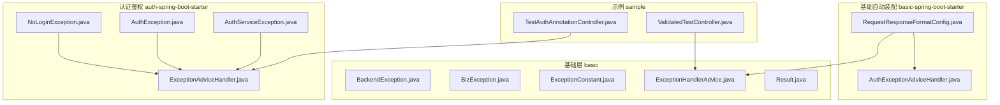
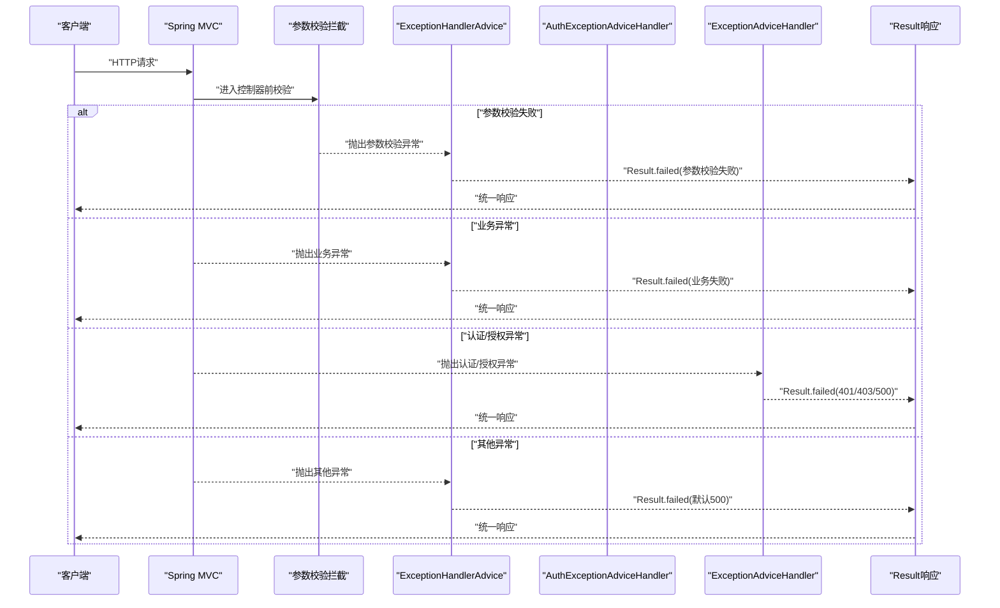
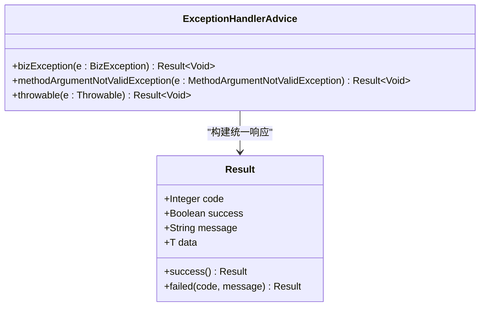
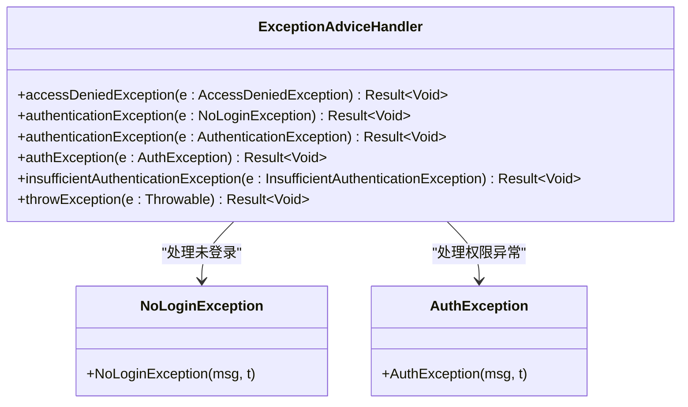
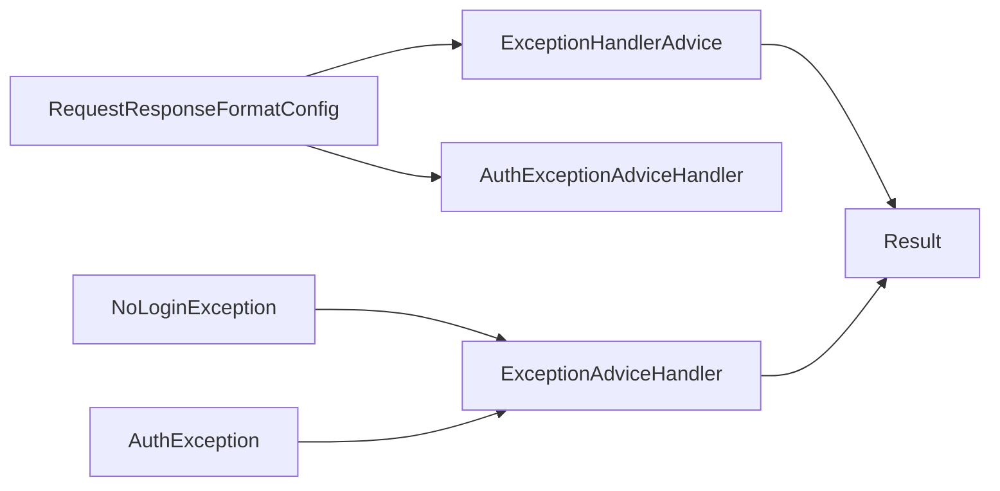

# 常见问题诊断

<cite>
**本文引用的文件**
- [basic/src/main/java/com/kewen/framework/basic/exception/BackendException.java](file://basic/src/main/java/com/kewen/framework/basic/exception/BackendException.java)
- [basic/src/main/java/com/kewen/framework/basic/exception/BizException.java](file://basic/src/main/java/com/kewen/framework/basic/exception/BizException.java)
- [basic/src/main/java/com/kewen/framework/basic/exception/ExceptionConstant.java](file://basic/src/main/java/com/kewen/framework/basic/exception/ExceptionConstant.java)
- [basic/src/main/java/com/kewen/framework/basic/exception/ExceptionHandlerAdvice.java](file://basic/src/main/java/com/kewen/framework/basic/exception/ExceptionHandlerAdvice.java)
- [basic/src/main/java/com/kewen/framework/basic/model/Result.java](file://basic/src/main/java/com/kewen/framework/basic/model/Result.java)
- [boot/basic-spring-boot-starter/src/main/java/com/kewen/framework/boot/basic/config/RequestResponseFormatConfig.java](file://boot/basic-spring-boot-starter/src/main/java/com/kewen/framework/boot/basic/config/RequestResponseFormatConfig.java)
- [boot/basic-spring-boot-starter/src/main/java/com/kewen/framework/boot/basic/handler/AuthExceptionAdviceHandler.java](file://boot/basic-spring-boot-starter/src/main/java/com/kewen/framework/boot/basic/handler/AuthExceptionAdviceHandler.java)
- [qy-auth/auth-spring-boot-starter/src/main/java/com/kewen/framework/auth/security/exception/NoLoginException.java](file://qy-auth/auth-spring-boot-starter/src/main/java/com/kewen/framework/auth/security/exception/NoLoginException.java)
- [qy-auth/auth-spring-boot-starter/src/main/java/com/kewen/framework/auth/security/handler/ExceptionAdviceHandler.java](file://qy-auth/auth-spring-boot-starter/src/main/java/com/kewen/framework/auth/security/handler/ExceptionAdviceHandler.java)
- [qy-auth/auth-core/src/main/java/com/kewen/framework/auth/core/exception/AuthException.java](file://qy-auth/auth-core/src/main/java/com/kewen/framework/auth/core/exception/AuthException.java)
- [qy-auth/auth-core/src/main/java/com/kewen/framework/auth/core/exception/AuthServiceException.java](file://qy-auth/auth-core/src/main/java/com/kewen/framework/auth/core/exception/AuthServiceException.java)
- [sample/auth-boot-sample/src/main/java/com/kewen/framework/auth/sample/controller/TestAuthAnnotationController.java](file://sample/auth-boot-sample/src/main/java/com/kewen/framework/auth/sample/controller/TestAuthAnnotationController.java)
- [sample/basic-boot-sample/src/main/java/com/kewen/framework/sample/basic/controller/ValidatedTestController.java](file://sample/basic-boot-sample/src/main/java/com/kewen/framework/sample/basic/controller/ValidatedTestController.java)
</cite>

## 目录
1. [简介](#简介)
2. [项目结构](#项目结构)
3. [核心组件](#核心组件)
4. [架构总览](#架构总览)
5. [详细组件分析](#详细组件分析)
6. [依赖分析](#依赖分析)
7. [性能考虑](#性能考虑)
8. [故障排查指南](#故障排查指南)
9. [结论](#结论)
10. [附录](#附录)

## 简介
本指南面向kewen-framework使用者与维护者，聚焦于系统中的异常处理与诊断流程。内容涵盖：
- 后端异常与业务异常的识别与处理
- 全局异常处理器的配置与优先级
- 错误码对照与常见错误快速修复
- 如何通过异常堆栈与上下文信息定位问题
- 权限验证失败、参数校验错误、数据访问异常等典型场景的诊断步骤与修复建议

## 项目结构
围绕异常处理的关键模块分布如下：
- 基础异常与统一响应模型位于basic模块
- 全局异常处理器在basic starter中注册
- 认证与授权异常处理器位于auth starter
- 示例应用展示了参数校验与权限注解的典型用法

图表来源
- [basic/src/main/java/com/kewen/framework/basic/exception/ExceptionHandlerAdvice.java:1-79](file://basic/src/main/java/com/kewen/framework/basic/exception/ExceptionHandlerAdvice.java#L1-L79)
- [boot/basic-spring-boot-starter/src/main/java/com/kewen/framework/boot/basic/config/RequestResponseFormatConfig.java:1-111](file://boot/basic-spring-boot-starter/src/main/java/com/kewen/framework/boot/basic/config/RequestResponseFormatConfig.java#L1-L111)
- [qy-auth/auth-spring-boot-starter/src/main/java/com/kewen/framework/auth/security/handler/ExceptionAdviceHandler.java:1-69](file://qy-auth/auth-spring-boot-starter/src/main/java/com/kewen/framework/auth/security/handler/ExceptionAdviceHandler.java#L1-L69)
- [qy-auth/auth-spring-boot-starter/src/main/java/com/kewen/framework/auth/security/exception/NoLoginException.java:1-15](file://qy-auth/auth-spring-boot-starter/src/main/java/com/kewen/framework/auth/security/exception/NoLoginException.java#L1-L15)
- [qy-auth/auth-core/src/main/java/com/kewen/framework/auth/core/exception/AuthException.java:1-24](file://qy-auth/auth-core/src/main/java/com/kewen/framework/auth/core/exception/AuthException.java#L1-L24)
- [qy-auth/auth-core/src/main/java/com/kewen/framework/auth/core/exception/AuthServiceException.java:1-17](file://qy-auth/auth-core/src/main/java/com/kewen/framework/auth/core/exception/AuthServiceException.java#L1-L17)
- [sample/basic-boot-sample/src/main/java/com/kewen/framework/sample/basic/controller/ValidatedTestController.java:1-23](file://sample/basic-boot-sample/src/main/java/com/kewen/framework/sample/basic/controller/ValidatedTestController.java#L1-L23)
- [sample/auth-boot-sample/src/main/java/com/kewen/framework/auth/sample/controller/TestAuthAnnotationController.java:1-109](file://sample/auth-boot-sample/src/main/java/com/kewen/framework/auth/sample/controller/TestAuthAnnotationController.java#L1-L109)

章节来源
- [basic/src/main/java/com/kewen/framework/basic/exception/ExceptionHandlerAdvice.java:1-79](file://basic/src/main/java/com/kewen/framework/basic/exception/ExceptionHandlerAdvice.java#L1-L79)
- [boot/basic-spring-boot-starter/src/main/java/com/kewen/framework/boot/basic/config/RequestResponseFormatConfig.java:1-111](file://boot/basic-spring-boot-starter/src/main/java/com/kewen/framework/boot/basic/config/RequestResponseFormatConfig.java#L1-L111)

## 核心组件
- 异常基类与业务异常
  - BackendException：后端通用运行时异常基类，提供多种构造方式
  - BizException：业务异常，继承自BackendException
  - ExceptionConstant：定义默认错误码常量（如业务失败、参数校验失败）
- 统一响应模型
  - Result：统一返回体，包含code、success、message、data字段，提供成功/失败静态工厂方法
- 全局异常处理器
  - ExceptionHandlerAdvice：Rest控制器增强，捕获业务异常、空指针、参数校验异常、全局异常，统一输出Result
  - AuthExceptionAdviceHandler：认证侧全局异常兜底
  - ExceptionAdviceHandler：安全框架异常处理（认证/授权/权限不足等），返回不同HTTP状态与错误码
- 自动装配与注册
  - RequestResponseFormatConfig：注册ExceptionHandlerAdvice与TraceResponseBodyAdvice，确保异常统一处理生效

章节来源
- [basic/src/main/java/com/kewen/framework/basic/exception/BackendException.java:1-31](file://basic/src/main/java/com/kewen/framework/basic/exception/BackendException.java#L1-L31)
- [basic/src/main/java/com/kewen/framework/basic/exception/BizException.java:1-28](file://basic/src/main/java/com/kewen/framework/basic/exception/BizException.java#L1-L28)
- [basic/src/main/java/com/kewen/framework/basic/exception/ExceptionConstant.java:1-14](file://basic/src/main/java/com/kewen/framework/basic/exception/ExceptionConstant.java#L1-L14)
- [basic/src/main/java/com/kewen/framework/basic/model/Result.java:1-49](file://basic/src/main/java/com/kewen/framework/basic/model/Result.java#L1-L49)
- [basic/src/main/java/com/kewen/framework/basic/exception/ExceptionHandlerAdvice.java:1-79](file://basic/src/main/java/com/kewen/framework/basic/exception/ExceptionHandlerAdvice.java#L1-L79)
- [boot/basic-spring-boot-starter/src/main/java/com/kewen/framework/boot/basic/handler/AuthExceptionAdviceHandler.java:1-22](file://boot/basic-spring-boot-starter/src/main/java/com/kewen/framework/boot/basic/handler/AuthExceptionAdviceHandler.java#L1-L22)
- [qy-auth/auth-spring-boot-starter/src/main/java/com/kewen/framework/auth/security/handler/ExceptionAdviceHandler.java:1-69](file://qy-auth/auth-spring-boot-starter/src/main/java/com/kewen/framework/auth/security/handler/ExceptionAdviceHandler.java#L1-L69)
- [boot/basic-spring-boot-starter/src/main/java/com/kewen/framework/boot/basic/config/RequestResponseFormatConfig.java:1-111](file://boot/basic-spring-boot-starter/src/main/java/com/kewen/framework/boot/basic/config/RequestResponseFormatConfig.java#L1-L111)

## 架构总览
全局异常处理链路由多个@RestControllerAdvice组成，按优先级与异常类型进行匹配：
- 参数校验异常：优先由ExceptionHandlerAdvice处理
- 业务异常：由ExceptionHandlerAdvice或AuthExceptionAdviceHandler处理
- 安全框架异常：由ExceptionAdviceHandler处理（认证/授权/权限不足）
- 其他未捕获异常：由ExceptionHandlerAdvice兜底

图表来源
- [basic/src/main/java/com/kewen/framework/basic/exception/ExceptionHandlerAdvice.java:1-79](file://basic/src/main/java/com/kewen/framework/basic/exception/ExceptionHandlerAdvice.java#L1-L79)
- [boot/basic-spring-boot-starter/src/main/java/com/kewen/framework/boot/basic/handler/AuthExceptionAdviceHandler.java:1-22](file://boot/basic-spring-boot-starter/src/main/java/com/kewen/framework/boot/basic/handler/AuthExceptionAdviceHandler.java#L1-L22)
- [qy-auth/auth-spring-boot-starter/src/main/java/com/kewen/framework/auth/security/handler/ExceptionAdviceHandler.java:1-69](file://qy-auth/auth-spring-boot-starter/src/main/java/com/kewen/framework/auth/security/handler/ExceptionAdviceHandler.java#L1-L69)

## 详细组件分析

### 组件A：全局异常处理器（ExceptionHandlerAdvice）
- 职责
  - 捕获业务异常（BizException）与空指针（NullPointerException）
  - 捕获参数校验异常（MethodArgumentNotValidException），拼接字段级错误
  - 捕获全局异常（Throwable），统一返回失败结果
- 关键点
  - 使用统一响应模型Result输出
  - 日志记录异常堆栈，便于定位
  - 与自动装配配置结合，确保生效

图表来源
- [basic/src/main/java/com/kewen/framework/basic/exception/ExceptionHandlerAdvice.java:1-79](file://basic/src/main/java/com/kewen/framework/basic/exception/ExceptionHandlerAdvice.java#L1-L79)
- [basic/src/main/java/com/kewen/framework/basic/model/Result.java:1-49](file://basic/src/main/java/com/kewen/framework/basic/model/Result.java#L1-L49)

章节来源
- [basic/src/main/java/com/kewen/framework/basic/exception/ExceptionHandlerAdvice.java:1-79](file://basic/src/main/java/com/kewen/framework/basic/exception/ExceptionHandlerAdvice.java#L1-L79)
- [basic/src/main/java/com/kewen/framework/basic/model/Result.java:1-49](file://basic/src/main/java/com/kewen/framework/basic/model/Result.java#L1-L49)

### 组件B：认证/授权异常处理器（ExceptionAdviceHandler）
- 职责
  - 处理访问拒绝（401）、未登录（401）、认证异常（403）、权限不足（401提示提升）、内部认证服务异常（500）
  - 对AuthException进行统一处理
- 关键点
  - 显式设置HTTP状态码
  - 使用Result输出统一响应

图表来源
- [qy-auth/auth-spring-boot-starter/src/main/java/com/kewen/framework/auth/security/handler/ExceptionAdviceHandler.java:1-69](file://qy-auth/auth-spring-boot-starter/src/main/java/com/kewen/framework/auth/security/handler/ExceptionAdviceHandler.java#L1-L69)
- [qy-auth/auth-spring-boot-starter/src/main/java/com/kewen/framework/auth/security/exception/NoLoginException.java:1-15](file://qy-auth/auth-spring-boot-starter/src/main/java/com/kewen/framework/auth/security/exception/NoLoginException.java#L1-L15)
- [qy-auth/auth-core/src/main/java/com/kewen/framework/auth/core/exception/AuthException.java:1-24](file://qy-auth/auth-core/src/main/java/com/kewen/framework/auth/core/exception/AuthException.java#L1-L24)

章节来源
- [qy-auth/auth-spring-boot-starter/src/main/java/com/kewen/framework/auth/security/handler/ExceptionAdviceHandler.java:1-69](file://qy-auth/auth-spring-boot-starter/src/main/java/com/kewen/framework/auth/security/handler/ExceptionAdviceHandler.java#L1-L69)
- [qy-auth/auth-spring-boot-starter/src/main/java/com/kewen/framework/auth/security/exception/NoLoginException.java:1-15](file://qy-auth/auth-spring-boot-starter/src/main/java/com/kewen/framework/auth/security/exception/NoLoginException.java#L1-L15)
- [qy-auth/auth-core/src/main/java/com/kewen/framework/auth/core/exception/AuthException.java:1-24](file://qy-auth/auth-core/src/main/java/com/kewen/framework/auth/core/exception/AuthException.java#L1-L24)

### 组件C：认证侧全局异常兜底（AuthExceptionAdviceHandler）
- 职责
  - 作为认证侧的全局兜底异常处理器，统一返回业务失败
- 关键点
  - 与业务侧ExceptionHandlerAdvice配合，避免重复处理

章节来源
- [boot/basic-spring-boot-starter/src/main/java/com/kewen/framework/boot/basic/handler/AuthExceptionAdviceHandler.java:1-22](file://boot/basic-spring-boot-starter/src/main/java/com/kewen/framework/boot/basic/handler/AuthExceptionAdviceHandler.java#L1-L22)

### 组件D：参数校验与权限注解示例
- 参数校验示例
  - ValidatedTestController：使用@Validated对请求体进行参数校验，触发ExceptionHandlerAdvice中的参数校验分支
- 权限注解示例
  - TestAuthAnnotationController：使用AuthDataRange、AuthDataOperation、AuthMenu等注解，若权限不足将由ExceptionAdviceHandler处理

章节来源
- [sample/basic-boot-sample/src/main/java/com/kewen/framework/sample/basic/controller/ValidatedTestController.java:1-23](file://sample/basic-boot-sample/src/main/java/com/kewen/framework/sample/basic/controller/ValidatedTestController.java#L1-L23)
- [sample/auth-boot-sample/src/main/java/com/kewen/framework/auth/sample/controller/TestAuthAnnotationController.java:1-109](file://sample/auth-boot-sample/src/main/java/com/kewen/framework/auth/sample/controller/TestAuthAnnotationController.java#L1-L109)

## 依赖分析
- 组件耦合
  - ExceptionHandlerAdvice依赖Result与ExceptionConstant，用于统一响应与错误码
  - RequestResponseFormatConfig负责注册ExceptionHandlerAdvice与TraceResponseBodyAdvice，保证异常处理生效
  - ExceptionAdviceHandler依赖NoLoginException与AuthException，处理认证/授权场景
- 优先级与覆盖
  - 参数校验异常优先被ExceptionHandlerAdvice处理
  - 认证/授权异常由ExceptionAdviceHandler处理
  - 业务异常可由ExceptionHandlerAdvice或AuthExceptionAdviceHandler处理，需避免重复处理
- 可能的循环与冲突
  - 多个@RestControllerAdvice同时存在时，需关注异常类型匹配顺序与职责边界

图表来源
- [boot/basic-spring-boot-starter/src/main/java/com/kewen/framework/boot/basic/config/RequestResponseFormatConfig.java:1-111](file://boot/basic-spring-boot-starter/src/main/java/com/kewen/framework/boot/basic/config/RequestResponseFormatConfig.java#L1-L111)
- [basic/src/main/java/com/kewen/framework/basic/exception/ExceptionHandlerAdvice.java:1-79](file://basic/src/main/java/com/kewen/framework/basic/exception/ExceptionHandlerAdvice.java#L1-L79)
- [boot/basic-spring-boot-starter/src/main/java/com/kewen/framework/boot/basic/handler/AuthExceptionAdviceHandler.java:1-22](file://boot/basic-spring-boot-starter/src/main/java/com/kewen/framework/boot/basic/handler/AuthExceptionAdviceHandler.java#L1-L22)
- [qy-auth/auth-spring-boot-starter/src/main/java/com/kewen/framework/auth/security/handler/ExceptionAdviceHandler.java:1-69](file://qy-auth/auth-spring-boot-starter/src/main/java/com/kewen/framework/auth/security/handler/ExceptionAdviceHandler.java#L1-L69)
- [qy-auth/auth-spring-boot-starter/src/main/java/com/kewen/framework/auth/security/exception/NoLoginException.java:1-15](file://qy-auth/auth-spring-boot-starter/src/main/java/com/kewen/framework/auth/security/exception/NoLoginException.java#L1-L15)
- [qy-auth/auth-core/src/main/java/com/kewen/framework/auth/core/exception/AuthException.java:1-24](file://qy-auth/auth-core/src/main/java/com/kewen/framework/auth/core/exception/AuthException.java#L1-L24)
- [basic/src/main/java/com/kewen/framework/basic/model/Result.java:1-49](file://basic/src/main/java/com/kewen/framework/basic/model/Result.java#L1-L49)

## 性能考虑
- 异常处理的开销主要体现在日志记录与对象序列化上，建议：
  - 在生产环境合理设置日志级别，避免过多堆栈输出
  - 控制异常消息长度，避免超长字符串影响序列化性能
  - 对高频异常场景进行缓存或降级处理

## 故障排查指南

### 1. 权限验证失败（认证/授权异常）
- 现象
  - 返回401/403/401提示提升等错误码
- 诊断步骤
  - 检查是否抛出AccessDeniedException、NoLoginException、AuthenticationException、InsufficientAuthenticationException
  - 查看ExceptionAdviceHandler的处理逻辑与HTTP状态码映射
- 快速修复
  - 确认用户已登录且令牌有效
  - 检查权限配置与注解使用（如AuthDataRange、AuthMenu等）
  - 若为权限不足，引导用户重新登录或申请更高权限

章节来源
- [qy-auth/auth-spring-boot-starter/src/main/java/com/kewen/framework/auth/security/handler/ExceptionAdviceHandler.java:1-69](file://qy-auth/auth-spring-boot-starter/src/main/java/com/kewen/framework/auth/security/handler/ExceptionAdviceHandler.java#L1-L69)
- [qy-auth/auth-spring-boot-starter/src/main/java/com/kewen/framework/auth/security/exception/NoLoginException.java:1-15](file://qy-auth/auth-spring-boot-starter/src/main/java/com/kewen/framework/auth/security/exception/NoLoginException.java#L1-L15)
- [qy-auth/auth-core/src/main/java/com/kewen/framework/auth/core/exception/AuthException.java:1-24](file://qy-auth/auth-core/src/main/java/com/kewen/framework/auth/core/exception/AuthException.java#L1-L24)
- [sample/auth-boot-sample/src/main/java/com/kewen/framework/auth/sample/controller/TestAuthAnnotationController.java:1-109](file://sample/auth-boot-sample/src/main/java/com/kewen/framework/auth/sample/controller/TestAuthAnnotationController.java#L1-L109)

### 2. 参数校验错误
- 现象
  - 返回参数校验失败，包含字段级错误信息
- 诊断步骤
  - 触发ValidatedTestController中的@Validated接口
  - 查看ExceptionHandlerAdvice对MethodArgumentNotValidException的处理
- 快速修复
  - 按照返回的字段与提示修正请求参数
  - 确保请求体符合实体类的校验注解约束

章节来源
- [sample/basic-boot-sample/src/main/java/com/kewen/framework/sample/basic/controller/ValidatedTestController.java:1-23](file://sample/basic-boot-sample/src/main/java/com/kewen/framework/sample/basic/controller/ValidatedTestController.java#L1-L23)
- [basic/src/main/java/com/kewen/framework/basic/exception/ExceptionHandlerAdvice.java:1-79](file://basic/src/main/java/com/kewen/framework/basic/exception/ExceptionHandlerAdvice.java#L1-L79)

### 3. 业务异常（BizException）
- 现象
  - 返回业务失败，错误码通常为业务侧定义值
- 诊断步骤
  - 捕获BizException或其子类，查看日志与消息
  - 确认是否由业务逻辑显式抛出
- 快速修复
  - 根据异常消息调整业务参数或状态
  - 如涉及并发或幂等性，检查重试与去重策略

章节来源
- [basic/src/main/java/com/kewen/framework/basic/exception/BizException.java:1-28](file://basic/src/main/java/com/kewen/framework/basic/exception/BizException.java#L1-L28)
- [basic/src/main/java/com/kewen/framework/basic/exception/ExceptionHandlerAdvice.java:1-79](file://basic/src/main/java/com/kewen/framework/basic/exception/ExceptionHandlerAdvice.java#L1-L79)

### 4. 后端异常（BackendException）
- 现象
  - 通用运行时异常，通常作为业务异常或系统异常的基类
- 诊断步骤
  - 检查异常堆栈，确认是否为受控异常
  - 区分是业务异常还是系统异常
- 快速修复
  - 将受控异常明确为BizException或AuthException
  - 对不可预期异常进行告警与熔断

章节来源
- [basic/src/main/java/com/kewen/framework/basic/exception/BackendException.java:1-31](file://basic/src/main/java/com/kewen/framework/basic/exception/BackendException.java#L1-L31)

### 5. 数据访问异常（MyBatis/数据库）
- 现象
  - 数据库访问失败、连接异常、SQL执行异常
- 诊断步骤
  - 查看异常堆栈中的数据访问层调用链
  - 结合日志与TraceId定位请求链路
- 快速修复
  - 检查数据库连通性与SQL语法
  - 对热点查询增加索引或优化分页
  - 对高并发场景引入重试与隔离策略

### 6. 异常堆栈定位与上下文信息
- 定位要点
  - 从ExceptionHandlerAdvice的日志开始，逐层回溯到具体业务方法
  - 关注TraceId与请求日志，串联一次请求的完整链路
- 上下文信息
  - 请求参数、用户身份、租户信息（如适用）
  - SQL执行计划与慢查询日志

章节来源
- [basic/src/main/java/com/kewen/framework/basic/exception/ExceptionHandlerAdvice.java:1-79](file://basic/src/main/java/com/kewen/framework/basic/exception/ExceptionHandlerAdvice.java#L1-L79)
- [boot/basic-spring-boot-starter/src/main/java/com/kewen/framework/boot/basic/config/RequestResponseFormatConfig.java:1-111](file://boot/basic-spring-boot-starter/src/main/java/com/kewen/framework/boot/basic/config/RequestResponseFormatConfig.java#L1-L111)

## 结论
kewen-framework通过多层全局异常处理器实现了统一的异常处理与响应格式，配合Result模型与自动装配配置，能够快速定位与修复问题。建议在实际使用中：
- 明确区分业务异常与系统异常，避免混用
- 合理使用参数校验与权限注解，减少无效请求
- 建立完善的日志与追踪体系，提升排障效率

## 附录

### 错误码对照表
- 业务失败：参考业务侧错误码（例如业务异常默认值）
- 参数校验失败：参考参数校验异常处理返回值
- 未登录/会话失效：401
- 权限不足：401（提示提升）
- 访问拒绝：403
- 认证异常：403
- 内部认证服务异常：500
- 其他未捕获异常：500

章节来源
- [basic/src/main/java/com/kewen/framework/basic/exception/ExceptionConstant.java:1-14](file://basic/src/main/java/com/kewen/framework/basic/exception/ExceptionConstant.java#L1-L14)
- [basic/src/main/java/com/kewen/framework/basic/exception/ExceptionHandlerAdvice.java:1-79](file://basic/src/main/java/com/kewen/framework/basic/exception/ExceptionHandlerAdvice.java#L1-L79)
- [qy-auth/auth-spring-boot-starter/src/main/java/com/kewen/framework/auth/security/handler/ExceptionAdviceHandler.java:1-69](file://qy-auth/auth-spring-boot-starter/src/main/java/com/kewen/framework/auth/security/handler/ExceptionAdviceHandler.java#L1-L69)