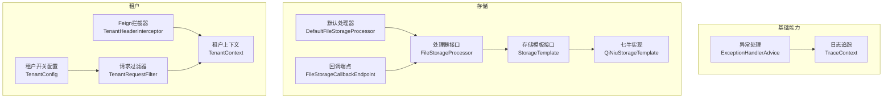
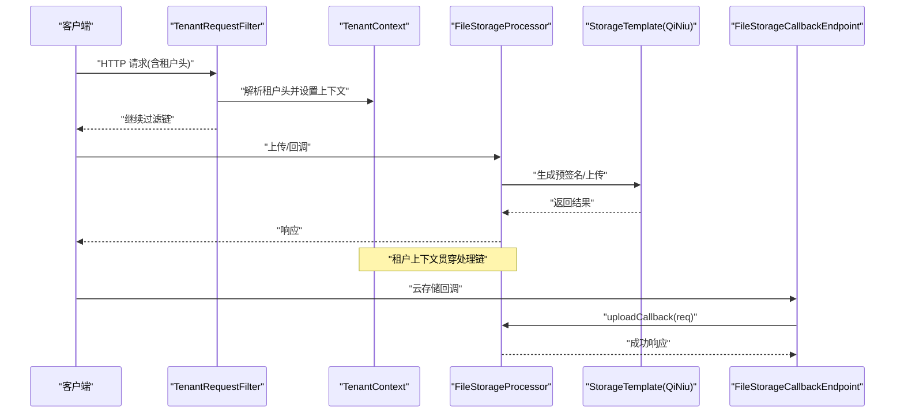
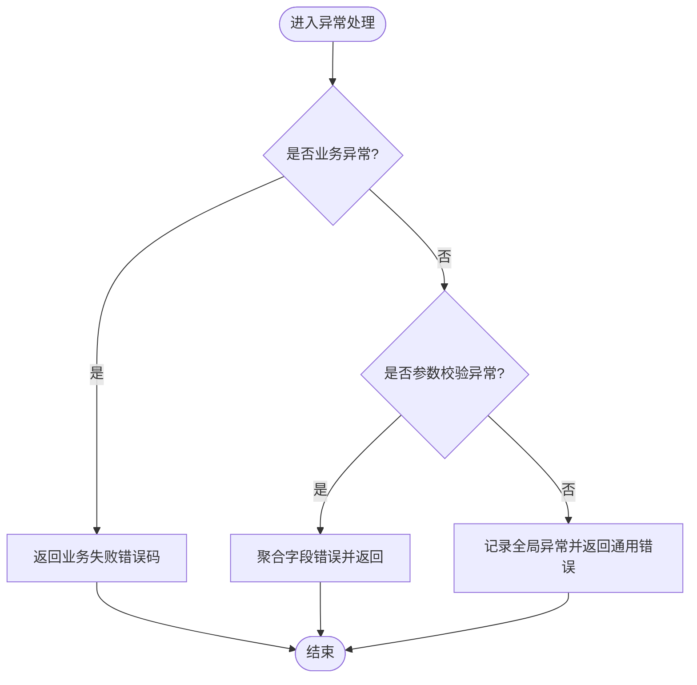
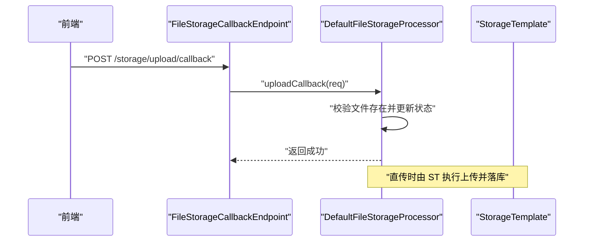
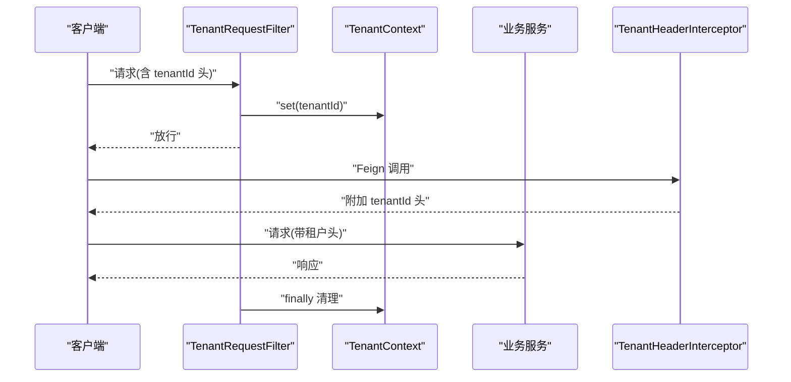
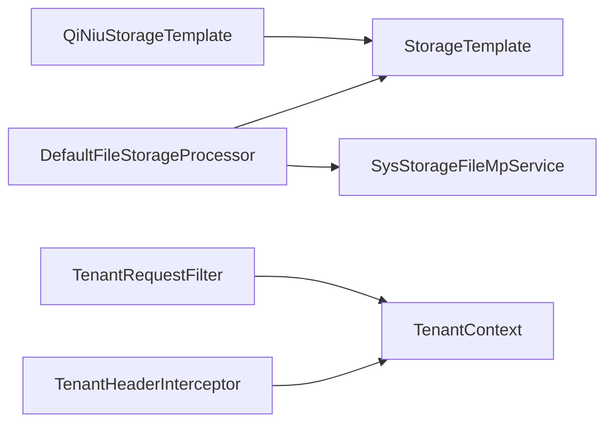

# 故障排除

<cite>
**本文引用的文件**
- [application.yml](file://application.yml)
- [ExceptionConstant.java](file://basic/src/main/java/com/kewen/framework/basic/exception/ExceptionConstant.java)
- [BizException.java](file://basic/src/main/java/com/kewen/framework/basic/exception/BizException.java)
- [BackendException.java](file://basic/src/main/java/com/kewen/framework/basic/exception/BackendException.java)
- [ExceptionHandlerAdvice.java](file://basic/src/main/java/com/kewen/framework/basic/exception/ExceptionHandlerAdvice.java)
- [TraceContext.java](file://basic/src/main/java/com/kewen/framework/basic/logger/trace/TraceContext.java)
- [logback-spring.xml（认证示例）](file://sample/auth-boot-sample/src/main/resources/logback-spring.xml)
- [logback-spring.xml（IDAAS示例）](file://sample/idaas-sp-boot-sample/src/main/resources/logback-spring.xml)
- [StorageTemplate.java](file://boot/storage-spring-boot-starter/src/main/java/com/kewen/framework/storage/core/StorageTemplate.java)
- [QiNiuStorageTemplate.java](file://boot/storage-spring-boot-starter/src/main/java/com/kewen/framework/storage/core/qiniu/QiNiuStorageTemplate.java)
- [FileStorageProcessor.java](file://boot/storage-spring-boot-starter/src/main/java/com/kewen/framework/storage/web/FileStorageProcessor.java)
- [DefaultFileStorageProcessor.java](file://boot/storage-spring-boot-starter/src/main/java/com/kewen/framework/storage/web/impl/DefaultFileStorageProcessor.java)
- [FileStorageCallbackEndpoint.java](file://boot/storage-spring-boot-starter/src/main/java/com/kewen/framework/storage/web/FileStorageCallbackEndpoint.java)
- [UploadCallbackReq.java](file://boot/storage-spring-boot-starter/src/main/java/com/kewen/framework/storage/web/model/UploadCallbackReq.java)
- [TenantContext.java](file://boot/tenant-spring-boot-starter/src/main/java/com/kewen/framework/tenant/TenantContext.java)
- [TenantRequestFilter.java](file://boot/tenant-spring-boot-starter/src/main/java/com/kewen/framework/tenant/TenantRequestFilter.java)
- [TenantHeaderInterceptor.java](file://boot/tenant-spring-boot-starter/src/main/java/com/kewen/framework/tenant/feign/TenantHeaderInterceptor.java)
- [TenantConfig.java](file://boot/tenant-spring-boot-starter/src/main/java/com/kewen/framework/tenant/config/TenantConfig.java)
- [TenantConstant.java](file://boot/tenant-spring-boot-starter/src/main/java/com/kewen/framework/tenant/TenantConstant.java)
- [additional-spring-configuration-metadata.json（租户）](file://boot/tenant-spring-boot-starter/src/main/resources/META-INF/additional-spring-configuration-metadata.json)
- [TenantController.java（示例）](file://sample/tenant-boot-sample/src/main/java/com/kewen/framework/sample/tenant/controller/TenantController.java)
- [KP6SpyDriver.java（basic starter）](file://boot/basic-spring-boot-starter/src/main/java/com/kewen/framework/boot/basic/p6spy/KP6SpyDriver.java)
- [JdbcEventListenerFactoryLoader.java](file://boot/basic-spring-boot-starter/src/main/java/com/kewen/framework/boot/basic/p6spy/JdbcEventListenerFactoryLoader.java)
- [KP6SpyDriver.java（auth sample）](file://sample/auth-boot-sample/src/main/java/com/kewen/framework/auth/sample/p6spy/KP6SpyDriver.java)
</cite>

## 目录
1. [简介](#简介)
2. [项目结构](#项目结构)
3. [核心组件](#核心组件)
4. [架构总览](#架构总览)
5. [详细组件分析](#详细组件分析)
6. [依赖分析](#依赖分析)
7. [性能考虑](#性能考虑)
8. [故障排除指南](#故障排除指南)
9. [结论](#结论)
10. [附录](#附录)

## 简介
本指南面向开发者与运维人员，聚焦于 kewen-framework 在权限、文件存储、多租户三大领域的常见问题与排障方法。内容涵盖：
- 权限相关：权限验证失败、RBAC 配置错误、菜单/数据权限未生效等
- 文件存储：上传失败、回调异常、存储配置错误、下载链接无效等
- 多租户：租户上下文丢失、请求头未透传、数据隔离失效等
- 日志与调试：日志级别设置、MDC 追踪、关键日志定位
- 性能分析：慢查询定位、连接池与驱动包装、SQL 观察
- 错误码与解决方案：统一异常处理与错误码映射

## 项目结构
围绕“故障排除”目标，以下模块与文件最为关键：
- 异常与日志：basic 模块的异常统一处理与日志追踪
- 存储：storage-spring-boot-starter 的上传、回调、下载流程
- 租户：tenant-spring-boot-starter 的上下文、过滤器与 Feign 拦截器
- 安全与配置：application.yml 中的安全与会话配置

图表来源
- [ExceptionHandlerAdvice.java:20-78](file://basic/src/main/java/com/kewen/framework/basic/exception/ExceptionHandlerAdvice.java#L20-L78)
- [TraceContext.java:11-21](file://basic/src/main/java/com/kewen/framework/basic/logger/trace/TraceContext.java#L11-L21)
- [StorageTemplate.java:14-23](file://boot/storage-spring-boot-starter/src/main/java/com/kewen/framework/storage/core/StorageTemplate.java#L14-L23)
- [QiNiuStorageTemplate.java:43-75](file://boot/storage-spring-boot-starter/src/main/java/com/kewen/framework/storage/core/qiniu/QiNiuStorageTemplate.java#L43-L75)
- [FileStorageProcessor.java:15-54](file://boot/storage-spring-boot-starter/src/main/java/com/kewen/framework/storage/web/FileStorageProcessor.java#L15-L54)
- [DefaultFileStorageProcessor.java:24-122](file://boot/storage-spring-boot-starter/src/main/java/com/kewen/framework/storage/web/impl/DefaultFileStorageProcessor.java#L24-L122)
- [FileStorageCallbackEndpoint.java:22-63](file://boot/storage-spring-boot-starter/src/main/java/com/kewen/framework/storage/web/FileStorageCallbackEndpoint.java#L22-L63)
- [TenantContext.java:8-39](file://boot/tenant-spring-boot-starter/src/main/java/com/kewen/framework/tenant/TenantContext.java#L8-L39)
- [TenantRequestFilter.java:20-36](file://boot/tenant-spring-boot-starter/src/main/java/com/kewen/framework/tenant/TenantRequestFilter.java#L20-L36)
- [TenantHeaderInterceptor.java:22-31](file://boot/tenant-spring-boot-starter/src/main/java/com/kewen/framework/tenant/feign/TenantHeaderInterceptor.java#L22-L31)
- [TenantConfig.java:14-21](file://boot/tenant-spring-boot-starter/src/main/java/com/kewen/framework/tenant/config/TenantConfig.java#L14-L21)

章节来源
- [application.yml:1-32](file://application.yml#L1-L32)

## 核心组件
- 异常处理与错误码
  - 统一异常处理：捕获业务异常、参数校验异常、全局异常，返回标准 Result 结构
  - 错误码常量：业务失败、参数校验失败
- 日志追踪
  - MDC 透传 traceId，结合 Logback 模式输出，便于跨服务串联
- 存储组件
  - 接口定义上传、下载、预签名令牌生成
  - 默认处理器负责回调状态更新与文件元信息落库
  - 回调端点接收第三方云存储回调并触发处理
- 租户组件
  - 上下文 ThreadLocal 存储租户 ID
  - 请求过滤器从请求头读取并注入上下文
  - Feign 拦截器自动透传租户头到下游服务

章节来源
- [ExceptionHandlerAdvice.java:20-78](file://basic/src/main/java/com/kewen/framework/basic/exception/ExceptionHandlerAdvice.java#L20-L78)
- [ExceptionConstant.java:10-13](file://basic/src/main/java/com/kewen/framework/basic/exception/ExceptionConstant.java#L10-L13)
- [TraceContext.java:11-21](file://basic/src/main/java/com/kewen/framework/basic/logger/trace/TraceContext.java#L11-L21)
- [StorageTemplate.java:14-23](file://boot/storage-spring-boot-starter/src/main/java/com/kewen/framework/storage/core/StorageTemplate.java#L14-L23)
- [DefaultFileStorageProcessor.java:24-122](file://boot/storage-spring-boot-starter/src/main/java/com/kewen/framework/storage/web/impl/DefaultFileStorageProcessor.java#L24-L122)
- [FileStorageCallbackEndpoint.java:22-63](file://boot/storage-spring-boot-starter/src/main/java/com/kewen/framework/storage/web/FileStorageCallbackEndpoint.java#L22-L63)
- [TenantContext.java:8-39](file://boot/tenant-spring-boot-starter/src/main/java/com/kewen/framework/tenant/TenantContext.java#L8-L39)
- [TenantRequestFilter.java:20-36](file://boot/tenant-spring-boot-starter/src/main/java/com/kewen/framework/tenant/TenantRequestFilter.java#L20-L36)
- [TenantHeaderInterceptor.java:22-31](file://boot/tenant-spring-boot-starter/src/main/java/com/kewen/framework/tenant/feign/TenantHeaderInterceptor.java#L22-L31)

## 架构总览
下图展示从客户端到存储与租户的关键交互路径，以及异常与日志如何贯穿系统。

图表来源
- [TenantRequestFilter.java:22-34](file://boot/tenant-spring-boot-starter/src/main/java/com/kewen/framework/tenant/TenantRequestFilter.java#L22-L34)
- [TenantContext.java:20-30](file://boot/tenant-spring-boot-starter/src/main/java/com/kewen/framework/tenant/TenantContext.java#L20-L30)
- [FileStorageProcessor.java:15-54](file://boot/storage-spring-boot-starter/src/main/java/com/kewen/framework/storage/web/FileStorageProcessor.java#L15-L54)
- [QiNiuStorageTemplate.java:70-75](file://boot/storage-spring-boot-starter/src/main/java/com/kewen/framework/storage/core/qiniu/QiNiuStorageTemplate.java#L70-L75)
- [FileStorageCallbackEndpoint.java:33-42](file://boot/storage-spring-boot-starter/src/main/java/com/kewen/framework/storage/web/FileStorageCallbackEndpoint.java#L33-L42)

## 详细组件分析

### 权限与异常处理
- 统一异常处理
  - 捕获业务异常与空指针，返回固定错误码与消息
  - 参数校验异常聚合字段错误并返回
  - 全局异常兜底记录日志并返回通用错误
- 错误码
  - 业务失败、参数校验失败均映射为统一错误码
- 建议
  - 业务侧抛出 BizException 或其子类，确保统一格式
  - 对外暴露的异常应尽量包含明确的用户可读提示

图表来源
- [ExceptionHandlerAdvice.java:29-76](file://basic/src/main/java/com/kewen/framework/basic/exception/ExceptionHandlerAdvice.java#L29-L76)
- [ExceptionConstant.java:10-13](file://basic/src/main/java/com/kewen/framework/basic/exception/ExceptionConstant.java#L10-L13)

章节来源
- [ExceptionHandlerAdvice.java:20-78](file://basic/src/main/java/com/kewen/framework/basic/exception/ExceptionHandlerAdvice.java#L20-L78)
- [ExceptionConstant.java:10-13](file://basic/src/main/java/com/kewen/framework/basic/exception/ExceptionConstant.java#L10-L13)
- [BizException.java:8-27](file://basic/src/main/java/com/kewen/framework/basic/exception/BizException.java#L8-L27)
- [BackendException.java:8-30](file://basic/src/main/java/com/kewen/framework/basic/exception/BackendException.java#L8-L30)

### 文件存储与回调
- 关键流程
  - 生成预签名令牌并落库，返回给前端直传
  - 云存储完成后回调服务端，更新文件状态
  - 支持服务端直传与批量下载信息查询
- 常见问题定位
  - 上传失败：检查回调端点是否可达、回调参数是否完整、存储实现配置
  - 回调异常：确认回调请求体字段与 UploadCallbackReq 匹配、处理器是否正确更新状态
  - 下载链接无效：确认下载域名与存储实现的 downloadUrl 生成策略一致

图表来源
- [FileStorageCallbackEndpoint.java:33-42](file://boot/storage-spring-boot-starter/src/main/java/com/kewen/framework/storage/web/FileStorageCallbackEndpoint.java#L33-L42)
- [DefaultFileStorageProcessor.java:56-67](file://boot/storage-spring-boot-starter/src/main/java/com/kewen/framework/storage/web/impl/DefaultFileStorageProcessor.java#L56-L67)
- [UploadCallbackReq.java:10-18](file://boot/storage-spring-boot-starter/src/main/java/com/kewen/framework/storage/web/model/UploadCallbackReq.java#L10-L18)
- [StorageTemplate.java:14-23](file://boot/storage-spring-boot-starter/src/main/java/com/kewen/framework/storage/core/StorageTemplate.java#L14-L23)

章节来源
- [FileStorageProcessor.java:15-54](file://boot/storage-spring-boot-starter/src/main/java/com/kewen/framework/storage/web/FileStorageProcessor.java#L15-L54)
- [DefaultFileStorageProcessor.java:24-122](file://boot/storage-spring-boot-starter/src/main/java/com/kewen/framework/storage/web/impl/DefaultFileStorageProcessor.java#L24-L122)
- [FileStorageCallbackEndpoint.java:22-63](file://boot/storage-spring-boot-starter/src/main/java/com/kewen/framework/storage/web/FileStorageCallbackEndpoint.java#L22-L63)
- [UploadCallbackReq.java:10-18](file://boot/storage-spring-boot-starter/src/main/java/com/kewen/framework/storage/web/model/UploadCallbackReq.java#L10-L18)
- [QiNiuStorageTemplate.java:43-75](file://boot/storage-spring-boot-starter/src/main/java/com/kewen/framework/storage/core/qiniu/QiNiuStorageTemplate.java#L43-L75)

### 多租户上下文与透传
- 关键点
  - 请求过滤器从请求头读取租户 ID 并设置到上下文
  - Feign 拦截器自动将租户 ID 写入请求头
  - 配置开关控制租户功能启用
- 常见问题
  - 租户上下文丢失：检查过滤器顺序与请求头是否携带
  - 数据隔离失效：确认业务层读取租户上下文并参与数据查询条件

图表来源
- [TenantRequestFilter.java:22-34](file://boot/tenant-spring-boot-starter/src/main/java/com/kewen/framework/tenant/TenantRequestFilter.java#L22-L34)
- [TenantContext.java:20-30](file://boot/tenant-spring-boot-starter/src/main/java/com/kewen/framework/tenant/TenantContext.java#L20-L30)
- [TenantHeaderInterceptor.java:24-31](file://boot/tenant-spring-boot-starter/src/main/java/com/kewen/framework/tenant/feign/TenantHeaderInterceptor.java#L24-L31)
- [TenantConfig.java:14-21](file://boot/tenant-spring-boot-starter/src/main/java/com/kewen/framework/tenant/config/TenantConfig.java#L14-L21)
- [additional-spring-configuration-metadata.json（租户）:1-10](file://boot/tenant-spring-boot-starter/src/main/resources/META-INF/additional-spring-configuration-metadata.json#L1-L10)

章节来源
- [TenantContext.java:8-39](file://boot/tenant-spring-boot-starter/src/main/java/com/kewen/framework/tenant/TenantContext.java#L8-L39)
- [TenantRequestFilter.java:20-36](file://boot/tenant-spring-boot-starter/src/main/java/com/kewen/framework/tenant/TenantRequestFilter.java#L20-L36)
- [TenantHeaderInterceptor.java:22-31](file://boot/tenant-spring-boot-starter/src/main/java/com/kewen/framework/tenant/feign/TenantHeaderInterceptor.java#L22-L31)
- [TenantConstant.java:9-11](file://boot/tenant-spring-boot-starter/src/main/java/com/kewen/framework/tenant/TenantConstant.java#L9-L11)
- [additional-spring-configuration-metadata.json（租户）:1-10](file://boot/tenant-spring-boot-starter/src/main/resources/META-INF/additional-spring-configuration-metadata.json#L1-L10)

## 依赖分析
- 组件耦合
  - DefaultFileStorageProcessor 依赖 StorageTemplate 与持久化服务，耦合度适中
  - TenantHeaderInterceptor 依赖 TenantContext，通过配置开关启用
- 外部依赖
  - 存储实现依赖具体云厂商 SDK（示例为七牛）
  - 日志依赖 SLF4J 与 Logback，MDC 透传 traceId
- 可能的循环依赖
  - 当前模块间无明显循环依赖迹象

图表来源
- [DefaultFileStorageProcessor.java:27-31](file://boot/storage-spring-boot-starter/src/main/java/com/kewen/framework/storage/web/impl/DefaultFileStorageProcessor.java#L27-L31)
- [StorageTemplate.java:14-23](file://boot/storage-spring-boot-starter/src/main/java/com/kewen/framework/storage/core/StorageTemplate.java#L14-L23)
- [QiNiuStorageTemplate.java:43-75](file://boot/storage-spring-boot-starter/src/main/java/com/kewen/framework/storage/core/qiniu/QiNiuStorageTemplate.java#L43-L75)
- [TenantHeaderInterceptor.java:22-31](file://boot/tenant-spring-boot-starter/src/main/java/com/kewen/framework/tenant/feign/TenantHeaderInterceptor.java#L22-L31)
- [TenantRequestFilter.java:20-36](file://boot/tenant-spring-boot-starter/src/main/java/com/kewen/framework/tenant/TenantRequestFilter.java#L20-L36)

## 性能考虑
- SQL 观测
  - 使用 p6spy 包装 JDBC 驱动，记录连接与执行信息，便于定位慢查询
  - basic starter 提供 KP6SpyDriver 与工厂加载器
- 日志级别
  - 示例配置中根日志级别为 INFO，可根据排查阶段临时提升到 DEBUG
- 连接与线程
  - 注意数据库连接池配置与线程池大小，避免阻塞导致超时

章节来源
- [KP6SpyDriver.java（basic starter）:60-97](file://boot/basic-spring-boot-starter/src/main/java/com/kewen/framework/boot/basic/p6spy/KP6SpyDriver.java#L60-L97)
- [JdbcEventListenerFactoryLoader.java:15-36](file://boot/basic-spring-boot-starter/src/main/java/com/kewen/framework/boot/basic/p6spy/JdbcEventListenerFactoryLoader.java#L15-L36)
- [logback-spring.xml（认证示例）:32-35](file://sample/auth-boot-sample/src/main/resources/logback-spring.xml#L32-L35)
- [logback-spring.xml（IDAAS示例）:32-35](file://sample/idaas-sp-boot-sample/src/main/resources/logback-spring.xml#L32-L35)

## 故障排除指南

### 权限相关问题
- 现象
  - 登录成功但接口返回无权限或被拦截
  - RBAC 配置后菜单/数据权限未生效
- 排查步骤
  - 确认安全配置与登录路径、记住我、会话限制等参数
  - 检查菜单/数据权限注解是否正确使用，处理器是否按预期调用
  - 查看异常处理是否将业务异常转为统一错误码
- 解决方案
  - 按需调整 application.yml 中的安全与会话配置
  - 保证权限注解与处理器链路完整，必要时增加日志定位

章节来源
- [application.yml:12-32](file://application.yml#L12-L32)
- [ExceptionHandlerAdvice.java:29-38](file://basic/src/main/java/com/kewen/framework/basic/exception/ExceptionHandlerAdvice.java#L29-L38)

### 文件存储问题
- 现象
  - 上传失败、回调异常、下载链接无效
- 排查步骤
  - 确认回调端点 /storage/upload/callback 可达且返回成功
  - 校验回调请求体字段与 UploadCallbackReq 一致
  - 检查存储实现配置（如下载域名、回调地址、密钥等）
  - 验证直传流程中 StorageTemplate 的 downloadUrl 与实现一致
- 解决方案
  - 修复回调端点与存储实现配置
  - 修正回调参数映射，确保处理器更新文件状态
  - 核对直传与服务端上传的 key 与元信息一致性

章节来源
- [FileStorageCallbackEndpoint.java:33-42](file://boot/storage-spring-boot-starter/src/main/java/com/kewen/framework/storage/web/FileStorageCallbackEndpoint.java#L33-L42)
- [UploadCallbackReq.java:10-18](file://boot/storage-spring-boot-starter/src/main/java/com/kewen/framework/storage/web/model/UploadCallbackReq.java#L10-L18)
- [QiNiuStorageTemplate.java:43-75](file://boot/storage-spring-boot-starter/src/main/java/com/kewen/framework/storage/core/qiniu/QiNiuStorageTemplate.java#L43-L75)
- [DefaultFileStorageProcessor.java:56-67](file://boot/storage-spring-boot-starter/src/main/java/com/kewen/framework/storage/web/impl/DefaultFileStorageProcessor.java#L56-L67)

### 多租户问题
- 现象
  - 租户上下文丢失、请求头未透传、数据隔离失效
- 排查步骤
  - 检查请求头是否包含 tenantId
  - 确认过滤器顺序与开关配置（kewen.tenant.open）
  - 核实 Feign 拦截器是否附加租户头
- 解决方案
  - 在请求中携带正确的租户头
  - 开启租户开关并确保拦截器与过滤器生效
  - 业务层务必从上下文读取租户 ID 并参与查询

章节来源
- [TenantRequestFilter.java:22-34](file://boot/tenant-spring-boot-starter/src/main/java/com/kewen/framework/tenant/TenantRequestFilter.java#L22-L34)
- [TenantHeaderInterceptor.java:24-31](file://boot/tenant-spring-boot-starter/src/main/java/com/kewen/framework/tenant/feign/TenantHeaderInterceptor.java#L24-L31)
- [additional-spring-configuration-metadata.json（租户）:1-10](file://boot/tenant-spring-boot-starter/src/main/resources/META-INF/additional-spring-configuration-metadata.json#L1-L10)

### 日志分析与调试
- 日志级别
  - 示例配置中根日志级别为 INFO，可临时提升为 DEBUG 以获取更细粒度日志
- MDC 追踪
  - 使用 TraceContext 设置/获取 traceId，结合日志模式输出进行跨服务串联
- 关键日志点
  - 异常处理：业务异常、参数校验异常、全局异常
  - 存储回调：回调请求体打印、状态更新
  - 租户过滤：租户头解析与上下文设置/清理

章节来源
- [logback-spring.xml（认证示例）:26-28](file://sample/auth-boot-sample/src/main/resources/logback-spring.xml#L26-L28)
- [logback-spring.xml（IDAAS示例）:26-28](file://sample/idaas-sp-boot-sample/src/main/resources/logback-spring.xml#L26-L28)
- [TraceContext.java:13-21](file://basic/src/main/java/com/kewen/framework/basic/logger/trace/TraceContext.java#L13-L21)
- [ExceptionHandlerAdvice.java:31-37](file://basic/src/main/java/com/kewen/framework/basic/exception/ExceptionHandlerAdvice.java#L31-L37)
- [FileStorageCallbackEndpoint.java:36-38](file://boot/storage-spring-boot-starter/src/main/java/com/kewen/framework/storage/web/FileStorageCallbackEndpoint.java#L36-L38)

### 性能问题分析与优化
- 慢查询定位
  - 使用 p6spy 包装 JDBC 驱动，观察连接与执行耗时
- 连接与线程
  - 检查数据库连接池配置与线程池大小，避免阻塞
- 日志级别
  - 仅在排查阶段临时提升日志级别，避免影响性能

章节来源
- [KP6SpyDriver.java（basic starter）:60-97](file://boot/basic-spring-boot-starter/src/main/java/com/kewen/framework/boot/basic/p6spy/KP6SpyDriver.java#L60-L97)
- [JdbcEventListenerFactoryLoader.java:15-36](file://boot/basic-spring-boot-starter/src/main/java/com/kewen/framework/boot/basic/p6spy/JdbcEventListenerFactoryLoader.java#L15-L36)

### 错误码对照与常见问题
- 错误码
  - 业务失败：统一错误码
  - 参数校验失败：统一错误码
- 常见问题与解决
  - 业务异常：抛出 BizException，确保统一返回
  - 参数校验异常：检查请求体与字段约束，修正后再试
  - 全局异常：查看日志堆栈，定位具体异常源

章节来源
- [ExceptionConstant.java:10-13](file://basic/src/main/java/com/kewen/framework/basic/exception/ExceptionConstant.java#L10-L13)
- [ExceptionHandlerAdvice.java:29-76](file://basic/src/main/java/com/kewen/framework/basic/exception/ExceptionHandlerAdvice.java#L29-L76)

## 结论
通过统一异常处理、日志追踪、存储回调与租户上下文机制，kewen-framework 提供了清晰的问题定位路径。建议在生产环境中：
- 明确错误码与异常规范
- 启用必要的日志级别与 MDC 追踪
- 对存储与租户配置进行端到端联调
- 使用 SQL 观测工具辅助性能分析

## 附录

### 关键配置项速查
- 安全与会话
  - 记住我开关、有效期、最大会话数、当前用户接口地址
- 租户开关
  - kewen.tenant.open 控制租户功能启用

章节来源
- [application.yml:12-32](file://application.yml#L12-L32)
- [additional-spring-configuration-metadata.json（租户）:1-10](file://boot/tenant-spring-boot-starter/src/main/resources/META-INF/additional-spring-configuration-metadata.json#L1-L10)