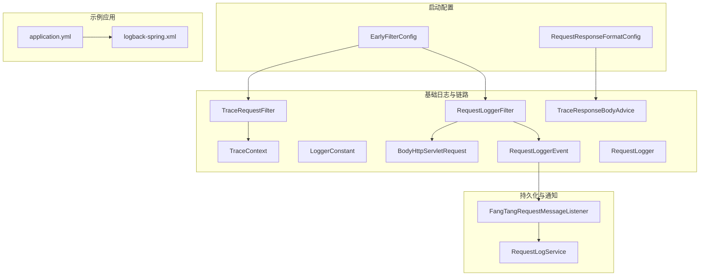
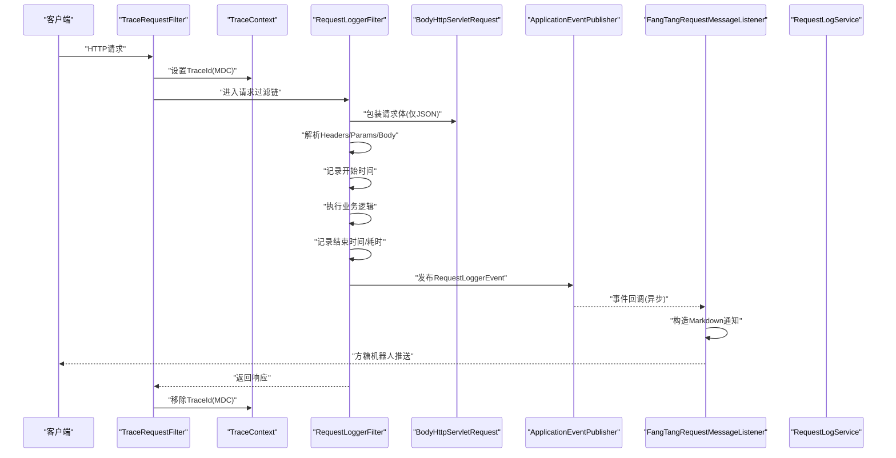
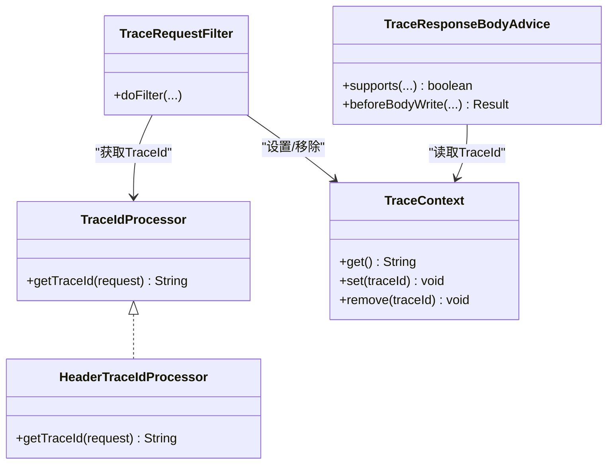
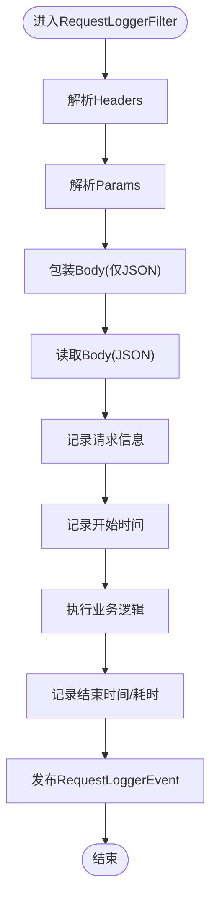
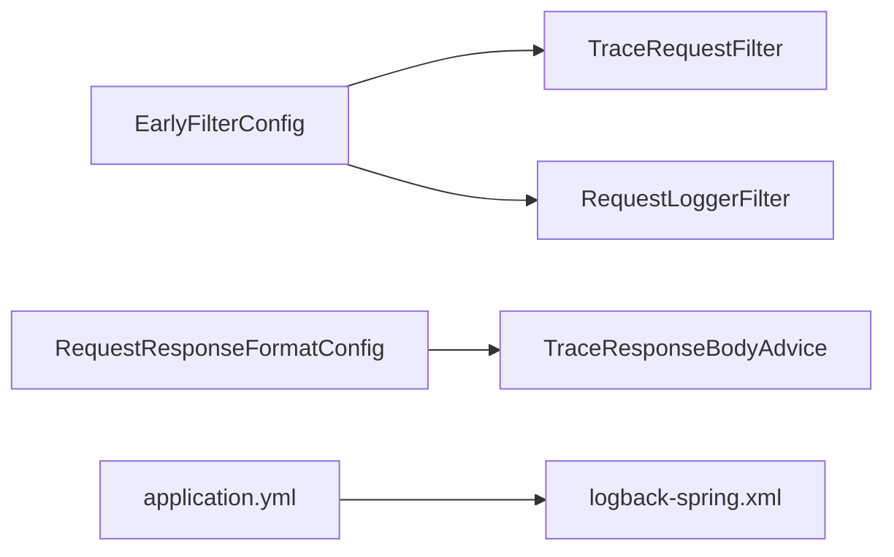

# 日志分析与调试

<cite>
**本文引用的文件**
- [basic/src/main/java/com/kewen/framework/basic/logger/LoggerConstant.java](file://basic/src/main/java/com/kewen/framework/basic/logger/LoggerConstant.java)
- [basic/src/main/java/com/kewen/framework/basic/logger/TraceRequestFilter.java](file://basic/src/main/java/com/kewen/framework/basic/logger/TraceRequestFilter.java)
- [basic/src/main/java/com/kewen/framework/basic/logger/RequestLoggerFilter.java](file://basic/src/main/java/com/kewen/framework/basic/logger/RequestLoggerFilter.java)
- [basic/src/main/java/com/kewen/framework/basic/logger/trace/TraceContext.java](file://basic/src/main/java/com/kewen/framework/basic/logger/trace/TraceContext.java)
- [basic/src/main/java/com/kewen/framework/basic/logger/trace/TraceIdProcessor.java](file://basic/src/main/java/com/kewen/framework/basic/logger/trace/TraceIdProcessor.java)
- [basic/src/main/java/com/kewen/framework/basic/logger/trace/HeaderTraceIdProcessor.java](file://basic/src/main/java/com/kewen/framework/basic/logger/trace/HeaderTraceIdProcessor.java)
- [basic/src/main/java/com/kewen/framework/basic/logger/trace/TraceResponseBodyAdvice.java](file://basic/src/main/java/com/kewen/framework/basic/logger/trace/TraceResponseBodyAdvice.java)
- [basic/src/main/java/com/kewen/framework/basic/logger/request/BodyHttpServletRequest.java](file://basic/src/main/java/com/kewen/framework/basic/logger/request/BodyHttpServletRequest.java)
- [basic/src/main/java/com/kewen/framework/basic/logger/request/RequestLogger.java](file://basic/src/main/java/com/kewen/framework/basic/logger/request/RequestLogger.java)
- [basic/src/main/java/com/kewen/framework/basic/logger/request/RequestLoggerEvent.java](file://basic/src/main/java/com/kewen/framework/basic/logger/request/RequestLoggerEvent.java)
- [basic-support/src/main/java/com/kewen/framework/basic/support/log/persistent/RequestLogService.java](file://basic-support/src/main/java/com/kewen/framework/basic/support/log/persistent/RequestLogService.java)
- [basic-support/src/main/java/com/kewen/framework/basic/support/log/FangTangRequestMessageListener.java](file://basic-support/src/main/java/com/kewen/framework/basic/support/log/FangTangRequestMessageListener.java)
- [boot/basic-spring-boot-starter/src/main/java/com/kewen/framework/boot/basic/config/EarlyFilterConfig.java](file://boot/basic-spring-boot-starter/src/main/java/com/kewen/framework/boot/basic/config/EarlyFilterConfig.java)
- [boot/basic-spring-boot-starter/src/main/java/com/kewen/framework/boot/basic/config/RequestResponseFormatConfig.java](file://boot/basic-spring-boot-starter/src/main/java/com/kewen/framework/boot/basic/config/RequestResponseFormatConfig.java)
- [basic/src/main/java/com/kewen/framework/basic/exception/ExceptionHandlerAdvice.java](file://basic/src/main/java/com/kewen/framework/basic/exception/ExceptionHandlerAdvice.java)
- [sample/auth-boot-sample/src/main/resources/application.yml](file://sample/auth-boot-sample/src/main/resources/application.yml)
- [sample/auth-boot-sample/src/main/resources/logback-spring.xml](file://sample/auth-boot-sample/src/main/resources/logback-spring.xml)
</cite>

## 目录
1. [简介](#简介)
2. [项目结构](#项目结构)
3. [核心组件](#核心组件)
4. [架构总览](#架构总览)
5. [组件详解](#组件详解)
6. [依赖关系分析](#依赖关系分析)
7. [性能与日志策略](#性能与日志策略)
8. [故障排查指南](#故障排查指南)
9. [结论](#结论)
10. [附录](#附录)

## 简介
本指南面向kewen-framework的日志分析与调试，覆盖以下主题：
- 日志级别配置与环境策略（开发、测试、生产）
- 请求日志采集与分析（参数、响应、耗时）
- 链路追踪（TraceId生成、传播、MDC关联）
- 关键日志点与监控（异常、性能、审计）
- 日志聚合与分析工具（ELK、方糖机器人等）
- 常见调试场景操作步骤（权限验证、存储流程、租户上下文）

## 项目结构
围绕日志与链路追踪的关键模块分布如下：
- 基础日志与链路：basic/logger、basic/logger/trace、basic/logger/request
- 请求过滤与事件：basic/logger/RequestLoggerFilter、basic/logger/request/RequestLoggerEvent
- 链路过滤与上下文：basic/logger/TraceRequestFilter、basic/logger/trace/TraceContext
- 返回体增强：basic/logger/trace/TraceResponseBodyAdvice
- 请求体包装：basic/logger/request/BodyHttpServletRequest
- 日志持久化与统计：basic-support/log/persistent/RequestLogService、basic-support/log/FangTangRequestMessageListener
- 启动配置：boot/basic-spring-boot-starter/config/EarlyFilterConfig、RequestResponseFormatConfig
- 示例应用日志配置：sample/auth-boot-sample/resources/application.yml、logback-spring.xml
- 异常统一处理：basic/exception/ExceptionHandlerAdvice

图表来源
- [boot/basic-spring-boot-starter/src/main/java/com/kewen/framework/boot/basic/config/EarlyFilterConfig.java:27-45](file://boot/basic-spring-boot-starter/src/main/java/com/kewen/framework/boot/basic/config/EarlyFilterConfig.java#L27-L45)
- [boot/basic-spring-boot-starter/src/main/java/com/kewen/framework/boot/basic/config/RequestResponseFormatConfig.java:36-43](file://boot/basic-spring-boot-starter/src/main/java/com/kewen/framework/boot/basic/config/RequestResponseFormatConfig.java#L36-L43)
- [basic/src/main/java/com/kewen/framework/basic/logger/TraceRequestFilter.java:23-50](file://basic/src/main/java/com/kewen/framework/basic/logger/TraceRequestFilter.java#L23-L50)
- [basic/src/main/java/com/kewen/framework/basic/logger/RequestLoggerFilter.java:36-74](file://basic/src/main/java/com/kewen/framework/basic/logger/RequestLoggerFilter.java#L36-L74)
- [basic/src/main/java/com/kewen/framework/basic/logger/trace/TraceResponseBodyAdvice.java:18-29](file://basic/src/main/java/com/kewen/framework/basic/logger/trace/TraceResponseBodyAdvice.java#L18-L29)
- [basic/src/main/java/com/kewen/framework/basic/logger/trace/TraceContext.java:11-21](file://basic/src/main/java/com/kewen/framework/basic/logger/trace/TraceContext.java#L11-L21)
- [basic/src/main/java/com/kewen/framework/basic/logger/request/BodyHttpServletRequest.java:20-36](file://basic/src/main/java/com/kewen/framework/basic/logger/request/BodyHttpServletRequest.java#L20-L36)
- [basic/src/main/java/com/kewen/framework/basic/logger/request/RequestLoggerEvent.java:11-18](file://basic/src/main/java/com/kewen/framework/basic/logger/request/RequestLoggerEvent.java#L11-L18)
- [basic/src/main/java/com/kewen/framework/basic/logger/request/RequestLogger.java:13-25](file://basic/src/main/java/com/kewen/framework/basic/logger/request/RequestLogger.java#L13-L25)
- [basic-support/src/main/java/com/kewen/framework/basic/support/log/FangTangRequestMessageListener.java:27-67](file://basic-support/src/main/java/com/kewen/framework/basic/support/log/FangTangRequestMessageListener.java#L27-L67)
- [basic-support/src/main/java/com/kewen/framework/basic/support/log/persistent/RequestLogService.java:22-50](file://basic-support/src/main/java/com/kewen/framework/basic/support/log/persistent/RequestLogService.java#L22-L50)
- [sample/auth-boot-sample/src/main/resources/application.yml:24-29](file://sample/auth-boot-sample/src/main/resources/application.yml#L24-L29)
- [sample/auth-boot-sample/src/main/resources/logback-spring.xml:14-29](file://sample/auth-boot-sample/src/main/resources/logback-spring.xml#L14-L29)

章节来源
- [boot/basic-spring-boot-starter/src/main/java/com/kewen/framework/boot/basic/config/EarlyFilterConfig.java:20-47](file://boot/basic-spring-boot-starter/src/main/java/com/kewen/framework/boot/basic/config/EarlyFilterConfig.java#L20-L47)
- [boot/basic-spring-boot-starter/src/main/java/com/kewen/framework/boot/basic/config/RequestResponseFormatConfig.java:28-43](file://boot/basic-spring-boot-starter/src/main/java/com/kewen/framework/boot/basic/config/RequestResponseFormatConfig.java#L28-L43)
- [sample/auth-boot-sample/src/main/resources/application.yml:24-29](file://sample/auth-boot-sample/src/main/resources/application.yml#L24-L29)
- [sample/auth-boot-sample/src/main/resources/logback-spring.xml:14-29](file://sample/auth-boot-sample/src/main/resources/logback-spring.xml#L14-L29)

## 核心组件
- TraceId生成与传播
  - TraceIdProcessor接口与HeaderTraceIdProcessor实现负责从请求头或随机生成TraceId
  - TraceRequestFilter在请求进入时设置TraceContext，退出时清理
  - TraceResponseBodyAdvice在响应前注入TraceId到统一返回体
- 请求日志采集
  - RequestLoggerFilter解析请求头、参数、Body，计算执行耗时，并发布RequestLoggerEvent
  - BodyHttpServletRequest支持对JSON请求体进行二次读取
  - RequestLogger封装请求关键字段
- 日志持久化与通知
  - FangTangRequestMessageListener监听请求事件，异步发送方糖机器人通知
  - RequestLogService提供访问统计查询能力（基于数据库表）
- 异常统一处理
  - ExceptionHandlerAdvice集中捕获业务异常、参数校验异常与全局异常，统一返回

章节来源
- [basic/src/main/java/com/kewen/framework/basic/logger/trace/TraceIdProcessor.java:11-18](file://basic/src/main/java/com/kewen/framework/basic/logger/trace/TraceIdProcessor.java#L11-L18)
- [basic/src/main/java/com/kewen/framework/basic/logger/trace/HeaderTraceIdProcessor.java:15-27](file://basic/src/main/java/com/kewen/framework/basic/logger/trace/HeaderTraceIdProcessor.java#L15-L27)
- [basic/src/main/java/com/kewen/framework/basic/logger/TraceRequestFilter.java:23-50](file://basic/src/main/java/com/kewen/framework/basic/logger/TraceRequestFilter.java#L23-L50)
- [basic/src/main/java/com/kewen/framework/basic/logger/trace/TraceResponseBodyAdvice.java:18-29](file://basic/src/main/java/com/kewen/framework/basic/logger/trace/TraceResponseBodyAdvice.java#L18-L29)
- [basic/src/main/java/com/kewen/framework/basic/logger/trace/TraceContext.java:11-21](file://basic/src/main/java/com/kewen/framework/basic/logger/trace/TraceContext.java#L11-L21)
- [basic/src/main/java/com/kewen/framework/basic/logger/RequestLoggerFilter.java:36-74](file://basic/src/main/java/com/kewen/framework/basic/logger/RequestLoggerFilter.java#L36-L74)
- [basic/src/main/java/com/kewen/framework/basic/logger/request/BodyHttpServletRequest.java:20-36](file://basic/src/main/java/com/kewen/framework/basic/logger/request/BodyHttpServletRequest.java#L20-L36)
- [basic/src/main/java/com/kewen/framework/basic/logger/request/RequestLogger.java:13-25](file://basic/src/main/java/com/kewen/framework/basic/logger/request/RequestLogger.java#L13-L25)
- [basic/src/main/java/com/kewen/framework/basic/logger/request/RequestLoggerEvent.java:11-18](file://basic/src/main/java/com/kewen/framework/basic/logger/request/RequestLoggerEvent.java#L11-L18)
- [basic-support/src/main/java/com/kewen/framework/basic/support/log/FangTangRequestMessageListener.java:27-67](file://basic-support/src/main/java/com/kewen/framework/basic/support/log/FangTangRequestMessageListener.java#L27-L67)
- [basic-support/src/main/java/com/kewen/framework/basic/support/log/persistent/RequestLogService.java:22-50](file://basic-support/src/main/java/com/kewen/framework/basic/support/log/persistent/RequestLogService.java#L22-L50)
- [basic/src/main/java/com/kewen/framework/basic/exception/ExceptionHandlerAdvice.java:20-78](file://basic/src/main/java/com/kewen/framework/basic/exception/ExceptionHandlerAdvice.java#L20-L78)

## 架构总览
下面以序列图展示一次请求从进入过滤器到响应返回的链路追踪与日志采集过程。

图表来源
- [basic/src/main/java/com/kewen/framework/basic/logger/TraceRequestFilter.java:38-49](file://basic/src/main/java/com/kewen/framework/basic/logger/TraceRequestFilter.java#L38-L49)
- [basic/src/main/java/com/kewen/framework/basic/logger/trace/TraceContext.java:13-21](file://basic/src/main/java/com/kewen/framework/basic/logger/trace/TraceContext.java#L13-L21)
- [basic/src/main/java/com/kewen/framework/basic/logger/RequestLoggerFilter.java:36-74](file://basic/src/main/java/com/kewen/framework/basic/logger/RequestLoggerFilter.java#L36-L74)
- [basic/src/main/java/com/kewen/framework/basic/logger/request/BodyHttpServletRequest.java:29-36](file://basic/src/main/java/com/kewen/framework/basic/logger/request/BodyHttpServletRequest.java#L29-L36)
- [basic/src/main/java/com/kewen/framework/basic/logger/request/RequestLoggerEvent.java:11-18](file://basic/src/main/java/com/kewen/framework/basic/logger/request/RequestLoggerEvent.java#L11-L18)
- [basic-support/src/main/java/com/kewen/framework/basic/support/log/FangTangRequestMessageListener.java:44-67](file://basic-support/src/main/java/com/kewen/framework/basic/support/log/FangTangRequestMessageListener.java#L44-L67)
- [basic-support/src/main/java/com/kewen/framework/basic/support/log/persistent/RequestLogService.java:28-50](file://basic-support/src/main/java/com/kewen/framework/basic/support/log/persistent/RequestLogService.java#L28-L50)

## 组件详解

### 链路追踪与TraceId
- TraceId生成策略
  - 优先从请求头读取；若不存在，则生成UUID并去除横杠作为TraceId
- TraceId传播
  - 进入请求时设置到MDC；退出时移除，避免线程复用污染
- 响应增强
  - 对统一返回体Result注入TraceId，便于前端与下游定位

图表来源
- [basic/src/main/java/com/kewen/framework/basic/logger/trace/TraceIdProcessor.java:11-18](file://basic/src/main/java/com/kewen/framework/basic/logger/trace/TraceIdProcessor.java#L11-L18)
- [basic/src/main/java/com/kewen/framework/basic/logger/trace/HeaderTraceIdProcessor.java:15-27](file://basic/src/main/java/com/kewen/framework/basic/logger/trace/HeaderTraceIdProcessor.java#L15-L27)
- [basic/src/main/java/com/kewen/framework/basic/logger/TraceRequestFilter.java:23-50](file://basic/src/main/java/com/kewen/framework/basic/logger/TraceRequestFilter.java#L23-L50)
- [basic/src/main/java/com/kewen/framework/basic/logger/trace/TraceContext.java:11-21](file://basic/src/main/java/com/kewen/framework/basic/logger/trace/TraceContext.java#L11-L21)
- [basic/src/main/java/com/kewen/framework/basic/logger/trace/TraceResponseBodyAdvice.java:18-29](file://basic/src/main/java/com/kewen/framework/basic/logger/trace/TraceResponseBodyAdvice.java#L18-L29)

章节来源
- [basic/src/main/java/com/kewen/framework/basic/logger/trace/TraceIdProcessor.java:11-18](file://basic/src/main/java/com/kewen/framework/basic/logger/trace/TraceIdProcessor.java#L11-L18)
- [basic/src/main/java/com/kewen/framework/basic/logger/trace/HeaderTraceIdProcessor.java:15-27](file://basic/src/main/java/com/kewen/framework/basic/logger/trace/HeaderTraceIdProcessor.java#L15-L27)
- [basic/src/main/java/com/kewen/framework/basic/logger/TraceRequestFilter.java:23-50](file://basic/src/main/java/com/kewen/framework/basic/logger/TraceRequestFilter.java#L23-L50)
- [basic/src/main/java/com/kewen/framework/basic/logger/trace/TraceContext.java:11-21](file://basic/src/main/java/com/kewen/framework/basic/logger/trace/TraceContext.java#L11-L21)
- [basic/src/main/java/com/kewen/framework/basic/logger/trace/TraceResponseBodyAdvice.java:18-29](file://basic/src/main/java/com/kewen/framework/basic/logger/trace/TraceResponseBodyAdvice.java#L18-L29)

### 请求日志采集与事件
- RequestLoggerFilter职责
  - 解析请求头、参数、Body（仅JSON），记录IP、URL、Method、耗时
  - 使用BodyHttpServletRequest实现请求体可重复读取
  - 记录完成后发布RequestLoggerEvent事件
- RequestLogger封装
  - 字段包括URL、Method、Params、Body、IP、Headers、execMillisecond
- FangTangRequestMessageListener
  - 监听事件，异步发送Markdown格式通知至方糖机器人
  - 使用缓存去重同一IP短时间内的重复通知

图表来源
- [basic/src/main/java/com/kewen/framework/basic/logger/RequestLoggerFilter.java:36-74](file://basic/src/main/java/com/kewen/framework/basic/logger/RequestLoggerFilter.java#L36-L74)
- [basic/src/main/java/com/kewen/framework/basic/logger/request/BodyHttpServletRequest.java:29-36](file://basic/src/main/java/com/kewen/framework/basic/logger/request/BodyHttpServletRequest.java#L29-L36)
- [basic/src/main/java/com/kewen/framework/basic/logger/request/RequestLogger.java:13-25](file://basic/src/main/java/com/kewen/framework/basic/logger/request/RequestLogger.java#L13-L25)
- [basic/src/main/java/com/kewen/framework/basic/logger/request/RequestLoggerEvent.java:11-18](file://basic/src/main/java/com/kewen/framework/basic/logger/request/RequestLoggerEvent.java#L11-L18)
- [basic-support/src/main/java/com/kewen/framework/basic/support/log/FangTangRequestMessageListener.java:44-67](file://basic-support/src/main/java/com/kewen/framework/basic/support/log/FangTangRequestMessageListener.java#L44-L67)

章节来源
- [basic/src/main/java/com/kewen/framework/basic/logger/RequestLoggerFilter.java:36-74](file://basic/src/main/java/com/kewen/framework/basic/logger/RequestLoggerFilter.java#L36-L74)
- [basic/src/main/java/com/kewen/framework/basic/logger/request/BodyHttpServletRequest.java:29-36](file://basic/src/main/java/com/kewen/framework/basic/logger/request/BodyHttpServletRequest.java#L29-L36)
- [basic/src/main/java/com/kewen/framework/basic/logger/request/RequestLogger.java:13-25](file://basic/src/main/java/com/kewen/framework/basic/logger/request/RequestLogger.java#L13-L25)
- [basic/src/main/java/com/kewen/framework/basic/logger/request/RequestLoggerEvent.java:11-18](file://basic/src/main/java/com/kewen/framework/basic/logger/request/RequestLoggerEvent.java#L11-L18)
- [basic-support/src/main/java/com/kewen/framework/basic/support/log/FangTangRequestMessageListener.java:27-67](file://basic-support/src/main/java/com/kewen/framework/basic/support/log/FangTangRequestMessageListener.java#L27-L67)

### 日志持久化与统计
- RequestLogService
  - 查询指定日期范围内的请求日志，按天分组统计独立IP数与独立用户数
- 数据模型
  - 依赖SysRequestLog实体与对应Mapper/Service

章节来源
- [basic-support/src/main/java/com/kewen/framework/basic/support/log/persistent/RequestLogService.java:22-50](file://basic-support/src/main/java/com/kewen/framework/basic/support/log/persistent/RequestLogService.java#L22-L50)

### 异常统一处理与审计
- ExceptionHandlerAdvice
  - 捕获业务异常、空指针、参数校验异常与全局异常，统一返回Result
  - 对异常进行日志记录，便于审计与问题定位

章节来源
- [basic/src/main/java/com/kewen/framework/basic/exception/ExceptionHandlerAdvice.java:20-78](file://basic/src/main/java/com/kewen/framework/basic/exception/ExceptionHandlerAdvice.java#L20-L78)

## 依赖关系分析
- 过滤器装配
  - EarlyFilterConfig注册TraceRequestFilter与RequestLoggerFilter，并通过代理统一调度
- 返回体增强
  - RequestResponseFormatConfig注册TraceResponseBodyAdvice，确保TraceId注入到Result
- 日志配置
  - 示例应用使用logback-spring.xml定义滚动文件与MDC输出模式，包含traceId键

图表来源
- [boot/basic-spring-boot-starter/src/main/java/com/kewen/framework/boot/basic/config/EarlyFilterConfig.java:27-45](file://boot/basic-spring-boot-starter/src/main/java/com/kewen/framework/boot/basic/config/EarlyFilterConfig.java#L27-L45)
- [boot/basic-spring-boot-starter/src/main/java/com/kewen/framework/boot/basic/config/RequestResponseFormatConfig.java:36-43](file://boot/basic-spring-boot-starter/src/main/java/com/kewen/framework/boot/basic/config/RequestResponseFormatConfig.java#L36-L43)
- [sample/auth-boot-sample/src/main/resources/application.yml:24-29](file://sample/auth-boot-sample/src/main/resources/application.yml#L24-L29)
- [sample/auth-boot-sample/src/main/resources/logback-spring.xml:14-29](file://sample/auth-boot-sample/src/main/resources/logback-spring.xml#L14-L29)

章节来源
- [boot/basic-spring-boot-starter/src/main/java/com/kewen/framework/boot/basic/config/EarlyFilterConfig.java:20-47](file://boot/basic-spring-boot-starter/src/main/java/com/kewen/framework/boot/basic/config/EarlyFilterConfig.java#L20-L47)
- [boot/basic-spring-boot-starter/src/main/java/com/kewen/framework/boot/basic/config/RequestResponseFormatConfig.java:28-43](file://boot/basic-spring-boot-starter/src/main/java/com/kewen/framework/boot/basic/config/RequestResponseFormatConfig.java#L28-L43)
- [sample/auth-boot-sample/src/main/resources/application.yml:24-29](file://sample/auth-boot-sample/src/main/resources/application.yml#L24-L29)
- [sample/auth-boot-sample/src/main/resources/logback-spring.xml:14-29](file://sample/auth-boot-sample/src/main/resources/logback-spring.xml#L14-L29)

## 性能与日志策略
- 开发环境
  - 建议开启DEBUG级别，便于快速定位问题
  - 示例应用已将security包日志级别设为debug
- 测试环境
  - 适度开启INFO，关注关键链路耗时与异常
- 生产环境
  - 默认INFO，避免过多I/O
  - 对高频接口可采用采样或阈值告警，避免日志风暴
- 日志落盘
  - 使用RollingFileAppender按天切割，限制单文件大小与总容量
  - 在MDC中输出traceId，便于跨服务串联

章节来源
- [sample/auth-boot-sample/src/main/resources/application.yml:24-29](file://sample/auth-boot-sample/src/main/resources/application.yml#L24-L29)
- [sample/auth-boot-sample/src/main/resources/logback-spring.xml:14-29](file://sample/auth-boot-sample/src/main/resources/logback-spring.xml#L14-L29)

## 故障排查指南
- 权限验证调试
  - 步骤
    - 确认TraceId是否正确透传（查看响应体TraceId与日志MDC）
    - 检查异常处理是否正常返回（观察异常拦截器日志）
    - 核对参数校验错误信息是否完整
- 存储流程调试
  - 步骤
    - 查看请求日志事件是否触发（确认FangTang通知是否到达）
    - 核对数据库请求日志表是否存在数据，使用RequestLogService进行访问统计核对
- 租户上下文调试
  - 步骤
    - 若存在租户上下文扩展，结合TraceId与MDC定位请求生命周期
    - 检查过滤器顺序与TraceContext设置/清理是否匹配

章节来源
- [basic/src/main/java/com/kewen/framework/basic/exception/ExceptionHandlerAdvice.java:20-78](file://basic/src/main/java/com/kewen/framework/basic/exception/ExceptionHandlerAdvice.java#L20-L78)
- [basic-support/src/main/java/com/kewen/framework/basic/support/log/FangTangRequestMessageListener.java:44-67](file://basic-support/src/main/java/com/kewen/framework/basic/support/log/FangTangRequestMessageListener.java#L44-L67)
- [basic-support/src/main/java/com/kewen/framework/basic/support/log/persistent/RequestLogService.java:22-50](file://basic-support/src/main/java/com/kewen/framework/basic/support/log/persistent/RequestLogService.java#L22-L50)

## 结论
kewen-framework的日志体系以MDC+TraceId为核心，结合请求过滤器、事件发布与返回体增强，实现了全链路可追踪与可审计。配合示例应用的日志配置与异常统一处理，开发者可在不同环境下高效定位问题并优化性能。

## 附录
- 关键日志点建议
  - 请求入口：TraceId设置、请求参数解析
  - 业务处理：耗时统计、关键分支日志
  - 响应阶段：TraceId注入、异常捕获
  - 异步通知：请求事件监听与去重
- 日志聚合与分析
  - 使用ELK或类似方案收集logback输出，按traceId聚合请求链路
  - 结合数据库请求日志表进行趋势与异常分析
- 常见问题
  - TraceId未透传：检查TraceRequestFilter与TraceResponseBodyAdvice装配顺序
  - 请求体为空：确认Content-Type为application/json且使用BodyHttpServletRequest包装
  - 日志风暴：生产环境降低日志级别或启用采样