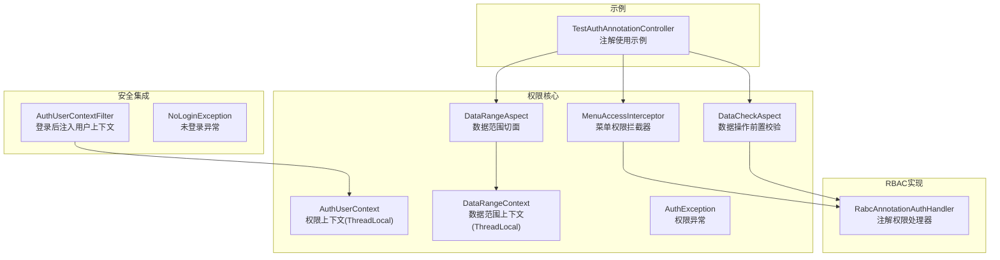
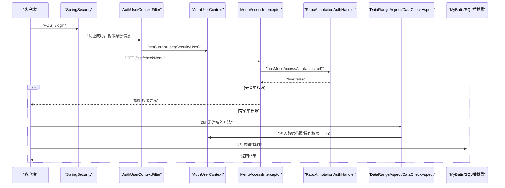
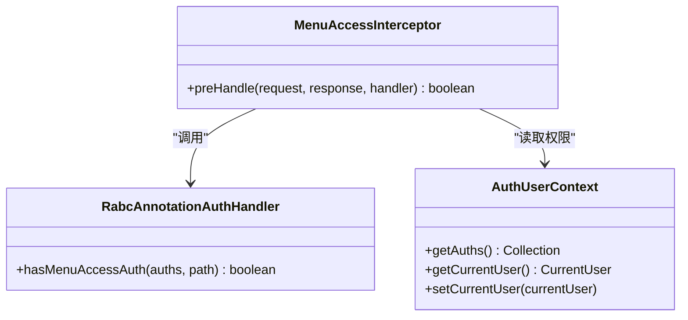
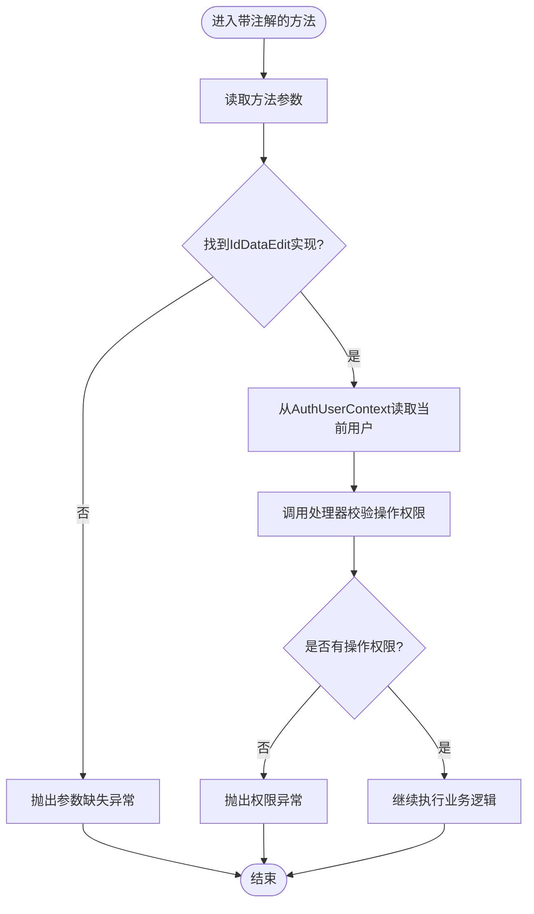
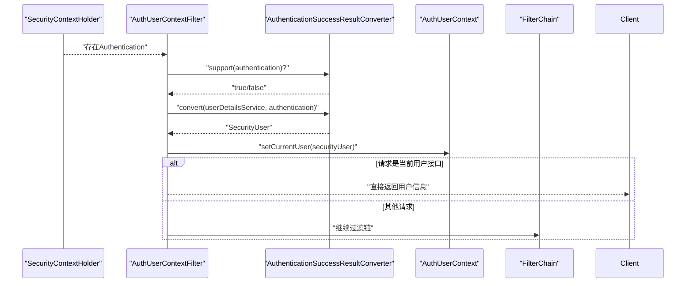
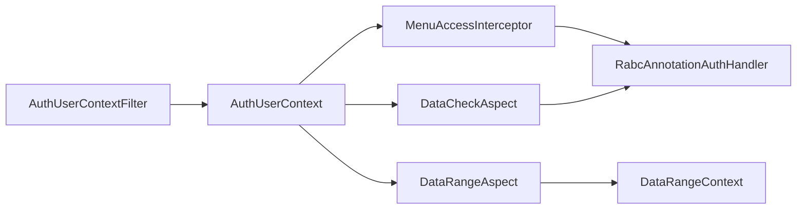

# 权限问题排查

<cite>
**本文引用的文件**
- [README_Auth.md](file://README_Auth.md)
- [AuthUserContext.java](file://qy-auth/auth-core/src/main/java/com/kewen/framework/auth/core/AuthUserContext.java)
- [MenuAccessInterceptor.java](file://qy-auth/auth-core/src/main/java/com/kewen/framework/auth/core/menu/MenuAccessInterceptor.java)
- [RabcAnnotationAuthHandler.java](file://qy-auth/auth-rbac/src/main/java/com/kewen/framework/auth/rabc/RabcAnnotationAuthHandler.java)
- [DataRangeAspect.java](file://qy-auth/auth-core/src/main/java/com/kewen/framework/auth/core/data/range/DataRangeAspect.java)
- [DataRangeContext.java](file://qy-auth/auth-core/src/main/java/com/kewen/framework/auth/core/data/range/DataRangeContext.java)
- [DataCheckAspect.java](file://qy-auth/auth-core/src/main/java/com/kewen/framework/auth/core/data/edit/DataCheckAspect.java)
- [AuthUserContextFilter.java](file://qy-auth/auth-spring-boot-starter/src/main/java/com/kewen/framework/auth/security/filter/AuthUserContextFilter.java)
- [AuthException.java](file://qy-auth/auth-core/src/main/java/com/kewen/framework/auth/core/exception/AuthException.java)
- [AuthServiceException.java](file://qy-auth/auth-core/src/main/java/com/kewen/framework/auth/core/exception/AuthServiceException.java)
- [AuthEntityException.java](file://qy-auth/auth-core/src/main/java/com/kewen/framework/auth/core/exception/AuthEntityException.java)
- [NoLoginException.java](file://qy-auth/auth-spring-boot-starter/src/main/java/com/kewen/framework/auth/security/exception/NoLoginException.java)
- [TestAuthAnnotationController.java](file://sample/auth-boot-sample/src/main/java/com/kewen/framework/auth/sample/controller/TestAuthAnnotationController.java)
</cite>

## 目录
1. [引言](#引言)
2. [项目结构](#项目结构)
3. [核心组件](#核心组件)
4. [架构总览](#架构总览)
5. [详细组件分析](#详细组件分析)
6. [依赖分析](#依赖分析)
7. [性能考虑](#性能考虑)
8. [故障排查指南](#故障排查指南)
9. [结论](#结论)
10. [附录](#附录)

## 引言
本指南面向kewen-framework权限体系的使用者与运维人员，聚焦RBAC权限验证失败的诊断与修复。内容覆盖用户认证失败、角色权限不足、菜单访问受限、权限上下文丢失、权限缓存异常、注解误用、权限配置错误、调试与日志分析等场景，帮助快速定位并解决问题。

## 项目结构
围绕权限相关的关键模块与文件：
- 权限核心：注解、拦截器、上下文、异常
- RBAC实现：注解处理器、菜单/数据权限复合体
- 安全集成：登录、上下文注入、异常处理
- 示例：注解使用示例控制器

**图表来源**
- [AuthUserContext.java:1-32](file://qy-auth/auth-core/src/main/java/com/kewen/framework/auth/core/AuthUserContext.java#L1-L32)
- [MenuAccessInterceptor.java:1-72](file://qy-auth/auth-core/src/main/java/com/kewen/framework/auth/core/menu/MenuAccessInterceptor.java#L1-L72)
- [RabcAnnotationAuthHandler.java:1-27](file://qy-auth/auth-rbac/src/main/java/com/kewen/framework/auth/rabc/RabcAnnotationAuthHandler.java#L1-L27)
- [DataRangeAspect.java:1-51](file://qy-auth/auth-core/src/main/java/com/kewen/framework/auth/core/data/range/DataRangeAspect.java#L1-L51)
- [DataRangeContext.java:1-24](file://qy-auth/auth-core/src/main/java/com/kewen/framework/auth/core/data/range/DataRangeContext.java#L1-L24)
- [DataCheckAspect.java:1-59](file://qy-auth/auth-core/src/main/java/com/kewen/framework/auth/core/data/edit/DataCheckAspect.java#L1-L59)
- [AuthUserContextFilter.java:1-85](file://qy-auth/auth-spring-boot-starter/src/main/java/com/kewen/framework/auth/security/filter/AuthUserContextFilter.java#L1-L85)
- [AuthException.java:1-24](file://qy-auth/auth-core/src/main/java/com/kewen/framework/auth/core/exception/AuthException.java#L1-L24)
- [TestAuthAnnotationController.java:1-109](file://sample/auth-boot-sample/src/main/java/com/kewen/framework/auth/sample/controller/TestAuthAnnotationController.java#L1-L109)

**章节来源**
- [README_Auth.md:147-212](file://README_Auth.md#L147-L212)

## 核心组件
- 权限上下文：通过线程本地存储当前登录用户及其权限集合，供拦截器与切面使用。
- 菜单权限拦截器：在请求到达Controller前，校验URL是否具备菜单访问权限。
- 数据范围切面：将注解参数写入数据范围上下文，供MyBatis拦截器拼接数据权限条件。
- 数据操作前置校验：在方法执行前校验用户对单条数据的操作权限。
- 注解权限处理器：默认基于RBAC复合体实现菜单权限判断。
- 登录后上下文注入：在认证成功后，将SecurityUser写入权限上下文，供后续流程使用。
- 异常体系：权限异常、服务异常、实体异常、未登录异常，便于精准定位问题。

**章节来源**
- [AuthUserContext.java:12-31](file://qy-auth/auth-core/src/main/java/com/kewen/framework/auth/core/AuthUserContext.java#L12-L31)
- [MenuAccessInterceptor.java:17-61](file://qy-auth/auth-core/src/main/java/com/kewen/framework/auth/core/menu/MenuAccessInterceptor.java#L17-L61)
- [DataRangeAspect.java:14-48](file://qy-auth/auth-core/src/main/java/com/kewen/framework/auth/core/data/range/DataRangeAspect.java#L14-L48)
- [DataCheckAspect.java:19-53](file://qy-auth/auth-core/src/main/java/com/kewen/framework/auth/core/data/edit/DataCheckAspect.java#L19-L53)
- [RabcAnnotationAuthHandler.java:10-26](file://qy-auth/auth-rbac/src/main/java/com/kewen/framework/auth/rabc/RabcAnnotationAuthHandler.java#L10-L26)
- [AuthUserContextFilter.java:49-74](file://qy-auth/auth-spring-boot-starter/src/main/java/com/kewen/framework/auth/security/filter/AuthUserContextFilter.java#L49-L74)
- [AuthException.java:8-23](file://qy-auth/auth-core/src/main/java/com/kewen/framework/auth/core/exception/AuthException.java#L8-L23)
- [AuthServiceException.java:8-16](file://qy-auth/auth-core/src/main/java/com/kewen/framework/auth/core/exception/AuthServiceException.java#L8-L16)
- [AuthEntityException.java:10-20](file://qy-auth/auth-core/src/main/java/com/kewen/framework/auth/core/exception/AuthEntityException.java#L10-L20)
- [NoLoginException.java:5-14](file://qy-auth/auth-spring-boot-starter/src/main/java/com/kewen/framework/auth/security/exception/NoLoginException.java#L5-L14)

## 架构总览
权限验证在请求生命周期中的关键节点与职责：
- 登录成功后，认证转换器将用户信息转为SecurityUser并注入权限上下文。
- 菜单拦截器在Controller方法前校验URL菜单权限。
- 数据范围切面在查询方法前将业务功能、操作类型、表信息等写入上下文，供SQL拦截器拼接权限条件。
- 数据操作切面在方法执行前校验用户对目标数据的操作权限。
- 异常在各环节抛出，统一由异常处理机制捕获并返回。

**图表来源**
- [AuthUserContextFilter.java:49-74](file://qy-auth/auth-spring-boot-starter/src/main/java/com/kewen/framework/auth/security/filter/AuthUserContextFilter.java#L49-L74)
- [AuthUserContext.java:24-29](file://qy-auth/auth-core/src/main/java/com/kewen/framework/auth/core/AuthUserContext.java#L24-L29)
- [MenuAccessInterceptor.java:48-60](file://qy-auth/auth-core/src/main/java/com/kewen/framework/auth/core/menu/MenuAccessInterceptor.java#L48-L60)
- [RabcAnnotationAuthHandler.java:22-25](file://qy-auth/auth-rbac/src/main/java/com/kewen/framework/auth/rabc/RabcAnnotationAuthHandler.java#L22-L25)
- [DataRangeAspect.java:27-47](file://qy-auth/auth-core/src/main/java/com/kewen/framework/auth/core/data/range/DataRangeAspect.java#L27-L47)
- [DataCheckAspect.java:36-53](file://qy-auth/auth-core/src/main/java/com/kewen/framework/auth/core/data/edit/DataCheckAspect.java#L36-L53)

## 详细组件分析

### 组件A：权限上下文与菜单拦截
- AuthUserContext：线程本地存储当前用户及其权限集合，提供静态方法获取。
- MenuAccessInterceptor：仅对HandlerMethod生效；若方法或类声明了@AuthMenu，则提取URL并调用处理器判断；失败抛出权限异常。
- RabcAnnotationAuthHandler：委托SysAuthMenuComposite判断菜单权限。

**图表来源**
- [AuthUserContext.java:12-31](file://qy-auth/auth-core/src/main/java/com/kewen/framework/auth/core/AuthUserContext.java#L12-L31)
- [MenuAccessInterceptor.java:23-61](file://qy-auth/auth-core/src/main/java/com/kewen/framework/auth/core/menu/MenuAccessInterceptor.java#L23-L61)
- [RabcAnnotationAuthHandler.java:17-26](file://qy-auth/auth-rbac/src/main/java/com/kewen/framework/auth/rabc/RabcAnnotationAuthHandler.java#L17-L26)

**章节来源**
- [AuthUserContext.java:12-31](file://qy-auth/auth-core/src/main/java/com/kewen/framework/auth/core/AuthUserContext.java#L12-L31)
- [MenuAccessInterceptor.java:17-61](file://qy-auth/auth-core/src/main/java/com/kewen/framework/auth/core/menu/MenuAccessInterceptor.java#L17-L61)
- [RabcAnnotationAuthHandler.java:10-26](file://qy-auth/auth-rbac/src/main/java/com/kewen/framework/auth/rabc/RabcAnnotationAuthHandler.java#L10-L26)

### 组件B：数据范围与数据操作
- DataRangeAspect：环绕切面，将@AuthDataRange注解参数写入DataRangeContext，供SQL拦截器使用；执行完毕后清理。
- DataRangeContext：线程本地存储当前数据范围配置。
- DataCheckAspect：前置切面，校验方法参数中是否存在IdDataEdit实现，读取业务ID并调用处理器判断操作权限；失败抛出权限异常。

**图表来源**
- [DataCheckAspect.java:36-53](file://qy-auth/auth-core/src/main/java/com/kewen/framework/auth/core/data/edit/DataCheckAspect.java#L36-L53)

**章节来源**
- [DataRangeAspect.java:14-48](file://qy-auth/auth-core/src/main/java/com/kewen/framework/auth/core/data/range/DataRangeAspect.java#L14-L48)
- [DataRangeContext.java:9-23](file://qy-auth/auth-core/src/main/java/com/kewen/framework/auth/core/data/range/DataRangeContext.java#L9-L23)
- [DataCheckAspect.java:19-53](file://qy-auth/auth-core/src/main/java/com/kewen/framework/auth/core/data/edit/DataCheckAspect.java#L19-L53)

### 组件C：登录后上下文注入
- AuthUserContextFilter：在认证成功后，通过认证转换器将Authentication转换为SecurityUser，写入AuthUserContext；若请求为“当前用户”接口则直接返回用户信息。

**图表来源**
- [AuthUserContextFilter.java:49-74](file://qy-auth/auth-spring-boot-starter/src/main/java/com/kewen/framework/auth/security/filter/AuthUserContextFilter.java#L49-L74)

**章节来源**
- [AuthUserContextFilter.java:23-74](file://qy-auth/auth-spring-boot-starter/src/main/java/com/kewen/framework/auth/security/filter/AuthUserContextFilter.java#L23-L74)

## 依赖分析
- 菜单权限链路：MenuAccessInterceptor 依赖 RabcAnnotationAuthHandler；后者依赖SysAuthMenuComposite（复合体）。
- 数据权限链路：DataRangeAspect 写入 DataRangeContext，供SQL拦截器使用；DataCheckAspect 依赖 AuthDataHandler（注解处理器）。
- 上下文链路：AuthUserContextFilter 在认证成功后写入 AuthUserContext，供拦截器与切面读取。
- 异常链路：权限异常、服务异常、实体异常、未登录异常，分别用于不同场景。

**图表来源**
- [MenuAccessInterceptor.java:23-61](file://qy-auth/auth-core/src/main/java/com/kewen/framework/auth/core/menu/MenuAccessInterceptor.java#L23-L61)
- [RabcAnnotationAuthHandler.java:17-26](file://qy-auth/auth-rbac/src/main/java/com/kewen/framework/auth/rabc/RabcAnnotationAuthHandler.java#L17-L26)
- [DataRangeAspect.java:27-47](file://qy-auth/auth-core/src/main/java/com/kewen/framework/auth/core/data/range/DataRangeAspect.java#L27-L47)
- [DataRangeContext.java:9-23](file://qy-auth/auth-core/src/main/java/com/kewen/framework/auth/core/data/range/DataRangeContext.java#L9-L23)
- [DataCheckAspect.java:36-53](file://qy-auth/auth-core/src/main/java/com/kewen/framework/auth/core/data/edit/DataCheckAspect.java#L36-L53)
- [AuthUserContextFilter.java:49-74](file://qy-auth/auth-spring-boot-starter/src/main/java/com/kewen/framework/auth/security/filter/AuthUserContextFilter.java#L49-L74)
- [AuthUserContext.java:12-31](file://qy-auth/auth-core/src/main/java/com/kewen/framework/auth/core/AuthUserContext.java#L12-L31)

**章节来源**
- [README_Auth.md:147-212](file://README_Auth.md#L147-L212)

## 性能考虑
- 线程本地存储：权限上下文与数据范围上下文均使用ThreadLocal，避免跨线程传递开销，但需确保清理，防止内存泄漏。
- SQL拦截器匹配：@AuthDataRange支持IN/EXISTS两种匹配方式，大数据量时优先考虑EXISTS以降低子查询成本。
- 缓存策略：菜单权限与用户权限可结合复合体实现（如内存/Redis）进行缓存，减少数据库查询压力。
- 切面执行：数据范围与操作权限切面在高频接口上会增加少量开销，建议按需启用注解。

[本节为通用指导，无需特定文件引用]

## 故障排查指南

### 一、用户认证失败
- 现象
  - 接口返回未登录或认证失败。
  - “当前用户”接口无法返回用户信息。
- 排查步骤
  - 确认登录接口已正确配置并返回有效令牌。
  - 检查请求头是否携带正确的令牌参数。
  - 观察AuthUserContextFilter是否被触发，确认SecurityContextHolder中存在Authentication。
  - 若“当前用户”接口仍失败，检查认证转换器是否支持当前认证类型，以及返回解析器是否正确。
- 常见原因
  - 未登录或令牌无效。
  - 认证转换器不匹配。
  - 未配置“当前用户”接口URL。
- 相关文件
  - [AuthUserContextFilter.java:49-74](file://qy-auth/auth-spring-boot-starter/src/main/java/com/kewen/framework/auth/security/filter/AuthUserContextFilter.java#L49-L74)
  - [NoLoginException.java:5-14](file://qy-auth/auth-spring-boot-starter/src/main/java/com/kewen/framework/auth/security/exception/NoLoginException.java#L5-L14)

**章节来源**
- [AuthUserContextFilter.java:49-74](file://qy-auth/auth-spring-boot-starter/src/main/java/com/kewen/framework/auth/security/filter/AuthUserContextFilter.java#L49-L74)
- [NoLoginException.java:5-14](file://qy-auth/auth-spring-boot-starter/src/main/java/com/kewen/framework/auth/security/exception/NoLoginException.java#L5-L14)

### 二、角色权限不足（菜单访问受限）
- 现象
  - 访问接口直接抛出权限异常。
  - 控制台出现菜单权限校验失败提示。
- 排查步骤
  - 确认Controller方法或类上是否标注@AuthMenu。
  - 检查菜单API入库是否完成（启动时自动入库）。
  - 核对当前用户权限集合是否包含所需菜单权限。
  - 使用示例控制器验证注解是否生效。
- 常见原因
  - 未添加@AuthMenu注解。
  - 菜单未入库或未配置权限。
  - 用户未分配对应角色/权限。
- 相关文件
  - [MenuAccessInterceptor.java:28-61](file://qy-auth/auth-core/src/main/java/com/kewen/framework/auth/core/menu/MenuAccessInterceptor.java#L28-L61)
  - [RabcAnnotationAuthHandler.java:22-25](file://qy-auth/auth-rbac/src/main/java/com/kewen/framework/auth/rabc/RabcAnnotationAuthHandler.java#L22-L25)
  - [TestAuthAnnotationController.java:77-94](file://sample/auth-boot-sample/src/main/java/com/kewen/framework/auth/sample/controller/TestAuthAnnotationController.java#L77-L94)

**章节来源**
- [MenuAccessInterceptor.java:28-61](file://qy-auth/auth-core/src/main/java/com/kewen/framework/auth/core/menu/MenuAccessInterceptor.java#L28-L61)
- [RabcAnnotationAuthHandler.java:22-25](file://qy-auth/auth-rbac/src/main/java/com/kewen/framework/auth/rabc/RabcAnnotationAuthHandler.java#L22-L25)
- [TestAuthAnnotationController.java:77-94](file://sample/auth-boot-sample/src/main/java/com/kewen/framework/auth/sample/controller/TestAuthAnnotationController.java#L77-L94)

### 三、数据范围查询异常
- 现象
  - 查询结果为空或越权可见。
  - SQL拦截器未拼接权限条件。
- 排查步骤
  - 确认方法上标注@AuthDataRange并填写businessFunction。
  - 检查DataRangeAspect是否执行，确认DataRangeContext中已写入配置。
  - 核对表名、表别名、数据ID列、匹配方式是否正确。
  - 大数据量场景优先使用EXISTS。
- 常见原因
  - 未标注注解或参数缺失。
  - 表名/别名/列名不匹配导致条件未生效。
  - 匹配方式不当导致性能或结果异常。
- 相关文件
  - [DataRangeAspect.java:27-47](file://qy-auth/auth-core/src/main/java/com/kewen/framework/auth/core/data/range/DataRangeAspect.java#L27-L47)
  - [DataRangeContext.java:9-23](file://qy-auth/auth-core/src/main/java/com/kewen/framework/auth/core/data/range/DataRangeContext.java#L9-L23)

**章节来源**
- [DataRangeAspect.java:27-47](file://qy-auth/auth-core/src/main/java/com/kewen/framework/auth/core/data/range/DataRangeAspect.java#L27-L47)
- [DataRangeContext.java:9-23](file://qy-auth/auth-core/src/main/java/com/kewen/framework/auth/core/data/range/DataRangeContext.java#L9-L23)

### 四、数据操作权限校验失败
- 现象
  - 执行更新/删除等操作时报权限不足。
- 排查步骤
  - 确认方法上标注@AuthDataOperation并填写businessFunction与operate。
  - 检查方法参数中是否存在IdDataEdit实现。
  - 核对业务ID是否正确传入。
- 常见原因
  - 未标注注解或参数未实现IdDataEdit。
  - operate与业务配置不一致。
  - 业务ID为空或错误。
- 相关文件
  - [DataCheckAspect.java:36-53](file://qy-auth/auth-core/src/main/java/com/kewen/framework/auth/core/data/edit/DataCheckAspect.java#L36-L53)

**章节来源**
- [DataCheckAspect.java:36-53](file://qy-auth/auth-core/src/main/java/com/kewen/framework/auth/core/data/edit/DataCheckAspect.java#L36-L53)

### 五、权限上下文管理问题
- 现象
  - 上下文为空，导致所有权限校验失败。
  - 并发场景下权限串扰。
- 排查步骤
  - 确认AuthUserContextFilter在认证后执行。
  - 检查线程本地变量是否在finally/异常情况下清理。
  - 核对切面与拦截器是否在同一线程上下文中。
- 常见原因
  - 过滤链顺序不当，上下文未注入。
  - 异步/线程池未传递上下文。
  - 未清理ThreadLocal导致脏数据。
- 相关文件
  - [AuthUserContext.java:12-31](file://qy-auth/auth-core/src/main/java/com/kewen/framework/auth/core/AuthUserContext.java#L12-L31)
  - [AuthUserContextFilter.java:49-74](file://qy-auth/auth-spring-boot-starter/src/main/java/com/kewen/framework/auth/security/filter/AuthUserContextFilter.java#L49-L74)

**章节来源**
- [AuthUserContext.java:12-31](file://qy-auth/auth-core/src/main/java/com/kewen/framework/auth/core/AuthUserContext.java#L12-L31)
- [AuthUserContextFilter.java:49-74](file://qy-auth/auth-spring-boot-starter/src/main/java/com/kewen/framework/auth/security/filter/AuthUserContextFilter.java#L49-L74)

### 六、权限配置错误
- 现象
  - 菜单/数据权限未生效。
  - 角色分配后仍无权限。
- 排查步骤
  - 核对菜单API入库与权限配置。
  - 检查用户-角色-部门映射是否正确。
  - 确认业务功能与操作类型配置一致。
- 常见原因
  - 菜单未入库或未授权。
  - 角色/用户/部门映射错误。
  - businessFunction/operate不一致。
- 相关文件
  - [README_Auth.md:147-212](file://README_Auth.md#L147-L212)

**章节来源**
- [README_Auth.md:147-212](file://README_Auth.md#L147-L212)

### 七、注解使用问题
- @AuthMenu：类或方法上必须标注，否则不校验。
- @AuthDataRange：必须填写businessFunction；合理选择table/tableAlias/dataIdColumn/matchMethod。
- @AuthDataOperation/@AuthDataAuthEdit：需配合菜单权限使用；注意事务一致性。
- 相关文件
  - [TestAuthAnnotationController.java:33-94](file://sample/auth-boot-sample/src/main/java/com/kewen/framework/auth/sample/controller/TestAuthAnnotationController.java#L33-L94)
  - [README_Auth.md:220-560](file://README_Auth.md#L220-L560)

**章节来源**
- [TestAuthAnnotationController.java:33-94](file://sample/auth-boot-sample/src/main/java/com/kewen/framework/auth/sample/controller/TestAuthAnnotationController.java#L33-L94)
- [README_Auth.md:220-560](file://README_Auth.md#L220-L560)

### 八、调试与日志分析
- 关键日志
  - DataCheckAspect在拦截方法前打印日志，便于定位参数与业务ID。
  - 菜单拦截器在权限不足时抛出权限异常，异常消息包含URL。
- 建议
  - 开启相应切面与拦截器的日志级别，观察上下文写入与清理时机。
  - 使用示例控制器复现问题，逐步缩小范围。
- 相关文件
  - [DataCheckAspect.java:27-53](file://qy-auth/auth-core/src/main/java/com/kewen/framework/auth/core/data/edit/DataCheckAspect.java#L27-L53)
  - [MenuAccessInterceptor.java:57-59](file://qy-auth/auth-core/src/main/java/com/kewen/framework/auth/core/menu/MenuAccessInterceptor.java#L57-L59)

**章节来源**
- [DataCheckAspect.java:27-53](file://qy-auth/auth-core/src/main/java/com/kewen/framework/auth/core/data/edit/DataCheckAspect.java#L27-L53)
- [MenuAccessInterceptor.java:57-59](file://qy-auth/auth-core/src/main/java/com/kewen/framework/auth/core/menu/MenuAccessInterceptor.java#L57-L59)

## 结论
RBAC权限验证失败通常源于认证未完成、菜单未授权、数据范围配置错误或上下文未注入。通过对照本文的排查步骤与组件分析，可快速定位问题根因并修复。建议在生产环境结合缓存与合适的匹配方式优化性能，并完善日志与异常处理以提升可观测性。

## 附录
- 快速核对清单
  - 登录成功且令牌有效
  - 已标注@AuthMenu且菜单已入库并授权
  - 方法标注@AuthDataRange并正确填写参数
  - 方法标注@AuthDataOperation且参数实现IdDataEdit
  - AuthUserContextFilter已注入上下文
  - ThreadLocal上下文在切面/拦截器内可用
  - businessFunction/operate与配置一致

[本节为通用指导，无需特定文件引用]