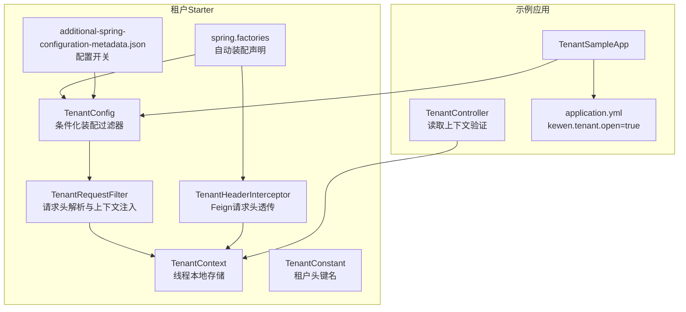
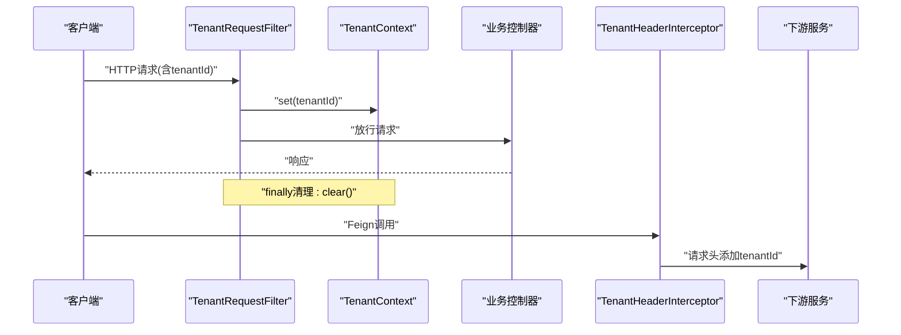
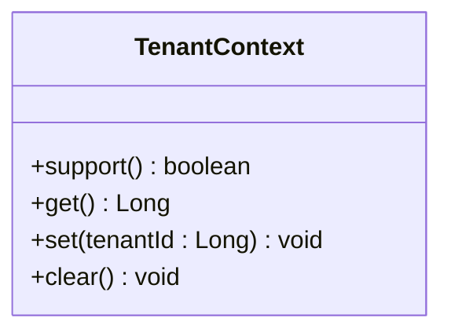
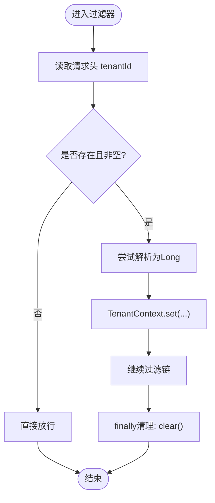
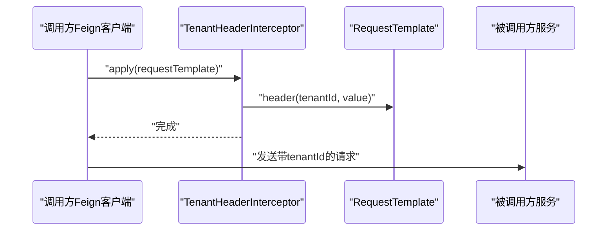
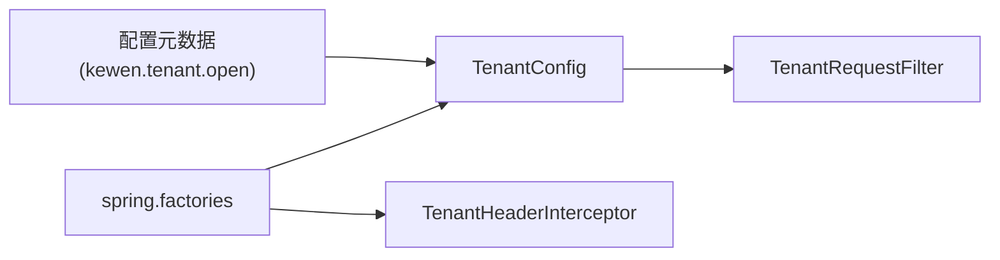
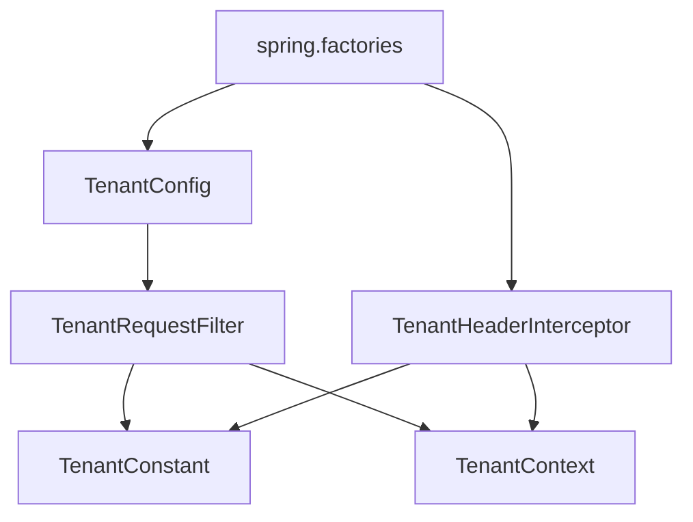

# 租户问题排查

<cite>
**本文引用的文件**
- [TenantContext.java](file://boot/tenant-spring-boot-starter/src/main/java/com/kewen/framework/tenant/TenantContext.java)
- [TenantRequestFilter.java](file://boot/tenant-spring-boot-starter/src/main/java/com/kewen/framework/tenant/TenantRequestFilter.java)
- [TenantHeaderInterceptor.java](file://boot/tenant-spring-boot-starter/src/main/java/com/kewen/framework/tenant/feign/TenantHeaderInterceptor.java)
- [TenantConfig.java](file://boot/tenant-spring-boot-starter/src/main/java/com/kewen/framework/tenant/config/TenantConfig.java)
- [TenantConstant.java](file://boot/tenant-spring-boot-starter/src/main/java/com/kewen/framework/tenant/TenantConstant.java)
- [additional-spring-configuration-metadata.json](file://boot/tenant-spring-boot-starter/src/main/resources/META-INF/additional-spring-configuration-metadata.json)
- [spring.factories](file://boot/tenant-spring-boot-starter/src/main/resources/META-INF/spring.factories)
- [application.yml](file://sample/tenant-boot-sample/src/main/resources/application.yml)
- [TenantController.java](file://sample/tenant-boot-sample/src/main/java/com/kewen/framework/sample/tenant/controller/TenantController.java)
- [EarlyRequestFilter.java](file://basic/src/main/java/com/kewen/framework/basic/filter/EarlyRequestFilter.java)
- [BizException.java](file://basic/src/main/java/com/kewen/framework/basic/exception/BizException.java)
- [BackendException.java](file://basic/src/main/java/com/kewen/framework/basic/exception/BackendException.java)
</cite>

## 目录
1. [简介](#简介)
2. [项目结构](#项目结构)
3. [核心组件](#核心组件)
4. [架构总览](#架构总览)
5. [详细组件分析](#详细组件分析)
6. [依赖分析](#依赖分析)
7. [性能考虑](#性能考虑)
8. [故障排查指南](#故障排查指南)
9. [结论](#结论)
10. [附录](#附录)

## 简介
本指南面向在kewen-framework中使用多租户能力的开发者与运维人员，聚焦“租户上下文丢失”“数据隔离失效”“租户配置错误”“跨服务调用租户传递失败”“租户切换与状态管理”等常见问题，提供系统化的诊断方法与修复建议。文档基于仓库中租户starter的实际实现，结合示例应用与自动装配机制，帮助快速定位并解决问题。

## 项目结构
租户能力由tenant-spring-boot-starter提供，核心包括：
- 上下文持有：TenantContext（线程本地存储）
- 请求入口处理：TenantRequestFilter（从请求头读取租户ID，注入上下文）
- 跨服务传递：TenantHeaderInterceptor（通过Feign拦截器透传租户ID）
- 自动装配：TenantConfig（按开关启用过滤器），spring.factories声明自动装配
- 配置元数据：kewen.tenant.open控制开关
- 示例应用：tenant-boot-sample演示如何开启与验证

图表来源
- [TenantContext.java:1-40](file://boot/tenant-spring-boot-starter/src/main/java/com/kewen/framework/tenant/TenantContext.java#L1-L40)
- [TenantRequestFilter.java:1-38](file://boot/tenant-spring-boot-starter/src/main/java/com/kewen/framework/tenant/TenantRequestFilter.java#L1-L38)
- [TenantHeaderInterceptor.java:1-32](file://boot/tenant-spring-boot-starter/src/main/java/com/kewen/framework/tenant/feign/TenantHeaderInterceptor.java#L1-L32)
- [TenantConfig.java:1-23](file://boot/tenant-spring-boot-starter/src/main/java/com/kewen/framework/tenant/config/TenantConfig.java#L1-L23)
- [TenantConstant.java:1-12](file://boot/tenant-spring-boot-starter/src/main/java/com/kewen/framework/tenant/TenantConstant.java#L1-L12)
- [additional-spring-configuration-metadata.json:1-10](file://boot/tenant-spring-boot-starter/src/main/resources/META-INF/additional-spring-configuration-metadata.json#L1-L10)
- [spring.factories:1-3](file://boot/tenant-spring-boot-starter/src/main/resources/META-INF/spring.factories#L1-L3)
- [application.yml:1-13](file://sample/tenant-boot-sample/src/main/resources/application.yml#L1-L13)
- [TenantController.java:1-21](file://sample/tenant-boot-sample/src/main/java/com/kewen/framework/sample/tenant/controller/TenantController.java#L1-L21)

章节来源
- [TenantContext.java:1-40](file://boot/tenant-spring-boot-starter/src/main/java/com/kewen/framework/tenant/TenantContext.java#L1-L40)
- [TenantRequestFilter.java:1-38](file://boot/tenant-spring-boot-starter/src/main/java/com/kewen/framework/tenant/TenantRequestFilter.java#L1-L38)
- [TenantHeaderInterceptor.java:1-32](file://boot/tenant-spring-boot-starter/src/main/java/com/kewen/framework/tenant/feign/TenantHeaderInterceptor.java#L1-L32)
- [TenantConfig.java:1-23](file://boot/tenant-spring-boot-starter/src/main/java/com/kewen/framework/tenant/config/TenantConfig.java#L1-L23)
- [TenantConstant.java:1-12](file://boot/tenant-spring-boot-starter/src/main/java/com/kewen/framework/tenant/TenantConstant.java#L1-L12)
- [additional-spring-configuration-metadata.json:1-10](file://boot/tenant-spring-boot-starter/src/main/resources/META-INF/additional-spring-configuration-metadata.json#L1-L10)
- [spring.factories:1-3](file://boot/tenant-spring-boot-starter/src/main/resources/META-INF/spring.factories#L1-L3)
- [application.yml:1-13](file://sample/tenant-boot-sample/src/main/resources/application.yml#L1-L13)
- [TenantController.java:1-21](file://sample/tenant-boot-sample/src/main/java/com/kewen/framework/sample/tenant/controller/TenantController.java#L1-L21)

## 核心组件
- TenantContext：以可继承线程本地存储保存当前请求的租户ID，支持获取、设置、清理与存在性判断。
- TenantRequestFilter：在请求早期过滤阶段从请求头读取租户ID，注入到上下文；请求结束时清理，避免泄漏。
- TenantHeaderInterceptor：在Feign发起远程调用前，从上下文读取租户ID写入请求头，确保下游服务能正确感知。
- TenantConfig：条件化装配TenantRequestFilter，受kewen.tenant.open开关控制。
- TenantConstant：统一租户头键名“tenantId”。

章节来源
- [TenantContext.java:1-40](file://boot/tenant-spring-boot-starter/src/main/java/com/kewen/framework/tenant/TenantContext.java#L1-L40)
- [TenantRequestFilter.java:1-38](file://boot/tenant-spring-boot-starter/src/main/java/com/kewen/framework/tenant/TenantRequestFilter.java#L1-L38)
- [TenantHeaderInterceptor.java:1-32](file://boot/tenant-spring-boot-starter/src/main/java/com/kewen/framework/tenant/feign/TenantHeaderInterceptor.java#L1-L32)
- [TenantConfig.java:1-23](file://boot/tenant-spring-boot-starter/src/main/java/com/kewen/framework/tenant/config/TenantConfig.java#L1-L23)
- [TenantConstant.java:1-12](file://boot/tenant-spring-boot-starter/src/main/java/com/kewen/framework/tenant/TenantConstant.java#L1-L12)

## 架构总览
租户能力通过自动装配在应用启动时生效。当kewen.tenant.open为true时，TenantConfig注册TenantRequestFilter；同时spring.factories声明TenantHeaderInterceptor作为Feign请求拦截器。请求进入时，TenantRequestFilter解析请求头tenantId并写入TenantContext；跨服务调用时，TenantHeaderInterceptor将tenantId写入Feign请求头，下游服务同理解析并写入上下文。

图表来源
- [TenantRequestFilter.java:1-38](file://boot/tenant-spring-boot-starter/src/main/java/com/kewen/framework/tenant/TenantRequestFilter.java#L1-L38)
- [TenantContext.java:1-40](file://boot/tenant-spring-boot-starter/src/main/java/com/kewen/framework/tenant/TenantContext.java#L1-L40)
- [TenantHeaderInterceptor.java:1-32](file://boot/tenant-spring-boot-starter/src/main/java/com/kewen/framework/tenant/feign/TenantHeaderInterceptor.java#L1-L32)
- [spring.factories:1-3](file://boot/tenant-spring-boot-starter/src/main/resources/META-INF/spring.factories#L1-L3)

## 详细组件分析

### 组件A：TenantContext（上下文）
- 数据结构：可继承线程本地存储，保证父子线程间上下文可见性。
- 关键行为：support/get/set/clear，便于在过滤器前后成对使用。
- 复杂度：O(1)访问与写入。
- 优化点：避免在异步或线程池场景下手动传递上下文；如需跨线程传播，应显式复制或使用框架提供的传播机制。

图表来源
- [TenantContext.java:1-40](file://boot/tenant-spring-boot-starter/src/main/java/com/kewen/framework/tenant/TenantContext.java#L1-L40)

章节来源
- [TenantContext.java:1-40](file://boot/tenant-spring-boot-starter/src/main/java/com/kewen/framework/tenant/TenantContext.java#L1-L40)

### 组件B：TenantRequestFilter（请求头解析与上下文注入）
- 触发时机：实现EarlyRequestFilter，具备较高优先级，确保在业务逻辑之前完成上下文注入。
- 逻辑要点：
  - 从请求头读取TenantConstant.TENANT_ID；
  - 若存在则转换为Long并set到TenantContext；
  - finally确保在请求结束时clear，防止线程复用导致的数据泄漏。
- 异常处理：未捕获解析异常，若请求头非数字将抛出异常；建议在上游网关或前置校验层保证格式正确。

图表来源
- [TenantRequestFilter.java:1-38](file://boot/tenant-spring-boot-starter/src/main/java/com/kewen/framework/tenant/TenantRequestFilter.java#L1-L38)
- [TenantConstant.java:1-12](file://boot/tenant-spring-boot-starter/src/main/java/com/kewen/framework/tenant/TenantConstant.java#L1-L12)
- [EarlyRequestFilter.java:1-24](file://basic/src/main/java/com/kewen/framework/basic/filter/EarlyRequestFilter.java#L1-L24)

章节来源
- [TenantRequestFilter.java:1-38](file://boot/tenant-spring-boot-starter/src/main/java/com/kewen/framework/tenant/TenantRequestFilter.java#L1-L38)
- [EarlyRequestFilter.java:1-24](file://basic/src/main/java/com/kewen/framework/basic/filter/EarlyRequestFilter.java#L1-L24)

### 组件C：TenantHeaderInterceptor（跨服务租户头透传）
- 触发时机：Feign客户端发起请求前。
- 逻辑要点：
  - 从TenantContext读取租户ID；
  - 若存在则写入请求头TenantConstant.TENANT_ID；
  - 受kewen.tenant.open与Feign存在性双重条件控制。
- 注意事项：拦截器必须使用@Configuration而非@Component，否则可能不生效。

图表来源
- [TenantHeaderInterceptor.java:1-32](file://boot/tenant-spring-boot-starter/src/main/java/com/kewen/framework/tenant/feign/TenantHeaderInterceptor.java#L1-L32)
- [TenantContext.java:1-40](file://boot/tenant-spring-boot-starter/src/main/java/com/kewen/framework/tenant/TenantContext.java#L1-L40)

章节来源
- [TenantHeaderInterceptor.java:1-32](file://boot/tenant-spring-boot-starter/src/main/java/com/kewen/framework/tenant/feign/TenantHeaderInterceptor.java#L1-L32)

### 组件D：TenantConfig与自动装配
- TenantConfig在kewen.tenant.open=true时注册TenantRequestFilter。
- spring.factories声明TenantConfig与TenantHeaderInterceptor为自动装配项。
- 配置元数据提供开关默认值与描述。

图表来源
- [TenantConfig.java:1-23](file://boot/tenant-spring-boot-starter/src/main/java/com/kewen/framework/tenant/config/TenantConfig.java#L1-L23)
- [spring.factories:1-3](file://boot/tenant-spring-boot-starter/src/main/resources/META-INF/spring.factories#L1-L3)
- [additional-spring-configuration-metadata.json:1-10](file://boot/tenant-spring-boot-starter/src/main/resources/META-INF/additional-spring-configuration-metadata.json#L1-L10)

章节来源
- [TenantConfig.java:1-23](file://boot/tenant-spring-boot-starter/src/main/java/com/kewen/framework/tenant/config/TenantConfig.java#L1-L23)
- [spring.factories:1-3](file://boot/tenant-spring-boot-starter/src/main/resources/META-INF/spring.factories#L1-L3)
- [additional-spring-configuration-metadata.json:1-10](file://boot/tenant-spring-boot-starter/src/main/resources/META-INF/additional-spring-configuration-metadata.json#L1-L10)

## 依赖分析
- 组件耦合：
  - TenantRequestFilter依赖TenantConstant与TenantContext；
  - TenantHeaderInterceptor依赖TenantContext与TenantConstant；
  - TenantConfig依赖TenantRequestFilter，并受配置开关控制；
  - spring.factories声明自动装配，降低使用者侵入。
- 外部依赖：
  - Feign存在性决定TenantHeaderInterceptor是否启用；
  - Servlet容器提供EarlyRequestFilter接口能力。

图表来源
- [TenantRequestFilter.java:1-38](file://boot/tenant-spring-boot-starter/src/main/java/com/kewen/framework/tenant/TenantRequestFilter.java#L1-L38)
- [TenantHeaderInterceptor.java:1-32](file://boot/tenant-spring-boot-starter/src/main/java/com/kewen/framework/tenant/feign/TenantHeaderInterceptor.java#L1-L32)
- [TenantConfig.java:1-23](file://boot/tenant-spring-boot-starter/src/main/java/com/kewen/framework/tenant/config/TenantConfig.java#L1-L23)
- [TenantConstant.java:1-12](file://boot/tenant-spring-boot-starter/src/main/java/com/kewen/framework/tenant/TenantConstant.java#L1-L12)
- [spring.factories:1-3](file://boot/tenant-spring-boot-starter/src/main/resources/META-INF/spring.factories#L1-L3)

章节来源
- [TenantRequestFilter.java:1-38](file://boot/tenant-spring-boot-starter/src/main/java/com/kewen/framework/tenant/TenantRequestFilter.java#L1-L38)
- [TenantHeaderInterceptor.java:1-32](file://boot/tenant-spring-boot-starter/src/main/java/com/kewen/framework/tenant/feign/TenantHeaderInterceptor.java#L1-L32)
- [TenantConfig.java:1-23](file://boot/tenant-spring-boot-starter/src/main/java/com/kewen/framework/tenant/config/TenantConfig.java#L1-L23)
- [TenantConstant.java:1-12](file://boot/tenant-spring-boot-starter/src/main/java/com/kewen/framework/tenant/TenantConstant.java#L1-L12)
- [spring.factories:1-3](file://boot/tenant-spring-boot-starter/src/main/resources/META-INF/spring.factories#L1-L3)

## 性能考虑
- 上下文操作为O(1)，开销极低。
- 过滤器仅在请求头存在租户ID时进行解析与set/clear，通常不会成为瓶颈。
- Feign拦截器仅在租户ID存在时写入请求头，避免多余网络开销。
- 建议在网关层统一校验tenantId格式与范围，减少后端异常开销。

## 故障排查指南

### 一、多租户上下文丢失（请求头缺失/解析失败/线程隔离问题）
- 现象
  - 控制器读取TenantContext.get()为空；
  - 日志显示请求头tenantId缺失或格式错误。
- 诊断步骤
  - 检查请求是否携带tenantId请求头；
  - 确认请求头键名为“tenantId”，大小写与拼写一致；
  - 校验tenantId是否为数字字符串；
  - 确认kewen.tenant.open已开启；
  - 检查过滤器顺序与是否被其他过滤器覆盖。
- 修复建议
  - 在网关或前置服务统一注入tenantId；
  - 修复前端或调用方请求头设置；
  - 如需跨线程传播，确保在异步任务中显式复制上下文。
- 参考实现路径
  - [TenantRequestFilter.java:1-38](file://boot/tenant-spring-boot-starter/src/main/java/com/kewen/framework/tenant/TenantRequestFilter.java#L1-L38)
  - [TenantConstant.java:1-12](file://boot/tenant-spring-boot-starter/src/main/java/com/kewen/framework/tenant/TenantConstant.java#L1-L12)
  - [application.yml:1-13](file://sample/tenant-boot-sample/src/main/resources/application.yml#L1-L13)

章节来源
- [TenantRequestFilter.java:1-38](file://boot/tenant-spring-boot-starter/src/main/java/com/kewen/framework/tenant/TenantRequestFilter.java#L1-L38)
- [TenantConstant.java:1-12](file://boot/tenant-spring-boot-starter/src/main/java/com/kewen/framework/tenant/TenantConstant.java#L1-L12)
- [application.yml:1-13](file://sample/tenant-boot-sample/src/main/resources/application.yml#L1-L13)

### 二、数据隔离失效（租户标识设置错误/查询条件遗漏/缓存污染）
- 现象
  - 查询结果包含其他租户数据；
  - 缓存命中错误租户数据。
- 诊断步骤
  - 确认业务层在构建查询时是否显式加入租户条件；
  - 检查是否使用了MyBatis拦截器或框架提供的数据范围控制（参考认证模块中的数据范围拦截器思路）；
  - 校验缓存Key是否包含tenantId，避免跨租户污染。
- 修复建议
  - 在SQL或ORM查询中强制加入tenant_id条件；
  - 使用带租户维度的缓存Key前缀；
  - 对跨租户共享的全局表进行特殊处理。
- 参考实现思路
  - 认证模块中存在MyBatis拦截器的通用模式，可借鉴其拦截点与参数处理方式（本节为通用指导，不直接分析具体代码文件）。

章节来源
- [TenantContext.java:1-40](file://boot/tenant-spring-boot-starter/src/main/java/com/kewen/framework/tenant/TenantContext.java#L1-L40)

### 三、租户配置错误（租户ID格式/租户白名单/租户数据源配置）
- 现象
  - 解析tenantId报错或为空；
  - 开启开关后功能未生效。
- 诊断步骤
  - 检查kewen.tenant.open是否为true；
  - 检查TenantConfig是否被自动装配；
  - 检查spring.factories是否正确声明自动装配；
  - 检查TenantHeaderInterceptor是否被注册（Feign存在性条件）。
- 修复建议
  - 在application.yml中设置kewen.tenant.open=true；
  - 确保引入tenant-spring-boot-starter；
  - 如使用Feign，确认Feign依赖存在。
- 参考实现路径
  - [TenantConfig.java:1-23](file://boot/tenant-spring-boot-starter/src/main/java/com/kewen/framework/tenant/config/TenantConfig.java#L1-L23)
  - [spring.factories:1-3](file://boot/tenant-spring-boot-starter/src/main/resources/META-INF/spring.factories#L1-L3)
  - [additional-spring-configuration-metadata.json:1-10](file://boot/tenant-spring-boot-starter/src/main/resources/META-INF/additional-spring-configuration-metadata.json#L1-L10)

章节来源
- [TenantConfig.java:1-23](file://boot/tenant-spring-boot-starter/src/main/java/com/kewen/framework/tenant/config/TenantConfig.java#L1-L23)
- [spring.factories:1-3](file://boot/tenant-spring-boot-starter/src/main/resources/META-INF/spring.factories#L1-L3)
- [additional-spring-configuration-metadata.json:1-10](file://boot/tenant-spring-boot-starter/src/main/resources/META-INF/additional-spring-configuration-metadata.json#L1-L10)

### 四、跨服务调用租户传递问题（Feign客户端配置/Header拦截器/分布式事务）
- 现象
  - 被调用方读取不到tenantId；
  - 分布式事务中上下文丢失。
- 诊断步骤
  - 确认TenantHeaderInterceptor已注册（kewen.tenant.open=true且Feign存在）；
  - 检查调用方是否在正确的生命周期内设置tenantId；
  - 检查被调用方是否正确解析tenantId并写入上下文；
  - 对分布式事务，确认事务边界内上下文是否被正确传播。
- 修复建议
  - 确保TenantHeaderInterceptor生效（使用@Configuration）；
  - 在事务开始前设置tenantId，在提交/回滚后清理；
  - 必要时在事务注解中指定传播行为，避免跨线程丢失。
- 参考实现路径
  - [TenantHeaderInterceptor.java:1-32](file://boot/tenant-spring-boot-starter/src/main/java/com/kewen/framework/tenant/feign/TenantHeaderInterceptor.java#L1-L32)
  - [TenantRequestFilter.java:1-38](file://boot/tenant-spring-boot-starter/src/main/java/com/kewen/framework/tenant/TenantRequestFilter.java#L1-L38)

章节来源
- [TenantHeaderInterceptor.java:1-32](file://boot/tenant-spring-boot-starter/src/main/java/com/kewen/framework/tenant/feign/TenantHeaderInterceptor.java#L1-L32)
- [TenantRequestFilter.java:1-38](file://boot/tenant-spring-boot-starter/src/main/java/com/kewen/framework/tenant/TenantRequestFilter.java#L1-L38)

### 五、租户切换与状态管理调试
- 调试方法
  - 在控制器中读取TenantContext.get()并返回，验证切换是否生效；
  - 使用示例应用TenantController进行快速验证；
  - 在过滤器前后打印日志，确认set/clear是否成对出现。
- 常见问题
  - 未在finally中清理导致线程复用污染；
  - 多次切换但未及时清理；
  - 异步任务未复制上下文。
- 参考实现路径
  - [TenantController.java:1-21](file://sample/tenant-boot-sample/src/main/java/com/kewen/framework/sample/tenant/controller/TenantController.java#L1-L21)
  - [TenantContext.java:1-40](file://boot/tenant-spring-boot-starter/src/main/java/com/kewen/framework/tenant/TenantContext.java#L1-L40)

章节来源
- [TenantController.java:1-21](file://sample/tenant-boot-sample/src/main/java/com/kewen/framework/sample/tenant/controller/TenantController.java#L1-L21)
- [TenantContext.java:1-40](file://boot/tenant-spring-boot-starter/src/main/java/com/kewen/framework/tenant/TenantContext.java#L1-L40)

## 结论
本指南围绕kewen-framework的租户实现，提供了从请求头解析、上下文注入、跨服务透传到配置开关与示例验证的完整排查路径。遵循“先检查请求头与开关，再验证过滤器与拦截器，最后落实到业务层数据隔离”的原则，可高效定位并解决多租户相关问题。

## 附录
- 异常基类参考（便于统一异常处理与排查）
  - [BackendException.java:1-31](file://basic/src/main/java/com/kewen/framework/basic/exception/BackendException.java#L1-L31)
  - [BizException.java:1-28](file://basic/src/main/java/com/kewen/framework/basic/exception/BizException.java#L1-L28)