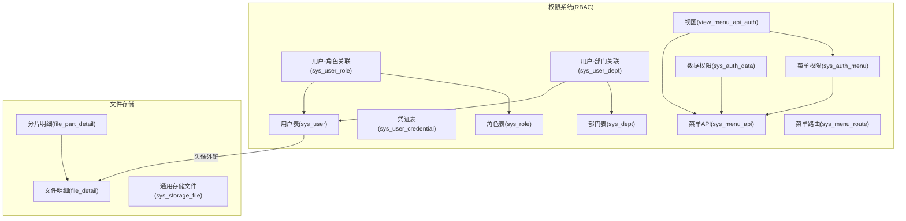
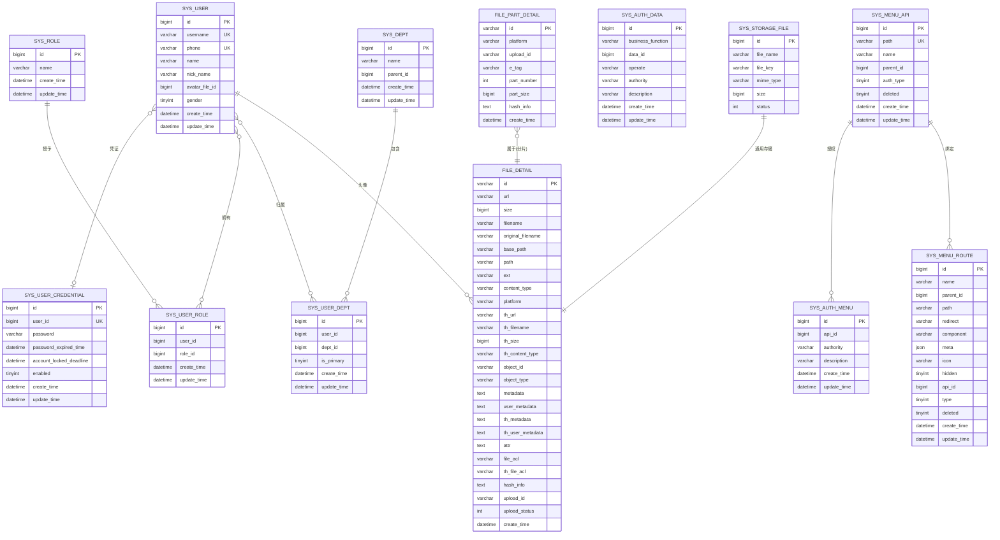
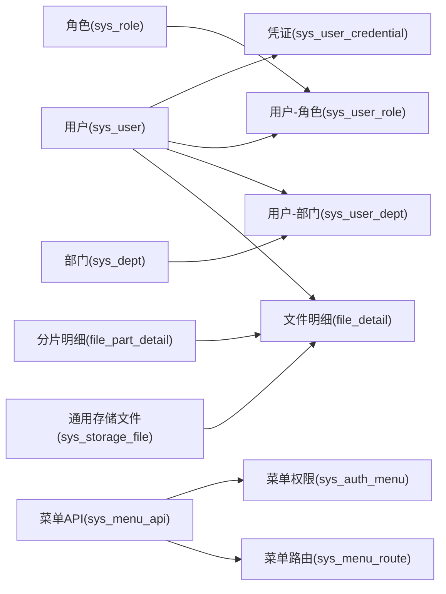

# 数据库设计

<cite>
**本文引用的文件**
- [storage.sql](file://docs/sql/storage.sql)
- [sys_request_log.sql](file://docs/sql/sys_request_log.sql)
- [auth_full.sql](file://qy-auth/relation/sql/auth_full.sql)
- [auth_20240801.sql](file://qy-auth/relation/sql/auth_20240801.sql)
- [FileDetail.java](file://boot/storage-spring-boot-starter/src/main/java/com/kewen/framework/storage/web/mp/entity/FileDetail.java)
- [FilePartDetail.java](file://boot/storage-spring-boot-starter/src/main/java/com/kewen/framework/storage/web/mp/entity/FilePartDetail.java)
- [SysStorageFile.java](file://boot/storage-spring-boot-starter/src/main/java/com/kewen/framework/storage/web/mp/entity/SysStorageFile.java)
- [SysUser.java](file://qy-auth/auth-rbac/src/main/java/com/kewen/framework/auth/rabc/mp/entity/SysUser.java)
- [SysDept.java](file://qy-auth/auth-rbac/src/main/java/com/kewen/framework/auth/rabc/mp/entity/SysDept.java)
- [SysRole.java](file://qy-auth/auth-rbac/src/main/java/com/kewen/framework/auth/rabc/mp/entity/SysRole.java)
- [SysAuthData.java](file://qy-auth/auth-rbac/src/main/java/com/kewen/framework/auth/rabc/mp/entity/SysAuthData.java)
- [SysAuthMenu.java](file://qy-auth/auth-rbac/src/main/java/com/kewen/framework/auth/rabc/mp/entity/SysAuthMenu.java)
- [SysMenuApi.java](file://qy-auth/auth-rbac/src/main/java/com/kewen/framework/auth/rabc/mp/entity/SysMenuApi.java)
- [SysMenuRoute.java](file://qy-auth/auth-rbac/src/main/java/com/kewen/framework/auth/rabc/mp/entity/SysMenuRoute.java)
- [SysUserCredential.java](file://qy-auth/auth-rbac/src/main/java/com/kewen/framework/auth/rabc/mp/entity/SysUserCredential.java)
- [SysUserDept.java](file://qy-auth/auth-rbac/src/main/java/com/kewen/framework/auth/rabc/mp/entity/SysUserDept.java)
- [SysUserRole.java](file://qy-auth/auth-rbac/src/main/java/com/kewen/framework/auth/rabc/mp/entity/SysUserRole.java)
</cite>

## 目录
1. [简介](#简介)
2. [项目结构](#项目结构)
3. [核心组件](#核心组件)
4. [架构总览](#架构总览)
5. [详细组件分析](#详细组件分析)
6. [依赖分析](#依赖分析)
7. [性能考量](#性能考量)
8. [故障排查指南](#故障排查指南)
9. [结论](#结论)
10. [附录](#附录)

## 简介
本文件面向数据库设计与实现，围绕权限系统与文件存储两大主题，系统化梳理实体关系、字段定义、索引与约束、数据访问模式、缓存策略、性能优化、数据生命周期与归档、以及迁移与版本管理策略。内容严格依据仓库中的 SQL 脚本与实体类映射，确保可追溯性与一致性。

## 项目结构
本项目采用模块化组织，权限系统与文件存储分别由独立模块提供脚本与实体映射：
- 权限系统（RBAC）：包含用户、角色、部门、菜单、凭证及权限数据表，配套视图与索引。
- 文件存储：包含文件明细、分片明细与通用存储文件三张表，支持分片上传与缩略图元数据。

**图表来源**
- [auth_full.sql:19-190](file://qy-auth/relation/sql/auth_full.sql#L19-L190)
- [storage.sql:1-45](file://docs/sql/storage.sql#L1-L45)

**章节来源**
- [auth_full.sql:19-190](file://qy-auth/relation/sql/auth_full.sql#L19-L190)
- [auth_20240801.sql:19-190](file://qy-auth/relation/sql/auth_20240801.sql#L19-L190)
- [storage.sql:1-45](file://docs/sql/storage.sql#L1-L45)

## 核心组件
本节聚焦权限系统与文件存储的关键表及其职责：
- 权限系统
  - 用户表：存储用户基本信息与唯一标识。
  - 凭证表：存储用户认证凭据、有效期与启用状态。
  - 部门表：树形组织结构，支持父子关系。
  - 角色表：角色定义。
  - 关联表：用户-角色、用户-部门。
  - 菜单与路由：API 路径与前端路由配置。
  - 权限表：API 权限与数据权限。
  - 视图：便捷查询“自身权限”类型的菜单权限。
- 文件存储
  - 文件明细：文件元信息、缩略图信息、上传状态与哈希。
  - 分片明细：手动分片上传的分片信息。
  - 通用存储文件：统一的存储文件记录（与文件明细互补）。

**章节来源**
- [SysUser.java:25-96](file://qy-auth/auth-rbac/src/main/java/com/kewen/framework/auth/rabc/mp/entity/SysUser.java#L25-L96)
- [SysUserCredential.java:25-90](file://qy-auth/auth-rbac/src/main/java/com/kewen/framework/auth/rabc/mp/entity/SysUserCredential.java#L25-L90)
- [SysDept.java:25-66](file://qy-auth/auth-rbac/src/main/java/com/kewen/framework/auth/rabc/mp/entity/SysDept.java#L25-L66)
- [SysRole.java:25-60](file://qy-auth/auth-rbac/src/main/java/com/kewen/framework/auth/rabc/mp/entity/SysRole.java#L25-L60)
- [SysUserRole.java:25-66](file://qy-auth/auth-rbac/src/main/java/com/kewen/framework/auth/rabc/mp/entity/SysUserRole.java#L25-L66)
- [SysUserDept.java:25-72](file://qy-auth/auth-rbac/src/main/java/com/kewen/framework/auth/rabc/mp/entity/SysUserDept.java#L25-L72)
- [SysMenuApi.java:28-94](file://qy-auth/auth-rbac/src/main/java/com/kewen/framework/auth/rabc/mp/entity/SysMenuApi.java#L28-L94)
- [SysMenuRoute.java:28-129](file://qy-auth/auth-rbac/src/main/java/com/kewen/framework/auth/rabc/mp/entity/SysMenuRoute.java#L28-L129)
- [SysAuthMenu.java:25-72](file://qy-auth/auth-rbac/src/main/java/com/kewen/framework/auth/rabc/mp/entity/SysAuthMenu.java#L25-L72)
- [SysAuthData.java:25-84](file://qy-auth/auth-rbac/src/main/java/com/kewen/framework/auth/rabc/mp/entity/SysAuthData.java#L25-L84)
- [FileDetail.java:25-198](file://boot/storage-spring-boot-starter/src/main/java/com/kewen/framework/storage/web/mp/entity/FileDetail.java#L25-L198)
- [FilePartDetail.java:25-84](file://boot/storage-spring-boot-starter/src/main/java/com/kewen/framework/storage/web/mp/entity/FilePartDetail.java#L25-L84)
- [SysStorageFile.java:25-70](file://boot/storage-spring-boot-starter/src/main/java/com/kewen/framework/storage/web/mp/entity/SysStorageFile.java#L25-L70)

## 架构总览
下图展示权限系统与文件存储的实体关系与关键外键约束：

**图表来源**
- [auth_full.sql:19-190](file://qy-auth/relation/sql/auth_full.sql#L19-L190)
- [storage.sql:1-45](file://docs/sql/storage.sql#L1-L45)
- [SysUser.java:25-96](file://qy-auth/auth-rbac/src/main/java/com/kewen/framework/auth/rabc/mp/entity/SysUser.java#L25-L96)
- [SysUserCredential.java:25-90](file://qy-auth/auth-rbac/src/main/java/com/kewen/framework/auth/rabc/mp/entity/SysUserCredential.java#L25-L90)
- [SysDept.java:25-66](file://qy-auth/auth-rbac/src/main/java/com/kewen/framework/auth/rabc/mp/entity/SysDept.java#L25-L66)
- [SysRole.java:25-60](file://qy-auth/auth-rbac/src/main/java/com/kewen/framework/auth/rabc/mp/entity/SysRole.java#L25-L60)
- [SysUserRole.java:25-66](file://qy-auth/auth-rbac/src/main/java/com/kewen/framework/auth/rabc/mp/entity/SysUserRole.java#L25-L66)
- [SysUserDept.java:25-72](file://qy-auth/auth-rbac/src/main/java/com/kewen/framework/auth/rabc/mp/entity/SysUserDept.java#L25-L72)
- [SysMenuApi.java:28-94](file://qy-auth/auth-rbac/src/main/java/com/kewen/framework/auth/rabc/mp/entity/SysMenuApi.java#L28-L94)
- [SysMenuRoute.java:28-129](file://qy-auth/auth-rbac/src/main/java/com/kewen/framework/auth/rabc/mp/entity/SysMenuRoute.java#L28-L129)
- [SysAuthMenu.java:25-72](file://qy-auth/auth-rbac/src/main/java/com/kewen/framework/auth/rabc/mp/entity/SysAuthMenu.java#L25-L72)
- [SysAuthData.java:25-84](file://qy-auth/auth-rbac/src/main/java/com/kewen/framework/auth/rabc/mp/entity/SysAuthData.java#L25-L84)
- [FileDetail.java:25-198](file://boot/storage-spring-boot-starter/src/main/java/com/kewen/framework/storage/web/mp/entity/FileDetail.java#L25-L198)
- [FilePartDetail.java:25-84](file://boot/storage-spring-boot-starter/src/main/java/com/kewen/framework/storage/web/mp/entity/FilePartDetail.java#L25-L84)
- [SysStorageFile.java:25-70](file://boot/storage-spring-boot-starter/src/main/java/com/kewen/framework/storage/web/mp/entity/SysStorageFile.java#L25-L70)

## 详细组件分析

### 权限系统表设计与字段说明
- 用户表(sys_user)
  - 主键：id
  - 唯一索引：username、phone
  - 字段要点：头像字段指向文件明细表；性别枚举；时间戳。
- 凭证表(sys_user_credential)
  - 主键：id；唯一索引：user_id
  - 字段要点：密码、过期时间、锁定截止时间、启用状态。
- 部门表(sys_dept)
  - 主键：id；父子关系通过parent_id表达。
- 角色表(sys_role)
  - 主键：id；角色名。
- 用户-角色关联(sys_user_role)
  - 主键：id；索引：user_id, role_id。
- 用户-部门关联(sys_user_dept)
  - 主键：id；索引：user_id, dept_id；is_primary 标识主要部门。
- 菜单API(sys_menu_api)
  - 主键：id；唯一索引：path；auth_type 决定权限继承策略；deleted 标记软删。
- 菜单路由(sys_menu_route)
  - 主键：id；meta 使用 JSON 存储；api_id 关联 API。
- 菜单权限(sys_auth_menu)
  - 主键：id；authority 为权限字符串。
- 数据权限(sys_auth_data)
  - 主键：id；复合索引：business_function, operate, data_id, authority。
- 视图(view_menu_api_auth)
  - 仅展示“自身权限”类型且未删除的菜单与权限。

**章节来源**
- [auth_full.sql:19-190](file://qy-auth/relation/sql/auth_full.sql#L19-L190)
- [auth_20240801.sql:19-190](file://qy-auth/relation/sql/auth_20240801.sql#L19-L190)
- [SysUser.java:25-96](file://qy-auth/auth-rbac/src/main/java/com/kewen/framework/auth/rabc/mp/entity/SysUser.java#L25-L96)
- [SysUserCredential.java:25-90](file://qy-auth/auth-rbac/src/main/java/com/kewen/framework/auth/rabc/mp/entity/SysUserCredential.java#L25-L90)
- [SysDept.java:25-66](file://qy-auth/auth-rbac/src/main/java/com/kewen/framework/auth/rabc/mp/entity/SysDept.java#L25-L66)
- [SysRole.java:25-60](file://qy-auth/auth-rbac/src/main/java/com/kewen/framework/auth/rabc/mp/entity/SysRole.java#L25-L60)
- [SysUserRole.java:25-66](file://qy-auth/auth-rbac/src/main/java/com/kewen/framework/auth/rabc/mp/entity/SysUserRole.java#L25-L66)
- [SysUserDept.java:25-72](file://qy-auth/auth-rbac/src/main/java/com/kewen/framework/auth/rabc/mp/entity/SysUserDept.java#L25-L72)
- [SysMenuApi.java:28-94](file://qy-auth/auth-rbac/src/main/java/com/kewen/framework/auth/rabc/mp/entity/SysMenuApi.java#L28-L94)
- [SysMenuRoute.java:28-129](file://qy-auth/auth-rbac/src/main/java/com/kewen/framework/auth/rabc/mp/entity/SysMenuRoute.java#L28-L129)
- [SysAuthMenu.java:25-72](file://qy-auth/auth-rbac/src/main/java/com/kewen/framework/auth/rabc/mp/entity/SysAuthMenu.java#L25-L72)
- [SysAuthData.java:25-84](file://qy-auth/auth-rbac/src/main/java/com/kewen/framework/auth/rabc/mp/entity/SysAuthData.java#L25-L84)

### 文件存储表设计与字段说明
- 文件明细(file_detail)
  - 主键：id；用于访问的URL、缩略图URL、MIME类型、扩展名、路径、基础路径。
  - 对象关联：object_id、object_type；元数据：metadata、user_metadata、th_*系列。
  - 上传状态：upload_id、upload_status；哈希信息：hash_info；ACL：file_acl、th_file_acl。
  - 时间戳：create_time。
- 分片明细(file_part_detail)
  - 主键：id；分片号、大小、ETag、哈希；与文件明细通过upload_id关联。
- 通用存储文件(sys_storage_file)
  - 主键：id；file_name、file_key、mime_type、size、status。

**章节来源**
- [storage.sql:1-45](file://docs/sql/storage.sql#L1-L45)
- [FileDetail.java:25-198](file://boot/storage-spring-boot-starter/src/main/java/com/kewen/framework/storage/web/mp/entity/FileDetail.java#L25-L198)
- [FilePartDetail.java:25-84](file://boot/storage-spring-boot-starter/src/main/java/com/kewen/framework/storage/web/mp/entity/FilePartDetail.java#L25-L84)
- [SysStorageFile.java:25-70](file://boot/storage-spring-boot-starter/src/main/java/com/kewen/framework/storage/web/mp/entity/SysStorageFile.java#L25-L70)

### 数据访问模式与缓存策略
- 访问模式
  - 权限查询：通过菜单API表与菜单权限表关联，结合视图快速定位“自身权限”类型。
  - 用户-角色-部门链路：先按用户查角色与部门，再合并权限集合。
  - 文件访问：优先从文件明细表读取URL与元数据；分片上传场景通过分片明细校验与聚合。
- 缓存策略建议
  - 菜单与路由：缓存sys_menu_route与sys_menu_api，结合版本号或时间戳失效。
  - 权限字符串：对用户维度的authority进行短期缓存，写操作后失效。
  - 文件元数据：热点文件元数据与缩略图信息可缓存，上传完成后更新。
  - 凭证与锁定：账户锁定与过期时间可缓存，定时刷新。

[本节为概念性说明，无需列出具体文件来源]

### 数据验证与业务规则
- 唯一性约束
  - 用户：username、phone唯一。
  - 菜单API：path唯一。
  - 凭证：user_id唯一。
- 软删除
  - 菜单API与菜单路由使用deleted字段标记逻辑删除。
- 权限类型
  - auth_type=1 表示“基于自身权限”，auth_type=2 表示“基于父权限”。
- 上传状态
  - 文件明细的upload_status用于分片上传流程控制（初始化完成、上传完成）。
- 头像关联
  - 用户表的avatar_file_id指向文件明细表，形成头像引用。

**章节来源**
- [auth_full.sql:118-152](file://qy-auth/relation/sql/auth_full.sql#L118-L152)
- [auth_full.sql:64-79](file://qy-auth/relation/sql/auth_full.sql#L64-L79)
- [auth_full.sql:137-152](file://qy-auth/relation/sql/auth_full.sql#L137-L152)
- [auth_full.sql:64-79](file://qy-auth/relation/sql/auth_full.sql#L64-L79)
- [auth_full.sql:185-190](file://qy-auth/relation/sql/auth_full.sql#L185-L190)
- [storage.sql:28-31](file://docs/sql/storage.sql#L28-L31)

### 示例数据
以下为典型示例数据的插入思路（字段对应关系以表结构为准）：
- 用户
  - 字段：name、nick_name、username、phone、email、avatar_file_id、gender。
- 凭证
  - 字段：user_id、password、password_expired_time、account_locked_deadline、enabled。
- 部门
  - 字段：name、parent_id。
- 角色
  - 字段：name。
- 用户-角色/用户-部门
  - 字段：user_id、role_id 或 dept_id、is_primary。
- 菜单API
  - 字段：id、path、name、parent_id、auth_type、deleted。
- 菜单路由
  - 字段：name、parent_id、path、redirect、component、meta、icon、hidden、api_id、type、deleted。
- 菜单权限
  - 字段：api_id、authority、description。
- 数据权限
  - 字段：business_function、data_id、operate、authority、description。
- 文件明细
  - 字段：id、url、size、filename、original_filename、base_path、path、ext、content_type、platform、th_*、object_*、metadata、user_metadata、attr、file_acl、th_file_acl、hash_info、upload_id、upload_status、create_time。
- 分片明细
  - 字段：id、platform、upload_id、e_tag、part_number、part_size、hash_info、create_time。
- 通用存储文件
  - 字段：file_name、file_key、mime_type、size、status。

**章节来源**
- [auth_full.sql:117-181](file://qy-auth/relation/sql/auth_full.sql#L117-L181)
- [auth_full.sql:64-102](file://qy-auth/relation/sql/auth_full.sql#L64-L102)
- [auth_full.sql:185-190](file://qy-auth/relation/sql/auth_full.sql#L185-L190)
- [storage.sql:2-45](file://docs/sql/storage.sql#L2-L45)
- [SysUser.java:25-96](file://qy-auth/auth-rbac/src/main/java/com/kewen/framework/auth/rabc/mp/entity/SysUser.java#L25-L96)
- [SysUserCredential.java:25-90](file://qy-auth/auth-rbac/src/main/java/com/kewen/framework/auth/rabc/mp/entity/SysUserCredential.java#L25-L90)
- [SysDept.java:25-66](file://qy-auth/auth-rbac/src/main/java/com/kewen/framework/auth/rabc/mp/entity/SysDept.java#L25-L66)
- [SysRole.java:25-60](file://qy-auth/auth-rbac/src/main/java/com/kewen/framework/auth/rabc/mp/entity/SysRole.java#L25-L60)
- [SysUserRole.java:25-66](file://qy-auth/auth-rbac/src/main/java/com/kewen/framework/auth/rabc/mp/entity/SysUserRole.java#L25-L66)
- [SysUserDept.java:25-72](file://qy-auth/auth-rbac/src/main/java/com/kewen/framework/auth/rabc/mp/entity/SysUserDept.java#L25-L72)
- [SysMenuApi.java:28-94](file://qy-auth/auth-rbac/src/main/java/com/kewen/framework/auth/rabc/mp/entity/SysMenuApi.java#L28-L94)
- [SysMenuRoute.java:28-129](file://qy-auth/auth-rbac/src/main/java/com/kewen/framework/auth/rabc/mp/entity/SysMenuRoute.java#L28-L129)
- [SysAuthMenu.java:25-72](file://qy-auth/auth-rbac/src/main/java/com/kewen/framework/auth/rabc/mp/entity/SysAuthMenu.java#L25-L72)
- [SysAuthData.java:25-84](file://qy-auth/auth-rbac/src/main/java/com/kewen/framework/auth/rabc/mp/entity/SysAuthData.java#L25-L84)
- [FileDetail.java:25-198](file://boot/storage-spring-boot-starter/src/main/java/com/kewen/framework/storage/web/mp/entity/FileDetail.java#L25-L198)
- [FilePartDetail.java:25-84](file://boot/storage-spring-boot-starter/src/main/java/com/kewen/framework/storage/web/mp/entity/FilePartDetail.java#L25-L84)
- [SysStorageFile.java:25-70](file://boot/storage-spring-boot-starter/src/main/java/com/kewen/framework/storage/web/mp/entity/SysStorageFile.java#L25-L70)

### 数据生命周期、保留策略与归档
- 生命周期
  - 用户与凭证：长期保留，变更需审计。
  - 菜单与权限：随业务迭代更新，历史保留以便审计。
  - 文件明细：根据业务策略决定保留周期；缩略图与原文件可异步清理。
- 保留策略
  - 临时文件与未完成分片：超时清理。
  - 已删除的菜单与路由：软删除保留，定期归档。
- 归档规则
  - 历史权限与操作日志可归档至冷存储；热数据保留在在线库。

[本节为概念性说明，无需列出具体文件来源]

### 数据迁移路径与版本管理
- 版本管理
  - 权限系统：auth_full.sql 与 auth_20240801.sql 提供不同版本快照，可用于对比与回滚。
  - 文件存储：storage.sql 作为文件相关表的基准脚本。
- 迁移路径
  - 权限系统：先执行 auth_full.sql，再根据需要应用增量脚本；如需回滚，使用对应版本脚本。
  - 文件存储：先执行 storage.sql，再补充业务数据。
- 最佳实践
  - 迁移前备份；迁移后验证索引与视图；灰度发布与回滚预案。

**章节来源**
- [auth_full.sql:1-190](file://qy-auth/relation/sql/auth_full.sql#L1-L190)
- [auth_20240801.sql:1-190](file://qy-auth/relation/sql/auth_20240801.sql#L1-L190)
- [storage.sql:1-45](file://docs/sql/storage.sql#L1-L45)

## 依赖分析
- 权限系统内部依赖
  - 用户凭证依赖用户主表；用户-角色与用户-部门为多对多桥接。
  - 菜单API与菜单路由通过id关联；菜单权限依赖API。
  - 视图依赖菜单API与菜单权限。
- 文件存储依赖
  - 用户头像外键指向文件明细；分片明细与文件明细通过upload_id关联。

**图表来源**
- [auth_full.sql:117-181](file://qy-auth/relation/sql/auth_full.sql#L117-L181)
- [auth_full.sql:64-102](file://qy-auth/relation/sql/auth_full.sql#L64-L102)
- [storage.sql:28-45](file://docs/sql/storage.sql#L28-L45)
- [SysUser.java:25-96](file://qy-auth/auth-rbac/src/main/java/com/kewen/framework/auth/rabc/mp/entity/SysUser.java#L25-L96)
- [SysUserCredential.java:25-90](file://qy-auth/auth-rbac/src/main/java/com/kewen/framework/auth/rabc/mp/entity/SysUserCredential.java#L25-L90)
- [SysDept.java:25-66](file://qy-auth/auth-rbac/src/main/java/com/kewen/framework/auth/rabc/mp/entity/SysDept.java#L25-L66)
- [SysRole.java:25-60](file://qy-auth/auth-rbac/src/main/java/com/kewen/framework/auth/rabc/mp/entity/SysRole.java#L25-L60)
- [SysUserRole.java:25-66](file://qy-auth/auth-rbac/src/main/java/com/kewen/framework/auth/rabc/mp/entity/SysUserRole.java#L25-L66)
- [SysUserDept.java:25-72](file://qy-auth/auth-rbac/src/main/java/com/kewen/framework/auth/rabc/mp/entity/SysUserDept.java#L25-L72)
- [SysMenuApi.java:28-94](file://qy-auth/auth-rbac/src/main/java/com/kewen/framework/auth/rabc/mp/entity/SysMenuApi.java#L28-L94)
- [SysMenuRoute.java:28-129](file://qy-auth/auth-rbac/src/main/java/com/kewen/framework/auth/rabc/mp/entity/SysMenuRoute.java#L28-L129)
- [SysAuthMenu.java:25-72](file://qy-auth/auth-rbac/src/main/java/com/kewen/framework/auth/rabc/mp/entity/SysAuthMenu.java#L25-L72)
- [FileDetail.java:25-198](file://boot/storage-spring-boot-starter/src/main/java/com/kewen/framework/storage/web/mp/entity/FileDetail.java#L25-L198)
- [FilePartDetail.java:25-84](file://boot/storage-spring-boot-starter/src/main/java/com/kewen/framework/storage/web/mp/entity/FilePartDetail.java#L25-L84)
- [SysStorageFile.java:25-70](file://boot/storage-spring-boot-starter/src/main/java/com/kewen/framework/storage/web/mp/entity/SysStorageFile.java#L25-L70)

**章节来源**
- [auth_full.sql:117-181](file://qy-auth/relation/sql/auth_full.sql#L117-L181)
- [auth_full.sql:64-102](file://qy-auth/relation/sql/auth_full.sql#L64-L102)
- [storage.sql:28-45](file://docs/sql/storage.sql#L28-L45)

## 性能考量
- 索引与查询
  - 权限数据：sys_auth_data 的复合索引覆盖业务函数、操作类型、数据ID与权限串，适合高并发过滤。
  - 关联表：sys_user_role 与 sys_user_dept 的联合索引提升权限合并效率。
  - 菜单API：path 唯一索引，保证路由解析快速命中。
- 写入与事务
  - 分片上传：file_detail 与 file_part_detail 的写入需保证原子性与幂等；upload_status 作为流程控制。
- 缓存与热点
  - 菜单与路由、权限字符串、文件元数据建议缓存；写操作后失效。
- 日志与追踪
  - sys_request_log 提供请求级追踪与耗时统计，便于性能分析与问题定位。

**章节来源**
- [auth_full.sql:22-34](file://qy-auth/relation/sql/auth_full.sql#L22-L34)
- [auth_full.sql:169-181](file://qy-auth/relation/sql/auth_full.sql#L169-L181)
- [auth_full.sql:64-79](file://qy-auth/relation/sql/auth_full.sql#L64-L79)
- [sys_request_log.sql:1-19](file://docs/sql/sys_request_log.sql#L1-L19)

## 故障排查指南
- 常见问题
  - 唯一冲突：用户名、手机号、API路径冲突时检查唯一索引。
  - 权限缺失：确认菜单API是否存在、auth_type是否正确、视图是否生效。
  - 文件上传异常：检查upload_id与upload_status，核对分片ETag与数量。
  - 账户锁定：检查凭证表的锁定截止时间与启用状态。
- 排查步骤
  - 核对表结构与索引是否完整。
  - 查看sys_request_log的trace_id定位请求链路。
  - 检查缓存命中情况与失效策略。

**章节来源**
- [auth_full.sql:117-152](file://qy-auth/relation/sql/auth_full.sql#L117-L152)
- [auth_full.sql:64-79](file://qy-auth/relation/sql/auth_full.sql#L64-L79)
- [auth_full.sql:185-190](file://qy-auth/relation/sql/auth_full.sql#L185-L190)
- [storage.sql:28-31](file://docs/sql/storage.sql#L28-L31)
- [sys_request_log.sql:1-19](file://docs/sql/sys_request_log.sql#L1-L19)

## 结论
本设计以权限系统与文件存储为核心，通过清晰的实体关系、完善的索引与约束、以及可扩展的迁移脚本，支撑业务的认证授权与文件管理需求。配合缓存与性能优化策略，可在高并发场景下保持稳定与高效。建议在生产环境中严格执行版本管理与回滚预案，并持续监控与优化关键路径。

## 附录
- 参考脚本
  - 权限系统：auth_full.sql、auth_20240801.sql
  - 文件存储：storage.sql
  - 请求日志：sys_request_log.sql
- 实体映射
  - 权限系统实体：SysUser、SysUserCredential、SysDept、SysRole、SysUserRole、SysUserDept、SysMenuApi、SysMenuRoute、SysAuthMenu、SysAuthData
  - 文件存储实体：FileDetail、FilePartDetail、SysStorageFile

**章节来源**
- [auth_full.sql:1-190](file://qy-auth/relation/sql/auth_full.sql#L1-L190)
- [auth_20240801.sql:1-190](file://qy-auth/relation/sql/auth_20240801.sql#L1-L190)
- [storage.sql:1-45](file://docs/sql/storage.sql#L1-L45)
- [sys_request_log.sql:1-19](file://docs/sql/sys_request_log.sql#L1-L19)
- [SysUser.java:25-96](file://qy-auth/auth-rbac/src/main/java/com/kewen/framework/auth/rabc/mp/entity/SysUser.java#L25-L96)
- [SysUserCredential.java:25-90](file://qy-auth/auth-rbac/src/main/java/com/kewen/framework/auth/rabc/mp/entity/SysUserCredential.java#L25-L90)
- [SysDept.java:25-66](file://qy-auth/auth-rbac/src/main/java/com/kewen/framework/auth/rabc/mp/entity/SysDept.java#L25-L66)
- [SysRole.java:25-60](file://qy-auth/auth-rbac/src/main/java/com/kewen/framework/auth/rabc/mp/entity/SysRole.java#L25-L60)
- [SysUserRole.java:25-66](file://qy-auth/auth-rbac/src/main/java/com/kewen/framework/auth/rabc/mp/entity/SysUserRole.java#L25-L66)
- [SysUserDept.java:25-72](file://qy-auth/auth-rbac/src/main/java/com/kewen/framework/auth/rabc/mp/entity/SysUserDept.java#L25-L72)
- [SysMenuApi.java:28-94](file://qy-auth/auth-rbac/src/main/java/com/kewen/framework/auth/rabc/mp/entity/SysMenuApi.java#L28-L94)
- [SysMenuRoute.java:28-129](file://qy-auth/auth-rbac/src/main/java/com/kewen/framework/auth/rabc/mp/entity/SysMenuRoute.java#L28-L129)
- [SysAuthMenu.java:25-72](file://qy-auth/auth-rbac/src/main/java/com/kewen/framework/auth/rabc/mp/entity/SysAuthMenu.java#L25-L72)
- [SysAuthData.java:25-84](file://qy-auth/auth-rbac/src/main/java/com/kewen/framework/auth/rabc/mp/entity/SysAuthData.java#L25-L84)
- [FileDetail.java:25-198](file://boot/storage-spring-boot-starter/src/main/java/com/kewen/framework/storage/web/mp/entity/FileDetail.java#L25-L198)
- [FilePartDetail.java:25-84](file://boot/storage-spring-boot-starter/src/main/java/com/kewen/framework/storage/web/mp/entity/FilePartDetail.java#L25-L84)
- [SysStorageFile.java:25-70](file://boot/storage-spring-boot-starter/src/main/java/com/kewen/framework/storage/web/mp/entity/SysStorageFile.java#L25-L70)