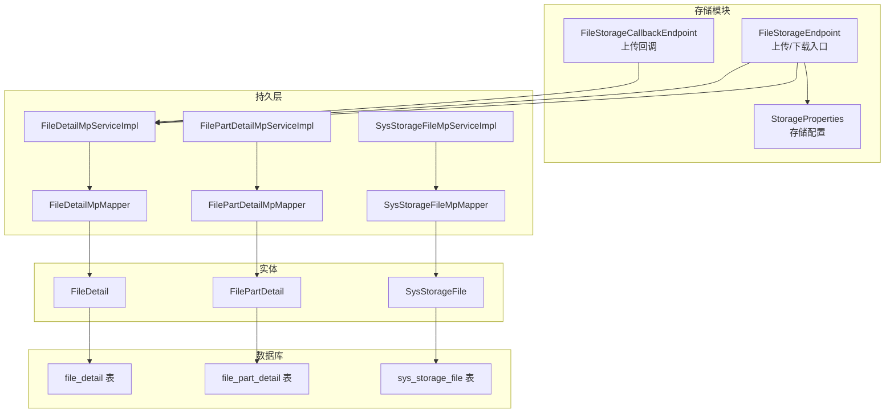
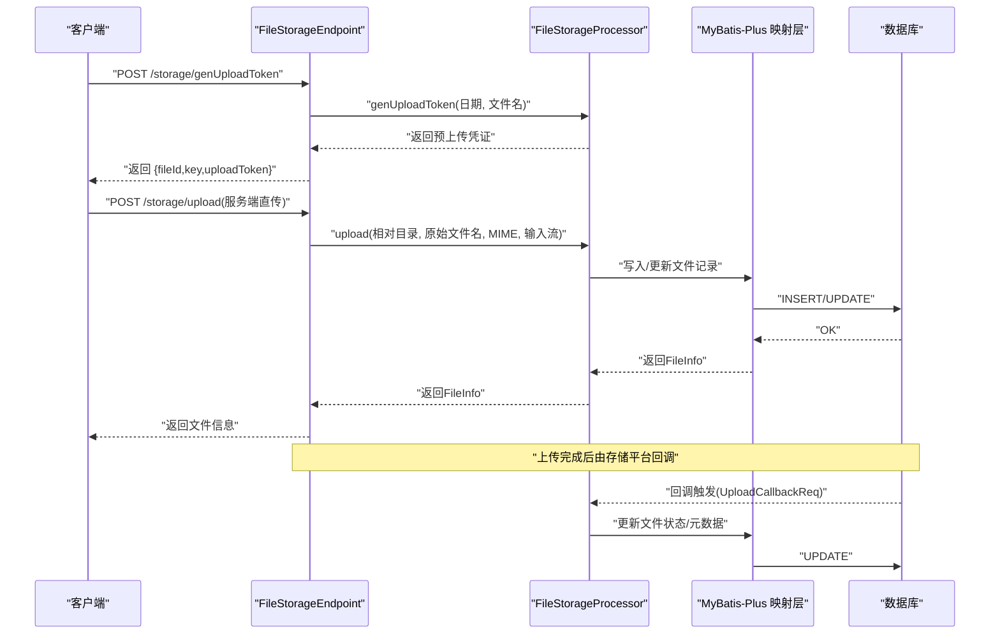
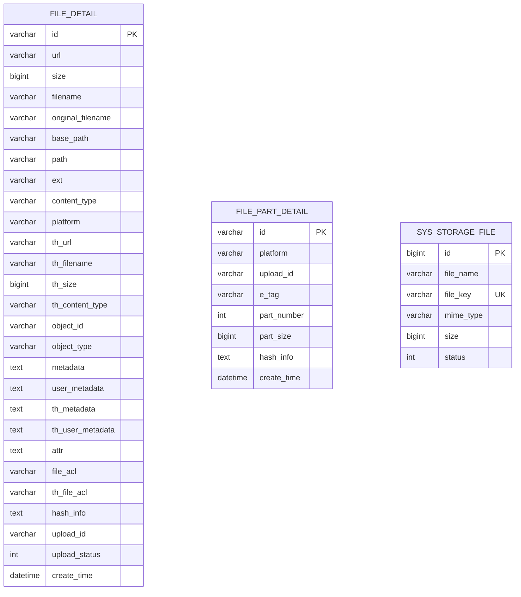
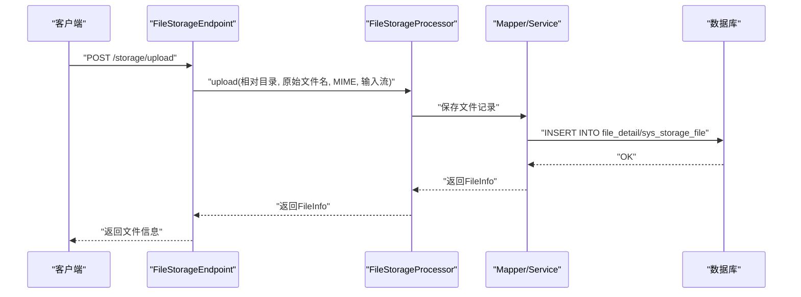
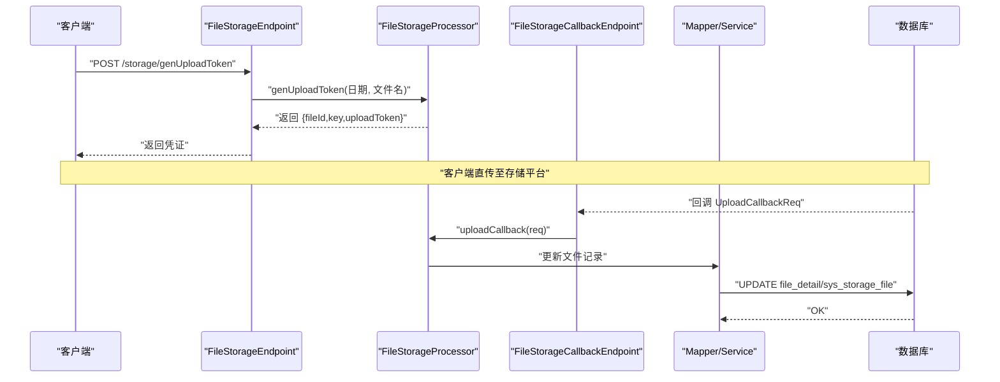
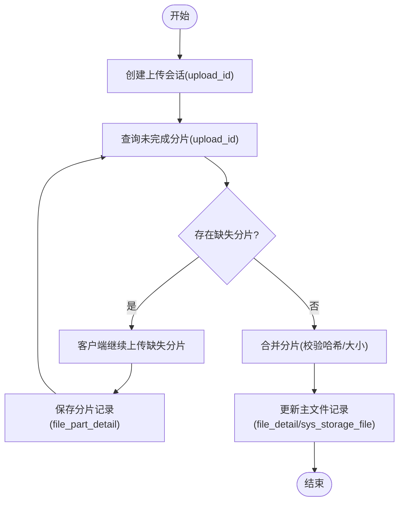
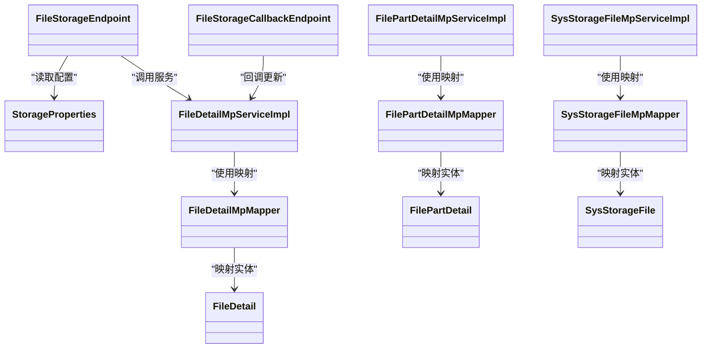

# 文件存储数据库设计

<cite>
**本文引用的文件**
- [storage.sql](file://docs/sql/storage.sql)
- [SysStorageFile.java](file://boot/storage-spring-boot-starter/src/main/java/com/kewen/framework/storage/web/mp/entity/SysStorageFile.java)
- [FileDetail.java](file://boot/storage-spring-boot-starter/src/main/java/com/kewen/framework/storage/web/mp/entity/FileDetail.java)
- [FilePartDetail.java](file://boot/storage-spring-boot-starter/src/main/java/com/kewen/framework/storage/web/mp/entity/FilePartDetail.java)
- [SysStorageFileMpMapper.java](file://boot/storage-spring-boot-starter/src/main/java/com/kewen/framework/storage/web/mp/mapper/SysStorageFileMpMapper.java)
- [FileDetailMpMapper.java](file://boot/storage-spring-boot-starter/src/main/java/com/kewen/framework/storage/web/mp/mapper/FileDetailMpMapper.java)
- [FilePartDetailMpMapper.java](file://boot/storage-spring-boot-starter/src/main/java/com/kewen/framework/storage/web/mp/mapper/FilePartDetailMpMapper.java)
- [SysStorageFileMpServiceImpl.java](file://boot/storage-spring-boot-starter/src/main/java/com/kewen/framework/storage/web/mp/service/impl/SysStorageFileMpServiceImpl.java)
- [FileDetailMpServiceImpl.java](file://boot/storage-spring-boot-starter/src/main/java/com/kewen/framework/storage/web/mp/service/impl/FileDetailMpServiceImpl.java)
- [FilePartDetailMpServiceImpl.java](file://boot/storage-spring-boot-starter/src/main/java/com/kewen/framework/storage/web/mp/service/impl/FilePartDetailMpServiceImpl.java)
- [StorageProperties.java](file://boot/storage-spring-boot-starter/src/main/java/com/kewen/framework/storage/boot/StorageProperties.java)
- [FileStorageEndpoint.java](file://boot/storage-spring-boot-starter/src/main/java/com/kewen/framework/storage/web/FileStorageEndpoint.java)
- [FileStorageCallbackEndpoint.java](file://boot/storage-spring-boot-starter/src/main/java/com/kewen/framework/storage/web/FileStorageCallbackEndpoint.java)
- [PreUploadTokenReq.java](file://boot/storage-spring-boot-starter/src/main/java/com/kewen/framework/storage/web/model/PreUploadTokenReq.java)
- [PreUploadTokenResp.java](file://boot/storage-spring-boot-starter/src/main/java/com/kewen/framework/storage/web/model/PreUploadTokenResp.java)
</cite>

## 目录
1. [简介](#简介)
2. [项目结构](#项目结构)
3. [核心组件](#核心组件)
4. [架构总览](#架构总览)
5. [详细组件分析](#详细组件分析)
6. [依赖关系分析](#依赖关系分析)
7. [性能考量](#性能考量)
8. [故障排查指南](#故障排查指南)
9. [结论](#结论)
10. [附录](#附录)

## 简介
本文件存储数据库设计面向企业级文件存储系统，围绕以下核心目标展开：
- 设计并规范文件存储相关的核心数据表（如文件详情表、分片详情表等），明确字段定义、数据类型、约束与索引策略。
- 解释文件上传、分片上传、断点续传的数据库实现机制。
- 提供文件状态管理、元数据存储与版本控制的数据模型建议。
- 覆盖完整性校验、去重机制与清理策略。
- 展示文件访问统计与性能监控的数据结构。
- 给出文件存储的扩容与迁移方案。

该设计基于仓库中的 SQL 脚本与 Java 实体/映射/服务层代码进行归纳总结，并结合存储配置与上传接口进行流程化说明。

## 项目结构
文件存储模块位于 boot/storage-spring-boot-starter 中，采用 MyBatis-Plus 的实体-映射-服务三层结构，配合 Spring Boot 控制器对外提供上传、下载与回调能力；数据库脚本位于 docs/sql 目录。

图表来源
- [FileStorageEndpoint.java:1-88](file://boot/storage-spring-boot-starter/src/main/java/com/kewen/framework/storage/web/FileStorageEndpoint.java#L1-L88)
- [FileStorageCallbackEndpoint.java:1-66](file://boot/storage-spring-boot-starter/src/main/java/com/kewen/framework/storage/web/FileStorageCallbackEndpoint.java#L1-L66)
- [StorageProperties.java:1-45](file://boot/storage-spring-boot-starter/src/main/java/com/kewen/framework/storage/boot/StorageProperties.java#L1-L45)
- [FileDetailMpMapper.java:1-19](file://boot/storage-spring-boot-starter/src/main/java/com/kewen/framework/storage/web/mp/mapper/FileDetailMpMapper.java#L1-L19)
- [FilePartDetailMpMapper.java:1-19](file://boot/storage-spring-boot-starter/src/main/java/com/kewen/framework/storage/web/mp/mapper/FilePartDetailMpMapper.java#L1-L19)
- [SysStorageFileMpMapper.java:1-19](file://boot/storage-spring-boot-starter/src/main/java/com/kewen/framework/storage/web/mp/mapper/SysStorageFileMpMapper.java#L1-L19)
- [FileDetailMpServiceImpl.java:1-21](file://boot/storage-spring-boot-starter/src/main/java/com/kewen/framework/storage/web/mp/service/impl/FileDetailMpServiceImpl.java#L1-L21)
- [FilePartDetailMpServiceImpl.java:1-21](file://boot/storage-spring-boot-starter/src/main/java/com/kewen/framework/storage/web/mp/service/impl/FilePartDetailMpServiceImpl.java#L1-L21)
- [SysStorageFileMpServiceImpl.java:1-21](file://boot/storage-spring-boot-starter/src/main/java/com/kewen/framework/storage/web/mp/service/impl/SysStorageFileMpServiceImpl.java#L1-L21)
- [FileDetail.java:1-199](file://boot/storage-spring-boot-starter/src/main/java/com/kewen/framework/storage/web/mp/entity/FileDetail.java#L1-L199)
- [FilePartDetail.java:1-85](file://boot/storage-spring-boot-starter/src/main/java/com/kewen/framework/storage/web/mp/entity/FilePartDetail.java#L1-L85)
- [SysStorageFile.java:1-71](file://boot/storage-spring-boot-starter/src/main/java/com/kewen/framework/storage/web/mp/entity/SysStorageFile.java#L1-L71)
- [storage.sql:1-45](file://docs/sql/storage.sql#L1-L45)

章节来源
- [FileStorageEndpoint.java:1-88](file://boot/storage-spring-boot-starter/src/main/java/com/kewen/framework/storage/web/FileStorageEndpoint.java#L1-L88)
- [FileStorageCallbackEndpoint.java:1-66](file://boot/storage-spring-boot-starter/src/main/java/com/kewen/framework/storage/web/FileStorageCallbackEndpoint.java#L1-L66)
- [StorageProperties.java:1-45](file://boot/storage-spring-boot-starter/src/main/java/com/kewen/framework/storage/boot/StorageProperties.java#L1-L45)
- [storage.sql:1-45](file://docs/sql/storage.sql#L1-L45)

## 核心组件
本节聚焦于文件存储相关的三张核心表及其对应的实体与映射/服务层组件，说明其职责与交互关系。

- 文件详情表（file_detail）
  - 职责：记录单个文件的元信息、访问地址、缩略图信息、对象关联、ACL、哈希信息、上传状态等。
  - 关键字段：id、url、size、filename、original_filename、base_path、path、ext、content_type、platform、th_*系列、object_id、object_type、metadata、user_metadata、th_metadata、th_user_metadata、attr、file_acl、th_file_acl、hash_info、upload_id、upload_status、create_time。
  - 索引策略：主键 id；可考虑对 object_id/object_type、platform、upload_id、create_time 建立二级索引以优化查询与清理。
  - 约束：id 主键；部分字段允许为空但建议在业务层保证一致性。

- 文件分片详情表（file_part_detail）
  - 职责：记录手动分片上传场景下的分片信息，包括分片号、ETag、大小、哈希与上传会话标识。
  - 关键字段：id、platform、upload_id、e_tag、part_number、part_size、hash_info、create_time。
  - 索引策略：主键 id；建议对 upload_id、part_number 建立复合索引以支持分片查询与合并。
  - 约束：id 主键；upload_id 与 part_number 在分片场景下需唯一性保障（业务层）。

- 系统存储文件表（sys_storage_file）
  - 职责：记录系统侧文件存储的元信息，如文件名、存储 key、MIME 类型、大小、状态等。
  - 关键字段：id（自增）、file_name、file_key、mime_type、size、status。
  - 索引策略：主键 id；可对 file_key 建立唯一索引以支持去重与快速定位；对 status、create_time 建立索引以支持状态统计与清理。
  - 约束：id 自增主键；status 字段用于状态流转（待上传、上传中、完成、失败）。

章节来源
- [storage.sql:2-32](file://docs/sql/storage.sql#L2-L32)
- [storage.sql:34-45](file://docs/sql/storage.sql#L34-L45)
- [SysStorageFile.java:1-71](file://boot/storage-spring-boot-starter/src/main/java/com/kewen/framework/storage/web/mp/entity/SysStorageFile.java#L1-L71)
- [FileDetail.java:1-199](file://boot/storage-spring-boot-starter/src/main/java/com/kewen/framework/storage/web/mp/entity/FileDetail.java#L1-L199)
- [FilePartDetail.java:1-85](file://boot/storage-spring-boot-starter/src/main/java/com/kewen/framework/storage/web/mp/entity/FilePartDetail.java#L1-L85)

## 架构总览
文件存储系统通过控制器暴露上传、下载与回调接口，结合存储配置与实体-映射-服务层完成数据持久化与业务处理。

图表来源
- [FileStorageEndpoint.java:25-88](file://boot/storage-spring-boot-starter/src/main/java/com/kewen/framework/storage/web/FileStorageEndpoint.java#L25-L88)
- [FileStorageCallbackEndpoint.java:19-66](file://boot/storage-spring-boot-starter/src/main/java/com/kewen/framework/storage/web/FileStorageCallbackEndpoint.java#L19-L66)
- [PreUploadTokenReq.java:1-20](file://boot/storage-spring-boot-starter/src/main/java/com/kewen/framework/storage/web/model/PreUploadTokenReq.java#L1-L20)
- [PreUploadTokenResp.java:1-20](file://boot/storage-spring-boot-starter/src/main/java/com/kewen/framework/storage/web/model/PreUploadTokenResp.java#L1-L20)

## 详细组件分析

### 数据模型设计
- file_detail（文件详情）
  - 字段覆盖：访问URL、大小、命名、路径、扩展名、MIME、平台、缩略图信息、对象关联、元数据、ACL、哈希、分片上传会话与状态、创建时间。
  - 索引建议：object_id+object_type、platform、upload_id、create_time。
  - 复杂度：单表查询按主键或组合索引，时间复杂度 O(1)/O(logN)。

- file_part_detail（分片详情）
  - 字段覆盖：分片标识、平台、会话ID、ETag、分片号、分片大小、哈希、创建时间。
  - 索引建议：upload_id+part_number 复合索引。
  - 复杂度：分片查询与合并按索引 O(logN)。

- sys_storage_file（系统存储文件）
  - 字段覆盖：自增主键、文件名、存储key、MIME、大小、状态。
  - 索引建议：file_key 唯一索引；status、create_time 索引。
  - 复杂度：按主键/唯一键查询 O(1)。

图表来源
- [storage.sql:2-32](file://docs/sql/storage.sql#L2-L32)
- [storage.sql:34-45](file://docs/sql/storage.sql#L34-L45)
- [SysStorageFile.java:25-62](file://boot/storage-spring-boot-starter/src/main/java/com/kewen/framework/storage/web/mp/entity/SysStorageFile.java#L25-L62)
- [FileDetail.java:33-190](file://boot/storage-spring-boot-starter/src/main/java/com/kewen/framework/storage/web/mp/entity/FileDetail.java#L33-L190)
- [FilePartDetail.java:33-76](file://boot/storage-spring-boot-starter/src/main/java/com/kewen/framework/storage/web/mp/entity/FilePartDetail.java#L33-L76)

章节来源
- [storage.sql:2-32](file://docs/sql/storage.sql#L2-L32)
- [storage.sql:34-45](file://docs/sql/storage.sql#L34-L45)
- [SysStorageFile.java:1-71](file://boot/storage-spring-boot-starter/src/main/java/com/kewen/framework/storage/web/mp/entity/SysStorageFile.java#L1-L71)
- [FileDetail.java:1-199](file://boot/storage-spring-boot-starter/src/main/java/com/kewen/framework/storage/web/mp/entity/FileDetail.java#L1-L199)
- [FilePartDetail.java:1-85](file://boot/storage-spring-boot-starter/src/main/java/com/kewen/framework/storage/web/mp/entity/FilePartDetail.java#L1-L85)

### 文件上传流程（服务端直传）
- 流程要点
  - 控制器接收 multipart 文件，解析原始文件名与 MIME 类型。
  - 调用处理器执行上传，持久化文件记录（可能同时写入 file_detail 与 sys_storage_file）。
  - 返回 FileInfo 结果给客户端。

图表来源
- [FileStorageEndpoint.java:56-73](file://boot/storage-spring-boot-starter/src/main/java/com/kewen/framework/storage/web/FileStorageEndpoint.java#L56-L73)
- [FileDetailMpMapper.java:1-19](file://boot/storage-spring-boot-starter/src/main/java/com/kewen/framework/storage/web/mp/mapper/FileDetailMpMapper.java#L1-L19)
- [SysStorageFileMpMapper.java:1-19](file://boot/storage-spring-boot-starter/src/main/java/com/kewen/framework/storage/web/mp/mapper/SysStorageFileMpMapper.java#L1-L19)

章节来源
- [FileStorageEndpoint.java:56-73](file://boot/storage-spring-boot-starter/src/main/java/com/kewen/framework/storage/web/FileStorageEndpoint.java#L56-L73)

### 预上传与客户端直传（Token）
- 流程要点
  - 控制器生成上传凭证（含 fileId、key、uploadToken），客户端据此直传至存储平台。
  - 存储平台回调系统，处理器根据回调参数更新文件记录与状态。

图表来源
- [FileStorageEndpoint.java:40-47](file://boot/storage-spring-boot-starter/src/main/java/com/kewen/framework/storage/web/FileStorageEndpoint.java#L40-L47)
- [PreUploadTokenReq.java:1-20](file://boot/storage-spring-boot-starter/src/main/java/com/kewen/framework/storage/web/model/PreUploadTokenReq.java#L1-L20)
- [PreUploadTokenResp.java:1-20](file://boot/storage-spring-boot-starter/src/main/java/com/kewen/framework/storage/web/model/PreUploadTokenResp.java#L1-L20)
- [FileStorageCallbackEndpoint.java:33-42](file://boot/storage-spring-boot-starter/src/main/java/com/kewen/framework/storage/web/FileStorageCallbackEndpoint.java#L33-L42)

章节来源
- [FileStorageEndpoint.java:40-47](file://boot/storage-spring-boot-starter/src/main/java/com/kewen/framework/storage/web/FileStorageEndpoint.java#L40-L47)
- [FileStorageCallbackEndpoint.java:33-42](file://boot/storage-spring-boot-starter/src/main/java/com/kewen/framework/storage/web/FileStorageCallbackEndpoint.java#L33-L42)

### 分片上传与断点续传
- 设计要点
  - 使用 file_part_detail 记录分片信息（upload_id、part_number、e_tag、part_size、hash_info）。
  - 通过 upload_id 与 part_number 建立复合索引，便于查询未完成分片与进行断点续传。
  - 合并阶段依据 upload_id 汇总分片，校验哈希与大小后更新主文件记录。

图表来源
- [storage.sql:34-45](file://docs/sql/storage.sql#L34-L45)
- [FilePartDetail.java:33-76](file://boot/storage-spring-boot-starter/src/main/java/com/kewen/framework/storage/web/mp/entity/FilePartDetail.java#L33-L76)
- [FileDetail.java:174-184](file://boot/storage-spring-boot-starter/src/main/java/com/kewen/framework/storage/web/mp/entity/FileDetail.java#L174-L184)

章节来源
- [storage.sql:34-45](file://docs/sql/storage.sql#L34-L45)
- [FilePartDetail.java:1-85](file://boot/storage-spring-boot-starter/src/main/java/com/kewen/framework/storage/web/mp/entity/FilePartDetail.java#L1-L85)
- [FileDetail.java:1-199](file://boot/storage-spring-boot-starter/src/main/java/com/kewen/framework/storage/web/mp/entity/FileDetail.java#L1-L199)

### 文件状态管理、元数据与版本控制
- 状态管理
  - sys_storage_file.status：0 待上传、1 上传中、2 完成、3 失败；可用于任务调度与重试。
  - file_detail.upload_status：1 初始化完成、2 上传完成；用于分片上传状态同步。
- 元数据
  - file_detail.metadata/user_metadata/th_metadata/th_user_metadata：分别存储文件、用户、缩略图的元数据与用户自定义元数据。
  - file_detail.attr：通用附加属性，便于扩展。
- 版本控制
  - 建议在 file_detail 上增加 version 字段与 create_time/update_time，结合 object_id/object_type 实现对象版本化存储与回溯。

章节来源
- [SysStorageFile.java:58-62](file://boot/storage-spring-boot-starter/src/main/java/com/kewen/framework/storage/web/mp/entity/SysStorageFile.java#L58-L62)
- [FileDetail.java:174-184](file://boot/storage-spring-boot-starter/src/main/java/com/kewen/framework/storage/web/mp/entity/FileDetail.java#L174-L184)
- [FileDetail.java:126-154](file://boot/storage-spring-boot-starter/src/main/java/com/kewen/framework/storage/web/mp/entity/FileDetail.java#L126-L154)

### 完整性校验、去重与清理策略
- 完整性校验
  - 哈希校验：file_detail.hash_info 与 file_part_detail.hash_info 可用于分片与整体校验。
  - 大小校验：file_detail.size 与各分片 part_size 之和对比。
- 去重机制
  - 建议基于 file_key 唯一索引（sys_storage_file.file_key）实现去重；也可基于内容哈希（hash_info）进行内容去重。
- 清理策略
  - 临时/过期文件：按 create_time 与状态筛选清理；分片超时清理（upload_id 超时）。
  - 归档与冷热分离：按 object_type 或 create_time 划分存储层。

章节来源
- [storage.sql:31-32](file://docs/sql/storage.sql#L31-L32)
- [storage.sql:44-45](file://docs/sql/storage.sql#L44-L45)
- [SysStorageFile.java:42-43](file://boot/storage-spring-boot-starter/src/main/java/com/kewen/framework/storage/web/mp/entity/SysStorageFile.java#L42-L43)
- [FileDetail.java:168-172](file://boot/storage-spring-boot-starter/src/main/java/com/kewen/framework/storage/web/mp/entity/FileDetail.java#L168-L172)
- [FilePartDetail.java:66-70](file://boot/storage-spring-boot-starter/src/main/java/com/kewen/framework/storage/web/mp/entity/FilePartDetail.java#L66-L70)

### 访问统计与性能监控
- 访问统计
  - 建议新增访问日志表（如 file_access_log），记录 file_id、访问时间、IP、UA、耗时等，按天分区提升查询效率。
- 性能监控
  - 指标：上传成功率、平均耗时、失败原因分布、分片合并耗时、存储容量与增长趋势。
  - 建议：结合数据库慢查询日志与应用埋点，对 file_detail/file_part_detail 的热点查询建立索引与缓存。

章节来源
- [FileDetail.java:189-190](file://boot/storage-spring-boot-starter/src/main/java/com/kewen/framework/storage/web/mp/entity/FileDetail.java#L189-L190)
- [FilePartDetail.java:75-76](file://boot/storage-spring-boot-starter/src/main/java/com/kewen/framework/storage/web/mp/entity/FilePartDetail.java#L75-L76)

### 扩容与迁移方案
- 扩容
  - 水平分表：按 create_time 或 object_type 进行分片，新旧表并行写入，迁移完成后切换流量。
  - 存储层：冷热分层，热数据驻留 SSD，冷数据迁移至低频存储。
- 迁移
  - 数据迁移：导出/导入工具 + 并行校验；分批迁移 + 增量同步。
  - 兼容性：保留历史字段与索引，逐步替换为新结构。

章节来源
- [storage.sql:2-32](file://docs/sql/storage.sql#L2-L32)
- [storage.sql:34-45](file://docs/sql/storage.sql#L34-L45)

## 依赖关系分析
- 控制器依赖存储配置与处理器；处理器依赖映射/服务层；映射/服务层依赖实体与数据库。
- 关键耦合点：FileDetailMpMapper/FilePartDetailMpMapper/SysStorageFileMpMapper 与对应实体绑定；FileDetailMpServiceImpl/FilePartDetailMpServiceImpl/SysStorageFileMpServiceImpl 提供 CRUD 能力。

图表来源
- [FileStorageEndpoint.java:25-88](file://boot/storage-spring-boot-starter/src/main/java/com/kewen/framework/storage/web/FileStorageEndpoint.java#L25-L88)
- [FileStorageCallbackEndpoint.java:19-66](file://boot/storage-spring-boot-starter/src/main/java/com/kewen/framework/storage/web/FileStorageCallbackEndpoint.java#L19-L66)
- [StorageProperties.java:1-45](file://boot/storage-spring-boot-starter/src/main/java/com/kewen/framework/storage/boot/StorageProperties.java#L1-L45)
- [FileDetailMpMapper.java:1-19](file://boot/storage-spring-boot-starter/src/main/java/com/kewen/framework/storage/web/mp/mapper/FileDetailMpMapper.java#L1-L19)
- [FilePartDetailMpMapper.java:1-19](file://boot/storage-spring-boot-starter/src/main/java/com/kewen/framework/storage/web/mp/mapper/FilePartDetailMpMapper.java#L1-L19)
- [SysStorageFileMpMapper.java:1-19](file://boot/storage-spring-boot-starter/src/main/java/com/kewen/framework/storage/web/mp/mapper/SysStorageFileMpMapper.java#L1-L19)
- [FileDetailMpServiceImpl.java:1-21](file://boot/storage-spring-boot-starter/src/main/java/com/kewen/framework/storage/web/mp/service/impl/FileDetailMpServiceImpl.java#L1-L21)
- [FilePartDetailMpServiceImpl.java:1-21](file://boot/storage-spring-boot-starter/src/main/java/com/kewen/framework/storage/web/mp/service/impl/FilePartDetailMpServiceImpl.java#L1-L21)
- [SysStorageFileMpServiceImpl.java:1-21](file://boot/storage-spring-boot-starter/src/main/java/com/kewen/framework/storage/web/mp/service/impl/SysStorageFileMpServiceImpl.java#L1-L21)
- [FileDetail.java:25-199](file://boot/storage-spring-boot-starter/src/main/java/com/kewen/framework/storage/web/mp/entity/FileDetail.java#L25-L199)
- [FilePartDetail.java:25-85](file://boot/storage-spring-boot-starter/src/main/java/com/kewen/framework/storage/web/mp/entity/FilePartDetail.java#L25-L85)
- [SysStorageFile.java:25-71](file://boot/storage-spring-boot-starter/src/main/java/com/kewen/framework/storage/web/mp/entity/SysStorageFile.java#L25-L71)

章节来源
- [FileStorageEndpoint.java:25-88](file://boot/storage-spring-boot-starter/src/main/java/com/kewen/framework/storage/web/FileStorageEndpoint.java#L25-L88)
- [FileStorageCallbackEndpoint.java:19-66](file://boot/storage-spring-boot-starter/src/main/java/com/kewen/framework/storage/web/FileStorageCallbackEndpoint.java#L19-L66)
- [StorageProperties.java:1-45](file://boot/storage-spring-boot-starter/src/main/java/com/kewen/framework/storage/boot/StorageProperties.java#L1-L45)
- [FileDetailMpMapper.java:1-19](file://boot/storage-spring-boot-starter/src/main/java/com/kewen/framework/storage/web/mp/mapper/FileDetailMpMapper.java#L1-L19)
- [FilePartDetailMpMapper.java:1-19](file://boot/storage-spring-boot-starter/src/main/java/com/kewen/framework/storage/web/mp/mapper/FilePartDetailMpMapper.java#L1-L19)
- [SysStorageFileMpMapper.java:1-19](file://boot/storage-spring-boot-starter/src/main/java/com/kewen/framework/storage/web/mp/mapper/SysStorageFileMpMapper.java#L1-L19)
- [FileDetailMpServiceImpl.java:1-21](file://boot/storage-spring-boot-starter/src/main/java/com/kewen/framework/storage/web/mp/service/impl/FileDetailMpServiceImpl.java#L1-L21)
- [FilePartDetailMpServiceImpl.java:1-21](file://boot/storage-spring-boot-starter/src/main/java/com/kewen/framework/storage/web/mp/service/impl/FilePartDetailMpServiceImpl.java#L1-L21)
- [SysStorageFileMpServiceImpl.java:1-21](file://boot/storage-spring-boot-starter/src/main/java/com/kewen/framework/storage/web/mp/service/impl/SysStorageFileMpServiceImpl.java#L1-L21)

## 性能考量
- 索引优化：为高频查询字段（object_id/object_type、platform、upload_id、file_key、status、create_time）建立合适索引。
- 查询优化：避免全表扫描，优先使用覆盖索引；对大结果集分页查询。
- 写入优化：批量插入分片记录；合并阶段减少多次 UPDATE。
- 缓存策略：热点文件信息可引入 Redis 缓存，降低数据库压力。
- 监控告警：对慢查询、高延迟、失败率进行监控与告警。

## 故障排查指南
- 上传失败
  - 检查 sys_storage_file.status 是否为 3（失败）；核对回调是否到达与处理。
  - 核查 file_detail.upload_status 与 file_part_detail 的分片是否完整。
- 去重问题
  - 检查 file_key 是否重复；必要时基于哈希进行二次校验。
- 性能问题
  - 分析慢查询日志，确认索引使用情况；对热点查询加缓存。
- 回调异常
  - 查看回调接口日志与处理器异常栈；确保回调参数正确且幂等。

章节来源
- [SysStorageFile.java:58-62](file://boot/storage-spring-boot-starter/src/main/java/com/kewen/framework/storage/web/mp/entity/SysStorageFile.java#L58-L62)
- [FileDetail.java:174-184](file://boot/storage-spring-boot-starter/src/main/java/com/kewen/framework/storage/web/mp/entity/FileDetail.java#L174-L184)
- [FilePartDetail.java:33-76](file://boot/storage-spring-boot-starter/src/main/java/com/kewen/framework/storage/web/mp/entity/FilePartDetail.java#L33-L76)
- [FileStorageCallbackEndpoint.java:33-42](file://boot/storage-spring-boot-starter/src/main/java/com/kewen/framework/storage/web/FileStorageCallbackEndpoint.java#L33-L42)

## 结论
本设计以 file_detail、file_part_detail、sys_storage_file 为核心，结合 MyBatis-Plus 的实体-映射-服务层，提供了从上传、分片、断点续传到回调、状态管理与元数据存储的完整数据模型。通过合理的索引策略、去重与清理机制，以及访问统计与性能监控，能够支撑企业级文件存储的稳定性与可扩展性。后续可在版本控制、冷热分层与迁移方案上进一步完善。

## 附录
- 配置项参考
  - 存储类型、密钥、桶、根目录、是否公开、下载域名、上传回调地址等。
- 接口参考
  - 生成上传凭证、服务端直传、获取下载地址、列表下载、上传回调等。

章节来源
- [StorageProperties.java:14-44](file://boot/storage-spring-boot-starter/src/main/java/com/kewen/framework/storage/boot/StorageProperties.java#L14-L44)
- [FileStorageEndpoint.java:40-84](file://boot/storage-spring-boot-starter/src/main/java/com/kewen/framework/storage/web/FileStorageEndpoint.java#L40-L84)
- [FileStorageCallbackEndpoint.java:33-63](file://boot/storage-spring-boot-starter/src/main/java/com/kewen/framework/storage/web/FileStorageCallbackEndpoint.java#L33-L63)