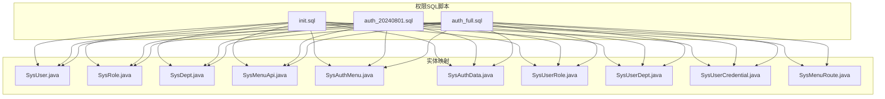
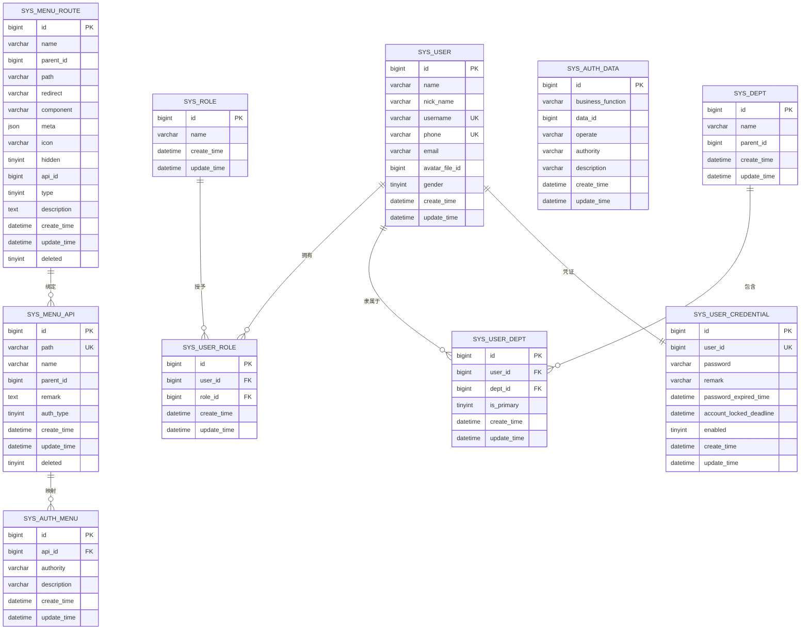
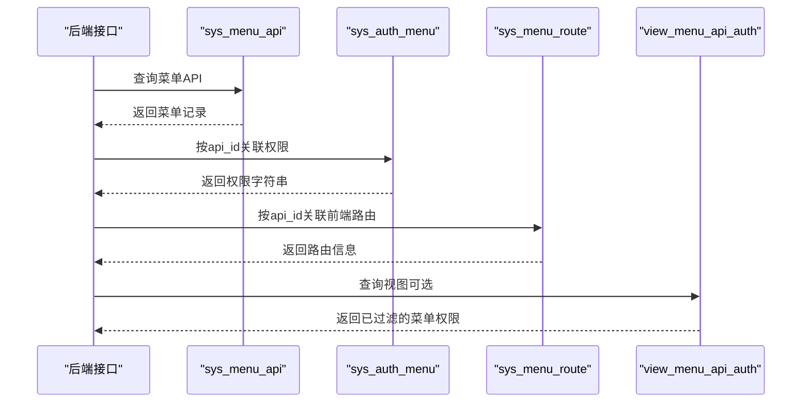

# 权限系统数据库设计

<cite>
**本文档引用的文件**
- [auth_full.sql](file://qy-auth/relation/sql/auth_full.sql)
- [auth_20240801.sql](file://qy-auth/relation/sql/auth_20240801.sql)
- [init.sql](file://sample/auth-boot-sample/relation/init.sql)
- [SysUser.java](file://qy-auth/auth-rbac/src/main/java/com/kewen/framework/auth/rabc/mp/entity/SysUser.java)
- [SysRole.java](file://qy-auth/auth-rbac/src/main/java/com/kewen/framework/auth/rabc/mp/entity/SysRole.java)
- [SysDept.java](file://qy-auth/auth-rbac/src/main/java/com/kewen/framework/auth/rabc/mp/entity/SysDept.java)
- [SysMenuApi.java](file://qy-auth/auth-rbac/src/main/java/com/kewen/framework/auth/rabc/mp/entity/SysMenuApi.java)
- [SysAuthMenu.java](file://qy-auth/auth-rbac/src/main/java/com/kewen/framework/auth/rabc/mp/entity/SysAuthMenu.java)
- [SysAuthData.java](file://qy-auth/auth-rbac/src/main/java/com/kewen/framework/auth/rabc/mp/entity/SysAuthData.java)
- [SysUserRole.java](file://qy-auth/auth-rbac/src/main/java/com/kewen/framework/auth/rabc/mp/entity/SysUserRole.java)
- [SysUserDept.java](file://qy-auth/auth-rbac/src/main/java/com/kewen/framework/auth/rabc/mp/entity/SysUserDept.java)
- [SysUserCredential.java](file://qy-auth/auth-rbac/src/main/java/com/kewen/framework/auth/rabc/mp/entity/SysUserCredential.java)
- [SysMenuRoute.java](file://qy-auth/auth-rbac/src/main/java/com/kewen/framework/auth/rabc/mp/entity/SysMenuRoute.java)
</cite>

## 目录
1. [简介](#简介)
2. [项目结构](#项目结构)
3. [核心组件](#核心组件)
4. [架构总览](#架构总览)
5. [详细组件分析](#详细组件分析)
6. [依赖关系分析](#依赖关系分析)
7. [性能考虑](#性能考虑)
8. [故障排查指南](#故障排查指南)
9. [结论](#结论)
10. [附录](#附录)

## 简介
本文件面向权限系统的数据库设计，围绕RBAC（基于角色的访问控制）模型，系统性梳理用户、角色、部门、菜单与权限等核心表的结构、字段、约束与索引，并给出表间关联关系、外键约束、数据字典、业务规则、典型查询模式与优化策略，以及初始化数据示例与迁移脚本指引。目标是帮助开发者与运维人员快速理解并正确使用该权限体系。

## 项目结构
权限系统数据库设计位于权限模块的SQL脚本与MyBatis-Plus实体映射中，核心文件分布如下：
- SQL脚本：提供完整的建表语句、索引与视图定义
- 实体类：映射各权限表的Java对象，用于ORM层的数据访问
- 初始化数据：提供示例数据，便于快速验证权限控制效果

**图表来源**
- [auth_full.sql:1-190](file://qy-auth/relation/sql/auth_full.sql#L1-L190)
- [auth_20240801.sql:1-190](file://qy-auth/relation/sql/auth_20240801.sql#L1-L190)
- [init.sql:1-398](file://sample/auth-boot-sample/relation/init.sql#L1-L398)

**章节来源**
- [auth_full.sql:1-190](file://qy-auth/relation/sql/auth_full.sql#L1-L190)
- [auth_20240801.sql:1-190](file://qy-auth/relation/sql/auth_20240801.sql#L1-L190)
- [init.sql:1-398](file://sample/auth-boot-sample/relation/init.sql#L1-L398)

## 核心组件
本节概述RBAC权限模型的核心表及其职责：
- 用户表：存储用户基本信息与账户状态
- 角色表：存储角色信息
- 部门表：存储组织架构树
- 菜单API表：存储后端接口的菜单定义与权限类型
- 菜单权限表：存储API菜单与权限字符串的映射
- 应用权限表：存储业务数据级别的权限（按业务功能、操作类型、数据ID）
- 用户-角色关联表：多对多关联用户与角色
- 用户-部门关联表：多对多关联用户与部门，支持主要归属部门标记
- 用户凭证表：存储用户认证凭据与账户状态
- 菜单路由表：存储前端路由与后端API的映射

**章节来源**
- [auth_full.sql:117-152](file://qy-auth/relation/sql/auth_full.sql#L117-L152)
- [auth_20240801.sql:117-152](file://qy-auth/relation/sql/auth_20240801.sql#L117-L152)
- [SysUser.java:22-96](file://qy-auth/auth-rbac/src/main/java/com/kewen/framework/auth/rabc/mp/entity/SysUser.java#L22-L96)
- [SysRole.java:22-60](file://qy-auth/auth-rbac/src/main/java/com/kewen/framework/auth/rabc/mp/entity/SysRole.java#L22-L60)
- [SysDept.java:22-66](file://qy-auth/auth-rbac/src/main/java/com/kewen/framework/auth/rabc/mp/entity/SysDept.java#L22-L66)
- [SysMenuApi.java:25-94](file://qy-auth/auth-rbac/src/main/java/com/kewen/framework/auth/rabc/mp/entity/SysMenuApi.java#L25-L94)
- [SysAuthMenu.java:22-72](file://qy-auth/auth-rbac/src/main/java/com/kewen/framework/auth/rabc/mp/entity/SysAuthMenu.java#L22-L72)
- [SysAuthData.java:22-84](file://qy-auth/auth-rbac/src/main/java/com/kewen/framework/auth/rabc/mp/entity/SysAuthData.java#L22-L84)
- [SysUserRole.java:22-66](file://qy-auth/auth-rbac/src/main/java/com/kewen/framework/auth/rabc/mp/entity/SysUserRole.java#L22-L66)
- [SysUserDept.java:22-72](file://qy-auth/auth-rbac/src/main/java/com/kewen/framework/auth/rabc/mp/entity/SysUserDept.java#L22-L72)
- [SysUserCredential.java:22-90](file://qy-auth/auth-rbac/src/main/java/com/kewen/framework/auth/rabc/mp/entity/SysUserCredential.java#L22-L90)
- [SysMenuRoute.java:25-129](file://qy-auth/auth-rbac/src/main/java/com/kewen/framework/auth/rabc/mp/entity/SysMenuRoute.java#L25-L129)

## 架构总览
下图展示了RBAC权限模型的ER关系与关键索引：

**图表来源**
- [auth_full.sql:117-152](file://qy-auth/relation/sql/auth_full.sql#L117-L152)
- [auth_full.sql:36-48](file://qy-auth/relation/sql/auth_full.sql#L36-L48)
- [auth_full.sql:20-34](file://qy-auth/relation/sql/auth_full.sql#L20-L34)
- [auth_full.sql:64-79](file://qy-auth/relation/sql/auth_full.sql#L64-L79)
- [auth_full.sql:82-102](file://qy-auth/relation/sql/auth_full.sql#L82-L102)
- [auth_full.sql:155-167](file://qy-auth/relation/sql/auth_full.sql#L155-L167)
- [auth_full.sql:170-181](file://qy-auth/relation/sql/auth_full.sql#L170-L181)

## 详细组件分析

### 用户表（sys_user）
- 字段与类型：主键自增、姓名、昵称、用户名（唯一）、手机号（唯一）、邮箱、头像文件ID、性别、创建/更新时间
- 约束：用户名与手机号唯一索引；主键自增
- 业务规则：用户名与手机号唯一，确保身份标识不重复；性别枚举值约定（1男2女3其他）
- 查询优化：按用户名/手机号检索时利用唯一索引；批量导入时注意去重

**章节来源**
- [auth_full.sql:117-134](file://qy-auth/relation/sql/auth_full.sql#L117-L134)
- [SysUser.java:22-96](file://qy-auth/auth-rbac/src/main/java/com/kewen/framework/auth/rabc/mp/entity/SysUser.java#L22-L96)

### 角色表（sys_role）
- 字段与类型：主键自增、角色名、创建/更新时间
- 约束：主键自增
- 业务规则：角色名用于标识权限集合；与用户通过中间表关联
- 查询优化：按角色名检索时可考虑建立索引（若业务需要）

**章节来源**
- [auth_full.sql:105-114](file://qy-auth/relation/sql/auth_full.sql#L105-L114)
- [SysRole.java:22-60](file://qy-auth/auth-rbac/src/main/java/com/kewen/framework/auth/rabc/mp/entity/SysRole.java#L22-L60)

### 部门表（sys_dept）
- 字段与类型：主键自增、部门名、父节点ID（0代表根节点）、创建/更新时间
- 约束：主键自增
- 业务规则：树形结构，父ID为0表示根部门；支持多层级组织架构
- 查询优化：树形查询时建议维护父子关系索引；层级遍历使用递归或闭包路径

**章节来源**
- [auth_full.sql:51-61](file://qy-auth/relation/sql/auth_full.sql#L51-L61)
- [SysDept.java:22-66](file://qy-auth/auth-rbac/src/main/java/com/kewen/framework/auth/rabc/mp/entity/SysDept.java#L22-L66)

### 菜单API表（sys_menu_api）
- 字段与类型：主键ID、请求路径（唯一）、名称、父ID、备注、权限类型（1-自身权限 2-父权限）、创建/更新/删除标记
- 约束：主键自增；路径唯一索引；删除标记字段
- 业务规则：权限类型决定权限继承策略；删除标记用于软删除
- 查询优化：按路径精确匹配；树形构建时按父ID与排序字段查询

**章节来源**
- [auth_full.sql:64-79](file://qy-auth/relation/sql/auth_full.sql#L64-L79)
- [SysMenuApi.java:25-94](file://qy-auth/auth-rbac/src/main/java/com/kewen/framework/auth/rabc/mp/entity/SysMenuApi.java#L25-L94)

### 菜单权限表（sys_auth_menu）
- 字段与类型：主键自增、API ID（关联菜单API）、权限字符串、权限描述、创建/更新时间
- 约束：主键自增
- 业务规则：将API菜单与权限字符串绑定；支持多权限字符串映射
- 查询优化：按API ID关联查询；权限字符串用于鉴权匹配

**章节来源**
- [auth_full.sql:36-48](file://qy-auth/relation/sql/auth_full.sql#L36-L48)
- [SysAuthMenu.java:22-72](file://qy-auth/auth-rbac/src/main/java/com/kewen/framework/auth/rabc/mp/entity/SysAuthMenu.java#L22-L72)

### 应用权限表（sys_auth_data）
- 字段与类型：主键自增、业务功能、数据ID、操作类型、权限字符串、权限描述、创建/更新时间
- 约束：主键自增；复合索引（业务功能, 操作类型, 数据ID, 权限字符串）
- 业务规则：用于细粒度数据权限控制；同一业务功能下不同操作类型区分权限
- 查询优化：按业务功能+操作类型+数据ID快速定位权限；避免全表扫描

**章节来源**
- [auth_full.sql:20-34](file://qy-auth/relation/sql/auth_full.sql#L20-L34)
- [SysAuthData.java:22-84](file://qy-auth/auth-rbac/src/main/java/com/kewen/framework/auth/rabc/mp/entity/SysAuthData.java#L22-L84)

### 用户-角色关联表（sys_user_role）
- 字段与类型：主键自增、用户ID、角色ID、创建/更新时间
- 约束：主键自增；联合索引（用户ID, 角色ID）
- 业务规则：多对多关联；支持用户拥有多个角色
- 查询优化：按用户ID查询角色列表；按角色ID反查用户

**章节来源**
- [auth_full.sql:170-181](file://qy-auth/relation/sql/auth_full.sql#L170-L181)
- [SysUserRole.java:22-66](file://qy-auth/auth-rbac/src/main/java/com/kewen/framework/auth/rabc/mp/entity/SysUserRole.java#L22-L66)

### 用户-部门关联表（sys_user_dept）
- 字段与类型：主键自增、用户ID、部门ID、是否主要归属部门（0/1）、创建/更新时间
- 约束：主键自增；联合索引（用户ID, 部门ID）
- 业务规则：支持用户在多个部门任职；主要归属部门用于默认组织选择
- 查询优化：按用户ID查询部门列表；按部门ID反查用户

**章节来源**
- [auth_full.sql:155-167](file://qy-auth/relation/sql/auth_full.sql#L155-L167)
- [SysUserDept.java:22-72](file://qy-auth/auth-rbac/src/main/java/com/kewen/framework/auth/rabc/mp/entity/SysUserDept.java#L22-L72)

### 用户凭证表（sys_user_credential）
- 字段与类型：主键自增、用户ID（唯一）、密码、备注、密码过期时间、账号锁定截止时间、启用状态、创建/更新时间
- 约束：主键自增；用户ID唯一索引
- 业务规则：密码采用加密存储；支持密码过期与账号锁定；启用状态控制登录
- 查询优化：按用户ID快速获取凭证；登录时按启用状态过滤

**章节来源**
- [auth_full.sql:137-152](file://qy-auth/relation/sql/auth_full.sql#L137-L152)
- [SysUserCredential.java:22-90](file://qy-auth/auth-rbac/src/main/java/com/kewen/framework/auth/rabc/mp/entity/SysUserCredential.java#L22-L90)

### 菜单路由表（sys_menu_route）
- 字段与类型：主键自增、名称、父ID、路径、重定向、组件、元信息JSON、图标、是否隐藏、API ID、类型（1菜单2按钮3外链）、描述、创建/更新/删除标记
- 约束：主键自增
- 业务规则：前端路由与后端API的映射；元信息JSON存储动态配置；删除标记软删除
- 查询优化：树形构建按父ID查询；按API ID关联菜单API

**章节来源**
- [auth_full.sql:82-102](file://qy-auth/relation/sql/auth_full.sql#L82-L102)
- [SysMenuRoute.java:25-129](file://qy-auth/auth-rbac/src/main/java/com/kewen/framework/auth/rabc/mp/entity/SysMenuRoute.java#L25-L129)

## 依赖关系分析
- 外键关系（逻辑层面）：
  - sys_user_role.user_id → sys_user.id
  - sys_user_role.role_id → sys_role.id
  - sys_user_dept.user_id → sys_user.id
  - sys_user_dept.dept_id → sys_dept.id
  - sys_auth_menu.api_id → sys_menu_api.id
  - sys_menu_route.api_id → sys_menu_api.id
  - sys_user_credential.user_id → sys_user.id
- 索引与约束：
  - sys_user.username、sys_user.phone 唯一索引
  - sys_menu_api.path 唯一索引
  - sys_user_dept、sys_user_role 联合索引
  - sys_auth_data 复合索引（业务功能, 操作类型, 数据ID, 权限字符串）
- 视图：
  - view_menu_api_auth：连接sys_menu_api与sys_auth_menu，筛选未删除且权限类型为“自身权限”的记录

**图表来源**
- [auth_full.sql:185-190](file://qy-auth/relation/sql/auth_full.sql#L185-L190)
- [auth_full.sql:64-79](file://qy-auth/relation/sql/auth_full.sql#L64-L79)
- [auth_full.sql:36-48](file://qy-auth/relation/sql/auth_full.sql#L36-L48)
- [auth_full.sql:82-102](file://qy-auth/relation/sql/auth_full.sql#L82-L102)

**章节来源**
- [auth_full.sql:185-190](file://qy-auth/relation/sql/auth_full.sql#L185-L190)

## 性能考虑
- 索引策略
  - 用户登录与查询：sys_user.username、sys_user.phone 唯一索引
  - 菜单API匹配：sys_menu_api.path 唯一索引
  - 关联查询：sys_user_dept(user_id, dept_id)、sys_user_role(user_id, role_id)
  - 数据权限：sys_auth_data(business_function, operate, data_id, authority)复合索引
- 查询模式
  - 登录校验：按用户名/手机号快速定位用户与凭证
  - 权限下发：按用户ID获取角色→角色ID获取权限→权限字符串匹配
  - 菜单渲染：按父ID构建树形结构；按API ID关联权限与路由
- 优化建议
  - 合理拆分查询：避免一次性拉取过多数据；使用分页与条件过滤
  - 缓存策略：菜单与权限可缓存；结合版本号或失效时间
  - 批量处理：导入/导出场景使用批量插入与事务提交

[本节为通用性能指导，无需特定文件引用]

## 故障排查指南
- 常见问题
  - 用户名/手机号重复：检查唯一索引冲突；导入前去重
  - 菜单路径重复：sys_menu_api.path 唯一索引冲突；修改路径或清理重复
  - 权限缺失：确认sys_auth_menu是否存在对应api_id的权限记录
  - 菜单不显示：检查deleted标记与auth_type类型；视图仅返回auth_type=1且未删除的记录
  - 登录失败：检查sys_user_credential.enabled与密码过期时间
- 定位步骤
  - 登录：sys_user → sys_user_credential
  - 权限：sys_user → sys_user_role → sys_role → sys_auth_menu
  - 菜单：sys_menu_api → sys_auth_menu；sys_menu_route → sys_menu_api

**章节来源**
- [auth_full.sql:117-152](file://qy-auth/relation/sql/auth_full.sql#L117-L152)
- [auth_full.sql:185-190](file://qy-auth/relation/sql/auth_full.sql#L185-L190)

## 结论
该权限系统以RBAC为核心，结合菜单权限与数据权限，形成“菜单-角色-用户-部门”的完整授权闭环。通过明确的表结构、索引与视图，能够支撑高并发下的权限校验与菜单渲染。建议在生产环境中配合缓存与批量处理，持续优化查询路径与数据一致性。

[本节为总结性内容，无需特定文件引用]

## 附录

### 数据字典与字段说明
- sys_user
  - id: 主键
  - username: 唯一标识
  - phone/email: 可选登录标识
  - gender: 性别枚举
- sys_role
  - id: 主键
  - name: 角色名
- sys_dept
  - id: 主键
  - parent_id: 父节点ID
- sys_menu_api
  - id: 主键
  - path: 唯一路径
  - auth_type: 权限类型（1自身 2父级）
  - deleted: 软删除标记
- sys_auth_menu
  - api_id: 关联API
  - authority: 权限字符串
- sys_auth_data
  - business_function: 业务功能
  - data_id: 业务数据ID
  - operate: 操作类型
- sys_user_role
  - user_id, role_id: 关联键
- sys_user_dept
  - user_id, dept_id: 关联键
  - is_primary: 主要归属部门
- sys_user_credential
  - user_id: 唯一
  - enabled: 启用状态
- sys_menu_route
  - api_id: 关联API
  - type: 菜单/按钮/外链
  - meta: JSON元信息

**章节来源**
- [auth_full.sql:20-181](file://qy-auth/relation/sql/auth_full.sql#L20-L181)
- [SysUser.java:22-96](file://qy-auth/auth-rbac/src/main/java/com/kewen/framework/auth/rabc/mp/entity/SysUser.java#L22-L96)
- [SysRole.java:22-60](file://qy-auth/auth-rbac/src/main/java/com/kewen/framework/auth/rabc/mp/entity/SysRole.java#L22-L60)
- [SysDept.java:22-66](file://qy-auth/auth-rbac/src/main/java/com/kewen/framework/auth/rabc/mp/entity/SysDept.java#L22-L66)
- [SysMenuApi.java:25-94](file://qy-auth/auth-rbac/src/main/java/com/kewen/framework/auth/rabc/mp/entity/SysMenuApi.java#L25-L94)
- [SysAuthMenu.java:22-72](file://qy-auth/auth-rbac/src/main/java/com/kewen/framework/auth/rabc/mp/entity/SysAuthMenu.java#L22-L72)
- [SysAuthData.java:22-84](file://qy-auth/auth-rbac/src/main/java/com/kewen/framework/auth/rabc/mp/entity/SysAuthData.java#L22-L84)
- [SysUserRole.java:22-66](file://qy-auth/auth-rbac/src/main/java/com/kewen/framework/auth/rabc/mp/entity/SysUserRole.java#L22-L66)
- [SysUserDept.java:22-72](file://qy-auth/auth-rbac/src/main/java/com/kewen/framework/auth/rabc/mp/entity/SysUserDept.java#L22-L72)
- [SysUserCredential.java:22-90](file://qy-auth/auth-rbac/src/main/java/com/kewen/framework/auth/rabc/mp/entity/SysUserCredential.java#L22-L90)
- [SysMenuRoute.java:25-129](file://qy-auth/auth-rbac/src/main/java/com/kewen/framework/auth/rabc/mp/entity/SysMenuRoute.java#L25-L129)

### 典型数据访问模式
- 登录校验
  - 输入用户名/手机号 → sys_user（唯一索引）→ sys_user_credential（启用状态）
- 权限下发
  - 用户ID → sys_user_role（角色列表）→ sys_auth_menu（权限字符串）
- 菜单渲染
  - sys_menu_api（树形）→ sys_auth_menu（权限）→ sys_menu_route（前端路由）

**章节来源**
- [auth_full.sql:117-152](file://qy-auth/relation/sql/auth_full.sql#L117-L152)
- [auth_full.sql:170-181](file://qy-auth/relation/sql/auth_full.sql#L170-L181)
- [auth_full.sql:64-79](file://qy-auth/relation/sql/auth_full.sql#L64-L79)
- [auth_full.sql:36-48](file://qy-auth/relation/sql/auth_full.sql#L36-L48)
- [auth_full.sql:82-102](file://qy-auth/relation/sql/auth_full.sql#L82-L102)

### 初始化数据示例
- 示例数据覆盖：角色、用户、部门、菜单API、菜单路由、用户-角色、用户-部门、应用权限等
- 用途：快速验证菜单权限、数据权限与登录流程

**章节来源**
- [init.sql:1-398](file://sample/auth-boot-sample/relation/init.sql#L1-L398)

### 数据迁移脚本
- 建库建表：参考完整SQL脚本，按需选择最新版本
- 数据迁移：建议使用唯一索引规避重复；批量导入时开启事务

**章节来源**
- [auth_full.sql:1-190](file://qy-auth/relation/sql/auth_full.sql#L1-L190)
- [auth_20240801.sql:1-190](file://qy-auth/relation/sql/auth_20240801.sql#L1-L190)