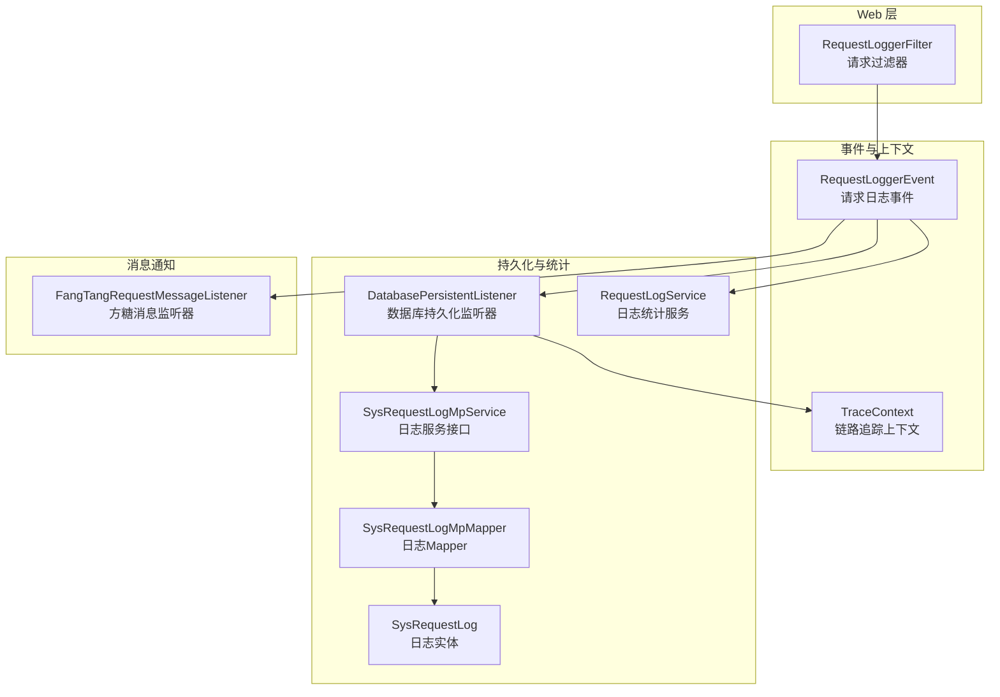
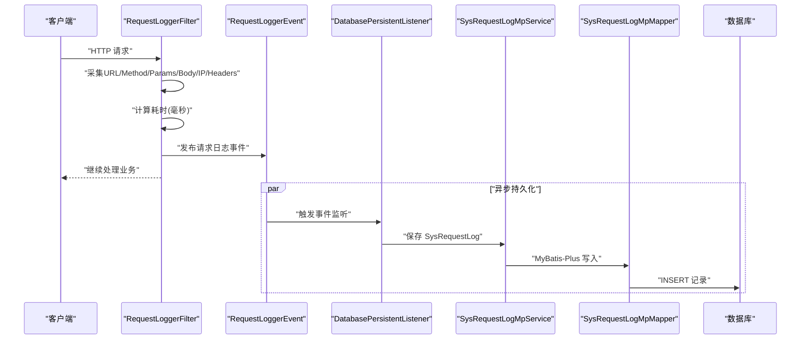
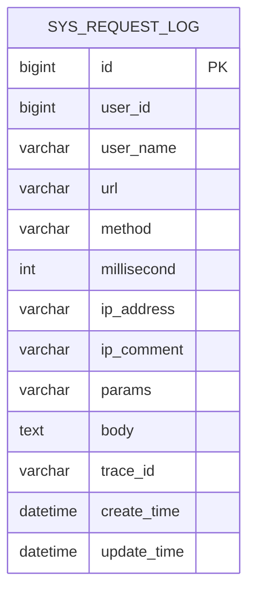
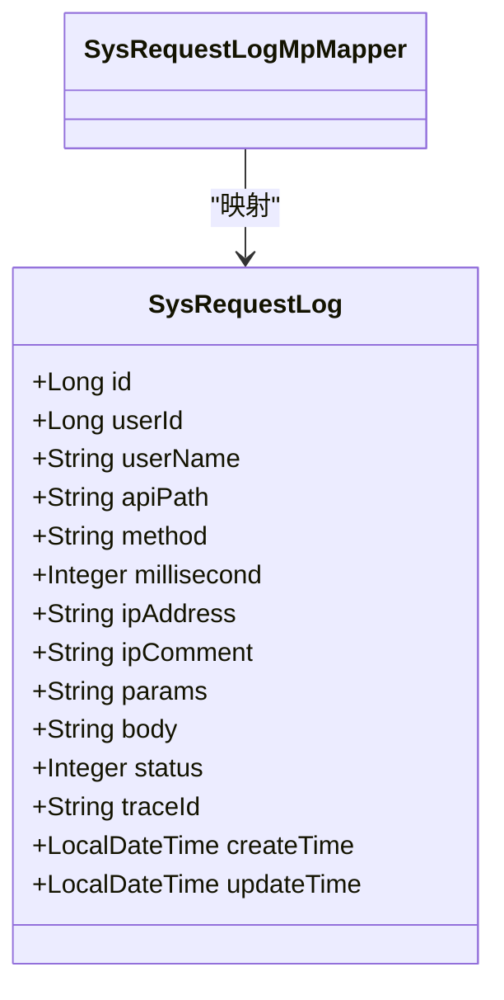
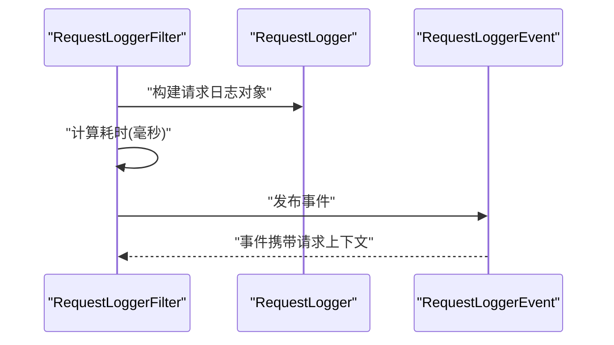
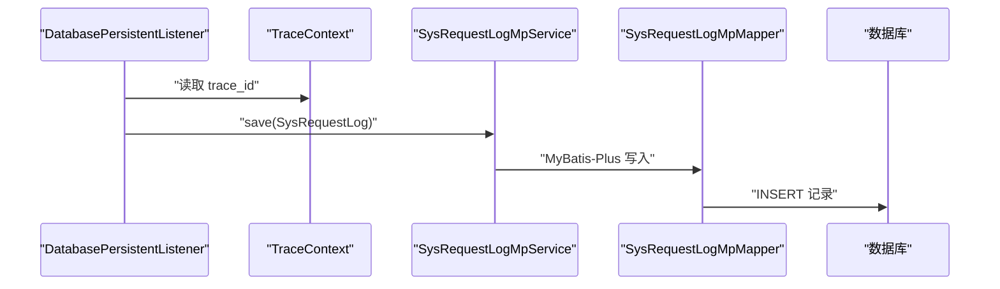
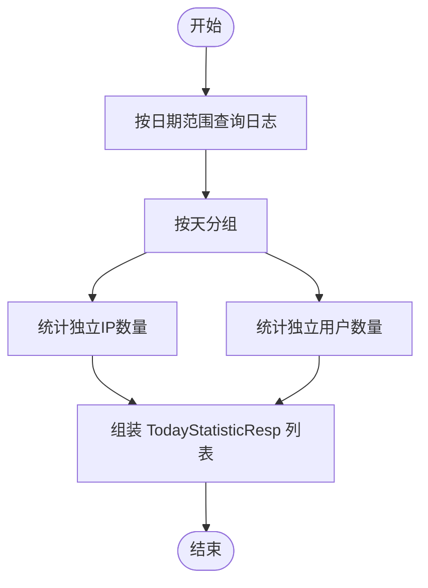
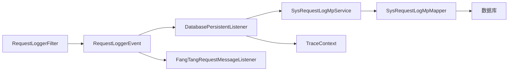

# 请求日志数据库设计

<cite>
**本文引用的文件**
- [sys_request_log.sql](file://docs/sql/sys_request_log.sql)
- [SysRequestLog.java](file://basic-support/src/main/java/com/kewen/framework/basic/support/mp/entity/SysRequestLog.java)
- [SysRequestLogMpMapper.java](file://basic-support/src/main/java/com/kewen/framework/basic/support/mp/mapper/SysRequestLogMpMapper.java)
- [SysRequestLogMpService.java](file://basic-support/src/main/java/com/kewen/framework/basic/support/mp/service/SysRequestLogMpService.java)
- [SysRequestLogMpServiceImpl.java](file://basic-support/src/main/java/com/kewen/framework/basic/support/mp/service/impl/SysRequestLogMpServiceImpl.java)
- [RequestLogService.java](file://basic-support/src/main/java/com/kewen/framework/basic/support/log/persistent/RequestLogService.java)
- [TodayStatisticResp.java](file://basic-support/src/main/java/com/kewen/framework/basic/support/log/persistent/TodayStatisticResp.java)
- [RequestLogger.java](file://basic/src/main/java/com/kewen/framework/basic/logger/request/RequestLogger.java)
- [RequestLoggerEvent.java](file://basic/src/main/java/com/kewen/framework/basic/logger/request/RequestLoggerEvent.java)
- [RequestLoggerFilter.java](file://basic/src/main/java/com/kewen/framework/basic/logger/RequestLoggerFilter.java)
- [DatabasePersistentListener.java](file://basic-support/src/main/java/com/kewen/framework/basic/support/log/DatabasePersistentListener.java)
- [FangTangRequestMessageListener.java](file://basic-support/src/main/java/com/kewen/framework/basic/support/log/FangTangRequestMessageListener.java)
- [TraceContext.java](file://basic/src/main/java/com/kewen/framework/basic/logger/trace/TraceContext.java)
- [TraceIdProcessor.java](file://basic/src/main/java/com/kewen/framework/basic/logger/trace/TraceIdProcessor.java)
- [HeaderTraceIdProcessor.java](file://basic/src/main/java/com/kewen/framework/basic/logger/trace/HeaderTraceIdProcessor.java)
- [LoggerConstant.java](file://basic/src/main/java/com/kewen/framework/basic/logger/LoggerConstant.java)
- [RequestIpUtil.java](file://basic/src/main/java/com/kewen/framework/basic/utils/RequestIpUtil.java)
</cite>

## 目录
1. [简介](#简介)
2. [项目结构](#项目结构)
3. [核心组件](#核心组件)
4. [架构总览](#架构总览)
5. [详细组件分析](#详细组件分析)
6. [依赖关系分析](#依赖关系分析)
7. [性能与容量规划](#性能与容量规划)
8. [故障排查指南](#故障排查指南)
9. [结论](#结论)
10. [附录](#附录)

## 简介
本文件面向请求日志系统的数据库设计，围绕请求日志表（sys_request_log）的结构、字段含义、采集与存储流程、查询与统计机制、链路追踪集成、以及性能优化与容量规划进行系统性说明。目标是帮助开发者与运维人员快速理解并高效使用该日志体系。

## 项目结构
日志系统由“过滤器采集 + 事件发布 + 异步持久化监听 + 数据访问层”组成，并通过 MyBatis-Plus 提供实体与 Mapper 支持；同时提供基于应用事件的统计服务与消息通知能力。

图表来源
- [RequestLoggerFilter.java:30-74](file://basic/src/main/java/com/kewen/framework/basic/logger/RequestLoggerFilter.java#L30-L74)
- [RequestLoggerEvent.java:11-22](file://basic/src/main/java/com/kewen/framework/basic/logger/request/RequestLoggerEvent.java#L11-L22)
- [DatabasePersistentListener.java:21-51](file://basic-support/src/main/java/com/kewen/framework/basic/support/log/DatabasePersistentListener.java#L21-L51)
- [RequestLogService.java:22-50](file://basic-support/src/main/java/com/kewen/framework/basic/support/log/persistent/RequestLogService.java#L22-L50)
- [SysRequestLogMpService.java](file://basic-support/src/main/java/com/kewen/framework/basic/support/mp/service/SysRequestLogMpService.java)
- [SysRequestLogMpMapper.java:15-18](file://basic-support/src/main/java/com/kewen/framework/basic/support/mp/mapper/SysRequestLogMpMapper.java#L15-L18)
- [SysRequestLog.java:22-116](file://basic-support/src/main/java/com/kewen/framework/basic/support/mp/entity/SysRequestLog.java#L22-L116)
- [FangTangRequestMessageListener.java:27-67](file://basic-support/src/main/java/com/kewen/framework/basic/support/log/FangTangRequestMessageListener.java#L27-L67)

章节来源
- [RequestLoggerFilter.java:30-74](file://basic/src/main/java/com/kewen/framework/basic/logger/RequestLoggerFilter.java#L30-L74)
- [DatabasePersistentListener.java:21-51](file://basic-support/src/main/java/com/kewen/framework/basic/support/log/DatabasePersistentListener.java#L21-L51)
- [SysRequestLogMpMapper.java:15-18](file://basic-support/src/main/java/com/kewen/framework/basic/support/mp/mapper/SysRequestLogMpMapper.java#L15-L18)
- [SysRequestLog.java:22-116](file://basic-support/src/main/java/com/kewen/framework/basic/support/mp/entity/SysRequestLog.java#L22-L116)

## 核心组件
- 请求日志表（sys_request_log）
  - 字段覆盖：用户信息（user_id、user_name）、请求信息（url、method、params、body）、性能监控（millisecond、ip_address）、链路追踪（trace_id）、时间戳（create_time、update_time）。
  - 表结构定义参见：[sys_request_log.sql:3-18](file://docs/sql/sys_request_log.sql#L3-L18)。
- 日志实体与数据访问
  - 实体类 SysRequestLog 映射表字段，提供主键与常用字段属性，参见：[SysRequestLog.java:22-116](file://basic-support/src/main/java/com/kewen/framework/basic/support/mp/entity/SysRequestLog.java#L22-L116)。
  - Mapper 接口 SysRequestLogMpMapper 继承 MyBatis-Plus 基础能力，参见：[SysRequestLogMpMapper.java:15-18](file://basic-support/src/main/java/com/kewen/framework/basic/support/mp/mapper/SysRequestLogMpMapper.java#L15-L18)。
  - 服务接口与实现位于 basic-support 模块，参见：[SysRequestLogMpService.java](file://basic-support/src/main/java/com/kewen/framework/basic/support/mp/service/SysRequestLogMpService.java)、[SysRequestLogMpServiceImpl.java](file://basic-support/src/main/java/com/kewen/framework/basic/support/mp/service/impl/SysRequestLogMpServiceImpl.java)。
- 日志采集与事件
  - 过滤器 RequestLoggerFilter 在请求前后采集参数、耗时、IP、请求体等，构造 RequestLogger 并发布 RequestLoggerEvent，参见：[RequestLoggerFilter.java:37-74](file://basic/src/main/java/com/kewen/framework/basic/logger/RequestLoggerFilter.java#L37-L74)、[RequestLogger.java:13-25](file://basic/src/main/java/com/kewen/framework/basic/logger/request/RequestLogger.java#L13-L25)。
  - 事件类 RequestLoggerEvent 包装 RequestLogger，参见：[RequestLoggerEvent.java:11-22](file://basic/src/main/java/com/kewen/framework/basic/logger/request/RequestLoggerEvent.java#L11-L22)。
- 异步持久化与统计
  - 数据库持久化监听器 DatabasePersistentListener 异步接收事件，转换为 SysRequestLog 并调用服务保存，参见：[DatabasePersistentListener.java:21-51](file://basic-support/src/main/java/com/kewen/framework/basic/support/log/DatabasePersistentListener.java#L21-L51)。
  - 日志统计服务 RequestLogService 提供按天维度的访问统计（去重 IP、用户数），参见：[RequestLogService.java:22-50](file://basic-support/src/main/java/com/kewen/framework/basic/support/log/persistent/RequestLogService.java#L22-L50)、[TodayStatisticResp.java:13-20](file://basic-support/src/main/java/com/kewen/framework/basic/support/log/persistent/TodayStatisticResp.java#L13-L20)。
- 链路追踪与消息通知
  - TraceContext 与 TraceIdProcessor 负责 trace_id 的获取与设置，参见：[TraceContext.java:11-22](file://basic/src/main/java/com/kewen/framework/basic/logger/trace/TraceContext.java#L11-L22)、[TraceIdProcessor.java:11-18](file://basic/src/main/java/com/kewen/framework/basic/logger/trace/TraceIdProcessor.java#L11-L18)、[HeaderTraceIdProcessor.java:15-26](file://basic/src/main/java/com/kewen/framework/basic/logger/trace/HeaderTraceIdProcessor.java#L15-L26)。
  - FangTangRequestMessageListener 异步发送方糖消息通知，参见：[FangTangRequestMessageListener.java:27-67](file://basic-support/src/main/java/com/kewen/framework/basic/support/log/FangTangRequestMessageListener.java#L27-L67)。

章节来源
- [sys_request_log.sql:3-18](file://docs/sql/sys_request_log.sql#L3-L18)
- [SysRequestLog.java:22-116](file://basic-support/src/main/java/com/kewen/framework/basic/support/mp/entity/SysRequestLog.java#L22-L116)
- [SysRequestLogMpMapper.java:15-18](file://basic-support/src/main/java/com/kewen/framework/basic/support/mp/mapper/SysRequestLogMpMapper.java#L15-L18)
- [SysRequestLogMpService.java](file://basic-support/src/main/java/com/kewen/framework/basic/support/mp/service/SysRequestLogMpService.java)
- [SysRequestLogMpServiceImpl.java](file://basic-support/src/main/java/com/kewen/framework/basic/support/mp/service/impl/SysRequestLogMpServiceImpl.java)
- [RequestLoggerFilter.java:37-74](file://basic/src/main/java/com/kewen/framework/basic/logger/RequestLoggerFilter.java#L37-L74)
- [RequestLoggerEvent.java:11-22](file://basic/src/main/java/com/kewen/framework/basic/logger/request/RequestLoggerEvent.java#L11-L22)
- [DatabasePersistentListener.java:21-51](file://basic-support/src/main/java/com/kewen/framework/basic/support/log/DatabasePersistentListener.java#L21-L51)
- [RequestLogService.java:22-50](file://basic-support/src/main/java/com/kewen/framework/basic/support/log/persistent/RequestLogService.java#L22-L50)
- [TodayStatisticResp.java:13-20](file://basic-support/src/main/java/com/kewen/framework/basic/support/log/persistent/TodayStatisticResp.java#L13-L20)
- [TraceContext.java:11-22](file://basic/src/main/java/com/kewen/framework/basic/logger/trace/TraceContext.java#L11-L22)
- [TraceIdProcessor.java:11-18](file://basic/src/main/java/com/kewen/framework/basic/logger/trace/TraceIdProcessor.java#L11-L18)
- [HeaderTraceIdProcessor.java:15-26](file://basic/src/main/java/com/kewen/framework/basic/logger/trace/HeaderTraceIdProcessor.java#L15-L26)
- [FangTangRequestMessageListener.java:27-67](file://basic-support/src/main/java/com/kewen/framework/basic/support/log/FangTangRequestMessageListener.java#L27-L67)

## 架构总览
请求日志从 Web 层进入，经过滤器采集关键信息，发布应用事件，异步持久化至数据库，并可选地推送消息通知。统计服务基于事件或直接查询数据库进行聚合分析。

图表来源
- [RequestLoggerFilter.java:37-74](file://basic/src/main/java/com/kewen/framework/basic/logger/RequestLoggerFilter.java#L37-L74)
- [RequestLoggerEvent.java:11-22](file://basic/src/main/java/com/kewen/framework/basic/logger/request/RequestLoggerEvent.java#L11-L22)
- [DatabasePersistentListener.java:30-51](file://basic-support/src/main/java/com/kewen/framework/basic/support/log/DatabasePersistentListener.java#L30-L51)
- [SysRequestLogMpMapper.java:15-18](file://basic-support/src/main/java/com/kewen/framework/basic/support/mp/mapper/SysRequestLogMpMapper.java#L15-L18)

## 详细组件分析

### 数据模型：sys_request_log
- 字段设计要点
  - 主键：id（自增）
  - 用户信息：user_id、user_name（便于用户行为分析）
  - 请求信息：url（API 路径）、method（HTTP 方法）、params（查询参数序列化）、body（请求体序列化）
  - 性能监控：millisecond（请求耗时，毫秒）、ip_address（来源 IP）
  - 链路追踪：trace_id（跨服务追踪标识）
  - 时间戳：create_time（创建时间）、update_time（更新时间）
- 表结构参考
  - 定义位置：[sys_request_log.sql:3-18](file://docs/sql/sys_request_log.sql#L3-L18)

图表来源
- [sys_request_log.sql:3-18](file://docs/sql/sys_request_log.sql#L3-L18)

章节来源
- [sys_request_log.sql:3-18](file://docs/sql/sys_request_log.sql#L3-L18)

### 实体与映射：SysRequestLog、SysRequestLogMpMapper
- 实体类 SysRequestLog
  - 映射字段：id、userId、userName、api_path、method、millisecond、ipAddress、ipComment、params、body、status、traceId、createTime、updateTime。
  - 参考：[SysRequestLog.java:22-116](file://basic-support/src/main/java/com/kewen/framework/basic/support/mp/entity/SysRequestLog.java#L22-L116)
- Mapper 接口 SysRequestLogMpMapper
  - 继承 MyBatis-Plus 基础能力，提供通用 CRUD。
  - 参考：[SysRequestLogMpMapper.java:15-18](file://basic-support/src/main/java/com/kewen/framework/basic/support/mp/mapper/SysRequestLogMpMapper.java#L15-L18)

图表来源
- [SysRequestLog.java:22-116](file://basic-support/src/main/java/com/kewen/framework/basic/support/mp/entity/SysRequestLog.java#L22-L116)
- [SysRequestLogMpMapper.java:15-18](file://basic-support/src/main/java/com/kewen/framework/basic/support/mp/mapper/SysRequestLogMpMapper.java#L15-L18)

章节来源
- [SysRequestLog.java:22-116](file://basic-support/src/main/java/com/kewen/framework/basic/support/mp/entity/SysRequestLog.java#L22-L116)
- [SysRequestLogMpMapper.java:15-18](file://basic-support/src/main/java/com/kewen/framework/basic/support/mp/mapper/SysRequestLogMpMapper.java#L15-L18)

### 日志采集与事件发布：RequestLoggerFilter、RequestLogger、RequestLoggerEvent
- RequestLoggerFilter
  - 采集 headers、params、body、IP、URL、Method、耗时（毫秒）。
  - 发布 RequestLoggerEvent，供监听器异步处理。
  - 参考：[RequestLoggerFilter.java:37-74](file://basic/src/main/java/com/kewen/framework/basic/logger/RequestLoggerFilter.java#L37-L74)
- RequestLogger
  - 封装请求上下文数据（url、method、params、body、ip、headers、execMillisecond）。
  - 参考：[RequestLogger.java:13-25](file://basic/src/main/java/com/kewen/framework/basic/logger/request/RequestLogger.java#L13-L25)
- RequestLoggerEvent
  - 包装 RequestLogger 的应用事件。
  - 参考：[RequestLoggerEvent.java:11-22](file://basic/src/main/java/com/kewen/framework/basic/logger/request/RequestLoggerEvent.java#L11-L22)

图表来源
- [RequestLoggerFilter.java:37-74](file://basic/src/main/java/com/kewen/framework/basic/logger/RequestLoggerFilter.java#L37-L74)
- [RequestLogger.java:13-25](file://basic/src/main/java/com/kewen/framework/basic/logger/request/RequestLogger.java#L13-L25)
- [RequestLoggerEvent.java:11-22](file://basic/src/main/java/com/kewen/framework/basic/logger/request/RequestLoggerEvent.java#L11-L22)

章节来源
- [RequestLoggerFilter.java:37-74](file://basic/src/main/java/com/kewen/framework/basic/logger/RequestLoggerFilter.java#L37-L74)
- [RequestLogger.java:13-25](file://basic/src/main/java/com/kewen/framework/basic/logger/request/RequestLogger.java#L13-L25)
- [RequestLoggerEvent.java:11-22](file://basic/src/main/java/com/kewen/framework/basic/logger/request/RequestLoggerEvent.java#L11-L22)

### 异步持久化与链路追踪：DatabasePersistentListener、TraceContext、HeaderTraceIdProcessor
- DatabasePersistentListener
  - 异步接收事件，将 RequestLogger 转换为 SysRequestLog，设置 trace_id（来自 TraceContext），调用服务保存。
  - 参考：[DatabasePersistentListener.java:21-51](file://basic-support/src/main/java/com/kewen/framework/basic/support/log/DatabasePersistentListener.java#L21-L51)
- TraceContext 与 TraceIdProcessor
  - TraceContext 提供 traceId 的存取。
  - HeaderTraceIdProcessor 从请求头读取 trace_id，不存在则生成 UUID。
  - 参考：[TraceContext.java:11-22](file://basic/src/main/java/com/kewen/framework/basic/logger/trace/TraceContext.java#L11-L22)、[TraceIdProcessor.java:11-18](file://basic/src/main/java/com/kewen/framework/basic/logger/trace/TraceIdProcessor.java#L11-L18)、[HeaderTraceIdProcessor.java:15-26](file://basic/src/main/java/com/kewen/framework/basic/logger/trace/HeaderTraceIdProcessor.java#L15-L26)

图表来源
- [DatabasePersistentListener.java:39-51](file://basic-support/src/main/java/com/kewen/framework/basic/support/log/DatabasePersistentListener.java#L39-L51)
- [TraceContext.java:11-22](file://basic/src/main/java/com/kewen/framework/basic/logger/trace/TraceContext.java#L11-L22)
- [SysRequestLogMpMapper.java:15-18](file://basic-support/src/main/java/com/kewen/framework/basic/support/mp/mapper/SysRequestLogMpMapper.java#L15-L18)

章节来源
- [DatabasePersistentListener.java:21-51](file://basic-support/src/main/java/com/kewen/framework/basic/support/log/DatabasePersistentListener.java#L21-L51)
- [TraceContext.java:11-22](file://basic/src/main/java/com/kewen/framework/basic/logger/trace/TraceContext.java#L11-L22)
- [HeaderTraceIdProcessor.java:15-26](file://basic/src/main/java/com/kewen/framework/basic/logger/trace/HeaderTraceIdProcessor.java#L15-L26)

### 查询与统计：RequestLogService、TodayStatisticResp
- RequestLogService.visitStatistic
  - 按日期范围查询日志，按天分组，统计每日独立 IP 数与独立用户数。
  - 返回 TodayStatisticResp 列表，包含 day、ipCount、userCount。
  - 参考：[RequestLogService.java:22-50](file://basic-support/src/main/java/com/kewen/framework/basic/support/log/persistent/RequestLogService.java#L22-L50)、[TodayStatisticResp.java:13-20](file://basic-support/src/main/java/com/kewen/framework/basic/support/log/persistent/TodayStatisticResp.java#L13-L20)

图表来源
- [RequestLogService.java:28-50](file://basic-support/src/main/java/com/kewen/framework/basic/support/log/persistent/RequestLogService.java#L28-L50)

章节来源
- [RequestLogService.java:22-50](file://basic-support/src/main/java/com/kewen/framework/basic/support/log/persistent/RequestLogService.java#L22-L50)
- [TodayStatisticResp.java:13-20](file://basic-support/src/main/java/com/kewen/framework/basic/support/log/persistent/TodayStatisticResp.java#L13-L20)

### 消息通知：FangTangRequestMessageListener
- 异步监听请求事件，对同一 IP 使用缓存去重，周期内仅发送一次通知。
- 将请求详情格式化为 Markdown 文本发送至方糖渠道。
- 参考：[FangTangRequestMessageListener.java:27-85](file://basic-support/src/main/java/com/kewen/framework/basic/support/log/FangTangRequestMessageListener.java#L27-L85)

章节来源
- [FangTangRequestMessageListener.java:27-85](file://basic-support/src/main/java/com/kewen/framework/basic/support/log/FangTangRequestMessageListener.java#L27-L85)

## 依赖关系分析
- 组件耦合
  - RequestLoggerFilter 与 RequestLoggerEvent 之间为弱耦合（事件驱动）。
  - DatabasePersistentListener 与 SysRequestLogMpService 通过接口解耦，便于替换实现。
  - TraceContext 与 TraceIdProcessor 通过接口抽象，支持不同策略注入。
- 外部依赖
  - MyBatis-Plus 提供通用 Mapper 与实体映射能力。
  - Spring Event 机制实现异步解耦。
  - 方糖消息客户端用于外部通知。

图表来源
- [RequestLoggerFilter.java:37-74](file://basic/src/main/java/com/kewen/framework/basic/logger/RequestLoggerFilter.java#L37-L74)
- [RequestLoggerEvent.java:11-22](file://basic/src/main/java/com/kewen/framework/basic/logger/request/RequestLoggerEvent.java#L11-L22)
- [DatabasePersistentListener.java:21-51](file://basic-support/src/main/java/com/kewen/framework/basic/support/log/DatabasePersistentListener.java#L21-L51)
- [SysRequestLogMpMapper.java:15-18](file://basic-support/src/main/java/com/kewen/framework/basic/support/mp/mapper/SysRequestLogMpMapper.java#L15-L18)
- [FangTangRequestMessageListener.java:27-67](file://basic-support/src/main/java/com/kewen/framework/basic/support/log/FangTangRequestMessageListener.java#L27-L67)

章节来源
- [RequestLoggerFilter.java:37-74](file://basic/src/main/java/com/kewen/framework/basic/logger/RequestLoggerFilter.java#L37-L74)
- [DatabasePersistentListener.java:21-51](file://basic-support/src/main/java/com/kewen/framework/basic/support/log/DatabasePersistentListener.java#L21-L51)
- [SysRequestLogMpMapper.java:15-18](file://basic-support/src/main/java/com/kewen/framework/basic/support/mp/mapper/SysRequestLogMpMapper.java#L15-L18)
- [FangTangRequestMessageListener.java:27-67](file://basic-support/src/main/java/com/kewen/framework/basic/support/log/FangTangRequestMessageListener.java#L27-L67)

## 性能与容量规划
- 采集与存储
  - 采用异步监听器持久化，避免阻塞请求线程，降低对业务延迟的影响。
  - 建议在高并发场景下启用连接池与批量写入策略（如需扩展）。
- 查询与统计
  - 访问统计按天分组，适合离线报表场景；实时查询建议增加索引（见下一节）。
- 索引与分区建议
  - 建议在 create_time、trace_id、ip_address、user_id 等高频查询字段上建立合适索引，提升统计与检索效率。
  - 对超大表可考虑按月/季度分区，便于归档与清理。
- 存储优化
  - 合理设置字段长度（如 params、body 已采用文本类型），避免过度占用空间。
  - 对历史数据定期归档至冷存储，保留热数据在热备库。
- 容量规划
  - 评估日均请求量与单条日志平均大小，结合磁盘与备份策略制定扩容计划。
  - 结合统计服务的查询模式，评估 CPU 与内存资源需求。

[本节为通用指导，不直接分析具体文件]

## 故障排查指南
- 日志未入库
  - 检查 DatabasePersistentListener 是否注册并启用异步。
  - 确认 SysRequestLogMpService 的实现可用且数据库连接正常。
  - 参考：[DatabasePersistentListener.java:30-51](file://basic-support/src/main/java/com/kewen/framework/basic/support/log/DatabasePersistentListener.java#L30-L51)
- trace_id 为空
  - 检查 HeaderTraceIdProcessor 的策略是否正确注入与生效。
  - 参考：[HeaderTraceIdProcessor.java:15-26](file://basic/src/main/java/com/kewen/framework/basic/logger/trace/HeaderTraceIdProcessor.java#L15-L26)
- IP 解析异常
  - RequestIpUtil 会按代理头顺序解析，确认网关/负载均衡配置是否正确传递真实 IP。
  - 参考：[RequestIpUtil.java:13-36](file://basic/src/main/java/com/kewen/framework/basic/utils/RequestIpUtil.java#L13-L36)
- 统计结果异常
  - 检查 RequestLogService 的日期范围与分组逻辑，确保时区与边界时间处理正确。
  - 参考：[RequestLogService.java:28-50](file://basic-support/src/main/java/com/kewen/framework/basic/support/log/persistent/RequestLogService.java#L28-L50)

章节来源
- [DatabasePersistentListener.java:30-51](file://basic-support/src/main/java/com/kewen/framework/basic/support/log/DatabasePersistentListener.java#L30-L51)
- [HeaderTraceIdProcessor.java:15-26](file://basic/src/main/java/com/kewen/framework/basic/logger/trace/HeaderTraceIdProcessor.java#L15-L26)
- [RequestIpUtil.java:13-36](file://basic/src/main/java/com/kewen/framework/basic/utils/RequestIpUtil.java#L13-L36)
- [RequestLogService.java:28-50](file://basic-support/src/main/java/com/kewen/framework/basic/support/log/persistent/RequestLogService.java#L28-L50)

## 结论
该请求日志系统通过过滤器采集、事件驱动与异步持久化，实现了低侵入、高性能的日志记录能力；配合链路追踪与消息通知，满足可观测性与告警需求。建议在生产环境中完善索引、分区与归档策略，持续优化查询与存储成本。

[本节为总结性内容，不直接分析具体文件]

## 附录

### 字段对照与用途说明
- user_id、user_name：用户身份识别，支持用户行为分析与权限审计。
- url、method：API 路径与方法，支持接口访问统计与路由分析。
- params、body：请求参数与请求体，支持问题复现与接口变更追踪。
- millisecond：请求耗时，支持性能监控与慢请求定位。
- ip_address、ip_comment：来源 IP 与描述，支持地域分析与安全审计。
- trace_id：链路追踪标识，支持跨服务调用链路回溯。
- create_time、update_time：时间戳，支持按时间维度的统计与报表。

章节来源
- [sys_request_log.sql:3-18](file://docs/sql/sys_request_log.sql#L3-L18)
- [SysRequestLog.java:33-108](file://basic-support/src/main/java/com/kewen/framework/basic/support/mp/entity/SysRequestLog.java#L33-L108)