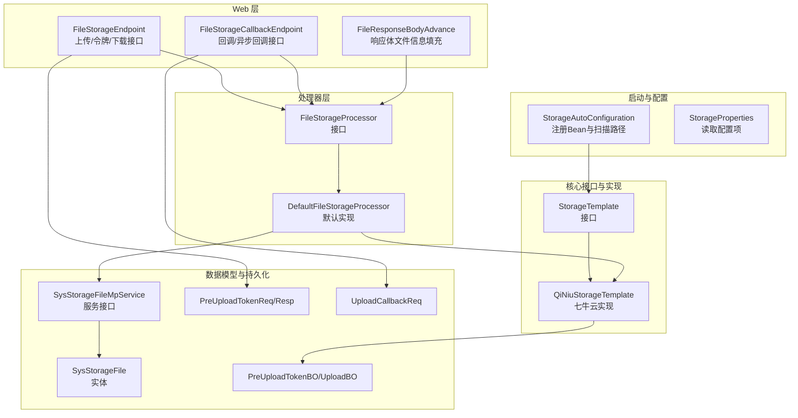
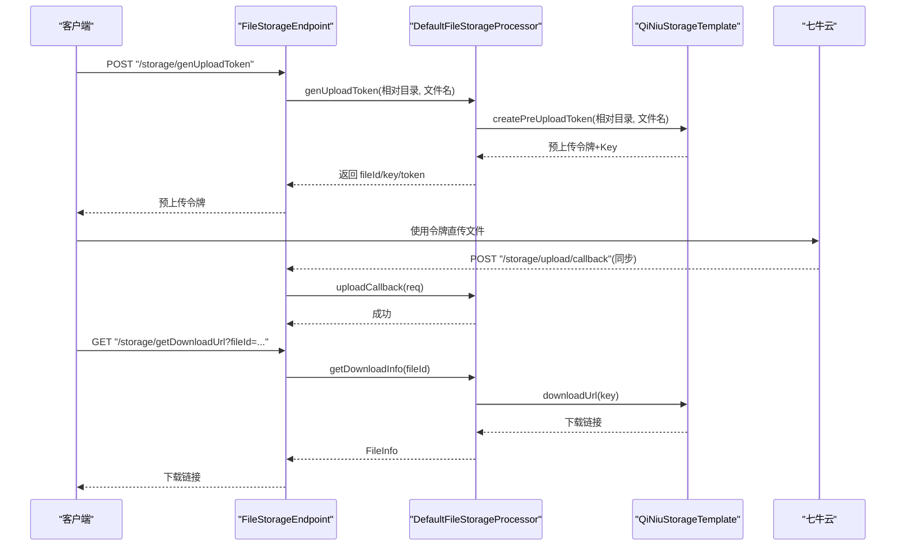
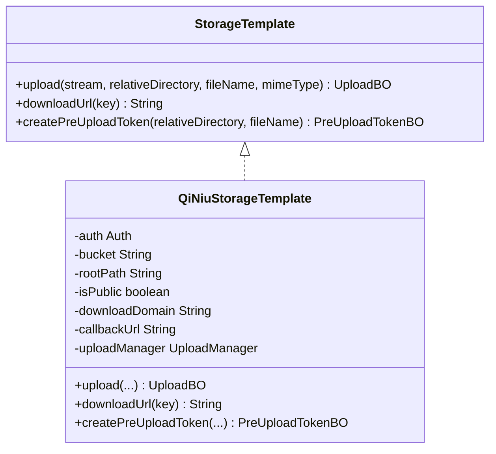
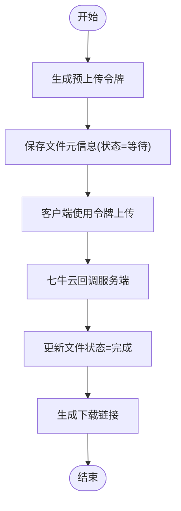
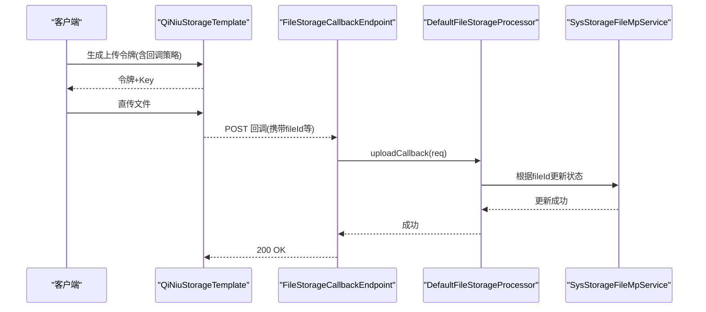
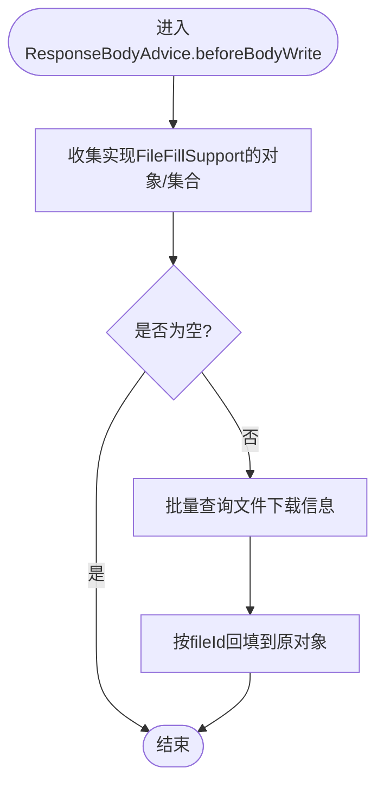
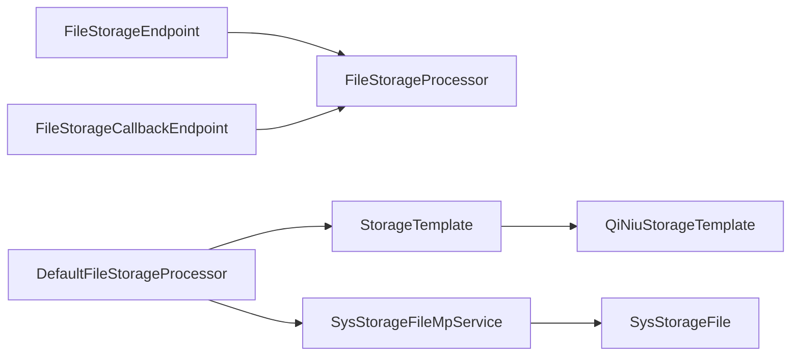

# 文件存储系统

<cite>
**本文引用的文件**
- [StorageAutoConfiguration.java](file://boot/storage-spring-boot-starter/src/main/java/com/kewen/framework/storage/boot/StorageAutoConfiguration.java)
- [StorageProperties.java](file://boot/storage-spring-boot-starter/src/main/java/com/kewen/framework/storage/boot/StorageProperties.java)
- [StorageTemplate.java](file://boot/storage-spring-boot-starter/src/main/java/com/kewen/framework/storage/core/StorageTemplate.java)
- [QiNiuStorageTemplate.java](file://boot/storage-spring-boot-starter/src/main/java/com/kewen/framework/storage/core/qiniu/QiNiuStorageTemplate.java)
- [FileStorageEndpoint.java](file://boot/storage-spring-boot-starter/src/main/java/com/kewen/framework/storage/web/FileStorageEndpoint.java)
- [FileStorageCallbackEndpoint.java](file://boot/storage-spring-boot-starter/src/main/java/com/kewen/framework/storage/web/FileStorageCallbackEndpoint.java)
- [FileStorageProcessor.java](file://boot/storage-spring-boot-starter/src/main/java/com/kewen/framework/storage/web/FileStorageProcessor.java)
- [DefaultFileStorageProcessor.java](file://boot/storage-spring-boot-starter/src/main/java/com/kewen/framework/storage/web/impl/DefaultFileStorageProcessor.java)
- [PreUploadTokenBO.java](file://boot/storage-spring-boot-starter/src/main/java/com/kewen/framework/storage/core/model/PreUploadTokenBO.java)
- [UploadBO.java](file://boot/storage-spring-boot-starter/src/main/java/com/kewen/framework/storage/core/model/UploadBO.java)
- [PreUploadTokenReq.java](file://boot/storage-spring-boot-starter/src/main/java/com/kewen/framework/storage/web/model/PreUploadTokenReq.java)
- [PreUploadTokenResp.java](file://boot/storage-spring-boot-starter/src/main/java/com/kewen/framework/storage/web/model/PreUploadTokenResp.java)
- [UploadCallbackReq.java](file://boot/storage-spring-boot-starter/src/main/java/com/kewen/framework/storage/web/model/UploadCallbackReq.java)
- [SysStorageFile.java](file://boot/storage-spring-boot-starter/src/main/java/com/kewen/framework/storage/web/mp/entity/SysStorageFile.java)
- [SysStorageFileMpService.java](file://boot/storage-spring-boot-starter/src/main/java/com/kewen/framework/storage/web/mp/service/SysStorageFileMpService.java)
- [FileResponseBodyAdvance.java](file://boot/storage-spring-boot-starter/src/main/java/com/kewen/framework/storage/web/FileResponseBodyAdvance.java)
- [application.yml](file://sample/storage-boot-sample/src/main/resources/application.yml)
</cite>

## 目录
1. [简介](#简介)
2. [项目结构](#项目结构)
3. [核心组件](#核心组件)
4. [架构总览](#架构总览)
5. [详细组件分析](#详细组件分析)
6. [依赖分析](#依赖分析)
7. [性能考虑](#性能考虑)
8. [故障排查指南](#故障排查指南)
9. [结论](#结论)
10. [附录：API 文档与集成指南](#附录api-文档与集成指南)

## 简介
本文件存储系统基于 Spring Boot 自动装配，提供统一的文件存储抽象与七牛云（Kodo）集成实现。系统通过 StorageTemplate 抽象出上传、下载链接生成与客户端预上传令牌生成能力；结合 FileStorageEndpoint 与 FileStorageCallbackEndpoint 提供 REST 接口与回调处理；DefaultFileStorageProcessor 负责业务流程编排与持久化；FileResponseBodyAdvance 实现响应体自动填充文件信息的能力。系统支持服务端直传与客户端直传两种模式，并内置回调与状态管理。

## 项目结构
- 启动器与自动装配
  - 自动装配类负责注册 StorageTemplate、控制器、回调端点、处理器与 MyBatis Mapper 扫描路径
- 核心接口与实现
  - StorageTemplate 定义上传、下载链接与预上传令牌生成
  - QiNiuStorageTemplate 实现基于七牛云 SDK 的具体逻辑
- Web 层
  - FileStorageEndpoint：对外暴露上传、生成令牌、下载链接等接口
  - FileStorageCallbackEndpoint：接收七牛云上传回调与异步通知
  - FileResponseBodyAdvance：统一响应体中的文件信息填充
- 处理器层
  - FileStorageProcessor 接口与 DefaultFileStorageProcessor 实现
- 数据模型与持久化
  - SysStorageFile 实体与 SysStorageFileMpService 服务接口
  - 预上传令牌与上传结果的数据模型

**图表来源**
- [StorageAutoConfiguration.java:37-70](file://boot/storage-spring-boot-starter/src/main/java/com/kewen/framework/storage/boot/StorageAutoConfiguration.java#L37-L70)
- [StorageTemplate.java:14-24](file://boot/storage-spring-boot-starter/src/main/java/com/kewen/framework/storage/core/StorageTemplate.java#L14-L24)
- [QiNiuStorageTemplate.java:23-68](file://boot/storage-spring-boot-starter/src/main/java/com/kewen/framework/storage/core/qiniu/QiNiuStorageTemplate.java#L23-L68)
- [FileStorageEndpoint.java:25-87](file://boot/storage-spring-boot-starter/src/main/java/com/kewen/framework/storage/web/FileStorageEndpoint.java#L25-L87)
- [FileStorageCallbackEndpoint.java:19-65](file://boot/storage-spring-boot-starter/src/main/java/com/kewen/framework/storage/web/FileStorageCallbackEndpoint.java#L19-L65)
- [FileStorageProcessor.java:15-54](file://boot/storage-spring-boot-starter/src/main/java/com/kewen/framework/storage/web/FileStorageProcessor.java#L15-L54)
- [DefaultFileStorageProcessor.java:24-122](file://boot/storage-spring-boot-starter/src/main/java/com/kewen/framework/storage/web/impl/DefaultFileStorageProcessor.java#L24-122)
- [SysStorageFile.java:26-70](file://boot/storage-spring-boot-starter/src/main/java/com/kewen/framework/storage/web/mp/entity/SysStorageFile.java#L26-70)
- [SysStorageFileMpService.java:15-17](file://boot/storage-spring-boot-starter/src/main/java/com/kewen/framework/storage/web/mp/service/SysStorageFileMpService.java#L15-17)
- [PreUploadTokenBO.java:14-17](file://boot/storage-spring-boot-starter/src/main/java/com/kewen/framework/storage/core/model/PreUploadTokenBO.java#L14-17)
- [UploadBO.java:11-16](file://boot/storage-spring-boot-starter/src/main/java/com/kewen/framework/storage/core/model/UploadBO.java#L11-16)
- [PreUploadTokenReq.java:13-19](file://boot/storage-spring-boot-starter/src/main/java/com/kewen/framework/storage/web/model/PreUploadTokenReq.java#L13-19)
- [PreUploadTokenResp.java:14-19](file://boot/storage-spring-boot-starter/src/main/java/com/kewen/framework/storage/web/model/PreUploadTokenResp.java#L14-19)
- [UploadCallbackReq.java:10-19](file://boot/storage-spring-boot-starter/src/main/java/com/kewen/framework/storage/web/model/UploadCallbackReq.java#L10-19)
- [FileResponseBodyAdvance.java:34-166](file://boot/storage-spring-boot-starter/src/main/java/com/kewen/framework/storage/web/FileResponseBodyAdvance.java#L34-166)

**章节来源**
- [StorageAutoConfiguration.java:23-70](file://boot/storage-spring-boot-starter/src/main/java/com/kewen/framework/storage/boot/StorageAutoConfiguration.java#L23-L70)
- [StorageProperties.java:14-44](file://boot/storage-spring-boot-starter/src/main/java/com/kewen/framework/storage/boot/StorageProperties.java#L14-L44)

## 核心组件
- StorageTemplate 接口
  - 定义上传、下载链接生成与预上传令牌生成三个核心方法，作为上层与存储后端解耦的抽象
- QiNiuStorageTemplate 实现
  - 基于七牛云 SDK，实现服务端直传、客户端直传（含回调）、下载链接生成与分片上传 V2 版本
- FileStorageProcessor 接口与 DefaultFileStorageProcessor 实现
  - 编排业务流程：生成预上传令牌、处理回调、直接上传、查询下载信息
- Web 控制器
  - FileStorageEndpoint：对外提供生成上传令牌、服务端上传、批量下载链接查询
  - FileStorageCallbackEndpoint：接收七牛云回调与异步通知
- 响应体增强
  - FileResponseBodyAdvance：自动识别并填充返回体中的文件信息

**章节来源**
- [StorageTemplate.java:14-24](file://boot/storage-spring-boot-starter/src/main/java/com/kewen/framework/storage/core/StorageTemplate.java#L14-L24)
- [QiNiuStorageTemplate.java:23-150](file://boot/storage-spring-boot-starter/src/main/java/com/kewen/framework/storage/core/qiniu/QiNiuStorageTemplate.java#L23-L150)
- [FileStorageProcessor.java:15-54](file://boot/storage-spring-boot-starter/src/main/java/com/kewen/framework/storage/web/FileStorageProcessor.java#L15-L54)
- [DefaultFileStorageProcessor.java:24-122](file://boot/storage-spring-boot-starter/src/main/java/com/kewen/framework/storage/web/impl/DefaultFileStorageProcessor.java#L24-122)
- [FileStorageEndpoint.java:25-87](file://boot/storage-spring-boot-starter/src/main/java/com/kewen/framework/storage/web/FileStorageEndpoint.java#L25-L87)
- [FileStorageCallbackEndpoint.java:19-65](file://boot/storage-spring-boot-starter/src/main/java/com/kewen/framework/storage/web/FileStorageCallbackEndpoint.java#L19-L65)
- [FileResponseBodyAdvance.java:34-166](file://boot/storage-spring-boot-starter/src/main/java/com/kewen/framework/storage/web/FileResponseBodyAdvance.java#L34-L166)

## 架构总览
系统采用“接口抽象 + 具体实现 + Web 控制器 + 处理器编排 + 响应体增强”的分层设计。七牛云作为存储后端，通过 StorageTemplate 抽象屏蔽差异；Web 层负责对外暴露 REST 接口；处理器层负责业务编排与持久化；响应体增强器负责统一输出文件信息。

**图表来源**
- [FileStorageEndpoint.java:40-47](file://boot/storage-spring-boot-starter/src/main/java/com/kewen/framework/storage/web/FileStorageEndpoint.java#L40-L47)
- [DefaultFileStorageProcessor.java:34-53](file://boot/storage-spring-boot-starter/src/main/java/com/kewen/framework/storage/web/impl/DefaultFileStorageProcessor.java#L34-L53)
- [QiNiuStorageTemplate.java:124-149](file://boot/storage-spring-boot-starter/src/main/java/com/kewen/framework/storage/core/qiniu/QiNiuStorageTemplate.java#L124-L149)
- [FileStorageCallbackEndpoint.java:33-42](file://boot/storage-spring-boot-starter/src/main/java/com/kewen/framework/storage/web/FileStorageCallbackEndpoint.java#L33-L42)
- [DefaultFileStorageProcessor.java:56-67](file://boot/storage-spring-boot-starter/src/main/java/com/kewen/framework/storage/web/impl/DefaultFileStorageProcessor.java#L56-L67)
- [FileStorageEndpoint.java:75-79](file://boot/storage-spring-boot-starter/src/main/java/com/kewen/framework/storage/web/FileStorageEndpoint.java#L75-L79)
- [QiNiuStorageTemplate.java:97-122](file://boot/storage-spring-boot-starter/src/main/java/com/kewen/framework/storage/core/qiniu/QiNiuStorageTemplate.java#L97-L122)

## 详细组件分析

### StorageTemplate 接口与 QiNiuStorageTemplate 实现
- 设计理念
  - 通过接口隔离存储后端差异，便于扩展至其他云厂商或本地存储
  - 将“上传”、“下载链接生成”、“预上传令牌生成”三类能力抽象为统一契约
- 七牛云实现要点
  - 分片上传：启用 V2 版本以支持断点续传与分片
  - 客户端直传：生成带回调策略的上传令牌，回调中携带文件元信息
  - 下载链接：公开空间直接拼接域名，私有空间生成带有效期的签名链接
- 关键数据模型
  - PreUploadTokenBO：包含 key 与 uploadToken
  - UploadBO：包含 key、hash、size

**图表来源**
- [StorageTemplate.java:14-24](file://boot/storage-spring-boot-starter/src/main/java/com/kewen/framework/storage/core/StorageTemplate.java#L14-L24)
- [QiNiuStorageTemplate.java:23-150](file://boot/storage-spring-boot-starter/src/main/java/com/kewen/framework/storage/core/qiniu/QiNiuStorageTemplate.java#L23-L150)

**章节来源**
- [StorageTemplate.java:14-24](file://boot/storage-spring-boot-starter/src/main/java/com/kewen/framework/storage/core/StorageTemplate.java#L14-L24)
- [QiNiuStorageTemplate.java:51-68](file://boot/storage-spring-boot-starter/src/main/java/com/kewen/framework/storage/core/qiniu/QiNiuStorageTemplate.java#L51-L68)
- [QiNiuStorageTemplate.java:70-95](file://boot/storage-spring-boot-starter/src/main/java/com/kewen/framework/storage/core/qiniu/QiNiuStorageTemplate.java#L70-L95)
- [QiNiuStorageTemplate.java:97-122](file://boot/storage-spring-boot-starter/src/main/java/com/kewen/framework/storage/core/qiniu/QiNiuStorageTemplate.java#L97-L122)
- [QiNiuStorageTemplate.java:124-149](file://boot/storage-spring-boot-starter/src/main/java/com/kewen/framework/storage/core/qiniu/QiNiuStorageTemplate.java#L124-L149)
- [PreUploadTokenBO.java:14-17](file://boot/storage-spring-boot-starter/src/main/java/com/kewen/framework/storage/core/model/PreUploadTokenBO.java#L14-L17)
- [UploadBO.java:11-16](file://boot/storage-spring-boot-starter/src/main/java/com/kewen/framework/storage/core/model/UploadBO.java#L11-16)

### 文件上传流程（客户端直传）
- 流程说明
  - 客户端请求生成预上传令牌
  - 服务端返回 fileId、key、uploadToken
  - 客户端使用令牌直传文件至七牛云
  - 七牛云回调服务端，更新文件状态
  - 客户端可查询下载链接
- 并发与断点续传
  - 通过分片上传 V2 版本实现断点续传
  - 令牌与 key 绑定，避免并发覆盖

**图表来源**
- [DefaultFileStorageProcessor.java:34-53](file://boot/storage-spring-boot-starter/src/main/java/com/kewen/framework/storage/web/impl/DefaultFileStorageProcessor.java#L34-L53)
- [QiNiuStorageTemplate.java:124-149](file://boot/storage-spring-boot-starter/src/main/java/com/kewen/framework/storage/core/qiniu/QiNiuStorageTemplate.java#L124-L149)
- [DefaultFileStorageProcessor.java:56-67](file://boot/storage-spring-boot-starter/src/main/java/com/kewen/framework/storage/web/impl/DefaultFileStorageProcessor.java#L56-L67)
- [QiNiuStorageTemplate.java:70-95](file://boot/storage-spring-boot-starter/src/main/java/com/kewen/framework/storage/core/qiniu/QiNiuStorageTemplate.java#L70-L95)

**章节来源**
- [FileStorageEndpoint.java:40-47](file://boot/storage-spring-boot-starter/src/main/java/com/kewen/framework/storage/web/FileStorageEndpoint.java#L40-L47)
- [DefaultFileStorageProcessor.java:34-53](file://boot/storage-spring-boot-starter/src/main/java/com/kewen/framework/storage/web/impl/DefaultFileStorageProcessor.java#L34-L53)
- [QiNiuStorageTemplate.java:124-149](file://boot/storage-spring-boot-starter/src/main/java/com/kewen/framework/storage/core/qiniu/QiNiuStorageTemplate.java#L124-L149)
- [FileStorageCallbackEndpoint.java:33-42](file://boot/storage-spring-boot-starter/src/main/java/com/kewen/framework/storage/web/FileStorageCallbackEndpoint.java#L33-L42)
- [DefaultFileStorageProcessor.java:56-67](file://boot/storage-spring-boot-starter/src/main/java/com/kewen/framework/storage/web/impl/DefaultFileStorageProcessor.java#L56-L67)

### 预上传令牌生成与回调处理机制
- 预上传令牌
  - 包含回调地址、回调体、回调体类型、持久化通知地址等策略
  - 回调体包含 key、hash、bucket、size、mimeType、fileId 等字段
- 回调处理
  - 服务端根据 fileId 查询并更新文件状态
  - 异步回调接口预留，便于解耦与削峰

**图表来源**
- [QiNiuStorageTemplate.java:124-149](file://boot/storage-spring-boot-starter/src/main/java/com/kewen/framework/storage/core/qiniu/QiNiuStorageTemplate.java#L124-L149)
- [UploadCallbackReq.java:10-19](file://boot/storage-spring-boot-starter/src/main/java/com/kewen/framework/storage/web/model/UploadCallbackReq.java#L10-L19)
- [FileStorageCallbackEndpoint.java:33-42](file://boot/storage-spring-boot-starter/src/main/java/com/kewen/framework/storage/web/FileStorageCallbackEndpoint.java#L33-L42)
- [DefaultFileStorageProcessor.java:56-67](file://boot/storage-spring-boot-starter/src/main/java/com/kewen/framework/storage/web/impl/DefaultFileStorageProcessor.java#L56-L67)

**章节来源**
- [QiNiuStorageTemplate.java:124-149](file://boot/storage-spring-boot-starter/src/main/java/com/kewen/framework/storage/core/qiniu/QiNiuStorageTemplate.java#L124-L149)
- [UploadCallbackReq.java:10-19](file://boot/storage-spring-boot-starter/src/main/java/com/kewen/framework/storage/web/model/UploadCallbackReq.java#L10-L19)
- [FileStorageCallbackEndpoint.java:33-42](file://boot/storage-spring-boot-starter/src/main/java/com/kewen/framework/storage/web/FileStorageCallbackEndpoint.java#L33-L42)
- [DefaultFileStorageProcessor.java:56-67](file://boot/storage-spring-boot-starter/src/main/java/com/kewen/framework/storage/web/impl/DefaultFileStorageProcessor.java#L56-L67)

### 响应体自动填充文件信息
- 机制说明
  - 通过 ResponseBodyAdvice 在返回 Result 之前扫描数据对象
  - 收集实现 FileFillSupport 的字段或集合，批量查询下载信息并回填
- 适用场景
  - 列表、分页、单对象返回体中自动注入文件下载信息

**图表来源**
- [FileResponseBodyAdvance.java:45-112](file://boot/storage-spring-boot-starter/src/main/java/com/kewen/framework/storage/web/FileResponseBodyAdvance.java#L45-L112)

**章节来源**
- [FileResponseBodyAdvance.java:34-166](file://boot/storage-spring-boot-starter/src/main/java/com/kewen/framework/storage/web/FileResponseBodyAdvance.java#L34-L166)

## 依赖分析
- 组件耦合
  - Web 层仅依赖 FileStorageProcessor 接口，降低对具体实现的耦合
  - DefaultFileStorageProcessor 依赖 StorageTemplate 与持久化服务
  - QiNiuStorageTemplate 依赖七牛云 SDK
- 外部依赖
  - 七牛云 SDK（上传、下载、鉴权）
  - MyBatis-Plus（SysStorageFile 持久化）

**图表来源**
- [FileStorageEndpoint.java:32-32](file://boot/storage-spring-boot-starter/src/main/java/com/kewen/framework/storage/web/FileStorageEndpoint.java#L32-L32)
- [FileStorageCallbackEndpoint.java:25-25](file://boot/storage-spring-boot-starter/src/main/java/com/kewen/framework/storage/web/FileStorageCallbackEndpoint.java#L25-L25)
- [DefaultFileStorageProcessor.java:28-31](file://boot/storage-spring-boot-starter/src/main/java/com/kewen/framework/storage/web/impl/DefaultFileStorageProcessor.java#L28-L31)
- [StorageTemplate.java:14-24](file://boot/storage-spring-boot-starter/src/main/java/com/kewen/framework/storage/core/StorageTemplate.java#L14-L24)
- [QiNiuStorageTemplate.java:23-68](file://boot/storage-spring-boot-starter/src/main/java/com/kewen/framework/storage/core/qiniu/QiNiuStorageTemplate.java#L23-L68)
- [SysStorageFileMpService.java:15-17](file://boot/storage-spring-boot-starter/src/main/java/com/kewen/framework/storage/web/mp/service/SysStorageFileMpService.java#L15-17)
- [SysStorageFile.java:26-70](file://boot/storage-spring-boot-starter/src/main/java/com/kewen/framework/storage/web/mp/entity/SysStorageFile.java#L26-70)

**章节来源**
- [StorageAutoConfiguration.java:25-26](file://boot/storage-spring-boot-starter/src/main/java/com/kewen/framework/storage/boot/StorageAutoConfiguration.java#L25-L26)
- [StorageAutoConfiguration.java:37-70](file://boot/storage-spring-boot-starter/src/main/java/com/kewen/framework/storage/boot/StorageAutoConfiguration.java#L37-L70)

## 性能考虑
- 分片上传与断点续传
  - 已启用七牛云分片上传 V2，提升大文件稳定性与效率
- 下载链接策略
  - 私有空间建议使用签名链接并合理设置过期时间，平衡安全性与性能
- 回调与异步通知
  - 回调接口幂等性与重试策略需在业务侧保证
  - 异步通知可用于削峰填谷，减少主流程阻塞
- 响应体填充
  - 批量查询文件信息，避免 N+1 查询问题

[本节为通用指导，无需特定文件来源]

## 故障排查指南
- 上传失败或回调未触发
  - 检查回调地址与持久化通知地址配置是否正确
  - 确认预上传令牌的回调策略是否包含必要的回调体字段
- 下载链接无效
  - 私有空间需确认签名链接有效期与签名算法
  - 校验下载域名与存储 key 是否匹配
- 文件状态异常
  - 回调处理中根据 fileId 更新状态，若未更新需检查 fileId 是否正确传递

**章节来源**
- [QiNiuStorageTemplate.java:124-149](file://boot/storage-spring-boot-starter/src/main/java/com/kewen/framework/storage/core/qiniu/QiNiuStorageTemplate.java#L124-L149)
- [DefaultFileStorageProcessor.java:56-67](file://boot/storage-spring-boot-starter/src/main/java/com/kewen/framework/storage/web/impl/DefaultFileStorageProcessor.java#L56-L67)
- [FileStorageCallbackEndpoint.java:33-42](file://boot/storage-spring-boot-starter/src/main/java/com/kewen/framework/storage/web/FileStorageCallbackEndpoint.java#L33-L42)

## 结论
该文件存储系统通过 StorageTemplate 抽象与 QiNiuStorageTemplate 实现，提供了稳定、可扩展的文件上传与下载能力。系统支持客户端直传、回调与状态管理，并通过响应体增强器简化了前端使用体验。结合合理的配置与安全策略，可在生产环境中高效运行。

[本节为总结性内容，无需特定文件来源]

## 附录：API 文档与集成指南

### 配置项
- kewen.storage.type：存储类型（示例：qiniu）
- kewen.storage.access-key / secret-key：七牛云密钥
- kewen.storage.bucket：存储桶名称
- kewen.storage.root-path：存储根目录前缀
- kewen.storage.is-public：是否公开空间
- kewen.storage.download-domain：下载域名
- kewen.storage.upload-callback-url：上传回调地址

**章节来源**
- [StorageProperties.java:14-44](file://boot/storage-spring-boot-starter/src/main/java/com/kewen/framework/storage/boot/StorageProperties.java#L14-L44)
- [application.yml:9-17](file://sample/storage-boot-sample/src/main/resources/application.yml#L9-L17)

### API 列表

- 生成上传令牌
  - 方法：POST
  - 路径：/storage/genUploadToken
  - 请求体：PreUploadTokenReq
  - 返回：PreUploadTokenResp（包含 fileId、key、uploadToken）
  - 示例路径：[FileStorageEndpoint.java:40-47](file://boot/storage-spring-boot-starter/src/main/java/com/kewen/framework/storage/web/FileStorageEndpoint.java#L40-L47)，[PreUploadTokenReq.java:13-19](file://boot/storage-spring-boot-starter/src/main/java/com/kewen/framework/storage/web/model/PreUploadTokenReq.java#L13-19)，[PreUploadTokenResp.java:14-19](file://boot/storage-spring-boot-starter/src/main/java/com/kewen/framework/storage/web/model/PreUploadTokenResp.java#L14-19)

- 服务端上传
  - 方法：POST
  - 路径：/storage/upload
  - 参数：relativeDirectory（相对目录），file（multipart 文件）
  - 返回：FileInfo（包含 fileId、文件名、下载链接、大小）
  - 示例路径：[FileStorageEndpoint.java:56-73](file://boot/storage-spring-boot-starter/src/main/java/com/kewen/framework/storage/web/FileStorageEndpoint.java#L56-L73)

- 获取下载链接（单个）
  - 方法：GET
  - 路径：/storage/getDownloadUrl
  - 参数：fileId
  - 返回：FileInfo
  - 示例路径：[FileStorageEndpoint.java:75-79](file://boot/storage-spring-boot-starter/src/main/java/com/kewen/framework/storage/web/FileStorageEndpoint.java#L75-L79)

- 获取下载链接（批量）
  - 方法：GET
  - 路径：/storage/listDownloadUrl
  - 参数：fileIds（数组）
  - 返回：List<FileInfo>
  - 示例路径：[FileStorageEndpoint.java:80-84](file://boot/storage-spring-boot-starter/src/main/java/com/kewen/framework/storage/web/FileStorageEndpoint.java#L80-L84)

- 上传回调（同步）
  - 方法：POST
  - 路径：/storage/upload/callback
  - 请求体：UploadCallbackReq
  - 返回：Result
  - 示例路径：[FileStorageCallbackEndpoint.java:33-42](file://boot/storage-spring-boot-starter/src/main/java/com/kewen/framework/storage/web/FileStorageCallbackEndpoint.java#L33-L42)，[UploadCallbackReq.java:10-19](file://boot/storage-spring-boot-starter/src/main/java/com/kewen/framework/storage/web/model/UploadCallbackReq.java#L10-L19)

- 上传回调（异步）
  - 方法：POST
  - 路径：/storage/upload/callbackAsync
  - 请求体：Map<String,Object>
  - 返回：Result
  - 示例路径：[FileStorageCallbackEndpoint.java:55-63](file://boot/storage-spring-boot-starter/src/main/java/com/kewen/framework/storage/web/FileStorageCallbackEndpoint.java#L55-L63)

### 数据模型

- 预上传令牌
  - PreUploadTokenBO：key、uploadToken
  - PreUploadTokenReq：fileName
  - PreUploadTokenResp：fileId、key、uploadToken
  - 参考路径：[PreUploadTokenBO.java:14-17](file://boot/storage-spring-boot-starter/src/main/java/com/kewen/framework/storage/core/model/PreUploadTokenBO.java#L14-L17)，[PreUploadTokenReq.java:13-19](file://boot/storage-spring-boot-starter/src/main/java/com/kewen/framework/storage/web/model/PreUploadTokenReq.java#L13-19)，[PreUploadTokenResp.java:14-19](file://boot/storage-spring-boot-starter/src/main/java/com/kewen/framework/storage/web/model/PreUploadTokenResp.java#L14-19)

- 上传结果
  - UploadBO：key、hash、size
  - 参考路径：[UploadBO.java:11-16](file://boot/storage-spring-boot-starter/src/main/java/com/kewen/framework/storage/core/model/UploadBO.java#L11-16)

- 文件信息
  - FileInfo：由处理器封装，包含 fileId、fileName、url、size
  - 参考路径：[DefaultFileStorageProcessor.java:97-97](file://boot/storage-spring-boot-starter/src/main/java/com/kewen/framework/storage/web/impl/DefaultFileStorageProcessor.java#L97-L97)

- 回调请求
  - UploadCallbackReq：fileId、key、hash、bucket、size、mimeType
  - 参考路径：[UploadCallbackReq.java:10-19](file://boot/storage-spring-boot-starter/src/main/java/com/kewen/framework/storage/web/model/UploadCallbackReq.java#L10-L19)

### 集成步骤
- 引入依赖与配置
  - 引入 storage-spring-boot-starter
  - 在 application.yml 中配置 kewen.storage.* 项
- 初始化数据库
  - 导入存储相关 SQL（如 storage.sql）
- 使用方式
  - 客户端直传：先调用生成令牌接口，再使用返回的 token 上传
  - 服务端直传：直接调用上传接口
  - 下载：调用获取下载链接接口或使用响应体自动填充

**章节来源**
- [application.yml:9-17](file://sample/storage-boot-sample/src/main/resources/application.yml#L9-L17)
- [FileStorageEndpoint.java:40-84](file://boot/storage-spring-boot-starter/src/main/java/com/kewen/framework/storage/web/FileStorageEndpoint.java#L40-L84)
- [FileStorageCallbackEndpoint.java:33-63](file://boot/storage-spring-boot-starter/src/main/java/com/kewen/framework/storage/web/FileStorageCallbackEndpoint.java#L33-L63)
- [DefaultFileStorageProcessor.java:82-120](file://boot/storage-spring-boot-starter/src/main/java/com/kewen/framework/storage/web/impl/DefaultFileStorageProcessor.java#L82-L120)