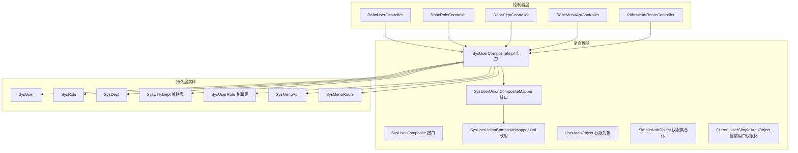
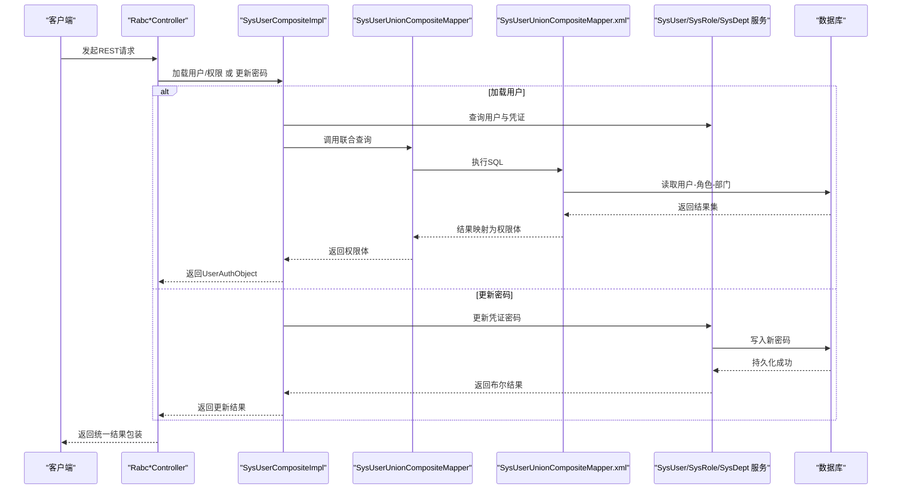
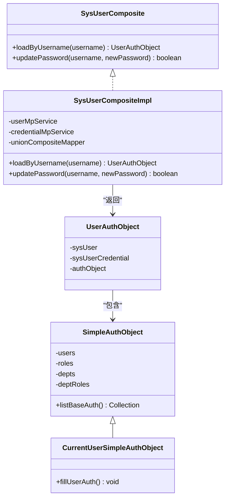
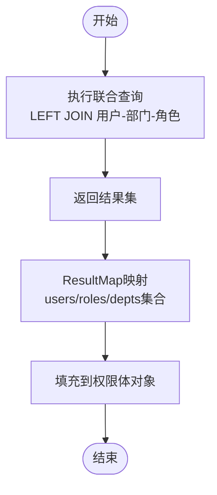
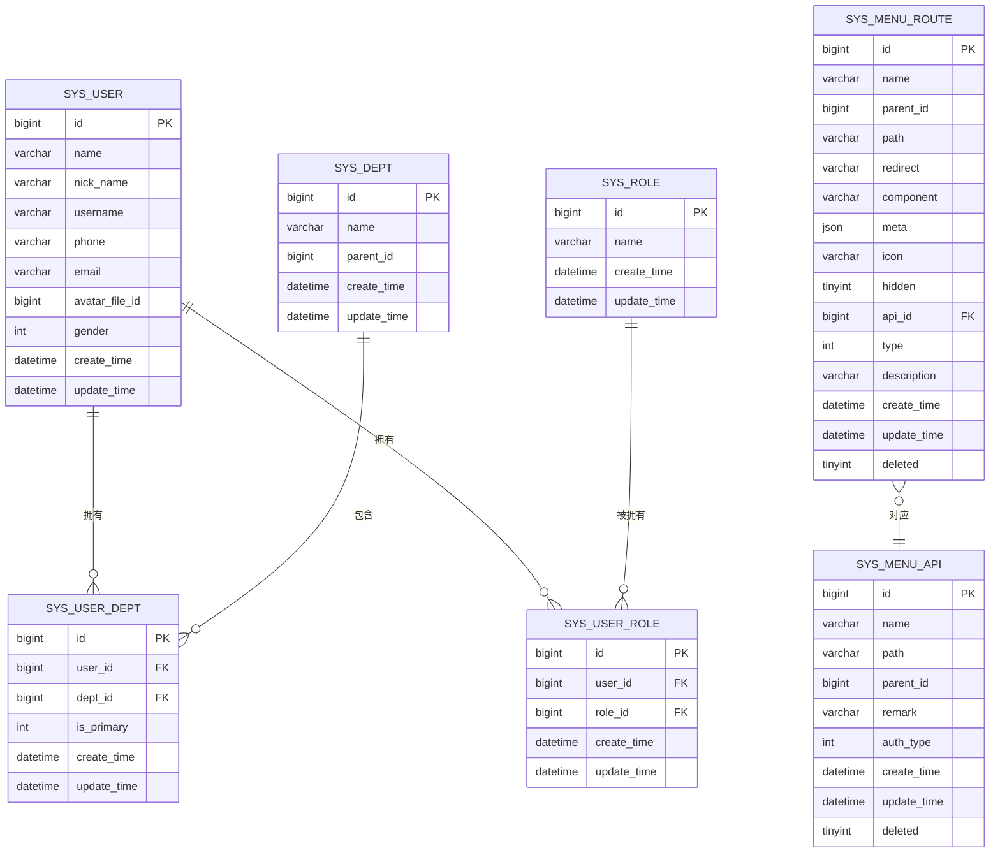
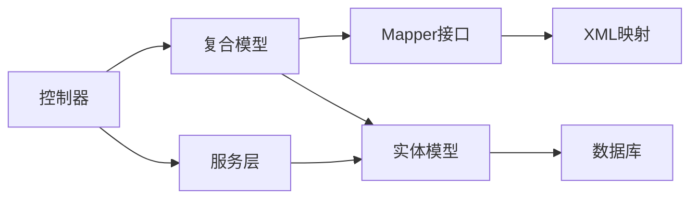

# RBAC实现 (auth-rbac)

<cite>
**本文引用的文件**
- [SysUserCompositeImpl.java](file://qy-auth/auth-rbac/src/main/java/com/kewen/framework/auth/rabc/composite/impl/SysUserCompositeImpl.java)
- [SysUserComposite.java](file://qy-auth/auth-rbac/src/main/java/com/kewen/framework/auth/rabc/composite/SysUserComposite.java)
- [SysUserUnionCompositeMapper.java](file://qy-auth/auth-rbac/src/main/java/com/kewen/framework/auth/rabc/composite/mapper/SysUserUnionCompositeMapper.java)
- [SysUserUnionCompositeMapper.xml](file://qy-auth/auth-rbac/src/main/resources/mapper/SysUserUnionCompositeMapper.xml)
- [UserAuthObject.java](file://qy-auth/auth-rbac/src/main/java/com/kewen/framework/auth/rabc/model/UserAuthObject.java)
- [SimpleAuthObject.java](file://qy-auth/auth-rbac/src/main/java/com/kewen/framework/auth/rabc/composite/model/SimpleAuthObject.java)
- [CurrentUserSimpleAuthObject.java](file://qy-auth/auth-rbac/src/main/java/com/kewen/framework/auth/rabc/composite/model/CurrentUserSimpleAuthObject.java)
- [RabcUserController.java](file://qy-auth/auth-rbac/src/main/java/com/kewen/framework/auth/rabc/controller/RabcUserController.java)
- [RabcRoleController.java](file://qy-auth/auth-rbac/src/main/java/com/kewen/framework/auth/rabc/controller/RabcRoleController.java)
- [RabcDeptController.java](file://qy-auth/auth-rbac/src/main/java/com/kewen/framework/auth/rabc/controller/RabcDeptController.java)
- [RabcMenuApiController.java](file://qy-auth/auth-rbac/src/main/java/com/kewen/framework/auth/rabc/controller/RabcMenuApiController.java)
- [RabcMenuRouteController.java](file://qy-auth/auth-rbac/src/main/java/com/kewen/framework/auth/rabc/controller/RabcMenuRouteController.java)
- [SysUser.java](file://qy-auth/auth-rbac/src/main/java/com/kewen/framework/auth/rabc/mp/entity/SysUser.java)
- [SysRole.java](file://qy-auth/auth-rbac/src/main/java/com/kewen/framework/auth/rabc/mp/entity/SysRole.java)
- [SysDept.java](file://qy-auth/auth-rbac/src/main/java/com/kewen/framework/auth/rabc/mp/entity/SysDept.java)
- [SysUserDept.java](file://qy-auth/auth-rbac/src/main/java/com/kewen/framework/auth/rabc/mp/entity/SysUserDept.java)
- [SysUserRole.java](file://qy-auth/auth-rbac/src/main/java/com/kewen/framework/auth/rabc/mp/entity/SysUserRole.java)
- [SysMenuApi.java](file://qy-auth/auth-rbac/src/main/java/com/kewen/framework/auth/rabc/mp/entity/SysMenuApi.java)
- [SysMenuRoute.java](file://qy-auth/auth-rbac/src/main/java/com/kewen/framework/auth/rabc/mp/entity/SysMenuRoute.java)
</cite>

## 目录
1. [简介](#简介)
2. [项目结构](#项目结构)
3. [核心组件](#核心组件)
4. [架构总览](#架构总览)
5. [详细组件分析](#详细组件分析)
6. [依赖分析](#依赖分析)
7. [性能考虑](#性能考虑)
8. [故障排查指南](#故障排查指南)
9. [结论](#结论)
10. [附录](#附录)

## 简介
本文件面向“auth-rbac”RBAC实现模块，系统性阐述复合用户模型（SysUserCompositeImpl）的设计理念与实现，包括用户、角色、部门的关联关系与权限继承机制；深入解析RBAC控制器层的REST API接口设计与参数规范；文档化MyBatis Plus实体模型（SysUser、SysRole、SysDept等）的字段定义与关系映射；解释用户权限对象（UserAuthObject）的数据结构与权限计算逻辑；详解部门角色管理、权限范围控制、菜单路由等功能实现细节，并提供完整的RBAC API使用示例与权限配置指南，以及最佳实践与性能优化建议。

## 项目结构
auth-rbac模块采用按功能域分层的组织方式，核心目录如下：
- composite：复合用户模型与权限聚合
- controller：RBAC控制器层（用户/角色/部门/菜单API/菜单路由）
- mp/entity：MyBatis Plus实体模型
- mp/mapper：MyBatis Mapper接口与XML
- model：请求/响应与通用结果封装
- service：业务服务（实现类位于service/impl）

图表来源
- [RabcUserController.java:26-66](file://qy-auth/auth-rbac/src/main/java/com/kewen/framework/auth/rabc/controller/RabcUserController.java#L26-L66)
- [RabcRoleController.java:21-63](file://qy-auth/auth-rbac/src/main/java/com/kewen/framework/auth/rabc/controller/RabcRoleController.java#L21-L63)
- [RabcDeptController.java:21-62](file://qy-auth/auth-rbac/src/main/java/com/kewen/framework/auth/rabc/controller/RabcDeptController.java#L21-L62)
- [RabcMenuApiController.java:22-46](file://qy-auth/auth-rbac/src/main/java/com/kewen/framework/auth/rabc/controller/RabcMenuApiController.java#L22-L46)
- [RabcMenuRouteController.java:14-33](file://qy-auth/auth-rbac/src/main/java/com/kewen/framework/auth/rabc/controller/RabcMenuRouteController.java#L14-L33)
- [SysUserComposite.java:1-18](file://qy-auth/auth-rbac/src/main/java/com/kewen/framework/auth/rabc/composite/SysUserComposite.java#L1-L18)
- [SysUserCompositeImpl.java:24-93](file://qy-auth/auth-rbac/src/main/java/com/kewen/framework/auth/rabc/composite/impl/SysUserCompositeImpl.java#L24-L93)
- [SysUserUnionCompositeMapper.java:13-22](file://qy-auth/auth-rbac/src/main/java/com/kewen/framework/auth/rabc/composite/mapper/SysUserUnionCompositeMapper.java#L13-L22)
- [SysUserUnionCompositeMapper.xml:1-30](file://qy-auth/auth-rbac/src/main/resources/mapper/SysUserUnionCompositeMapper.xml#L1-L30)
- [UserAuthObject.java:12-18](file://qy-auth/auth-rbac/src/main/java/com/kewen/framework/auth/rabc/model/UserAuthObject.java#L12-L18)
- [SimpleAuthObject.java:17-114](file://qy-auth/auth-rbac/src/main/java/com/kewen/framework/auth/rabc/composite/model/SimpleAuthObject.java#L17-L114)
- [CurrentUserSimpleAuthObject.java:11-27](file://qy-auth/auth-rbac/src/main/java/com/kewen/framework/auth/rabc/composite/model/CurrentUserSimpleAuthObject.java#L11-L27)
- [SysUser.java:22-97](file://qy-auth/auth-rbac/src/main/java/com/kewen/framework/auth/rabc/mp/entity/SysUser.java#L22-L97)
- [SysRole.java:22-61](file://qy-auth/auth-rbac/src/main/java/com/kewen/framework/auth/rabc/mp/entity/SysRole.java#L22-L61)
- [SysDept.java:22-67](file://qy-auth/auth-rbac/src/main/java/com/kewen/framework/auth/rabc/mp/entity/SysDept.java#L22-L67)
- [SysUserDept.java:22-73](file://qy-auth/auth-rbac/src/main/java/com/kewen/framework/auth/rabc/mp/entity/SysUserDept.java#L22-L73)
- [SysUserRole.java:22-67](file://qy-auth/auth-rbac/src/main/java/com/kewen/framework/auth/rabc/mp/entity/SysUserRole.java#L22-L67)
- [SysMenuApi.java:25-95](file://qy-auth/auth-rbac/src/main/java/com/kewen/framework/auth/rabc/mp/entity/SysMenuApi.java#L25-L95)
- [SysMenuRoute.java:25-130](file://qy-auth/auth-rbac/src/main/java/com/kewen/framework/auth/rabc/mp/entity/SysMenuRoute.java#L25-L130)

章节来源
- [RabcUserController.java:26-66](file://qy-auth/auth-rbac/src/main/java/com/kewen/framework/auth/rabc/controller/RabcUserController.java#L26-L66)
- [RabcRoleController.java:21-63](file://qy-auth/auth-rbac/src/main/java/com/kewen/framework/auth/rabc/controller/RabcRoleController.java#L21-L63)
- [RabcDeptController.java:21-62](file://qy-auth/auth-rbac/src/main/java/com/kewen/framework/auth/rabc/controller/RabcDeptController.java#L21-L62)
- [RabcMenuApiController.java:22-46](file://qy-auth/auth-rbac/src/main/java/com/kewen/framework/auth/rabc/controller/RabcMenuApiController.java#L22-L46)
- [RabcMenuRouteController.java:14-33](file://qy-auth/auth-rbac/src/main/java/com/kewen/framework/auth/rabc/controller/RabcMenuRouteController.java#L14-L33)

## 核心组件
- 复合用户模型与权限聚合
  - SysUserComposite：复合用户模型接口，定义按用户名加载用户与修改密码能力
  - SysUserCompositeImpl：接口实现，负责加载用户、凭证与权限聚合体
  - SysUserUnionCompositeMapper：MyBatis Mapper，提供用户-角色-部门联合查询
  - UserAuthObject：用户认证与权限对象载体
  - SimpleAuthObject/CurrentUserSimpleAuthObject：权限集合体与当前用户权限体，支持用户+角色+部门+部门角色的组合权限计算
- 控制器层
  - RabcUserController：用户增删改查、分页与列表
  - RabcRoleController：角色增删改查、分页与列表
  - RabcDeptController：部门增删改查、分页与列表
  - RabcMenuApiController：菜单API树形结构与权限范围更新
  - RabcMenuRouteController：菜单路由树形结构
- 实体模型
  - SysUser、SysRole、SysDept：基础实体
  - SysUserDept、SysUserRole：用户-部门、用户-角色关联表
  - SysMenuApi、SysMenuRoute：菜单API与前端路由元数据

章节来源
- [SysUserComposite.java:5-17](file://qy-auth/auth-rbac/src/main/java/com/kewen/framework/auth/rabc/composite/SysUserComposite.java#L5-L17)
- [SysUserCompositeImpl.java:24-93](file://qy-auth/auth-rbac/src/main/java/com/kewen/framework/auth/rabc/composite/impl/SysUserCompositeImpl.java#L24-L93)
- [SysUserUnionCompositeMapper.java:13-22](file://qy-auth/auth-rbac/src/main/java/com/kewen/framework/auth/rabc/composite/mapper/SysUserUnionCompositeMapper.java#L13-L22)
- [SysUserUnionCompositeMapper.xml:1-30](file://qy-auth/auth-rbac/src/main/resources/mapper/SysUserUnionCompositeMapper.xml#L1-L30)
- [UserAuthObject.java:12-18](file://qy-auth/auth-rbac/src/main/java/com/kewen/framework/auth/rabc/model/UserAuthObject.java#L12-L18)
- [SimpleAuthObject.java:17-114](file://qy-auth/auth-rbac/src/main/java/com/kewen/framework/auth/rabc/composite/model/SimpleAuthObject.java#L17-L114)
- [CurrentUserSimpleAuthObject.java:11-27](file://qy-auth/auth-rbac/src/main/java/com/kewen/framework/auth/rabc/composite/model/CurrentUserSimpleAuthObject.java#L11-L27)
- [RabcUserController.java:26-66](file://qy-auth/auth-rbac/src/main/java/com/kewen/framework/auth/rabc/controller/RabcUserController.java#L26-L66)
- [RabcRoleController.java:21-63](file://qy-auth/auth-rbac/src/main/java/com/kewen/framework/auth/rabc/controller/RabcRoleController.java#L21-L63)
- [RabcDeptController.java:21-62](file://qy-auth/auth-rbac/src/main/java/com/kewen/framework/auth/rabc/controller/RabcDeptController.java#L21-L62)
- [RabcMenuApiController.java:22-46](file://qy-auth/auth-rbac/src/main/java/com/kewen/framework/auth/rabc/controller/RabcMenuApiController.java#L22-L46)
- [RabcMenuRouteController.java:14-33](file://qy-auth/auth-rbac/src/main/java/com/kewen/framework/auth/rabc/controller/RabcMenuRouteController.java#L14-L33)

## 架构总览
下图展示从控制器到复合模型与持久层的调用链路与数据流向：

图表来源
- [SysUserCompositeImpl.java:36-91](file://qy-auth/auth-rbac/src/main/java/com/kewen/framework/auth/rabc/composite/impl/SysUserCompositeImpl.java#L36-L91)
- [SysUserUnionCompositeMapper.java:13-22](file://qy-auth/auth-rbac/src/main/java/com/kewen/framework/auth/rabc/composite/mapper/SysUserUnionCompositeMapper.java#L13-L22)
- [SysUserUnionCompositeMapper.xml:19-27](file://qy-auth/auth-rbac/src/main/resources/mapper/SysUserUnionCompositeMapper.xml#L19-L27)
- [RabcUserController.java:34-64](file://qy-auth/auth-rbac/src/main/java/com/kewen/framework/auth/rabc/controller/RabcUserController.java#L34-L64)
- [RabcRoleController.java:29-61](file://qy-auth/auth-rbac/src/main/java/com/kewen/framework/auth/rabc/controller/RabcRoleController.java#L29-L61)
- [RabcDeptController.java:29-60](file://qy-auth/auth-rbac/src/main/java/com/kewen/framework/auth/rabc/controller/RabcDeptController.java#L29-L60)

## 详细组件分析

### 复合用户模型与权限继承（SysUserCompositeImpl）
- 设计理念
  - 将用户、角色、部门及其组合（部门角色）统一聚合到权限对象中，支持“用户+角色+部门+部门角色”的多维权限继承
  - 通过联合查询一次性拉取用户-角色-部门关系，避免多次往返数据库
- 关键流程
  - 按用户名加载用户与凭证后，调用联合Mapper获取权限体，并填充“用户+角色+部门+部门角色”的组合权限
  - 提供修改密码接口，直接基于用户凭证表进行更新
- 权限继承机制
  - CurrentUserSimpleAuthObject在填充时，对每个部门与每个角色进行笛卡尔积组合，生成“部门角色”条目，从而实现部门+角色的组合权限

图表来源
- [SysUserComposite.java:5-17](file://qy-auth/auth-rbac/src/main/java/com/kewen/framework/auth/rabc/composite/SysUserComposite.java#L5-L17)
- [SysUserCompositeImpl.java:24-93](file://qy-auth/auth-rbac/src/main/java/com/kewen/framework/auth/rabc/composite/impl/SysUserCompositeImpl.java#L24-L93)
- [UserAuthObject.java:12-18](file://qy-auth/auth-rbac/src/main/java/com/kewen/framework/auth/rabc/model/UserAuthObject.java#L12-L18)
- [SimpleAuthObject.java:17-114](file://qy-auth/auth-rbac/src/main/java/com/kewen/framework/auth/rabc/composite/model/SimpleAuthObject.java#L17-L114)
- [CurrentUserSimpleAuthObject.java:11-27](file://qy-auth/auth-rbac/src/main/java/com/kewen/framework/auth/rabc/composite/model/CurrentUserSimpleAuthObject.java#L11-L27)

章节来源
- [SysUserCompositeImpl.java:36-91](file://qy-auth/auth-rbac/src/main/java/com/kewen/framework/auth/rabc/composite/impl/SysUserCompositeImpl.java#L36-L91)
- [CurrentUserSimpleAuthObject.java:17-25](file://qy-auth/auth-rbac/src/main/java/com/kewen/framework/auth/rabc/composite/model/CurrentUserSimpleAuthObject.java#L17-L25)

### 联合查询与权限体映射（SysUserUnionCompositeMapper）
- Mapper接口声明了按用户ID查询权限体的方法
- XML映射通过多表LEFT JOIN查询用户、部门、角色信息，并以嵌套集合的方式映射到权限体
- 该查询是权限继承的关键，确保一次查询完成用户-角色-部门的全量关系

图表来源
- [SysUserUnionCompositeMapper.java:13-22](file://qy-auth/auth-rbac/src/main/java/com/kewen/framework/auth/rabc/composite/mapper/SysUserUnionCompositeMapper.java#L13-L22)
- [SysUserUnionCompositeMapper.xml:5-27](file://qy-auth/auth-rbac/src/main/resources/mapper/SysUserUnionCompositeMapper.xml#L5-L27)

章节来源
- [SysUserUnionCompositeMapper.xml:19-27](file://qy-auth/auth-rbac/src/main/resources/mapper/SysUserUnionCompositeMapper.xml#L19-L27)

### 控制器层与REST API设计
- 用户管理
  - GET /rabc/user/list：获取用户列表
  - GET /rabc/user/page：分页查询
  - POST /rabc/user/add：新增用户
  - POST /rabc/user/update：更新用户（需提供ID）
  - POST /rabc/user/delete：删除用户（接收ID）
- 角色管理
  - GET /rabc/role/list：获取角色列表
  - GET /rabc/role/page：分页查询
  - POST /rabc/role/add：新增角色
  - POST /rabc/role/update：更新角色（需提供ID）
  - POST /rabc/role/delete：删除角色（接收ID）
- 部门管理
  - GET /rabc/dept/list：获取部门列表
  - GET /rabc/dept/page：分页查询
  - POST /rabc/dept/add：新增部门
  - POST /rabc/dept/update：更新部门（需提供ID）
  - POST /rabc/dept/delete：删除部门（接收ID）
- 菜单API与权限范围
  - GET /menu/api/tree：获取API菜单树
  - POST /menu/api/update：更新菜单权限范围（当权限类型为“仅拥有者”时，必须提供授权对象集合）
- 菜单路由
  - GET /menu/route/tree：获取路由菜单树

章节来源
- [RabcUserController.java:34-64](file://qy-auth/auth-rbac/src/main/java/com/kewen/framework/auth/rabc/controller/RabcUserController.java#L34-L64)
- [RabcRoleController.java:29-61](file://qy-auth/auth-rbac/src/main/java/com/kewen/framework/auth/rabc/controller/RabcRoleController.java#L29-L61)
- [RabcDeptController.java:29-60](file://qy-auth/auth-rbac/src/main/java/com/kewen/framework/auth/rabc/controller/RabcDeptController.java#L29-L60)
- [RabcMenuApiController.java:31-44](file://qy-auth/auth-rbac/src/main/java/com/kewen/framework/auth/rabc/controller/RabcMenuApiController.java#L31-L44)
- [RabcMenuRouteController.java:26-30](file://qy-auth/auth-rbac/src/main/java/com/kewen/framework/auth/rabc/controller/RabcMenuRouteController.java#L26-L30)

### MyBatis Plus实体模型与关系映射
- SysUser：用户基本信息（姓名、昵称、用户名、手机号、邮箱、头像、性别、时间戳）
- SysRole：角色信息（名称、时间戳）
- SysDept：部门信息（名称、父ID、时间戳）
- SysUserDept：用户-部门关联（用户ID、部门ID、是否主要部门、时间戳）
- SysUserRole：用户-角色关联（用户ID、角色ID、时间戳）
- SysMenuApi：菜单API（名称、路径、父ID、备注、权限类型、时间戳、删除标记）
- SysMenuRoute：菜单路由（名称、父ID、路径、重定向、组件、元信息、图标、隐藏、API ID、类型、描述、时间戳、删除标记）

图表来源
- [SysUser.java:22-97](file://qy-auth/auth-rbac/src/main/java/com/kewen/framework/auth/rabc/mp/entity/SysUser.java#L22-L97)
- [SysRole.java:22-61](file://qy-auth/auth-rbac/src/main/java/com/kewen/framework/auth/rabc/mp/entity/SysRole.java#L22-L61)
- [SysDept.java:22-67](file://qy-auth/auth-rbac/src/main/java/com/kewen/framework/auth/rabc/mp/entity/SysDept.java#L22-L67)
- [SysUserDept.java:22-73](file://qy-auth/auth-rbac/src/main/java/com/kewen/framework/auth/rabc/mp/entity/SysUserDept.java#L22-L73)
- [SysUserRole.java:22-67](file://qy-auth/auth-rbac/src/main/java/com/kewen/framework/auth/rabc/mp/entity/SysUserRole.java#L22-L67)
- [SysMenuApi.java:25-95](file://qy-auth/auth-rbac/src/main/java/com/kewen/framework/auth/rabc/mp/entity/SysMenuApi.java#L25-L95)
- [SysMenuRoute.java:25-130](file://qy-auth/auth-rbac/src/main/java/com/kewen/framework/auth/rabc/mp/entity/SysMenuRoute.java#L25-L130)

章节来源
- [SysUser.java:22-97](file://qy-auth/auth-rbac/src/main/java/com/kewen/framework/auth/rabc/mp/entity/SysUser.java#L22-L97)
- [SysRole.java:22-61](file://qy-auth/auth-rbac/src/main/java/com/kewen/framework/auth/rabc/mp/entity/SysRole.java#L22-L61)
- [SysDept.java:22-67](file://qy-auth/auth-rbac/src/main/java/com/kewen/framework/auth/rabc/mp/entity/SysDept.java#L22-L67)
- [SysUserDept.java:22-73](file://qy-auth/auth-rbac/src/main/java/com/kewen/framework/auth/rabc/mp/entity/SysUserDept.java#L22-L73)
- [SysUserRole.java:22-67](file://qy-auth/auth-rbac/src/main/java/com/kewen/framework/auth/rabc/mp/entity/SysUserRole.java#L22-L67)
- [SysMenuApi.java:25-95](file://qy-auth/auth-rbac/src/main/java/com/kewen/framework/auth/rabc/mp/entity/SysMenuApi.java#L25-L95)
- [SysMenuRoute.java:25-130](file://qy-auth/auth-rbac/src/main/java/com/kewen/framework/auth/rabc/mp/entity/SysMenuRoute.java#L25-L130)

### 用户权限对象（UserAuthObject）与权限计算逻辑
- 数据结构
  - 包含SysUser、SysUserCredential与SimpleAuthObject三部分
- 权限计算
  - SimpleAuthObject.listBaseAuth()会汇总用户、角色、部门、部门角色的权限标识
  - CurrentUserSimpleAuthObject.fillUserAuth()通过用户与角色的笛卡尔积生成部门角色条目，形成“部门+角色”的组合权限

章节来源
- [UserAuthObject.java:12-18](file://qy-auth/auth-rbac/src/main/java/com/kewen/framework/auth/rabc/model/UserAuthObject.java#L12-L18)
- [SimpleAuthObject.java:54-79](file://qy-auth/auth-rbac/src/main/java/com/kewen/framework/auth/rabc/composite/model/SimpleAuthObject.java#L54-L79)
- [CurrentUserSimpleAuthObject.java:17-25](file://qy-auth/auth-rbac/src/main/java/com/kewen/framework/auth/rabc/composite/model/CurrentUserSimpleAuthObject.java#L17-L25)

### 部门角色管理、权限范围控制与菜单路由
- 部门角色管理
  - 通过CurrentUserSimpleAuthObject.fillUserAuth()生成“部门角色”组合，用于权限继承
- 权限范围控制
  - 菜单API更新接口在权限类型为“仅拥有者”时，要求提供授权对象集合，防止误配置导致无权限可见
- 菜单路由
  - 路由树接口返回前端可渲染的菜单树，结合API权限与路由元信息实现前后端一致的访问控制

章节来源
- [CurrentUserSimpleAuthObject.java:17-25](file://qy-auth/auth-rbac/src/main/java/com/kewen/framework/auth/rabc/composite/model/CurrentUserSimpleAuthObject.java#L17-L25)
- [RabcMenuApiController.java:36-44](file://qy-auth/auth-rbac/src/main/java/com/kewen/framework/auth/rabc/controller/RabcMenuApiController.java#L36-L44)
- [RabcMenuRouteController.java:26-30](file://qy-auth/auth-rbac/src/main/java/com/kewen/framework/auth/rabc/controller/RabcMenuRouteController.java#L26-L30)

## 依赖分析
- 控制器依赖复合模型与服务层，复合模型依赖Mapper与实体
- 权限计算依赖SimpleAuthObject的集合体与CurrentUserSimpleAuthObject的组合填充
- 菜单API与路由依赖SysMenuApi与SysMenuRoute实体及对应服务

图表来源
- [SysUserCompositeImpl.java:24-93](file://qy-auth/auth-rbac/src/main/java/com/kewen/framework/auth/rabc/composite/impl/SysUserCompositeImpl.java#L24-L93)
- [SysUserUnionCompositeMapper.java:13-22](file://qy-auth/auth-rbac/src/main/java/com/kewen/framework/auth/rabc/composite/mapper/SysUserUnionCompositeMapper.java#L13-L22)
- [SysUserUnionCompositeMapper.xml:1-30](file://qy-auth/auth-rbac/src/main/resources/mapper/SysUserUnionCompositeMapper.xml#L1-L30)
- [RabcUserController.java:26-66](file://qy-auth/auth-rbac/src/main/java/com/kewen/framework/auth/rabc/controller/RabcUserController.java#L26-L66)

章节来源
- [SysUserCompositeImpl.java:24-93](file://qy-auth/auth-rbac/src/main/java/com/kewen/framework/auth/rabc/composite/impl/SysUserCompositeImpl.java#L24-L93)
- [SysUserUnionCompositeMapper.java:13-22](file://qy-auth/auth-rbac/src/main/java/com/kewen/framework/auth/rabc/composite/mapper/SysUserUnionCompositeMapper.java#L13-L22)
- [SysUserUnionCompositeMapper.xml:1-30](file://qy-auth/auth-rbac/src/main/resources/mapper/SysUserUnionCompositeMapper.xml#L1-L30)
- [RabcUserController.java:26-66](file://qy-auth/auth-rbac/src/main/java/com/kewen/framework/auth/rabc/controller/RabcUserController.java#L26-L66)

## 性能考虑
- 单次联合查询：通过SysUserUnionCompositeMapper.xml的LEFT JOIN一次性获取用户-角色-部门关系，减少N+1查询
- 权限计算本地化：SimpleAuthObject在内存中聚合与去重，避免重复数据库访问
- 分页与列表：控制器层统一使用分页转换器，降低一次性加载压力
- 建议
  - 对高频查询建立合适索引（如用户表用户名、关联表用户ID/角色ID/部门ID）
  - 合理缓存菜单树与用户权限体，减少重复计算
  - 在权限类型为“仅拥有者”时，尽量批量提交授权对象，避免频繁更新

## 故障排查指南
- 用户不存在
  - 现象：按用户名加载用户返回空
  - 处理：检查用户名是否正确，确认用户是否存在
- 更新密码失败
  - 现象：更新密码返回false或异常
  - 处理：确认用户存在且凭证表已初始化；检查密码加密策略与存储一致性
- 权限范围配置错误
  - 现象：当权限类型为“仅拥有者”时，未提供授权对象导致报错
  - 处理：在更新菜单权限时，确保提供授权对象集合
- 菜单树为空
  - 现象：获取菜单API树或路由树为空
  - 处理：检查SysMenuApi与SysMenuRoute数据完整性与关联关系

章节来源
- [SysUserCompositeImpl.java:43-55](file://qy-auth/auth-rbac/src/main/java/com/kewen/framework/auth/rabc/composite/impl/SysUserCompositeImpl.java#L43-L55)
- [RabcMenuApiController.java:38-40](file://qy-auth/auth-rbac/src/main/java/com/kewen/framework/auth/rabc/controller/RabcMenuApiController.java#L38-L40)

## 结论
auth-rbac模块通过复合用户模型与联合查询实现了高效的用户-角色-部门权限聚合，结合SimpleAuthObject与CurrentUserSimpleAuthObject的权限继承机制，提供了灵活而强大的RBAC能力。控制器层以清晰的REST API覆盖用户、角色、部门、菜单API与路由管理，配合菜单权限范围控制与路由树输出，满足现代应用的权限治理需求。建议在生产环境中关注索引与缓存策略，确保高并发下的稳定性与性能。

## 附录
- RBAC API使用示例（说明性步骤）
  - 用户管理
    - 获取用户列表：GET /rabc/user/list
    - 分页查询：GET /rabc/user/page（携带分页参数）
    - 新增用户：POST /rabc/user/add（Body传入SysUser）
    - 更新用户：POST /rabc/user/update（Body传入SysUser，需提供ID）
    - 删除用户：POST /rabc/user/delete（Body传入ID）
  - 角色管理
    - 获取角色列表：GET /rabc/role/list
    - 分页查询：GET /rabc/role/page（携带分页参数）
    - 新增角色：POST /rabc/role/add（Body传入SysRole）
    - 更新角色：POST /rabc/role/update（Body传入SysRole，需提供ID）
    - 删除角色：POST /rabc/role/delete（Body传入ID）
  - 部门管理
    - 获取部门列表：GET /rabc/dept/list
    - 分页查询：GET /rabc/dept/page（携带分页参数）
    - 新增部门：POST /rabc/dept/add（Body传入SysDept）
    - 更新部门：POST /rabc/dept/update（Body传入SysDept，需提供ID）
    - 删除部门：POST /rabc/dept/delete（Body传入ID）
  - 菜单API与权限范围
    - 获取API树：GET /menu/api/tree
    - 更新权限范围：POST /menu/api/update（Body传入菜单权限更新请求）
      - 当权限类型为“仅拥有者”时，必须提供授权对象集合
  - 菜单路由
    - 获取路由树：GET /menu/route/tree
- 权限配置指南
  - 用户-角色-部门关系：通过SysUserDept与SysUserRole维护
  - 权限继承：利用CurrentUserSimpleAuthObject.fillUserAuth()生成部门角色组合
  - 菜单与路由：SysMenuApi与SysMenuRoute分别承载API与前端路由元信息，通过API ID关联