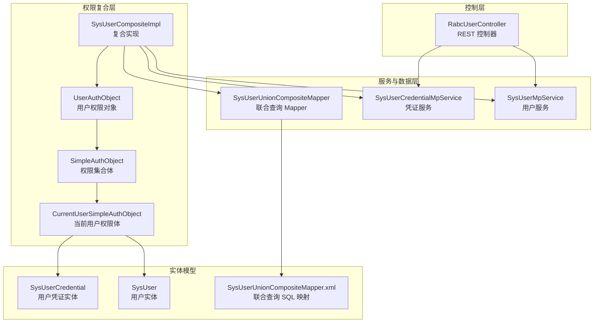
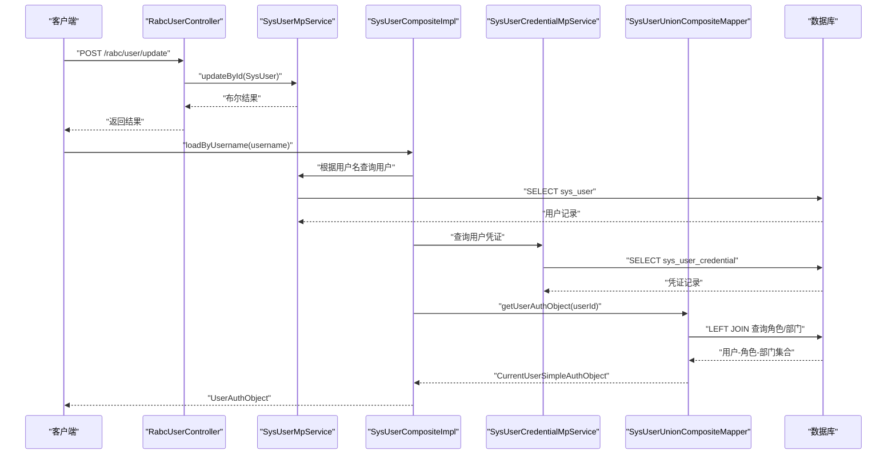
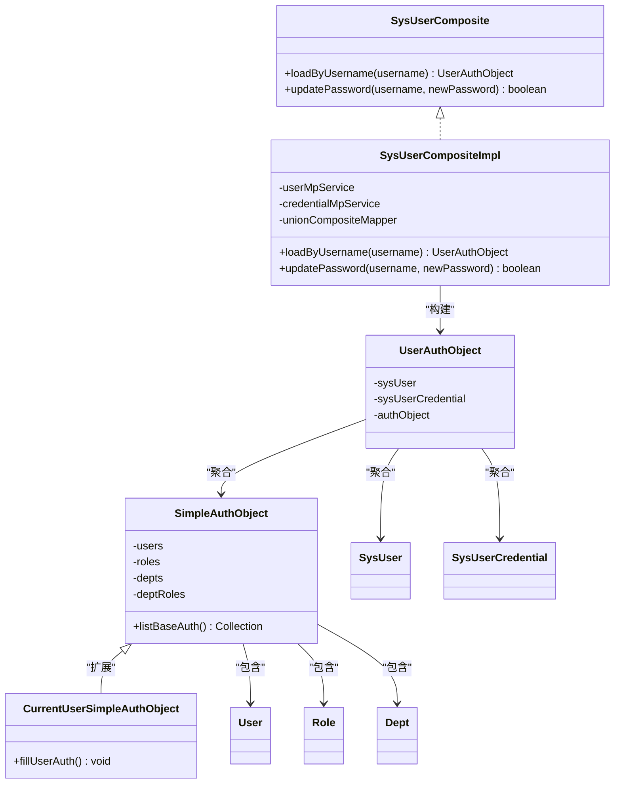
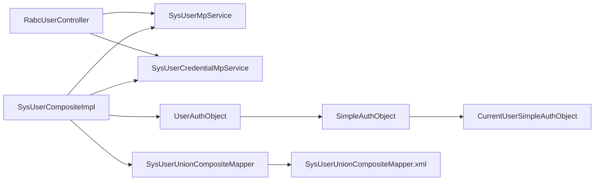

# 用户管理

<cite>
**本文引用的文件**
- [RabcUserController.java](file://qy-auth/auth-rbac/src/main/java/com/kewen/framework/auth/rabc/controller/RabcUserController.java)
- [SysUser.java](file://qy-auth/auth-rbac/src/main/java/com/kewen/framework/auth/rabc/mp/entity/SysUser.java)
- [SysUserCredential.java](file://qy-auth/auth-rbac/src/main/java/com/kewen/framework/auth/rabc/mp/entity/SysUserCredential.java)
- [SysUserCompositeImpl.java](file://qy-auth/auth-rbac/src/main/java/com/kewen/framework/auth/rabc/composite/impl/SysUserCompositeImpl.java)
- [SysUserComposite.java](file://qy-auth/auth-rbac/src/main/java/com/kewen/framework/auth/rabc/composite/SysUserComposite.java)
- [UserAuthObject.java](file://qy-auth/auth-rbac/src/main/java/com/kewen/framework/auth/rabc/model/UserAuthObject.java)
- [SysUserUnionCompositeMapper.java](file://qy-auth/auth-rbac/src/main/java/com/kewen/framework/auth/rabc/composite/mapper/SysUserUnionCompositeMapper.java)
- [SysUserUnionCompositeMapper.xml](file://qy-auth/auth-rbac/src/main/resources/mapper/SysUserUnionCompositeMapper.xml)
- [SimpleAuthObject.java](file://qy-auth/auth-rbac/src/main/java/com/kewen/framework/auth/rabc/composite/model/SimpleAuthObject.java)
- [CurrentUserSimpleAuthObject.java](file://qy-auth/auth-rbac/src/main/java/com/kewen/framework/auth/rabc/composite/model/CurrentUserSimpleAuthObject.java)
- [User.java](file://qy-auth/auth-rbac/src/main/java/com/kewen/framework/auth/rabc/composite/model/User.java)
- [Role.java](file://qy-auth/auth-rbac/src/main/java/com/kewen/framework/auth/rabc/composite/model/Role.java)
- [Dept.java](file://qy-auth/auth-rbac/src/main/java/com/kewen/framework/auth/rabc/composite/model/Dept.java)
- [UpdatePasswordReq.java](file://qy-auth/auth-rbac/src/main/java/com/kewen/framework/auth/rabc/model/req/UpdatePasswordReq.java)
</cite>

## 目录
1. [简介](#简介)
2. [项目结构](#项目结构)
3. [核心组件](#核心组件)
4. [架构总览](#架构总览)
5. [详细组件分析](#详细组件分析)
6. [依赖分析](#依赖分析)
7. [性能考虑](#性能考虑)
8. [故障排查指南](#故障排查指南)
9. [结论](#结论)
10. [附录：API 使用示例与最佳实践](#附录api-使用示例与最佳实践)

## 简介
本技术文档聚焦于用户管理功能，围绕以下目标展开：
- 深入解析 RabcUserController 控制器的用户增删改查、密码管理、状态控制等 API 设计与参数规范
- 文档化 SysUser 实体模型的字段定义、数据类型与业务含义
- 解释 SysUserCompositeImpl 复合用户实现类的设计模式，包括用户与角色、部门的关联关系与权限继承机制
- 说明 UserAuthObject 用户权限对象的数据结构、权限计算逻辑与缓存策略
- 提供用户管理 API 的使用示例（注册、登录、权限验证等）
- 总结用户数据安全、权限控制与性能优化的最佳实践

## 项目结构
用户管理模块位于 qy-auth/auth-rbac 子模块中，采用按职责分层的组织方式：
- 控制层：RabcUserController 提供用户管理的 HTTP 接口
- 数据访问层：MyBatis-Plus 实体与 Mapper，负责用户与凭证等数据持久化
- 权限复合层：SysUserComposite 及其实现 SysUserCompositeImpl，负责用户与角色/部门的联合查询与权限对象构建
- 权限对象模型：UserAuthObject、SimpleAuthObject、CurrentUserSimpleAuthObject 及其内部的 User/Role/Dept/DeptRole 组合
- 映射文件：SysUserUnionCompositeMapper.xml 定义用户角色/部门关联查询的 SQL 与结果映射

图表来源
- [RabcUserController.java:26-66](file://qy-auth/auth-rbac/src/main/java/com/kewen/framework/auth/rabc/controller/RabcUserController.java#L26-L66)
- [SysUserCompositeImpl.java:24-93](file://qy-auth/auth-rbac/src/main/java/com/kewen/framework/auth/rabc/composite/impl/SysUserCompositeImpl.java#L24-L93)
- [SysUserUnionCompositeMapper.java:14-22](file://qy-auth/auth-rbac/src/main/java/com/kewen/framework/auth/rabc/composite/mapper/SysUserUnionCompositeMapper.java#L14-L22)
- [SysUserUnionCompositeMapper.xml:1-30](file://qy-auth/auth-rbac/src/main/resources/mapper/SysUserUnionCompositeMapper.xml#L1-L30)
- [UserAuthObject.java:12-18](file://qy-auth/auth-rbac/src/main/java/com/kewen/framework/auth/rabc/model/UserAuthObject.java#L12-L18)
- [SimpleAuthObject.java:19-114](file://qy-auth/auth-rbac/src/main/java/com/kewen/framework/auth/rabc/composite/model/SimpleAuthObject.java#L19-L114)
- [CurrentUserSimpleAuthObject.java:11-27](file://qy-auth/auth-rbac/src/main/java/com/kewen/framework/auth/rabc/composite/model/CurrentUserSimpleAuthObject.java#L11-L27)
- [SysUser.java:26-97](file://qy-auth/auth-rbac/src/main/java/com/kewen/framework/auth/rabc/mp/entity/SysUser.java#L26-L97)
- [SysUserCredential.java:26-91](file://qy-auth/auth-rbac/src/main/java/com/kewen/framework/auth/rabc/mp/entity/SysUserCredential.java#L26-L91)

章节来源
- [RabcUserController.java:26-66](file://qy-auth/auth-rbac/src/main/java/com/kewen/framework/auth/rabc/controller/RabcUserController.java#L26-L66)
- [SysUserCompositeImpl.java:24-93](file://qy-auth/auth-rbac/src/main/java/com/kewen/framework/auth/rabc/composite/impl/SysUserCompositeImpl.java#L24-L93)
- [SysUserUnionCompositeMapper.java:14-22](file://qy-auth/auth-rbac/src/main/java/com/kewen/framework/auth/rabc/composite/mapper/SysUserUnionCompositeMapper.java#L14-L22)
- [SysUserUnionCompositeMapper.xml:1-30](file://qy-auth/auth-rbac/src/main/resources/mapper/SysUserUnionCompositeMapper.xml#L1-L30)

## 核心组件
- RabcUserController：提供用户列表、分页、新增、更新、删除等接口；通过 SysUserMpService 与数据层交互
- SysUser：用户主表实体，包含基础个人信息与时间戳
- SysUserCredential：用户凭证表实体，包含密码、账号状态、有效期等
- SysUserCompositeImpl：复合用户实现，负责按用户名加载用户、合并凭证与权限对象，并支持密码更新
- UserAuthObject：用户权限对象容器，聚合用户、凭证与权限集合体
- SimpleAuthObject/CurrentUserSimpleAuthObject：权限集合体与当前用户权限体，负责用户-角色-部门的组合权限计算
- SysUserUnionCompositeMapper/SysUserUnionCompositeMapper.xml：联合查询用户的角色与部门关系，用于构建权限对象

章节来源
- [RabcUserController.java:26-66](file://qy-auth/auth-rbac/src/main/java/com/kewen/framework/auth/rabc/controller/RabcUserController.java#L26-L66)
- [SysUser.java:26-97](file://qy-auth/auth-rbac/src/main/java/com/kewen/framework/auth/rabc/mp/entity/SysUser.java#L26-L97)
- [SysUserCredential.java:26-91](file://qy-auth/auth-rbac/src/main/java/com/kewen/framework/auth/rabc/mp/entity/SysUserCredential.java#L26-L91)
- [SysUserCompositeImpl.java:24-93](file://qy-auth/auth-rbac/src/main/java/com/kewen/framework/auth/rabc/composite/impl/SysUserCompositeImpl.java#L24-L93)
- [UserAuthObject.java:12-18](file://qy-auth/auth-rbac/src/main/java/com/kewen/framework/auth/rabc/model/UserAuthObject.java#L12-L18)
- [SimpleAuthObject.java:19-114](file://qy-auth/auth-rbac/src/main/java/com/kewen/framework/auth/rabc/composite/model/SimpleAuthObject.java#L19-L114)
- [CurrentUserSimpleAuthObject.java:11-27](file://qy-auth/auth-rbac/src/main/java/com/kewen/framework/auth/rabc/composite/model/CurrentUserSimpleAuthObject.java#L11-L27)
- [SysUserUnionCompositeMapper.java:14-22](file://qy-auth/auth-rbac/src/main/java/com/kewen/framework/auth/rabc/composite/mapper/SysUserUnionCompositeMapper.java#L14-L22)
- [SysUserUnionCompositeMapper.xml:1-30](file://qy-auth/auth-rbac/src/main/resources/mapper/SysUserUnionCompositeMapper.xml#L1-L30)

## 架构总览
用户管理的典型调用链路如下：
- 控制器接收请求，调用服务层进行数据操作
- 复合实现根据用户名查询用户与凭证，并通过联合查询 Mapper 获取用户的角色与部门关系
- 构建 UserAuthObject 并填充权限对象，供认证与授权流程使用

图表来源
- [RabcUserController.java:40-64](file://qy-auth/auth-rbac/src/main/java/com/kewen/framework/auth/rabc/controller/RabcUserController.java#L40-L64)
- [SysUserCompositeImpl.java:36-63](file://qy-auth/auth-rbac/src/main/java/com/kewen/framework/auth/rabc/composite/impl/SysUserCompositeImpl.java#L36-L63)
- [SysUserUnionCompositeMapper.java:21-21](file://qy-auth/auth-rbac/src/main/java/com/kewen/framework/auth/rabc/composite/mapper/SysUserUnionCompositeMapper.java#L21-L21)
- [SysUserUnionCompositeMapper.xml:19-27](file://qy-auth/auth-rbac/src/main/resources/mapper/SysUserUnionCompositeMapper.xml#L19-L27)

## 详细组件分析

### RabcUserController 控制器
- 接口设计
  - GET /rabc/user/list：获取全部用户
  - GET /rabc/user/page：分页查询用户，使用 RabcPageReq 作为输入参数
  - POST /rabc/user/add：新增用户，请求体为 SysUser
  - POST /rabc/user/update：更新用户，请求体为 SysUser；要求提供用户 ID
  - POST /rabc/user/delete：删除用户，请求体为 RabcIdReq（包含 id）

- 参数规范
  - 分页参数：RabcPageReq（由 RabcPageConverter 转换并执行分页查询）
  - 删除参数：RabcIdReq（包含 id 字段）
  - 新增/更新：SysUser（包含姓名、昵称、用户名、手机号、邮箱、头像、性别、时间戳等）

- 错误处理
  - 更新时若未提供用户 ID，抛出运行时异常提示“用户ID为空”

- 权限菜单标注
  - 使用 @AuthMenu 对各接口进行菜单标注，便于权限体系识别

章节来源
- [RabcUserController.java:34-64](file://qy-auth/auth-rbac/src/main/java/com/kewen/framework/auth/rabc/controller/RabcUserController.java#L34-L64)
- [SysUser.java:30-97](file://qy-auth/auth-rbac/src/main/java/com/kewen/framework/auth/rabc/mp/entity/SysUser.java#L30-L97)

### SysUser 实体模型
- 字段定义与业务含义
  - id：主键
  - name：姓名
  - nickName：昵称
  - username：用户名
  - phone：手机号
  - email：邮箱
  - avatarFileId：头像文件 ID
  - gender：性别（1-男 2-女 3-其他）
  - createTime/updateTime：创建与更新时间

- 数据类型
  - 数值型：Long（id、avatarFileId）
  - 文本型：String（name、nickName、username、phone、email）
  - 枚举/标志位：Integer（gender）
  - 时间型：LocalDateTime（createTime、updateTime）

- 复用性与扩展
  - 采用 MyBatis-Plus 注解映射，支持链式赋值与序列化

章节来源
- [SysUser.java:26-97](file://qy-auth/auth-rbac/src/main/java/com/kewen/framework/auth/rabc/mp/entity/SysUser.java#L26-L97)

### SysUserCompositeImpl 复合用户实现
- 设计模式
  - 通过组合多个服务与 Mapper，将用户、凭证与权限对象整合为统一的 UserAuthObject
  - 使用联合查询 Mapper 获取用户的角色与部门关系，形成权限集合体

- 关键方法
  - loadByUsername(username)：按用户名加载用户，合并凭证与权限对象
  - updatePassword(username, newPassword)：更新用户密码（已加密后的明文）

- 权限继承机制
  - 通过 CurrentUserSimpleAuthObject.fillUserAuth 将用户与角色、部门进行笛卡尔积组合，生成部门角色 DeptRole，从而实现“用户拥有其所在部门的所有角色”的继承效果

图表来源
- [SysUserComposite.java:5-17](file://qy-auth/auth-rbac/src/main/java/com/kewen/framework/auth/rabc/composite/SysUserComposite.java#L5-L17)
- [SysUserCompositeImpl.java:24-93](file://qy-auth/auth-rbac/src/main/java/com/kewen/framework/auth/rabc/composite/impl/SysUserCompositeImpl.java#L24-L93)
- [UserAuthObject.java:12-18](file://qy-auth/auth-rbac/src/main/java/com/kewen/framework/auth/rabc/model/UserAuthObject.java#L12-L18)
- [SimpleAuthObject.java:19-114](file://qy-auth/auth-rbac/src/main/java/com/kewen/framework/auth/rabc/composite/model/SimpleAuthObject.java#L19-L114)
- [CurrentUserSimpleAuthObject.java:11-27](file://qy-auth/auth-rbac/src/main/java/com/kewen/framework/auth/rabc/composite/model/CurrentUserSimpleAuthObject.java#L11-L27)
- [SysUser.java:26-97](file://qy-auth/auth-rbac/src/main/java/com/kewen/framework/auth/rabc/mp/entity/SysUser.java#L26-L97)
- [SysUserCredential.java:26-91](file://qy-auth/auth-rbac/src/main/java/com/kewen/framework/auth/rabc/mp/entity/SysUserCredential.java#L26-L91)
- [User.java:10-50](file://qy-auth/auth-rbac/src/main/java/com/kewen/framework/auth/rabc/composite/model/User.java#L10-L50)
- [Role.java:14-34](file://qy-auth/auth-rbac/src/main/java/com/kewen/framework/auth/rabc/composite/model/Role.java#L14-L34)
- [Dept.java:14-37](file://qy-auth/auth-rbac/src/main/java/com/kewen/framework/auth/rabc/composite/model/Dept.java#L14-L37)

章节来源
- [SysUserCompositeImpl.java:36-91](file://qy-auth/auth-rbac/src/main/java/com/kewen/framework/auth/rabc/composite/impl/SysUserCompositeImpl.java#L36-L91)
- [CurrentUserSimpleAuthObject.java:17-25](file://qy-auth/auth-rbac/src/main/java/com/kewen/framework/auth/rabc/composite/model/CurrentUserSimpleAuthObject.java#L17-L25)

### UserAuthObject 用户权限对象
- 结构
  - sysUser：用户基本信息
  - sysUserCredential：用户凭证（密码、有效期、锁定状态、启用状态等）
  - authObject：权限集合体（SimpleAuthObject 或 CurrentUserSimpleAuthObject）

- 用途
  - 作为认证与授权流程中的统一载体，承载用户身份与权限信息

章节来源
- [UserAuthObject.java:12-18](file://qy-auth/auth-rbac/src/main/java/com/kewen/framework/auth/rabc/model/UserAuthObject.java#L12-L18)

### 权限计算与缓存策略
- 权限计算逻辑
  - 通过联合查询 Mapper 获取用户的角色与部门集合
  - 在 CurrentUserSimpleAuthObject 中对角色与部门进行组合，生成 DeptRole，从而实现“用户具备其所在部门的所有角色”的继承
  - SimpleAuthObject.listBaseAuth 汇总用户、角色、部门与部门角色的基础权限标识

- 缓存策略建议
  - 建议在应用层对 UserAuthObject 进行短期缓存（如基于用户名或用户 ID），结合凭证失效时间与权限变更事件进行失效控制
  - 对频繁访问的用户权限数据可采用本地缓存（如 Caffeine）与分布式缓存（如 Redis）双层缓存，降低数据库压力

章节来源
- [SysUserUnionCompositeMapper.xml:19-27](file://qy-auth/auth-rbac/src/main/resources/mapper/SysUserUnionCompositeMapper.xml#L19-L27)
- [CurrentUserSimpleAuthObject.java:17-25](file://qy-auth/auth-rbac/src/main/java/com/kewen/framework/auth/rabc/composite/model/CurrentUserSimpleAuthObject.java#L17-L25)
- [SimpleAuthObject.java:54-79](file://qy-auth/auth-rbac/src/main/java/com/kewen/framework/auth/rabc/composite/model/SimpleAuthObject.java#L54-L79)

### 密码管理与状态控制
- 密码更新
  - SysUserCompositeImpl.updatePassword 支持按用户名更新密码（需传入已加密后的明文）
  - SysUserCredential 表包含 password 字段与 passwordExpiredTime，可用于密码过期策略

- 账号状态
  - SysUserCredential.enabled 控制账号启用状态
  - accountLockedDeadline 控制账号锁定截止时间，早于当前时间视为未锁定

章节来源
- [SysUserCompositeImpl.java:66-91](file://qy-auth/auth-rbac/src/main/java/com/kewen/framework/auth/rabc/composite/impl/SysUserCompositeImpl.java#L66-L91)
- [SysUserCredential.java:44-82](file://qy-auth/auth-rbac/src/main/java/com/kewen/framework/auth/rabc/mp/entity/SysUserCredential.java#L44-L82)

## 依赖分析
- 控制器依赖服务层与模型
- 复合实现依赖用户服务、凭证服务与联合查询 Mapper
- 权限对象依赖用户、凭证与权限集合体模型
- 联合查询 Mapper 依赖 XML 映射文件

图表来源
- [RabcUserController.java:31-32](file://qy-auth/auth-rbac/src/main/java/com/kewen/framework/auth/rabc/controller/RabcUserController.java#L31-L32)
- [SysUserCompositeImpl.java:27-34](file://qy-auth/auth-rbac/src/main/java/com/kewen/framework/auth/rabc/composite/impl/SysUserCompositeImpl.java#L27-L34)
- [SysUserUnionCompositeMapper.java:14-22](file://qy-auth/auth-rbac/src/main/java/com/kewen/framework/auth/rabc/composite/mapper/SysUserUnionCompositeMapper.java#L14-L22)
- [SysUserUnionCompositeMapper.xml:1-30](file://qy-auth/auth-rbac/src/main/resources/mapper/SysUserUnionCompositeMapper.xml#L1-L30)
- [UserAuthObject.java:12-18](file://qy-auth/auth-rbac/src/main/java/com/kewen/framework/auth/rabc/model/UserAuthObject.java#L12-L18)
- [SimpleAuthObject.java:19-114](file://qy-auth/auth-rbac/src/main/java/com/kewen/framework/auth/rabc/composite/model/SimpleAuthObject.java#L19-L114)
- [CurrentUserSimpleAuthObject.java:11-27](file://qy-auth/auth-rbac/src/main/java/com/kewen/framework/auth/rabc/composite/model/CurrentUserSimpleAuthObject.java#L11-L27)

章节来源
- [RabcUserController.java:31-32](file://qy-auth/auth-rbac/src/main/java/com/kewen/framework/auth/rabc/controller/RabcUserController.java#L31-L32)
- [SysUserCompositeImpl.java:27-34](file://qy-auth/auth-rbac/src/main/java/com/kewen/framework/auth/rabc/composite/impl/SysUserCompositeImpl.java#L27-L34)
- [SysUserUnionCompositeMapper.java:14-22](file://qy-auth/auth-rbac/src/main/java/com/kewen/framework/auth/rabc/composite/mapper/SysUserUnionCompositeMapper.java#L14-L22)

## 性能考虑
- 查询优化
  - 使用联合查询一次性获取用户、角色与部门关系，减少 N+1 查询
  - 对常用过滤条件建立索引（如 username、user_id）

- 缓存策略
  - 对 UserAuthObject 进行短期缓存，结合凭证过期时间与权限变更事件进行失效
  - 对高频读取的用户信息与权限集合体采用本地缓存与分布式缓存双层结构

- 写入优化
  - 批量更新与插入时使用 MyBatis-Plus 的批量工具，避免逐条提交
  - 密码更新时仅更新必要字段，避免全量更新

- 分页与排序
  - 使用 RabcPageReq 进行分页，确保排序字段建立索引以提升查询效率

## 故障排查指南
- 更新用户时报错“用户ID为空”
  - 检查请求体是否包含正确的用户 ID
  - 确认前端传参与后端校验一致

- 登录或权限校验失败
  - 检查 SysUserCredential.enabled 是否为启用状态
  - 检查 accountLockedDeadline 是否仍处于锁定期内
  - 检查 passwordExpiredTime 是否已过期

- 权限不生效
  - 确认联合查询是否正确返回用户的角色与部门
  - 检查 CurrentUserSimpleAuthObject.fillUserAuth 是否被调用
  - 核对 SimpleAuthObject.listBaseAuth 的权限标识是否正确汇总

章节来源
- [RabcUserController.java:54-56](file://qy-auth/auth-rbac/src/main/java/com/kewen/framework/auth/rabc/controller/RabcUserController.java#L54-L56)
- [SysUserCredential.java:63-70](file://qy-auth/auth-rbac/src/main/java/com/kewen/framework/auth/rabc/mp/entity/SysUserCredential.java#L63-L70)
- [SysUserUnionCompositeMapper.xml:19-27](file://qy-auth/auth-rbac/src/main/resources/mapper/SysUserUnionCompositeMapper.xml#L19-L27)
- [CurrentUserSimpleAuthObject.java:17-25](file://qy-auth/auth-rbac/src/main/java/com/kewen/framework/auth/rabc/composite/model/CurrentUserSimpleAuthObject.java#L17-L25)

## 结论
本用户管理模块通过清晰的分层设计与复合权限模型，实现了用户增删改查、密码管理与状态控制的完整能力。SysUserCompositeImpl 将用户、凭证与权限对象整合，配合联合查询与权限继承机制，为权限体系提供了稳定可靠的基础。建议在生产环境中结合缓存与索引策略进一步提升性能，并完善安全与审计机制。

## 附录：API 使用示例与最佳实践

### API 使用示例
- 获取用户列表
  - 方法：GET
  - 路径：/rabc/user/list
  - 返回：用户列表

- 分页查询用户
  - 方法：GET
  - 路径：/rabc/user/page
  - 请求参数：RabcPageReq（由 RabcPageConverter 转换）
  - 返回：分页结果

- 新增用户
  - 方法：POST
  - 路径：/rabc/user/add
  - 请求体：SysUser
  - 返回：布尔结果

- 更新用户
  - 方法：POST
  - 路径：/rabc/user/update
  - 请求体：SysUser（必须包含 id）
  - 返回：布尔结果

- 删除用户
  - 方法：POST
  - 路径：/rabc/user/delete
  - 请求体：RabcIdReq（包含 id）
  - 返回：布尔结果

- 修改密码（扩展）
  - 方法：POST
  - 路径：/rabc/user/password/update
  - 请求体：UpdatePasswordReq（包含旧密码与新密码）
  - 返回：布尔结果

章节来源
- [RabcUserController.java:34-64](file://qy-auth/auth-rbac/src/main/java/com/kewen/framework/auth/rabc/controller/RabcUserController.java#L34-L64)
- [UpdatePasswordReq.java:14-20](file://qy-auth/auth-rbac/src/main/java/com/kewen/framework/auth/rabc/model/req/UpdatePasswordReq.java#L14-L20)

### 最佳实践
- 数据安全
  - 密码必须加密存储，更新密码时传入已加密后的明文
  - 账号启用与锁定状态应严格控制，避免未授权访问
  - 对敏感字段（如密码、手机号、邮箱）进行脱敏展示

- 权限控制
  - 使用 @AuthMenu 对接口进行菜单标注，便于权限体系识别
  - 权限继承遵循“用户具备其所在部门的所有角色”原则，确保最小权限与职责分离

- 性能优化
  - 使用联合查询减少数据库往返次数
  - 对用户权限对象进行缓存，结合凭证过期时间与权限变更事件进行失效控制
  - 对高频字段建立索引，优化分页与过滤查询