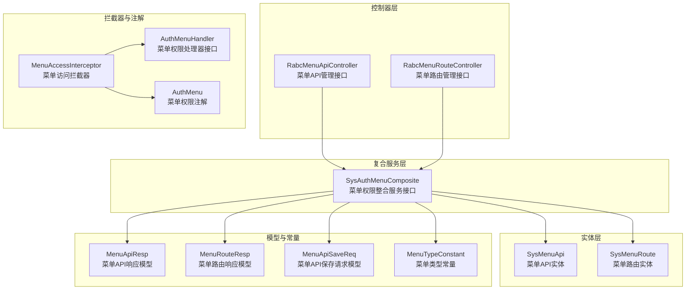
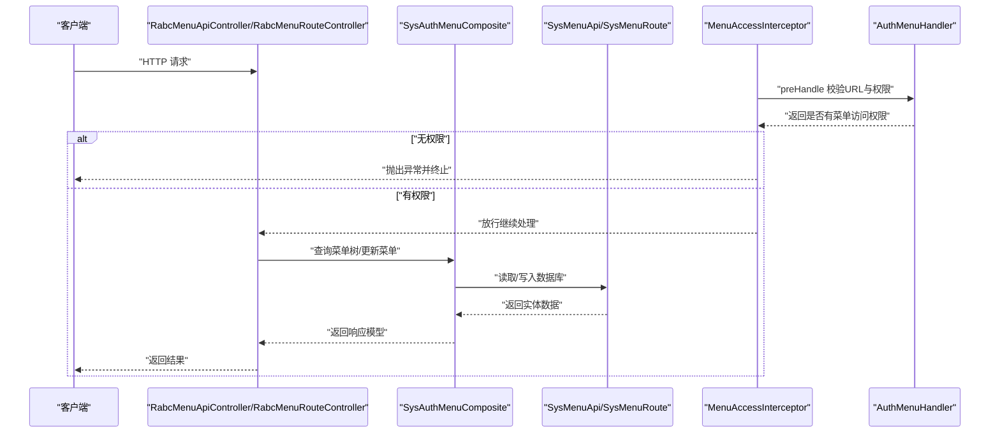
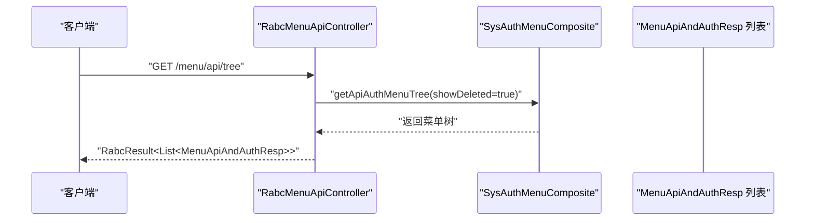
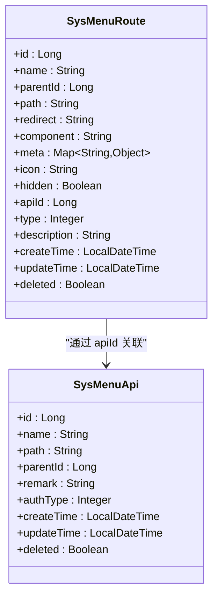
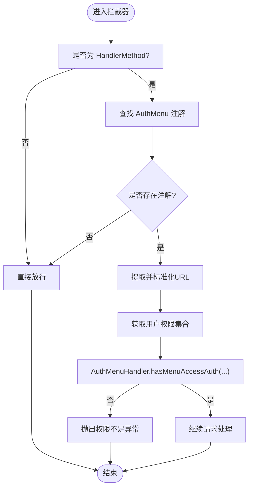
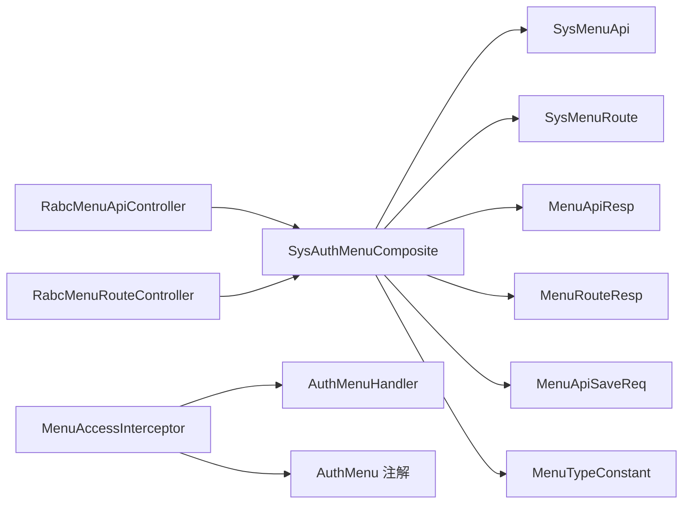

# 菜单权限

<cite>
**本文引用的文件**
- [RabcMenuApiController.java](file://qy-auth/auth-rbac/src/main/java/com/kewen/framework/auth/rabc/controller/RabcMenuApiController.java)
- [RabcMenuRouteController.java](file://qy-auth/auth-rbac/src/main/java/com/kewen/framework/auth/rabc/controller/RabcMenuRouteController.java)
- [SysMenuApi.java](file://qy-auth/auth-rbac/src/main/java/com/kewen/framework/auth/rabc/mp/entity/SysMenuApi.java)
- [SysMenuRoute.java](file://qy-auth/auth-rbac/src/main/java/com/kewen/framework/auth/rabc/mp/entity/SysMenuRoute.java)
- [MenuAccessInterceptor.java](file://qy-auth/auth-core/src/main/java/com/kewen/framework/auth/core/menu/MenuAccessInterceptor.java)
- [AuthMenu.java](file://qy-auth/auth-core/src/main/java/com/kewen/framework/auth/core/AuthMenu.java)
- [AuthMenuHandler.java](file://qy-auth/auth-core/src/main/java/com/kewen/framework/auth/core/menu/AuthMenuHandler.java)
- [SysAuthMenuComposite.java](file://qy-auth/auth-rbac/src/main/java/com/kewen/framework/auth/rabc/composite/SysAuthMenuComposite.java)
- [MenuTypeConstant.java](file://qy-auth/auth-rbac/src/main/java/com/kewen/framework/auth/rabc/model/MenuTypeConstant.java)
- [MenuApiResp.java](file://qy-auth/auth-rbac/src/main/java/com/kewen/framework/auth/rabc/model/resp/MenuApiResp.java)
- [MenuRouteResp.java](file://qy-auth/auth-rbac/src/main/java/com/kewen/framework/auth/rabc/model/resp/MenuRouteResp.java)
- [MenuApiSaveReq.java](file://qy-auth/auth-rbac/src/main/java/com/kewen/framework/auth/rabc/model/req/MenuApiSaveReq.java)
- [AuthUserContext.java](file://qy-auth/auth-core/src/main/java/com/kewen/framework/auth/core/AuthUserContext.java)
</cite>

## 目录
1. [简介](#简介)
2. [项目结构](#项目结构)
3. [核心组件](#核心组件)
4. [架构总览](#架构总览)
5. [详细组件分析](#详细组件分析)
6. [依赖分析](#依赖分析)
7. [性能考虑](#性能考虑)
8. [故障排查指南](#故障排查指南)
9. [结论](#结论)
10. [附录](#附录)

## 简介
本技术文档围绕菜单权限管理功能展开，系统性解析以下关键模块与流程：
- 控制器层：菜单API管理与路由权限控制的REST API设计
- 实体层：菜单API与菜单路由的数据模型与字段语义
- 拦截器层：菜单访问拦截器的权限验证、URL匹配与动态权限控制机制
- 常量与模型：菜单类型与权限标识的统一定义
- 使用示例：菜单配置、权限分配、动态路由生成等典型场景
- 最佳实践与安全配置：权限设计原则、安全加固与性能优化建议

## 项目结构
菜单权限相关代码主要分布在认证与RBAC模块中，采用“控制器-服务/复合-实体-模型-拦截器”的分层组织方式，确保职责清晰、可扩展性强。

图表来源
- [RabcMenuApiController.java:22-46](file://qy-auth/auth-rbac/src/main/java/com/kewen/framework/auth/rabc/controller/RabcMenuApiController.java#L22-L46)
- [RabcMenuRouteController.java:14-33](file://qy-auth/auth-rbac/src/main/java/com/kewen/framework/auth/rabc/controller/RabcMenuRouteController.java#L14-L33)
- [SysAuthMenuComposite.java:18-64](file://qy-auth/auth-rbac/src/main/java/com/kewen/framework/auth/rabc/composite/SysAuthMenuComposite.java#L18-L64)
- [SysMenuApi.java:25-95](file://qy-auth/auth-rbac/src/main/java/com/kewen/framework/auth/rabc/mp/entity/SysMenuApi.java#L25-L95)
- [SysMenuRoute.java:25-130](file://qy-auth/auth-rbac/src/main/java/com/kewen/framework/auth/rabc/mp/entity/SysMenuRoute.java#L25-L130)
- [MenuApiResp.java:19-30](file://qy-auth/auth-rbac/src/main/java/com/kewen/framework/auth/rabc/model/resp/MenuApiResp.java#L19-L30)
- [MenuRouteResp.java:18-29](file://qy-auth/auth-rbac/src/main/java/com/kewen/framework/auth/rabc/model/resp/MenuRouteResp.java#L18-L29)
- [MenuApiSaveReq.java:13-18](file://qy-auth/auth-rbac/src/main/java/com/kewen/framework/auth/rabc/model/req/MenuApiSaveReq.java#L13-L18)
- [MenuTypeConstant.java:8-32](file://qy-auth/auth-rbac/src/main/java/com/kewen/framework/auth/rabc/model/MenuTypeConstant.java#L8-L32)
- [MenuAccessInterceptor.java:23-72](file://qy-auth/auth-core/src/main/java/com/kewen/framework/auth/core/menu/MenuAccessInterceptor.java#L23-L72)
- [AuthMenu.java:10-21](file://qy-auth/auth-core/src/main/java/com/kewen/framework/auth/core/AuthMenu.java#L10-L21)
- [AuthMenuHandler.java:16-36](file://qy-auth/auth-core/src/main/java/com/kewen/framework/auth/core/menu/AuthMenuHandler.java#L16-L36)

章节来源
- [RabcMenuApiController.java:22-46](file://qy-auth/auth-rbac/src/main/java/com/kewen/framework/auth/rabc/controller/RabcMenuApiController.java#L22-L46)
- [RabcMenuRouteController.java:14-33](file://qy-auth/auth-rbac/src/main/java/com/kewen/framework/auth/rabc/controller/RabcMenuRouteController.java#L14-L33)
- [SysAuthMenuComposite.java:18-64](file://qy-auth/auth-rbac/src/main/java/com/kewen/framework/auth/rabc/composite/SysAuthMenuComposite.java#L18-L64)

## 核心组件
本节聚焦控制器、实体、拦截器与模型的关键职责与交互关系，帮助读者快速把握菜单权限管理的全貌。

- 控制器
  - RabcMenuApiController：提供菜单API树形结构查询与菜单权限更新能力，支持按权限类型与授权对象进行校验与更新。
  - RabcMenuRouteController：提供菜单路由树形结构查询能力，用于后台管理端展示与维护。

- 实体
  - SysMenuApi：描述后端API菜单节点，包含名称、路径、父级、权限类型、创建/更新时间与逻辑删除标记等字段。
  - SysMenuRoute：描述前端路由菜单节点，包含名称、父级、路径、重定向、组件、元信息、图标、是否隐藏、关联API ID、类型与描述等字段。

- 模型与常量
  - MenuApiResp/MenuRouteResp：对实体进行树形封装，便于前端渲染与层级展示。
  - MenuApiSaveReq：菜单API保存请求，扩展授权对象信息。
  - MenuTypeConstant：统一定义菜单类型（菜单/按钮）与权限类型（自身/父级）常量。

- 拦截器与注解
  - MenuAccessInterceptor：基于URL匹配与用户权限集合进行菜单访问校验，未标注AuthMenu时跳过校验。
  - AuthMenu：声明式权限注解，作用于方法或类，开启拦截器校验。
  - AuthMenuHandler：菜单权限处理器接口，定义hasMenuAccessAuth方法，支持Collection与IAuthObject两种签名。

章节来源
- [RabcMenuApiController.java:22-46](file://qy-auth/auth-rbac/src/main/java/com/kewen/framework/auth/rabc/controller/RabcMenuApiController.java#L22-L46)
- [RabcMenuRouteController.java:14-33](file://qy-auth/auth-rbac/src/main/java/com/kewen/framework/auth/rabc/controller/RabcMenuRouteController.java#L14-L33)
- [SysMenuApi.java:25-95](file://qy-auth/auth-rbac/src/main/java/com/kewen/framework/auth/rabc/mp/entity/SysMenuApi.java#L25-L95)
- [SysMenuRoute.java:25-130](file://qy-auth/auth-rbac/src/main/java/com/kewen/framework/auth/rabc/mp/entity/SysMenuRoute.java#L25-L130)
- [MenuApiResp.java:19-30](file://qy-auth/auth-rbac/src/main/java/com/kewen/framework/auth/rabc/model/resp/MenuApiResp.java#L19-L30)
- [MenuRouteResp.java:18-29](file://qy-auth/auth-rbac/src/main/java/com/kewen/framework/auth/rabc/model/resp/MenuRouteResp.java#L18-L29)
- [MenuApiSaveReq.java:13-18](file://qy-auth/auth-rbac/src/main/java/com/kewen/framework/auth/rabc/model/req/MenuApiSaveReq.java#L13-L18)
- [MenuTypeConstant.java:8-32](file://qy-auth/auth-rbac/src/main/java/com/kewen/framework/auth/rabc/model/MenuTypeConstant.java#L8-L32)
- [MenuAccessInterceptor.java:23-72](file://qy-auth/auth-core/src/main/java/com/kewen/framework/auth/core/menu/MenuAccessInterceptor.java#L23-L72)
- [AuthMenu.java:10-21](file://qy-auth/auth-core/src/main/java/com/kewen/framework/auth/core/AuthMenu.java#L10-L21)
- [AuthMenuHandler.java:16-36](file://qy-auth/auth-core/src/main/java/com/kewen/framework/auth/core/menu/AuthMenuHandler.java#L16-L36)

## 架构总览
下图展示了从HTTP请求到权限校验与菜单数据查询的整体流程，涵盖控制器、复合服务、实体与拦截器之间的协作。

图表来源
- [RabcMenuApiController.java:31-44](file://qy-auth/auth-rbac/src/main/java/com/kewen/framework/auth/rabc/controller/RabcMenuApiController.java#L31-L44)
- [RabcMenuRouteController.java:26-30](file://qy-auth/auth-rbac/src/main/java/com/kewen/framework/auth/rabc/controller/RabcMenuRouteController.java#L26-L30)
- [SysAuthMenuComposite.java:25-62](file://qy-auth/auth-rbac/src/main/java/com/kewen/framework/auth/rabc/composite/SysAuthMenuComposite.java#L25-L62)
- [MenuAccessInterceptor.java:28-61](file://qy-auth/auth-core/src/main/java/com/kewen/framework/auth/core/menu/MenuAccessInterceptor.java#L28-L61)
- [AuthMenuHandler.java:27-34](file://qy-auth/auth-core/src/main/java/com/kewen/framework/auth/core/menu/AuthMenuHandler.java#L27-L34)

## 详细组件分析

### 控制器：菜单API与路由管理
- RabcMenuApiController
  - 接口路径：/menu/api
  - 菜单树查询：返回带权限信息的菜单树，便于前端展示与授权联动。
  - 菜单更新：接收菜单API保存请求，执行权限类型校验（如仅自身权限需指定授权对象），随后调用复合服务完成更新。
- RabcMenuRouteController
  - 接口路径：/menu/route
  - 路由树查询：返回带权限过滤后的路由树，供后台管理端维护。

图表来源
- [RabcMenuApiController.java:31-35](file://qy-auth/auth-rbac/src/main/java/com/kewen/framework/auth/rabc/controller/RabcMenuApiController.java#L31-L35)
- [SysAuthMenuComposite.java:32-32](file://qy-auth/auth-rbac/src/main/java/com/kewen/framework/auth/rabc/composite/SysAuthMenuComposite.java#L32-L32)

章节来源
- [RabcMenuApiController.java:22-46](file://qy-auth/auth-rbac/src/main/java/com/kewen/framework/auth/rabc/controller/RabcMenuApiController.java#L22-L46)
- [RabcMenuRouteController.java:14-33](file://qy-auth/auth-rbac/src/main/java/com/kewen/framework/auth/rabc/controller/RabcMenuRouteController.java#L14-L33)

### 实体模型：SysMenuApi 与 SysMenuRoute
- SysMenuApi 字段要点
  - 主键、名称、路径、父级、备注、权限类型、创建/更新时间、逻辑删除标记
  - 权限类型用于决定权限继承策略（自身/父级）
- SysMenuRoute 字段要点
  - 主键、名称、父级、路径、重定向、组件、元信息、图标、是否隐藏、关联API ID、类型（菜单/按钮/外部链接）、描述、创建/更新时间、逻辑删除标记
  - 元信息以JSON形式存储，便于承载前端路由所需的动态属性

图表来源
- [SysMenuApi.java:25-95](file://qy-auth/auth-rbac/src/main/java/com/kewen/framework/auth/rabc/mp/entity/SysMenuApi.java#L25-L95)
- [SysMenuRoute.java:25-130](file://qy-auth/auth-rbac/src/main/java/com/kewen/framework/auth/rabc/mp/entity/SysMenuRoute.java#L25-L130)

章节来源
- [SysMenuApi.java:25-95](file://qy-auth/auth-rbac/src/main/java/com/kewen/framework/auth/rabc/mp/entity/SysMenuApi.java#L25-L95)
- [SysMenuRoute.java:25-130](file://qy-auth/auth-rbac/src/main/java/com/kewen/framework/auth/rabc/mp/entity/SysMenuRoute.java#L25-L130)

### 模型与常量：菜单类型与权限标识
- MenuTypeConstant
  - 菜单类型：菜单、按钮
  - 权限类型：自身权限、父级权限
- MenuApiResp/MenuRouteResp
  - 在实体基础上增加children字段，实现树形结构封装
- MenuApiSaveReq
  - 扩展授权对象信息，用于保存时的权限对象绑定

章节来源
- [MenuTypeConstant.java:8-32](file://qy-auth/auth-rbac/src/main/java/com/kewen/framework/auth/rabc/model/MenuTypeConstant.java#L8-L32)
- [MenuApiResp.java:19-30](file://qy-auth/auth-rbac/src/main/java/com/kewen/framework/auth/rabc/model/resp/MenuApiResp.java#L19-L30)
- [MenuRouteResp.java:18-29](file://qy-auth/auth-rbac/src/main/java/com/kewen/framework/auth/rabc/model/resp/MenuRouteResp.java#L18-L29)
- [MenuApiSaveReq.java:13-18](file://qy-auth/auth-rbac/src/main/java/com/kewen/framework/auth/rabc/model/req/MenuApiSaveReq.java#L13-L18)

### 拦截器：菜单访问拦截器
- 工作原理
  - 仅对HandlerMethod生效；若方法或类未标注AuthMenu，则直接放行
  - 提取请求URL（去除上下文路径），从用户上下文中获取权限集合
  - 通过AuthMenuHandler判断是否具备菜单访问权限，无权限则抛出异常
- URL匹配与动态权限控制
  - URL标准化处理，避免上下文路径影响匹配
  - 权限来源于当前登录用户上下文，支持动态权限变更即时生效

图表来源
- [MenuAccessInterceptor.java:28-61](file://qy-auth/auth-core/src/main/java/com/kewen/framework/auth/core/menu/MenuAccessInterceptor.java#L28-L61)
- [AuthMenuHandler.java:27-34](file://qy-auth/auth-core/src/main/java/com/kewen/framework/auth/core/menu/AuthMenuHandler.java#L27-L34)
- [AuthUserContext.java:18-23](file://qy-auth/auth-core/src/main/java/com/kewen/framework/auth/core/AuthUserContext.java#L18-L23)

章节来源
- [MenuAccessInterceptor.java:23-72](file://qy-auth/auth-core/src/main/java/com/kewen/framework/auth/core/menu/MenuAccessInterceptor.java#L23-L72)
- [AuthMenu.java:10-21](file://qy-auth/auth-core/src/main/java/com/kewen/framework/auth/core/AuthMenu.java#L10-L21)
- [AuthMenuHandler.java:16-36](file://qy-auth/auth-core/src/main/java/com/kewen/framework/auth/core/menu/AuthMenuHandler.java#L16-L36)
- [AuthUserContext.java:16-32](file://qy-auth/auth-core/src/main/java/com/kewen/framework/auth/core/AuthUserContext.java#L16-L32)

### 复合服务：SysAuthMenuComposite
- 职责
  - 统一提供菜单权限校验、菜单树查询、路由树查询、权限编辑与菜单更新等能力
  - 支持基于Collection<BaseAuth>与IAuthObject两种签名的权限校验
- 与控制器的关系
  - 控制器通过注入该接口完成业务编排，避免直接依赖具体实现

章节来源
- [SysAuthMenuComposite.java:18-64](file://qy-auth/auth-rbac/src/main/java/com/kewen/framework/auth/rabc/composite/SysAuthMenuComposite.java#L18-L64)

## 依赖分析
- 控制器依赖复合服务接口，实现业务解耦
- 拦截器依赖注解与处理器接口，形成声明式权限校验链
- 实体作为数据载体，被复合服务读写
- 模型与常量为上层展示与策略提供支撑

图表来源
- [RabcMenuApiController.java:27-28](file://qy-auth/auth-rbac/src/main/java/com/kewen/framework/auth/rabc/controller/RabcMenuApiController.java#L27-L28)
- [RabcMenuRouteController.java:19-20](file://qy-auth/auth-rbac/src/main/java/com/kewen/framework/auth/rabc/controller/RabcMenuRouteController.java#L19-L20)
- [MenuAccessInterceptor.java:25-26](file://qy-auth/auth-core/src/main/java/com/kewen/framework/auth/core/menu/MenuAccessInterceptor.java#L25-L26)
- [SysAuthMenuComposite.java:18-64](file://qy-auth/auth-rbac/src/main/java/com/kewen/framework/auth/rabc/composite/SysAuthMenuComposite.java#L18-L64)

章节来源
- [RabcMenuApiController.java:22-46](file://qy-auth/auth-rbac/src/main/java/com/kewen/framework/auth/rabc/controller/RabcMenuApiController.java#L22-L46)
- [RabcMenuRouteController.java:14-33](file://qy-auth/auth-rbac/src/main/java/com/kewen/framework/auth/rabc/controller/RabcMenuRouteController.java#L14-L33)
- [MenuAccessInterceptor.java:23-72](file://qy-auth/auth-core/src/main/java/com/kewen/framework/auth/core/menu/MenuAccessInterceptor.java#L23-L72)
- [SysAuthMenuComposite.java:18-64](file://qy-auth/auth-rbac/src/main/java/com/kewen/framework/auth/rabc/composite/SysAuthMenuComposite.java#L18-L64)

## 性能考虑
- 拦截器短路：未标注AuthMenu时直接放行，减少不必要的权限计算
- 权限集合缓存：在用户上下文中复用权限集合，避免重复查询
- 路由树构建：优先在服务层进行权限过滤与树形组装，降低前端负担
- 数据库索引：建议在SysMenuApi.path、SysMenuRoute.apiId等常用查询字段建立索引
- 分页与懒加载：在大量菜单场景下，结合分页与前端懒加载提升首屏性能

## 故障排查指南
- 无权限异常
  - 现象：拦截器抛出“没有API菜单访问权限”异常
  - 排查：确认请求URL是否正确、AuthMenu注解是否添加、用户上下文是否包含有效权限集合
- 更新失败
  - 现象：更新菜单时提示“这样谁都没有权限查看了”
  - 排查：当权限类型为“仅自身权限”时，必须提供授权对象；否则将拒绝更新
- 路由不显示
  - 现象：前端路由树中缺少某些节点
  - 排查：确认SysMenuRoute.hidden字段、apiId关联、类型字段与权限过滤逻辑

章节来源
- [MenuAccessInterceptor.java:57-59](file://qy-auth/auth-core/src/main/java/com/kewen/framework/auth/core/menu/MenuAccessInterceptor.java#L57-L59)
- [RabcMenuApiController.java:38-40](file://qy-auth/auth-rbac/src/main/java/com/kewen/framework/auth/rabc/controller/RabcMenuApiController.java#L38-L40)
- [AuthUserContext.java:18-23](file://qy-auth/auth-core/src/main/java/com/kewen/framework/auth/core/AuthUserContext.java#L18-L23)

## 结论
菜单权限管理通过“声明式注解 + 拦截器 + 复合服务 + 实体模型”的协同，实现了灵活、可扩展且易于维护的权限控制体系。配合统一的类型与权限常量、完善的响应模型与严格的权限校验，能够满足复杂业务场景下的菜单与路由权限需求。

## 附录
- 使用示例（步骤说明）
  - 菜单配置
    - 在SysMenuApi中新增或编辑API菜单节点，设置名称、路径、父级与权限类型
    - 在SysMenuRoute中新增或编辑路由节点，设置名称、路径、组件、元信息与类型，并关联API ID
  - 权限分配
    - 通过菜单API更新接口提交MenuApiSaveReq，选择权限类型与授权对象，完成权限绑定
  - 动态路由生成
    - 后台通过路由树查询接口获取树形结构，前端据此生成动态路由与菜单
- 最佳实践
  - 严格区分菜单与按钮权限类型，避免越权访问
  - 权限类型优先使用“自身权限”，必要时再启用“父级权限”
  - 对高频访问的菜单路径进行缓存与索引优化
  - 定期清理逻辑删除的菜单数据，保持数据整洁
- 安全配置
  - 确保拦截器在全局Web配置中注册，覆盖所有受保护路径
  - 对敏感接口强制添加AuthMenu注解，避免遗漏
  - 定期审计权限分配，遵循最小权限原则