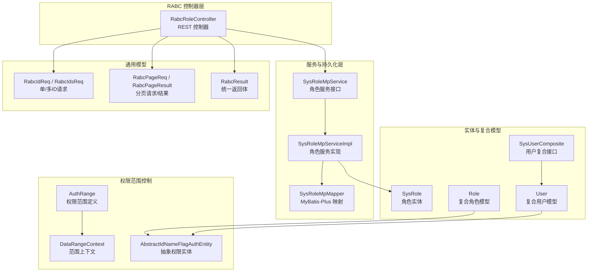
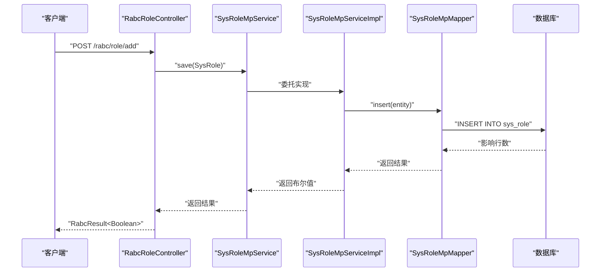
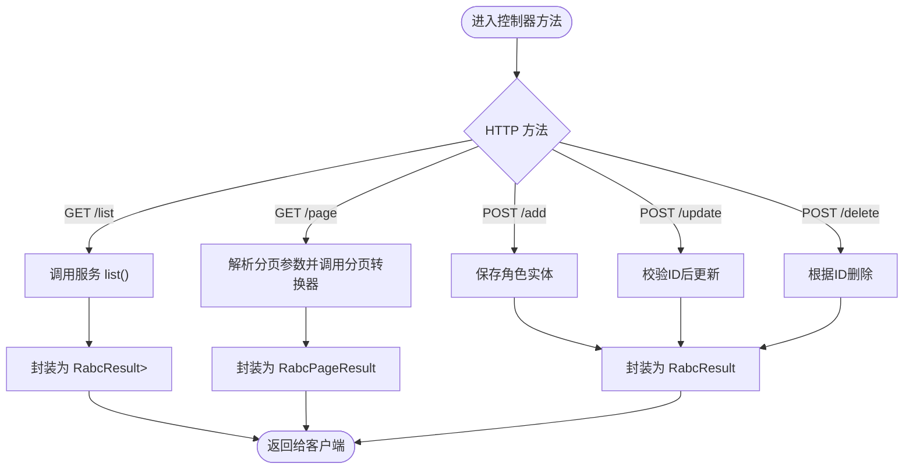
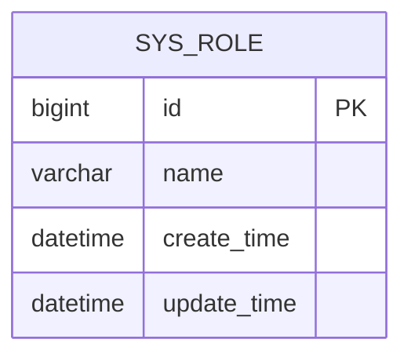
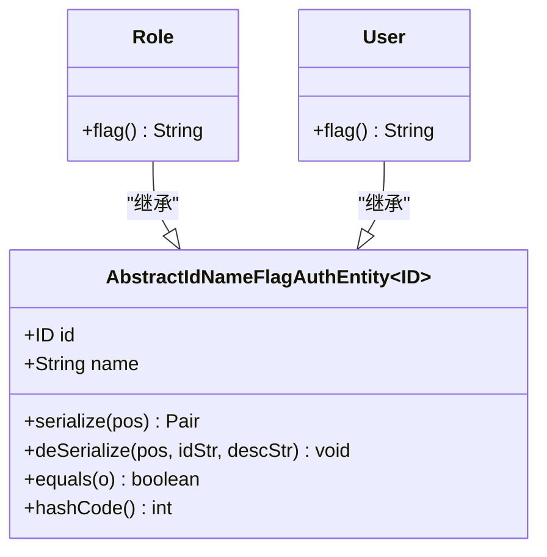
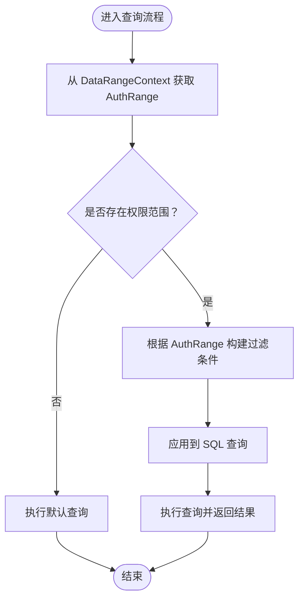
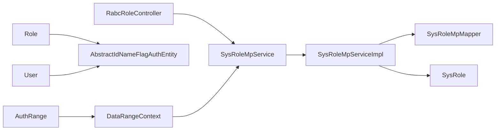

# 角色管理

<cite>
**本文引用的文件**
- [RabcRoleController.java](file://qy-auth/auth-rbac/src/main/java/com/kewen/framework/auth/rabc/controller/RabcRoleController.java)
- [SysRole.java](file://qy-auth/auth-rbac/src/main/java/com/kewen/framework/auth/rabc/mp/entity/SysRole.java)
- [SysRoleMpService.java](file://qy-auth/auth-rbac/src/main/java/com/kewen/framework/auth/rabc/mp/service/SysRoleMpService.java)
- [SysRoleMpServiceImpl.java](file://qy-auth/auth-rbac/src/main/java/com/kewen/framework/auth/rabc/mp/service/impl/SysRoleMpServiceImpl.java)
- [Role.java](file://qy-auth/auth-rbac/src/main/java/com/kewen/framework/auth/rabc/composite/model/Role.java)
- [User.java](file://qy-auth/auth-rbac/src/main/java/com/kewen/framework/auth/rabc/composite/model/User.java)
- [SysUserComposite.java](file://qy-auth/auth-rbac/src/main/java/com/kewen/framework/auth/rabc/composite/SysUserComposite.java)
- [RabcIdReq.java](file://qy-auth/auth-rbac/src/main/java/com/kewen/framework/auth/rabc/model/RabcIdReq.java)
- [RabcIdsReq.java](file://qy-auth/auth-rbac/src/main/java/com/kewen/framework/auth/rabc/model/RabcIdsReq.java)
- [RabcPageReq.java](file://qy-auth/auth-rbac/src/main/java/com/kewen/framework/auth/rabc/model/RabcPageReq.java)
- [RabcPageResult.java](file://qy-auth/auth-rbac/src/main/java/com/kewen/framework/auth/rabc/model/RabcPageResult.java)
- [RabcResult.java](file://qy-auth/auth-rbac/src/main/java/com/kewen/framework/auth/rabc/model/RabcResult.java)
- [AuthRange.java](file://qy-auth/auth-core/src/main/java/com/kewen/framework/auth/core/data/range/AuthRange.java)
- [DataRangeContext.java](file://qy-auth/auth-core/src/main/java/com/kewen/framework/auth/core/data/range/DataRangeContext.java)
- [AbstractIdNameFlagAuthEntity.java](file://qy-auth/auth-core/src/main/java/com/kewen/framework/auth/core/entity/AbstractIdNameFlagAuthEntity.java)
</cite>

## 目录
1. [简介](#简介)
2. [项目结构](#项目结构)
3. [核心组件](#核心组件)
4. [架构总览](#架构总览)
5. [详细组件分析](#详细组件分析)
6. [依赖分析](#依赖分析)
7. [性能考虑](#性能考虑)
8. [故障排查指南](#故障排查指南)
9. [结论](#结论)
10. [附录：API 使用示例与最佳实践](#附录api-使用示例与最佳实践)

## 简介
本文件围绕角色管理功能进行系统化技术文档编制，重点覆盖以下方面：
- RabcRoleController 控制器的 REST API 设计与参数规范（创建、修改、删除、查询）。
- SysRole 实体模型字段定义、角色分类与权限标识说明。
- Role 复合模型与用户关联关系、角色权限的继承与传递机制。
- 权限范围控制、数据权限配置与角色层级管理。
- 完整 API 使用示例（角色分配、权限授予、批量操作等）。
- 角色设计最佳实践、权限最小化原则与安全配置建议。

## 项目结构
角色管理相关代码主要位于 auth-rbac 模块中，采用按领域分层组织：
- controller 层：对外暴露 REST 接口，负责请求路由与菜单标注。
- mp.service / mp.mapper：基于 MyBatis-Plus 的服务与持久化层。
- composite.model 与 composite 接口：抽象复合身份模型与用户复合能力。
- model：通用请求/响应模型与分页封装。
- auth-core：权限范围、数据范围控制与抽象实体基类。

图表来源
- [RabcRoleController.java:1-63](file://qy-auth/auth-rbac/src/main/java/com/kewen/framework/auth/rabc/controller/RabcRoleController.java#L1-L63)
- [SysRoleMpService.java:1-22](file://qy-auth/auth-rbac/src/main/java/com/kewen/framework/auth/rabc/mp/service/SysRoleMpService.java#L1-L22)
- [SysRoleMpServiceImpl.java:1-22](file://qy-auth/auth-rbac/src/main/java/com/kewen/framework/auth/rabc/mp/service/impl/SysRoleMpServiceImpl.java#L1-L22)
- [SysRole.java:1-61](file://qy-auth/auth-rbac/src/main/java/com/kewen/framework/auth/rabc/mp/entity/SysRole.java#L1-L61)
- [Role.java:1-34](file://qy-auth/auth-rbac/src/main/java/com/kewen/framework/auth/rabc/composite/model/Role.java#L1-L34)
- [User.java:1-50](file://qy-auth/auth-rbac/src/main/java/com/kewen/framework/auth/rabc/composite/model/User.java#L1-L50)
- [SysUserComposite.java:1-18](file://qy-auth/auth-rbac/src/main/java/com/kewen/framework/auth/rabc/composite/SysUserComposite.java#L1-L18)
- [RabcIdReq.java:1-12](file://qy-auth/auth-rbac/src/main/java/com/kewen/framework/auth/rabc/model/RabcIdReq.java#L1-L12)
- [RabcIdsReq.java:1-13](file://qy-auth/auth-rbac/src/main/java/com/kewen/framework/auth/rabc/model/RabcIdsReq.java#L1-L13)
- [RabcPageReq.java:1-27](file://qy-auth/auth-rbac/src/main/java/com/kewen/framework/auth/rabc/model/RabcPageReq.java#L1-L27)
- [RabcPageResult.java:1-24](file://qy-auth/auth-rbac/src/main/java/com/kewen/framework/auth/rabc/model/RabcPageResult.java#L1-L24)
- [RabcResult.java:1-39](file://qy-auth/auth-rbac/src/main/java/com/kewen/framework/auth/rabc/model/RabcResult.java#L1-L39)
- [AuthRange.java:1-49](file://qy-auth/auth-core/src/main/java/com/kewen/framework/auth/core/data/range/AuthRange.java#L1-L49)
- [DataRangeContext.java:1-24](file://qy-auth/auth-core/src/main/java/com/kewen/framework/auth/core/data/range/DataRangeContext.java#L1-L24)
- [AbstractIdNameFlagAuthEntity.java:1-68](file://qy-auth/auth-core/src/main/java/com/kewen/framework/auth/core/entity/AbstractIdNameFlagAuthEntity.java#L1-L68)

章节来源
- [RabcRoleController.java:1-63](file://qy-auth/auth-rbac/src/main/java/com/kewen/framework/auth/rabc/controller/RabcRoleController.java#L1-L63)
- [SysRole.java:1-61](file://qy-auth/auth-rbac/src/main/java/com/kewen/framework/auth/rabc/mp/entity/SysRole.java#L1-L61)
- [SysRoleMpService.java:1-22](file://qy-auth/auth-rbac/src/main/java/com/kewen/framework/auth/rabc/mp/service/SysRoleMpService.java#L1-L22)
- [SysRoleMpServiceImpl.java:1-22](file://qy-auth/auth-rbac/src/main/java/com/kewen/framework/auth/rabc/mp/service/impl/SysRoleMpServiceImpl.java#L1-L22)
- [Role.java:1-34](file://qy-auth/auth-rbac/src/main/java/com/kewen/framework/auth/rabc/composite/model/Role.java#L1-L34)
- [User.java:1-50](file://qy-auth/auth-rbac/src/main/java/com/kewen/framework/auth/rabc/composite/model/User.java#L1-L50)
- [SysUserComposite.java:1-18](file://qy-auth/auth-rbac/src/main/java/com/kewen/framework/auth/rabc/composite/SysUserComposite.java#L1-L18)
- [RabcIdReq.java:1-12](file://qy-auth/auth-rbac/src/main/java/com/kewen/framework/auth/rabc/model/RabcIdReq.java#L1-L12)
- [RabcIdsReq.java:1-13](file://qy-auth/auth-rbac/src/main/java/com/kewen/framework/auth/rabc/model/RabcIdsReq.java#L1-L13)
- [RabcPageReq.java:1-27](file://qy-auth/auth-rbac/src/main/java/com/kewen/framework/auth/rabc/model/RabcPageReq.java#L1-L27)
- [RabcPageResult.java:1-24](file://qy-auth/auth-rbac/src/main/java/com/kewen/framework/auth/rabc/model/RabcPageResult.java#L1-L24)
- [RabcResult.java:1-39](file://qy-auth/auth-rbac/src/main/java/com/kewen/framework/auth/rabc/model/RabcResult.java#L1-L39)
- [AuthRange.java:1-49](file://qy-auth/auth-core/src/main/java/com/kewen/framework/auth/core/data/range/AuthRange.java#L1-L49)
- [DataRangeContext.java:1-24](file://qy-auth/auth-core/src/main/java/com/kewen/framework/auth/core/data/range/DataRangeContext.java#L1-L24)
- [AbstractIdNameFlagAuthEntity.java:1-68](file://qy-auth/auth-core/src/main/java/com/kewen/framework/auth/core/entity/AbstractIdNameFlagAuthEntity.java#L1-L68)

## 核心组件
- RabcRoleController：提供角色的列表、分页、新增、更新、删除等 REST 接口，并通过菜单注解标注接口用途。
- SysRole：角色实体，包含主键、名称、创建/更新时间等字段。
- SysRoleMpService/SysRoleMpServiceImpl：角色服务接口与实现，基于 MyBatis-Plus 提供 CRUD 能力。
- Role/User：复合模型，作为抽象权限实体的子类，提供统一的标识前缀与序列化/反序列化能力。
- SysUserComposite：用户复合能力接口，提供按用户名加载用户与修改密码等能力。
- RabcIdReq/RabcIdsReq/RabcPageReq/RabcPageResult/RabcResult：统一的请求/响应模型与分页封装。
- AuthRange/DataRangeContext：权限范围与数据范围控制的上下文，用于在查询时注入权限过滤条件。
- AbstractIdNameFlagAuthEntity：抽象权限实体基类，提供 ID+Name 的序列化/反序列化与相等性判断。

章节来源
- [RabcRoleController.java:21-62](file://qy-auth/auth-rbac/src/main/java/com/kewen/framework/auth/rabc/controller/RabcRoleController.java#L21-L62)
- [SysRole.java:22-60](file://qy-auth/auth-rbac/src/main/java/com/kewen/framework/auth/rabc/mp/entity/SysRole.java#L22-L60)
- [SysRoleMpService.java:18-21](file://qy-auth/auth-rbac/src/main/java/com/kewen/framework/auth/rabc/mp/service/SysRoleMpService.java#L18-L21)
- [SysRoleMpServiceImpl.java:18-21](file://qy-auth/auth-rbac/src/main/java/com/kewen/framework/auth/rabc/mp/service/impl/SysRoleMpServiceImpl.java#L18-L21)
- [Role.java:12-33](file://qy-auth/auth-rbac/src/main/java/com/kewen/framework/auth/rabc/composite/model/Role.java#L12-L33)
- [User.java:10-49](file://qy-auth/auth-rbac/src/main/java/com/kewen/framework/auth/rabc/composite/model/User.java#L10-L49)
- [SysUserComposite.java:5-17](file://qy-auth/auth-rbac/src/main/java/com/kewen/framework/auth/rabc/composite/SysUserComposite.java#L5-L17)
- [RabcIdReq.java:7-11](file://qy-auth/auth-rbac/src/main/java/com/kewen/framework/auth/rabc/model/RabcIdReq.java#L7-L11)
- [RabcIdsReq.java:8-12](file://qy-auth/auth-rbac/src/main/java/com/kewen/framework/auth/rabc/model/RabcIdsReq.java#L8-L12)
- [RabcPageReq.java:7-26](file://qy-auth/auth-rbac/src/main/java/com/kewen/framework/auth/rabc/model/RabcPageReq.java#L7-L26)
- [RabcPageResult.java:7-23](file://qy-auth/auth-rbac/src/main/java/com/kewen/framework/auth/rabc/model/RabcPageResult.java#L7-L23)
- [RabcResult.java:9-38](file://qy-auth/auth-rbac/src/main/java/com/kewen/framework/auth/rabc/model/RabcResult.java#L9-L38)
- [AuthRange.java:14-48](file://qy-auth/auth-core/src/main/java/com/kewen/framework/auth/core/data/range/AuthRange.java#L14-L48)
- [DataRangeContext.java:9-23](file://qy-auth/auth-core/src/main/java/com/kewen/framework/auth/core/data/range/DataRangeContext.java#L9-L23)
- [AbstractIdNameFlagAuthEntity.java:19-67](file://qy-auth/auth-core/src/main/java/com/kewen/framework/auth/core/entity/AbstractIdNameFlagAuthEntity.java#L19-L67)

## 架构总览
角色管理采用典型的分层架构：
- 控制器层负责接收请求、参数校验与返回统一响应体。
- 服务层封装业务逻辑，调用持久化层完成数据读写。
- 实体层映射数据库表结构，提供序列化/反序列化能力。
- 复合模型与用户复合接口抽象角色与用户在权限系统中的表示。
- 权限范围控制模块在查询阶段注入数据权限过滤条件，确保最小可见性。

图表来源
- [RabcRoleController.java:41-46](file://qy-auth/auth-rbac/src/main/java/com/kewen/framework/auth/rabc/controller/RabcRoleController.java#L41-L46)
- [SysRoleMpService.java:1-22](file://qy-auth/auth-rbac/src/main/java/com/kewen/framework/auth/rabc/mp/service/SysRoleMpService.java#L1-L22)
- [SysRoleMpServiceImpl.java:18-21](file://qy-auth/auth-rbac/src/main/java/com/kewen/framework/auth/rabc/mp/service/impl/SysRoleMpServiceImpl.java#L18-L21)

## 详细组件分析

### RabcRoleController 控制器
- 路由前缀：/rabc/role
- 接口职责：
  - GET /list：获取全部角色列表。
  - GET /page：分页查询角色，支持页码、页面大小与模糊搜索关键字。
  - POST /add：新增角色。
  - POST /update：更新角色，要求提供角色ID。
  - POST /delete：删除角色，接收单个ID。
- 参数规范：
  - 分页请求：page、size、search（可选）。
  - 删除请求：id（非空）。
  - 更新请求：SysRole 对象，必须包含 id 字段。
- 返回体：统一使用 RabcResult 包裹业务数据或错误信息。

图表来源
- [RabcRoleController.java:29-61](file://qy-auth/auth-rbac/src/main/java/com/kewen/framework/auth/rabc/controller/RabcRoleController.java#L29-L61)
- [RabcPageReq.java:7-26](file://qy-auth/auth-rbac/src/main/java/com/kewen/framework/auth/rabc/model/RabcPageReq.java#L7-L26)
- [RabcResult.java:9-38](file://qy-auth/auth-rbac/src/main/java/com/kewen/framework/auth/rabc/model/RabcResult.java#L9-L38)
- [RabcPageResult.java:7-23](file://qy-auth/auth-rbac/src/main/java/com/kewen/framework/auth/rabc/model/RabcPageResult.java#L7-L23)

章节来源
- [RabcRoleController.java:21-62](file://qy-auth/auth-rbac/src/main/java/com/kewen/framework/auth/rabc/controller/RabcRoleController.java#L21-L62)
- [RabcPageReq.java:7-26](file://qy-auth/auth-rbac/src/main/java/com/kewen/framework/auth/rabc/model/RabcPageReq.java#L7-L26)
- [RabcResult.java:9-38](file://qy-auth/auth-rbac/src/main/java/com/kewen/framework/auth/rabc/model/RabcResult.java#L9-L38)
- [RabcPageResult.java:7-23](file://qy-auth/auth-rbac/src/main/java/com/kewen/framework/auth/rabc/model/RabcPageResult.java#L7-L23)

### SysRole 实体模型
- 表映射：sys_role
- 关键字段：
  - id：主键（自增）
  - name：角色名称
  - create_time：创建时间
  - update_time：更新时间
- 用途：作为角色的基础数据载体，配合服务层进行持久化操作。

图表来源
- [SysRole.java:25-60](file://qy-auth/auth-rbac/src/main/java/com/kewen/framework/auth/rabc/mp/entity/SysRole.java#L25-L60)

章节来源
- [SysRole.java:22-60](file://qy-auth/auth-rbac/src/main/java/com/kewen/framework/auth/rabc/mp/entity/SysRole.java#L22-L60)

### Role 与 User 复合模型
- Role：继承抽象权限实体，提供固定标识前缀“ROLE”，用于在权限系统中识别角色。
- User：继承抽象权限实体，提供固定标识前缀“USER”，用于在权限系统中识别用户。
- 抽象基类：AbstractIdNameFlagAuthEntity 提供 ID 与名称的序列化/反序列化、相等性与哈希计算。

图表来源
- [AbstractIdNameFlagAuthEntity.java:19-67](file://qy-auth/auth-core/src/main/java/com/kewen/framework/auth/core/entity/AbstractIdNameFlagAuthEntity.java#L19-L67)
- [Role.java:12-33](file://qy-auth/auth-rbac/src/main/java/com/kewen/framework/auth/rabc/composite/model/Role.java#L12-L33)
- [User.java:10-49](file://qy-auth/auth-rbac/src/main/java/com/kewen/framework/auth/rabc/composite/model/User.java#L10-L49)

章节来源
- [Role.java:12-33](file://qy-auth/auth-rbac/src/main/java/com/kewen/framework/auth/rabc/composite/model/Role.java#L12-L33)
- [User.java:10-49](file://qy-auth/auth-rbac/src/main/java/com/kewen/framework/auth/rabc/composite/model/User.java#L10-L49)
- [AbstractIdNameFlagAuthEntity.java:19-67](file://qy-auth/auth-core/src/main/java/com/kewen/framework/auth/core/entity/AbstractIdNameFlagAuthEntity.java#L19-L67)

### 权限范围控制与数据权限
- AuthRange：定义权限范围查询的关键要素，包括业务功能标识、操作类型、表/别名、数据主键列、权限集合与匹配方式。
- DataRangeContext：线程本地存储的权限范围上下文，用于在查询过程中注入数据权限过滤条件。
- 结合控制器与服务层：在分页查询时，可通过上下文注入权限范围，实现最小化数据可见性。

图表来源
- [AuthRange.java:14-48](file://qy-auth/auth-core/src/main/java/com/kewen/framework/auth/core/data/range/AuthRange.java#L14-L48)
- [DataRangeContext.java:9-23](file://qy-auth/auth-core/src/main/java/com/kewen/framework/auth/core/data/range/DataRangeContext.java#L9-L23)

章节来源
- [AuthRange.java:14-48](file://qy-auth/auth-core/src/main/java/com/kewen/framework/auth/core/data/range/AuthRange.java#L14-L48)
- [DataRangeContext.java:9-23](file://qy-auth/auth-core/src/main/java/com/kewen/framework/auth/core/data/range/DataRangeContext.java#L9-L23)

## 依赖分析
- 控制器依赖服务接口，服务实现依赖 MyBatis-Plus Mapper 与实体。
- 复合模型依赖抽象权限实体基类，提供统一的标识与序列化能力。
- 权限范围控制模块独立于控制器与服务，通过上下文在查询阶段生效。

图表来源
- [RabcRoleController.java:26-27](file://qy-auth/auth-rbac/src/main/java/com/kewen/framework/auth/rabc/controller/RabcRoleController.java#L26-L27)
- [SysRoleMpService.java:18-21](file://qy-auth/auth-rbac/src/main/java/com/kewen/framework/auth/rabc/mp/service/SysRoleMpService.java#L18-L21)
- [SysRoleMpServiceImpl.java:18-21](file://qy-auth/auth-rbac/src/main/java/com/kewen/framework/auth/rabc/mp/service/impl/SysRoleMpServiceImpl.java#L18-L21)
- [SysRole.java:25-60](file://qy-auth/auth-rbac/src/main/java/com/kewen/framework/auth/rabc/mp/entity/SysRole.java#L25-L60)
- [Role.java:12-33](file://qy-auth/auth-rbac/src/main/java/com/kewen/framework/auth/rabc/composite/model/Role.java#L12-L33)
- [User.java:10-49](file://qy-auth/auth-rbac/src/main/java/com/kewen/framework/auth/rabc/composite/model/User.java#L10-L49)
- [AbstractIdNameFlagAuthEntity.java:19-67](file://qy-auth/auth-core/src/main/java/com/kewen/framework/auth/core/entity/AbstractIdNameFlagAuthEntity.java#L19-L67)
- [AuthRange.java:14-48](file://qy-auth/auth-core/src/main/java/com/kewen/framework/auth/core/data/range/AuthRange.java#L14-L48)
- [DataRangeContext.java:9-23](file://qy-auth/auth-core/src/main/java/com/kewen/framework/auth/core/data/range/DataRangeContext.java#L9-L23)

章节来源
- [RabcRoleController.java:26-27](file://qy-auth/auth-rbac/src/main/java/com/kewen/framework/auth/rabc/controller/RabcRoleController.java#L26-L27)
- [SysRoleMpService.java:18-21](file://qy-auth/auth-rbac/src/main/java/com/kewen/framework/auth/rabc/mp/service/SysRoleMpService.java#L18-L21)
- [SysRoleMpServiceImpl.java:18-21](file://qy-auth/auth-rbac/src/main/java/com/kewen/framework/auth/rabc/mp/service/impl/SysRoleMpServiceImpl.java#L18-L21)
- [Role.java:12-33](file://qy-auth/auth-rbac/src/main/java/com/kewen/framework/auth/rabc/composite/model/Role.java#L12-L33)
- [User.java:10-49](file://qy-auth/auth-rbac/src/main/java/com/kewen/framework/auth/rabc/composite/model/User.java#L10-L49)
- [AuthRange.java:14-48](file://qy-auth/auth-core/src/main/java/com/kewen/framework/auth/core/data/range/AuthRange.java#L14-L48)
- [DataRangeContext.java:9-23](file://qy-auth/auth-core/src/main/java/com/kewen/framework/auth/core/data/range/DataRangeContext.java#L9-L23)

## 性能考虑
- 分页查询：合理设置 page 与 size，避免一次性拉取大量数据；结合模糊搜索关键字时注意索引优化。
- 数据权限注入：在查询阶段通过上下文注入过滤条件，避免在应用层二次过滤导致的性能损耗。
- 实体序列化：复合模型的序列化/反序列化应避免频繁转换，尽量在边界层进行缓存或复用。
- 批量操作：对于批量删除等操作，建议使用批量提交与事务控制，减少数据库往返次数。

## 故障排查指南
- 参数校验失败：检查请求体是否符合 RabcIdReq、RabcIdsReq、RabcPageReq 的字段要求。
- 更新失败：确认更新请求中包含有效的角色ID；控制器对空ID会抛出运行时异常。
- 权限范围不生效：确认 DataRangeContext 中已正确设置 AuthRange，并在查询阶段被服务层读取。
- 统一返回体：所有接口均使用 RabcResult 包裹，若出现异常，检查 message 与 code 字段定位问题。

章节来源
- [RabcRoleController.java:47-54](file://qy-auth/auth-rbac/src/main/java/com/kewen/framework/auth/rabc/controller/RabcRoleController.java#L47-L54)
- [RabcIdReq.java:7-11](file://qy-auth/auth-rbac/src/main/java/com/kewen/framework/auth/rabc/model/RabcIdReq.java#L7-L11)
- [RabcIdsReq.java:8-12](file://qy-auth/auth-rbac/src/main/java/com/kewen/framework/auth/rabc/model/RabcIdsReq.java#L8-L12)
- [RabcPageReq.java:7-26](file://qy-auth/auth-rbac/src/main/java/com/kewen/framework/auth/rabc/model/RabcPageReq.java#L7-L26)
- [RabcResult.java:9-38](file://qy-auth/auth-rbac/src/main/java/com/kewen/framework/auth/rabc/model/RabcResult.java#L9-L38)
- [DataRangeContext.java:9-23](file://qy-auth/auth-core/src/main/java/com/kewen/framework/auth/core/data/range/DataRangeContext.java#L9-L23)

## 结论
角色管理模块以清晰的分层架构实现了角色的全生命周期管理，并通过复合模型与权限范围控制提供了灵活且安全的权限表达与数据可见性保障。结合统一的请求/响应模型与服务层封装，能够满足大多数企业级权限管理需求。

## 附录：API 使用示例与最佳实践

### API 使用示例
- 获取角色列表
  - 请求：GET /rabc/role/list
  - 响应：RabcResult<List<SysRole>>
- 分页查询角色
  - 请求：GET /rabc/role/page?page=1&size=10&search=管理员
  - 响应：RabcResult<RabcPageResult<SysRole>>
- 新增角色
  - 请求：POST /rabc/role/add
  - 请求体：SysRole（包含 name 等必要字段）
  - 响应：RabcResult<Boolean>
- 更新角色
  - 请求：POST /rabc/role/update
  - 请求体：SysRole（必须包含 id）
  - 响应：RabcResult<Boolean>
- 删除角色
  - 请求：POST /rabc/role/delete
  - 请求体：RabcIdReq（包含 id）
  - 响应：RabcResult<Boolean>

章节来源
- [RabcRoleController.java:29-61](file://qy-auth/auth-rbac/src/main/java/com/kewen/framework/auth/rabc/controller/RabcRoleController.java#L29-L61)
- [RabcPageReq.java:7-26](file://qy-auth/auth-rbac/src/main/java/com/kewen/framework/auth/rabc/model/RabcPageReq.java#L7-L26)
- [RabcIdReq.java:7-11](file://qy-auth/auth-rbac/src/main/java/com/kewen/framework/auth/rabc/model/RabcIdReq.java#L7-L11)
- [RabcResult.java:9-38](file://qy-auth/auth-rbac/src/main/java/com/kewen/framework/auth/rabc/model/RabcResult.java#L9-L38)

### 最佳实践与安全建议
- 权限最小化原则：仅授予完成任务所需的最小权限集合，避免过度授权。
- 角色层级管理：通过复合模型的标识前缀与序列化机制，明确区分角色与用户，便于构建层级化的权限树。
- 数据权限配置：在查询阶段通过 AuthRange 与 DataRangeContext 注入过滤条件，确保不同用户只能看到其权限范围内的数据。
- 审计与日志：对角色的增删改操作进行审计记录，便于追踪与回溯。
- 输入校验：严格校验请求参数，防止空ID、非法分页参数等导致的异常。
- 批量操作：对批量删除等高风险操作增加二次确认与事务保护，降低误操作风险。