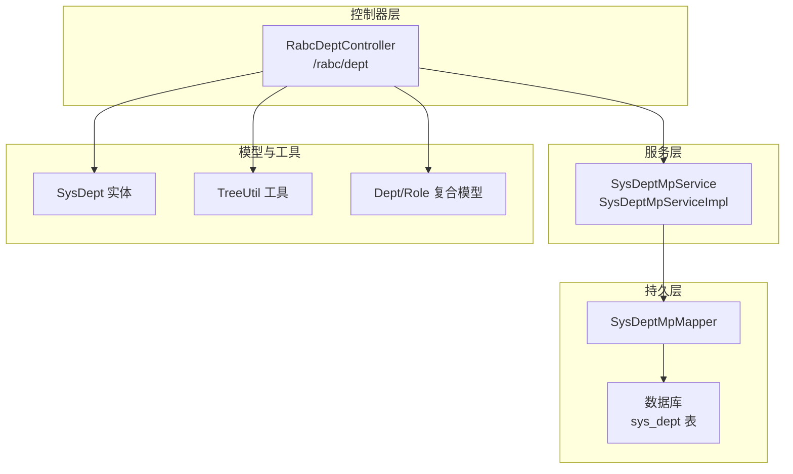
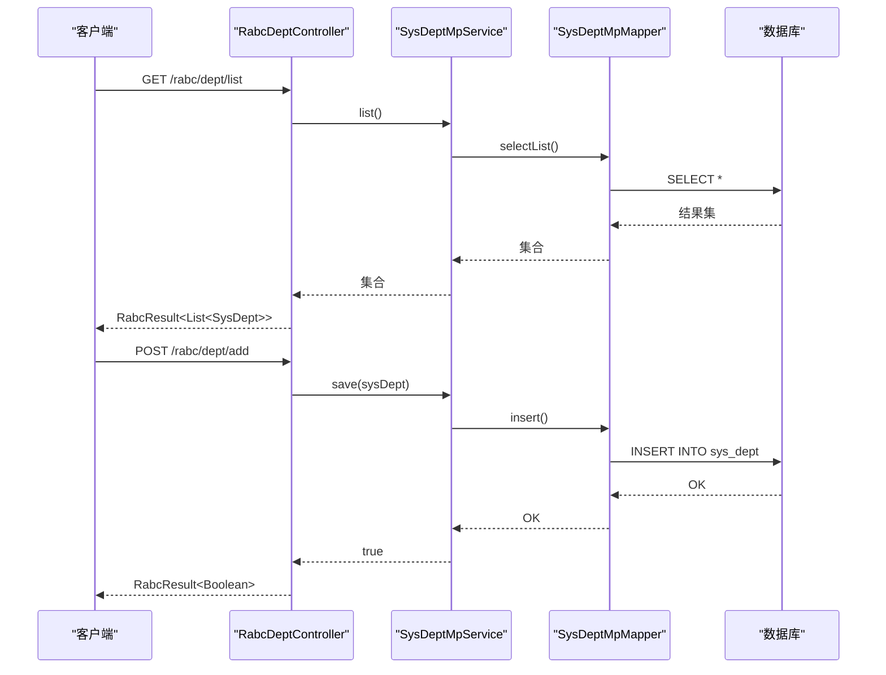
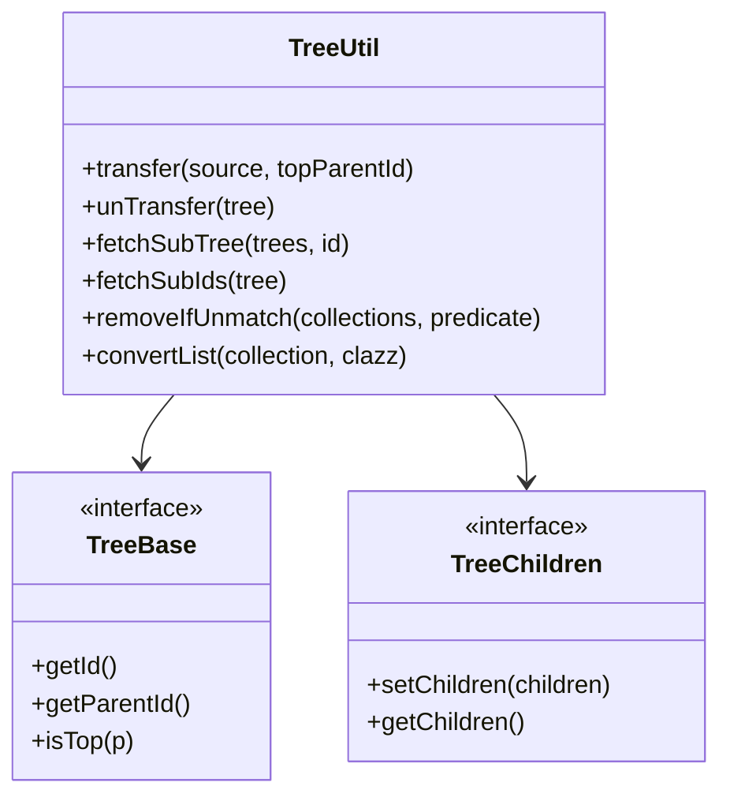
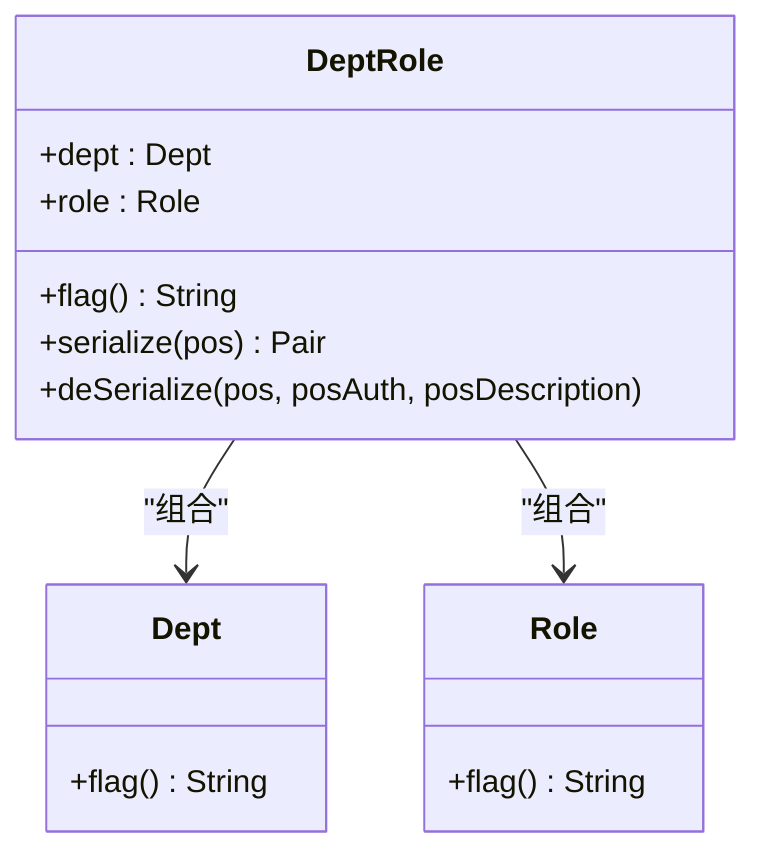
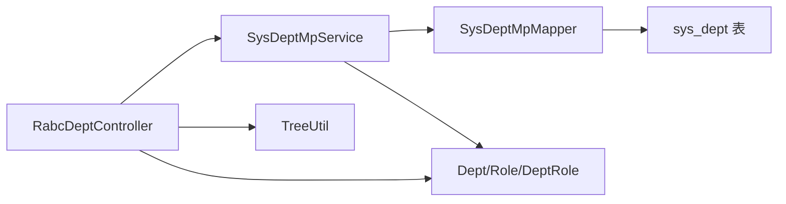

# 部门管理

<cite>
**本文档引用的文件**
- [RabcDeptController.java](file://qy-auth/auth-rbac/src/main/java/com/kewen/framework/auth/rabc/controller/RabcDeptController.java)
- [SysDept.java](file://qy-auth/auth-rbac/src/main/java/com/kewen/framework/auth/rabc/mp/entity/SysDept.java)
- [TreeUtil.java](file://qy-auth/auth-rbac/src/main/java/com/kewen/framework/auth/rabc/utils/TreeUtil.java)
- [SysDeptMpMapper.java](file://qy-auth/auth-rbac/src/main/java/com/kewen/framework/auth/rabc/mp/mapper/SysDeptMpMapper.java)
- [SysDeptMpServiceImpl.java](file://qy-auth/auth-rbac/src/main/java/com/kewen/framework/auth/rabc/mp/service/impl/SysDeptMpServiceImpl.java)
- [Dept.java](file://qy-auth/auth-rbac/src/main/java/com/kewen/framework/auth/rabc/composite/model/Dept.java)
- [DeptRole.java](file://qy-auth/auth-rbac/src/main/java/com/kewen/framework/auth/rabc/composite/model/DeptRole.java)
- [User.java](file://qy-auth/auth-rbac/src/main/java/com/kewen/framework/auth/rabc/composite/model/User.java)
- [SysUserCompositeImpl.java](file://qy-auth/auth-rbac/src/main/java/com/kewen/framework/auth/rabc/composite/impl/SysUserCompositeImpl.java)
- [TreeUtilTest.java](file://qy-auth/auth-rbac/src/test/java/com/kewen/framework/auth/rabc/utils/TreeUtilTest.java)
- [application.yml](file://application.yml)
</cite>

## 目录
1. [简介](#简介)
2. [项目结构](#项目结构)
3. [核心组件](#核心组件)
4. [架构总览](#架构总览)
5. [详细组件分析](#详细组件分析)
6. [依赖分析](#依赖分析)
7. [性能考虑](#性能考虑)
8. [故障排查指南](#故障排查指南)
9. [结论](#结论)
10. [附录](#附录)

## 简介
本技术文档围绕部门管理功能展开，重点解析以下内容：
- RabcDeptController 控制器的接口设计与参数规范，覆盖部门创建、组织架构管理、部门层级查询等能力
- SysDept 实体模型的字段定义、部门层级结构与组织关系
- Dept 复合模型与 DeptRole 的组合权限建模，说明部门与用户、角色的关联关系及层级权限控制思路
- TreeUtil 树工具类在部门管理中的应用，包括树形结构构建、层级查询、权限继承等算法实现
- 提供组织架构设计、部门权限分配、跨部门协作等使用示例与最佳实践、权限设计原则、性能优化策略

## 项目结构
部门管理相关代码主要位于 auth-rbac 模块中，采用分层架构：控制器层负责对外暴露 REST API；服务层封装业务逻辑；持久层通过 MyBatis-Plus 访问数据库；工具层提供树形结构处理能力；复合模型用于权限标识与序列化。

图表来源
- [RabcDeptController.java:21-61](file://qy-auth/auth-rbac/src/main/java/com/kewen/framework/auth/rabc/controller/RabcDeptController.java#L21-L61)
- [SysDeptMpServiceImpl.java:18-21](file://qy-auth/auth-rbac/src/main/java/com/kewen/framework/auth/rabc/mp/service/impl/SysDeptMpServiceImpl.java#L18-L21)
- [SysDeptMpMapper.java:15-18](file://qy-auth/auth-rbac/src/main/java/com/kewen/framework/auth/rabc/mp/mapper/SysDeptMpMapper.java#L15-L18)
- [SysDept.java:26-66](file://qy-auth/auth-rbac/src/main/java/com/kewen/framework/auth/rabc/mp/entity/SysDept.java#L26-L66)
- [TreeUtil.java:14-241](file://qy-auth/auth-rbac/src/main/java/com/kewen/framework/auth/rabc/utils/TreeUtil.java#L14-L241)
- [Dept.java:14-36](file://qy-auth/auth-rbac/src/main/java/com/kewen/framework/auth/rabc/composite/model/Dept.java#L14-L36)
- [DeptRole.java:19-67](file://qy-auth/auth-rbac/src/main/java/com/kewen/framework/auth/rabc/composite/model/DeptRole.java#L19-L67)

章节来源
- [RabcDeptController.java:21-61](file://qy-auth/auth-rbac/src/main/java/com/kewen/framework/auth/rabc/controller/RabcDeptController.java#L21-L61)
- [SysDeptMpMapper.java:15-18](file://qy-auth/auth-rbac/src/main/java/com/kewen/framework/auth/rabc/mp/mapper/SysDeptMpMapper.java#L15-L18)
- [SysDeptMpServiceImpl.java:18-21](file://qy-auth/auth-rbac/src/main/java/com/kewen/framework/auth/rabc/mp/service/impl/SysDeptMpServiceImpl.java#L18-L21)
- [SysDept.java:26-66](file://qy-auth/auth-rbac/src/main/java/com/kewen/framework/auth/rabc/mp/entity/SysDept.java#L26-L66)
- [TreeUtil.java:14-241](file://qy-auth/auth-rbac/src/main/java/com/kewen/framework/auth/rabc/utils/TreeUtil.java#L14-L241)
- [Dept.java:14-36](file://qy-auth/auth-rbac/src/main/java/com/kewen/framework/auth/rabc/composite/model/Dept.java#L14-L36)
- [DeptRole.java:19-67](file://qy-auth/auth-rbac/src/main/java/com/kewen/framework/auth/rabc/composite/model/DeptRole.java#L19-L67)

## 核心组件
- RabcDeptController：提供部门列表、分页、新增、修改、删除等接口，配合 @AuthMenu 注解进行菜单级鉴权
- SysDept：MyBatis-Plus 实体，映射 sys_dept 表，包含 id、name、parent_id、create_time、update_time 等字段
- SysDeptMpService/SysDeptMpServiceImpl：部门领域服务，基于 MyBatis-Plus 实现 CRUD
- SysDeptMpMapper：基础 Mapper 接口，提供通用持久化能力
- TreeUtil：树形结构工具，支持树构建、子树提取、ID 收敛、过滤移除、类型转换等
- Dept/Role 复合模型：用于权限标识与序列化，支持“部门-角色”组合权限建模
- SysUserCompositeImpl：用户复合加载器，演示如何将用户、凭证与权限体组合

章节来源
- [RabcDeptController.java:21-61](file://qy-auth/auth-rbac/src/main/java/com/kewen/framework/auth/rabc/controller/RabcDeptController.java#L21-L61)
- [SysDept.java:26-66](file://qy-auth/auth-rbac/src/main/java/com/kewen/framework/auth/rabc/mp/entity/SysDept.java#L26-L66)
- [SysDeptMpMapper.java:15-18](file://qy-auth/auth-rbac/src/main/java/com/kewen/framework/auth/rabc/mp/mapper/SysDeptMpMapper.java#L15-L18)
- [SysDeptMpServiceImpl.java:18-21](file://qy-auth/auth-rbac/src/main/java/com/kewen/framework/auth/rabc/mp/service/impl/SysDeptMpServiceImpl.java#L18-L21)
- [TreeUtil.java:14-241](file://qy-auth/auth-rbac/src/main/java/com/kewen/framework/auth/rabc/utils/TreeUtil.java#L14-L241)
- [Dept.java:14-36](file://qy-auth/auth-rbac/src/main/java/com/kewen/framework/auth/rabc/composite/model/Dept.java#L14-L36)
- [DeptRole.java:19-67](file://qy-auth/auth-rbac/src/main/java/com/kewen/framework/auth/rabc/composite/model/DeptRole.java#L19-L67)
- [SysUserCompositeImpl.java:24-92](file://qy-auth/auth-rbac/src/main/java/com/kewen/framework/auth/rabc/composite/impl/SysUserCompositeImpl.java#L24-L92)

## 架构总览
部门管理采用典型的分层架构：控制器接收请求，调用服务层执行业务，服务层通过 Mapper 访问数据库。树工具类贯穿于组织架构的构建与查询，复合模型用于权限标识与序列化。

图表来源
- [RabcDeptController.java:29-44](file://qy-auth/auth-rbac/src/main/java/com/kewen/framework/auth/rabc/controller/RabcDeptController.java#L29-L44)
- [SysDeptMpServiceImpl.java:18-21](file://qy-auth/auth-rbac/src/main/java/com/kewen/framework/auth/rabc/mp/service/impl/SysDeptMpServiceImpl.java#L18-L21)
- [SysDeptMpMapper.java:15-18](file://qy-auth/auth-rbac/src/main/java/com/kewen/framework/auth/rabc/mp/mapper/SysDeptMpMapper.java#L15-L18)

## 详细组件分析

### RabcDeptController 控制器
- 接口清单与用途
  - GET /rabc/dept/list：获取全部部门列表
  - GET /rabc/dept/page：分页查询部门
  - POST /rabc/dept/add：新增部门
  - POST /rabc/dept/update：更新部门（要求传入 id）
  - POST /rabc/dept/delete：删除部门（接收单 id）
- 参数规范
  - 新增/更新：请求体为 SysDept 对象，需包含名称与父级 id 等必要字段
  - 删除：请求体为 RabcIdReq，包含 id 字段
  - 分页：请求体为 RabcPageReq，配合分页转换器进行分页
- 权限与菜单
  - 使用 @AuthMenu 注解标注各接口，便于菜单与权限体系集成

章节来源
- [RabcDeptController.java:29-60](file://qy-auth/auth-rbac/src/main/java/com/kewen/framework/auth/rabc/controller/RabcDeptController.java#L29-L60)

### SysDept 实体模型
- 字段定义
  - id：主键
  - name：部门名称
  - parent_id：父部门 id（用于构建层级树）
  - create_time / update_time：创建与更新时间
- 组织关系
  - 通过 parent_id 形成树形层级；根节点通常以 parent_id 为 0 或空表示
- 映射与序列化
  - 使用 MyBatis-Plus 注解映射到 sys_dept 表，并实现 Model 序列化接口

章节来源
- [SysDept.java:26-66](file://qy-auth/auth-rbac/src/main/java/com/kewen/framework/auth/rabc/mp/entity/SysDept.java#L26-L66)

### TreeUtil 树工具类
- 核心能力
  - 树构建：transfer(source, topParentId) 将扁平集合转为树形结构
  - 子树提取：fetchSubTree(trees, id) 从多棵树中提取指定 id 的子树
  - ID 收敛：fetchSubIds(tree) 返回树及其所有子孙节点的 id 列表
  - 过滤移除：removeIfUnmatch(collection, predicate) 按条件移除不匹配的叶子节点
  - 类型转换：convertList(collection, clazz) 深拷贝并转换树结构类型
- 设计要点
  - TreeBase/TreeChildren 泛型接口定义节点必须具备的 id、parentId、children 能力
  - isTop 判断顶级节点支持多种父 id 表达（null、0、或自指）

图表来源
- [TreeUtil.java:14-241](file://qy-auth/auth-rbac/src/main/java/com/kewen/framework/auth/rabc/utils/TreeUtil.java#L14-L241)

章节来源
- [TreeUtil.java:14-241](file://qy-auth/auth-rbac/src/main/java/com/kewen/framework/auth/rabc/utils/TreeUtil.java#L14-L241)
- [TreeUtilTest.java:17-47](file://qy-auth/auth-rbac/src/test/java/com/kewen/framework/auth/rabc/utils/TreeUtilTest.java#L17-L47)

### Dept/Role 复合模型与权限建模
- Dept：部门标识实体，flag() 返回固定标识，用于权限系统识别
- Role：角色标识实体，flag() 返回固定标识
- DeptRole：组合权限实体，支持序列化/反序列化两个位置的部门与角色，形成“部门-角色”的复合权限标识
- 使用场景
  - 在权限系统中，可通过 DeptRole 标识对某部门下的某角色授予特定权限
  - 与 AuthConstant 中的分隔符配合，形成稳定的权限字符串格式

图表来源
- [Dept.java:14-36](file://qy-auth/auth-rbac/src/main/java/com/kewen/framework/auth/rabc/composite/model/Dept.java#L14-L36)
- [DeptRole.java:19-67](file://qy-auth/auth-rbac/src/main/java/com/kewen/framework/auth/rabc/composite/model/DeptRole.java#L19-L67)

章节来源
- [Dept.java:14-36](file://qy-auth/auth-rbac/src/main/java/com/kewen/framework/auth/rabc/composite/model/Dept.java#L14-L36)
- [DeptRole.java:19-67](file://qy-auth/auth-rbac/src/main/java/com/kewen/framework/auth/rabc/composite/model/DeptRole.java#L19-L67)
- [User.java:10-49](file://qy-auth/auth-rbac/src/main/java/com/kewen/framework/auth/rabc/composite/model/User.java#L10-L49)

### 用户复合加载器（参考）
- SysUserCompositeImpl 展示了如何将用户、凭证与权限体组合加载，体现复合模型在权限系统中的应用方式
- 关键流程：按用户名查询用户与凭证，再通过联合查询加载当前用户权限体

章节来源
- [SysUserCompositeImpl.java:24-92](file://qy-auth/auth-rbac/src/main/java/com/kewen/framework/auth/rabc/composite/impl/SysUserCompositeImpl.java#L24-L92)

## 依赖分析
- 控制器依赖服务层，服务层依赖 Mapper，Mapper 依赖数据库
- TreeUtil 作为通用工具被控制器与业务逻辑复用
- 复合模型（Dept/Role/DeptRole）为权限系统提供统一标识与序列化能力

图表来源
- [RabcDeptController.java:21-61](file://qy-auth/auth-rbac/src/main/java/com/kewen/framework/auth/rabc/controller/RabcDeptController.java#L21-L61)
- [SysDeptMpServiceImpl.java:18-21](file://qy-auth/auth-rbac/src/main/java/com/kewen/framework/auth/rabc/mp/service/impl/SysDeptMpServiceImpl.java#L18-L21)
- [SysDeptMpMapper.java:15-18](file://qy-auth/auth-rbac/src/main/java/com/kewen/framework/auth/rabc/mp/mapper/SysDeptMpMapper.java#L15-L18)
- [TreeUtil.java:14-241](file://qy-auth/auth-rbac/src/main/java/com/kewen/framework/auth/rabc/utils/TreeUtil.java#L14-L241)
- [Dept.java:14-36](file://qy-auth/auth-rbac/src/main/java/com/kewen/framework/auth/rabc/composite/model/Dept.java#L14-L36)
- [DeptRole.java:19-67](file://qy-auth/auth-rbac/src/main/java/com/kewen/framework/auth/rabc/composite/model/DeptRole.java#L19-L67)

章节来源
- [RabcDeptController.java:21-61](file://qy-auth/auth-rbac/src/main/java/com/kewen/framework/auth/rabc/controller/RabcDeptController.java#L21-L61)
- [SysDeptMpServiceImpl.java:18-21](file://qy-auth/auth-rbac/src/main/java/com/kewen/framework/auth/rabc/mp/service/impl/SysDeptMpServiceImpl.java#L18-L21)
- [SysDeptMpMapper.java:15-18](file://qy-auth/auth-rbac/src/main/java/com/kewen/framework/auth/rabc/mp/mapper/SysDeptMpMapper.java#L15-L18)
- [TreeUtil.java:14-241](file://qy-auth/auth-rbac/src/main/java/com/kewen/framework/auth/rabc/utils/TreeUtil.java#L14-L241)
- [Dept.java:14-36](file://qy-auth/auth-rbac/src/main/java/com/kewen/framework/auth/rabc/composite/model/Dept.java#L14-L36)
- [DeptRole.java:19-67](file://qy-auth/auth-rbac/src/main/java/com/kewen/framework/auth/rabc/composite/model/DeptRole.java#L19-L67)

## 性能考虑
- 树构建与查询
  - transfer 使用一次分组与迭代，时间复杂度近似 O(n)，适合中大型组织规模
  - fetchSubIds 递归收集子树 id，注意避免过深层级导致栈溢出风险
- 数据访问
  - 使用 MyBatis-Plus 的 list/page 查询，建议在 parent_id、name 等常用查询字段建立索引
- 权限计算
  - 复合权限（如 DeptRole）的序列化/反序列化应避免频繁 IO，可在内存中缓存热点权限串
- 配置项
  - application.yml 中可调整安全与会话相关参数，确保高并发下的稳定性

章节来源
- [TreeUtil.java:28-60](file://qy-auth/auth-rbac/src/main/java/com/kewen/framework/auth/rabc/utils/TreeUtil.java#L28-L60)
- [application.yml:1-32](file://application.yml#L1-L32)

## 故障排查指南
- 控制器异常
  - 更新接口要求传入 id，若缺失将抛出运行时异常，需检查请求体
- 树工具异常
  - removeIfUnmatch 会对空子节点进行递归处理，若存在深层级结构，需关注栈溢出风险
- 权限建模
  - DeptRole 的序列化/反序列化严格依赖位置约定，若格式错误将抛出权限异常
- 测试验证
  - TreeUtilTest 提供了 removeIfUnmatch 的单元测试样例，可据此验证树结构与过滤逻辑

章节来源
- [RabcDeptController.java:49-52](file://qy-auth/auth-rbac/src/main/java/com/kewen/framework/auth/rabc/controller/RabcDeptController.java#L49-L52)
- [TreeUtil.java:134-163](file://qy-auth/auth-rbac/src/main/java/com/kewen/framework/auth/rabc/utils/TreeUtil.java#L134-L163)
- [DeptRole.java:39-54](file://qy-auth/auth-rbac/src/main/java/com/kewen/framework/auth/rabc/composite/model/DeptRole.java#L39-L54)
- [TreeUtilTest.java:17-31](file://qy-auth/auth-rbac/src/test/java/com/kewen/framework/auth/rabc/utils/TreeUtilTest.java#L17-L31)

## 结论
部门管理模块通过清晰的分层设计与通用工具类，实现了组织架构的高效管理与权限建模。RabcDeptController 提供了完整的部门 CRUD 能力，SysDept 实体明确了层级关系，TreeUtil 保障了树形结构的构建与查询效率，Dept/Role/DeptRole 复合模型为权限系统提供了稳定且可扩展的标识机制。结合本文的最佳实践与性能优化建议，可在实际业务中快速落地并持续演进。

## 附录

### API 定义与参数规范
- GET /rabc/dept/list
  - 功能：获取全部部门列表
  - 返回：RabcResult<List<SysDept>>
- GET /rabc/dept/page
  - 请求体：RabcPageReq
  - 返回：RabcResult<RabcPageResult<SysDept>>
- POST /rabc/dept/add
  - 请求体：SysDept（需包含名称与父级 id 等）
  - 返回：RabcResult<Boolean>
- POST /rabc/dept/update
  - 请求体：SysDept（必须包含 id）
  - 返回：RabcResult<Boolean>
- POST /rabc/dept/delete
  - 请求体：RabcIdReq（包含 id）
  - 返回：RabcResult<Boolean>

章节来源
- [RabcDeptController.java:29-60](file://qy-auth/auth-rbac/src/main/java/com/kewen/framework/auth/rabc/controller/RabcDeptController.java#L29-L60)

### 使用示例（概念性说明）
- 组织架构设计
  - 以 parent_id 构建树形层级，根节点 parent_id 为 0 或空
  - 使用 TreeUtil.transfer 将扁平部门集合转为树形结构，便于前端渲染
- 部门权限分配
  - 通过 DeptRole 标识“部门-角色”组合权限，序列化后写入权限存储
  - 在权限校验时，先定位部门树，再结合角色维度进行权限继承与判定
- 跨部门协作
  - 使用 fetchSubIds 获取某部门及其子部门的 id 列表，用于批量授权或数据范围控制

章节来源
- [TreeUtil.java:86-125](file://qy-auth/auth-rbac/src/main/java/com/kewen/framework/auth/rabc/utils/TreeUtil.java#L86-L125)
- [DeptRole.java:35-66](file://qy-auth/auth-rbac/src/main/java/com/kewen/framework/auth/rabc/composite/model/DeptRole.java#L35-L66)

### 最佳实践与权限设计原则
- 字段命名与层级
  - 规范使用 id、name、parent_id 表达层级关系，保持一致性
- 树结构维护
  - 在新增/移动部门时，确保 parent_id 有效且不形成环路
- 权限建模
  - 使用固定 flag 与分隔符，保证权限串稳定可解析
  - 复合权限（如 DeptRole）应明确序列化位置约定，避免误读
- 性能优化
  - 合理分页与索引，减少一次性拉取大量节点
  - 对热点权限串进行缓存，降低重复解析成本

章节来源
- [SysDept.java:33-58](file://qy-auth/auth-rbac/src/main/java/com/kewen/framework/auth/rabc/mp/entity/SysDept.java#L33-L58)
- [TreeUtil.java:211-227](file://qy-auth/auth-rbac/src/main/java/com/kewen/framework/auth/rabc/utils/TreeUtil.java#L211-L227)
- [DeptRole.java:35-66](file://qy-auth/auth-rbac/src/main/java/com/kewen/framework/auth/rabc/composite/model/DeptRole.java#L35-L66)
- [application.yml:1-32](file://application.yml#L1-L32)