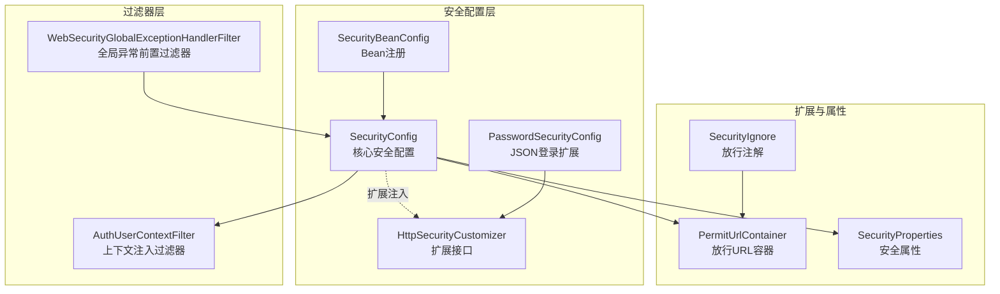
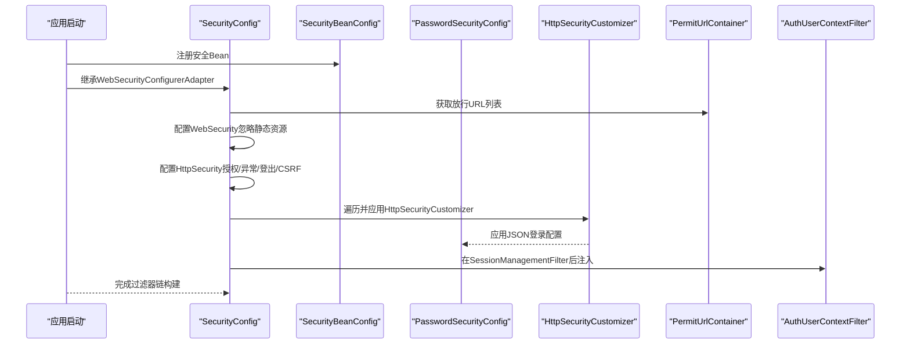
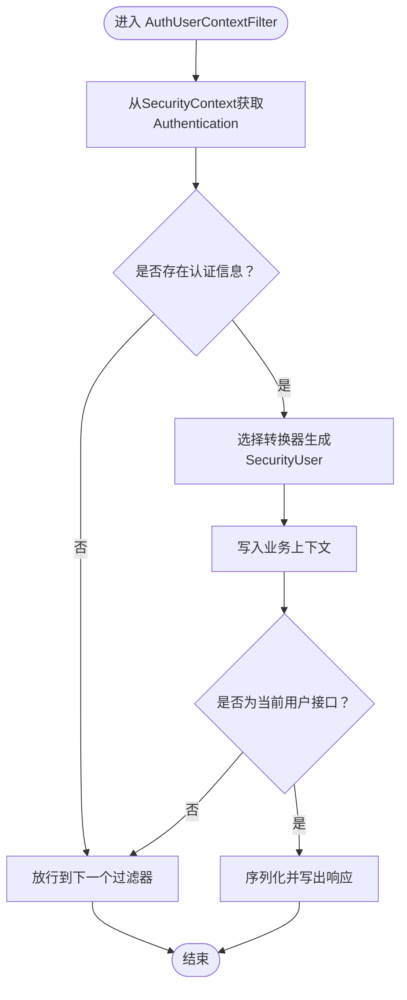
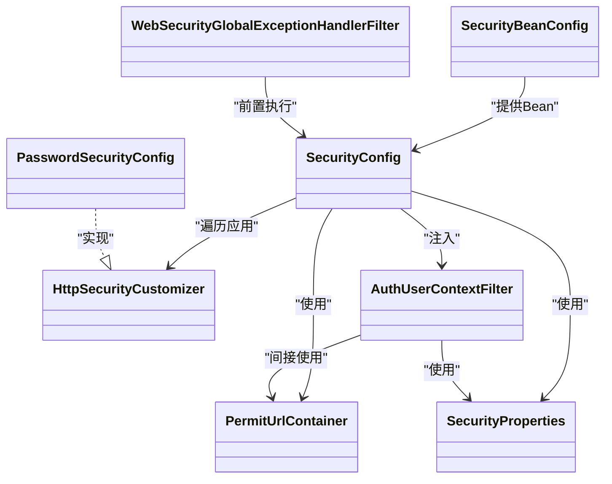

# Spring Security 核心配置

<cite>
**本文引用的文件**
- [SecurityConfig.java](file://qy-auth/auth-spring-boot-starter/src/main/java/com/kewen/framework/auth/security/config/SecurityConfig.java)
- [HttpSecurityCustomizer.java](file://qy-auth/auth-spring-boot-starter/src/main/java/com/kewen/framework/auth/security/config/HttpSecurityCustomizer.java)
- [SecurityBeanConfig.java](file://qy-auth/auth-spring-boot-starter/src/main/java/com/kewen/framework/auth/security/config/SecurityBeanConfig.java)
- [KewenAuthConfig.java](file://qy-auth/auth-spring-boot-starter/src/main/java/com/kewen/framework/auth/security/config/KewenAuthConfig.java)
- [AuthUserContextFilter.java](file://qy-auth/auth-spring-boot-starter/src/main/java/com/kewen/framework/auth/security/filter/AuthUserContextFilter.java)
- [PermitUrlContainer.java](file://qy-auth/auth-spring-boot-starter/src/main/java/com/kewen/framework/auth/security/extension/PermitUrlContainer.java)
- [SecurityProperties.java](file://qy-auth/auth-spring-boot-starter/src/main/java/com/kewen/framework/auth/security/properties/SecurityProperties.java)
- [SecurityAuthenticationSuccessHandler.java](file://qy-auth/auth-spring-boot-starter/src/main/java/com/kewen/framework/auth/security/response/SecurityAuthenticationSuccessHandler.java)
- [PasswordSecurityConfig.java](file://qy-auth/auth-spring-boot-starter/src/main/java/com/kewen/framework/auth/security/password/config/PasswordSecurityConfig.java)
- [SecurityIgnore.java](file://qy-auth/auth-spring-boot-starter/src/main/java/com/kewen/framework/auth/security/annotation/SecurityIgnore.java)
- [WebSecurityGlobalExceptionHandlerFilter.java](file://qy-auth/auth-spring-boot-starter/src/main/java/com/kewen/framework/auth/security/filter/WebSecurityGlobalExceptionHandlerFilter.java)
</cite>

## 目录
1. [简介](#简介)
2. [项目结构](#项目结构)
3. [核心组件](#核心组件)
4. [架构总览](#架构总览)
5. [详细组件分析](#详细组件分析)
6. [依赖分析](#依赖分析)
7. [性能考虑](#性能考虑)
8. [故障排查指南](#故障排查指南)
9. [结论](#结论)
10. [附录：配置示例与最佳实践](#附录配置示例与最佳实践)

## 简介
本文件面向使用本仓库中安全模块的开发者，系统性阐述 Spring Security 的核心配置设计与实现原理，重点围绕以下主题展开：
- SecurityConfig 类的架构与职责边界
- WebSecurity 与 HttpSecurity 的配置方法与要点
- 安全过滤器链的构建流程（静态资源忽略、URL 放行、CSRF 禁用、自定义过滤器注入）
- HttpSecurityCustomizer 扩展机制的实现与使用
- 安全相关 Bean 的注册与依赖注入策略
- 最佳实践与常见问题的解决方案
- 性能优化建议与可落地的配置示例路径

## 项目结构
本项目的安全能力主要集中在 qy-auth/auth-spring-boot-starter 模块中，核心配置与扩展点分布如下：
- config：核心安全配置与 Bean 注册
- filter：安全过滤器链中的关键过滤器
- extension：扩展容器（如放行 URL 容器）
- properties：安全相关配置属性
- response：认证/异常处理响应策略
- password/config：基于 JSON 的密码登录扩展配置
- annotation：安全注解（如放行注解）

图表来源
- [SecurityConfig.java:72-115](file://qy-auth/auth-spring-boot-starter/src/main/java/com/kewen/framework/auth/security/config/SecurityConfig.java#L72-L115)
- [HttpSecurityCustomizer.java:11-17](file://qy-auth/auth-spring-boot-starter/src/main/java/com/kewen/framework/auth/security/config/HttpSecurityCustomizer.java#L11-L17)
- [SecurityBeanConfig.java:28-81](file://qy-auth/auth-spring-boot-starter/src/main/java/com/kewen/framework/auth/security/config/SecurityBeanConfig.java#L28-L81)
- [PasswordSecurityConfig.java:20-48](file://qy-auth/auth-spring-boot-starter/src/main/java/com/kewen/framework/auth/security/password/config/PasswordSecurityConfig.java#L20-L48)
- [AuthUserContextFilter.java:31-84](file://qy-auth/auth-spring-boot-starter/src/main/java/com/kewen/framework/auth/security/filter/AuthUserContextFilter.java#L31-L84)
- [WebSecurityGlobalExceptionHandlerFilter.java:21-63](file://qy-auth/auth-spring-boot-starter/src/main/java/com/kewen/framework/auth/security/filter/WebSecurityGlobalExceptionHandlerFilter.java#L21-L63)
- [PermitUrlContainer.java:31-81](file://qy-auth/auth-spring-boot-starter/src/main/java/com/kewen/framework/auth/security/extension/PermitUrlContainer.java#L31-L81)
- [SecurityProperties.java:13-22](file://qy-auth/auth-spring-boot-starter/src/main/java/com/kewen/framework/auth/security/properties/SecurityProperties.java#L13-L22)
- [SecurityIgnore.java:10-15](file://qy-auth/auth-spring-boot-starter/src/main/java/com/kewen/framework/auth/security/annotation/SecurityIgnore.java#L10-L15)

章节来源
- [SecurityConfig.java:34-134](file://qy-auth/auth-spring-boot-starter/src/main/java/com/kewen/framework/auth/security/config/SecurityConfig.java#L34-L134)
- [SecurityBeanConfig.java:28-81](file://qy-auth/auth-spring-boot-starter/src/main/java/com/kewen/framework/auth/security/config/SecurityBeanConfig.java#L28-L81)

## 核心组件
- SecurityConfig：继承 WebSecurityConfigurerAdapter，负责 WebSecurity 与 HttpSecurity 的总体配置，包括静态资源忽略、URL 放行、CSRF 禁用、异常处理、登出处理、以及自定义过滤器注入。
- HttpSecurityCustomizer：用于扩展 HttpSecurity 的自定义接口，支持多实现并按顺序应用，实现“覆盖式”扩展。
- SecurityBeanConfig：集中注册安全相关 Bean，包括用户详情服务、密码编码器、认证成功处理器、异常处理器、放行 URL 容器、结果解析器等。
- PasswordSecurityConfig：实现 HttpSecurityCustomizer，提供基于 JSON 的登录过滤器配置（用户名、密码参数、登录地址、成功/失败处理器）。
- AuthUserContextFilter：在 SessionManagementFilter 之后注入，负责将认证后的用户上下文写入业务上下文，并对“获取当前用户”请求直接返回。
- PermitUrlContainer：动态收集标注 SecurityIgnore 的 URL 与配置项 kewen.auth.permit-url，统一提供给授权规则使用。
- SecurityProperties：提供安全相关属性（如当前用户接口地址）。
- WebSecurityGlobalExceptionHandlerFilter：在 Spring Security 过滤器链之前执行，兜底处理异常，避免进入 Tomcat 的 /error。

章节来源
- [SecurityConfig.java:36-134](file://qy-auth/auth-spring-boot-starter/src/main/java/com/kewen/framework/auth/security/config/SecurityConfig.java#L36-L134)
- [HttpSecurityCustomizer.java:11-17](file://qy-auth/auth-spring-boot-starter/src/main/java/com/kewen/framework/auth/security/config/HttpSecurityCustomizer.java#L11-L17)
- [SecurityBeanConfig.java:28-81](file://qy-auth/auth-spring-boot-starter/src/main/java/com/kewen/framework/auth/security/config/SecurityBeanConfig.java#L28-L81)
- [PasswordSecurityConfig.java:20-48](file://qy-auth/auth-spring-boot-starter/src/main/java/com/kewen/framework/auth/security/password/config/PasswordSecurityConfig.java#L20-L48)
- [AuthUserContextFilter.java:31-84](file://qy-auth/auth-spring-boot-starter/src/main/java/com/kewen/framework/auth/security/filter/AuthUserContextFilter.java#L31-L84)
- [PermitUrlContainer.java:31-81](file://qy-auth/auth-spring-boot-starter/src/main/java/com/kewen/framework/auth/security/extension/PermitUrlContainer.java#L31-L81)
- [SecurityProperties.java:13-22](file://qy-auth/auth-spring-boot-starter/src/main/java/com/kewen/framework/auth/security/properties/SecurityProperties.java#L13-L22)
- [WebSecurityGlobalExceptionHandlerFilter.java:21-63](file://qy-auth/auth-spring-boot-starter/src/main/java/com/kewen/framework/auth/security/filter/WebSecurityGlobalExceptionHandlerFilter.java#L21-L63)

## 架构总览
下图展示了安全配置的核心交互：SecurityConfig 作为入口，通过 Bean 注入与扩展接口完成过滤器链与授权规则的装配；PasswordSecurityConfig 作为扩展实现参与 HttpSecurity 的定制；PermitUrlContainer 动态聚合放行 URL；AuthUserContextFilter 在认证后注入用户上下文。

图表来源
- [SecurityConfig.java:72-115](file://qy-auth/auth-spring-boot-starter/src/main/java/com/kewen/framework/auth/security/config/SecurityConfig.java#L72-L115)
- [SecurityBeanConfig.java:28-81](file://qy-auth/auth-spring-boot-starter/src/main/java/com/kewen/framework/auth/security/config/SecurityBeanConfig.java#L28-L81)
- [PasswordSecurityConfig.java:20-48](file://qy-auth/auth-spring-boot-starter/src/main/java/com/kewen/framework/auth/security/password/config/PasswordSecurityConfig.java#L20-L48)
- [PermitUrlContainer.java:38-48](file://qy-auth/auth-spring-boot-starter/src/main/java/com/kewen/framework/auth/security/extension/PermitUrlContainer.java#L38-L48)
- [AuthUserContextFilter.java:49-75](file://qy-auth/auth-spring-boot-starter/src/main/java/com/kewen/framework/auth/security/filter/AuthUserContextFilter.java#L49-L75)

## 详细组件分析

### SecurityConfig：WebSecurity 与 HttpSecurity 的配置
- WebSecurity 配置
  - 忽略静态资源与 HTML 页面，减少不必要的安全检查开销。
- HttpSecurity 配置
  - 授权规则：先放行由 PermitUrlContainer 提供的 URL 列表，其余请求需认证。
  - 登出：使用统一的成功处理器。
  - 异常处理：认证入口与访问拒绝均委托给统一异常处理器。
  - CSRF：禁用（适用于前后端分离场景）。
  - 过滤器链：在 SessionManagementFilter 后注入 AuthUserContextFilter，用于设置用户上下文与处理“获取当前用户”请求。
  - 扩展：遍历所有 HttpSecurityCustomizer 实现，依次调用其 customizer 方法，实现“覆盖式”扩展。
- Bean 注册
  - 注册 HttpSessionEventPublisher，确保会话销毁事件被正确传播。

章节来源
- [SecurityConfig.java:72-115](file://qy-auth/auth-spring-boot-starter/src/main/java/com/kewen/framework/auth/security/config/SecurityConfig.java#L72-L115)
- [SecurityConfig.java:67-70](file://qy-auth/auth-spring-boot-starter/src/main/java/com/kewen/framework/auth/security/config/SecurityConfig.java#L67-L70)

### HttpSecurityCustomizer 扩展机制
- 设计目标：允许外部模块或业务代码以 SPI 方式扩展 HttpSecurity，实现“覆盖式”配置。
- 实现方式：SecurityConfig 在 configure(HttpSecurity) 中迭代所有 HttpSecurityCustomizer 实例并逐一调用 customizer。
- 使用示例路径：
  - 参考 [PasswordSecurityConfig.java:31-46](file://qy-auth/auth-spring-boot-starter/src/main/java/com/kewen/framework/auth/security/password/config/PasswordSecurityConfig.java#L31-L46) 中的 apply(...) 与登录参数配置。
  - 参考 [HttpSecurityCustomizer.java:11-17](file://qy-auth/auth-spring-boot-starter/src/main/java/com/kewen/framework/auth/security/config/HttpSecurityCustomizer.java#L11-L17) 中的接口定义。

章节来源
- [SecurityConfig.java:110-114](file://qy-auth/auth-spring-boot-starter/src/main/java/com/kewen/framework/auth/security/config/SecurityConfig.java#L110-L114)
- [HttpSecurityCustomizer.java:11-17](file://qy-auth/auth-spring-boot-starter/src/main/java/com/kewen/framework/auth/security/config/HttpSecurityCustomizer.java#L11-L17)
- [PasswordSecurityConfig.java:31-46](file://qy-auth/auth-spring-boot-starter/src/main/java/com/kewen/framework/auth/security/password/config/PasswordSecurityConfig.java#L31-L46)

### 安全过滤器链：AuthUserContextFilter
- 注入时机：在 SessionManagementFilter 之后，确保 remember-me 等机制完成后执行。
- 核心逻辑：
  - 从 SecurityContext 获取 Authentication，选择合适的转换器生成 SecurityUser 并写入业务上下文。
  - 若请求为“获取当前用户”，直接返回序列化结果，不再进入后续控制器。
  - 否则放行至后续过滤器链。

图表来源
- [AuthUserContextFilter.java:49-75](file://qy-auth/auth-spring-boot-starter/src/main/java/com/kewen/framework/auth/security/filter/AuthUserContextFilter.java#L49-L75)

章节来源
- [AuthUserContextFilter.java:31-84](file://qy-auth/auth-spring-boot-starter/src/main/java/com/kewen/framework/auth/security/filter/AuthUserContextFilter.java#L31-L84)

### 放行 URL 容器：PermitUrlContainer
- 动态发现：扫描 RequestMappingHandlerMapping，提取标注 SecurityIgnore 的方法/类对应的 URL 模式。
- 配置补充：读取 kewen.auth.permit-url 属性，支持分号或逗号分隔的多个 URL。
- 输出：提供去重后的字符串数组，供 authorizeRequests 使用。

章节来源
- [PermitUrlContainer.java:31-81](file://qy-auth/auth-spring-boot-starter/src/main/java/com/kewen/framework/auth/security/extension/PermitUrlContainer.java#L31-L81)
- [SecurityIgnore.java:10-15](file://qy-auth/auth-spring-boot-starter/src/main/java/com/kewen/framework/auth/security/annotation/SecurityIgnore.java#L10-L15)

### 安全 Bean 注册与依赖注入
- 用户详情服务：优先注册 RabcSecurityUserDetailsService（当存在该类时），否则使用默认实现。
- 密码编码器：若未显式声明，则注册 DelegatingPasswordEncoder。
- 认证成功处理器：默认注册 JsonAuthenticationSuccessHandler，结合 AuthenticationSuccessResultResolver 与 Converter。
- 异常处理器：聚合多个 HandlerExceptionResolver，形成统一的认证/异常处理入口。
- 放行 URL 容器：注册 PermitUrlContainer，用于授权规则。
- 结果解析器：若未提供，则注册 NoneAuthenticationSuccessResultResolver。

章节来源
- [SecurityBeanConfig.java:28-81](file://qy-auth/auth-spring-boot-starter/src/main/java/com/kewen/framework/auth/security/config/SecurityBeanConfig.java#L28-L81)

### JSON 登录扩展：PasswordSecurityConfig
- 通过实现 HttpSecurityCustomizer，向 HttpSecurity 应用 JsonLoginAuthenticationFilterConfigurer。
- 关键配置项：登录地址、用户名/密码参数名、成功/失败处理器。
- 与 SecurityConfig 的协作：SecurityConfig 在 configure(HttpSecurity) 中遍历并应用所有 HttpSecurityCustomizer 实现。

章节来源
- [PasswordSecurityConfig.java:20-48](file://qy-auth/auth-spring-boot-starter/src/main/java/com/kewen/framework/auth/security/password/config/PasswordSecurityConfig.java#L20-L48)
- [SecurityConfig.java:110-114](file://qy-auth/auth-spring-boot-starter/src/main/java/com/kewen/framework/auth/security/config/SecurityConfig.java#L110-L114)

### 全局异常前置过滤器：WebSecurityGlobalExceptionHandlerFilter
- 作用：在 Spring Security 过滤器链之前执行，兜底处理异常，避免进入 Tomcat 的 /error。
- 行为：捕获异常后交由 HandlerExceptionResolver 处理，若无解析器则输出默认 JSON。

章节来源
- [WebSecurityGlobalExceptionHandlerFilter.java:21-63](file://qy-auth/auth-spring-boot-starter/src/main/java/com/kewen/framework/auth/security/filter/WebSecurityGlobalExceptionHandlerFilter.java#L21-L63)

## 依赖分析
- 组件耦合
  - SecurityConfig 依赖 SecurityProperties、SecurityUserDetailsService、SecurityAuthenticationSuccessHandler、SecurityAuthenticationExceptionResolverHandler、PermitUrlContainer、AuthenticationSuccessResultResolver、ObjectMapper、ObjectProvider<AuthenticationSuccessResultConverter>、HttpSecurityCustomizer。
  - PasswordSecurityConfig 依赖 SecurityLoginProperties、SecurityAuthenticationSuccessHandler、SecurityAuthenticationExceptionResolverHandler。
  - AuthUserContextFilter 依赖 SecurityProperties、AuthenticationSuccessResultResolver、ObjectMapper、ObjectProvider<AuthenticationSuccessResultConverter>、UserDetailsService。
  - PermitUrlContainer 依赖 Spring MVC 的 RequestMappingHandlerMapping 与 SecurityIgnore 注解。
- 扩展点
  - HttpSecurityCustomizer 作为 SPI，SecurityConfig 通过迭代器顺序应用，实现“覆盖式”扩展。
- 循环依赖风险
  - 通过 ObjectProvider 与延迟注入降低循环依赖概率；注意避免在构造阶段直接强依赖彼此。

图表来源
- [SecurityConfig.java:36-134](file://qy-auth/auth-spring-boot-starter/src/main/java/com/kewen/framework/auth/security/config/SecurityConfig.java#L36-L134)
- [HttpSecurityCustomizer.java:11-17](file://qy-auth/auth-spring-boot-starter/src/main/java/com/kewen/framework/auth/security/config/HttpSecurityCustomizer.java#L11-L17)
- [PasswordSecurityConfig.java:20-48](file://qy-auth/auth-spring-boot-starter/src/main/java/com/kewen/framework/auth/security/password/config/PasswordSecurityConfig.java#L20-L48)
- [SecurityBeanConfig.java:28-81](file://qy-auth/auth-spring-boot-starter/src/main/java/com/kewen/framework/auth/security/config/SecurityBeanConfig.java#L28-L81)
- [AuthUserContextFilter.java:31-84](file://qy-auth/auth-spring-boot-starter/src/main/java/com/kewen/framework/auth/security/filter/AuthUserContextFilter.java#L31-L84)
- [PermitUrlContainer.java:31-81](file://qy-auth/auth-spring-boot-starter/src/main/java/com/kewen/framework/auth/security/extension/PermitUrlContainer.java#L31-L81)
- [SecurityProperties.java:13-22](file://qy-auth/auth-spring-boot-starter/src/main/java/com/kewen/framework/auth/security/properties/SecurityProperties.java#L13-L22)
- [WebSecurityGlobalExceptionHandlerFilter.java:21-63](file://qy-auth/auth-spring-boot-starter/src/main/java/com/kewen/framework/auth/security/filter/WebSecurityGlobalExceptionHandlerFilter.java#L21-L63)

## 性能考虑
- 静态资源忽略：在 WebSecurity 中忽略静态资源与 HTML 页面，减少安全匹配成本。
- 授权规则简化：尽量将高频放行 URL 收敛到 PermitUrlContainer 与配置项，避免复杂 antMatchers 匹配。
- 过滤器链精简：仅在必要处注入过滤器，避免重复处理；例如 AuthUserContextFilter 仅在 SessionManagementFilter 后注入。
- CSRF 禁用：在前后端分离场景下禁用 CSRF，减少额外校验开销。
- 编码器选择：使用系统默认 DelegatingPasswordEncoder，兼顾兼容性与安全性。
- 结果转换器：按需注册 Converter，避免无谓的对象转换。

## 故障排查指南
- 无法放行特定接口
  - 检查是否在控制器方法或类上标注 SecurityIgnore，或在 kewen.auth.permit-url 中配置。
  - 确认 PermitUrlContainer 是否已扫描到对应 URL 模式。
- 登录失败或返回 /error
  - 确认异常处理器已注册并生效；检查 WebSecurityGlobalExceptionHandlerFilter 是否在前置位置执行。
  - 核对 PasswordSecurityConfig 的登录参数与登录地址是否与前端一致。
- “获取当前用户”接口无返回
  - 检查 SecurityProperties 的 currentUserUrl 是否与前端一致。
  - 确认 AuthUserContextFilter 已注入且在 SessionManagementFilter 之后。
- CSRF 相关问题
  - 在 HttpSecurity 中确认已禁用 CSRF；若需启用，请补充相应配置。

章节来源
- [PermitUrlContainer.java:31-81](file://qy-auth/auth-spring-boot-starter/src/main/java/com/kewen/framework/auth/security/extension/PermitUrlContainer.java#L31-L81)
- [WebSecurityGlobalExceptionHandlerFilter.java:21-63](file://qy-auth/auth-spring-boot-starter/src/main/java/com/kewen/framework/auth/security/filter/WebSecurityGlobalExceptionHandlerFilter.java#L21-L63)
- [PasswordSecurityConfig.java:31-46](file://qy-auth/auth-spring-boot-starter/src/main/java/com/kewen/framework/auth/security/password/config/PasswordSecurityConfig.java#L31-L46)
- [AuthUserContextFilter.java:49-75](file://qy-auth/auth-spring-boot-starter/src/main/java/com/kewen/framework/auth/security/filter/AuthUserContextFilter.java#L49-L75)
- [SecurityConfig.java:105](file://qy-auth/auth-spring-boot-starter/src/main/java/com/kewen/framework/auth/security/config/SecurityConfig.java#L105)

## 结论
本安全配置以 SecurityConfig 为核心入口，结合 HttpSecurityCustomizer 的扩展能力、PermitUrlContainer 的动态放行机制与 AuthUserContextFilter 的上下文注入，形成了简洁而可扩展的安全过滤器链。通过合理的 Bean 注册与属性配置，既能满足前后端分离场景下的快速集成，又能通过扩展接口灵活适配更复杂的业务需求。

## 附录：配置示例与最佳实践
- 基础放行配置
  - 在控制器方法或类上标注 SecurityIgnore，或在配置文件中设置 kewen.auth.permit-url。
  - 参考路径：[SecurityIgnore.java:10-15](file://qy-auth/auth-spring-boot-starter/src/main/java/com/kewen/framework/auth/security/annotation/SecurityIgnore.java#L10-L15)，[PermitUrlContainer.java:33-47](file://qy-auth/auth-spring-boot-starter/src/main/java/com/kewen/framework/auth/security/extension/PermitUrlContainer.java#L33-L47)
- JSON 登录配置
  - 设置登录地址、用户名/密码参数名，绑定成功/失败处理器。
  - 参考路径：[PasswordSecurityConfig.java:36-46](file://qy-auth/auth-spring-boot-starter/src/main/java/com/kewen/framework/auth/security/password/config/PasswordSecurityConfig.java#L36-L46)
- 自定义 HttpSecurity 扩展
  - 实现 HttpSecurityCustomizer 并在 customizer 中调用 apply(...) 或直接配置 HttpSecurity。
  - 参考路径：[HttpSecurityCustomizer.java:11-17](file://qy-auth/auth-spring-boot-starter/src/main/java/com/kewen/framework/auth/security/config/HttpSecurityCustomizer.java#L11-L17)，[SecurityConfig.java:110-114](file://qy-auth/auth-spring-boot-starter/src/main/java/com/kewen/framework/auth/security/config/SecurityConfig.java#L110-L114)
- Bean 注册与覆盖
  - 如需替换默认实现，可自行注册同类型 Bean；系统提供条件注解以避免重复注册。
  - 参考路径：[SecurityBeanConfig.java:42-51](file://qy-auth/auth-spring-boot-starter/src/main/java/com/kewen/framework/auth/security/config/SecurityBeanConfig.java#L42-L51)，[SecurityBeanConfig.java:54-80](file://qy-auth/auth-spring-boot-starter/src/main/java/com/kewen/framework/auth/security/config/SecurityBeanConfig.java#L54-L80)
- 性能优化建议
  - 将高频放行 URL 收敛到配置项与注解，减少授权匹配次数。
  - 禁用 CSRF 以降低校验开销；如需启用，请按需配置。
  - 仅在必要处注入过滤器，避免重复处理。
  - 使用系统默认密码编码器，兼顾兼容性与安全性。
  - 参考路径：[SecurityConfig.java:72-115](file://qy-auth/auth-spring-boot-starter/src/main/java/com/kewen/framework/auth/security/config/SecurityConfig.java#L72-L115)，[SecurityBeanConfig.java:47-51](file://qy-auth/auth-spring-boot-starter/src/main/java/com/kewen/framework/auth/security/config/SecurityBeanConfig.java#L47-L51)