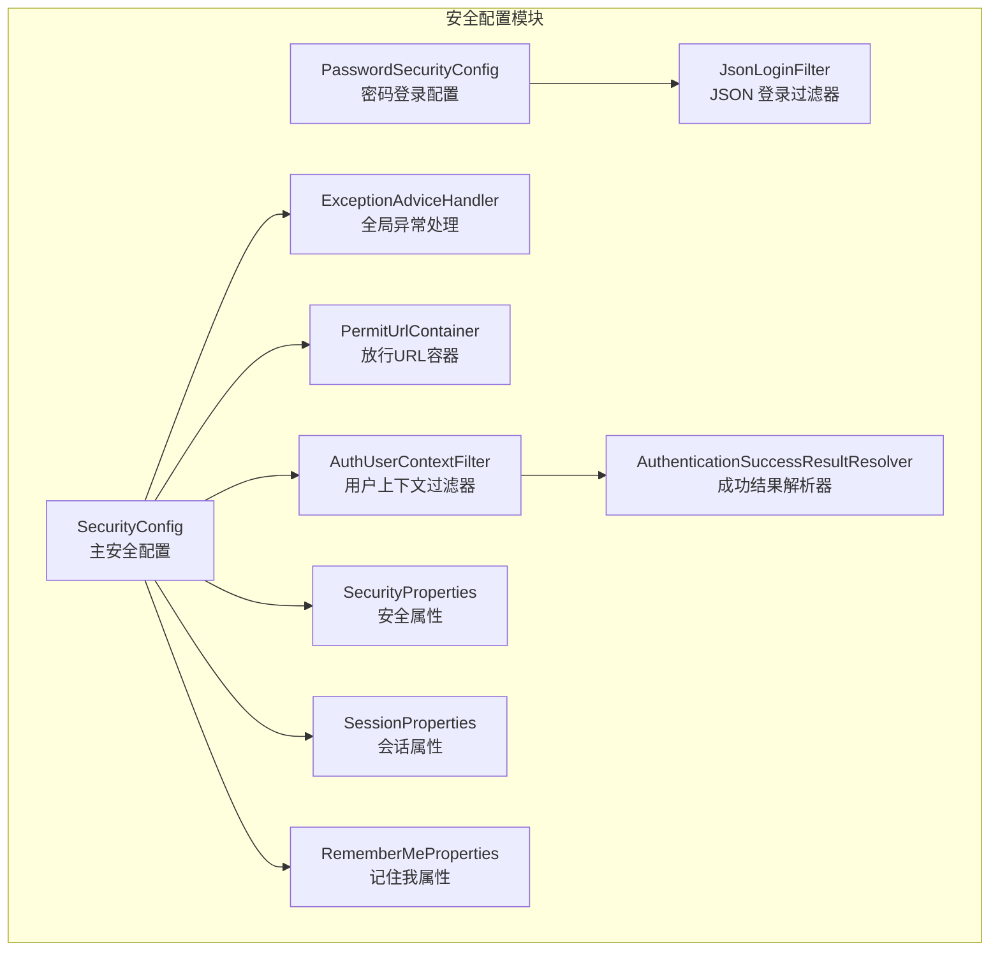
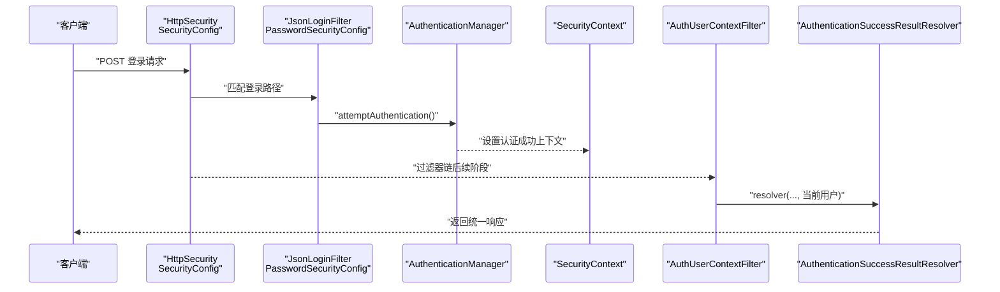
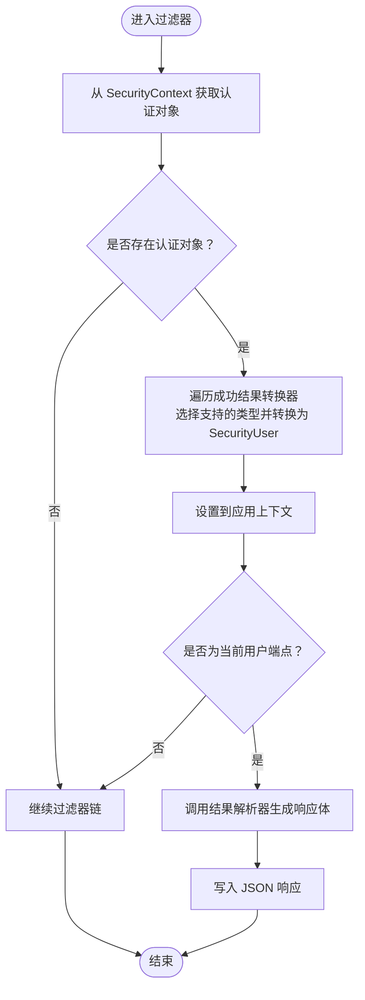
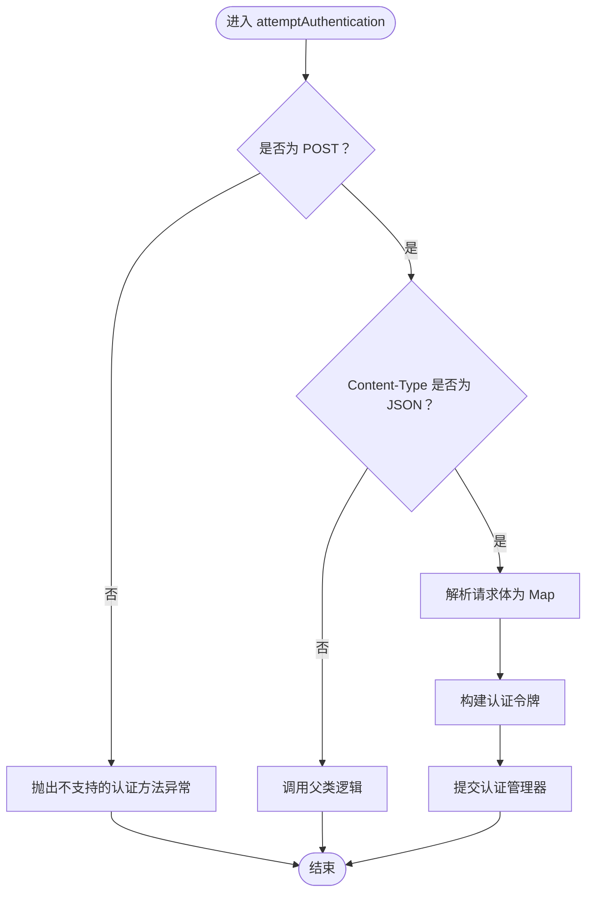
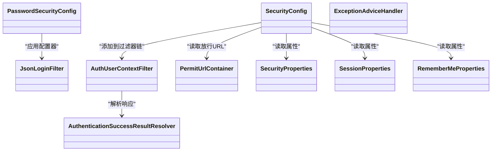

# 安全配置 (auth-spring-boot-starter)

<cite>
**本文引用的文件**
- [SecurityConfig.java](file://qy-auth/auth-spring-boot-starter/src/main/java/com/kewen/framework/auth/security/config/SecurityConfig.java)
- [AuthUserContextFilter.java](file://qy-auth/auth-spring-boot-starter/src/main/java/com/kewen/framework/auth/security/filter/AuthUserContextFilter.java)
- [JsonLoginFilter.java](file://qy-auth/auth-spring-boot-starter/src/main/java/com/kewen/framework/auth/security/password/filter/JsonLoginFilter.java)
- [ExceptionAdviceHandler.java](file://qy-auth/auth-spring-boot-starter/src/main/java/com/kewen/framework/auth/security/handler/ExceptionAdviceHandler.java)
- [SecurityProperties.java](file://qy-auth/auth-spring-boot-starter/src/main/java/com/kewen/framework/auth/security/properties/SecurityProperties.java)
- [SessionProperties.java](file://qy-auth/auth-spring-boot-starter/src/main/java/com/kewen/framework/auth/security/properties/SessionProperties.java)
- [RememberMeProperties.java](file://qy-auth/auth-spring-boot-starter/src/main/java/com/kewen/framework/auth/security/properties/RememberMeProperties.java)
- [PasswordSecurityConfig.java](file://qy-auth/auth-spring-boot-starter/src/main/java/com/kewen/framework/auth/security/password/config/PasswordSecurityConfig.java)
- [JsonLoginAuthenticationFilterConfigurer.java](file://qy-auth/auth-spring-boot-starter/src/main/java/com/kewen/framework/auth/security/password/config/JsonLoginAuthenticationFilterConfigurer.java)
- [AuthenticationSuccessResultResolver.java](file://qy-auth/auth-spring-boot-starter/src/main/java/com/kewen/framework/auth/security/response/AuthenticationSuccessResultResolver.java)
- [SecurityUser.java](file://qy-auth/auth-spring-boot-starter/src/main/java/com/kewen/framework/auth/security/model/SecurityUser.java)
- [SecurityUserDetailsService.java](file://qy-auth/auth-spring-boot-starter/src/main/java/com/kewen/framework/auth/security/service/SecurityUserDetailsService.java)
- [PermitUrlContainer.java](file://qy-auth/auth-spring-boot-starter/src/main/java/com/kewen/framework/auth/security/extension/PermitUrlContainer.java)
- [spring.factories](file://qy-auth/auth-spring-boot-starter/src/main/resources/META-INF/spring.factories)
</cite>

## 目录
1. [简介](#简介)
2. [项目结构](#项目结构)
3. [核心组件](#核心组件)
4. [架构总览](#架构总览)
5. [组件详解](#组件详解)
6. [依赖关系分析](#依赖关系分析)
7. [性能与安全特性](#性能与安全特性)
8. [故障排查指南](#故障排查指南)
9. [结论](#结论)
10. [附录](#附录)

## 简介
本文件面向使用 auth-spring-boot-starter 的开发者，系统性阐述安全配置模块的设计与实现，涵盖：
- Spring Security 配置（SecurityConfig）的过滤器链、认证与授权策略
- 用户上下文过滤器（AuthUserContextFilter）的请求拦截、用户信息提取与上下文设置
- JSON 登录过滤器（JsonLoginFilter）的认证流程与密码处理
- 异常处理机制（ExceptionAdviceHandler）的统一错误响应与异常分类
- 安全属性配置（SecurityProperties、SessionProperties、RememberMeProperties）的参数与默认值
- 会话管理、记住我、跨域等安全特性的配置要点
- 安全最佳实践与常见问题的解决方案

## 项目结构
安全配置模块位于 qy-auth/auth-spring-boot-starter 中，关键目录与职责如下：
- config：安全主配置与扩展配置（SecurityConfig、PasswordSecurityConfig、SessionConfig）
- filter：安全过滤器（AuthUserContextFilter、JsonLoginFilter 等）
- handler：异常处理（ExceptionAdviceHandler）
- properties：安全相关配置属性（SecurityProperties、SessionProperties、RememberMeProperties）
- response：认证成功结果解析与转换（AuthenticationSuccessResultResolver 及其实现）
- model：安全用户模型（SecurityUser）
- service：用户详情服务接口（SecurityUserDetailsService）
- extension：扩展能力（PermitUrlContainer）

图表来源
- [SecurityConfig.java:34-134](file://qy-auth/auth-spring-boot-starter/src/main/java/com/kewen/framework/auth/security/config/SecurityConfig.java#L34-L134)
- [PasswordSecurityConfig.java:18-49](file://qy-auth/auth-spring-boot-starter/src/main/java/com/kewen/framework/auth/security/password/config/PasswordSecurityConfig.java#L18-L49)
- [AuthUserContextFilter.java:31-85](file://qy-auth/auth-spring-boot-starter/src/main/java/com/kewen/framework/auth/security/filter/AuthUserContextFilter.java#L31-L85)
- [JsonLoginFilter.java:22-51](file://qy-auth/auth-spring-boot-starter/src/main/java/com/kewen/framework/auth/security/password/filter/JsonLoginFilter.java#L22-L51)
- [ExceptionAdviceHandler.java:17-69](file://qy-auth/auth-spring-boot-starter/src/main/java/com/kewen/framework/auth/security/handler/ExceptionAdviceHandler.java#L17-L69)
- [SecurityProperties.java:13-23](file://qy-auth/auth-spring-boot-starter/src/main/java/com/kewen/framework/auth/security/properties/SecurityProperties.java#L13-L23)
- [SessionProperties.java:11-23](file://qy-auth/auth-spring-boot-starter/src/main/java/com/kewen/framework/auth/security/properties/SessionProperties.java#L11-L23)
- [RememberMeProperties.java:11-27](file://qy-auth/auth-spring-boot-starter/src/main/java/com/kewen/framework/auth/security/properties/RememberMeProperties.java#L11-L27)
- [AuthenticationSuccessResultResolver.java:14-24](file://qy-auth/auth-spring-boot-starter/src/main/java/com/kewen/framework/auth/security/response/AuthenticationSuccessResultResolver.java#L14-L24)
- [PermitUrlContainer.java:31-82](file://qy-auth/auth-spring-boot-starter/src/main/java/com/kewen/framework/auth/security/extension/PermitUrlContainer.java#L31-L82)

章节来源
- [spring.factories:1-6](file://qy-auth/auth-spring-boot-starter/src/main/resources/META-INF/spring.factories#L1-L6)

## 核心组件
- 安全主配置（SecurityConfig）：定义 WebSecurity 忽略规则、HttpSecurity 授权策略、异常处理、跨域、以及将用户上下文过滤器加入过滤器链
- 密码登录配置（PasswordSecurityConfig）：通过自定义配置器应用 JSON 登录过滤器，绑定登录处理路径与参数
- 用户上下文过滤器（AuthUserContextFilter）：在认证后从 SecurityContext 提取用户信息并注入到应用上下文，支持“获取当前用户”端点直返
- JSON 登录过滤器（JsonLoginFilter）：解析 JSON 请求体，构建认证令牌并交由认证管理器处理
- 全局异常处理器（ExceptionAdviceHandler）：对各类认证/授权异常进行统一响应
- 属性配置（SecurityProperties、SessionProperties、RememberMeProperties）：集中管理安全相关参数
- 成功结果解析器（AuthenticationSuccessResultResolver）：统一认证成功/登出成功/获取当前用户等返回格式
- 放行 URL 容器（PermitUrlContainer）：聚合注解与配置的放行路径

章节来源
- [SecurityConfig.java:34-134](file://qy-auth/auth-spring-boot-starter/src/main/java/com/kewen/framework/auth/security/config/SecurityConfig.java#L34-L134)
- [PasswordSecurityConfig.java:18-49](file://qy-auth/auth-spring-boot-starter/src/main/java/com/kewen/framework/auth/security/password/config/PasswordSecurityConfig.java#L18-L49)
- [AuthUserContextFilter.java:31-85](file://qy-auth/auth-spring-boot-starter/src/main/java/com/kewen/framework/auth/security/filter/AuthUserContextFilter.java#L31-L85)
- [JsonLoginFilter.java:22-51](file://qy-auth/auth-spring-boot-starter/src/main/java/com/kewen/framework/auth/security/password/filter/JsonLoginFilter.java#L22-L51)
- [ExceptionAdviceHandler.java:17-69](file://qy-auth/auth-spring-boot-starter/src/main/java/com/kewen/framework/auth/security/handler/ExceptionAdviceHandler.java#L17-L69)
- [SecurityProperties.java:13-23](file://qy-auth/auth-spring-boot-starter/src/main/java/com/kewen/framework/auth/security/properties/SecurityProperties.java#L13-L23)
- [SessionProperties.java:11-23](file://qy-auth/auth-spring-boot-starter/src/main/java/com/kewen/framework/auth/security/properties/SessionProperties.java#L11-L23)
- [RememberMeProperties.java:11-27](file://qy-auth/auth-spring-boot-starter/src/main/java/com/kewen/framework/auth/security/properties/RememberMeProperties.java#L11-L27)
- [AuthenticationSuccessResultResolver.java:14-24](file://qy-auth/auth-spring-boot-starter/src/main/java/com/kewen/framework/auth/security/response/AuthenticationSuccessResultResolver.java#L14-L24)
- [PermitUrlContainer.java:31-82](file://qy-auth/auth-spring-boot-starter/src/main/java/com/kewen/framework/auth/security/extension/PermitUrlContainer.java#L31-L82)

## 架构总览
下图展示安全配置模块在 Spring Security 中的交互关系与数据流向。

图表来源
- [SecurityConfig.java:84-115](file://qy-auth/auth-spring-boot-starter/src/main/java/com/kewen/framework/auth/security/config/SecurityConfig.java#L84-L115)
- [PasswordSecurityConfig.java:32-46](file://qy-auth/auth-spring-boot-starter/src/main/java/com/kewen/framework/auth/security/password/config/PasswordSecurityConfig.java#L32-L46)
- [JsonLoginFilter.java:24-49](file://qy-auth/auth-spring-boot-starter/src/main/java/com/kewen/framework/auth/security/password/filter/JsonLoginFilter.java#L24-L49)
- [AuthUserContextFilter.java:49-75](file://qy-auth/auth-spring-boot-starter/src/main/java/com/kewen/framework/auth/security/filter/AuthUserContextFilter.java#L49-L75)
- [AuthenticationSuccessResultResolver.java:14-24](file://qy-auth/auth-spring-boot-starter/src/main/java/com/kewen/framework/auth/security/response/AuthenticationSuccessResultResolver.java#L14-L24)

## 组件详解

### 安全主配置（SecurityConfig）
- WebSecurity 忽略静态资源与 HTML 文件，避免无谓的安全检查
- HttpSecurity 授权策略：放行 URL 容器中的路径，其余请求均需认证；禁用 CSRF；配置登出成功处理器与异常入口/拒绝处理器
- 将用户上下文过滤器（SessionManagementFilter 后）加入过滤器链，确保 remember-me 后再注入用户上下文
- 支持通过 HttpSecurityCustomizer 扩展配置，迭代调用以覆盖默认行为
- 跨域配置可选启用（当前被注释），建议按需开启

章节来源
- [SecurityConfig.java:72-131](file://qy-auth/auth-spring-boot-starter/src/main/java/com/kewen/framework/auth/security/config/SecurityConfig.java#L72-L131)

### 用户上下文过滤器（AuthUserContextFilter）
- 作用：在认证完成后，从 SecurityContext 获取认证对象，借助成功结果转换器生成 SecurityUser，并设置到应用上下文
- 特殊端点：当请求 URI 等于“当前用户”URL 时，直接返回当前用户信息，无需继续过滤器链
- 输出：使用 ObjectMapper 序列化并写入 JSON 响应体

图表来源
- [AuthUserContextFilter.java:49-83](file://qy-auth/auth-spring-boot-starter/src/main/java/com/kewen/framework/auth/security/filter/AuthUserContextFilter.java#L49-L83)

章节来源
- [AuthUserContextFilter.java:31-85](file://qy-auth/auth-spring-boot-starter/src/main/java/com/kewen/framework/auth/security/filter/AuthUserContextFilter.java#L31-L85)

### JSON 登录过滤器（JsonLoginFilter）
- 仅处理 POST 方法且 Content-Type 为 JSON 的请求
- 从请求体解析用户名与密码，构造认证令牌并交由认证管理器
- 非 JSON 或非 POST 时回退至父类逻辑（表单登录）

图表来源
- [JsonLoginFilter.java:24-49](file://qy-auth/auth-spring-boot-starter/src/main/java/com/kewen/framework/auth/security/password/filter/JsonLoginFilter.java#L24-L49)

章节来源
- [JsonLoginFilter.java:22-51](file://qy-auth/auth-spring-boot-starter/src/main/java/com/kewen/framework/auth/security/password/filter/JsonLoginFilter.java#L22-L51)

### 密码登录配置（PasswordSecurityConfig）
- 通过自定义配置器将 JSON 登录过滤器接入 HttpSecurity
- 绑定登录处理路径、用户名/密码参数名、成功/失败处理器
- 作为 HttpSecurityCustomizer 的实现，可被主配置迭代调用以覆盖默认行为

章节来源
- [PasswordSecurityConfig.java:18-49](file://qy-auth/auth-spring-boot-starter/src/main/java/com/kewen/framework/auth/security/password/config/PasswordSecurityConfig.java#L18-L49)
- [JsonLoginAuthenticationFilterConfigurer.java:14-39](file://qy-auth/auth-spring-boot-starter/src/main/java/com/kewen/framework/auth/security/password/config/JsonLoginAuthenticationFilterConfigurer.java#L14-L39)

### 异常处理机制（ExceptionAdviceHandler）
- 对访问异常、未登录、认证异常、权限不足、内部服务异常等进行分类处理
- 返回统一的业务响应结构，状态码与消息根据异常类型映射

章节来源
- [ExceptionAdviceHandler.java:17-69](file://qy-auth/auth-spring-boot-starter/src/main/java/com/kewen/framework/auth/security/handler/ExceptionAdviceHandler.java#L17-L69)

### 安全属性配置（SecurityProperties、SessionProperties、RememberMeProperties）
- SecurityProperties
  - currentUserUrl：当前用户查询端点，默认 “/currentUser”
- SessionProperties
  - maximumSessions：最大会话数，默认 10
  - maxSessionsPreventsLogin：达到上限时是否阻止新登录，默认 false（即最早会话被挤掉）
- RememberMeProperties
  - enabled：是否启用记住我，默认 true
  - rememberParameter：请求参数名，默认 “remember-me”
  - validitySeconds：有效期（秒），默认 2592000（30 天）

章节来源
- [SecurityProperties.java:13-23](file://qy-auth/auth-spring-boot-starter/src/main/java/com/kewen/framework/auth/security/properties/SecurityProperties.java#L13-L23)
- [SessionProperties.java:11-23](file://qy-auth/auth-spring-boot-starter/src/main/java/com/kewen/framework/auth/security/properties/SessionProperties.java#L11-L23)
- [RememberMeProperties.java:11-27](file://qy-auth/auth-spring-boot-starter/src/main/java/com/kewen/framework/auth/security/properties/RememberMeProperties.java#L11-L27)

### 成功结果解析与转换
- AuthenticationSuccessResultResolver：定义统一的成功结果解析接口，供“获取当前用户”等场景使用
- AuthUserContextFilter 使用该解析器生成响应体并写出

章节来源
- [AuthenticationSuccessResultResolver.java:14-24](file://qy-auth/auth-spring-boot-starter/src/main/java/com/kewen/framework/auth/security/response/AuthenticationSuccessResultResolver.java#L14-L24)
- [AuthUserContextFilter.java:67-71](file://qy-auth/auth-spring-boot-starter/src/main/java/com/kewen/framework/auth/security/filter/AuthUserContextFilter.java#L67-L71)

### 放行 URL 容器（PermitUrlContainer）
- 自动扫描控制器上标注的 SecurityIgnore 注解，提取请求路径
- 支持通过配置项追加放行路径，最终汇总为数组供授权规则使用

章节来源
- [PermitUrlContainer.java:31-82](file://qy-auth/auth-spring-boot-starter/src/main/java/com/kewen/framework/auth/security/extension/PermitUrlContainer.java#L31-L82)

## 依赖关系分析
- SecurityConfig 依赖：
  - SecurityProperties、SecurityUserDetailsService、SecurityAuthenticationSuccessHandler、SecurityAuthenticationExceptionResolverHandler
  - PermitUrlContainer、AuthenticationSuccessResultResolver、ObjectMapper、ObjectProvider<AuthenticationSuccessResultConverter>
  - 将 AuthUserContextFilter 添加到 SessionManagementFilter 之后
- PasswordSecurityConfig 依赖：
  - SecurityLoginProperties、SecurityAuthenticationSuccessHandler、SecurityAuthenticationExceptionResolverHandler
  - 通过 JsonLoginAuthenticationFilterConfigurer 应用 JsonLoginFilter
- AuthUserContextFilter 依赖：
  - AuthenticationSuccessResultResolver、ObjectProvider<AuthenticationSuccessResultConverter>、UserDetailsService
  - 通过 SecurityUserDetailsService 转换认证对象为 SecurityUser 并设置到应用上下文

图表来源
- [SecurityConfig.java:34-134](file://qy-auth/auth-spring-boot-starter/src/main/java/com/kewen/framework/auth/security/config/SecurityConfig.java#L34-L134)
- [PasswordSecurityConfig.java:18-49](file://qy-auth/auth-spring-boot-starter/src/main/java/com/kewen/framework/auth/security/password/config/PasswordSecurityConfig.java#L18-L49)
- [AuthUserContextFilter.java:31-85](file://qy-auth/auth-spring-boot-starter/src/main/java/com/kewen/framework/auth/security/filter/AuthUserContextFilter.java#L31-L85)
- [JsonLoginFilter.java:22-51](file://qy-auth/auth-spring-boot-starter/src/main/java/com/kewen/framework/auth/security/password/filter/JsonLoginFilter.java#L22-L51)
- [ExceptionAdviceHandler.java:17-69](file://qy-auth/auth-spring-boot-starter/src/main/java/com/kewen/framework/auth/security/handler/ExceptionAdviceHandler.java#L17-L69)
- [SecurityProperties.java:13-23](file://qy-auth/auth-spring-boot-starter/src/main/java/com/kewen/framework/auth/security/properties/SecurityProperties.java#L13-L23)
- [SessionProperties.java:11-23](file://qy-auth/auth-spring-boot-starter/src/main/java/com/kewen/framework/auth/security/properties/SessionProperties.java#L11-L23)
- [RememberMeProperties.java:11-27](file://qy-auth/auth-spring-boot-starter/src/main/java/com/kewen/framework/auth/security/properties/RememberMeProperties.java#L11-L27)
- [AuthenticationSuccessResultResolver.java:14-24](file://qy-auth/auth-spring-boot-starter/src/main/java/com/kewen/framework/auth/security/response/AuthenticationSuccessResultResolver.java#L14-L24)
- [PermitUrlContainer.java:31-82](file://qy-auth/auth-spring-boot-starter/src/main/java/com/kewen/framework/auth/security/extension/PermitUrlContainer.java#L31-L82)

## 性能与安全特性
- 过滤器链顺序
  - 用户上下文过滤器置于 SessionManagementFilter 之后，确保 remember-me 已完成后再注入用户上下文，避免重复会话问题
- 会话管理
  - 默认未启用最大会话限制；可通过 SessionProperties 配置 maximumSessions 与 maxSessionsPreventsLogin
- 跨域处理
  - 提供跨域配置源实现，建议按环境启用并限定来源、头与方法
- 认证与授权
  - 放行 URL 通过注解与配置聚合；授权规则对未放行路径强制认证
- 异常处理
  - 全局异常处理器对不同异常类型进行分类响应，便于前端统一处理

章节来源
- [SecurityConfig.java:105-115](file://qy-auth/auth-spring-boot-starter/src/main/java/com/kewen/framework/auth/security/config/SecurityConfig.java#L105-L115)
- [SessionProperties.java:11-23](file://qy-auth/auth-spring-boot-starter/src/main/java/com/kewen/framework/auth/security/properties/SessionProperties.java#L11-L23)
- [PermitUrlContainer.java:31-82](file://qy-auth/auth-spring-boot-starter/src/main/java/com/kewen/framework/auth/security/extension/PermitUrlContainer.java#L31-L82)
- [ExceptionAdviceHandler.java:17-69](file://qy-auth/auth-spring-boot-starter/src/main/java/com/kewen/framework/auth/security/handler/ExceptionAdviceHandler.java#L17-L69)

## 故障排查指南
- 登录失败
  - 检查登录请求是否为 POST 且 Content-Type 为 JSON
  - 确认用户名/密码参数名与 SecurityLoginProperties 配置一致
  - 查看异常处理器返回的 401/403 信息定位具体原因
- 无法获取当前用户
  - 确认请求 URI 与 SecurityProperties.currentUserUrl 一致
  - 检查用户上下文过滤器是否正确注入到过滤器链
- 权限不足
  - 检查目标路径是否在放行列表或具备相应权限
  - 关注异常处理器对 InsufficientAuthenticationException 的统一响应
- 会话冲突
  - 如出现会话过多或被挤掉，调整 SessionProperties 的 maximumSessions 与 maxSessionsPreventsLogin

章节来源
- [JsonLoginFilter.java:24-49](file://qy-auth/auth-spring-boot-starter/src/main/java/com/kewen/framework/auth/security/password/filter/JsonLoginFilter.java#L24-L49)
- [PasswordSecurityConfig.java:32-46](file://qy-auth/auth-spring-boot-starter/src/main/java/com/kewen/framework/auth/security/password/config/PasswordSecurityConfig.java#L32-L46)
- [AuthUserContextFilter.java:67-71](file://qy-auth/auth-spring-boot-starter/src/main/java/com/kewen/framework/auth/security/filter/AuthUserContextFilter.java#L67-L71)
- [SecurityProperties.java:13-23](file://qy-auth/auth-spring-boot-starter/src/main/java/com/kewen/framework/auth/security/properties/SecurityProperties.java#L13-L23)
- [SessionProperties.java:11-23](file://qy-auth/auth-spring-boot-starter/src/main/java/com/kewen/framework/auth/security/properties/SessionProperties.java#L11-L23)
- [ExceptionAdviceHandler.java:56-66](file://qy-auth/auth-spring-boot-starter/src/main/java/com/kewen/framework/auth/security/handler/ExceptionAdviceHandler.java#L56-L66)

## 结论
本模块通过清晰的配置分层与可扩展的过滤器链设计，实现了基于 JSON 的认证流程、统一的异常处理与灵活的放行策略。结合属性配置，可在会话管理、记住我、跨域等方面按需定制，满足多数企业级安全需求。建议在生产环境中启用必要的跨域与会话限制策略，并配合严格的放行路径管理与日志监控。

## 附录
- 安全最佳实践
  - 明确放行路径清单，尽量减少开放端点
  - 启用最小权限原则与细粒度授权
  - 合理设置会话上限与失效策略
  - 对敏感操作增加二次校验或审计日志
- 常见问题
  - 登录端点未生效：确认登录路径与配置一致，且过滤器已正确接入
  - 跨域失败：检查 CORS 配置与浏览器同源策略
  - 记住我无效：核对 remember-me 参数名与有效期配置