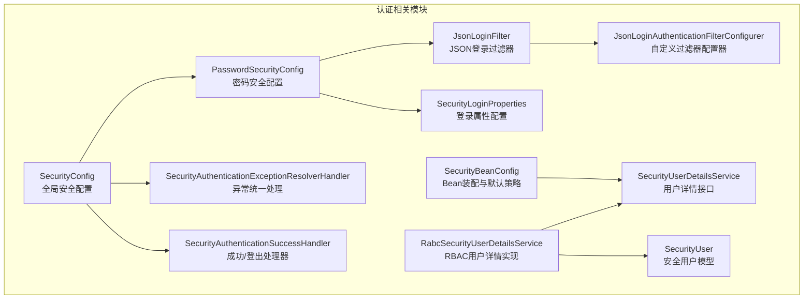
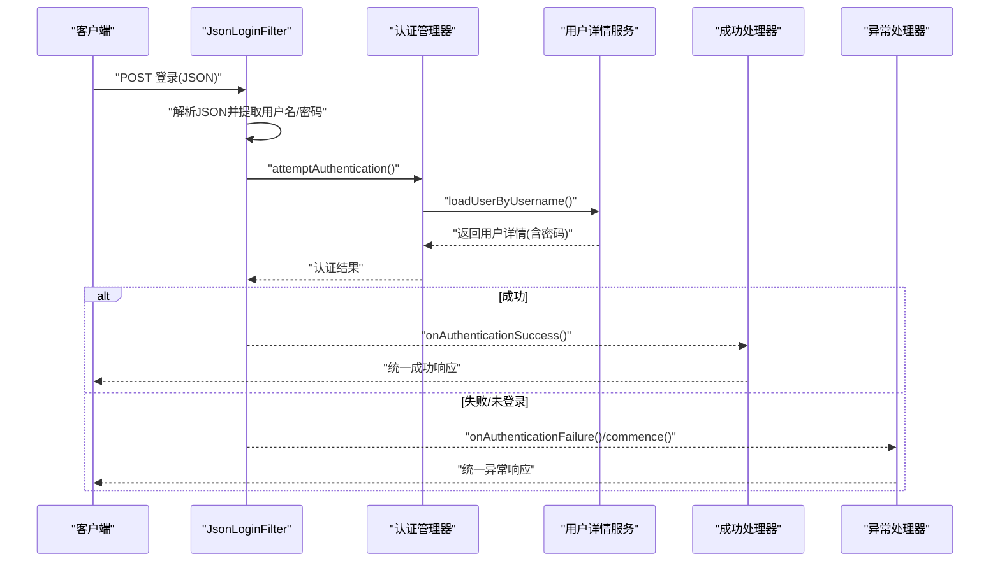
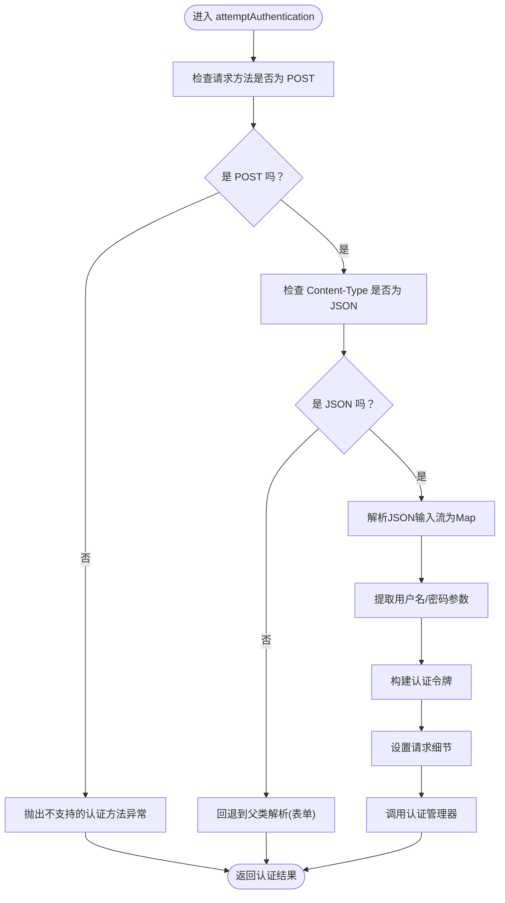
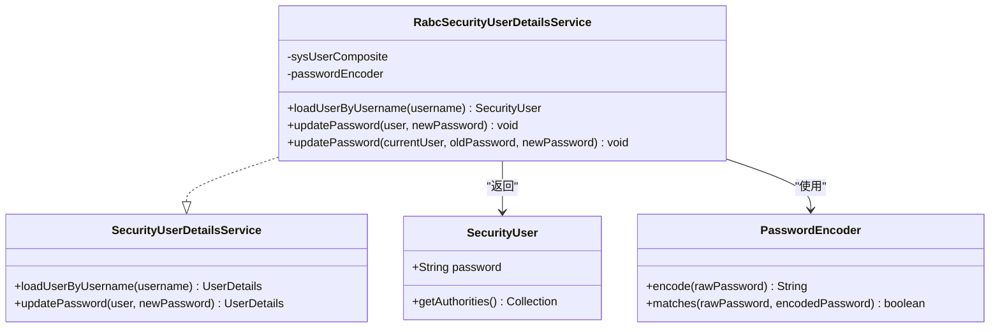
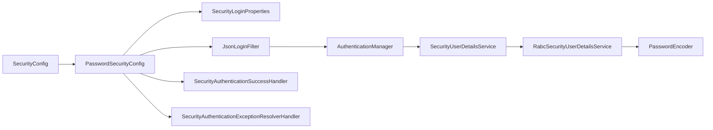

# 密码认证机制

<cite>
**本文引用的文件**
- [JsonLoginFilter.java](file://qy-auth/auth-spring-boot-starter/src/main/java/com/kewen/framework/auth/security/password/filter/JsonLoginFilter.java)
- [PasswordSecurityConfig.java](file://qy-auth/auth-spring-boot-starter/src/main/java/com/kewen/framework/auth/security/password/config/PasswordSecurityConfig.java)
- [JsonLoginAuthenticationFilterConfigurer.java](file://qy-auth/auth-spring-boot-starter/src/main/java/com/kewen/framework/auth/security/password/config/JsonLoginAuthenticationFilterConfigurer.java)
- [SecurityLoginProperties.java](file://qy-auth/auth-spring-boot-starter/src/main/java/com/kewen/framework/auth/security/password/properties/SecurityLoginProperties.java)
- [SecurityConfig.java](file://qy-auth/auth-spring-boot-starter/src/main/java/com/kewen/framework/auth/security/config/SecurityConfig.java)
- [SecurityBeanConfig.java](file://qy-auth/auth-spring-boot-starter/src/main/java/com/kewen/framework/auth/security/config/SecurityBeanConfig.java)
- [SecurityUserDetailsService.java](file://qy-auth/auth-spring-boot-starter/src/main/java/com/kewen/framework/auth/security/service/SecurityUserDetailsService.java)
- [RabcSecurityUserDetailsService.java](file://qy-auth/auth-spring-boot-starter/src/main/java/com/kewen/framework/auth/security/service/RabcSecurityUserDetailsService.java)
- [SecurityUser.java](file://qy-auth/auth-spring-boot-starter/src/main/java/com/kewen/framework/auth/security/model/SecurityUser.java)
- [SecurityAuthenticationExceptionResolverHandler.java](file://qy-auth/auth-spring-boot-starter/src/main/java/com/kewen/framework/auth/security/response/SecurityAuthenticationExceptionResolverHandler.java)
- [SecurityAuthenticationSuccessHandler.java](file://qy-auth/auth-spring-boot-starter/src/main/java/com/kewen/framework/auth/security/response/SecurityAuthenticationSuccessHandler.java)
- [application.yml](file://sample/auth-boot-sample/src/main/resources/application.yml)
</cite>

## 目录
1. [引言](#引言)
2. [项目结构](#项目结构)
3. [核心组件](#核心组件)
4. [架构总览](#架构总览)
5. [组件详解](#组件详解)
6. [依赖关系分析](#依赖关系分析)
7. [性能与安全考量](#性能与安全考量)
8. [故障排查指南](#故障排查指南)
9. [结论](#结论)
10. [附录：配置示例与调试技巧](#附录配置示例与调试技巧)

## 引言
本文件围绕密码认证机制进行系统化技术文档化，重点涵盖以下方面：
- JsonLoginFilter 的 JSON 登录实现原理：请求解析、用户名密码提取、认证流程。
- PasswordSecurityConfig 的密码安全配置：登录端点、参数名、成功/失败处理器注入。
- JsonLoginAuthenticationFilterConfigurer 的自定义配置方法：如何扩展过滤器配置。
- 密码加密策略与安全存储：基于 DelegatingPasswordEncoder 的策略与数据库存储格式。
- 认证失败处理与重试限制机制：异常统一处理与可配置策略。
- 安全最佳实践与常见问题：参数校验、日志级别、跨域与 CSRF 策略。
- 配置示例与调试技巧：基于示例项目的配置与定位问题的方法。

## 项目结构
本模块位于 qy-auth 子模块下的 auth-spring-boot-starter 中，密码认证相关代码主要分布在 password 包及其子包中，配合全局安全配置与用户详情服务共同完成认证闭环。

图表来源
- [JsonLoginFilter.java:22-50](file://qy-auth/auth-spring-boot-starter/src/main/java/com/kewen/framework/auth/security/password/filter/JsonLoginFilter.java#L22-L50)
- [JsonLoginAuthenticationFilterConfigurer.java:14-38](file://qy-auth/auth-spring-boot-starter/src/main/java/com/kewen/framework/auth/security/password/config/JsonLoginAuthenticationFilterConfigurer.java#L14-L38)
- [PasswordSecurityConfig.java:36-46](file://qy-auth/auth-spring-boot-starter/src/main/java/com/kewen/framework/auth/security/password/config/PasswordSecurityConfig.java#L36-L46)
- [SecurityLoginProperties.java:13-29](file://qy-auth/auth-spring-boot-starter/src/main/java/com/kewen/framework/auth/security/password/properties/SecurityLoginProperties.java#L13-L29)
- [SecurityConfig.java:34-115](file://qy-auth/auth-spring-boot-starter/src/main/java/com/kewen/framework/auth/security/config/SecurityConfig.java#L34-L115)
- [SecurityBeanConfig.java:28-81](file://qy-auth/auth-spring-boot-starter/src/main/java/com/kewen/framework/auth/security/config/SecurityBeanConfig.java#L28-L81)
- [SecurityUserDetailsService.java:8-14](file://qy-auth/auth-spring-boot-starter/src/main/java/com/kewen/framework/auth/security/service/SecurityUserDetailsService.java#L8-L14)
- [RabcSecurityUserDetailsService.java:22-77](file://qy-auth/auth-spring-boot-starter/src/main/java/com/kewen/framework/auth/security/service/RabcSecurityUserDetailsService.java#L22-L77)
- [SecurityUser.java:17-141](file://qy-auth/auth-spring-boot-starter/src/main/java/com/kewen/framework/auth/security/model/SecurityUser.java#L17-L141)
- [SecurityAuthenticationExceptionResolverHandler.java:27-91](file://qy-auth/auth-spring-boot-starter/src/main/java/com/kewen/framework/auth/security/response/SecurityAuthenticationExceptionResolverHandler.java#L27-L91)
- [SecurityAuthenticationSuccessHandler.java:18-32](file://qy-auth/auth-spring-boot-starter/src/main/java/com/kewen/framework/auth/security/response/SecurityAuthenticationSuccessHandler.java#L18-L32)

章节来源
- [SecurityConfig.java:34-115](file://qy-auth/auth-spring-boot-starter/src/main/java/com/kewen/framework/auth/security/config/SecurityConfig.java#L34-L115)
- [SecurityBeanConfig.java:28-81](file://qy-auth/auth-spring-boot-starter/src/main/java/com/kewen/framework/auth/security/config/SecurityBeanConfig.java#L28-L81)

## 核心组件
- JsonLoginFilter：继承 Spring Security 的 UsernamePasswordAuthenticationFilter，专门处理 JSON 请求体中的用户名与密码，构造 UsernamePasswordAuthenticationToken 并交由认证管理器处理。
- JsonLoginAuthenticationFilterConfigurer：继承 AbstractAuthenticationFilterConfigurer，用于注册 JsonLoginFilter 并限定登录处理路径为 POST 方法，同时提供 usernameParameter 与 passwordParameter 的链式配置能力。
- PasswordSecurityConfig：实现 HttpSecurityCustomizer，通过 apply(configurer) 注册自定义过滤器，绑定登录端点、参数名、成功/失败处理器。
- SecurityLoginProperties：提供登录相关配置项（登录URL、用户名参数名、密码参数名），默认值在配置类中生效。
- SecurityUserDetailsService 与 RabcSecurityUserDetailsService：加载用户详情与密码，支持密码匹配与更新；SecurityUser 作为 UserDetails 实现承载用户信息与权限。
- SecurityAuthenticationExceptionResolverHandler：统一处理未登录访问、访问拒绝与认证失败，委派给 HandlerExceptionResolver，兜底输出 JSON。
- SecurityAuthenticationSuccessHandler：统一处理认证成功与登出成功，便于业务定制返回结构。

章节来源
- [JsonLoginFilter.java:22-50](file://qy-auth/auth-spring-boot-starter/src/main/java/com/kewen/framework/auth/security/password/filter/JsonLoginFilter.java#L22-L50)
- [JsonLoginAuthenticationFilterConfigurer.java:14-38](file://qy-auth/auth-spring-boot-starter/src/main/java/com/kewen/framework/auth/security/password/config/JsonLoginAuthenticationFilterConfigurer.java#L14-L38)
- [PasswordSecurityConfig.java:31-46](file://qy-auth/auth-spring-boot-starter/src/main/java/com/kewen/framework/auth/security/password/config/PasswordSecurityConfig.java#L31-L46)
- [SecurityLoginProperties.java:13-29](file://qy-auth/auth-spring-boot-starter/src/main/java/com/kewen/framework/auth/security/password/properties/SecurityLoginProperties.java#L13-L29)
- [SecurityUserDetailsService.java:8-14](file://qy-auth/auth-spring-boot-starter/src/main/java/com/kewen/framework/auth/security/service/SecurityUserDetailsService.java#L8-L14)
- [RabcSecurityUserDetailsService.java:22-77](file://qy-auth/auth-spring-boot-starter/src/main/java/com/kewen/framework/auth/security/service/RabcSecurityUserDetailsService.java#L22-L77)
- [SecurityUser.java:17-141](file://qy-auth/auth-spring-boot-starter/src/main/java/com/kewen/framework/auth/security/model/SecurityUser.java#L17-L141)
- [SecurityAuthenticationExceptionResolverHandler.java:27-91](file://qy-auth/auth-spring-boot-starter/src/main/java/com/kewen/framework/auth/security/response/SecurityAuthenticationExceptionResolverHandler.java#L27-L91)
- [SecurityAuthenticationSuccessHandler.java:18-32](file://qy-auth/auth-spring-boot-starter/src/main/java/com/kewen/framework/auth/security/response/SecurityAuthenticationSuccessHandler.java#L18-L32)

## 架构总览
密码认证的整体流程如下：
- 客户端以 POST 方式向登录端点提交 JSON，包含用户名与密码字段。
- JsonLoginFilter 解析请求体，提取参数并构造认证令牌，随后委托认证管理器。
- 认证管理器调用用户详情服务加载用户与密码，进行匹配。
- 认证成功后由成功处理器统一返回；失败或未登录由异常处理器统一处理。

图表来源
- [JsonLoginFilter.java:23-49](file://qy-auth/auth-spring-boot-starter/src/main/java/com/kewen/framework/auth/security/password/filter/JsonLoginFilter.java#L23-L49)
- [SecurityConfig.java:78-82](file://qy-auth/auth-spring-boot-starter/src/main/java/com/kewen/framework/auth/security/config/SecurityConfig.java#L78-L82)
- [SecurityAuthenticationExceptionResolverHandler.java:37-59](file://qy-auth/auth-spring-boot-starter/src/main/java/com/kewen/framework/auth/security/response/SecurityAuthenticationExceptionResolverHandler.java#L37-L59)
- [SecurityAuthenticationSuccessHandler.java:18-32](file://qy-auth/auth-spring-boot-starter/src/main/java/com/kewen/framework/auth/security/response/SecurityAuthenticationSuccessHandler.java#L18-L32)

## 组件详解

### JsonLoginFilter：JSON 登录实现原理
- 请求解析：仅接受 POST 方法；当 Content-Type 为 JSON 时，从输入流读取 JSON 并转换为 Map，再根据配置的用户名/密码参数名提取值。
- 认证令牌：构造 UsernamePasswordAuthenticationToken，填充用户名与密码，并设置请求细节（如远程地址等）。
- 认证流程：调用认证管理器执行认证，交由用户详情服务加载用户与密码进行匹配。
- 回退行为：若非 JSON 类型，则回退到父类的 attemptAuthentication，兼容表单登录场景。

图表来源
- [JsonLoginFilter.java:23-49](file://qy-auth/auth-spring-boot-starter/src/main/java/com/kewen/framework/auth/security/password/filter/JsonLoginFilter.java#L23-L49)

章节来源
- [JsonLoginFilter.java:22-50](file://qy-auth/auth-spring-boot-starter/src/main/java/com/kewen/framework/auth/security/password/filter/JsonLoginFilter.java#L22-L50)

### PasswordSecurityConfig：密码安全配置
- 应用自定义配置器：通过 http.apply(new JsonLoginAuthenticationFilterConfigurer()) 注册 JsonLoginFilter。
- 绑定登录端点与参数：loginProcessingUrl、usernameParameter、passwordParameter 从 SecurityLoginProperties 注入。
- 绑定处理器：successHandler 与 exceptionResolverHandler 分别处理成功与异常。
- 与全局配置协作：SecurityConfig 中通过 httpSecurityCustomizers 迭代执行自定义配置，确保密码认证配置生效。

章节来源
- [PasswordSecurityConfig.java:31-46](file://qy-auth/auth-spring-boot-starter/src/main/java/com/kewen/framework/auth/security/password/config/PasswordSecurityConfig.java#L31-L46)
- [SecurityConfig.java:110-114](file://qy-auth/auth-spring-boot-starter/src/main/java/com/kewen/framework/auth/security/config/SecurityConfig.java#L110-L114)

### JsonLoginAuthenticationFilterConfigurer：自定义配置方法
- 继承抽象配置器：重写 createLoginProcessingUrlMatcher，限定登录处理路径为 POST。
- 参数配置：提供 usernameParameter 与 passwordParameter 的链式配置方法，直接设置底层过滤器的参数名。
- 限制说明：loginPage 不支持配置，避免与 JSON 登录模式冲突。

章节来源
- [JsonLoginAuthenticationFilterConfigurer.java:14-38](file://qy-auth/auth-spring-boot-starter/src/main/java/com/kewen/framework/auth/security/password/config/JsonLoginAuthenticationFilterConfigurer.java#L14-L38)

### 密码加密策略与安全存储
- 编码器选择：SecurityBeanConfig 提供默认的 DelegatingPasswordEncoder，具备多算法委派能力，便于未来升级。
- 用户密码存储：RabcSecurityUserDetailsService 将数据库中的密码装载到 SecurityUser，后续由认证管理器进行 matches 比对。
- 密码更新：RabcSecurityUserDetailsService 支持旧密码校验与新密码编码更新，确保安全变更流程可控。

图表来源
- [SecurityUserDetailsService.java:8-14](file://qy-auth/auth-spring-boot-starter/src/main/java/com/kewen/framework/auth/security/service/SecurityUserDetailsService.java#L8-L14)
- [RabcSecurityUserDetailsService.java:22-77](file://qy-auth/auth-spring-boot-starter/src/main/java/com/kewen/framework/auth/security/service/RabcSecurityUserDetailsService.java#L22-L77)
- [SecurityUser.java:17-141](file://qy-auth/auth-spring-boot-starter/src/main/java/com/kewen/framework/auth/security/model/SecurityUser.java#L17-L141)
- [SecurityBeanConfig.java:46-51](file://qy-auth/auth-spring-boot-starter/src/main/java/com/kewen/framework/auth/security/config/SecurityBeanConfig.java#L46-L51)

章节来源
- [SecurityBeanConfig.java:46-51](file://qy-auth/auth-spring-boot-starter/src/main/java/com/kewen/framework/auth/security/config/SecurityBeanConfig.java#L46-L51)
- [RabcSecurityUserDetailsService.java:22-77](file://qy-auth/auth-spring-boot-starter/src/main/java/com/kewen/framework/auth/security/service/RabcSecurityUserDetailsService.java#L22-L77)
- [SecurityUser.java:17-141](file://qy-auth/auth-spring-boot-starter/src/main/java/com/kewen/framework/auth/security/model/SecurityUser.java#L17-L141)

### 认证失败处理与重试限制机制
- 失败与未登录统一处理：SecurityAuthenticationExceptionResolverHandler 实现 AuthenticationEntryPoint、AccessDeniedHandler、AuthenticationFailureHandler，将异常委派给 Spring MVC 的 HandlerExceptionResolver，若无解析器则输出兜底 JSON。
- 重试限制：当前配置未内置登录失败次数限制；可在业务层或 Spring Security 的失败处理器中扩展，例如结合用户状态与速率限制策略。

章节来源
- [SecurityAuthenticationExceptionResolverHandler.java:27-91](file://qy-auth/auth-spring-boot-starter/src/main/java/com/kewen/framework/auth/security/response/SecurityAuthenticationExceptionResolverHandler.java#L27-L91)

## 依赖关系分析
- 组件耦合与职责：
  - JsonLoginFilter 依赖 JsonLoginAuthenticationFilterConfigurer 注入的参数名与登录端点。
  - PasswordSecurityConfig 依赖 SecurityLoginProperties、成功/失败处理器。
  - 认证流程依赖 SecurityConfig 中的 AuthenticationManagerBuilder 与用户详情服务。
  - RabcSecurityUserDetailsService 依赖 SysUserComposite 与 PasswordEncoder。
- 外部依赖与集成点：
  - HandlerExceptionResolver：用于统一异常返回。
  - DelegatingPasswordEncoder：用于密码编码与匹配。
  - ObjectMapper：用于成功响应的序列化（在成功处理器中使用）。

图表来源
- [PasswordSecurityConfig.java:31-46](file://qy-auth/auth-spring-boot-starter/src/main/java/com/kewen/framework/auth/security/password/config/PasswordSecurityConfig.java#L31-L46)
- [SecurityConfig.java:78-82](file://qy-auth/auth-spring-boot-starter/src/main/java/com/kewen/framework/auth/security/config/SecurityConfig.java#L78-L82)
- [SecurityBeanConfig.java:46-51](file://qy-auth/auth-spring-boot-starter/src/main/java/com/kewen/framework/auth/security/config/SecurityBeanConfig.java#L46-L51)

章节来源
- [PasswordSecurityConfig.java:31-46](file://qy-auth/auth-spring-boot-starter/src/main/java/com/kewen/framework/auth/security/password/config/PasswordSecurityConfig.java#L31-L46)
- [SecurityConfig.java:78-82](file://qy-auth/auth-spring-boot-starter/src/main/java/com/kewen/framework/auth/security/config/SecurityConfig.java#L78-L82)

## 性能与安全考量
- 性能特性：
  - JSON 解析与认证均在过滤器阶段完成，整体开销较小。
  - 认证成功/失败处理器与异常解析器均为轻量级组件。
- 安全建议：
  - 使用 HTTPS 传输，防止明文泄露。
  - 结合速率限制与账户锁定策略，避免暴力破解。
  - 定期轮换密码与启用密码过期控制（在用户详情中体现）。
  - 关注日志级别，生产环境谨慎开启 Spring Security 调试日志。

[本节为通用指导，无需特定文件引用]

## 故障排查指南
- 常见问题与定位：
  - 登录失败但无明确提示：确认是否正确注入了 SecurityAuthenticationExceptionResolverHandler，并检查是否存在 HandlerExceptionResolver。
  - 登录端点无效：核对 SecurityLoginProperties 的 loginUrl 与 JsonLoginAuthenticationFilterConfigurer 的 loginProcessingUrl 是否一致。
  - 参数名不匹配：核对 usernameParameter 与 passwordParameter 的配置是否与前端一致。
  - 密码不匹配：确认数据库中存储的是符合 DelegatingPasswordEncoder 的编码格式，必要时重新编码。
- 调试技巧：
  - 在示例项目中将日志级别调整为 debug，观察认证流程与异常抛出位置。
  - 使用 curl 或 Postman 发送 POST JSON 请求，确保 Content-Type 为 application/json。

章节来源
- [SecurityAuthenticationExceptionResolverHandler.java:64-84](file://qy-auth/auth-spring-boot-starter/src/main/java/com/kewen/framework/auth/security/response/SecurityAuthenticationExceptionResolverHandler.java#L64-L84)
- [application.yml:24-28](file://sample/auth-boot-sample/src/main/resources/application.yml#L24-L28)

## 结论
本密码认证机制通过 JsonLoginFilter 与自定义配置器实现了面向 JSON 的登录流程，配合全局安全配置与用户详情服务，形成完整的认证闭环。默认采用 DelegatingPasswordEncoder，便于未来演进；异常处理与成功处理通过统一接口实现，便于业务定制。建议在生产环境中结合速率限制、账户锁定与 HTTPS 等安全措施，进一步提升安全性。

[本节为总结性内容，无需特定文件引用]

## 附录：配置示例与调试技巧
- 配置示例（来自示例项目）：
  - 登录端点与参数名：参考 application.yml 中 kewen.security.login.password.* 的配置。
  - 日志级别：将 Spring Security 日志级别设为 debug，便于跟踪认证过程。
- 调试技巧：
  - 使用 POST 请求访问登录端点，携带 JSON 负载（包含用户名与密码）。
  - 若返回异常，检查异常处理器是否被正确注入与解析。
  - 如需自定义成功响应结构，可实现 SecurityAuthenticationSuccessHandler 并在 PasswordSecurityConfig 中注入。

章节来源
- [application.yml:51-55](file://sample/auth-boot-sample/src/main/resources/application.yml#L51-L55)
- [SecurityConfig.java:110-114](file://qy-auth/auth-spring-boot-starter/src/main/java/com/kewen/framework/auth/security/config/SecurityConfig.java#L110-L114)