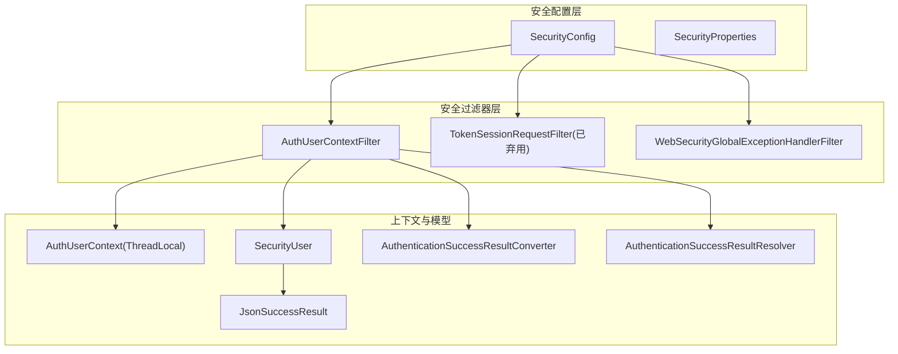
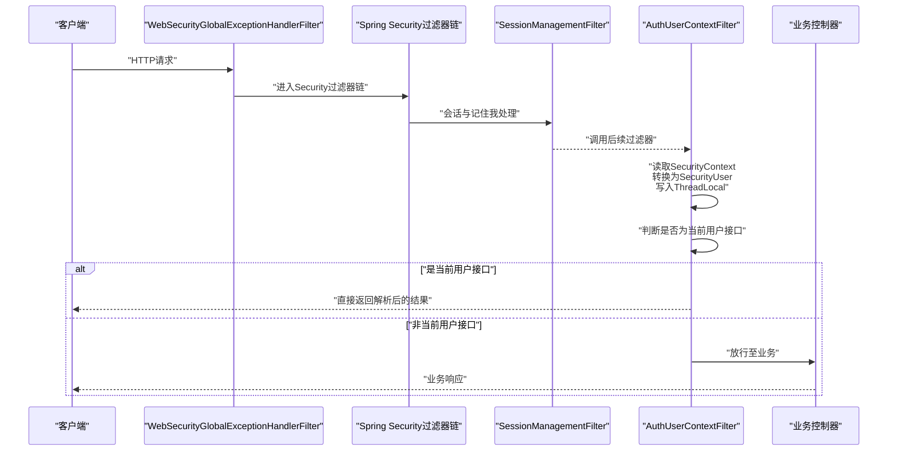
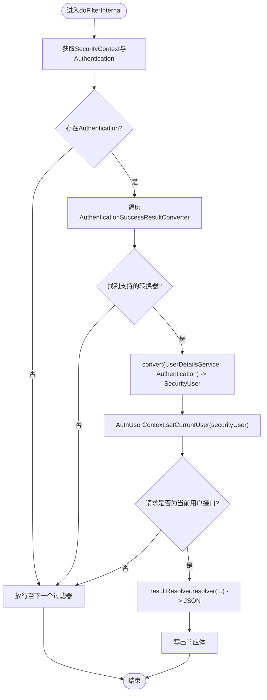
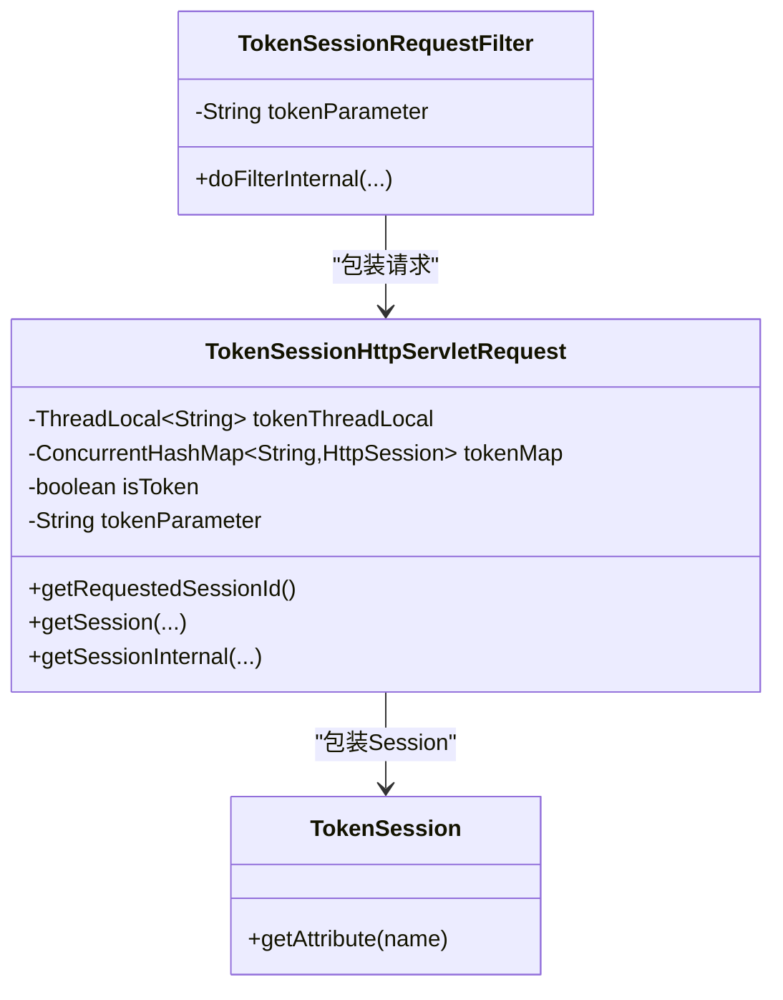
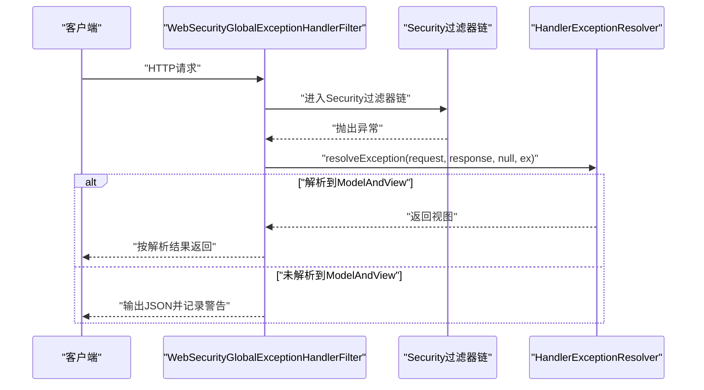
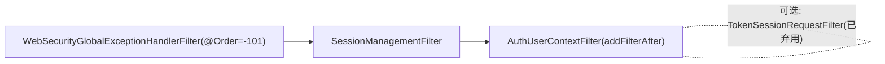
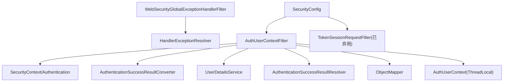

# 认证过滤器链

<cite>
**本文引用的文件**
- [AuthUserContextFilter.java](file://qy-auth/auth-spring-boot-starter/src/main/java/com/kewen/framework/auth/security/filter/AuthUserContextFilter.java)
- [TokenSessionRequestFilter.java](file://qy-auth/auth-spring-boot-starter/src/main/java/com/kewen/framework/auth/security/filter/TokenSessionRequestFilter.java)
- [WebSecurityGlobalExceptionHandlerFilter.java](file://qy-auth/auth-spring-boot-starter/src/main/java/com/kewen/framework/auth/security/filter/WebSecurityGlobalExceptionHandlerFilter.java)
- [SecurityConfig.java](file://qy-auth/auth-spring-boot-starter/src/main/java/com/kewen/framework/auth/security/config/SecurityConfig.java)
- [SecurityProperties.java](file://qy-auth/auth-spring-boot-starter/src/main/java/com/kewen/framework/auth/security/properties/SecurityProperties.java)
- [AuthUserContext.java](file://qy-auth/auth-core/src/main/java/com/kewen/framework/auth/core/AuthUserContext.java)
- [AuthenticationSuccessResultConverter.java](file://qy-auth/auth-spring-boot-starter/src/main/java/com/kewen/framework/auth/security/response/AuthenticationSuccessResultConverter.java)
- [AuthenticationSuccessResultResolver.java](file://qy-auth/auth-spring-boot-starter/src/main/java/com/kewen/framework/auth/security/response/AuthenticationSuccessResultResolver.java)
- [SecurityUser.java](file://qy-auth/auth-spring-boot-starter/src/main/java/com/kewen/framework/auth/security/model/SecurityUser.java)
- [JsonSuccessResult.java](file://qy-auth/auth-spring-boot-starter/src/main/java/com/kewen/framework/auth/security/response/JsonSuccessResult.java)
- [HttpSecurityCustomizer.java](file://qy-auth/auth-spring-boot-starter/src/main/java/com/kewen/framework/auth/security/config/HttpSecurityCustomizer.java)
- [NoLoginException.java](file://qy-auth/auth-spring-boot-starter/src/main/java/com/kewen/framework/auth/security/exception/NoLoginException.java)
- [application.yml](file://sample/auth-boot-sample/src/main/resources/application.yml)
</cite>

## 目录
1. [简介](#简介)
2. [项目结构](#项目结构)
3. [核心组件](#核心组件)
4. [架构总览](#架构总览)
5. [详细组件分析](#详细组件分析)
6. [依赖分析](#依赖分析)
7. [性能考虑](#性能考虑)
8. [故障排除指南](#故障排除指南)
9. [结论](#结论)
10. [附录](#附录)

## 简介
本文件面向认证过滤器链的技术文档，聚焦以下三个过滤器：
- AuthUserContextFilter：在登录后为每个请求设置用户上下文，支持“获取当前用户”直返能力与ThreadLocal管理。
- TokenSessionRequestFilter：历史遗留的基于Token的会话包装器（已标注弃用），曾尝试将Token映射为Session ID，现推荐使用标准的spring-session方案。
- WebSecurityGlobalExceptionHandlerFilter：在Spring Security过滤器链之前执行的全局异常捕获过滤器，负责兜底异常输出。

文档将从实现原理、请求拦截流程、上下文设置、ThreadLocal管理、令牌与会话处理、异常处理、执行顺序与相互关系、配置参数与扩展点、性能优化与故障排除等方面进行全面阐述，并提供使用示例与最佳实践。

## 项目结构
认证过滤器链位于安全模块中，核心类分布如下：
- 过滤器实现：auth-spring-boot-starter/filter
- 安全配置：auth-spring-boot-starter/config
- 安全属性：auth-spring-boot-starter/properties
- 用户上下文：auth-core/AuthUserContext
- 结果转换与解析：auth-spring-boot-starter/response
- 安全模型：auth-spring-boot-starter/model
- 示例配置：sample/auth-boot-sample/application.yml

图表来源
- [SecurityConfig.java:84-115](file://qy-auth/auth-spring-boot-starter/src/main/java/com/kewen/framework/auth/security/config/SecurityConfig.java#L84-L115)
- [AuthUserContextFilter.java:31-85](file://qy-auth/auth-spring-boot-starter/src/main/java/com/kewen/framework/auth/security/filter/AuthUserContextFilter.java#L31-L85)
- [TokenSessionRequestFilter.java:43-179](file://qy-auth/auth-spring-boot-starter/src/main/java/com/kewen/framework/auth/security/filter/TokenSessionRequestFilter.java#L43-L179)
- [WebSecurityGlobalExceptionHandlerFilter.java:21-64](file://qy-auth/auth-spring-boot-starter/src/main/java/com/kewen/framework/auth/security/filter/WebSecurityGlobalExceptionHandlerFilter.java#L21-L64)
- [AuthUserContext.java:16-32](file://qy-auth/auth-core/src/main/java/com/kewen/framework/auth/core/AuthUserContext.java#L16-L32)
- [SecurityUser.java:19-142](file://qy-auth/auth-spring-boot-starter/src/main/java/com/kewen/framework/auth/security/model/SecurityUser.java#L19-L142)
- [JsonSuccessResult.java:15-67](file://qy-auth/auth-spring-boot-starter/src/main/java/com/kewen/framework/auth/security/response/JsonSuccessResult.java#L15-L67)
- [AuthenticationSuccessResultConverter.java:7-30](file://qy-auth/auth-spring-boot-starter/src/main/java/com/kewen/framework/auth/security/response/AuthenticationSuccessResultConverter.java#L7-L30)
- [AuthenticationSuccessResultResolver.java:14-24](file://qy-auth/auth-spring-boot-starter/src/main/java/com/kewen/framework/auth/security/response/AuthenticationSuccessResultResolver.java#L14-L24)

章节来源
- [SecurityConfig.java:84-115](file://qy-auth/auth-spring-boot-starter/src/main/java/com/kewen/framework/auth/security/config/SecurityConfig.java#L84-L115)

## 核心组件
- AuthUserContextFilter：在SessionManagementFilter之后执行，从SecurityContext中提取Authentication，借助AuthenticationSuccessResultConverter与UserDetailsService构建SecurityUser，并写入AuthUserContext.ThreadLocal；若请求为“获取当前用户”，则直接返回解析后的结果。
- TokenSessionRequestFilter：对请求进行包装，尝试将Header中的Token作为Session ID使用，维护ThreadLocal与ConcurrentHashMap的Token-Session映射；该实现已弃用，建议使用spring-session的标准Header方案。
- WebSecurityGlobalExceptionHandlerFilter：在Security过滤器链之前执行（@Order(-101)），捕获异常并委托HandlerExceptionResolver统一解析，避免异常向上抛出导致Tomcat重定向。

章节来源
- [AuthUserContextFilter.java:31-85](file://qy-auth/auth-spring-boot-starter/src/main/java/com/kewen/framework/auth/security/filter/AuthUserContextFilter.java#L31-L85)
- [TokenSessionRequestFilter.java:43-179](file://qy-auth/auth-spring-boot-starter/src/main/java/com/kewen/framework/auth/security/filter/TokenSessionRequestFilter.java#L43-L179)
- [WebSecurityGlobalExceptionHandlerFilter.java:21-64](file://qy-auth/auth-spring-boot-starter/src/main/java/com/kewen/framework/auth/security/filter/WebSecurityGlobalExceptionHandlerFilter.java#L21-L64)

## 架构总览
认证过滤器链在Spring Security过滤器链中的位置与职责如下：
- WebSecurityGlobalExceptionHandlerFilter：最先执行，负责兜底异常。
- SecurityConfig：注册AuthUserContextFilter于SessionManagementFilter之后，确保在Spring Security完成remember-me与上下文解析后再注入用户上下文。
- AuthUserContextFilter：从SecurityContext中读取Authentication，转换为SecurityUser并写入ThreadLocal，支持“获取当前用户”直返。
- TokenSessionRequestFilter：历史实现，已弃用，不再推荐使用。

图表来源
- [SecurityConfig.java:107](file://qy-auth/auth-spring-boot-starter/src/main/java/com/kewen/framework/auth/security/config/SecurityConfig.java#L107)
- [AuthUserContextFilter.java:49-75](file://qy-auth/auth-spring-boot-starter/src/main/java/com/kewen/framework/auth/security/filter/AuthUserContextFilter.java#L49-L75)

## 详细组件分析

### AuthUserContextFilter 实现原理
- 请求拦截与上下文设置
  - 从SecurityContextHolder获取SecurityContext与Authentication。
  - 遍历AuthenticationSuccessResultConverter集合，选择支持当前Authentication类型的转换器，调用convert(UserDetailsService, Authentication)得到SecurityUser。
  - 将SecurityUser写入AuthUserContext.ThreadLocal，供后续业务读取。
- “获取当前用户”直返
  - 若请求URI等于SecurityProperties.currentUserUrl，则调用AuthenticationSuccessResultResolver解析为响应体，直接写出JSON。
- ThreadLocal管理
  - 使用AuthUserContext.ThreadLocal保存当前用户，便于业务层通过AuthUserContext.getCurrentUser()获取。
- 与Security过滤器链的关系
  - 在SessionManagementFilter之后执行，确保remember-me与上下文解析已完成。

图表来源
- [AuthUserContextFilter.java:49-75](file://qy-auth/auth-spring-boot-starter/src/main/java/com/kewen/framework/auth/security/filter/AuthUserContextFilter.java#L49-L75)
- [AuthUserContext.java:24-29](file://qy-auth/auth-core/src/main/java/com/kewen/framework/auth/core/AuthUserContext.java#L24-L29)
- [SecurityProperties.java:19](file://qy-auth/auth-spring-boot-starter/src/main/java/com/kewen/framework/auth/security/properties/SecurityProperties.java#L19)

章节来源
- [AuthUserContextFilter.java:31-85](file://qy-auth/auth-spring-boot-starter/src/main/java/com/kewen/framework/auth/security/filter/AuthUserContextFilter.java#L31-L85)
- [AuthUserContext.java:16-32](file://qy-auth/auth-core/src/main/java/com/kewen/framework/auth/core/AuthUserContext.java#L16-L32)
- [SecurityProperties.java:13-23](file://qy-auth/auth-spring-boot-starter/src/main/java/com/kewen/framework/auth/security/properties/SecurityProperties.java#L13-L23)

### TokenSessionRequestFilter 令牌处理与会话管理
- 设计目标
  - 曾尝试将请求Header中的Token作为Session ID使用，通过HttpServletRequestWrapper与StandardSessionFacade包装请求与Session。
- 关键机制
  - ThreadLocal保存当前请求的Token。
  - ConcurrentHashMap维护Token到HttpSession的映射。
  - getSession/getRequestedSessionId根据是否存在Token决定行为。
- 异常处理
  - 包装的TokenSession在访问失效Session属性时抛出CredentialsExpiredException，提示登录已过期。
- 状态与弃用说明
  - 已标注@Deprecated，推荐使用spring-session的HeaderHttpSessionIdResolver方案，无需自定义Token-Session映射。

图表来源
- [TokenSessionRequestFilter.java:43-179](file://qy-auth/auth-spring-boot-starter/src/main/java/com/kewen/framework/auth/security/filter/TokenSessionRequestFilter.java#L43-L179)

章节来源
- [TokenSessionRequestFilter.java:18-42](file://qy-auth/auth-spring-boot-starter/src/main/java/com/kewen/framework/auth/security/filter/TokenSessionRequestFilter.java#L18-L42)
- [TokenSessionRequestFilter.java:65-179](file://qy-auth/auth-spring-boot-starter/src/main/java/com/kewen/framework/auth/security/filter/TokenSessionRequestFilter.java#L65-L179)

### WebSecurityGlobalExceptionHandlerFilter 全局异常处理
- 执行顺序
  - 使用@Order(-101)，在Security过滤器链之前执行。
- 异常捕获与解析
  - 捕获Security过滤器链抛出的异常，委托HandlerExceptionResolver解析。
  - 若无解析器，回退输出JSON并记录警告。
- 特殊路径处理
  - 对“/error”路径进行日志记录与解析，避免错误页面重定向导致的异常传播。

图表来源
- [WebSecurityGlobalExceptionHandlerFilter.java:31-61](file://qy-auth/auth-spring-boot-starter/src/main/java/com/kewen/framework/auth/security/filter/WebSecurityGlobalExceptionHandlerFilter.java#L31-L61)

章节来源
- [WebSecurityGlobalExceptionHandlerFilter.java:16-64](file://qy-auth/auth-spring-boot-starter/src/main/java/com/kewen/framework/auth/security/filter/WebSecurityGlobalExceptionHandlerFilter.java#L16-L64)

### 执行顺序与相互关系
- WebSecurityGlobalExceptionHandlerFilter（@Order=-101）最先执行，负责兜底异常。
- SecurityConfig在HttpSecurity中通过addFilterAfter将AuthUserContextFilter注册在SessionManagementFilter之后，确保在Spring Security完成上下文解析后再注入用户上下文。
- TokenSessionRequestFilter为历史实现，已弃用，不参与当前主流会话方案。

图表来源
- [SecurityConfig.java:107](file://qy-auth/auth-spring-boot-starter/src/main/java/com/kewen/framework/auth/security/config/SecurityConfig.java#L107)
- [WebSecurityGlobalExceptionHandlerFilter.java:21](file://qy-auth/auth-spring-boot-starter/src/main/java/com/kewen/framework/auth/security/filter/WebSecurityGlobalExceptionHandlerFilter.java#L21)

章节来源
- [SecurityConfig.java:84-115](file://qy-auth/auth-spring-boot-starter/src/main/java/com/kewen/framework/auth/security/config/SecurityConfig.java#L84-L115)

### 配置参数与自定义扩展
- 安全属性（SecurityProperties）
  - currentUserUrl：当前用户接口地址，默认值由配置提供。
- 安全配置（SecurityConfig）
  - 注册AuthUserContextFilter于SessionManagementFilter之后。
  - 支持HttpSecurityCustomizer扩展，允许外部覆盖默认配置。
- 结果转换与解析
  - AuthenticationSuccessResultConverter：定义Authentication到JsonSuccessResult/SecurityUser的转换策略。
  - AuthenticationSuccessResultResolver：定义成功返回的解析策略。
- 模型与上下文
  - SecurityUser：承载用户基本信息与权限集合。
  - AuthUserContext：基于ThreadLocal的用户上下文容器。

章节来源
- [SecurityProperties.java:13-23](file://qy-auth/auth-spring-boot-starter/src/main/java/com/kewen/framework/auth/security/properties/SecurityProperties.java#L13-L23)
- [SecurityConfig.java:107](file://qy-auth/auth-spring-boot-starter/src/main/java/com/kewen/framework/auth/security/config/SecurityConfig.java#L107)
- [HttpSecurityCustomizer.java:11-18](file://qy-auth/auth-spring-boot-starter/src/main/java/com/kewen/framework/auth/security/config/HttpSecurityCustomizer.java#L11-L18)
- [AuthenticationSuccessResultConverter.java:7-30](file://qy-auth/auth-spring-boot-starter/src/main/java/com/kewen/framework/auth/security/response/AuthenticationSuccessResultConverter.java#L7-L30)
- [AuthenticationSuccessResultResolver.java:14-24](file://qy-auth/auth-spring-boot-starter/src/main/java/com/kewen/framework/auth/security/response/AuthenticationSuccessResultResolver.java#L14-L24)
- [SecurityUser.java:19-142](file://qy-auth/auth-spring-boot-starter/src/main/java/com/kewen/framework/auth/security/model/SecurityUser.java#L19-L142)
- [AuthUserContext.java:16-32](file://qy-auth/auth-core/src/main/java/com/kewen/framework/auth/core/AuthUserContext.java#L16-L32)

## 依赖分析
- 组件耦合
  - AuthUserContextFilter依赖SecurityContext、AuthenticationSuccessResultConverter、UserDetailsService、AuthenticationSuccessResultResolver与ObjectMapper。
  - AuthUserContext为纯ThreadLocal容器，低耦合。
  - WebSecurityGlobalExceptionHandlerFilter依赖HandlerExceptionResolver。
- 外部集成
  - SecurityConfig通过addFilterAfter将AuthUserContextFilter注入到Spring Security过滤器链中。
  - TokenSessionRequestFilter为历史实现，已弃用，不建议使用。

图表来源
- [AuthUserContextFilter.java:39-47](file://qy-auth/auth-spring-boot-starter/src/main/java/com/kewen/framework/auth/security/filter/AuthUserContextFilter.java#L39-L47)
- [WebSecurityGlobalExceptionHandlerFilter.java:25](file://qy-auth/auth-spring-boot-starter/src/main/java/com/kewen/framework/auth/security/filter/WebSecurityGlobalExceptionHandlerFilter.java#L25)
- [SecurityConfig.java:107](file://qy-auth/auth-spring-boot-starter/src/main/java/com/kewen/framework/auth/security/config/SecurityConfig.java#L107)

章节来源
- [AuthUserContextFilter.java:39-47](file://qy-auth/auth-spring-boot-starter/src/main/java/com/kewen/framework/auth/security/filter/AuthUserContextFilter.java#L39-L47)
- [WebSecurityGlobalExceptionHandlerFilter.java:25](file://qy-auth/auth-spring-boot-starter/src/main/java/com/kewen/framework/auth/security/filter/WebSecurityGlobalExceptionHandlerFilter.java#L25)
- [SecurityConfig.java:107](file://qy-auth/auth-spring-boot-starter/src/main/java/com/kewen/framework/auth/security/config/SecurityConfig.java#L107)

## 性能考虑
- 过滤器链顺序
  - WebSecurityGlobalExceptionHandlerFilter优先执行，避免异常在Security链中扩散，减少不必要的开销。
- AuthUserContextFilter
  - 仅在存在Authentication时进行上下文设置，避免空分支的额外处理。
  - “获取当前用户”直返逻辑避免进入业务层，降低延迟。
- TokenSessionRequestFilter
  - 已弃用，不建议使用自定义Token-Session映射，推荐spring-session的Header方案，减少额外的Map与ThreadLocal操作。
- 线程安全
  - AuthUserContext使用InheritableThreadLocal，适合Web请求场景；确保在请求结束时清理，避免内存泄漏。

[本节为通用性能建议，不涉及具体文件分析]

## 故障排除指南
- “获取当前用户”接口返回异常
  - 检查SecurityProperties.currentUserUrl配置是否正确。
  - 确认AuthUserContextFilter是否在SessionManagementFilter之后执行。
  - 排查AuthenticationSuccessResultResolver与ObjectMapper是否可用。
- 登录后无法获取用户上下文
  - 确认AuthenticationSuccessResultConverter是否支持当前Authentication类型。
  - 检查UserDetailsService是否能正确加载用户。
- 会话相关异常
  - TokenSessionRequestFilter已弃用，如仍使用可能导致会话状态异常；建议迁移至spring-session的Header方案。
  - 若出现“登录已过期”异常，检查TokenSession包装的Session是否被销毁。
- 全局异常未按预期返回
  - 检查WebSecurityGlobalExceptionHandlerFilter的@Order(-101)是否生效。
  - 确认HandlerExceptionResolver是否正确配置，避免异常向上抛出导致Tomcat重定向。

章节来源
- [TokenSessionRequestFilter.java:18-42](file://qy-auth/auth-spring-boot-starter/src/main/java/com/kewen/framework/auth/security/filter/TokenSessionRequestFilter.java#L18-L42)
- [WebSecurityGlobalExceptionHandlerFilter.java:31-61](file://qy-auth/auth-spring-boot-starter/src/main/java/com/kewen/framework/auth/security/filter/WebSecurityGlobalExceptionHandlerFilter.java#L31-L61)
- [NoLoginException.java:5-15](file://qy-auth/auth-spring-boot-starter/src/main/java/com/kewen/framework/auth/security/exception/NoLoginException.java#L5-L15)

## 结论
- AuthUserContextFilter在Security过滤器链中承担“用户上下文注入”的关键角色，结合ThreadLocal与结果解析器，实现高效、可扩展的用户态数据传递。
- TokenSessionRequestFilter为历史实现，已弃用，推荐使用spring-session的Header方案替代自定义Token-Session映射。
- WebSecurityGlobalExceptionHandlerFilter在Security之前兜底异常，保障异常处理的一致性与可控性。
- 通过SecurityConfig与HttpSecurityCustomizer，可灵活扩展与覆盖默认安全配置，满足不同业务场景需求。

[本节为总结性内容，不涉及具体文件分析]

## 附录

### 使用示例与最佳实践
- 获取当前用户
  - 请求路径：由SecurityProperties.currentUserUrl配置决定，默认值见配置文件。
  - 行为：AuthUserContextFilter直接解析并返回，无需进入业务层。
- 登录后上下文读取
  - 在业务层通过AuthUserContext.getCurrentUser()获取当前用户对象。
- 异常处理
  - 确保配置HandlerExceptionResolver，避免全局异常回退输出。
- 会话方案
  - 推荐使用spring-session的Header方案，避免自定义Token-Session映射带来的复杂性与风险。

章节来源
- [application.yml:50](file://sample/auth-boot-sample/src/main/resources/application.yml#L50)
- [AuthUserContextFilter.java:67-72](file://qy-auth/auth-spring-boot-starter/src/main/java/com/kewen/framework/auth/security/filter/AuthUserContextFilter.java#L67-L72)
- [AuthUserContext.java:24-29](file://qy-auth/auth-core/src/main/java/com/kewen/framework/auth/core/AuthUserContext.java#L24-L29)