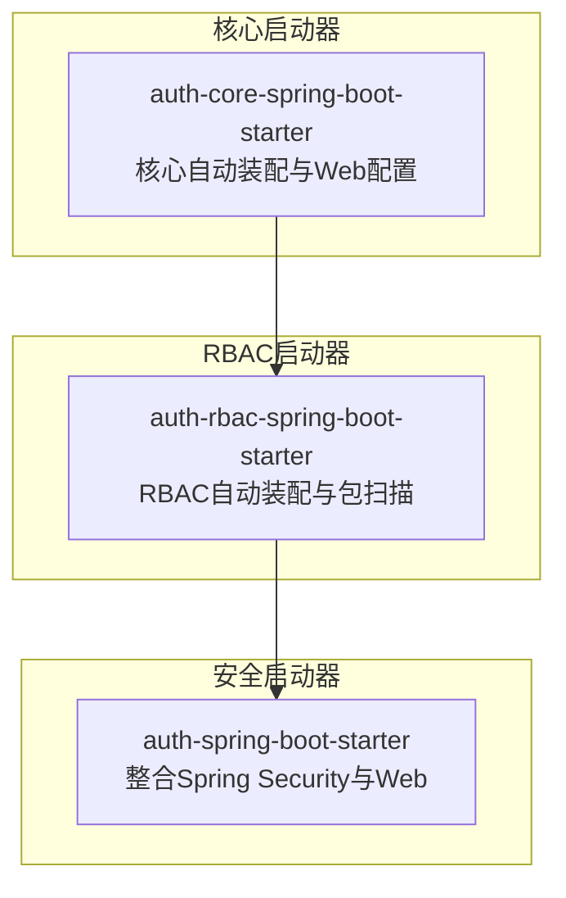
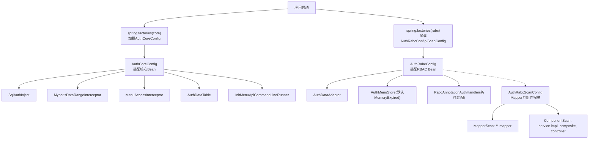
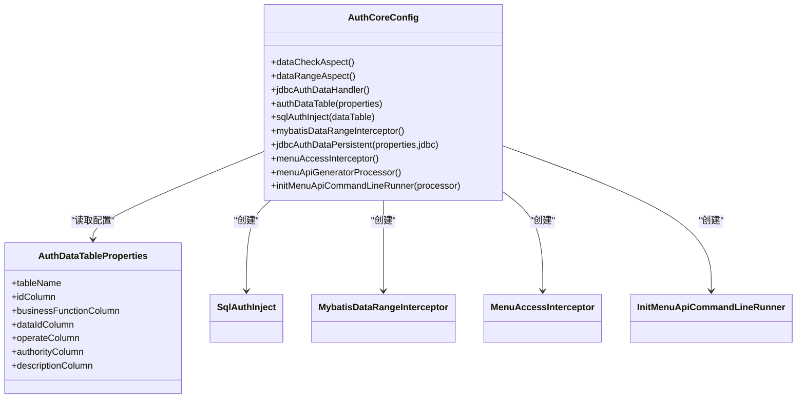
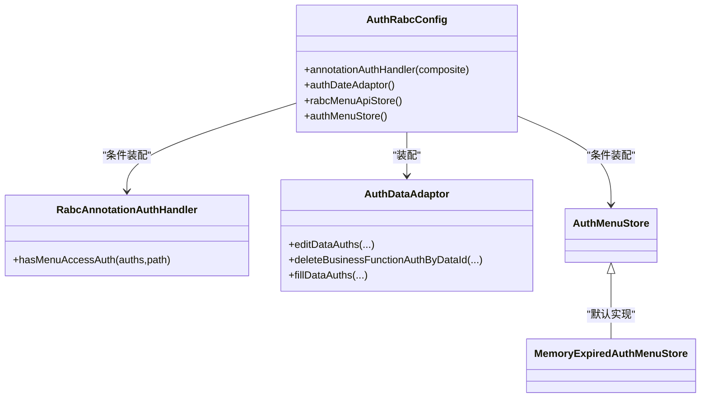
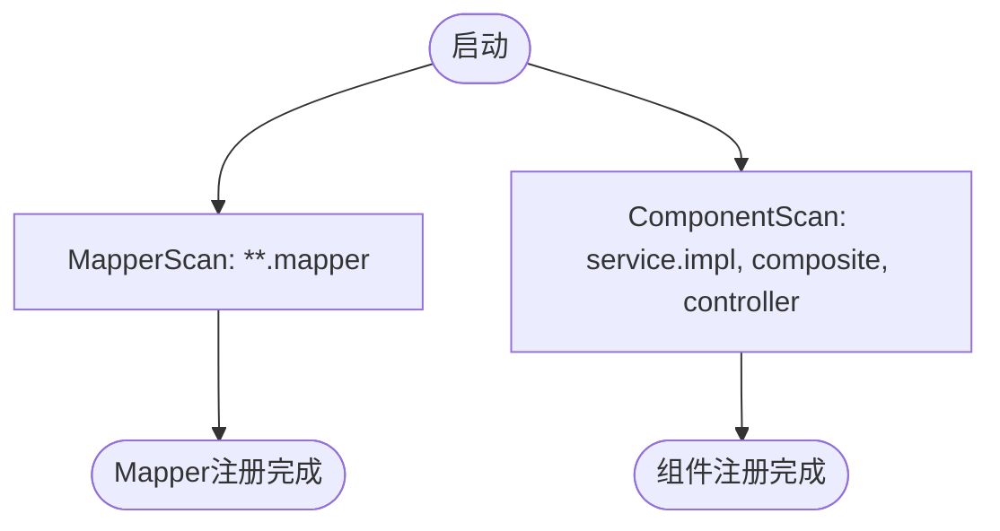
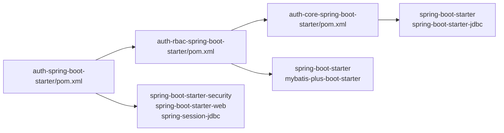

# 权限启动器 (auth-starters)

<cite>
**本文引用的文件**
- [AuthCoreConfig.java](file://qy-auth/auth-core-spring-boot-starter/src/main/java/com/kewen/framework/boot/auth/core/config/AuthCoreConfig.java)
- [AuthWebConfig.java](file://qy-auth/auth-core-spring-boot-starter/src/main/java/com/kewen/framework/boot/auth/core/config/AuthWebConfig.java)
- [AuthRabcConfig.java](file://qy-auth/auth-rbac-spring-boot-starter/src/main/java/com/kewen/framework/boot/auth/rabc/config/AuthRabcConfig.java)
- [AuthRabcScanConfig.java](file://qy-auth/auth-rbac-spring-boot-starter/src/main/java/com/kewen/framework/boot/auth/rabc/config/AuthRabcScanConfig.java)
- [AuthDataTableProperties.java](file://qy-auth/auth-core-spring-boot-starter/src/main/java/com/kewen/framework/boot/auth/core/properties/AuthDataTableProperties.java)
- [additional-spring-configuration-metadata.json](file://qy-auth/auth-core-spring-boot-starter/src/main/resources/META-INF/additional-spring-configuration-metadata.json)
- [spring.factories（core）](file://qy-auth/auth-core-spring-boot-starter/src/main/resources/META-INF/spring.factories)
- [spring.factories（rabc）](file://qy-auth/auth-rbac-spring-boot-starter/src/main/resources/META-INF/spring.factories)
- [auth-core-spring-boot-starter/pom.xml](file://qy-auth/auth-core-spring-boot-starter/pom.xml)
- [auth-rbac-spring-boot-starter/pom.xml](file://qy-auth/auth-rbac-spring-boot-starter/pom.xml)
- [auth-spring-boot-starter/pom.xml](file://qy-auth/auth-spring-boot-starter/pom.xml)
- [AuthDataAdaptor.java](file://qy-auth/auth-core/src/main/java/com/kewen/framework/auth/core/AuthDataAdaptor.java)
- [AuthDataHandler.java](file://qy-auth/auth-core/src/main/java/com/kewen/framework/auth/core/data/AuthDataHandler.java)
- [RabcAnnotationAuthHandler.java](file://qy-auth/auth-rbac/src/main/java/com/kewen/framework/auth/rabc/RabcAnnotationAuthHandler.java)
</cite>

## 目录
1. [简介](#简介)
2. [项目结构](#项目结构)
3. [核心组件](#核心组件)
4. [架构总览](#架构总览)
5. [详细组件分析](#详细组件分析)
6. [依赖分析](#依赖分析)
7. [性能考虑](#性能考虑)
8. [故障排除指南](#故障排除指南)
9. [结论](#结论)
10. [附录](#附录)

## 简介
本技术文档面向“权限启动器”模块，系统性阐述以下内容：
- AuthCoreConfig 自动配置类的实现原理：权限核心功能的自动装配与初始化流程。
- AuthRabcConfig 的 RBAC 自动配置机制：实体扫描、Mapper 注册、服务层自动配置等。
- AuthRabcScanConfig 的包扫描与组件注册机制。
- 启动器的配置属性与默认行为：启用条件、依赖关系与配置优先级。
- 使用指南与集成示例：Maven 依赖配置与基本使用方法。
- 与 Spring Boot 自动配置机制的集成方式与扩展点。
- 最佳实践与故障排除建议。

## 项目结构
权限启动器由三层模块组成：
- auth-core-spring-boot-starter：权限核心自动装配与 Web 配置。
- auth-rbac-spring-boot-starter：RBAC 自动装配、包扫描与组件注册。
- auth-spring-boot-starter：整合 Spring Security 与 Web 的完整权限启动器（可选，默认引入 RBAC 启动器）。

图表来源
- [spring.factories（core）](file://qy-auth/auth-core-spring-boot-starter/src/main/resources/META-INF/spring.factories)
- [spring.factories（rabc）](file://qy-auth/auth-rbac-spring-boot-starter/src/main/resources/META-INF/spring.factories)

章节来源
- [spring.factories（core）](file://qy-auth/auth-core-spring-boot-starter/src/main/resources/META-INF/spring.factories)
- [spring.factories（rabc）](file://qy-auth/auth-rbac-spring-boot-starter/src/main/resources/META-INF/spring.factories)

## 核心组件
本节聚焦于三个关键自动配置类及其职责：
- AuthCoreConfig：负责权限核心 Bean 的装配（数据权限、SQL 注入、MyBatis 拦截器、菜单拦截器、菜单 API 初始化等）。
- AuthWebConfig：注册 Web 层菜单访问拦截器。
- AuthRabcConfig：在引入 RBAC 实现后，装配注解权限处理器、菜单 API 服务与菜单存储等。
- AuthRabcScanConfig：声明 Mapper 扫描与组件扫描路径，确保 MyBatis Mapper 与服务实现被正确注册。

章节来源
- [AuthCoreConfig.java](file://qy-auth/auth-core-spring-boot-starter/src/main/java/com/kewen/framework/boot/auth/core/config/AuthCoreConfig.java)
- [AuthWebConfig.java](file://qy-auth/auth-core-spring-boot-starter/src/main/java/com/kewen/framework/boot/auth/core/config/AuthWebConfig.java)
- [AuthRabcConfig.java](file://qy-auth/auth-rbac-spring-boot-starter/src/main/java/com/kewen/framework/boot/auth/rabc/config/AuthRabcConfig.java)
- [AuthRabcScanConfig.java](file://qy-auth/auth-rbac-spring-boot-starter/src/main/java/com/kewen/framework/boot/auth/rabc/config/AuthRabcScanConfig.java)

## 架构总览
权限启动器通过 Spring Boot 的自动配置机制在应用启动时按需装配核心权限能力与 RBAC 能力，并提供 Web 层拦截与菜单 API 初始化。

图表来源
- [spring.factories（core）](file://qy-auth/auth-core-spring-boot-starter/src/main/resources/META-INF/spring.factories)
- [spring.factories（rabc）](file://qy-auth/auth-rbac-spring-boot-starter/src/main/resources/META-INF/spring.factories)
- [AuthCoreConfig.java](file://qy-auth/auth-core-spring-boot-starter/src/main/java/com/kewen/framework/boot/auth/core/config/AuthCoreConfig.java)
- [AuthRabcConfig.java](file://qy-auth/auth-rbac-spring-boot-starter/src/main/java/com/kewen/framework/boot/auth/rabc/config/AuthRabcConfig.java)
- [AuthRabcScanConfig.java](file://qy-auth/auth-rbac-spring-boot-starter/src/main/java/com/kewen/framework/boot/auth/rabc/config/AuthRabcScanConfig.java)

## 详细组件分析

### AuthCoreConfig 自动装配与初始化
- 功能定位：装配权限核心能力，包括数据权限切面、SQL 注入、MyBatis 数据范围拦截器、菜单访问拦截器以及菜单 API 初始化。
- 关键 Bean：
  - 数据校验切面：对注解驱动的数据权限进行前置校验。
  - 数据范围切面：对数据范围进行统一处理。
  - JDBC 权限处理器：基于 JDBC 的权限数据处理。
  - 权限表结构定义：通过配置属性映射到具体表字段。
  - SQL 注入器：将权限过滤逻辑注入到 SQL 执行链路。
  - MyBatis 拦截器：在 SQL 执行阶段动态注入数据范围过滤。
  - 菜单访问拦截器：在 MVC 层拦截请求并进行菜单访问控制。
  - 菜单 API 生成器与初始化 Runner：在应用启动时生成并初始化菜单 API。
- 初始化流程：应用启动时，Spring Boot 加载 spring.factories 中声明的 AuthCoreConfig，随后按顺序创建上述 Bean 并完成初始化。

图表来源
- [AuthCoreConfig.java](file://qy-auth/auth-core-spring-boot-starter/src/main/java/com/kewen/framework/boot/auth/core/config/AuthCoreConfig.java)
- [AuthDataTableProperties.java](file://qy-auth/auth-core-spring-boot-starter/src/main/java/com/kewen/framework/boot/auth/core/properties/AuthDataTableProperties.java)

章节来源
- [AuthCoreConfig.java](file://qy-auth/auth-core-spring-boot-starter/src/main/java/com/kewen/framework/boot/auth/core/config/AuthCoreConfig.java)
- [AuthWebConfig.java](file://qy-auth/auth-core-spring-boot-starter/src/main/java/com/kewen/framework/boot/auth/core/config/AuthWebConfig.java)

### AuthRabcConfig RBAC 自动配置机制
- 功能定位：在引入 RBAC 实现后，装配注解权限处理器、菜单 API 服务与菜单存储；提供数据权限适配器以支持在 Service 层直接调用。
- 关键 Bean：
  - 注解权限处理器：当系统中不存在自定义 AuthMenuHandler 时，自动装配默认的 RabcAnnotationAuthHandler。
  - 数据权限适配器：提供在 Service 层直接编辑/填充/删除数据权限的能力。
  - 菜单 API 服务：封装菜单 API 的持久化与查询。
  - 菜单存储：默认装配基于内存的带过期策略的菜单存储，可通过条件装配替换为其他实现。
- 条件装配：通过 @ConditionalOnMissingBean 控制在存在自定义实现时不重复装配。

图表来源
- [AuthRabcConfig.java](file://qy-auth/auth-rbac-spring-boot-starter/src/main/java/com/kewen/framework/boot/auth/rabc/config/AuthRabcConfig.java)
- [RabcAnnotationAuthHandler.java](file://qy-auth/auth-rbac/src/main/java/com/kewen/framework/auth/rabc/RabcAnnotationAuthHandler.java)
- [AuthDataAdaptor.java](file://qy-auth/auth-core/src/main/java/com/kewen/framework/auth/core/AuthDataAdaptor.java)

章节来源
- [AuthRabcConfig.java](file://qy-auth/auth-rbac-spring-boot-starter/src/main/java/com/kewen/framework/boot/auth/rabc/config/AuthRabcConfig.java)

### AuthRabcScanConfig 包扫描与组件注册
- Mapper 扫描：对 com.kewen.framework.auth.rabc.**.mapper 包下的 Mapper 接口进行扫描。
- 组件扫描：对 service.impl、composite、controller 三个包进行组件扫描，确保服务实现、组合器与控制器被注册为 Spring Bean。
- 作用：保证引入 RBAC 启动器后，业务侧的 Mapper 与服务实现能被自动发现与装配。

图表来源
- [AuthRabcScanConfig.java](file://qy-auth/auth-rbac-spring-boot-starter/src/main/java/com/kewen/framework/boot/auth/rabc/config/AuthRabcScanConfig.java)

章节来源
- [AuthRabcScanConfig.java](file://qy-auth/auth-rbac-spring-boot-starter/src/main/java/com/kewen/framework/boot/auth/rabc/config/AuthRabcScanConfig.java)

### 配置属性与默认行为
- 核心配置属性：
  - 表结构定义：通过 kewen.auth.auth-data-table.* 命名空间下的属性映射到权限表字段，包含表名、主键列、业务功能列、数据 ID 列、操作列、权限列与描述列。
  - 元数据声明：additional-spring-configuration-metadata.json 中声明了 kewen-framework.auth.cache-auth 的布尔型配置项与默认值。
- 默认行为：
  - 若未显式配置权限表字段，则采用默认字段名。
  - 菜单存储默认使用内存实现（带过期策略），可在应用侧替换为 Redis 等实现。
  - 注解权限处理器仅在未存在自定义 AuthMenuHandler 时装配。
- 配置优先级：
  - 代码中的默认值作为最低优先级。
  - application.yml 中的配置覆盖默认值。
  - 运行时通过环境变量或命令行参数覆盖配置亦可生效（遵循 Spring Boot 配置优先级）。

章节来源
- [AuthDataTableProperties.java](file://qy-auth/auth-core-spring-boot-starter/src/main/java/com/kewen/framework/boot/auth/core/properties/AuthDataTableProperties.java)
- [additional-spring-configuration-metadata.json](file://qy-auth/auth-core-spring-boot-starter/src/main/resources/META-INF/additional-spring-configuration-metadata.json)

### 使用指南与集成示例
- Maven 依赖（推荐）：
  - 引入完整权限启动器（含 Spring Security 与 Web）：在项目中添加对 auth-spring-boot-starter 的依赖。
  - 仅需核心与 RBAC 能力：引入 auth-rbac-spring-boot-starter，并按需引入 Spring Security 与 Web。
  - 仅需核心能力：引入 auth-core-spring-boot-starter，并按需引入 JDBC 与 Web。
- 基本使用：
  - 在应用配置文件中设置权限表字段映射与菜单缓存开关。
  - 引导应用启动后，自动装配完成，菜单拦截器生效，RBAC 注解处理器可用。
- 示例（概念性说明，非代码片段）：
  - 在 Controller 方法上使用菜单访问注解，请求进入时由 MenuAccessInterceptor 进行拦截判断。
  - 在 Service 层通过 AuthDataAdaptor 直接编辑/填充/删除数据权限，避免强依赖注解。

章节来源
- [auth-spring-boot-starter/pom.xml](file://qy-auth/auth-spring-boot-starter/pom.xml)
- [auth-rbac-spring-boot-starter/pom.xml](file://qy-auth/auth-rbac-spring-boot-starter/pom.xml)
- [auth-core-spring-boot-starter/pom.xml](file://qy-auth/auth-core-spring-boot-starter/pom.xml)

### 与 Spring Boot 自动配置的集成与扩展点
- 集成方式：
  - 通过 spring.factories 声明 EnableAutoConfiguration，使 Spring Boot 在启动时加载 AuthCoreConfig 与 AuthWebConfig。
  - 通过 spring.factories 声明 AuthRabcConfig 与 AuthRabcScanConfig，使 RBAC 能力按需装配。
- 扩展点：
  - 自定义 AuthMenuHandler：通过 @ConditionalOnMissingBean 机制，若应用提供自定义实现则不会装配默认处理器。
  - 替换菜单存储：通过 @ConditionalOnMissingBean 提供自定义 AuthMenuStore 实现。
  - 自定义权限表字段：通过配置属性覆盖默认字段映射。

章节来源
- [spring.factories（core）](file://qy-auth/auth-core-spring-boot-starter/src/main/resources/META-INF/spring.factories)
- [spring.factories（rabc）](file://qy-auth/auth-rbac-spring-boot-starter/src/main/resources/META-INF/spring.factories)
- [AuthRabcConfig.java](file://qy-auth/auth-rbac-spring-boot-starter/src/main/java/com/kewen/framework/boot/auth/rabc/config/AuthRabcConfig.java)

## 依赖分析
- 启动器间依赖：
  - auth-rbac-spring-boot-starter 依赖 auth-core-spring-boot-starter。
  - auth-spring-boot-starter 默认引入 auth-rbac-spring-boot-starter（可通过排除依赖禁用）。
- 外部依赖：
  - auth-core-spring-boot-starter：spring-boot-starter、spring-boot-starter-jdbc。
  - auth-rbac-spring-boot-starter：mybatis-plus-boot-starter。
  - auth-spring-boot-starter：spring-boot-starter-security、spring-boot-starter-web、spring-session-jdbc。

图表来源
- [auth-core-spring-boot-starter/pom.xml](file://qy-auth/auth-core-spring-boot-starter/pom.xml)
- [auth-rbac-spring-boot-starter/pom.xml](file://qy-auth/auth-rbac-spring-boot-starter/pom.xml)
- [auth-spring-boot-starter/pom.xml](file://qy-auth/auth-spring-boot-starter/pom.xml)

章节来源
- [auth-core-spring-boot-starter/pom.xml](file://qy-auth/auth-core-spring-boot-starter/pom.xml)
- [auth-rbac-spring-boot-starter/pom.xml](file://qy-auth/auth-rbac-spring-boot-starter/pom.xml)
- [auth-spring-boot-starter/pom.xml](file://qy-auth/auth-spring-boot-starter/pom.xml)

## 性能考虑
- 菜单缓存：可通过配置项开启菜单缓存以降低每次请求的菜单鉴权开销。
- 数据范围拦截：MyBatis 拦截器在 SQL 执行阶段注入过滤条件，建议合理设计索引与 SQL 结构以减少额外开销。
- 内存菜单存储：默认内存实现适合小规模场景；大规模或多实例部署建议替换为 Redis 等分布式存储。
- 初始化成本：菜单 API 初始化在应用启动时执行，建议在 CI/CD 中提前触发以降低首启延迟。

## 故障排除指南
- 问题：菜单拦截无效
  - 检查是否正确引入启动器并确认 AuthWebConfig 已生效。
  - 确认 MenuAccessInterceptor 已被注册到拦截器链。
- 问题：注解权限不生效
  - 若已提供自定义 AuthMenuHandler，将导致默认处理器不装配；请确认自定义实现逻辑。
  - 检查菜单路径与用户权限是否匹配。
- 问题：数据权限范围异常
  - 检查权限表字段映射配置是否与实际表结构一致。
  - 确认 MyBatis 拦截器是否成功注入过滤条件。
- 问题：菜单存储未生效
  - 确认是否自定义了 AuthMenuStore；若未自定义，将使用默认内存实现。
  - 如需分布式共享，请提供 Redis 实现并确保连接正常。

章节来源
- [AuthWebConfig.java](file://qy-auth/auth-core-spring-boot-starter/src/main/java/com/kewen/framework/boot/auth/core/config/AuthWebConfig.java)
- [AuthRabcConfig.java](file://qy-auth/auth-rbac-spring-boot-starter/src/main/java/com/kewen/framework/boot/auth/rabc/config/AuthRabcConfig.java)
- [AuthDataTableProperties.java](file://qy-auth/auth-core-spring-boot-starter/src/main/java/com/kewen/framework/boot/auth/core/properties/AuthDataTableProperties.java)

## 结论
权限启动器通过清晰的自动配置分层与条件装配机制，实现了从核心权限能力到 RBAC 能力的平滑集成。开发者只需引入相应启动器并按需配置，即可快速获得菜单拦截、数据权限、RBAC 注解与菜单 API 初始化等能力。通过扩展点与默认实现的结合，既能满足通用场景，也能灵活适配复杂需求。

## 附录
- 配置项参考（示例命名空间）
  - 权限表字段映射：kewen.auth.auth-data-table.*
  - 菜单缓存开关：kewen-framework.auth.cache-auth
- 常见目录与包
  - Mapper 扫描：com.kewen.framework.auth.rabc.**.mapper
  - 组件扫描：service.impl、composite、controller