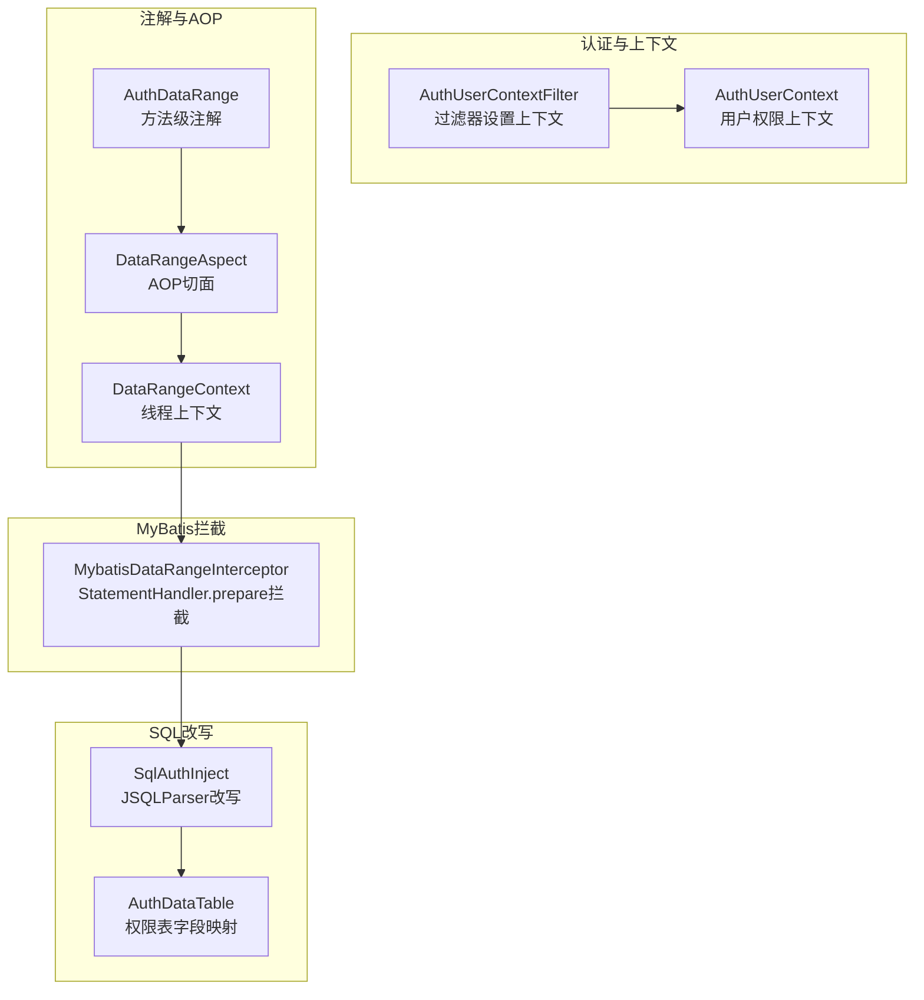
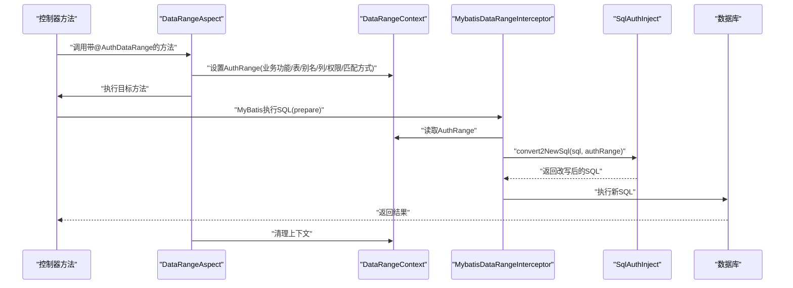
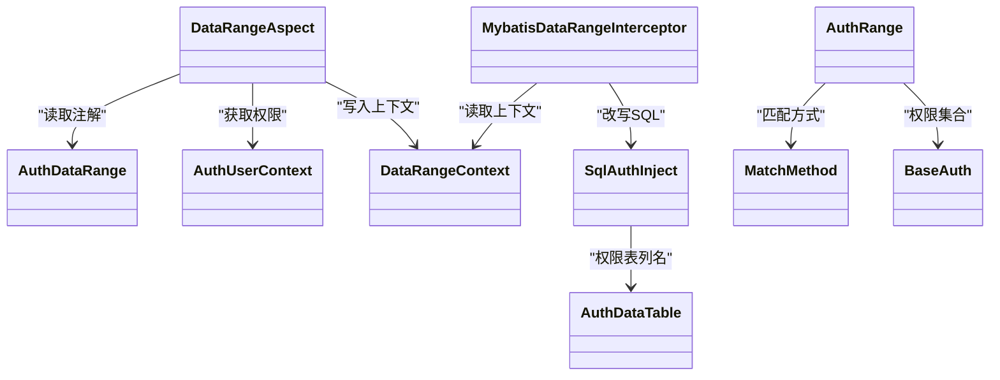
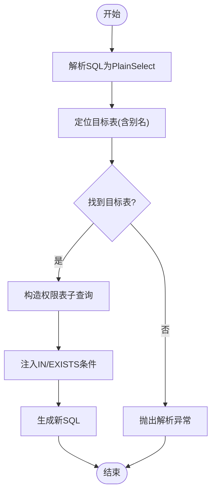

# 数据范围控制 (DataRangeControl)

<cite>
**本文引用的文件**
- [DataRangeContext.java](file://qy-auth/auth-core/src/main/java/com/kewen/framework/auth/core/data/range/DataRangeContext.java)
- [DataRangeAspect.java](file://qy-auth/auth-core/src/main/java/com/kewen/framework/auth/core/data/range/DataRangeAspect.java)
- [AuthRange.java](file://qy-auth/auth-core/src/main/java/com/kewen/framework/auth/core/data/range/AuthRange.java)
- [MatchMethod.java](file://qy-auth/auth-core/src/main/java/com/kewen/framework/auth/core/data/range/MatchMethod.java)
- [MybatisDataRangeInterceptor.java](file://qy-auth/auth-core/src/main/java/com/kewen/framework/auth/core/data/range/MybatisDataRangeInterceptor.java)
- [SqlAuthInject.java](file://qy-auth/auth-core/src/main/java/com/kewen/framework/auth/core/data/range/SqlAuthInject.java)
- [AuthDataRange.java](file://qy-auth/auth-core/src/main/java/com/kewen/framework/auth/core/AuthDataRange.java)
- [AuthUserContext.java](file://qy-auth/auth-core/src/main/java/com/kewen/framework/auth/core/AuthUserContext.java)
- [BaseAuth.java](file://qy-auth/auth-core/src/main/java/com/kewen/framework/auth/core/entity/BaseAuth.java)
- [AuthDataTable.java](file://qy-auth/auth-core/src/main/java/com/kewen/framework/auth/core/data/AuthDataTable.java)
- [AuthCoreConfig.java](file://qy-auth/auth-core-spring-boot-starter/src/main/java/com/kewen/framework/boot/auth/core/config/AuthCoreConfig.java)
- [AuthDataTableProperties.java](file://qy-auth/auth-core-spring-boot-starter/src/main/java/com/kewen/framework/boot/auth/core/properties/AuthDataTableProperties.java)
- [AuthUserContextFilter.java](file://qy-auth/auth-spring-boot-starter/src/main/java/com/kewen/framework/auth/security/filter/AuthUserContextFilter.java)
- [MybatisAuthSqlInjectTest.java](file://qy-auth/auth-core/src/test/java/com/kewen/framework/auth/core/data/range/MybatisAuthSqlInjectTest.java)
- [README_Auth.md](file://README_Auth.md)
</cite>

## 目录
1. [引言](#引言)
2. [项目结构](#项目结构)
3. [核心组件](#核心组件)
4. [架构总览](#架构总览)
5. [组件详解](#组件详解)
6. [依赖关系分析](#依赖关系分析)
7. [性能考量](#性能考量)
8. [故障排查指南](#故障排查指南)
9. [结论](#结论)
10. [附录](#附录)

## 引言
本技术文档围绕“数据范围控制”模块，系统性阐述从注解声明、AOP拦截、上下文传递、MyBatis 插件拦截到 SQL 改写的完整链路。重点包括：
- DataRangeContext 数据范围上下文的设计与线程安全使用
- DataRangeAspect AOP 切面如何将注解信息注入上下文
- AuthRange 权限范围模型的字段与用途
- MatchMethod 匹配策略（IN/EXISTS）的选择原则
- MybatisDataRangeInterceptor 拦截器的拦截点与懒加载策略
- SqlAuthInject SQL 注入器的解析与改写策略
- 完整使用示例与最佳实践
- 性能优化建议与常见问题排查

## 项目结构
数据范围控制相关代码位于 auth-core 模块的 data/range 包下，配合注解、用户上下文、MyBatis 插件与 SQL 解析库共同完成权限范围控制。

图表来源
- [AuthUserContext.java:16-31](file://qy-auth/auth-core/src/main/java/com/kewen/framework/auth/core/AuthUserContext.java#L16-L31)
- [AuthUserContextFilter.java:31-84](file://qy-auth/auth-spring-boot-starter/src/main/java/com/kewen/framework/auth/security/filter/AuthUserContextFilter.java#L31-L84)
- [AuthDataRange.java:27-72](file://qy-auth/auth-core/src/main/java/com/kewen/framework/auth/core/AuthDataRange.java#L27-L72)
- [DataRangeAspect.java:19-51](file://qy-auth/auth-core/src/main/java/com/kewen/framework/auth/core/data/range/DataRangeAspect.java#L19-L51)
- [DataRangeContext.java:9-24](file://qy-auth/auth-core/src/main/java/com/kewen/framework/auth/core/data/range/DataRangeContext.java#L9-L24)
- [MybatisDataRangeInterceptor.java:36-121](file://qy-auth/auth-core/src/main/java/com/kewen/framework/auth/core/data/range/MybatisDataRangeInterceptor.java#L36-L121)
- [SqlAuthInject.java:47-374](file://qy-auth/auth-core/src/main/java/com/kewen/framework/auth/core/data/range/SqlAuthInject.java#L47-L374)
- [AuthDataTable.java:14-86](file://qy-auth/auth-core/src/main/java/com/kewen/framework/auth/core/data/AuthDataTable.java#L14-L86)

章节来源
- [AuthDataRange.java:11-72](file://qy-auth/auth-core/src/main/java/com/kewen/framework/auth/core/AuthDataRange.java#L11-L72)
- [DataRangeAspect.java:14-51](file://qy-auth/auth-core/src/main/java/com/kewen/framework/auth/core/data/range/DataRangeAspect.java#L14-L51)
- [MybatisDataRangeInterceptor.java:22-121](file://qy-auth/auth-core/src/main/java/com/kewen/framework/auth/core/data/range/MybatisDataRangeInterceptor.java#L22-L121)
- [SqlAuthInject.java:23-374](file://qy-auth/auth-core/src/main/java/com/kewen/framework/auth/core/data/range/SqlAuthInject.java#L23-L374)

## 核心组件
- DataRangeContext：基于 InheritableThreadLocal 的线程上下文，承载一次请求内的权限范围信息
- DataRangeAspect：AOP 切面，拦截带有 AuthDataRange 注解的方法，将注解参数与用户权限注入上下文
- AuthRange：权限范围模型，封装业务功能、表名/别名、主键列、匹配方式、用户权限集合等
- MatchMethod：匹配策略枚举（IN/EXISTS），用于选择不同的 SQL 注入策略
- MybatisDataRangeInterceptor：MyBatis 插件，拦截 StatementHandler.prepare，按需改写 SQL
- SqlAuthInject：基于 JSQLParser 的 SQL 解析与改写器，生成 IN 或 EXISTS 子查询
- AuthDataRange：方法级注解，声明业务功能、表/别名、主键列、操作类型、匹配方式
- AuthUserContext：用户上下文，提供当前用户的 BaseAuth 权限集合
- AuthDataTable：权限表字段映射，提供权限表、业务功能、操作、权限列等名称

章节来源
- [DataRangeContext.java:9-24](file://qy-auth/auth-core/src/main/java/com/kewen/framework/auth/core/data/range/DataRangeContext.java#L9-L24)
- [DataRangeAspect.java:19-51](file://qy-auth/auth-core/src/main/java/com/kewen/framework/auth/core/data/range/DataRangeAspect.java#L19-L51)
- [AuthRange.java:14-49](file://qy-auth/auth-core/src/main/java/com/kewen/framework/auth/core/data/range/AuthRange.java#L14-L49)
- [MatchMethod.java:10-23](file://qy-auth/auth-core/src/main/java/com/kewen/framework/auth/core/data/range/MatchMethod.java#L10-L23)
- [MybatisDataRangeInterceptor.java:36-121](file://qy-auth/auth-core/src/main/java/com/kewen/framework/auth/core/data/range/MybatisDataRangeInterceptor.java#L36-L121)
- [SqlAuthInject.java:47-374](file://qy-auth/auth-core/src/main/java/com/kewen/framework/auth/core/data/range/SqlAuthInject.java#L47-L374)
- [AuthDataRange.java:27-72](file://qy-auth/auth-core/src/main/java/com/kewen/framework/auth/core/AuthDataRange.java#L27-L72)
- [AuthUserContext.java:16-31](file://qy-auth/auth-core/src/main/java/com/kewen/framework/auth/core/AuthUserContext.java#L16-L31)
- [AuthDataTable.java:14-86](file://qy-auth/auth-core/src/main/java/com/kewen/framework/auth/core/data/AuthDataTable.java#L14-L86)

## 架构总览
整体流程：控制器方法标注 AuthDataRange → AOP 切面将权限范围写入 DataRangeContext → MyBatis 拦截器读取上下文 → SqlAuthInject 解析 SQL 并注入权限条件 → 执行 SQL。

图表来源
- [DataRangeAspect.java:27-48](file://qy-auth/auth-core/src/main/java/com/kewen/framework/auth/core/data/range/DataRangeAspect.java#L27-L48)
- [DataRangeContext.java:13-21](file://qy-auth/auth-core/src/main/java/com/kewen/framework/auth/core/data/range/DataRangeContext.java#L13-L21)
- [MybatisDataRangeInterceptor.java:82-108](file://qy-auth/auth-core/src/main/java/com/kewen/framework/auth/core/data/range/MybatisDataRangeInterceptor.java#L82-L108)
- [SqlAuthInject.java:60-78](file://qy-auth/auth-core/src/main/java/com/kewen/framework/auth/core/data/range/SqlAuthInject.java#L60-L78)

## 组件详解

### DataRangeContext 数据范围上下文
- 设计要点
  - 使用 InheritableThreadLocal，保证父子线程间上下文可继承
  - 提供 get/set/clear 三元操作，生命周期与一次请求绑定
- 使用场景
  - AOP 切面在方法前后设置/清理上下文
  - MyBatis 拦截器在 SQL 执行前读取上下文决定是否注入

章节来源
- [DataRangeContext.java:9-24](file://qy-auth/auth-core/src/main/java/com/kewen/framework/auth/core/data/range/DataRangeContext.java#L9-L24)

### DataRangeAspect 数据范围切面
- 功能
  - 基于注解 AuthDataRange 的方法拦截
  - 从 AuthUserContext 获取当前用户 BaseAuth 集合
  - 构建 AuthRange 对象并写入 DataRangeContext
  - 方法执行完成后清理上下文
- 关键点
  - 注解参数 businessFunction、table、tableAlias、dataIdColumn、operate、matchMethod
  - 与 AuthUserContext 协作获取权限集合

章节来源
- [DataRangeAspect.java:19-51](file://qy-auth/auth-core/src/main/java/com/kewen/framework/auth/core/data/range/DataRangeAspect.java#L19-L51)
- [AuthDataRange.java:36-70](file://qy-auth/auth-core/src/main/java/com/kewen/framework/auth/core/AuthDataRange.java#L36-L70)
- [AuthUserContext.java:18-23](file://qy-auth/auth-core/src/main/java/com/kewen/framework/auth/core/AuthUserContext.java#L18-L23)

### AuthRange 权限范围模型
- 字段说明
  - businessFunction：业务功能标识
  - operate：操作类型（如 edit、unified）
  - table/tableAlias：目标业务表及别名（用于定位 SQL 中的表）
  - dataIdColumn：业务主键列名（默认 id）
  - authorities：用户权限集合（BaseAuth）
  - matchMethod：匹配方式（IN/EXISTS）

章节来源
- [AuthRange.java:14-49](file://qy-auth/auth-core/src/main/java/com/kewen/framework/auth/core/data/range/AuthRange.java#L14-L49)

### MatchMethod 匹配方法
- IN：适用于权限集合较小的情况，权限表数据量远小于业务表
- EXISTS：适用于权限集合较大的情况，避免 IN 列表过长
- 选择原则：小表驱动大表

章节来源
- [MatchMethod.java:10-23](file://qy-auth/auth-core/src/main/java/com/kewen/framework/auth/core/data/range/MatchMethod.java#L10-L23)

### MybatisDataRangeInterceptor 拦截器
- 拦截点：StatementHandler.prepare
- 行为
  - 读取 DataRangeContext，若为空则跳过
  - 通过 SqlAuthInject.convert2NewSql 获取改写后的 SQL
  - 反射设置 BoundSql 的 sql 字段
  - 继续执行原调用
- 初始化策略
  - MyBatis 插件早于 Spring 完成初始化，采用双重检查懒加载获取 SqlAuthInject Bean

章节来源
- [MybatisDataRangeInterceptor.java:36-121](file://qy-auth/auth-core/src/main/java/com/kewen/framework/auth/core/data/range/MybatisDataRangeInterceptor.java#L36-L121)

### SqlAuthInject SQL 注入器
- 解析与改写
  - 使用 JSQLParser 解析 SQL，定位 PlainSelect 与目标表
  - 支持主查询、子查询、JOIN 子查询、WITH 子句中的表匹配
  - 生成 IN 或 EXISTS 子查询，注入权限条件
- 注入策略
  - IN：主表主键 IN (SELECT data_id FROM auth_table WHERE ...)
  - EXISTS：WHERE EXISTS (SELECT 1 FROM auth_table WHERE 主表.主键=data_id AND ...)
- 权限条件
  - authority IN (用户权限集合)
  - business_function = 参数
  - operate = 参数

章节来源
- [SqlAuthInject.java:47-374](file://qy-auth/auth-core/src/main/java/com/kewen/framework/auth/core/data/range/SqlAuthInject.java#L47-L374)
- [AuthDataTable.java:14-86](file://qy-auth/auth-core/src/main/java/com/kewen/framework/auth/core/data/AuthDataTable.java#L14-L86)

### AuthDataRange 注解与配置
- 作用域：方法级
- 关键属性
  - businessFunction：必填，业务功能标识
  - table/tableAlias：多表联查时指定目标表与别名
  - dataIdColumn：默认 id
  - operate：默认 unified
  - matchMethod：默认 IN
- 使用建议
  - 仅在需要进行数据范围控制的查询方法上添加
  - 与 MyBatis Mapper 查询配合使用

章节来源
- [AuthDataRange.java:27-72](file://qy-auth/auth-core/src/main/java/com/kewen/framework/auth/core/AuthDataRange.java#L27-L72)
- [README_Auth.md:292-448](file://README_Auth.md#L292-L448)

### 用户上下文与权限集合
- AuthUserContext 提供当前用户的 BaseAuth 集合
- BaseAuth 是权限字符串的载体，包含权限标识与描述
- AuthUserContextFilter 在请求进入时设置当前用户上下文

章节来源
- [AuthUserContext.java:16-31](file://qy-auth/auth-core/src/main/java/com/kewen/framework/auth/core/AuthUserContext.java#L16-L31)
- [BaseAuth.java:12-61](file://qy-auth/auth-core/src/main/java/com/kewen/framework/auth/core/entity/BaseAuth.java#L12-L61)
- [AuthUserContextFilter.java:31-84](file://qy-auth/auth-spring-boot-starter/src/main/java/com/kewen/framework/auth/security/filter/AuthUserContextFilter.java#L31-L84)

### 权限表字段映射
- AuthDataTable 定义权限表的列名映射，包括：
  - 权限表名、id、业务功能、data_id、operate、authority、description
- 用于 SqlAuthInject 构造权限表查询条件

章节来源
- [AuthDataTable.java:14-86](file://qy-auth/auth-core/src/main/java/com/kewen/framework/auth/core/data/AuthDataTable.java#L14-L86)

## 依赖关系分析
- 组件耦合
  - DataRangeAspect 依赖 AuthUserContext 与 AuthDataRange
  - DataRangeContext 作为轻量级上下文被切面与拦截器共享
  - MybatisDataRangeInterceptor 依赖 DataRangeContext 与 SqlAuthInject
  - SqlAuthInject 依赖 AuthDataTable 与 JSQLParser
- 外部依赖
  - MyBatis 插件机制
  - Spring 上下文（懒加载 Bean）
  - JSQLParser SQL 解析库

图表来源
- [DataRangeAspect.java:27-48](file://qy-auth/auth-core/src/main/java/com/kewen/framework/auth/core/data/range/DataRangeAspect.java#L27-L48)
- [DataRangeContext.java:13-21](file://qy-auth/auth-core/src/main/java/com/kewen/framework/auth/core/data/range/DataRangeContext.java#L13-L21)
- [MybatisDataRangeInterceptor.java:82-108](file://qy-auth/auth-core/src/main/java/com/kewen/framework/auth/core/data/range/MybatisDataRangeInterceptor.java#L82-L108)
- [SqlAuthInject.java:60-78](file://qy-auth/auth-core/src/main/java/com/kewen/framework/auth/core/data/range/SqlAuthInject.java#L60-L78)
- [AuthRange.java:14-49](file://qy-auth/auth-core/src/main/java/com/kewen/framework/auth/core/data/range/AuthRange.java#L14-L49)
- [AuthDataTable.java:14-86](file://qy-auth/auth-core/src/main/java/com/kewen/framework/auth/core/data/AuthDataTable.java#L14-L86)

## 性能考量
- 匹配策略选择
  - 权限集合较小时优先 IN；权限集合较大时优先 EXISTS，避免 IN 列表过大导致性能下降
- SQL 解析成本
  - JSQLParser 解析 SQL 有一定开销，建议仅在必要时启用（由 DataRangeContext 是否为空决定）
- 懒加载与线程安全
  - MyBatis 插件 Bean 采用双重检查懒加载，避免启动期依赖 Spring 容器
  - DataRangeContext 使用 InheritableThreadLocal，确保并发安全与父子线程继承
- 权限表设计
  - 权限表应建立合适的索引（authority、business_function、operate），提升子查询效率

## 故障排查指南
- 现象：SQL 未注入权限条件
  - 检查方法是否标注 AuthDataRange
  - 检查 DataRangeContext 是否在切面内正确设置与清理
  - 检查 MyBatis 拦截器是否生效（日志级别 debug）
- 现象：找不到目标表
  - 确认 table 与 tableAlias 配置是否与 SQL 中一致
  - 检查是否在子查询、JOIN、WITH 子句中正确匹配
- 现象：权限条件未生效
  - 检查 AuthDataTable 的列名映射是否与实际表一致
  - 检查用户权限集合是否为空（AuthUserContext.getAuths()）
- 现象：性能异常
  - 切换匹配方式（IN/EXISTS）
  - 优化权限表索引与统计信息

章节来源
- [MybatisDataRangeInterceptor.java:82-108](file://qy-auth/auth-core/src/main/java/com/kewen/framework/auth/core/data/range/MybatisDataRangeInterceptor.java#L82-L108)
- [SqlAuthInject.java:127-153](file://qy-auth/auth-core/src/main/java/com/kewen/framework/auth/core/data/range/SqlAuthInject.java#L127-L153)
- [AuthDataTable.java:62-82](file://qy-auth/auth-core/src/main/java/com/kewen/framework/auth/core/data/AuthDataTable.java#L62-L82)
- [AuthUserContext.java:18-23](file://qy-auth/auth-core/src/main/java/com/kewen/framework/auth/core/AuthUserContext.java#L18-L23)

## 结论
数据范围控制模块通过注解声明、AOP 注入、MyBatis 拦截与 SQL 改写形成闭环，既保证了业务代码的简洁性，又实现了细粒度的数据权限控制。合理选择匹配策略、正确配置权限表字段映射与注解参数，是发挥该模块能力的关键。

## 附录

### 使用示例（步骤说明）
- 步骤一：在控制器方法上添加 AuthDataRange 注解，填写 businessFunction 等必要参数
- 步骤二：确保用户上下文已设置（AuthUserContextFilter 已在安全过滤器链中设置）
- 步骤三：执行 MyBatis 查询，拦截器自动注入权限条件
- 步骤四：验证 SQL 改写结果与权限效果

参考路径
- [AuthDataRange.java:27-72](file://qy-auth/auth-core/src/main/java/com/kewen/framework/auth/core/AuthDataRange.java#L27-L72)
- [AuthUserContextFilter.java:31-84](file://qy-auth/auth-spring-boot-starter/src/main/java/com/kewen/framework/auth/security/filter/AuthUserContextFilter.java#L31-L84)
- [README_Auth.md:372-394](file://README_Auth.md#L372-L394)

### SQL 改写流程图

图表来源
- [SqlAuthInject.java:60-78](file://qy-auth/auth-core/src/main/java/com/kewen/framework/auth/core/data/range/SqlAuthInject.java#L60-L78)
- [SqlAuthInject.java:127-243](file://qy-auth/auth-core/src/main/java/com/kewen/framework/auth/core/data/range/SqlAuthInject.java#L127-L243)

### 配置与扩展
- 权限表字段映射可通过 AuthDataTableProperties 与 AuthCoreConfig 进行配置
- 若需自定义权限表列名，可在 AuthDataTable 中调整字段映射

章节来源
- [AuthCoreConfig.java:66-78](file://qy-auth/auth-core-spring-boot-starter/src/main/java/com/kewen/framework/boot/auth/core/config/AuthCoreConfig.java#L66-L78)
- [AuthDataTableProperties.java:14-109](file://qy-auth/auth-core-spring-boot-starter/src/main/java/com/kewen/framework/boot/auth/core/properties/AuthDataTableProperties.java#L14-L109)