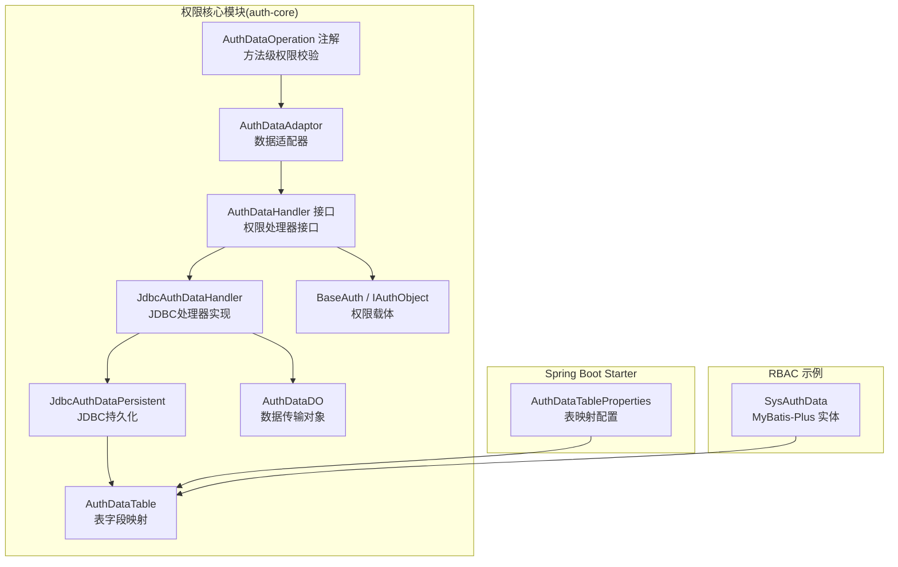
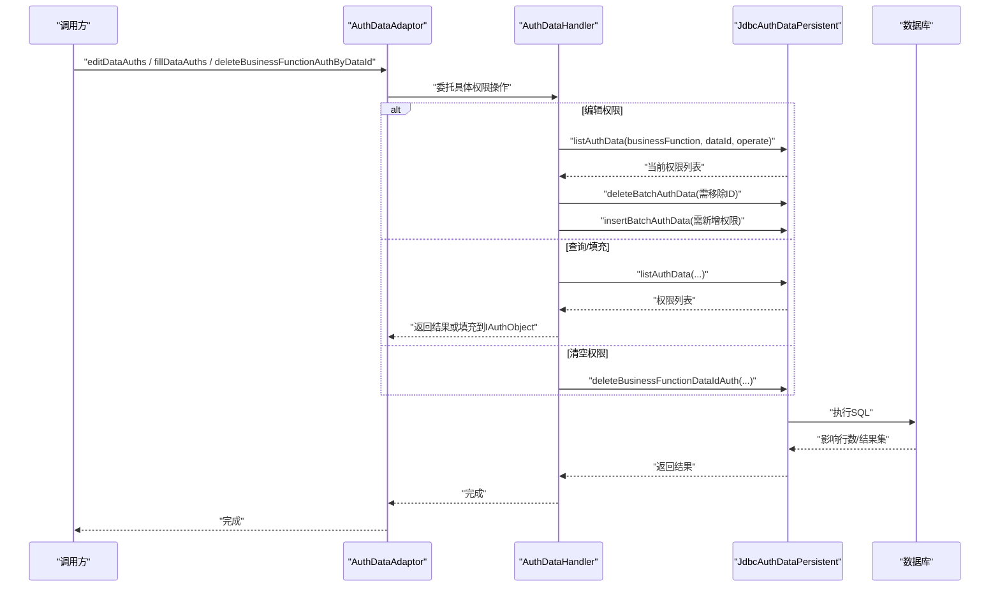
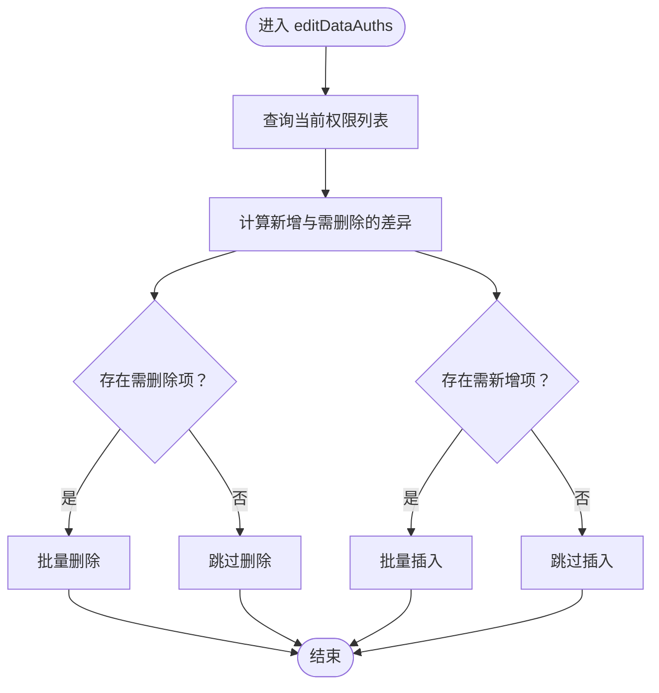
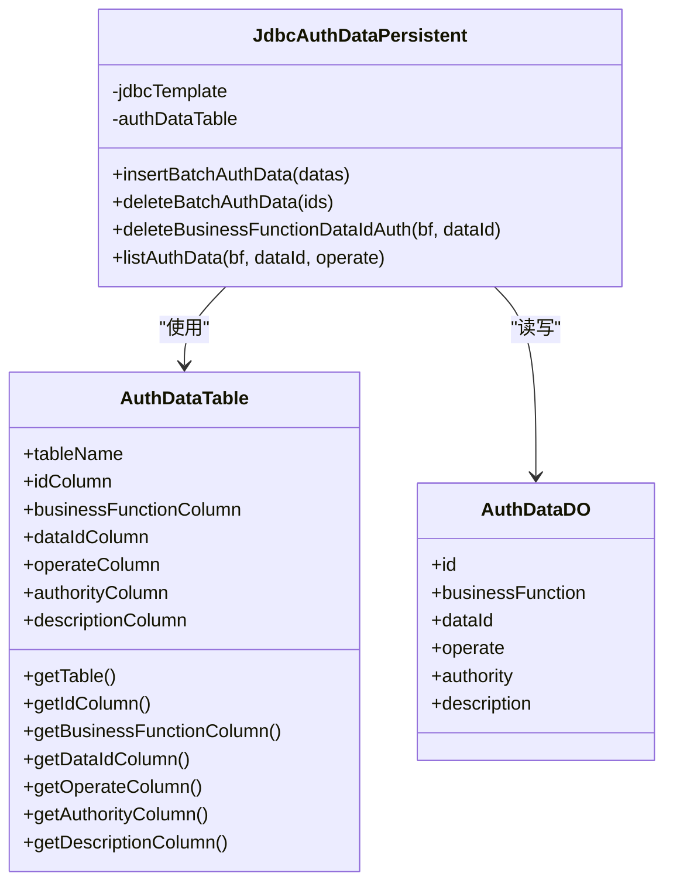
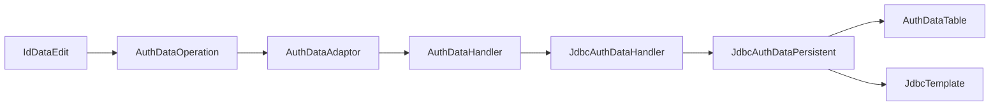

# 权限数据处理 (AuthDataProcessing)

<cite>
**本文引用的文件**
- [AuthDataAdaptor.java](file://qy-auth/auth-core/src/main/java/com/kewen/framework/auth/core/AuthDataAdaptor.java)
- [AuthDataOperation.java](file://qy-auth/auth-core/src/main/java/com/kewen/framework/auth/core/AuthDataOperation.java)
- [AuthDataDO.java](file://qy-auth/auth-core/src/main/java/com/kewen/framework/auth/core/data/AuthDataDO.java)
- [AuthDataHandler.java](file://qy-auth/auth-core/src/main/java/com/kewen/framework/auth/core/data/AuthDataHandler.java)
- [AuthDataTable.java](file://qy-auth/auth-core/src/main/java/com/kewen/framework/auth/core/data/AuthDataTable.java)
- [JdbcAuthDataHandler.java](file://qy-auth/auth-core/src/main/java/com/kewen/framework/auth/core/data/JdbcAuthDataHandler.java)
- [JdbcAuthDataPersistent.java](file://qy-auth/auth-core/src/main/java/com/kewen/framework/auth/core/data/JdbcAuthDataPersistent.java)
- [BaseAuth.java](file://qy-auth/auth-core/src/main/java/com/kewen/framework/auth/core/entity/BaseAuth.java)
- [IAuthObject.java](file://qy-auth/auth-core/src/main/java/com/kewen/framework/auth/core/entity/IAuthObject.java)
- [IdDataEdit.java](file://qy-auth/auth-core/src/main/java/com/kewen/framework/auth/core/data/edit/IdDataEdit.java)
- [AuthDataTableProperties.java](file://qy-auth/auth-core-spring-boot-starter/src/main/java/com/kewen/framework/boot/auth/core/properties/AuthDataTableProperties.java)
- [SysAuthData.java](file://qy-auth/auth-rbac/src/main/java/com/kewen/framework/auth/rabc/mp/entity/SysAuthData.java)
</cite>

## 目录
1. [引言](#引言)
2. [项目结构](#项目结构)
3. [核心组件](#核心组件)
4. [架构总览](#架构总览)
5. [详细组件分析](#详细组件分析)
6. [依赖分析](#依赖分析)
7. [性能考虑](#性能考虑)
8. [故障排查指南](#故障排查指南)
9. [结论](#结论)
10. [附录：使用示例与最佳实践](#附录使用示例与最佳实践)

## 引言
本文件系统性梳理权限数据处理模块（AuthDataProcessing）的设计与实现，覆盖数据适配器、权限操作注解、数据传输对象、处理器与持久化层的协作机制，以及基于 JDBC 的数据表映射与事务一致性策略。文档面向开发与运维人员，既提供高层架构视图，也给出代码级的流程图与类图，帮助快速理解与落地。

## 项目结构
权限数据处理模块位于 qy-auth/auth-core 子模块，围绕“注解驱动 + 数据适配器 + JDBC 处理器 + 持久化层”的分层设计展开；同时提供 Spring Boot Starter 配置以注入表映射参数，并在 RBAC 示例工程中提供 MyBatis-Plus 实体与 Mapper 作为参考实现。

图表来源
- [AuthDataAdaptor.java:12-44](file://qy-auth/auth-core/src/main/java/com/kewen/framework/auth/core/AuthDataAdaptor.java#L12-L44)
- [AuthDataHandler.java:16-77](file://qy-auth/auth-core/src/main/java/com/kewen/framework/auth/core/data/AuthDataHandler.java#L16-L77)
- [JdbcAuthDataHandler.java:18-76](file://qy-auth/auth-core/src/main/java/com/kewen/framework/auth/core/data/JdbcAuthDataHandler.java#L18-L76)
- [JdbcAuthDataPersistent.java:32-203](file://qy-auth/auth-core/src/main/java/com/kewen/framework/auth/core/data/JdbcAuthDataPersistent.java#L32-L203)
- [AuthDataDO.java:13-51](file://qy-auth/auth-core/src/main/java/com/kewen/framework/auth/core/data/AuthDataDO.java#L13-L51)
- [AuthDataTable.java:16-86](file://qy-auth/auth-core/src/main/java/com/kewen/framework/auth/core/data/AuthDataTable.java#L16-L86)
- [AuthDataOperation.java:25-41](file://qy-auth/auth-core/src/main/java/com/kewen/framework/auth/core/AuthDataOperation.java#L25-L41)
- [BaseAuth.java:12-61](file://qy-auth/auth-core/src/main/java/com/kewen/framework/auth/core/entity/BaseAuth.java#L12-L61)
- [IAuthObject.java:14-32](file://qy-auth/auth-core/src/main/java/com/kewen/framework/auth/core/entity/IAuthObject.java#L14-L32)
- [AuthDataTableProperties.java:14-110](file://qy-auth/auth-core-spring-boot-starter/src/main/java/com/kewen/framework/boot/auth/core/properties/AuthDataTableProperties.java#L14-L110)
- [SysAuthData.java:26-85](file://qy-auth/auth-rbac/src/main/java/com/kewen/framework/auth/rabc/mp/entity/SysAuthData.java#L26-L85)

章节来源
- [AuthDataAdaptor.java:12-44](file://qy-auth/auth-core/src/main/java/com/kewen/framework/auth/core/AuthDataAdaptor.java#L12-L44)
- [AuthDataHandler.java:16-77](file://qy-auth/auth-core/src/main/java/com/kewen/framework/auth/core/data/AuthDataHandler.java#L16-L77)
- [JdbcAuthDataHandler.java:18-76](file://qy-auth/auth-core/src/main/java/com/kewen/framework/auth/core/data/JdbcAuthDataHandler.java#L18-L76)
- [JdbcAuthDataPersistent.java:32-203](file://qy-auth/auth-core/src/main/java/com/kewen/framework/auth/core/data/JdbcAuthDataPersistent.java#L32-L203)
- [AuthDataDO.java:13-51](file://qy-auth/auth-core/src/main/java/com/kewen/framework/auth/core/data/AuthDataDO.java#L13-L51)
- [AuthDataTable.java:16-86](file://qy-auth/auth-core/src/main/java/com/kewen/framework/auth/core/data/AuthDataTable.java#L16-L86)
- [AuthDataOperation.java:25-41](file://qy-auth/auth-core/src/main/java/com/kewen/framework/auth/core/AuthDataOperation.java#L25-L41)
- [BaseAuth.java:12-61](file://qy-auth/auth-core/src/main/java/com/kewen/framework/auth/core/entity/BaseAuth.java#L12-L61)
- [IAuthObject.java:14-32](file://qy-auth/auth-core/src/main/java/com/kewen/framework/auth/core/entity/IAuthObject.java#L14-L32)
- [AuthDataTableProperties.java:14-110](file://qy-auth/auth-core-spring-boot-starter/src/main/java/com/kewen/framework/boot/auth/core/properties/AuthDataTableProperties.java#L14-L110)
- [SysAuthData.java:26-85](file://qy-auth/auth-rbac/src/main/java/com/kewen/framework/auth/rabc/mp/entity/SysAuthData.java#L26-L85)

## 核心组件
- 数据适配器：对外暴露简洁的编辑、填充、删除接口，屏蔽底层实现差异，便于在 Service 层直接调用。
- 权限处理器接口：定义“是否有权限”“编辑权限”“查询权限”“按业务+数据ID删除”等契约。
- JDBC 处理器：基于持久化层进行增删改查，采用“对比差异—批量删除—批量新增”的策略保持一致性。
- JDBC 持久化层：封装 SQL 构造与执行，支持批量插入、批量删除、按条件查询。
- 数据传输对象：承载权限记录的最小结构，包含业务功能、数据ID、操作、权限串与描述。
- 表映射模型：将逻辑字段映射到实际表列，支持配置化。
- 注解驱动：方法级权限校验注解，结合业务功能与操作类型进行判定。
- 权限载体：BaseAuth 与 IAuthObject 定义权限集合体的统一表示与填充方式。

章节来源
- [AuthDataAdaptor.java:12-44](file://qy-auth/auth-core/src/main/java/com/kewen/framework/auth/core/AuthDataAdaptor.java#L12-L44)
- [AuthDataHandler.java:16-77](file://qy-auth/auth-core/src/main/java/com/kewen/framework/auth/core/data/AuthDataHandler.java#L16-L77)
- [JdbcAuthDataHandler.java:18-76](file://qy-auth/auth-core/src/main/java/com/kewen/framework/auth/core/data/JdbcAuthDataHandler.java#L18-L76)
- [JdbcAuthDataPersistent.java:32-203](file://qy-auth/auth-core/src/main/java/com/kewen/framework/auth/core/data/JdbcAuthDataPersistent.java#L32-L203)
- [AuthDataDO.java:13-51](file://qy-auth/auth-core/src/main/java/com/kewen/framework/auth/core/data/AuthDataDO.java#L13-L51)
- [AuthDataTable.java:16-86](file://qy-auth/auth-core/src/main/java/com/kewen/framework/auth/core/data/AuthDataTable.java#L16-L86)
- [AuthDataOperation.java:25-41](file://qy-auth/auth-core/src/main/java/com/kewen/framework/auth/core/AuthDataOperation.java#L25-L41)
- [BaseAuth.java:12-61](file://qy-auth/auth-core/src/main/java/com/kewen/framework/auth/core/entity/BaseAuth.java#L12-L61)
- [IAuthObject.java:14-32](file://qy-auth/auth-core/src/main/java/com/kewen/framework/auth/core/entity/IAuthObject.java#L14-L32)

## 架构总览
整体采用“注解触发—适配器转发—处理器执行—持久化落库”的链路，JDBC 处理器通过持久化层构建 SQL 并执行，表映射由配置类与实体类共同决定。

图表来源
- [AuthDataAdaptor.java:12-44](file://qy-auth/auth-core/src/main/java/com/kewen/framework/auth/core/AuthDataAdaptor.java#L12-L44)
- [AuthDataHandler.java:16-77](file://qy-auth/auth-core/src/main/java/com/kewen/framework/auth/core/data/AuthDataHandler.java#L16-L77)
- [JdbcAuthDataHandler.java:18-76](file://qy-auth/auth-core/src/main/java/com/kewen/framework/auth/core/data/JdbcAuthDataHandler.java#L18-L76)
- [JdbcAuthDataPersistent.java:32-203](file://qy-auth/auth-core/src/main/java/com/kewen/framework/auth/core/data/JdbcAuthDataPersistent.java#L32-L203)

## 详细组件分析

### 数据适配器（AuthDataAdaptor）
- 设计理念：提供面向业务的统一入口，隐藏注解与处理器细节，允许在 Service 层直接调用，无需依赖特定注解。
- 适配流程：
  - 编辑权限：接收业务功能、数据ID、操作类型与权限集合，委托处理器执行。
  - 删除权限：按业务功能与数据ID清空该组合下的所有权限。
  - 填充权限：查询并回填到 IAuthObject 的权限属性中。
- 适用场景：非注解场景下的权限维护、批量导入/导出、跨模块权限同步。

章节来源
- [AuthDataAdaptor.java:12-44](file://qy-auth/auth-core/src/main/java/com/kewen/framework/auth/core/AuthDataAdaptor.java#L12-L44)

### 权限操作注解（AuthDataOperation）
- 作用：在方法上声明业务功能与操作类型，框架可据此进行权限校验。
- 关键点：
  - businessFunction：业务功能标识，用于区分不同业务域。
  - operate：操作类型，默认“unified”，可扩展为“modify”“update”“delete”等。
  - 与 IdDataEdit 结合：通过 IdDataEdit 提供 dataId，形成“业务功能+数据ID+操作”的判定三元组。

章节来源
- [AuthDataOperation.java:25-41](file://qy-auth/auth-core/src/main/java/com/kewen/framework/auth/core/AuthDataOperation.java#L25-L41)
- [IdDataEdit.java:8-15](file://qy-auth/auth-core/src/main/java/com/kewen/framework/auth/core/data/edit/IdDataEdit.java#L8-L15)

### 数据传输对象（AuthDataDO）
- 字段定义：
  - id：持久化主键（可选）。
  - businessFunction：业务功能。
  - dataId：业务数据ID。
  - operate：操作类型。
  - authority：权限字符串。
  - description：权限描述。
- 设计思路：最小可用结构，便于在处理器与持久化层之间传递；支持链式赋值提升可读性。

章节来源
- [AuthDataDO.java:13-51](file://qy-auth/auth-core/src/main/java/com/kewen/framework/auth/core/data/AuthDataDO.java#L13-L51)

### 权限处理器接口（AuthDataHandler）
- 职责边界：
  - hasDataOperateAuths：判断是否拥有某条数据的指定操作权限。
  - editDataAuths：编辑某条数据的权限集合。
  - getDataAuths：查询某条数据的权限集合。
  - fillDataAuths：将查询到的权限填充到 IAuthObject。
  - deleteBusinessFunctionAuthByDataId：按业务功能与数据ID清空权限。
- 泛型与默认实现：支持直接传入 IAuthObject，内部自动提取 BaseAuth 集合。

章节来源
- [AuthDataHandler.java:16-77](file://qy-auth/auth-core/src/main/java/com/kewen/framework/auth/core/data/AuthDataHandler.java#L16-L77)
- [IAuthObject.java:14-32](file://qy-auth/auth-core/src/main/java/com/kewen/framework/auth/core/entity/IAuthObject.java#L14-L32)
- [BaseAuth.java:12-61](file://qy-auth/auth-core/src/main/java/com/kewen/framework/auth/core/entity/BaseAuth.java#L12-L61)

### 数据处理器（JdbcAuthDataHandler）
- 实现模式：
  - 编辑权限：先查询现有权限，计算新增与需删除的差异，再分别执行批量删除与批量插入。
  - 权限判定：只要任一传入权限与已有权限匹配即视为通过。
  - 查询权限：返回权限集合，转换为 BaseAuth 列表。
  - 清空权限：按业务功能与数据ID删除该组合下的全部记录。
- 性能要点：通过一次查询与两次批量操作替代逐条更新，降低往返开销。

图表来源
- [JdbcAuthDataHandler.java:22-54](file://qy-auth/auth-core/src/main/java/com/kewen/framework/auth/core/data/JdbcAuthDataHandler.java#L22-L54)

章节来源
- [JdbcAuthDataHandler.java:18-76](file://qy-auth/auth-core/src/main/java/com/kewen/framework/auth/core/data/JdbcAuthDataHandler.java#L18-L76)

### 数据表映射（AuthDataTable）
- 字段映射：将逻辑列名映射到物理表列，提供 Table 与 Column 的便捷构造。
- 使用场景：与持久化层配合，生成标准 SQL 的表与列引用。

章节来源
- [AuthDataTable.java:16-86](file://qy-auth/auth-core/src/main/java/com/kewen/framework/auth/core/data/AuthDataTable.java#L16-L86)

### JDBC 数据处理器（JdbcAuthDataPersistent）
- 批量插入：使用 JsqlParser 组装多值 INSERT，减少网络往返。
- 批量删除：支持 Long/Integer/String 类型 ID 列表，构造 IN 表达式。
- 条件查询：按 businessFunction、dataId、operate 三元组查询，返回 AuthDataDO 列表。
- 清空权限：按 businessFunction 与 dataId 删除该组合下所有记录。
- 初始化校验：确保 JdbcTemplate 与 AuthDataTable 注入完成。

图表来源
- [JdbcAuthDataPersistent.java:32-203](file://qy-auth/auth-core/src/main/java/com/kewen/framework/auth/core/data/JdbcAuthDataPersistent.java#L32-L203)
- [AuthDataTable.java:16-86](file://qy-auth/auth-core/src/main/java/com/kewen/framework/auth/core/data/AuthDataTable.java#L16-L86)
- [AuthDataDO.java:13-51](file://qy-auth/auth-core/src/main/java/com/kewen/framework/auth/core/data/AuthDataDO.java#L13-L51)

章节来源
- [JdbcAuthDataPersistent.java:32-203](file://qy-auth/auth-core/src/main/java/com/kewen/framework/auth/core/data/JdbcAuthDataPersistent.java#L32-L203)

### 权限载体（BaseAuth 与 IAuthObject）
- BaseAuth：权限字符串与描述的载体，重写 equals/hashCode 以便集合比较。
- IAuthObject：权限集合体接口，支持从 BaseAuth 集合填充属性。

章节来源
- [BaseAuth.java:12-61](file://qy-auth/auth-core/src/main/java/com/kewen/framework/auth/core/entity/BaseAuth.java#L12-L61)
- [IAuthObject.java:14-32](file://qy-auth/auth-core/src/main/java/com/kewen/framework/auth/core/entity/IAuthObject.java#L14-L32)

### 表映射配置（AuthDataTableProperties）
- 作用：通过配置文件注入表名与各列名，驱动 AuthDataTable 的列映射。
- 默认值：提供常见字段默认名，便于快速接入。

章节来源
- [AuthDataTableProperties.java:14-110](file://qy-auth/auth-core-spring-boot-starter/src/main/java/com/kewen/framework/boot/auth/core/properties/AuthDataTableProperties.java#L14-L110)

### RBAC 实体映射（SysAuthData）
- 说明：RBAC 示例工程中的实体类，字段与 AuthDataDO 一一对应，便于 MyBatis-Plus 场景下的读写。
- 用途：当业务采用 ORM 框架而非纯 JDBC 时，可参考该实体进行适配。

章节来源
- [SysAuthData.java:26-85](file://qy-auth/auth-rbac/src/main/java/com/kewen/framework/auth/rabc/mp/entity/SysAuthData.java#L26-L85)

## 依赖分析
- 组件耦合：
  - AuthDataAdaptor 依赖 AuthDataHandler。
  - AuthDataHandler 由 JdbcAuthDataHandler 实现，后者依赖 JdbcAuthDataPersistent。
  - JdbcAuthDataPersistent 依赖 AuthDataTable 与 JdbcTemplate。
  - AuthDataOperation 与 IdDataEdit 协作，形成“业务功能+数据ID+操作”的权限判定三元组。
- 外部依赖：
  - JsqlParser：用于动态构造 SQL。
  - Spring JDBC Template：执行 SQL。
  - Spring Boot Starter：提供表映射配置注入。

图表来源
- [AuthDataAdaptor.java:12-44](file://qy-auth/auth-core/src/main/java/com/kewen/framework/auth/core/AuthDataAdaptor.java#L12-L44)
- [AuthDataHandler.java:16-77](file://qy-auth/auth-core/src/main/java/com/kewen/framework/auth/core/data/AuthDataHandler.java#L16-L77)
- [JdbcAuthDataHandler.java:18-76](file://qy-auth/auth-core/src/main/java/com/kewen/framework/auth/core/data/JdbcAuthDataHandler.java#L18-L76)
- [JdbcAuthDataPersistent.java:32-203](file://qy-auth/auth-core/src/main/java/com/kewen/framework/auth/core/data/JdbcAuthDataPersistent.java#L32-L203)
- [AuthDataTable.java:16-86](file://qy-auth/auth-core/src/main/java/com/kewen/framework/auth/core/data/AuthDataTable.java#L16-L86)
- [AuthDataOperation.java:25-41](file://qy-auth/auth-core/src/main/java/com/kewen/framework/auth/core/AuthDataOperation.java#L25-L41)
- [IdDataEdit.java:8-15](file://qy-auth/auth-core/src/main/java/com/kewen/framework/auth/core/data/edit/IdDataEdit.java#L8-L15)

## 性能考虑
- 批量操作：JdbcAuthDataHandler 在编辑权限时采用“先查后比对，再批量删与批量插”的策略，避免逐条更新带来的网络与锁竞争。
- SQL 构造：JdbcAuthDataPersistent 使用 JsqlParser 动态拼接 SQL，减少模板字符串拼接错误与 SQL 注入风险。
- 查询优化：listAuthData 仅选择必要列，减少网络传输与解析成本。
- 类型安全：在删除与查询中对 dataId 与 ID 类型进行严格校验，避免运行期异常导致的重试与回滚。

## 故障排查指南
- 初始化失败：JdbcAuthDataPersistent.afterPropertiesSet 中若未注入 JdbcTemplate 或 AuthDataTable，将抛出异常。请检查 Starter 配置与 Bean 注入。
- ID 类型异常：批量删除与清空权限时对 ID 类型进行严格校验，若传入未知类型会抛出异常。请确保 dataId 与权限记录 ID 的类型一致。
- 权限不生效：确认 AuthDataOperation 的 businessFunction 与 operate 与持久化记录一致；检查 IAuthObject 的 BaseAuth 集合是否正确填充。
- 配置不生效：检查 AuthDataTableProperties 的表名与列名是否与数据库一致。

章节来源
- [JdbcAuthDataPersistent.java:144-149](file://qy-auth/auth-core/src/main/java/com/kewen/framework/auth/core/data/JdbcAuthDataPersistent.java#L144-L149)
- [JdbcAuthDataPersistent.java:93-98](file://qy-auth/auth-core/src/main/java/com/kewen/framework/auth/core/data/JdbcAuthDataPersistent.java#L93-L98)
- [JdbcAuthDataPersistent.java:129-131](file://qy-auth/auth-core/src/main/java/com/kewen/framework/auth/core/data/JdbcAuthDataPersistent.java#L129-L131)
- [AuthDataTableProperties.java:14-110](file://qy-auth/auth-core-spring-boot-starter/src/main/java/com/kewen/framework/boot/auth/core/properties/AuthDataTableProperties.java#L14-L110)

## 结论
本模块通过“注解—适配器—处理器—持久化”的分层设计，提供了统一、可扩展且高性能的权限数据处理能力。JdbcAuthDataHandler 的差异对比与批量操作策略有效降低了并发冲突与数据库压力；配置化的表映射与清晰的 DTO 定义使得模块易于对接不同数据源与业务场景。

## 附录：使用示例与最佳实践
- 使用步骤
  - 在方法上添加 AuthDataOperation，声明 businessFunction 与 operate。
  - 在 Service 层通过 AuthDataAdaptor 调用 editDataAuths 填充/更新权限。
  - 若业务删除了某条数据，调用 deleteBusinessFunctionAuthByDataId 清空其权限。
- 最佳实践
  - operate 建议统一管理，避免散乱命名；businessFunction 与 dataId 必须与持久化记录一致。
  - 权限集合建议来源于 IAuthObject，确保 BaseAuth 的 equals/hashCode 语义正确。
  - 批量操作优先：在编辑权限时尽量合并多次变更，减少事务次数。
  - 事务管理：在 Service 层使用 @Transactional 包裹编辑流程，确保“先删后插”的原子性。
  - 配置校验：启动阶段验证 AuthDataTableProperties 与数据库表结构一致，避免运行期错误。