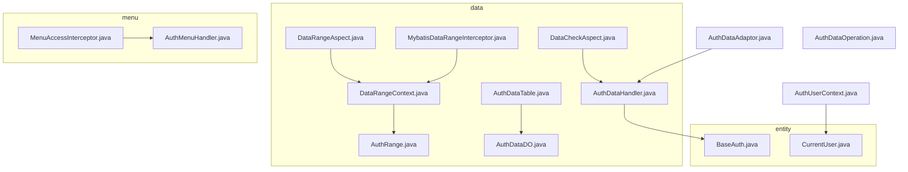
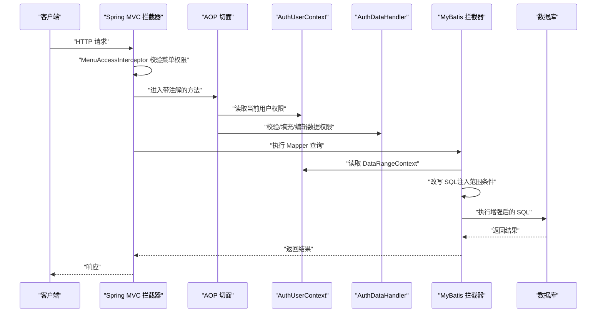
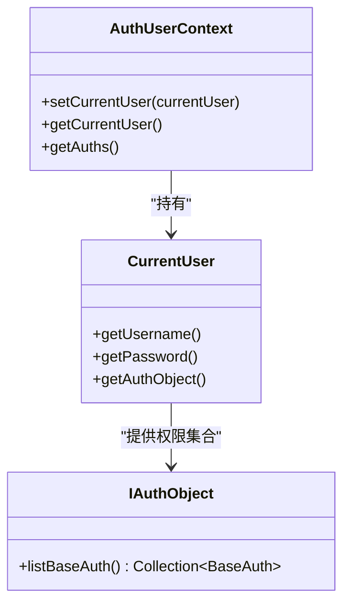
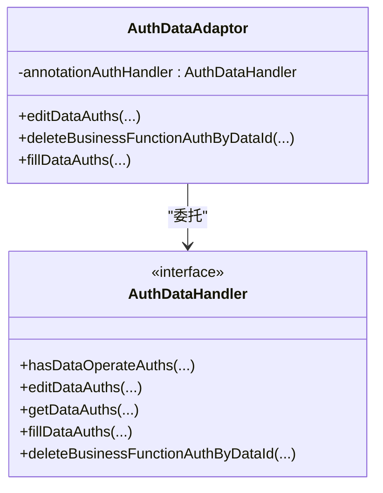
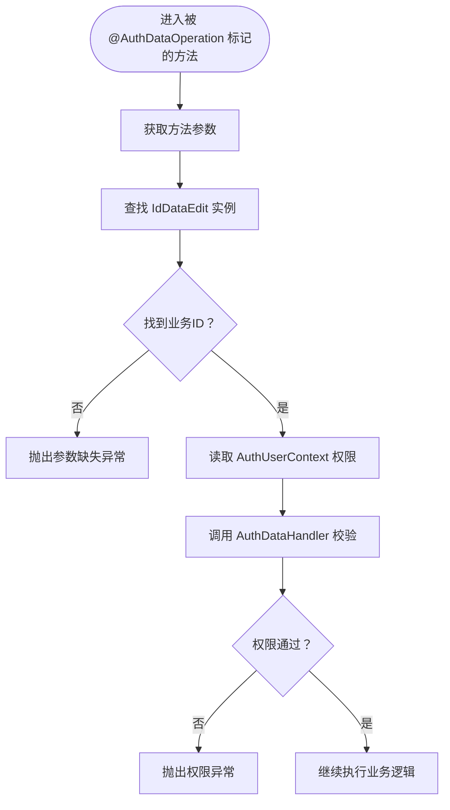
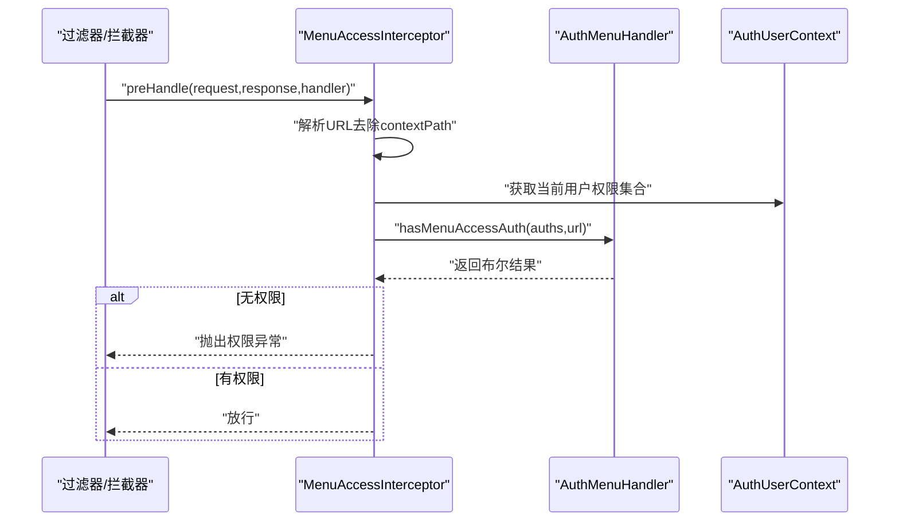
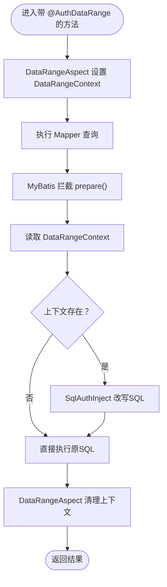
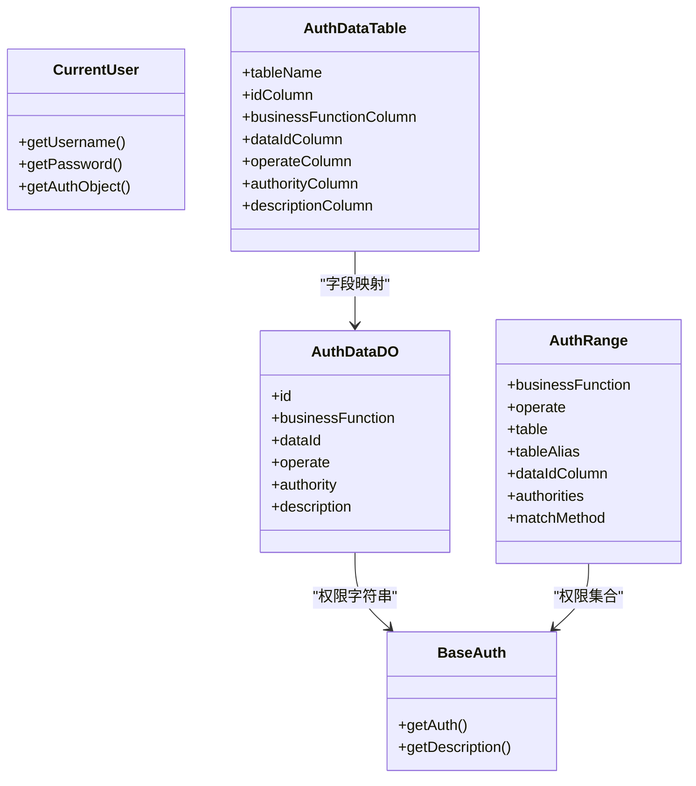
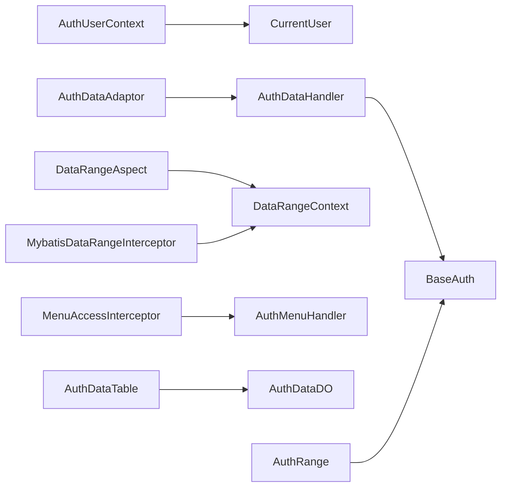

# 权限核心 (auth-core)

<cite>
**本文引用的文件**
- [AuthUserContext.java](file://qy-auth/auth-core/src/main/java/com/kewen/framework/auth/core/AuthUserContext.java)
- [AuthDataAdaptor.java](file://qy-auth/auth-core/src/main/java/com/kewen/framework/auth/core/AuthDataAdaptor.java)
- [AuthDataOperation.java](file://qy-auth/auth-core/src/main/java/com/kewen/framework/auth/core/AuthDataOperation.java)
- [AuthMenuHandler.java](file://qy-auth/auth-core/src/main/java/com/kewen/framework/auth/core/menu/AuthMenuHandler.java)
- [MenuAccessInterceptor.java](file://qy-auth/auth-core/src/main/java/com/kewen/framework/auth/core/menu/MenuAccessInterceptor.java)
- [DataRangeContext.java](file://qy-auth/auth-core/src/main/java/com/kewen/framework/auth/core/data/range/DataRangeContext.java)
- [DataRangeAspect.java](file://qy-auth/auth-core/src/main/java/com/kewen/framework/auth/core/data/range/DataRangeAspect.java)
- [MybatisDataRangeInterceptor.java](file://qy-auth/auth-core/src/main/java/com/kewen/framework/auth/core/data/range/MybatisDataRangeInterceptor.java)
- [AuthDataHandler.java](file://qy-auth/auth-core/src/main/java/com/kewen/framework/auth/core/data/AuthDataHandler.java)
- [AuthDataDO.java](file://qy-auth/auth-core/src/main/java/com/kewen/framework/auth/core/data/AuthDataDO.java)
- [AuthDataTable.java](file://qy-auth/auth-core/src/main/java/com/kewen/framework/auth/core/data/AuthDataTable.java)
- [AuthRange.java](file://qy-auth/auth-core/src/main/java/com/kewen/framework/auth/core/data/range/AuthRange.java)
- [DataCheckAspect.java](file://qy-auth/auth-core/src/main/java/com/kewen/framework/auth/core/data/edit/DataCheckAspect.java)
- [CurrentUser.java](file://qy-auth/auth-core/src/main/java/com/kewen/framework/auth/core/entity/CurrentUser.java)
- [BaseAuth.java](file://qy-auth/auth-core/src/main/java/com/kewen/framework/auth/core/entity/BaseAuth.java)
</cite>

## 目录
1. [简介](#简介)
2. [项目结构](#项目结构)
3. [核心组件](#核心组件)
4. [架构总览](#架构总览)
5. [组件详解](#组件详解)
6. [依赖关系分析](#依赖关系分析)
7. [性能与并发特性](#性能与并发特性)
8. [故障排查指南](#故障排查指南)
9. [结论](#结论)
10. [附录](#附录)

## 简介
本文件面向“权限核心（auth-core）”模块，系统性阐述以下主题：
- 用户上下文管理：基于 ThreadLocal 的 AuthUserContext 设计与生命周期
- 权限数据适配器：AuthDataAdaptor 的职责与数据处理流程
- 权限操作注解：AuthDataOperation 的语义、参数与使用方式
- 菜单权限拦截：AuthMenuHandler 与 MenuAccessInterceptor 的协作机制
- 数据范围控制：DataRangeContext、DataRangeAspect 与 MyBatis 拦截器的 SQL 增强链路
- 权限实体模型：BaseAuth、CurrentUser、AuthDataDO、AuthDataTable、AuthRange 的设计与接口规范
- 配置与最佳实践：注解与切面的启用、拦截器注册、线程安全与清理策略

## 项目结构
auth-core 模块按“领域分层 + 功能域划分”的方式组织：
- entity：权限与用户实体模型
- data：权限数据处理与范围控制
- menu：菜单权限处理与拦截
- 异常与工具：异常定义与通用工具
- 注解：权限相关注解（如 AuthDataOperation）

图表来源
- [AuthUserContext.java:1-32](file://qy-auth/auth-core/src/main/java/com/kewen/framework/auth/core/AuthUserContext.java#L1-L32)
- [AuthDataAdaptor.java:1-44](file://qy-auth/auth-core/src/main/java/com/kewen/framework/auth/core/AuthDataAdaptor.java#L1-L44)
- [AuthDataOperation.java:1-41](file://qy-auth/auth-core/src/main/java/com/kewen/framework/auth/core/AuthDataOperation.java#L1-L41)
- [AuthMenuHandler.java:1-36](file://qy-auth/auth-core/src/main/java/com/kewen/framework/auth/core/menu/AuthMenuHandler.java#L1-L36)
- [MenuAccessInterceptor.java:1-72](file://qy-auth/auth-core/src/main/java/com/kewen/framework/auth/core/menu/MenuAccessInterceptor.java#L1-L72)
- [DataRangeContext.java:1-24](file://qy-auth/auth-core/src/main/java/com/kewen/framework/auth/core/data/range/DataRangeContext.java#L1-L24)
- [DataRangeAspect.java:1-51](file://qy-auth/auth-core/src/main/java/com/kewen/framework/auth/core/data/range/DataRangeAspect.java#L1-L51)
- [MybatisDataRangeInterceptor.java:1-121](file://qy-auth/auth-core/src/main/java/com/kewen/framework/auth/core/data/range/MybatisDataRangeInterceptor.java#L1-L121)
- [AuthDataHandler.java:1-77](file://qy-auth/auth-core/src/main/java/com/kewen/framework/auth/core/data/AuthDataHandler.java#L1-L77)
- [AuthDataDO.java:1-51](file://qy-auth/auth-core/src/main/java/com/kewen/framework/auth/core/data/AuthDataDO.java#L1-L51)
- [AuthDataTable.java:1-86](file://qy-auth/auth-core/src/main/java/com/kewen/framework/auth/core/data/AuthDataTable.java#L1-L86)
- [AuthRange.java:1-49](file://qy-auth/auth-core/src/main/java/com/kewen/framework/auth/core/data/range/AuthRange.java#L1-L49)
- [DataCheckAspect.java:1-59](file://qy-auth/auth-core/src/main/java/com/kewen/framework/auth/core/data/edit/DataCheckAspect.java#L1-L59)
- [CurrentUser.java:1-15](file://qy-auth/auth-core/src/main/java/com/kewen/framework/auth/core/entity/CurrentUser.java#L1-L15)
- [BaseAuth.java:1-61](file://qy-auth/auth-core/src/main/java/com/kewen/framework/auth/core/entity/BaseAuth.java#L1-L61)

章节来源
- [AuthUserContext.java:1-32](file://qy-auth/auth-core/src/main/java/com/kewen/framework/auth/core/AuthUserContext.java#L1-L32)
- [AuthDataAdaptor.java:1-44](file://qy-auth/auth-core/src/main/java/com/kewen/framework/auth/core/AuthDataAdaptor.java#L1-L44)
- [AuthDataOperation.java:1-41](file://qy-auth/auth-core/src/main/java/com/kewen/framework/auth/core/AuthDataOperation.java#L1-L41)
- [AuthMenuHandler.java:1-36](file://qy-auth/auth-core/src/main/java/com/kewen/framework/auth/core/menu/AuthMenuHandler.java#L1-L36)
- [MenuAccessInterceptor.java:1-72](file://qy-auth/auth-core/src/main/java/com/kewen/framework/auth/core/menu/MenuAccessInterceptor.java#L1-L72)
- [DataRangeContext.java:1-24](file://qy-auth/auth-core/src/main/java/com/kewen/framework/auth/core/data/range/DataRangeContext.java#L1-L24)
- [DataRangeAspect.java:1-51](file://qy-auth/auth-core/src/main/java/com/kewen/framework/auth/core/data/range/DataRangeAspect.java#L1-L51)
- [MybatisDataRangeInterceptor.java:1-121](file://qy-auth/auth-core/src/main/java/com/kewen/framework/auth/core/data/range/MybatisDataRangeInterceptor.java#L1-L121)
- [AuthDataHandler.java:1-77](file://qy-auth/auth-core/src/main/java/com/kewen/framework/auth/core/data/AuthDataHandler.java#L1-L77)
- [AuthDataDO.java:1-51](file://qy-auth/auth-core/src/main/java/com/kewen/framework/auth/core/data/AuthDataDO.java#L1-L51)
- [AuthDataTable.java:1-86](file://qy-auth/auth-core/src/main/java/com/kewen/framework/auth/core/data/AuthDataTable.java#L1-L86)
- [AuthRange.java:1-49](file://qy-auth/auth-core/src/main/java/com/kewen/framework/auth/core/data/range/AuthRange.java#L1-L49)
- [DataCheckAspect.java:1-59](file://qy-auth/auth-core/src/main/java/com/kewen/framework/auth/core/data/edit/DataCheckAspect.java#L1-L59)
- [CurrentUser.java:1-15](file://qy-auth/auth-core/src/main/java/com/kewen/framework/auth/core/entity/CurrentUser.java#L1-L15)
- [BaseAuth.java:1-61](file://qy-auth/auth-core/src/main/java/com/kewen/framework/auth/core/entity/BaseAuth.java#L1-L61)

## 核心组件
- 用户上下文：AuthUserContext 使用 InheritableThreadLocal 存储 CurrentUser，提供获取当前用户与权限集合的静态入口
- 权限适配器：AuthDataAdaptor 封装 AuthDataHandler 的能力，支持在 Service 层直接填充/编辑/删除数据级权限
- 权限注解：AuthDataOperation 定义业务功能、操作类型，配合 DataCheckAspect 在方法执行前进行权限校验
- 菜单拦截：MenuAccessInterceptor 结合 AuthMenuHandler 校验请求路径是否具备菜单访问权限
- 数据范围：DataRangeAspect 将 AuthDataRange 注解信息写入 DataRangeContext；MyBatis 拦截器读取上下文，动态改写 SQL
- 实体模型：BaseAuth、CurrentUser、AuthDataDO、AuthDataTable、AuthRange 统一权限与范围的表达

章节来源
- [AuthUserContext.java:16-31](file://qy-auth/auth-core/src/main/java/com/kewen/framework/auth/core/AuthUserContext.java#L16-L31)
- [AuthDataAdaptor.java:12-43](file://qy-auth/auth-core/src/main/java/com/kewen/framework/auth/core/AuthDataAdaptor.java#L12-L43)
- [AuthDataOperation.java:22-40](file://qy-auth/auth-core/src/main/java/com/kewen/framework/auth/core/AuthDataOperation.java#L22-L40)
- [AuthMenuHandler.java:16-35](file://qy-auth/auth-core/src/main/java/com/kewen/framework/auth/core/menu/AuthMenuHandler.java#L16-L35)
- [MenuAccessInterceptor.java:23-71](file://qy-auth/auth-core/src/main/java/com/kewen/framework/auth/core/menu/MenuAccessInterceptor.java#L23-L71)
- [DataRangeContext.java:9-23](file://qy-auth/auth-core/src/main/java/com/kewen/framework/auth/core/data/range/DataRangeContext.java#L9-L23)
- [DataRangeAspect.java:20-50](file://qy-auth/auth-core/src/main/java/com/kewen/framework/auth/core/data/range/DataRangeAspect.java#L20-L50)
- [MybatisDataRangeInterceptor.java:34-120](file://qy-auth/auth-core/src/main/java/com/kewen/framework/auth/core/data/range/MybatisDataRangeInterceptor.java#L34-L120)
- [AuthDataHandler.java:16-76](file://qy-auth/auth-core/src/main/java/com/kewen/framework/auth/core/data/AuthDataHandler.java#L16-L76)
- [AuthDataDO.java:11-50](file://qy-auth/auth-core/src/main/java/com/kewen/framework/auth/core/data/AuthDataDO.java#L11-L50)
- [AuthDataTable.java:14-85](file://qy-auth/auth-core/src/main/java/com/kewen/framework/auth/core/data/AuthDataTable.java#L14-L85)
- [AuthRange.java:14-48](file://qy-auth/auth-core/src/main/java/com/kewen/framework/auth/core/data/range/AuthRange.java#L14-L48)
- [CurrentUser.java:9-14](file://qy-auth/auth-core/src/main/java/com/kewen/framework/auth/core/entity/CurrentUser.java#L9-L14)
- [BaseAuth.java:12-60](file://qy-auth/auth-core/src/main/java/com/kewen/framework/auth/core/entity/BaseAuth.java#L12-L60)

## 架构总览
下图展示从请求到 SQL 执行的权限贯穿链路：拦截器/切面负责上下文注入与权限校验，处理器负责权限判断与数据填充，拦截器在 SQL 层面注入数据范围。

图表来源
- [MenuAccessInterceptor.java:23-71](file://qy-auth/auth-core/src/main/java/com/kewen/framework/auth/core/menu/MenuAccessInterceptor.java#L23-L71)
- [DataCheckAspect.java:24-58](file://qy-auth/auth-core/src/main/java/com/kewen/framework/auth/core/data/edit/DataCheckAspect.java#L24-L58)
- [AuthUserContext.java:16-31](file://qy-auth/auth-core/src/main/java/com/kewen/framework/auth/core/AuthUserContext.java#L16-L31)
- [AuthDataHandler.java:16-76](file://qy-auth/auth-core/src/main/java/com/kewen/framework/auth/core/data/AuthDataHandler.java#L16-L76)
- [MybatisDataRangeInterceptor.java:34-120](file://qy-auth/auth-core/src/main/java/com/kewen/framework/auth/core/data/range/MybatisDataRangeInterceptor.java#L34-L120)

## 组件详解

### 用户上下文管理：AuthUserContext 与 CurrentUser
- 设计要点
  - 使用 InheritableThreadLocal 保证父子线程间权限上下文可继承
  - 提供静态方法获取当前用户与权限集合，简化各层访问
  - 与拦截器/切面配合，在请求开始时注入 CurrentUser，在结束时清理
- 生命周期
  - 设置：在认证流程完成后，将 CurrentUser 写入 ThreadLocal
  - 读取：在权限校验与数据范围注入时读取
  - 清理：在过滤器/拦截器 finally 中移除，避免线程复用导致的脏读
- 关键接口
  - setCurrentUser(CurrentUser)
  - getCurrentUser()
  - getAuths()

图表来源
- [AuthUserContext.java:16-31](file://qy-auth/auth-core/src/main/java/com/kewen/framework/auth/core/AuthUserContext.java#L16-L31)
- [CurrentUser.java:9-14](file://qy-auth/auth-core/src/main/java/com/kewen/framework/auth/core/entity/CurrentUser.java#L9-L14)

章节来源
- [AuthUserContext.java:16-31](file://qy-auth/auth-core/src/main/java/com/kewen/framework/auth/core/AuthUserContext.java#L16-L31)
- [CurrentUser.java:9-14](file://qy-auth/auth-core/src/main/java/com/kewen/framework/auth/core/entity/CurrentUser.java#L9-L14)

### 权限数据适配器：AuthDataAdaptor
- 角色定位
  - 对外暴露简洁 API，屏蔽 AuthDataHandler 的复杂实现
  - 支持在 Service 层直接进行数据权限的“编辑/填充/删除”
- 主要方法
  - editDataAuths(businessFunction, dataId, operate, authObject)
  - deleteBusinessFunctionAuthByDataId(businessFunction, dataId)
  - fillDataAuths(businessFunction, dataId, operate, authObject)
- 使用建议
  - 优先在业务层直接调用，减少注解带来的侵入
  - 与 DataCheckAspect 协作时，确保业务 ID 通过 IdDataEdit 提供

图表来源
- [AuthDataAdaptor.java:12-43](file://qy-auth/auth-core/src/main/java/com/kewen/framework/auth/core/AuthDataAdaptor.java#L12-L43)
- [AuthDataHandler.java:16-76](file://qy-auth/auth-core/src/main/java/com/kewen/framework/auth/core/data/AuthDataHandler.java#L16-L76)

章节来源
- [AuthDataAdaptor.java:12-43](file://qy-auth/auth-core/src/main/java/com/kewen/framework/auth/core/AuthDataAdaptor.java#L12-L43)
- [AuthDataHandler.java:16-76](file://qy-auth/auth-core/src/main/java/com/kewen/framework/auth/core/data/AuthDataHandler.java#L16-L76)

### 权限操作注解：AuthDataOperation
- 作用
  - 在方法上声明业务功能与操作类型，结合 DataCheckAspect 自动校验
- 参数
  - businessFunction：业务功能标识
  - operate：操作类型，默认“unified”，可扩展为 modify/update/delete 等
- 校验流程
  - 切面扫描方法参数，提取 IdDataEdit 实例获取业务 ID
  - 读取当前用户权限集合，调用 AuthDataHandler 进行权限判断
  - 失败抛出权限异常

图表来源
- [DataCheckAspect.java:24-58](file://qy-auth/auth-core/src/main/java/com/kewen/framework/auth/core/data/edit/DataCheckAspect.java#L24-L58)
- [AuthDataOperation.java:22-40](file://qy-auth/auth-core/src/main/java/com/kewen/framework/auth/core/AuthDataOperation.java#L22-L40)

章节来源
- [AuthDataOperation.java:22-40](file://qy-auth/auth-core/src/main/java/com/kewen/framework/auth/core/AuthDataOperation.java#L22-L40)
- [DataCheckAspect.java:24-58](file://qy-auth/auth-core/src/main/java/com/kewen/framework/auth/core/data/edit/DataCheckAspect.java#L24-L58)

### 菜单权限处理器与拦截器：AuthMenuHandler 与 MenuAccessInterceptor
- AuthMenuHandler
  - 定义菜单访问权限判定接口，支持基于路径与权限集合的判断
- MenuAccessInterceptor
  - 在请求到达 Controller 前，解析 URL 并读取当前用户权限
  - 若方法或类标注 AuthMenu，则进行菜单访问校验
  - 未标注则放行

图表来源
- [MenuAccessInterceptor.java:23-71](file://qy-auth/auth-core/src/main/java/com/kewen/framework/auth/core/menu/MenuAccessInterceptor.java#L23-L71)
- [AuthMenuHandler.java:16-35](file://qy-auth/auth-core/src/main/java/com/kewen/framework/auth/core/menu/AuthMenuHandler.java#L16-L35)

章节来源
- [AuthMenuHandler.java:16-35](file://qy-auth/auth-core/src/main/java/com/kewen/framework/auth/core/menu/AuthMenuHandler.java#L16-L35)
- [MenuAccessInterceptor.java:23-71](file://qy-auth/auth-core/src/main/java/com/kewen/framework/auth/core/menu/MenuAccessInterceptor.java#L23-L71)

### 数据范围控制：DataRangeContext、DataRangeAspect 与 MyBatis 拦截器
- DataRangeContext
  - 以 ThreadLocal 存储 AuthRange，承载业务功能、操作、表名、列名、权限集合与匹配方式
- DataRangeAspect
  - 方法标注 AuthDataRange 时，将当前用户权限写入 DataRangeContext
  - 执行目标方法前后自动设置/清理上下文
- MyBatis 拦截器
  - 在 SQL 准备阶段读取 DataRangeContext
  - 通过 SqlAuthInject 将权限条件注入到 SQL（IN/EXISTS 等）
  - 仅对显式标注范围注解的查询进行增强

图表来源
- [DataRangeAspect.java:20-50](file://qy-auth/auth-core/src/main/java/com/kewen/framework/auth/core/data/range/DataRangeAspect.java#L20-L50)
- [MybatisDataRangeInterceptor.java:34-120](file://qy-auth/auth-core/src/main/java/com/kewen/framework/auth/core/data/range/MybatisDataRangeInterceptor.java#L34-L120)
- [DataRangeContext.java:9-23](file://qy-auth/auth-core/src/main/java/com/kewen/framework/auth/core/data/range/DataRangeContext.java#L9-L23)
- [AuthRange.java:14-48](file://qy-auth/auth-core/src/main/java/com/kewen/framework/auth/core/data/range/AuthRange.java#L14-L48)

章节来源
- [DataRangeContext.java:9-23](file://qy-auth/auth-core/src/main/java/com/kewen/framework/auth/core/data/range/DataRangeContext.java#L9-L23)
- [DataRangeAspect.java:20-50](file://qy-auth/auth-core/src/main/java/com/kewen/framework/auth/core/data/range/DataRangeAspect.java#L20-L50)
- [MybatisDataRangeInterceptor.java:34-120](file://qy-auth/auth-core/src/main/java/com/kewen/framework/auth/core/data/range/MybatisDataRangeInterceptor.java#L34-L120)
- [AuthRange.java:14-48](file://qy-auth/auth-core/src/main/java/com/kewen/framework/auth/core/data/range/AuthRange.java#L14-L48)

### 权限实体模型与接口规范
- BaseAuth
  - 权限字符串与描述的载体，提供相等性与哈希
- CurrentUser
  - 当前登录用户抽象，提供用户名、密码与权限对象
- AuthDataDO / AuthDataTable
  - 数据库字段映射：权限记录与表字段命名约定
- AuthRange
  - 范围查询定义：业务功能、操作、表/别名、业务主键列、权限集合、匹配方式

图表来源
- [BaseAuth.java:12-60](file://qy-auth/auth-core/src/main/java/com/kewen/framework/auth/core/entity/BaseAuth.java#L12-L60)
- [CurrentUser.java:9-14](file://qy-auth/auth-core/src/main/java/com/kewen/framework/auth/core/entity/CurrentUser.java#L9-L14)
- [AuthDataDO.java:11-50](file://qy-auth/auth-core/src/main/java/com/kewen/framework/auth/core/data/AuthDataDO.java#L11-L50)
- [AuthDataTable.java:14-85](file://qy-auth/auth-core/src/main/java/com/kewen/framework/auth/core/data/AuthDataTable.java#L14-L85)
- [AuthRange.java:14-48](file://qy-auth/auth-core/src/main/java/com/kewen/framework/auth/core/data/range/AuthRange.java#L14-L48)

章节来源
- [BaseAuth.java:12-60](file://qy-auth/auth-core/src/main/java/com/kewen/framework/auth/core/entity/BaseAuth.java#L12-L60)
- [CurrentUser.java:9-14](file://qy-auth/auth-core/src/main/java/com/kewen/framework/auth/core/entity/CurrentUser.java#L9-L14)
- [AuthDataDO.java:11-50](file://qy-auth/auth-core/src/main/java/com/kewen/framework/auth/core/data/AuthDataDO.java#L11-L50)
- [AuthDataTable.java:14-85](file://qy-auth/auth-core/src/main/java/com/kewen/framework/auth/core/data/AuthDataTable.java#L14-L85)
- [AuthRange.java:14-48](file://qy-auth/auth-core/src/main/java/com/kewen/framework/auth/core/data/range/AuthRange.java#L14-L48)

## 依赖关系分析
- 组件内聚与耦合
  - AuthUserContext 低耦合，仅依赖 CurrentUser 与 IAuthObject
  - AuthDataAdaptor 依赖 AuthDataHandler，保持对外 API 简洁
  - DataRangeAspect 与 MyBatis 拦截器通过 DataRangeContext 解耦
  - MenuAccessInterceptor 依赖 AuthMenuHandler，便于替换实现
- 外部依赖
  - Spring MVC 拦截器链、AOP 切面、MyBatis 插件机制
  - 日志框架（SLF4J）用于调试与审计

图表来源
- [AuthUserContext.java:16-31](file://qy-auth/auth-core/src/main/java/com/kewen/framework/auth/core/AuthUserContext.java#L16-L31)
- [AuthDataAdaptor.java:12-43](file://qy-auth/auth-core/src/main/java/com/kewen/framework/auth/core/AuthDataAdaptor.java#L12-L43)
- [DataRangeAspect.java:20-50](file://qy-auth/auth-core/src/main/java/com/kewen/framework/auth/core/data/range/DataRangeAspect.java#L20-L50)
- [MybatisDataRangeInterceptor.java:34-120](file://qy-auth/auth-core/src/main/java/com/kewen/framework/auth/core/data/range/MybatisDataRangeInterceptor.java#L34-L120)
- [MenuAccessInterceptor.java:23-71](file://qy-auth/auth-core/src/main/java/com/kewen/framework/auth/core/menu/MenuAccessInterceptor.java#L23-L71)
- [AuthDataHandler.java:16-76](file://qy-auth/auth-core/src/main/java/com/kewen/framework/auth/core/data/AuthDataHandler.java#L16-L76)
- [AuthDataDO.java:11-50](file://qy-auth/auth-core/src/main/java/com/kewen/framework/auth/core/data/AuthDataDO.java#L11-L50)
- [AuthDataTable.java:14-85](file://qy-auth/auth-core/src/main/java/com/kewen/framework/auth/core/data/AuthDataTable.java#L14-L85)
- [AuthRange.java:14-48](file://qy-auth/auth-core/src/main/java/com/kewen/framework/auth/core/data/range/AuthRange.java#L14-L48)
- [CurrentUser.java:9-14](file://qy-auth/auth-core/src/main/java/com/kewen/framework/auth/core/entity/CurrentUser.java#L9-L14)
- [BaseAuth.java:12-60](file://qy-auth/auth-core/src/main/java/com/kewen/framework/auth/core/entity/BaseAuth.java#L12-L60)

## 性能与并发特性
- 线程安全
  - 使用 ThreadLocal 与 InheritableThreadLocal，避免跨线程污染
  - 在请求结束时务必清理上下文，防止线程池复用引发的内存泄漏
- 切面与拦截器开销
  - 注解扫描与反射仅发生在方法签名匹配时
  - SQL 拦截器仅在存在 DataRangeContext 时进行增强，避免全量 SQL 改写
- 最佳实践
  - 在全局过滤器/拦截器中设置与清理 AuthUserContext
  - 尽量在 Service 层使用 AuthDataAdaptor，减少 AOP 传播成本
  - 合理选择匹配方式（IN/EXISTS），避免大集合导致的性能问题

## 故障排查指南
- 常见问题
  - “权限校验不通过”：确认方法参数包含 IdDataEdit 实例，且业务 ID 正确
  - “菜单访问权限不足”：检查 URL 去除 contextPath 后是否与配置一致
  - “SQL 未注入范围条件”：确认方法标注了 AuthDataRange 且 DataRangeContext 已正确设置/清理
- 排查步骤
  - 开启 DEBUG 日志，观察拦截器与切面日志输出
  - 核查上下文设置与清理时机，确保 finally 块执行
  - 验证权限集合是否为空或缺失必要权限字符串

章节来源
- [DataCheckAspect.java:24-58](file://qy-auth/auth-core/src/main/java/com/kewen/framework/auth/core/data/edit/DataCheckAspect.java#L24-L58)
- [MenuAccessInterceptor.java:23-71](file://qy-auth/auth-core/src/main/java/com/kewen/framework/auth/core/menu/MenuAccessInterceptor.java#L23-L71)
- [MybatisDataRangeInterceptor.java:82-108](file://qy-auth/auth-core/src/main/java/com/kewen/framework/auth/core/data/range/MybatisDataRangeInterceptor.java#L82-L108)

## 结论
auth-core 通过“上下文 + 注解 + 切面 + 拦截器 + 实体模型”的组合，构建了从请求到 SQL 的全链路权限控制体系。其关键优势在于：
- 明确的上下文生命周期与清理策略，保障线程安全
- 清晰的职责边界：适配器、处理器、拦截器各司其职
- 可插拔的菜单与数据范围实现，便于扩展与替换
遵循本文的最佳实践，可在保证安全性的前提下获得良好的开发体验与运行性能。

## 附录
- 配置与启用
  - 启用 AOP：确保 Spring 启动类或配置类开启 @EnableAspectJAutoProxy
  - 注册拦截器：将 MenuAccessInterceptor 注册到 Spring MVC 拦截器链
  - MyBatis 插件：将 MybatisDataRangeInterceptor 作为插件注册至 MyBatis
- 使用示例（路径指引）
  - 在方法上添加 @AuthDataOperation，参见 [AuthDataOperation.java:22-40](file://qy-auth/auth-core/src/main/java/com/kewen/framework/auth/core/AuthDataOperation.java#L22-L40)
  - 在方法上添加 @AuthDataRange，参见 [DataRangeAspect.java:20-50](file://qy-auth/auth-core/src/main/java/com/kewen/framework/auth/core/data/range/DataRangeAspect.java#L20-L50)
  - 在 Controller 上添加 @AuthMenu，参见 [MenuAccessInterceptor.java:23-71](file://qy-auth/auth-core/src/main/java/com/kewen/framework/auth/core/menu/MenuAccessInterceptor.java#L23-L71)
  - 在 Service 层直接调用 AuthDataAdaptor，参见 [AuthDataAdaptor.java:12-43](file://qy-auth/auth-core/src/main/java/com/kewen/framework/auth/core/AuthDataAdaptor.java#L12-L43)