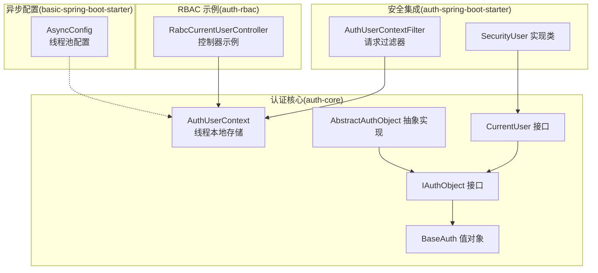
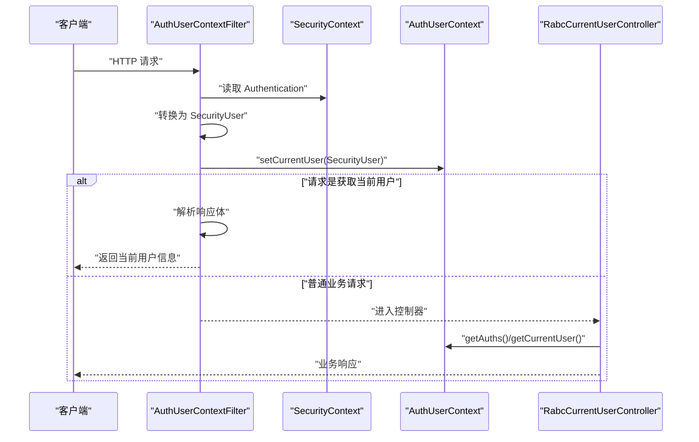
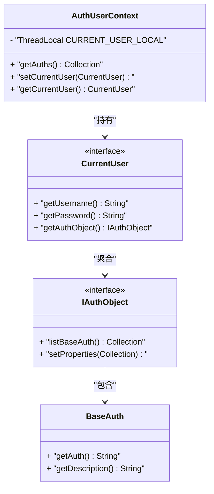
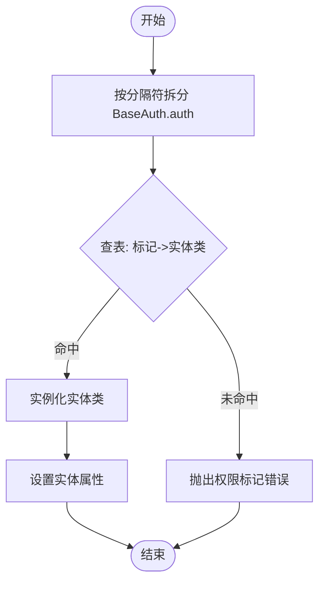
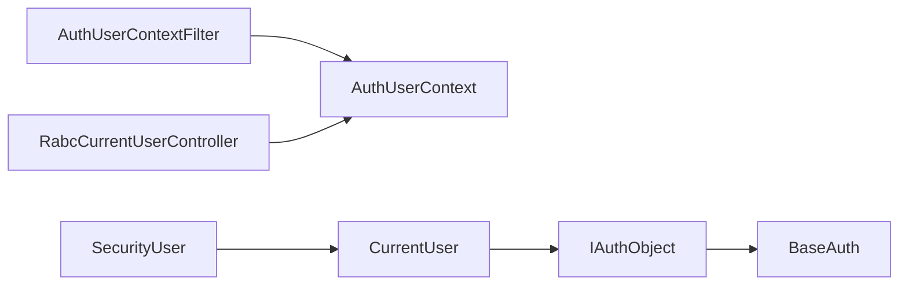

# 用户上下文管理（AuthUserContext）

<cite>
**本文引用的文件**
- [AuthUserContext.java](file://qy-auth/auth-core/src/main/java/com/kewen/framework/auth/core/AuthUserContext.java)
- [CurrentUser.java](file://qy-auth/auth-core/src/main/java/com/kewen/framework/auth/core/entity/CurrentUser.java)
- [IAuthObject.java](file://qy-auth/auth-core/src/main/java/com/kewen/framework/auth/core/entity/IAuthObject.java)
- [BaseAuth.java](file://qy-auth/auth-core/src/main/java/com/kewen/framework/auth/core/entity/BaseAuth.java)
- [AbstractAuthObject.java](file://qy-auth/auth-core/src/main/java/com/kewen/framework/auth/core/entity/AbstractAuthObject.java)
- [SecurityUser.java](file://qy-auth/auth-spring-boot-starter/src/main/java/com/kewen/framework/auth/security/model/SecurityUser.java)
- [AuthUserContextFilter.java](file://qy-auth/auth-spring-boot-starter/src/main/java/com/kewen/framework/auth/security/filter/AuthUserContextFilter.java)
- [RabcCurrentUserController.java](file://qy-auth/auth-rbac/src/main/java/com/kewen/framework/auth/rabc/controller/RabcCurrentUserController.java)
- [AsyncConfig.java](file://boot/basic-spring-boot-starter/src/main/java/com/kewen/framework/boot/basic/config/AsyncConfig.java)
</cite>

## 目录
1. [简介](#简介)
2. [项目结构](#项目结构)
3. [核心组件](#核心组件)
4. [架构总览](#架构总览)
5. [组件详解](#组件详解)
6. [依赖关系分析](#依赖关系分析)
7. [性能与并发特性](#性能与并发特性)
8. [故障排查指南](#故障排查指南)
9. [结论](#结论)
10. [附录](#附录)

## 简介
本文件围绕 AuthUserContext 用户上下文管理组件，系统性阐述其在请求生命周期内的初始化、设置、获取与清理机制；解析 CurrentUser 用户信息封装类的设计与字段语义；说明基于 ThreadLocal 的线程隔离与 InheritableThreadLocal 的继承特性在多线程场景下的安全保证与内存泄漏防护；给出在控制器、服务层与拦截器中的典型使用范式；并补充线程池与异步处理中的上下文传递建议与最佳实践。

## 项目结构
AuthUserContext 及其周边能力分布在以下模块与包中：
- 核心上下文与实体：auth-core 模块的 auth.core 与 entity 包
- 安全集成与过滤器：auth-spring-boot-starter 模块的 security 包
- RBAC 控制器示例：auth-rbac 模块的 controller 包
- 异步线程池配置：basic-spring-boot-starter 模块的 boot.basic.config 包

图表来源
- [AuthUserContext.java:16-31](file://qy-auth/auth-core/src/main/java/com/kewen/framework/auth/core/AuthUserContext.java#L16-L31)
- [CurrentUser.java:9-14](file://qy-auth/auth-core/src/main/java/com/kewen/framework/auth/core/entity/CurrentUser.java#L9-L14)
- [IAuthObject.java:14-31](file://qy-auth/auth-core/src/main/java/com/kewen/framework/auth/core/entity/IAuthObject.java#L14-L31)
- [BaseAuth.java:12-60](file://qy-auth/auth-core/src/main/java/com/kewen/framework/auth/core/entity/BaseAuth.java#L12-L60)
- [AbstractAuthObject.java:22-80](file://qy-auth/auth-core/src/main/java/com/kewen/framework/auth/core/entity/AbstractAuthObject.java#L22-L80)
- [SecurityUser.java:19-141](file://qy-auth/auth-spring-boot-starter/src/main/java/com/kewen/framework/auth/security/model/SecurityUser.java#L19-L141)
- [AuthUserContextFilter.java:31-84](file://qy-auth/auth-spring-boot-starter/src/main/java/com/kewen/framework/auth/security/filter/AuthUserContextFilter.java#L31-L84)
- [RabcCurrentUserController.java:30-81](file://qy-auth/auth-rbac/src/main/java/com/kewen/framework/auth/rabc/controller/RabcCurrentUserController.java#L30-L81)
- [AsyncConfig.java:19-59](file://boot/basic-spring-boot-starter/src/main/java/com/kewen/framework/boot/basic/config/AsyncConfig.java#L19-L59)

章节来源
- [AuthUserContext.java:16-31](file://qy-auth/auth-core/src/main/java/com/kewen/framework/auth/core/AuthUserContext.java#L16-L31)
- [AuthUserContextFilter.java:31-84](file://qy-auth/auth-spring-boot-starter/src/main/java/com/kewen/framework/auth/security/filter/AuthUserContextFilter.java#L31-L84)

## 核心组件
- AuthUserContext：基于 InheritableThreadLocal 的用户上下文容器，提供静态方法用于设置、获取与派生权限列表。
- CurrentUser：用户信息抽象接口，暴露用户名、密码与权限聚合体。
- IAuthObject：权限聚合体接口，定义权限集合与属性设置。
- BaseAuth：权限标识值对象，承载权限字符串与描述。
- AbstractAuthObject：权限聚合体的通用实现，负责将 BaseAuth 解析为具体权限实体。
- SecurityUser：Spring Security 集成的用户实现，同时满足 CurrentUser 与 UserDetails。
- AuthUserContextFilter：在登录成功后将 SecurityUser 写入 AuthUserContext，并处理“获取当前用户”请求。
- RabcCurrentUserController：控制器示例，演示在业务层读取 AuthUserContext 的权限与用户信息。
- AsyncConfig：全局异步线程池配置，为异步与线程池场景提供上下文传递参考。

章节来源
- [AuthUserContext.java:16-31](file://qy-auth/auth-core/src/main/java/com/kewen/framework/auth/core/AuthUserContext.java#L16-L31)
- [CurrentUser.java:9-14](file://qy-auth/auth-core/src/main/java/com/kewen/framework/auth/core/entity/CurrentUser.java#L9-L14)
- [IAuthObject.java:14-31](file://qy-auth/auth-core/src/main/java/com/kewen/framework/auth/core/entity/IAuthObject.java#L14-L31)
- [BaseAuth.java:12-60](file://qy-auth/auth-core/src/main/java/com/kewen/framework/auth/core/entity/BaseAuth.java#L12-L60)
- [AbstractAuthObject.java:22-80](file://qy-auth/auth-core/src/main/java/com/kewen/framework/auth/core/entity/AbstractAuthObject.java#L22-L80)
- [SecurityUser.java:19-141](file://qy-auth/auth-spring-boot-starter/src/main/java/com/kewen/framework/auth/security/model/SecurityUser.java#L19-L141)
- [AuthUserContextFilter.java:31-84](file://qy-auth/auth-spring-boot-starter/src/main/java/com/kewen/framework/auth/security/filter/AuthUserContextFilter.java#L31-L84)
- [RabcCurrentUserController.java:30-81](file://qy-auth/auth-rbac/src/main/java/com/kewen/framework/auth/rabc/controller/RabcCurrentUserController.java#L30-L81)
- [AsyncConfig.java:19-59](file://boot/basic-spring-boot-starter/src/main/java/com/kewen/framework/boot/basic/config/AsyncConfig.java#L19-L59)

## 架构总览
下图展示从请求进入、安全上下文建立、用户上下文写入、业务读取到响应返回的完整链路。

图表来源
- [AuthUserContextFilter.java:49-75](file://qy-auth/auth-spring-boot-starter/src/main/java/com/kewen/framework/auth/security/filter/AuthUserContextFilter.java#L49-L75)
- [AuthUserContext.java:18-29](file://qy-auth/auth-core/src/main/java/com/kewen/framework/auth/core/AuthUserContext.java#L18-L29)
- [RabcCurrentUserController.java:41-48](file://qy-auth/auth-rbac/src/main/java/com/kewen/framework/auth/rabc/controller/RabcCurrentUserController.java#L41-L48)

## 组件详解

### AuthUserContext：线程本地存储与权限派生
- 设计要点
  - 使用 InheritableThreadLocal 保存 CurrentUser，天然支持父子线程间继承。
  - 提供静态方法 setCurrentUser、getCurrentUser、getAuths。
  - getAuths 基于 Optional 链式调用，避免空指针；默认返回空集合。
- 生命周期
  - 初始化：请求到达时由 AuthUserContextFilter 将 SecurityUser 写入。
  - 清理：请求结束时，线程本地变量随线程销毁而释放，无需手动 remove。
- 并发与安全
  - ThreadLocal 本身线程隔离，避免交叉污染。
  - InheritableThreadLocal 支持子线程继承父线程上下文，适合同步链路。
  - 与线程池配合需谨慎，见“异步与线程池”章节。

图表来源
- [AuthUserContext.java:16-31](file://qy-auth/auth-core/src/main/java/com/kewen/framework/auth/core/AuthUserContext.java#L16-L31)
- [CurrentUser.java:9-14](file://qy-auth/auth-core/src/main/java/com/kewen/framework/auth/core/entity/CurrentUser.java#L9-L14)
- [IAuthObject.java:14-31](file://qy-auth/auth-core/src/main/java/com/kewen/framework/auth/core/entity/IAuthObject.java#L14-L31)
- [BaseAuth.java:12-60](file://qy-auth/auth-core/src/main/java/com/kewen/framework/auth/core/entity/BaseAuth.java#L12-L60)

章节来源
- [AuthUserContext.java:16-31](file://qy-auth/auth-core/src/main/java/com/kewen/framework/auth/core/AuthUserContext.java#L16-L31)

### CurrentUser：用户信息封装与权限聚合
- 字段与职责
  - 用户名、密码：用于认证与授权判断。
  - 权限聚合体：IAuthObject，承载 BaseAuth 列表与属性映射。
- 设计意图
  - 将用户身份与权限解耦，便于扩展不同权限模型。
  - 通过 IAuthObject 的 listBaseAuth 暴露统一权限集合。

章节来源
- [CurrentUser.java:9-14](file://qy-auth/auth-core/src/main/java/com/kewen/framework/auth/core/entity/CurrentUser.java#L9-L14)
- [IAuthObject.java:14-31](file://qy-auth/auth-core/src/main/java/com/kewen/framework/auth/core/entity/IAuthObject.java#L14-L31)

### BaseAuth 与 AbstractAuthObject：权限建模与解析
- BaseAuth
  - 权限标识字符串与描述，作为最小权限单元。
- AbstractAuthObject
  - 维护权限标记到实体类的映射，提供 parseBaseAuth 将 BaseAuth 转换为具体权限实体。
  - setProperties 将一组 BaseAuth 转换为具体权限实体集合，交由子类完成持久化绑定。

图表来源
- [AbstractAuthObject.java:53-68](file://qy-auth/auth-core/src/main/java/com/kewen/framework/auth/core/entity/AbstractAuthObject.java#L53-L68)
- [BaseAuth.java:12-60](file://qy-auth/auth-core/src/main/java/com/kewen/framework/auth/core/entity/BaseAuth.java#L12-L60)

章节来源
- [BaseAuth.java:12-60](file://qy-auth/auth-core/src/main/java/com/kewen/framework/auth/core/entity/BaseAuth.java#L12-L60)
- [AbstractAuthObject.java:22-80](file://qy-auth/auth-core/src/main/java/com/kewen/framework/auth/core/entity/AbstractAuthObject.java#L22-L80)

### SecurityUser：Spring Security 集成的用户实现
- 继承关系
  - 实现 UserDetails、AuthenticatedPrincipal，适配 Spring Security。
  - 同时实现 CurrentUser，作为 AuthUserContext 的载体。
- 关键字段
  - 身份标识、姓名、昵称、联系方式、头像等用户基本信息。
  - 权限聚合体 authObject，用于 getAuthorities 与 AuthUserContext 的权限派生。
- 权限映射
  - getAuthorities 将 IAuthObject.listBaseAuth() 的权限字符串映射为 GrantedAuthority。

章节来源
- [SecurityUser.java:19-141](file://qy-auth/auth-spring-boot-starter/src/main/java/com/kewen/framework/auth/security/model/SecurityUser.java#L19-L141)
- [IAuthObject.java:14-31](file://qy-auth/auth-core/src/main/java/com/kewen/framework/auth/core/entity/IAuthObject.java#L14-L31)

### AuthUserContextFilter：请求级上下文写入与“当前用户”响应
- 职责
  - 在登录成功后，从 Authentication 成功结果转换为 SecurityUser，并写入 AuthUserContext。
  - 对“获取当前用户”的特殊请求，直接返回当前用户信息，不再进入业务链路。
- 执行时机
  - 在 Spring Security 的 SessionManagementFilter 之后执行，确保 remember-me 等流程完成后写入上下文。

章节来源
- [AuthUserContextFilter.java:31-84](file://qy-auth/auth-spring-boot-starter/src/main/java/com/kewen/framework/auth/security/filter/AuthUserContextFilter.java#L31-L84)

### 控制器示例：在业务层读取上下文
- RabcCurrentUserController 展示了两种常见用法
  - 读取权限集合：AuthUserContext.getAuths() 用于菜单树构建等。
  - 读取当前用户：AuthUserContext.getCurrentUser() 用于密码更新等操作。

章节来源
- [RabcCurrentUserController.java:41-48](file://qy-auth/auth-rbac/src/main/java/com/kewen/framework/auth/rabc/controller/RabcCurrentUserController.java#L41-L48)

## 依赖关系分析
- 上下文依赖
  - AuthUserContext 依赖 CurrentUser 与 IAuthObject，形成“用户-权限聚合体”的组合关系。
  - SecurityUser 同时实现 CurrentUser 与 UserDetails，作为上下文载体。
- 过滤器依赖
  - AuthUserContextFilter 依赖 SecurityContext、AuthenticationSuccessResultConverter、UserDetailsService 等，完成用户对象转换与写入。
- 控制器依赖
  - RabcCurrentUserController 依赖 AuthUserContext 以获取权限与用户信息。

图表来源
- [AuthUserContextFilter.java:31-84](file://qy-auth/auth-spring-boot-starter/src/main/java/com/kewen/framework/auth/security/filter/AuthUserContextFilter.java#L31-L84)
- [AuthUserContext.java:16-31](file://qy-auth/auth-core/src/main/java/com/kewen/framework/auth/core/AuthUserContext.java#L16-L31)
- [SecurityUser.java:19-141](file://qy-auth/auth-spring-boot-starter/src/main/java/com/kewen/framework/auth/security/model/SecurityUser.java#L19-L141)
- [RabcCurrentUserController.java:30-81](file://qy-auth/auth-rbac/src/main/java/com/kewen/framework/auth/rabc/controller/RabcCurrentUserController.java#L30-L81)

## 性能与并发特性
- 线程隔离与内存释放
  - ThreadLocal 在请求结束时随线程销毁自动释放，避免显式 remove。
  - InheritableThreadLocal 支持子线程继承，适合同步链路；但在线程池场景需额外处理。
- 空值安全与默认行为
  - getAuths 使用 Optional 链式调用，未登录时返回空集合，避免空指针。
- 异步与线程池注意事项
  - 默认线程池配置位于 basic-spring-boot-starter 的 AsyncConfig，提供固定命名的线程池。
  - 在线程池执行任务时，若需访问 AuthUserContext，应采用上下文传递方案（例如手动传递 CurrentUser 或在提交任务前设置），避免跨线程丢失上下文。

章节来源
- [AuthUserContext.java:18-29](file://qy-auth/auth-core/src/main/java/com/kewen/framework/auth/core/AuthUserContext.java#L18-L29)
- [AsyncConfig.java:19-59](file://boot/basic-spring-boot-starter/src/main/java/com/kewen/framework/boot/basic/config/AsyncConfig.java#L19-L59)

## 故障排查指南
- 现象：读取权限为空
  - 检查请求是否已进入 AuthUserContextFilter 的写入逻辑。
  - 确认 SecurityContext 中存在有效的 Authentication。
- 现象：控制器读取 CurrentUser 为 null
  - 确认请求路径不是“获取当前用户”的特判分支。
  - 确认过滤器在 SessionManagementFilter 之后执行。
- 现象：线程池内读取不到上下文
  - 需要在线程池任务中显式传递 CurrentUser 或在任务执行前设置 AuthUserContext。
- 现象：权限解析失败
  - 检查 BaseAuth.auth 的权限标记是否正确注册到 AbstractAuthObject 的映射表。

章节来源
- [AuthUserContextFilter.java:49-75](file://qy-auth/auth-spring-boot-starter/src/main/java/com/kewen/framework/auth/security/filter/AuthUserContextFilter.java#L49-L75)
- [AbstractAuthObject.java:53-68](file://qy-auth/auth-core/src/main/java/com/kewen/framework/auth/core/entity/AbstractAuthObject.java#L53-L68)

## 结论
AuthUserContext 通过 ThreadLocal 将用户上下文与请求线程绑定，结合 InheritableThreadLocal 支持父子线程继承，在请求级具备良好的线程安全与内存释放特性。配合 SecurityUser 与 IAuthObject，实现了认证与权限的清晰分离。在控制器与服务层中，可通过静态方法便捷地获取权限与用户信息。在线程池与异步场景中，需采用上下文传递策略以维持一致性。

## 附录

### 使用示例清单
- 控制器中读取权限集合
  - 路径参考：[RabcCurrentUserController.java:41](file://qy-auth/auth-rbac/src/main/java/com/kewen/framework/auth/rabc/controller/RabcCurrentUserController.java#L41)
- 控制器中读取当前用户并执行业务
  - 路径参考：[RabcCurrentUserController.java:47](file://qy-auth/auth-rbac/src/main/java/com/kewen/framework/auth/rabc/controller/RabcCurrentUserController.java#L47)
- 过滤器写入用户上下文
  - 路径参考：[AuthUserContextFilter.java:56-64](file://qy-auth/auth-spring-boot-starter/src/main/java/com/kewen/framework/auth/security/filter/AuthUserContextFilter.java#L56-L64)

### 最佳实践
- 在请求入口（如过滤器）完成 AuthUserContext 的写入。
- 仅在请求线程内使用 AuthUserContext，避免跨线程共享。
- 在线程池或异步任务中，显式传递 CurrentUser 或在任务执行前设置上下文。
- 对权限集合的使用尽量延迟到业务层，减少跨层传播复杂度。