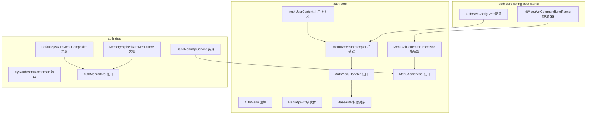
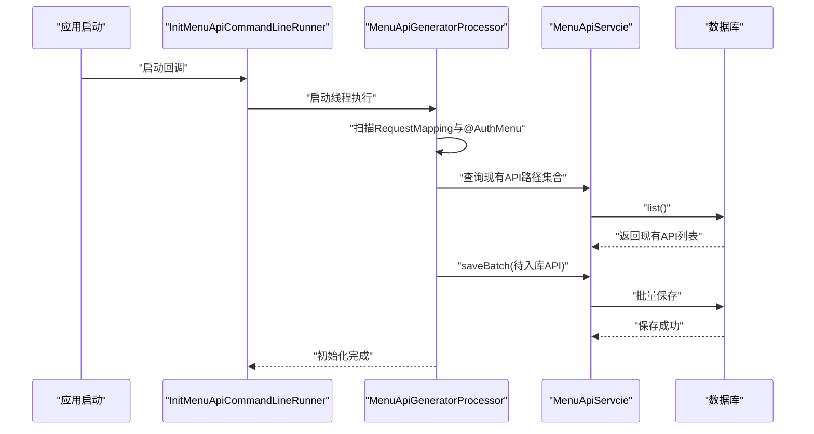
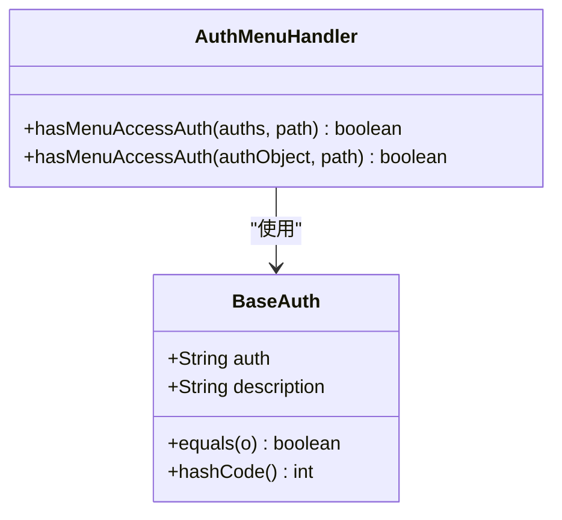
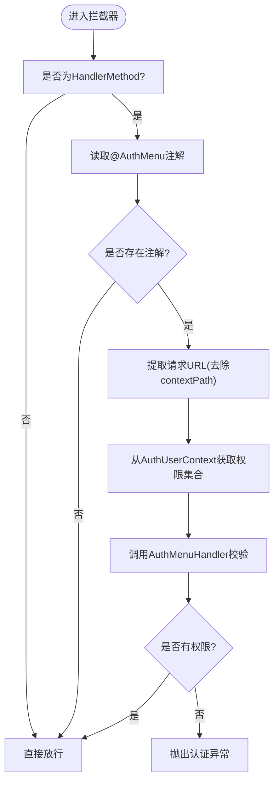
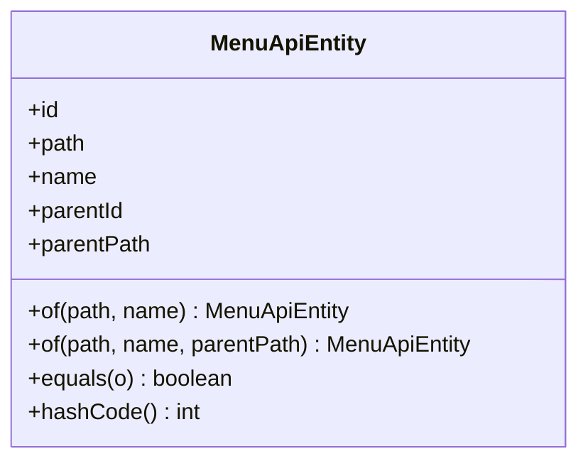
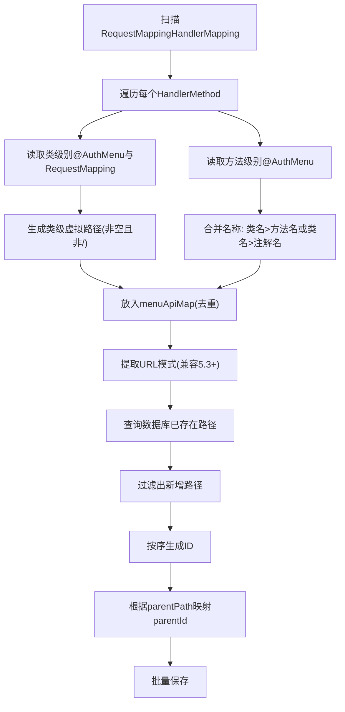
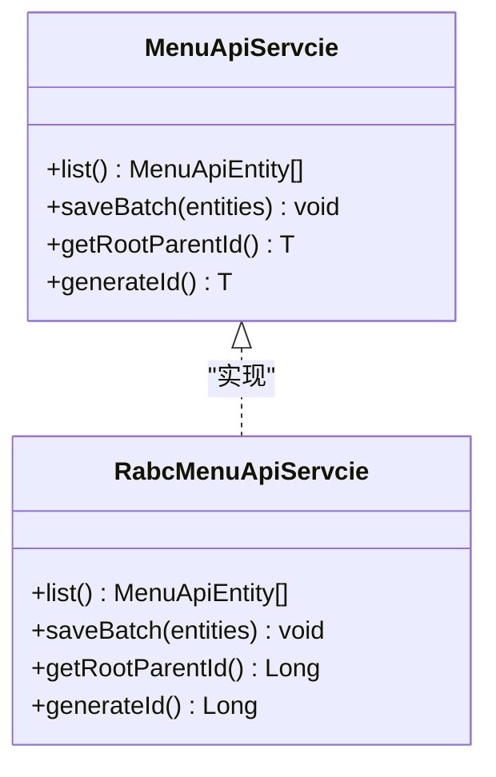
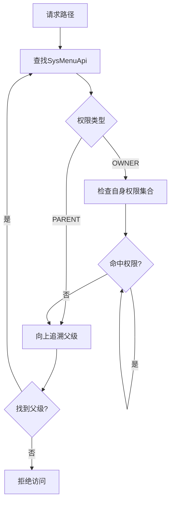
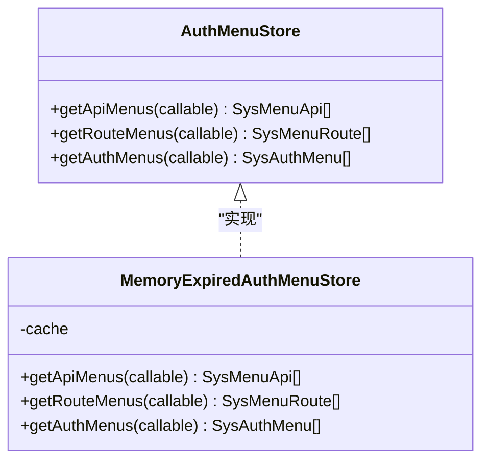
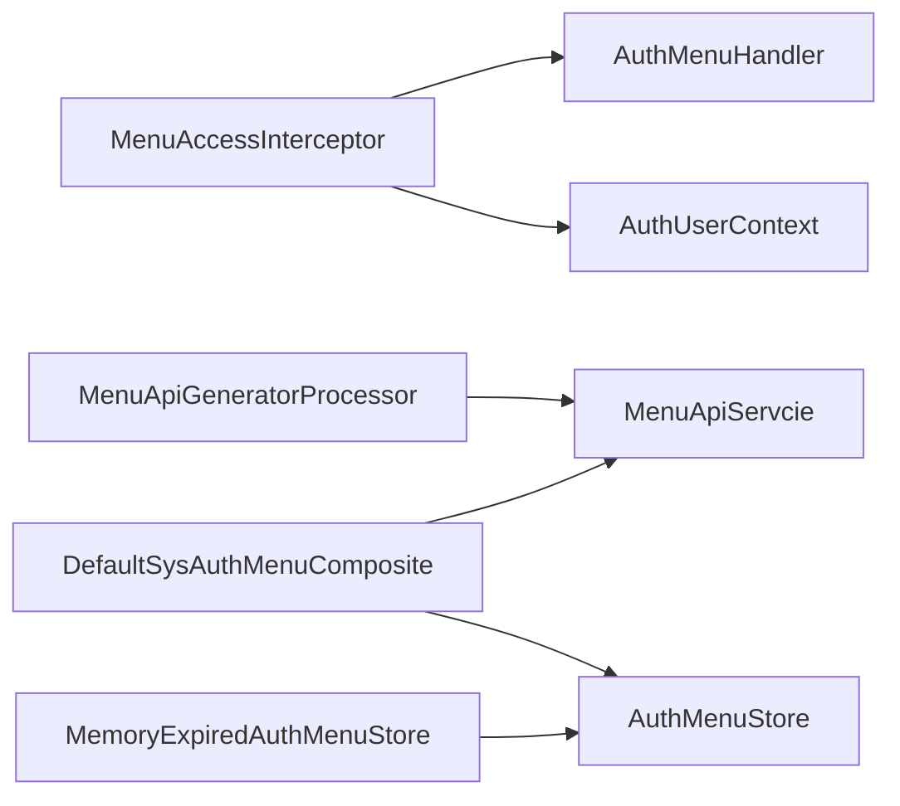

# 菜单权限控制 (MenuPermissionControl)

<cite>
**本文引用的文件**
- [AuthMenuHandler.java](file://qy-auth/auth-core/src/main/java/com/kewen/framework/auth/core/menu/AuthMenuHandler.java)
- [MenuAccessInterceptor.java](file://qy-auth/auth-core/src/main/java/com/kewen/framework/auth/core/menu/MenuAccessInterceptor.java)
- [MenuApiEntity.java](file://qy-auth/auth-core/src/main/java/com/kewen/framework/auth/core/menu/MenuApiEntity.java)
- [MenuApiGeneratorProcessor.java](file://qy-auth/auth-core/src/main/java/com/kewen/framework/auth/core/menu/MenuApiGeneratorProcessor.java)
- [MenuApiServcie.java](file://qy-auth/auth-core/src/main/java/com/kewen/framework/auth/core/menu/MenuApiServcie.java)
- [AuthMenu.java](file://qy-auth/auth-core/src/main/java/com/kewen/framework/auth/core/AuthMenu.java)
- [BaseAuth.java](file://qy-auth/auth-core/src/main/java/com/kewen/framework/auth/core/entity/BaseAuth.java)
- [AuthUserContext.java](file://qy-auth/auth-core/src/main/java/com/kewen/framework/auth/core/AuthUserContext.java)
- [AuthDataHandler.java](file://qy-auth/auth-core/src/main/java/com/kewen/framework/auth/core/data/AuthDataHandler.java)
- [SysAuthMenuComposite.java](file://qy-auth/auth-rbac/src/main/java/com/kewen/framework/auth/rabc/composite/SysAuthMenuComposite.java)
- [AuthMenuStore.java](file://qy-auth/auth-rbac/src/main/java/com/kewen/framework/auth/rabc/composite/AuthMenuStore.java)
- [DefaultSysAuthMenuComposite.java](file://qy-auth/auth-rbac/src/main/java/com/kewen/framework/auth/rabc/composite/impl/DefaultSysAuthMenuComposite.java)
- [MemoryExpiredAuthMenuStore.java](file://qy-auth/auth-rbac/src/main/java/com/kewen/framework/auth/rabc/composite/impl/MemoryExpiredAuthMenuStore.java)
- [RabcMenuApiServcie.java](file://qy-auth/auth-rbac/src/main/java/com/kewen/framework/auth/rabc/extension/RabcMenuApiServcie.java)
- [InitMenuApiCommandLineRunner.java](file://qy-auth/auth-core-spring-boot-starter/src/main/java/com/kewen/framework/boot/auth/core/init/InitMenuApiCommandLineRunner.java)
- [AuthWebConfig.java](file://qy-auth/auth-core-spring-boot-starter/src/main/java/com/kewen/framework/boot/auth/core/config/AuthWebConfig.java)
</cite>

## 目录
1. [简介](#简介)
2. [项目结构](#项目结构)
3. [核心组件](#核心组件)
4. [架构总览](#架构总览)
5. [组件详解](#组件详解)
6. [依赖关系分析](#依赖关系分析)
7. [性能考量](#性能考量)
8. [故障排查指南](#故障排查指南)
9. [结论](#结论)
10. [附录](#附录)

## 简介
本技术文档围绕菜单权限控制模块，系统化阐述以下关键能力与实现：
- AuthMenuHandler 菜单处理器：定义菜单访问权限判定接口，并提供基于权限对象的便捷判定。
- MenuAccessInterceptor 菜单访问拦截器：在 MVC 层对带 @AuthMenu 注解的控制器方法进行菜单权限拦截校验。
- MenuApiEntity 菜单API实体：抽象出菜单API的树形结构字段与标识，支持父子关系映射。
- MenuApiGeneratorProcessor 菜单API生成处理器：扫描控制器方法，自动发现并生成菜单API记录，支持父路径映射与批量入库。
- MenuApiServcie 菜单API服务接口：统一定义菜单API的查询、批量保存、根父ID与ID生成规范。
- 动态加载与缓存：结合 AuthMenuStore 与 DefaultSysAuthMenuComposite 实现菜单、路由与权限的内存缓存与懒加载。
- 使用示例与最佳实践：涵盖菜单配置、权限验证、API访问控制、菜单树构建、权限继承与API权限映射。

## 项目结构
菜单权限控制模块位于 qy-auth 子工程下，分为核心能力与RBAC扩展两部分：
- auth-core：提供通用的菜单权限接口、拦截器、API实体与生成器。
- auth-rbac：提供 RBAC 扩展实现，包括菜单树聚合、权限继承、缓存存储与持久化服务。
- auth-core-spring-boot-starter：提供自动装配与拦截器注册，以及菜单API初始化入口。

图表来源
- [AuthMenuHandler.java:16-35](file://qy-auth/auth-core/src/main/java/com/kewen/framework/auth/core/menu/AuthMenuHandler.java#L16-L35)
- [MenuAccessInterceptor.java:23-71](file://qy-auth/auth-core/src/main/java/com/kewen/framework/auth/core/menu/MenuAccessInterceptor.java#L23-L71)
- [AuthMenu.java:13-20](file://qy-auth/auth-core/src/main/java/com/kewen/framework/auth/core/AuthMenu.java#L13-L20)
- [MenuApiEntity.java:14-45](file://qy-auth/auth-core/src/main/java/com/kewen/framework/auth/core/menu/MenuApiEntity.java#L14-L45)
- [MenuApiGeneratorProcessor.java:29-191](file://qy-auth/auth-core/src/main/java/com/kewen/framework/auth/core/menu/MenuApiGeneratorProcessor.java#L29-L191)
- [MenuApiServcie.java:11-38](file://qy-auth/auth-core/src/main/java/com/kewen/framework/auth/core/menu/MenuApiServcie.java#L11-L38)
- [BaseAuth.java:12-60](file://qy-auth/auth-core/src/main/java/com/kewen/framework/auth/core/entity/BaseAuth.java#L12-L60)
- [AuthUserContext.java:16-31](file://qy-auth/auth-core/src/main/java/com/kewen/framework/auth/core/AuthUserContext.java#L16-L31)
- [SysAuthMenuComposite.java:18-63](file://qy-auth/auth-rbac/src/main/java/com/kewen/framework/auth/rabc/composite/SysAuthMenuComposite.java#L18-L63)
- [AuthMenuStore.java:16-23](file://qy-auth/auth-rbac/src/main/java/com/kewen/framework/auth/rabc/composite/AuthMenuStore.java#L16-L23)
- [DefaultSysAuthMenuComposite.java:39-233](file://qy-auth/auth-rbac/src/main/java/com/kewen/framework/auth/rabc/composite/impl/DefaultSysAuthMenuComposite.java#L39-L233)
- [MemoryExpiredAuthMenuStore.java:21-54](file://qy-auth/auth-rbac/src/main/java/com/kewen/framework/auth/rabc/composite/impl/MemoryExpiredAuthMenuStore.java#L21-L54)
- [RabcMenuApiServcie.java:19-41](file://qy-auth/auth-rbac/src/main/java/com/kewen/framework/auth/rabc/extension/RabcMenuApiServcie.java#L19-L41)
- [InitMenuApiCommandLineRunner.java:15-27](file://qy-auth/auth-core-spring-boot-starter/src/main/java/com/kewen/framework/boot/auth/core/init/InitMenuApiCommandLineRunner.java#L15-L27)
- [AuthWebConfig.java:15-28](file://qy-auth/auth-core-spring-boot-starter/src/main/java/com/kewen/framework/boot/auth/core/config/AuthWebConfig.java#L15-L28)

章节来源
- [AuthMenuHandler.java:11-35](file://qy-auth/auth-core/src/main/java/com/kewen/framework/auth/core/menu/AuthMenuHandler.java#L11-L35)
- [MenuAccessInterceptor.java:17-71](file://qy-auth/auth-core/src/main/java/com/kewen/framework/auth/core/menu/MenuAccessInterceptor.java#L17-L71)
- [MenuApiEntity.java:8-45](file://qy-auth/auth-core/src/main/java/com/kewen/framework/auth/core/menu/MenuApiEntity.java#L8-L45)
- [MenuApiGeneratorProcessor.java:23-191](file://qy-auth/auth-core/src/main/java/com/kewen/framework/auth/core/menu/MenuApiGeneratorProcessor.java#L23-L191)
- [MenuApiServcie.java:5-38](file://qy-auth/auth-core/src/main/java/com/kewen/framework/auth/core/menu/MenuApiServcie.java#L5-L38)
- [AuthMenu.java:5-20](file://qy-auth/auth-core/src/main/java/com/kewen/framework/auth/core/AuthMenu.java#L5-L20)
- [BaseAuth.java:5-60](file://qy-auth/auth-core/src/main/java/com/kewen/framework/auth/core/entity/BaseAuth.java#L5-L60)
- [AuthUserContext.java:12-31](file://qy-auth/auth-core/src/main/java/com/kewen/framework/auth/core/AuthUserContext.java#L12-L31)
- [SysAuthMenuComposite.java:13-63](file://qy-auth/auth-rbac/src/main/java/com/kewen/framework/auth/rabc/composite/SysAuthMenuComposite.java#L13-L63)
- [AuthMenuStore.java:11-23](file://qy-auth/auth-rbac/src/main/java/com/kewen/framework/auth/rabc/composite/AuthMenuStore.java#L11-L23)
- [DefaultSysAuthMenuComposite.java:32-233](file://qy-auth/auth-rbac/src/main/java/com/kewen/framework/auth/rabc/composite/impl/DefaultSysAuthMenuComposite.java#L32-L233)
- [MemoryExpiredAuthMenuStore.java:16-54](file://qy-auth/auth-rbac/src/main/java/com/kewen/framework/auth/rabc/composite/impl/MemoryExpiredAuthMenuStore.java#L16-L54)
- [RabcMenuApiServcie.java:13-41](file://qy-auth/auth-rbac/src/main/java/com/kewen/framework/auth/rabc/extension/RabcMenuApiServcie.java#L13-L41)
- [InitMenuApiCommandLineRunner.java:9-27](file://qy-auth/auth-core-spring-boot-starter/src/main/java/com/kewen/framework/boot/auth/core/init/InitMenuApiCommandLineRunner.java#L9-L27)
- [AuthWebConfig.java:9-28](file://qy-auth/auth-core-spring-boot-starter/src/main/java/com/kewen/framework/boot/auth/core/config/AuthWebConfig.java#L9-L28)

## 核心组件
- AuthMenuHandler：定义菜单访问权限判定接口，支持基于权限集合与权限对象两种判定方式。
- MenuAccessInterceptor：MVC 拦截器，读取请求路径与用户权限，调用 AuthMenuHandler 进行校验。
- MenuApiEntity：抽象菜单API实体，包含标识、路径、名称、父子关系字段，支持相等性与哈希比较。
- MenuApiGeneratorProcessor：扫描 Spring MVC 的 RequestMapping，解析 @AuthMenu 注解，生成菜单API实体并入库。
- MenuApiServcie：菜单API服务接口，定义查询、批量保存、根父ID与ID生成规范。
- SysAuthMenuComposite：菜单权限聚合服务，负责菜单树构建、权限继承与路由树生成。
- AuthMenuStore：菜单数据缓存接口，支持内存过期缓存实现。
- DefaultSysAuthMenuComposite：具体实现，包含权限继承校验、树构建与缓存策略。
- MemoryExpiredAuthMenuStore：基于 Guava Cache 的内存缓存实现，默认10分钟过期。
- RabcMenuApiServcie：RBAC 扩展的菜单API持久化实现，桥接 MenuApiServcie 与数据库实体。
- InitMenuApiCommandLineRunner：启动阶段触发菜单API生成任务。
- AuthWebConfig：注册菜单访问拦截器。

章节来源
- [AuthMenuHandler.java:16-35](file://qy-auth/auth-core/src/main/java/com/kewen/framework/auth/core/menu/AuthMenuHandler.java#L16-L35)
- [MenuAccessInterceptor.java:23-71](file://qy-auth/auth-core/src/main/java/com/kewen/framework/auth/core/menu/MenuAccessInterceptor.java#L23-L71)
- [MenuApiEntity.java:14-45](file://qy-auth/auth-core/src/main/java/com/kewen/framework/auth/core/menu/MenuApiEntity.java#L14-L45)
- [MenuApiGeneratorProcessor.java:29-191](file://qy-auth/auth-core/src/main/java/com/kewen/framework/auth/core/menu/MenuApiGeneratorProcessor.java#L29-L191)
- [MenuApiServcie.java:11-38](file://qy-auth/auth-core/src/main/java/com/kewen/framework/auth/core/menu/MenuApiServcie.java#L11-L38)
- [SysAuthMenuComposite.java:18-63](file://qy-auth/auth-rbac/src/main/java/com/kewen/framework/auth/rabc/composite/SysAuthMenuComposite.java#L18-L63)
- [AuthMenuStore.java:16-23](file://qy-auth/auth-rbac/src/main/java/com/kewen/framework/auth/rabc/composite/AuthMenuStore.java#L16-L23)
- [DefaultSysAuthMenuComposite.java:39-233](file://qy-auth/auth-rbac/src/main/java/com/kewen/framework/auth/rabc/composite/impl/DefaultSysAuthMenuComposite.java#L39-L233)
- [MemoryExpiredAuthMenuStore.java:21-54](file://qy-auth/auth-rbac/src/main/java/com/kewen/framework/auth/rabc/composite/impl/MemoryExpiredAuthMenuStore.java#L21-L54)
- [RabcMenuApiServcie.java:19-41](file://qy-auth/auth-rbac/src/main/java/com/kewen/framework/auth/rabc/extension/RabcMenuApiServcie.java#L19-L41)
- [InitMenuApiCommandLineRunner.java:15-27](file://qy-auth/auth-core-spring-boot-starter/src/main/java/com/kewen/framework/boot/auth/core/init/InitMenuApiCommandLineRunner.java#L15-L27)
- [AuthWebConfig.java:15-28](file://qy-auth/auth-core-spring-boot-starter/src/main/java/com/kewen/framework/boot/auth/core/config/AuthWebConfig.java#L15-L28)

## 架构总览
菜单权限控制的整体流程如下：
- 启动阶段：InitMenuApiCommandLineRunner 触发 MenuApiGeneratorProcessor，扫描控制器方法，生成菜单API并入库。
- 运行阶段：AuthWebConfig 注册 MenuAccessInterceptor；请求进入时，拦截器读取用户权限与请求路径，调用 AuthMenuHandler 进行校验。
- 菜单树与权限：DefaultSysAuthMenuComposite 负责从缓存或数据库加载菜单、路由与权限，构建树并支持权限继承校验。
- 缓存策略：MemoryExpiredAuthMenuStore 提供内存缓存，默认10分钟过期，提升读取性能。

图表来源
- [InitMenuApiCommandLineRunner.java:19-25](file://qy-auth/auth-core-spring-boot-starter/src/main/java/com/kewen/framework/boot/auth/core/init/InitMenuApiCommandLineRunner.java#L19-L25)
- [MenuApiGeneratorProcessor.java:47-94](file://qy-auth/auth-core/src/main/java/com/kewen/framework/auth/core/menu/MenuApiGeneratorProcessor.java#L47-L94)
- [MenuApiServcie.java:18-24](file://qy-auth/auth-core/src/main/java/com/kewen/framework/auth/core/menu/MenuApiServcie.java#L18-L24)

章节来源
- [InitMenuApiCommandLineRunner.java:9-27](file://qy-auth/auth-core-spring-boot-starter/src/main/java/com/kewen/framework/boot/auth/core/init/InitMenuApiCommandLineRunner.java#L9-L27)
- [MenuApiGeneratorProcessor.java:47-94](file://qy-auth/auth-core/src/main/java/com/kewen/framework/auth/core/menu/MenuApiGeneratorProcessor.java#L47-L94)
- [MenuApiServcie.java:13-24](file://qy-auth/auth-core/src/main/java/com/kewen/framework/auth/core/menu/MenuApiServcie.java#L13-L24)

## 组件详解

### AuthMenuHandler 菜单处理器
- 设计理念：提供统一的菜单访问权限判定接口，屏蔽底层权限来源差异，支持直接传入权限集合或权限对象。
- 关键点：
  - 支持基于权限集合的判定。
  - 提供基于权限对象的默认实现，内部委托权限集合版本。
  - 日志记录空权限对象场景，便于问题定位。

图表来源
- [AuthMenuHandler.java:16-35](file://qy-auth/auth-core/src/main/java/com/kewen/framework/auth/core/menu/AuthMenuHandler.java#L16-L35)
- [BaseAuth.java:12-60](file://qy-auth/auth-core/src/main/java/com/kewen/framework/auth/core/entity/BaseAuth.java#L12-L60)

章节来源
- [AuthMenuHandler.java:11-35](file://qy-auth/auth-core/src/main/java/com/kewen/framework/auth/core/menu/AuthMenuHandler.java#L11-L35)
- [BaseAuth.java:5-60](file://qy-auth/auth-core/src/main/java/com/kewen/framework/auth/core/entity/BaseAuth.java#L5-L60)

### MenuAccessInterceptor 菜单访问拦截器
- 实现原理：
  - 仅对 HandlerMethod 生效，非 Controller 方法直接放行。
  - 优先读取方法上的 @AuthMenu 注解，若不存在则回退到类级别注解。
  - 从请求中提取去除上下文路径后的 URL 作为菜单路径。
  - 从 AuthUserContext 获取当前用户权限集合，调用 AuthMenuHandler 校验。
  - 无权限时抛出认证异常。
- 拦截流程：

图表来源
- [MenuAccessInterceptor.java:28-61](file://qy-auth/auth-core/src/main/java/com/kewen/framework/auth/core/menu/MenuAccessInterceptor.java#L28-L61)
- [AuthUserContext.java:18-23](file://qy-auth/auth-core/src/main/java/com/kewen/framework/auth/core/AuthUserContext.java#L18-L23)
- [AuthMenu.java:13-20](file://qy-auth/auth-core/src/main/java/com/kewen/framework/auth/core/AuthMenu.java#L13-L20)

章节来源
- [MenuAccessInterceptor.java:17-71](file://qy-auth/auth-core/src/main/java/com/kewen/framework/auth/core/menu/MenuAccessInterceptor.java#L17-L71)
- [AuthUserContext.java:12-31](file://qy-auth/auth-core/src/main/java/com/kewen/framework/auth/core/AuthUserContext.java#L12-L31)
- [AuthMenu.java:5-20](file://qy-auth/auth-core/src/main/java/com/kewen/framework/auth/core/AuthMenu.java#L5-L20)

### MenuApiEntity 菜单API实体
- 设计思路：抽象菜单API的树形结构字段，便于统一处理父子关系与去重比较。
- 字段定义：
  - id：API 标识。
  - path：API 路径。
  - name：API 名称（含层级拼接）。
  - parentId：父级标识。
  - parentPath：父级路径（用于运行时映射）。
- 相等性与哈希：基于 path 字段，避免重复入库。

图表来源
- [MenuApiEntity.java:14-45](file://qy-auth/auth-core/src/main/java/com/kewen/framework/auth/core/menu/MenuApiEntity.java#L14-L45)

章节来源
- [MenuApiEntity.java:8-45](file://qy-auth/auth-core/src/main/java/com/kewen/framework/auth/core/menu/MenuApiEntity.java#L8-L45)

### MenuApiGeneratorProcessor 菜单API生成处理器
- 工作机制：
  - 在 ApplicationContext 中获取 RequestMappingHandlerMapping 与 MenuApiServcie。
  - 扫描所有 HandlerMethod，解析 @AuthMenu 与 RequestMapping，生成菜单API实体。
  - 过滤数据库中已存在的路径，对新增项按路径排序后生成 ID 并批量入库。
  - 将数据库中的 API 回填到内存映射，以便根据 parentPath 设置 parentId。
- API 发现策略：
  - 优先使用方法上的 @AuthMenu 注解；若方法无注解但类上有注解，则以类名拼接方法名。
  - 若类上存在 RequestMapping 且路径非空且非根路径，则生成“类级虚拟路径”用于构建层级。
  - 兼容 Spring MVC 5.3+ 的 PathPatternParser，分别从 patternsCondition 与 pathPatternsCondition 提取路径。

图表来源
- [MenuApiGeneratorProcessor.java:99-191](file://qy-auth/auth-core/src/main/java/com/kewen/framework/auth/core/menu/MenuApiGeneratorProcessor.java#L99-L191)
- [MenuApiServcie.java:18-36](file://qy-auth/auth-core/src/main/java/com/kewen/framework/auth/core/menu/MenuApiServcie.java#L18-L36)

章节来源
- [MenuApiGeneratorProcessor.java:23-191](file://qy-auth/auth-core/src/main/java/com/kewen/framework/auth/core/menu/MenuApiGeneratorProcessor.java#L23-L191)
- [MenuApiServcie.java:13-36](file://qy-auth/auth-core/src/main/java/com/kewen/framework/auth/core/menu/MenuApiServcie.java#L13-L36)

### MenuApiServcie 菜单API服务接口
- 接口设计：
  - list()：获取所有菜单API列表。
  - saveBatch()：批量保存菜单API。
  - getRootParentId()：获取树根父ID。
  - generateId()：生成菜单ID。
- 业务逻辑：
  - 由具体实现负责与存储层交互，如数据库或缓存。
  - 为 MenuApiGeneratorProcessor 提供统一的入库与查询能力。

图表来源
- [MenuApiServcie.java:11-38](file://qy-auth/auth-core/src/main/java/com/kewen/framework/auth/core/menu/MenuApiServcie.java#L11-L38)
- [RabcMenuApiServcie.java:19-41](file://qy-auth/auth-rbac/src/main/java/com/kewen/framework/auth/rabc/extension/RabcMenuApiServcie.java#L19-L41)

章节来源
- [MenuApiServcie.java:5-38](file://qy-auth/auth-core/src/main/java/com/kewen/framework/auth/core/menu/MenuApiServcie.java#L5-L38)
- [RabcMenuApiServcie.java:13-41](file://qy-auth/auth-rbac/src/main/java/com/kewen/framework/auth/rabc/extension/RabcMenuApiServcie.java#L13-L41)

### 菜单权限继承与树构建
- 权限继承：
  - OWNER：基于自身权限集合判定。
  - PARENT：向上追溯父级菜单，直至根或找到权限。
- 树构建：
  - 菜单树与路由树分离维护，支持按权限过滤可见节点。
  - 路由树根据 API 树的子节点集合进行裁剪，确保前端导航与实际权限一致。

图表来源
- [DefaultSysAuthMenuComposite.java:180-201](file://qy-auth/auth-rbac/src/main/java/com/kewen/framework/auth/rabc/composite/impl/DefaultSysAuthMenuComposite.java#L180-L201)

章节来源
- [DefaultSysAuthMenuComposite.java:53-201](file://qy-auth/auth-rbac/src/main/java/com/kewen/framework/auth/rabc/composite/impl/DefaultSysAuthMenuComposite.java#L53-L201)

### 动态加载与缓存机制
- 动态加载：
  - 通过 AuthMenuStore 的 Callable 包装，首次访问时从数据库加载并缓存。
- 缓存策略：
  - MemoryExpiredAuthMenuStore 使用 Guava Cache，默认10分钟过期。
  - 可替换为 Redis 等分布式缓存实现。
- 开关控制：
  - 通过配置项启用/禁用缓存，避免开发环境频繁变更导致的缓存干扰。

图表来源
- [AuthMenuStore.java:16-23](file://qy-auth/auth-rbac/src/main/java/com/kewen/framework/auth/rabc/composite/AuthMenuStore.java#L16-L23)
- [MemoryExpiredAuthMenuStore.java:21-54](file://qy-auth/auth-rbac/src/main/java/com/kewen/framework/auth/rabc/composite/impl/MemoryExpiredAuthMenuStore.java#L21-L54)

章节来源
- [AuthMenuStore.java:11-23](file://qy-auth/auth-rbac/src/main/java/com/kewen/framework/auth/rabc/composite/AuthMenuStore.java#L11-L23)
- [MemoryExpiredAuthMenuStore.java:16-54](file://qy-auth/auth-rbac/src/main/java/com/kewen/framework/auth/rabc/composite/impl/MemoryExpiredAuthMenuStore.java#L16-L54)
- [DefaultSysAuthMenuComposite.java:207-232](file://qy-auth/auth-rbac/src/main/java/com/kewen/framework/auth/rabc/composite/impl/DefaultSysAuthMenuComposite.java#L207-L232)

### 完整使用示例与最佳实践
- 菜单配置：
  - 在控制器类或方法上添加 @AuthMenu 注解，name 字段用于生成菜单名称。
  - 如需构建层级，可在类上添加 RequestMapping 且路径非空非根。
- 权限验证：
  - 在需要校验的控制器方法或类上添加 @AuthMenu 注解，拦截器会在请求到达时自动校验。
- API 访问控制：
  - 通过 MenuAccessInterceptor 结合 AuthMenuHandler 实现 MVC 层的菜单权限拦截。
- 菜单树构建与权限映射：
  - 使用 SysAuthMenuComposite 提供的树构建与权限过滤能力，确保前端导航与后端权限一致。
- 最佳实践：
  - 启动阶段使用 InitMenuApiCommandLineRunner 自动扫描并入库菜单API。
  - 启用缓存时注意过期时间与一致性，必要时提供刷新接口。
  - 权限继承建议优先使用 OWNER 类型，减少复杂度；仅在需要共享权限时使用 PARENT 类型。

章节来源
- [AuthMenu.java:13-20](file://qy-auth/auth-core/src/main/java/com/kewen/framework/auth/core/AuthMenu.java#L13-L20)
- [MenuAccessInterceptor.java:28-61](file://qy-auth/auth-core/src/main/java/com/kewen/framework/auth/core/menu/MenuAccessInterceptor.java#L28-L61)
- [SysAuthMenuComposite.java:25-63](file://qy-auth/auth-rbac/src/main/java/com/kewen/framework/auth/rabc/composite/SysAuthMenuComposite.java#L25-L63)
- [InitMenuApiCommandLineRunner.java:19-25](file://qy-auth/auth-core-spring-boot-starter/src/main/java/com/kewen/framework/boot/auth/core/init/InitMenuApiCommandLineRunner.java#L19-L25)

## 依赖关系分析
- 组件耦合：
  - MenuAccessInterceptor 强依赖 AuthMenuHandler 与 AuthUserContext。
  - MenuApiGeneratorProcessor 强依赖 MenuApiServcie 与 Spring MVC 的 RequestMappingHandlerMapping。
  - DefaultSysAuthMenuComposite 依赖 AuthMenuStore 与多个 MP Service，实现缓存与权限继承。
- 外部依赖：
  - Spring MVC：用于扫描控制器与解析路径。
  - Guava Cache：用于内存缓存。
  - MyBatis-Plus：用于数据库访问（MP Service）。

图表来源
- [MenuAccessInterceptor.java:25-50](file://qy-auth/auth-core/src/main/java/com/kewen/framework/auth/core/menu/MenuAccessInterceptor.java#L25-L50)
- [AuthUserContext.java:18-23](file://qy-auth/auth-core/src/main/java/com/kewen/framework/auth/core/AuthUserContext.java#L18-L23)
- [MenuApiGeneratorProcessor.java:39-44](file://qy-auth/auth-core/src/main/java/com/kewen/framework/auth/core/menu/MenuApiGeneratorProcessor.java#L39-L44)
- [DefaultSysAuthMenuComposite.java:50-51](file://qy-auth/auth-rbac/src/main/java/com/kewen/framework/auth/rabc/composite/impl/DefaultSysAuthMenuComposite.java#L50-L51)
- [MemoryExpiredAuthMenuStore.java:25-53](file://qy-auth/auth-rbac/src/main/java/com/kewen/framework/auth/rabc/composite/impl/MemoryExpiredAuthMenuStore.java#L25-L53)

章节来源
- [MenuAccessInterceptor.java:17-71](file://qy-auth/auth-core/src/main/java/com/kewen/framework/auth/core/menu/MenuAccessInterceptor.java#L17-L71)
- [MenuApiGeneratorProcessor.java:37-45](file://qy-auth/auth-core/src/main/java/com/kewen/framework/auth/core/menu/MenuApiGeneratorProcessor.java#L37-L45)
- [DefaultSysAuthMenuComposite.java:39-51](file://qy-auth/auth-rbac/src/main/java/com/kewen/framework/auth/rabc/composite/impl/DefaultSysAuthMenuComposite.java#L39-L51)
- [MemoryExpiredAuthMenuStore.java:21-54](file://qy-auth/auth-rbac/src/main/java/com/kewen/framework/auth/rabc/composite/impl/MemoryExpiredAuthMenuStore.java#L21-L54)

## 性能考量
- 缓存命中率：通过 MemoryExpiredAuthMenuStore 将菜单、路由与权限缓存于内存，默认10分钟过期，显著降低数据库压力。
- 批量入库：MenuApiGeneratorProcessor 对新增API按路径排序后批量保存，减少多次往返。
- 路径提取兼容：兼容 Spring MVC 5.3+ 的 PathPatternParser，避免因版本差异导致的路径解析失败。
- 线程安全：MenuApiGeneratorProcessor 使用并发安全的 Map，保证多线程扫描与入库的安全性。

## 故障排查指南
- 拦截器未生效：
  - 确认控制器方法或类上添加了 @AuthMenu 注解。
  - 检查 AuthWebConfig 是否正确注册了 MenuAccessInterceptor。
- 权限不足：
  - 检查 AuthUserContext 是否正确注入当前用户权限。
  - 确认 SysAuthMenuComposite 的权限继承逻辑与菜单类型配置一致。
- 菜单API未入库：
  - 确认 InitMenuApiCommandLineRunner 是否执行。
  - 检查 MenuApiServcie 实现是否可用，以及数据库连接是否正常。
- 缓存异常：
  - 检查缓存过期时间与刷新策略，必要时临时关闭缓存定位问题。

章节来源
- [AuthWebConfig.java:24-27](file://qy-auth/auth-core-spring-boot-starter/src/main/java/com/kewen/framework/boot/auth/core/config/AuthWebConfig.java#L24-L27)
- [MenuAccessInterceptor.java:35-60](file://qy-auth/auth-core/src/main/java/com/kewen/framework/auth/core/menu/MenuAccessInterceptor.java#L35-L60)
- [DefaultSysAuthMenuComposite.java:47-48](file://qy-auth/auth-rbac/src/main/java/com/kewen/framework/auth/rabc/composite/impl/DefaultSysAuthMenuComposite.java#L47-L48)
- [InitMenuApiCommandLineRunner.java:19-25](file://qy-auth/auth-core-spring-boot-starter/src/main/java/com/kewen/framework/boot/auth/core/init/InitMenuApiCommandLineRunner.java#L19-L25)

## 结论
菜单权限控制模块通过清晰的接口分层与可插拔的实现，提供了从 API 发现、菜单入库、权限继承到拦截校验的完整链路。结合缓存与 RBAC 扩展，既能满足高性能场景，又能灵活适配复杂的权限模型。建议在生产环境中启用缓存并配合统一的权限刷新机制，确保权限数据的一致性与可用性。

## 附录
- 相关常量与工具：
  - BaseAuth：统一权限对象，支持相等性与哈希。
  - AuthDataHandler：数据范围权限处理接口（与菜单权限协同使用）。
- 配置要点：
  - 启用缓存开关：kewen.auth.cache-auth=false/true。
  - 拦截器注册：由 AuthWebConfig 自动完成。
  - 启动初始化：由 InitMenuApiCommandLineRunner 触发。

章节来源
- [BaseAuth.java:12-60](file://qy-auth/auth-core/src/main/java/com/kewen/framework/auth/core/entity/BaseAuth.java#L12-L60)
- [AuthDataHandler.java:16-76](file://qy-auth/auth-core/src/main/java/com/kewen/framework/auth/core/data/AuthDataHandler.java#L16-L76)
- [DefaultSysAuthMenuComposite.java:47-48](file://qy-auth/auth-rbac/src/main/java/com/kewen/framework/auth/rabc/composite/impl/DefaultSysAuthMenuComposite.java#L47-L48)
- [AuthWebConfig.java:24-27](file://qy-auth/auth-core-spring-boot-starter/src/main/java/com/kewen/framework/boot/auth/core/config/AuthWebConfig.java#L24-L27)
- [InitMenuApiCommandLineRunner.java:19-25](file://qy-auth/auth-core-spring-boot-starter/src/main/java/com/kewen/framework/boot/auth/core/init/InitMenuApiCommandLineRunner.java#L19-L25)