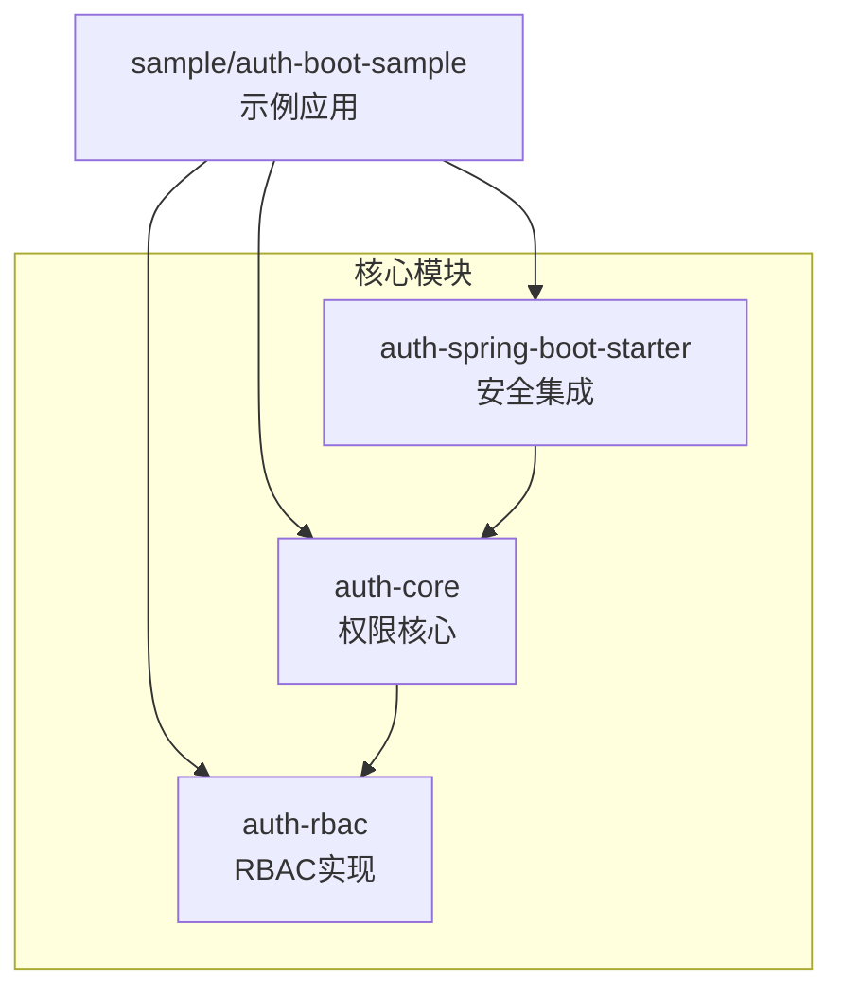
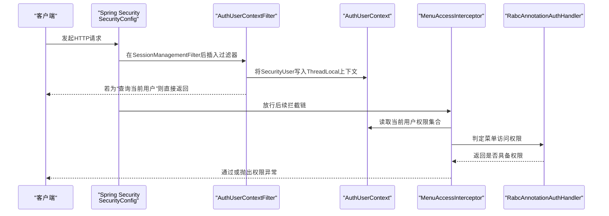
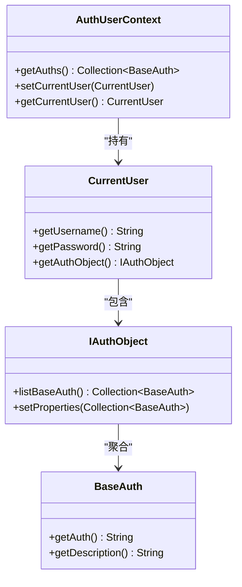
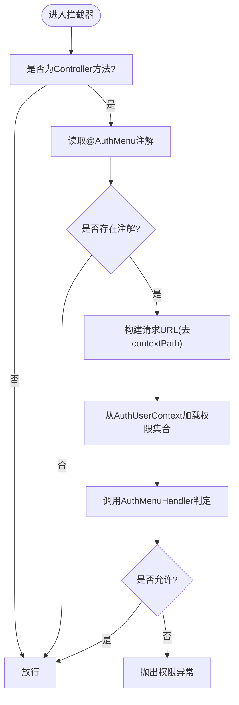
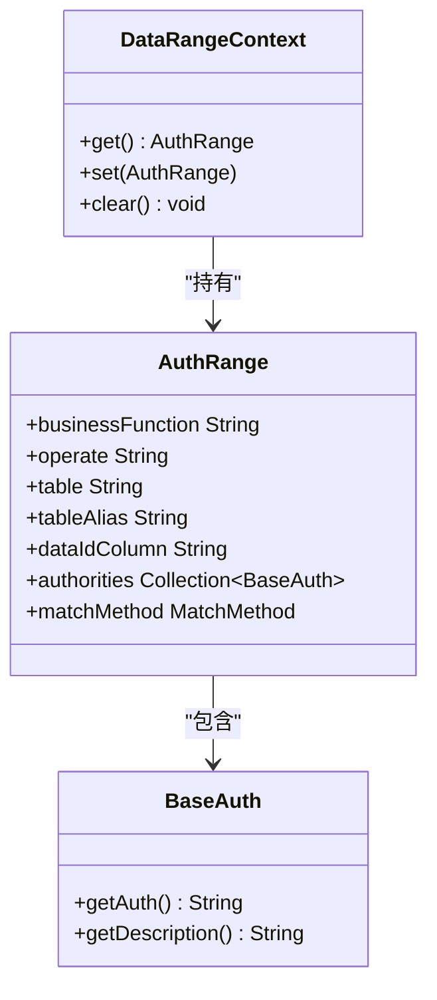
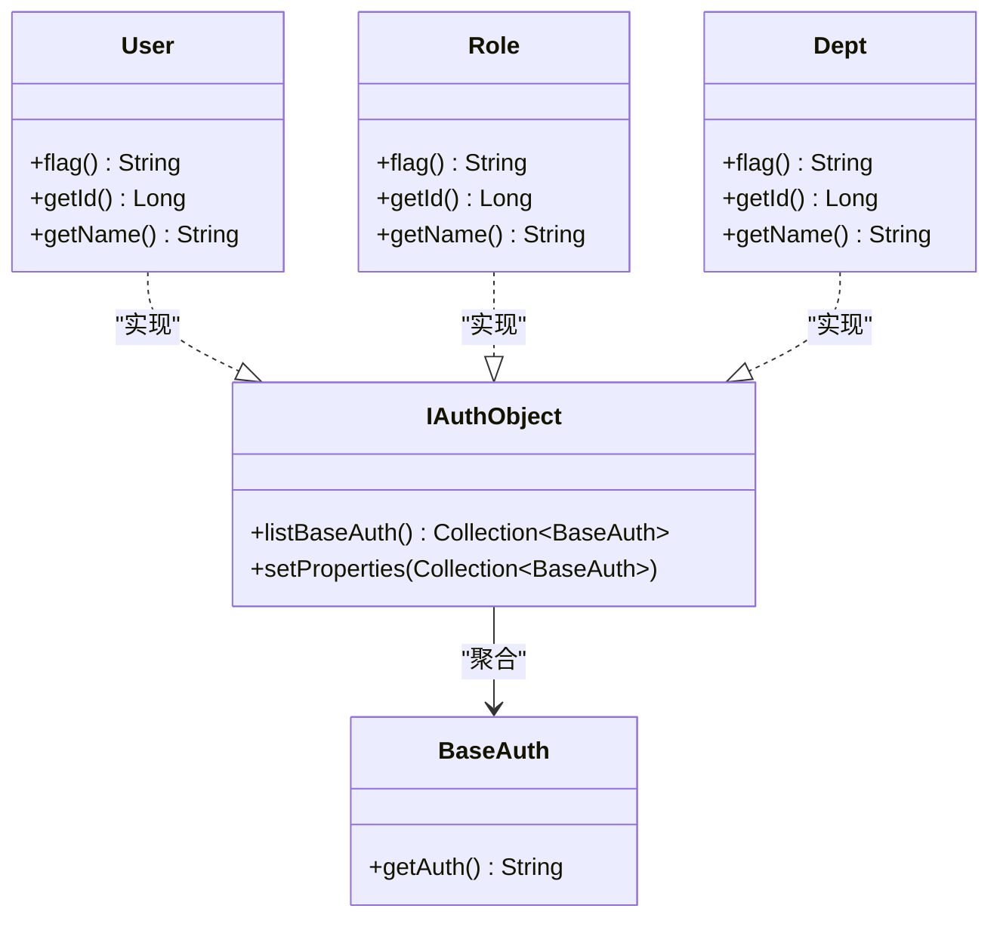
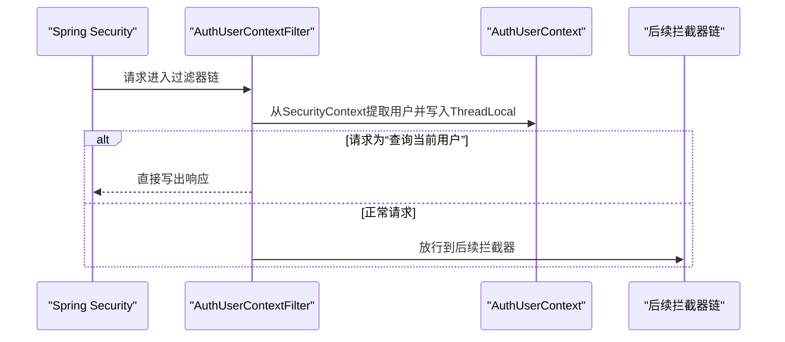
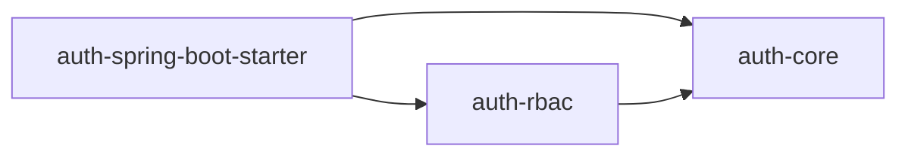

# 权限系统 (qy-auth)

<cite>
**本文引用的文件**
- [AuthUserContext.java](file://qy-auth/auth-core/src/main/java/com/kewen/framework/auth/core/AuthUserContext.java)
- [CurrentUser.java](file://qy-auth/auth-core/src/main/java/com/kewen/framework/auth/core/entity/CurrentUser.java)
- [BaseAuth.java](file://qy-auth/auth-core/src/main/java/com/kewen/framework/auth/core/entity/BaseAuth.java)
- [IAuthObject.java](file://qy-auth/auth-core/src/main/java/com/kewen/framework/auth/core/entity/IAuthObject.java)
- [AuthMenuHandler.java](file://qy-auth/auth-core/src/main/java/com/kewen/framework/auth/core/menu/AuthMenuHandler.java)
- [MenuAccessInterceptor.java](file://qy-auth/auth-core/src/main/java/com/kewen/framework/auth/core/menu/MenuAccessInterceptor.java)
- [DataRangeContext.java](file://qy-auth/auth-core/src/main/java/com/kewen/framework/auth/core/data/range/DataRangeContext.java)
- [AuthRange.java](file://qy-auth/auth-core/src/main/java/com/kewen/framework/auth/core/data/range/AuthRange.java)
- [AuthUserContextFilter.java](file://qy-auth/auth-spring-boot-starter/src/main/java/com/kewen/framework/auth/security/filter/AuthUserContextFilter.java)
- [SecurityConfig.java](file://qy-auth/auth-spring-boot-starter/src/main/java/com/kewen/framework/auth/security/config/SecurityConfig.java)
- [SecurityIgnore.java](file://qy-auth/auth-spring-boot-starter/src/main/java/com/kewen/framework/auth/security/annotation/SecurityIgnore.java)
- [RabcAnnotationAuthHandler.java](file://qy-auth/auth-rbac/src/main/java/com/kewen/framework/auth/rabc/RabcAnnotationAuthHandler.java)
- [User.java](file://qy-auth/auth-rbac/src/main/java/com/kewen/framework/auth/rabc/composite/model/User.java)
- [Role.java](file://qy-auth/auth-rbac/src/main/java/com/kewen/framework/auth/rabc/composite/model/Role.java)
- [Dept.java](file://qy-auth/auth-rbac/src/main/java/com/kewen/framework/auth/rabc/composite/model/Dept.java)
</cite>

## 目录
1. [简介](#简介)
2. [项目结构](#项目结构)
3. [核心组件](#核心组件)
4. [架构总览](#架构总览)
5. [详细组件分析](#详细组件分析)
6. [依赖分析](#依赖分析)
7. [性能考虑](#性能考虑)
8. [故障排查指南](#故障排查指南)
9. [结论](#结论)
10. [附录：权限管理API与最佳实践](#附录权限管理api与最佳实践)

## 简介
本技术文档面向 qy-auth 权限系统，聚焦 RBAC 权限模型的实现与落地，涵盖用户、角色、权限、部门等实体关系；深入解析权限上下文管理、数据范围控制、菜单权限拦截与注解校验；阐述 AuthUserContext 的 ThreadLocal 设计与用户信息传递机制；说明 Spring Security 集成的安全配置、认证过滤器与会话管理；并提供完整的权限管理 API 使用说明与最佳实践。

## 项目结构
qy-auth 采用多模块分层组织：
- auth-core：权限核心能力（上下文、菜单拦截、数据范围、基础实体）
- auth-rbac：RBAC 实现（用户/角色/部门复合对象、菜单与API映射、服务与控制器）
- auth-spring-boot-starter：Spring Security 集成（配置、过滤器、响应处理）
- 样例模块：auth-boot-sample 展示注解、菜单、数据范围等典型用法

**章节来源**
- [AuthUserContext.java:1-32](file://qy-auth/auth-core/src/main/java/com/kewen/framework/auth/core/AuthUserContext.java#L1-L32)
- [SecurityConfig.java:1-134](file://qy-auth/auth-spring-boot-starter/src/main/java/com/kewen/framework/auth/security/config/SecurityConfig.java#L1-L134)

## 核心组件
- 权限上下文与用户信息
  - AuthUserContext：基于 ThreadLocal 的用户上下文，提供当前用户与权限集合的读取与设置
  - CurrentUser：当前登录用户抽象，暴露用户名、密码与权限集合体
  - BaseAuth：权限字符串与描述的基础载体
  - IAuthObject：权限集合体接口，统一列出权限并支持按 BaseAuth 设置属性
- 菜单权限与拦截
  - AuthMenuHandler：菜单访问权限判定接口
  - MenuAccessInterceptor：基于注解的菜单权限拦截器，对标注 @AuthMenu 的方法或类生效
  - RabcAnnotationAuthHandler：基于数据库的菜单权限判定实现
- 数据范围控制
  - DataRangeContext：数据范围上下文（ThreadLocal）
  - AuthRange：范围查询定义（业务域、操作、表/别名、主键列、权限集合、匹配方式）
- 安全集成与过滤器
  - AuthUserContextFilter：在 Spring Security 会话后置入用户上下文，支持“查询当前用户”直返
  - SecurityConfig：安全配置，注册过滤器、异常处理、放行URL容器

**章节来源**
- [AuthUserContext.java:12-31](file://qy-auth/auth-core/src/main/java/com/kewen/framework/auth/core/AuthUserContext.java#L12-L31)
- [CurrentUser.java:9-14](file://qy-auth/auth-core/src/main/java/com/kewen/framework/auth/core/entity/CurrentUser.java#L9-L14)
- [BaseAuth.java:12-60](file://qy-auth/auth-core/src/main/java/com/kewen/framework/auth/core/entity/BaseAuth.java#L12-L60)
- [IAuthObject.java:14-31](file://qy-auth/auth-core/src/main/java/com/kewen/framework/auth/core/entity/IAuthObject.java#L14-L31)
- [AuthMenuHandler.java:16-35](file://qy-auth/auth-core/src/main/java/com/kewen/framework/auth/core/menu/AuthMenuHandler.java#L16-L35)
- [MenuAccessInterceptor.java:23-71](file://qy-auth/auth-core/src/main/java/com/kewen/framework/auth/core/menu/MenuAccessInterceptor.java#L23-L71)
- [RabcAnnotationAuthHandler.java:17-26](file://qy-auth/auth-rbac/src/main/java/com/kewen/framework/auth/rabc/RabcAnnotationAuthHandler.java#L17-L26)
- [DataRangeContext.java:9-23](file://qy-auth/auth-core/src/main/java/com/kewen/framework/auth/core/data/range/DataRangeContext.java#L9-L23)
- [AuthRange.java:14-48](file://qy-auth/auth-core/src/main/java/com/kewen/framework/auth/core/data/range/AuthRange.java#L14-L48)
- [AuthUserContextFilter.java:31-84](file://qy-auth/auth-spring-boot-starter/src/main/java/com/kewen/framework/auth/security/filter/AuthUserContextFilter.java#L31-L84)
- [SecurityConfig.java:34-134](file://qy-auth/auth-spring-boot-starter/src/main/java/com/kewen/framework/auth/security/config/SecurityConfig.java#L34-L134)

## 架构总览
下图展示从请求进入至权限判定与上下文注入的整体流程，以及各模块间的交互关系。

**图表来源**
- [SecurityConfig.java:107](file://qy-auth/auth-spring-boot-starter/src/main/java/com/kewen/framework/auth/security/config/SecurityConfig.java#L107)
- [AuthUserContextFilter.java:49-74](file://qy-auth/auth-spring-boot-starter/src/main/java/com/kewen/framework/auth/security/filter/AuthUserContextFilter.java#L49-L74)
- [AuthUserContext.java:18-29](file://qy-auth/auth-core/src/main/java/com/kewen/framework/auth/core/AuthUserContext.java#L18-L29)
- [MenuAccessInterceptor.java:28-61](file://qy-auth/auth-core/src/main/java/com/kewen/framework/auth/core/menu/MenuAccessInterceptor.java#L28-L61)
- [RabcAnnotationAuthHandler.java:22-25](file://qy-auth/auth-rbac/src/main/java/com/kewen/framework/auth/rabc/RabcAnnotationAuthHandler.java#L22-L25)

## 详细组件分析

### 权限上下文与用户信息传递（AuthUserContext）
- 设计要点
  - 使用 InheritableThreadLocal 存储 CurrentUser，确保父子线程可继承
  - 提供 getAuths() 统一读取当前用户权限集合
  - 提供 setCurrentUser()/getCurrentUser() 读写上下文
- 与 Spring Security 的衔接
  - 登录成功后由 AuthUserContextFilter 将 SecurityUser 写入上下文
  - 可在“查询当前用户”端点直接返回上下文中的用户信息

**图表来源**
- [AuthUserContext.java:16-31](file://qy-auth/auth-core/src/main/java/com/kewen/framework/auth/core/AuthUserContext.java#L16-L31)
- [CurrentUser.java:9-14](file://qy-auth/auth-core/src/main/java/com/kewen/framework/auth/core/entity/CurrentUser.java#L9-L14)
- [IAuthObject.java:14-31](file://qy-auth/auth-core/src/main/java/com/kewen/framework/auth/core/entity/IAuthObject.java#L14-L31)
- [BaseAuth.java:12-60](file://qy-auth/auth-core/src/main/java/com/kewen/framework/auth/core/entity/BaseAuth.java#L12-L60)

**章节来源**
- [AuthUserContext.java:12-31](file://qy-auth/auth-core/src/main/java/com/kewen/framework/auth/core/AuthUserContext.java#L12-L31)
- [CurrentUser.java:4-14](file://qy-auth/auth-core/src/main/java/com/kewen/framework/auth/core/entity/CurrentUser.java#L4-L14)
- [AuthUserContextFilter.java:49-74](file://qy-auth/auth-spring-boot-starter/src/main/java/com/kewen/framework/auth/security/filter/AuthUserContextFilter.java#L49-L74)

### 菜单权限拦截与注解校验
- 注解与拦截器
  - MenuAccessInterceptor：仅对标注 @AuthMenu 的方法或类生效，读取请求路径并调用 AuthMenuHandler 判定
  - AuthMenuHandler：菜单权限判定接口，提供基于 IAuthObject 或权限集合的判定方法
  - RabcAnnotationAuthHandler：基于数据库的菜单权限判定实现
- 路径处理
  - 去除 contextPath 后与菜单配置比对，未标注注解则跳过校验

**图表来源**
- [MenuAccessInterceptor.java:28-61](file://qy-auth/auth-core/src/main/java/com/kewen/framework/auth/core/menu/MenuAccessInterceptor.java#L28-L61)
- [AuthMenuHandler.java:27-34](file://qy-auth/auth-core/src/main/java/com/kewen/framework/auth/core/menu/AuthMenuHandler.java#L27-L34)
- [RabcAnnotationAuthHandler.java:22-25](file://qy-auth/auth-rbac/src/main/java/com/kewen/framework/auth/rabc/RabcAnnotationAuthHandler.java#L22-L25)

**章节来源**
- [MenuAccessInterceptor.java:17-71](file://qy-auth/auth-core/src/main/java/com/kewen/framework/auth/core/menu/MenuAccessInterceptor.java#L17-L71)
- [AuthMenuHandler.java:16-35](file://qy-auth/auth-core/src/main/java/com/kewen/framework/auth/core/menu/AuthMenuHandler.java#L16-L35)
- [RabcAnnotationAuthHandler.java:10-26](file://qy-auth/auth-rbac/src/main/java/com/kewen/framework/auth/rabc/RabcAnnotationAuthHandler.java#L10-L26)

### 数据范围控制（AuthRange 与 DataRangeContext）
- 设计要点
  - DataRangeContext：以 ThreadLocal 承载当前请求的数据范围上下文
  - AuthRange：定义业务域、操作类型、表/别名、主键列、权限集合、匹配方式（IN/EXISTS）
- 使用场景
  - 在查询阶段，MyBatis 拦截器或 SQL 注入器依据 AuthRange 动态拼接 where 条件，实现数据隔离

**图表来源**
- [DataRangeContext.java:9-23](file://qy-auth/auth-core/src/main/java/com/kewen/framework/auth/core/data/range/DataRangeContext.java#L9-L23)
- [AuthRange.java:14-48](file://qy-auth/auth-core/src/main/java/com/kewen/framework/auth/core/data/range/AuthRange.java#L14-L48)
- [BaseAuth.java:12-60](file://qy-auth/auth-core/src/main/java/com/kewen/framework/auth/core/entity/BaseAuth.java#L12-L60)

**章节来源**
- [DataRangeContext.java:4-23](file://qy-auth/auth-core/src/main/java/com/kewen/framework/auth/core/data/range/DataRangeContext.java#L4-L23)
- [AuthRange.java:9-48](file://qy-auth/auth-core/src/main/java/com/kewen/framework/auth/core/data/range/AuthRange.java#L9-L48)

### RBAC 实体与复合对象
- User/Role/Dept：继承抽象基类，提供唯一标志位（USER/ROLE/DEPT），作为权限标识与范围边界
- 复合对象职责
  - 将用户、角色、部门等实体整合为 IAuthObject，统一输出 BaseAuth 集合
  - 为菜单与数据范围策略提供权限来源

**图表来源**
- [User.java:10-49](file://qy-auth/auth-rbac/src/main/java/com/kewen/framework/auth/rabc/composite/model/User.java#L10-L49)
- [Role.java:14-33](file://qy-auth/auth-rbac/src/main/java/com/kewen/framework/auth/rabc/composite/model/Role.java#L14-L33)
- [Dept.java:14-36](file://qy-auth/auth-rbac/src/main/java/com/kewen/framework/auth/rabc/composite/model/Dept.java#L14-L36)
- [IAuthObject.java:14-31](file://qy-auth/auth-core/src/main/java/com/kewen/framework/auth/core/entity/IAuthObject.java#L14-L31)
- [BaseAuth.java:12-60](file://qy-auth/auth-core/src/main/java/com/kewen/framework/auth/core/entity/BaseAuth.java#L12-L60)

**章节来源**
- [User.java:3-49](file://qy-auth/auth-rbac/src/main/java/com/kewen/framework/auth/rabc/composite/model/User.java#L3-L49)
- [Role.java:3-33](file://qy-auth/auth-rbac/src/main/java/com/kewen/framework/auth/rabc/composite/model/Role.java#L3-L33)
- [Dept.java:3-36](file://qy-auth/auth-rbac/src/main/java/com/kewen/framework/auth/rabc/composite/model/Dept.java#L3-L36)
- [IAuthObject.java:8-31](file://qy-auth/auth-core/src/main/java/com/kewen/framework/auth/core/entity/IAuthObject.java#L8-L31)

### Spring Security 集成与会话管理
- 安全配置
  - 放行 URL 通过 PermitUrlContainer 注入
  - 异常处理：accessDeniedHandler 与 authenticationEntryPoint 统一由 SecurityAuthenticationExceptionResolverHandler 处理
  - 关闭 CSRF，启用跨域（可选）
- 过滤器链
  - 在 SessionManagementFilter 之后插入 AuthUserContextFilter，保证 remember-me 后也能正确注入上下文
  - “查询当前用户”端点由 AuthUserContextFilter 直接返回结果，无需进入业务拦截器

**图表来源**
- [SecurityConfig.java:84-115](file://qy-auth/auth-spring-boot-starter/src/main/java/com/kewen/framework/auth/security/config/SecurityConfig.java#L84-L115)
- [AuthUserContextFilter.java:49-74](file://qy-auth/auth-spring-boot-starter/src/main/java/com/kewen/framework/auth/security/filter/AuthUserContextFilter.java#L49-L74)

**章节来源**
- [SecurityConfig.java:34-134](file://qy-auth/auth-spring-boot-starter/src/main/java/com/kewen/framework/auth/security/config/SecurityConfig.java#L34-L134)
- [AuthUserContextFilter.java:23-84](file://qy-auth/auth-spring-boot-starter/src/main/java/com/kewen/framework/auth/security/filter/AuthUserContextFilter.java#L23-L84)

## 依赖分析
- 模块内聚与耦合
  - auth-core 为独立的权限基础设施，向下被 RBAC 与 Spring Starter 使用
  - RBAC 依赖 auth-core 的实体与菜单/数据范围接口，并提供具体实现
  - Spring Starter 依赖 auth-core 的上下文与拦截器，负责安全配置与过滤器装配
- 关键依赖关系
  - MenuAccessInterceptor 依赖 AuthMenuHandler 与 AuthUserContext
  - RabcAnnotationAuthHandler 依赖 SysAuthMenuComposite（数据库菜单判定）
  - AuthUserContextFilter 依赖 SecurityUser 与 AuthenticationSuccessResultConverter

**图表来源**
- [MenuAccessInterceptor.java:3-11](file://qy-auth/auth-core/src/main/java/com/kewen/framework/auth/core/menu/MenuAccessInterceptor.java#L3-L11)
- [RabcAnnotationAuthHandler.java:3-6](file://qy-auth/auth-rbac/src/main/java/com/kewen/framework/auth/rabc/RabcAnnotationAuthHandler.java#L3-L6)
- [AuthUserContextFilter.java:3-8](file://qy-auth/auth-spring-boot-starter/src/main/java/com/kewen/framework/auth/security/filter/AuthUserContextFilter.java#L3-L8)

**章节来源**
- [MenuAccessInterceptor.java:1-16](file://qy-auth/auth-core/src/main/java/com/kewen/framework/auth/core/menu/MenuAccessInterceptor.java#L1-L16)
- [RabcAnnotationAuthHandler.java:1-26](file://qy-auth/auth-rbac/src/main/java/com/kewen/framework/auth/rabc/RabcAnnotationAuthHandler.java#L1-L26)
- [AuthUserContextFilter.java:1-21](file://qy-auth/auth-spring-boot-starter/src/main/java/com/kewen/framework/auth/security/filter/AuthUserContextFilter.java#L1-L21)

## 性能考虑
- 线程局部存储
  - ThreadLocal/InheritableThreadLocal 降低跨层传递成本，但需注意请求结束时清理，避免内存泄漏
- 拦截器与注解
  - 仅对标注 @AuthMenu 的端点生效，减少无效校验开销
- 数据范围注入
  - 建议在查询入口设置 AuthRange，避免重复计算；匹配方式优先选择 IN，必要时使用 EXISTS 并配合索引

[本节为通用建议，无需特定文件来源]

## 故障排查指南
- 未登录或上下文为空
  - 现象：AuthUserContext.getAuths() 返回空集合，菜单拦截抛出权限异常
  - 排查：确认登录成功后 AuthUserContextFilter 已执行；检查 SecurityUser 转换器是否支持当前认证类型
- “查询当前用户”未返回
  - 现象：请求“查询当前用户”端点无响应或报错
  - 排查：确认 currentUserUrl 与请求路径一致；检查 resultResolver 输出序列化
- 菜单权限判定失败
  - 现象：标注 @AuthMenu 的端点提示无访问权限
  - 排查：确认菜单路径去除 contextPath 后与配置一致；核对 RabcAnnotationAuthHandler 的判定逻辑与菜单绑定
- 数据范围未生效
  - 现象：查询结果未按预期过滤
  - 排查：确认 DataRangeContext 已在查询前设置；核对 AuthRange 的表/列/匹配方式；检查 SQL 注入器是否正确注入

**章节来源**
- [AuthUserContextFilter.java:66-74](file://qy-auth/auth-spring-boot-starter/src/main/java/com/kewen/framework/auth/security/filter/AuthUserContextFilter.java#L66-L74)
- [MenuAccessInterceptor.java:52-60](file://qy-auth/auth-core/src/main/java/com/kewen/framework/auth/core/menu/MenuAccessInterceptor.java#L52-L60)
- [DataRangeContext.java:13-21](file://qy-auth/auth-core/src/main/java/com/kewen/framework/auth/core/data/range/DataRangeContext.java#L13-L21)

## 结论
qy-auth 通过清晰的模块划分与接口抽象，实现了 RBAC 权限模型的可扩展落地。AuthUserContext 的 ThreadLocal 设计确保了用户信息在请求生命周期内的稳定传递；菜单权限拦截与注解机制提供了细粒度的访问控制；数据范围控制结合 AuthRange 与拦截器实现业务域隔离。Spring Security 集成通过过滤器链在会话后置入上下文，简化了认证后的权限处理流程。整体架构具备良好的可维护性与扩展性。

[本节为总结，无需特定文件来源]

## 附录：权限管理API与最佳实践

### 权限注解与拦截
- @AuthMenu：标注于 Controller 方法或类上，启用菜单权限校验
- MenuAccessInterceptor：自动识别注解并调用 AuthMenuHandler 判定
- RabcAnnotationAuthHandler：基于数据库的菜单权限判定实现

使用建议
- 仅对需要菜单控制的端点添加 @AuthMenu
- 菜单路径应与实际请求路径保持一致（已自动去除 contextPath）

**章节来源**
- [MenuAccessInterceptor.java:17-44](file://qy-auth/auth-core/src/main/java/com/kewen/framework/auth/core/menu/MenuAccessInterceptor.java#L17-L44)
- [RabcAnnotationAuthHandler.java:17-26](file://qy-auth/auth-rbac/src/main/java/com/kewen/framework/auth/rabc/RabcAnnotationAuthHandler.java#L17-L26)

### 权限上下文与用户信息
- AuthUserContext：读取当前用户权限集合与设置上下文
- AuthUserContextFilter：在登录后将 SecurityUser 写入上下文，支持“查询当前用户”直返

使用建议
- 在请求开始时确保上下文已注入
- “查询当前用户”端点应与 securityProperties 中的 currentUserUrl 一致

**章节来源**
- [AuthUserContext.java:18-29](file://qy-auth/auth-core/src/main/java/com/kewen/framework/auth/core/AuthUserContext.java#L18-L29)
- [AuthUserContextFilter.java:49-74](file://qy-auth/auth-spring-boot-starter/src/main/java/com/kewen/framework/auth/security/filter/AuthUserContextFilter.java#L49-L74)

### 数据范围控制
- DataRangeContext：设置/获取当前请求的数据范围上下文
- AuthRange：定义业务域、操作、表/别名、主键列、权限集合、匹配方式

使用建议
- 在查询入口设置 AuthRange，避免重复计算
- 优先使用 IN 匹配，必要时使用 EXISTS 并确保索引

**章节来源**
- [DataRangeContext.java:13-21](file://qy-auth/auth-core/src/main/java/com/kewen/framework/auth/core/data/range/DataRangeContext.java#L13-L21)
- [AuthRange.java:16-48](file://qy-auth/auth-core/src/main/java/com/kewen/framework/auth/core/data/range/AuthRange.java#L16-L48)

### Spring Security 集成要点
- 放行 URL：通过 PermitUrlContainer 注入
- 异常处理：统一由 SecurityAuthenticationExceptionResolverHandler 处理
- 过滤器顺序：在 SessionManagementFilter 之后插入 AuthUserContextFilter
- “查询当前用户”：由 AuthUserContextFilter 直接返回

**章节来源**
- [SecurityConfig.java:84-115](file://qy-auth/auth-spring-boot-starter/src/main/java/com/kewen/framework/auth/security/config/SecurityConfig.java#L84-L115)
- [AuthUserContextFilter.java:23-84](file://qy-auth/auth-spring-boot-starter/src/main/java/com/kewen/framework/auth/security/filter/AuthUserContextFilter.java#L23-L84)

### 最佳实践
- 权限模型
  - 使用 BaseAuth 统一权限字符串格式，便于存储与比较
  - 将用户、角色、部门等实体抽象为 IAuthObject，统一输出权限集合
- 菜单与API
  - 为每个菜单配置唯一路径，避免与业务API冲突
  - 仅对关键端点启用 @AuthMenu，减少拦截器负担
- 数据范围
  - 明确业务域与操作类型，合理选择匹配方式
  - 在查询入口集中设置 AuthRange，避免分散注入
- 安全配置
  - 统一异常处理，明确区分认证与授权错误
  - 控制过滤器顺序，确保上下文在拦截器之前可用

[本节为通用建议，无需特定文件来源]