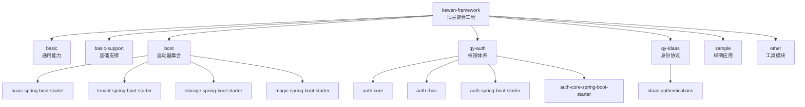
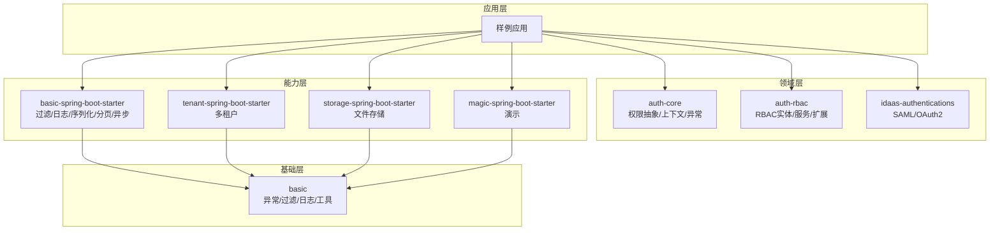
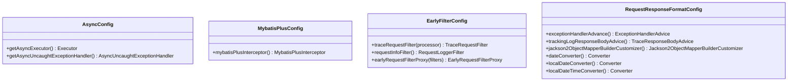
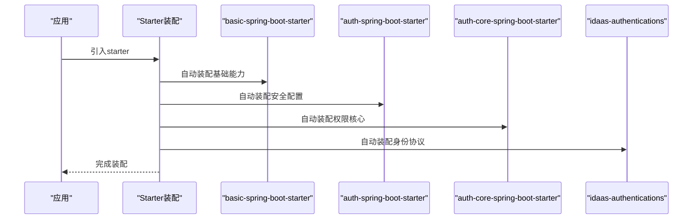
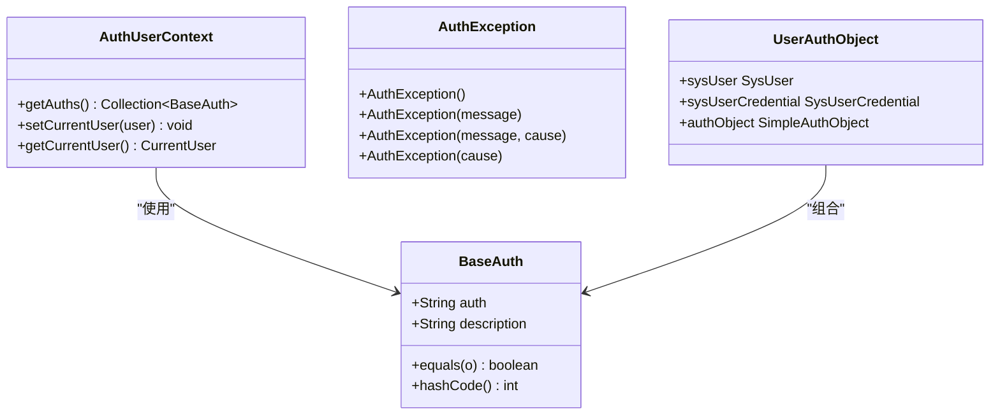
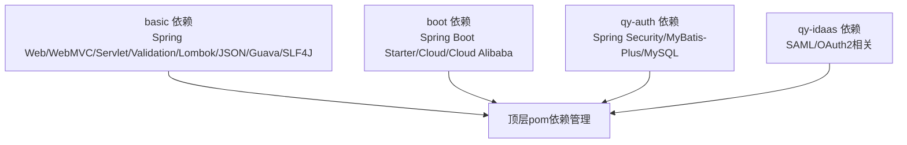

# 架构设计

<cite>
**本文引用的文件**
- [pom.xml](file://pom.xml)
- [README.md](file://README.md)
- [application.yml](file://application.yml)
- [basic/pom.xml](file://basic/pom.xml)
- [boot/pom.xml](file://boot/pom.xml)
- [qy-auth/pom.xml](file://qy-auth/pom.xml)
- [qy-idaas/pom.xml](file://qy-idaas/pom.xml)
- [spring.factories（basic）](file://boot/basic-spring-boot-starter/src/main/resources/META-INF/spring.factories)
- [spring.factories（auth）](file://qy-auth/auth-spring-boot-starter/src/main/resources/META-INF/spring.factories)
- [spring.factories（auth-core）](file://qy-auth/auth-core-spring-boot-starter/src/main/resources/META-INF/spring.factories)
- [spring.factories（idaas）](file://qy-idaas/idaas-authentications/src/main/resources/META-INF/spring.factories)
- [spring.factories（storage）](file://boot/storage-spring-boot-starter/src/main/resources/META-INF/spring.factories)
- [spring.factories（tenant）](file://boot/tenant-spring-boot-starter/src/main/resources/META-INF/spring.factories)
- [AsyncConfig.java](file://boot/basic-spring-boot-starter/src/main/java/com/kewen/framework/boot/basic/config/AsyncConfig.java)
- [MybatisPlusConfig.java](file://boot/basic-spring-boot-starter/src/main/java/com/kewen/framework/boot/basic/config/MybatisPlusConfig.java)
- [EarlyFilterConfig.java](file://boot/basic-spring-boot-starter/src/main/java/com/kewen/framework/boot/basic/config/EarlyFilterConfig.java)
- [RequestResponseFormatConfig.java](file://boot/basic-spring-boot-starter/src/main/java/com/kewen/framework/boot/basic/config/RequestResponseFormatConfig.java)
- [BaseAuth.java](file://qy-auth/auth-core/src/main/java/com/kewen/framework/auth/core/entity/BaseAuth.java)
- [AuthUserContext.java](file://qy-auth/auth-core/src/main/java/com/kewen/framework/auth/core/AuthUserContext.java)
- [AuthException.java](file://qy-auth/auth-core/src/main/java/com/kewen/framework/auth/core/exception/AuthException.java)
- [UserAuthObject.java](file://qy-auth/auth-rbac/src/main/java/com/kewen/framework/auth/rabc/model/UserAuthObject.java)
</cite>

## 目录
1. [引言](#引言)
2. [项目结构](#项目结构)
3. [核心组件](#核心组件)
4. [架构总览](#架构总览)
5. [详细组件分析](#详细组件分析)
6. [依赖分析](#依赖分析)
7. [性能考虑](#性能考虑)
8. [故障排查指南](#故障排查指南)
9. [结论](#结论)
10. [附录](#附录)

## 引言
本架构设计文档面向 kewen-framework，目标是提供高层设计、架构模式与系统边界说明；阐述模块间依赖关系与交互模式，重点覆盖 basic 基础模块、boot 启动器模块、qy-auth 权限模块、qy-idaas 协议模块的设计理念；解释技术决策、权衡与约束；给出基础设施要求、可扩展性与部署拓扑建议；并涵盖横切关注点（安全、监控、审计、灾备）及技术栈、第三方依赖与版本兼容性。

## 项目结构
kewen-framework 采用多模块聚合工程组织，顶层 pom 聚合 basic、basic-support、boot、other、qy-auth、qy-idaas 等模块，并通过 dependencyManagement 统一管理 Spring Boot、Spring Cloud、MyBatis-Plus、MySQL、Lombok、Fastjson、Hutool、P6Spy 等依赖版本。

- 顶层聚合与模块划分
  - basic：通用能力（异常、过滤器、日志链路追踪、模型、工具）
  - basic-support：基础能力的支撑（日志持久化、消息、MP 映射等）
  - boot：Spring Boot Starter 启动器集合（basic、tenant、storage、magic）
  - qy-auth：权限体系（auth-core、auth-rbac、auth-spring-boot-starter、auth-core-spring-boot-starter）
  - qy-idaas：身份协议适配（SAML/OAuth2）
  - sample：各模块样例应用
  - other：代码生成等工具模块

- 技术栈与版本要点
  - Java 8（编译与运行）
  - Spring Boot 2.7.x、Spring Cloud 2021.0.9、Spring Cloud Alibaba 2021.0.5.0
  - MyBatis-Plus 3.5.8
  - MySQL 8.0.33
  - Fastjson/Fastjson2、Hutool、Guava、Lombok
  - P6Spy 3.9.1（SQL 日志）

图表来源
- [pom.xml:20-28](file://pom.xml#L20-L28)
- [boot/pom.xml:16-21](file://boot/pom.xml#L16-L21)
- [qy-auth/pom.xml:22-28](file://qy-auth/pom.xml#L22-L28)
- [qy-idaas/pom.xml:14-16](file://qy-idaas/pom.xml#L14-L16)

章节来源
- [pom.xml:12-279](file://pom.xml#L12-L279)
- [README.md:1-38](file://README.md#L1-L38)

## 核心组件
本节聚焦四大模块的设计理念与职责边界：

- basic 基础模块
  - 职责：提供统一异常、早期请求过滤、链路追踪、请求日志、结果封装、常用工具集等横切能力，为上层业务与启动器提供一致的运行基座。
  - 关键点：异常统一处理、请求/响应序列化定制、TraceId 注入与传播、早期过滤器链路。

- boot 启动器模块
  - 职责：通过 Spring Boot 自动装配机制，按需启用 basic、tenant、storage、magic 等能力，屏蔽复杂配置，降低接入成本。
  - 关键点：spring.factories 自动装配清单、MyBatis-Plus 分页插件、异步线程池、早期过滤器、请求/响应格式化。

- qy-auth 权限模块
  - 职责：提供权限抽象、RBAC 实体与服务、菜单与 API 管理、注解式鉴权、登录认证扩展（密码/SAML/OAuth2）、会话与记住我等。
  - 关键点：BaseAuth 权限字符串规范、AuthUserContext 用户上下文、异常体系、Rabc 扩展服务。

- qy-idaas 协议模块
  - 职责：对接 SAML 与 OAuth2 身份提供商，提供配置、元数据解析、登出控制器、成功回调结果转换等。
  - 关键点：SAML 登录流程、OAuth2 登录流程、SP 元数据与 IDP 配置。

章节来源
- [spring.factories（basic）:1-7](file://boot/basic-spring-boot-starter/src/main/resources/META-INF/spring.factories#L1-L7)
- [spring.factories（auth）:1-6](file://qy-auth/auth-spring-boot-starter/src/main/resources/META-INF/spring.factories#L1-L6)
- [spring.factories（auth-core）:1-3](file://qy-auth/auth-core-spring-boot-starter/src/main/resources/META-INF/spring.factories#L1-L3)
- [spring.factories（idaas）:1-3](file://qy-idaas/idaas-authentications/src/main/resources/META-INF/spring.factories#L1-L3)

## 架构总览
kewen-framework 采用“基础能力 + 启动器 + 权限 + 协议”的分层架构：
- 基础层：basic 提供横切能力
- 能力层：boot 启动器按需装配基础与业务能力
- 领域层：qy-auth 提供权限与认证能力；qy-idaas 提供身份协议适配
- 应用层：sample 展示接入方式

图表来源
- [boot/pom.xml:16-21](file://boot/pom.xml#L16-L21)
- [qy-auth/pom.xml:22-28](file://qy-auth/pom.xml#L22-L28)
- [qy-idaas/pom.xml:14-16](file://qy-idaas/pom.xml#L14-L16)
- [spring.factories（basic）:1-7](file://boot/basic-spring-boot-starter/src/main/resources/META-INF/spring.factories#L1-L7)
- [spring.factories（auth）:1-6](file://qy-auth/auth-spring-boot-starter/src/main/resources/META-INF/spring.factories#L1-L6)
- [spring.factories（auth-core）:1-3](file://qy-auth/auth-core-spring-boot-starter/src/main/resources/META-INF/spring.factories#L1-L3)
- [spring.factories（idaas）:1-3](file://qy-idaas/idaas-authentications/src/main/resources/META-INF/spring.factories#L1-L3)

## 详细组件分析

### basic 基础模块
- 设计理念
  - 以“横切能力 + 可插拔过滤器 + 统一日志链路”为核心，确保所有业务应用在接入阶段即具备一致的可观测性与易用性。
  - 通过 EarlyRequestFilter、TraceRequestFilter、RequestLoggerFilter 构建请求生命周期的早期拦截与链路追踪。
  - 通过 RequestResponseFormatConfig 统一异常处理与序列化策略，保证对外输出的一致性。
- 关键实现
  - 异步线程池：AsyncConfig 使用固定公式计算核心/最大线程数与队列容量，拒绝策略采用 CallerRunsPolicy，避免丢弃任务。
  - MyBatis-Plus 分页：MybatisPlusConfig 注册分页插件，支持 MySQL。
  - 早期过滤器链：EarlyFilterConfig 将 Trace、请求日志、早期过滤器装配为 Bean，形成统一的前置处理链。
  - 序列化与日期转换：RequestResponseFormatConfig 定义 Jackson 全局序列化规则与日期转换器，减少重复配置。

图表来源
- [AsyncConfig.java:21-59](file://boot/basic-spring-boot-starter/src/main/java/com/kewen/framework/boot/basic/config/AsyncConfig.java#L21-L59)
- [MybatisPlusConfig.java:10-23](file://boot/basic-spring-boot-starter/src/main/java/com/kewen/framework/boot/basic/config/MybatisPlusConfig.java#L10-L23)
- [EarlyFilterConfig.java:21-47](file://boot/basic-spring-boot-starter/src/main/java/com/kewen/framework/boot/basic/config/EarlyFilterConfig.java#L21-L47)
- [RequestResponseFormatConfig.java:29-110](file://boot/basic-spring-boot-starter/src/main/java/com/kewen/framework/boot/basic/config/RequestResponseFormatConfig.java#L29-L110)

章节来源
- [AsyncConfig.java:1-60](file://boot/basic-spring-boot-starter/src/main/java/com/kewen/framework/boot/basic/config/AsyncConfig.java#L1-L60)
- [MybatisPlusConfig.java:1-24](file://boot/basic-spring-boot-starter/src/main/java/com/kewen/framework/boot/basic/config/MybatisPlusConfig.java#L1-L24)
- [EarlyFilterConfig.java:1-48](file://boot/basic-spring-boot-starter/src/main/java/com/kewen/framework/boot/basic/config/EarlyFilterConfig.java#L1-L48)
- [RequestResponseFormatConfig.java:1-111](file://boot/basic-spring-boot-starter/src/main/java/com/kewen/framework/boot/basic/config/RequestResponseFormatConfig.java#L1-L111)

### boot 启动器模块
- 设计理念
  - 通过 spring.factories 自动装配，将基础能力与业务能力解耦，使用者仅需引入对应 starter 即可获得完整能力。
  - 保持最小暴露面：每个 starter 仅装配自身所需配置，避免不必要的依赖注入。
- 关键实现
  - basic-spring-boot-starter：装配异步、基础支持、早期过滤器、消息、MyBatis-Plus、请求/响应格式化。
  - auth-spring-boot-starter：装配安全 Bean、安全配置、会话配置、密码安全配置。
  - auth-core-spring-boot-starter：装配权限核心配置与 Web 配置。
  - idaas-authentications：装配 SAML 与 OAuth2 配置。
  - tenant-spring-boot-starter：装配多租户配置与 Feign 头部拦截器。
  - storage-spring-boot-starter：装配文件存储模板与 Web 接口。

图表来源
- [spring.factories（basic）:1-7](file://boot/basic-spring-boot-starter/src/main/resources/META-INF/spring.factories#L1-L7)
- [spring.factories（auth）:1-6](file://qy-auth/auth-spring-boot-starter/src/main/resources/META-INF/spring.factories#L1-L6)
- [spring.factories（auth-core）:1-3](file://qy-auth/auth-core-spring-boot-starter/src/main/resources/META-INF/spring.factories#L1-L3)
- [spring.factories（idaas）:1-3](file://qy-idaas/idaas-authentications/src/main/resources/META-INF/spring.factories#L1-L3)

章节来源
- [spring.factories（basic）:1-7](file://boot/basic-spring-boot-starter/src/main/resources/META-INF/spring.factories#L1-L7)
- [spring.factories（auth）:1-6](file://qy-auth/auth-spring-boot-starter/src/main/resources/META-INF/spring.factories#L1-L6)
- [spring.factories（auth-core）:1-3](file://qy-auth/auth-core-spring-boot-starter/src/main/resources/META-INF/spring.factories#L1-L3)
- [spring.factories（idaas）:1-3](file://qy-idaas/idaas-authentications/src/main/resources/META-INF/spring.factories#L1-L3)

### qy-auth 权限模块
- 设计理念
  - 以 BaseAuth 作为权限字符串的统一规范，结合 AuthUserContext 在请求线程内传递当前用户与权限集合。
  - RBAC 实现通过 MP 实体与服务进行数据持久化与扩展，支持复合用户对象与菜单 API 管理。
  - 异常体系独立于业务异常，便于统一处理与区分。
- 关键实现
  - BaseAuth：权限字符串与描述的基础载体，用于构建与比较权限。
  - AuthUserContext：基于 ThreadLocal 的用户上下文，提供权限集合查询与当前用户设置。
  - AuthException：权限相关异常，便于统一捕获与处理。
  - UserAuthObject：复合用户对象，聚合用户、凭证与权限对象，便于 RBAC 扩展。

图表来源
- [BaseAuth.java:12-60](file://qy-auth/auth-core/src/main/java/com/kewen/framework/auth/core/entity/BaseAuth.java#L12-L60)
- [AuthUserContext.java:16-31](file://qy-auth/auth-core/src/main/java/com/kewen/framework/auth/core/AuthUserContext.java#L16-L31)
- [AuthException.java:8-23](file://qy-auth/auth-core/src/main/java/com/kewen/framework/auth/core/exception/AuthException.java#L8-L23)
- [UserAuthObject.java:13-17](file://qy-auth/auth-rbac/src/main/java/com/kewen/framework/auth/rabc/model/UserAuthObject.java#L13-L17)

章节来源
- [BaseAuth.java:1-61](file://qy-auth/auth-core/src/main/java/com/kewen/framework/auth/core/entity/BaseAuth.java#L1-L61)
- [AuthUserContext.java:1-32](file://qy-auth/auth-core/src/main/java/com/kewen/framework/auth/core/AuthUserContext.java#L1-L32)
- [AuthException.java:1-24](file://qy-auth/auth-core/src/main/java/com/kewen/framework/auth/core/exception/AuthException.java#L1-L24)
- [UserAuthObject.java:1-18](file://qy-auth/auth-rbac/src/main/java/com/kewen/framework/auth/rabc/model/UserAuthObject.java#L1-L18)

### qy-idaas 协议模块
- 设计理念
  - 提供 SAML 与 OAuth2 的 SP 配置与集成，支持元数据解析、登录成功结果转换、登出控制器等。
  - 通过配置文件集中管理 IDP 地址、证书、元数据资源等，简化接入流程。
- 关键实现
  - SAML：SamlConfig、IdpMetadataParser、SamlLogoutController、SamlAuthenticationSuccessResultConverter。
  - OAuth2：Oauth2Config、Oauth2OidcProperties、OauthProtocolType、RestOperationBuilder。
  - 配置项参考 application.yml 中 security.login.saml.* 与 kewen.auth.*。

章节来源
- [spring.factories（idaas）:1-3](file://qy-idaas/idaas-authentications/src/main/resources/META-INF/spring.factories#L1-L3)
- [application.yml:1-32](file://application.yml#L1-L32)

## 依赖分析
- 内聚与耦合
  - basic 为底层横切能力，被所有启动器复用，内聚高、耦合低。
  - boot 启动器通过自动装配与 spring.factories 与具体能力解耦，降低对应用的侵入。
  - qy-auth 与 qy-idaas 作为上层领域模块，依赖 basic 与 boot 能力，彼此独立。
- 外部依赖
  - Spring 生态：Spring Boot、Spring Security、Spring MVC、Spring Data。
  - ORM：MyBatis-Plus、MySQL Connector。
  - 工具库：Fastjson/Fastjson2、Hutool、Guava、Lombok、P6Spy。
- 版本兼容
  - Spring Boot 2.7.18、Spring Cloud 2021.0.9、Spring Cloud Alibaba 2021.0.5.0。
  - MyBatis-Plus 3.5.8、MySQL 8.0.33、Fastjson2 2.0.25、Hutool 5.8.18、Guava 32.1.3-jre。

图表来源
- [basic/pom.xml:20-73](file://basic/pom.xml#L20-L73)
- [pom.xml:41-256](file://pom.xml#L41-L256)

章节来源
- [pom.xml:41-256](file://pom.xml#L41-L256)
- [basic/pom.xml:20-73](file://basic/pom.xml#L20-L73)

## 性能考虑
- 异步处理
  - AsyncConfig 通过动态 CPU 核心数计算线程池大小，CallerRunsPolicy 在高负载时保护主线程，避免任务丢失。
- 数据访问
  - MybatisPlusConfig 注册分页插件，避免全表扫描；建议在高频查询场景使用索引与合理分页。
- 序列化与网络
  - RequestResponseFormatConfig 统一日期与序列化策略，减少解析开销；建议生产环境开启压缩与连接复用。
- SQL 观察
  - P6Spy 3.9.1 用于 SQL 日志输出，便于定位慢查询与异常 SQL；生产环境建议控制日志级别。

章节来源
- [AsyncConfig.java:32-49](file://boot/basic-spring-boot-starter/src/main/java/com/kewen/framework/boot/basic/config/AsyncConfig.java#L32-L49)
- [MybatisPlusConfig.java:16-22](file://boot/basic-spring-boot-starter/src/main/java/com/kewen/framework/boot/basic/config/MybatisPlusConfig.java#L16-L22)
- [RequestResponseFormatConfig.java:50-72](file://boot/basic-spring-boot-starter/src/main/java/com/kewen/framework/boot/basic/config/RequestResponseFormatConfig.java#L50-L72)
- [pom.xml:152-156](file://pom.xml#L152-L156)

## 故障排查指南
- 异常处理
  - basic 的 ExceptionHandlerAdvice 统一处理异常，建议结合 TraceId 快速定位问题。
- 权限异常
  - AuthException 用于权限相关错误，配合 AuthUserContext 获取当前用户与权限集合，辅助定位鉴权失败原因。
- 日志与追踪
  - EarlyRequestFilter、TraceRequestFilter、RequestLoggerFilter 形成早期拦截与链路追踪，建议在问题排查时检查过滤器顺序与 TraceId 传播。
- 配置校验
  - application.yml 中 security.login.saml.* 与 kewen.auth.* 为关键配置项，错误会导致认证或权限初始化失败。

章节来源
- [RequestResponseFormatConfig.java:36-43](file://boot/basic-spring-boot-starter/src/main/java/com/kewen/framework/boot/basic/config/RequestResponseFormatConfig.java#L36-L43)
- [AuthException.java:8-23](file://qy-auth/auth-core/src/main/java/com/kewen/framework/auth/core/exception/AuthException.java#L8-L23)
- [application.yml:1-32](file://application.yml#L1-L32)

## 结论
kewen-framework 通过“基础能力 + 启动器 + 权限 + 协议”的分层设计，实现了横切能力的统一与业务能力的按需装配。basic 提供一致的运行基座，boot 以自动装配降低接入成本，qy-auth 与 qy-idaas 解决权限与身份协议的关键问题。在性能、可观测性与可维护性方面，框架提供了完善的基础设施与最佳实践建议。建议在生产环境中结合实际业务规模调整线程池、分页与日志策略，并完善监控与告警体系。

## 附录
- 基础设施要求
  - JDK 8+、MySQL 8.0.33、Redis（可选，用于会话/缓存）、消息中间件（可选，用于日志持久化与通知）。
- 部署拓扑建议
  - 单体应用：直接引入相应 starter，按需装配 basic、auth、tenant、storage。
  - 微服务：以 boot 为基座，结合 Spring Cloud 与 Spring Cloud Alibaba 组件进行拆分与治理。
- 横切关注点
  - 安全：Spring Security、会话与记住我、多租户隔离。
  - 监控：P6Spy SQL 日志、请求链路追踪、异常统一处理。
  - 灾难恢复：数据库主从/备份、文件存储（七牛云）容灾、会话共享（Redis）。